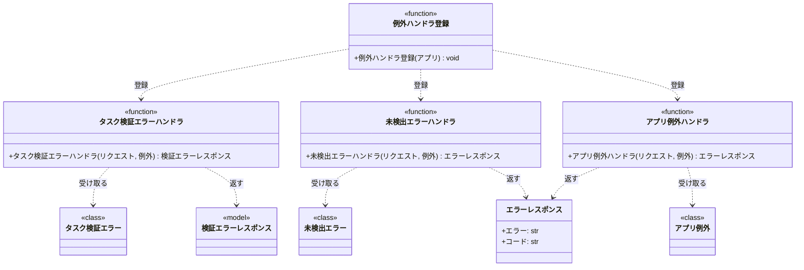
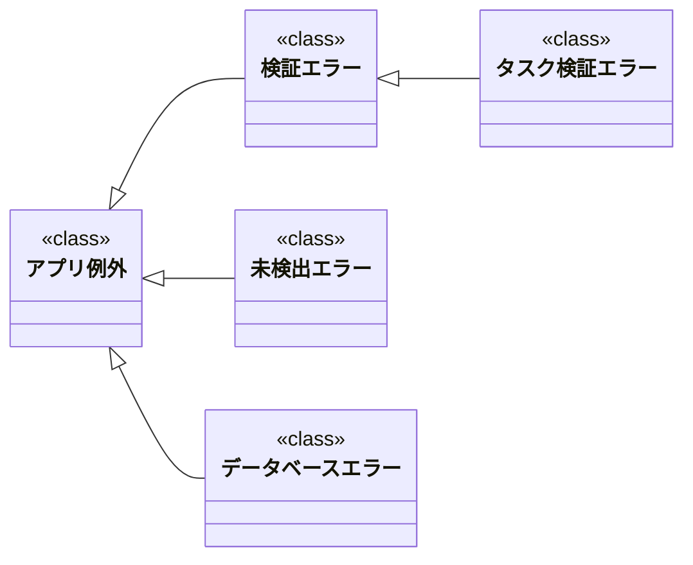

# モジュール構成: バックエンド / エラーハンドリング

`エラーハンドリング` 分類（バックエンド側）に属する構成要素詳細。
アプリ共通の例外階層と、例外を HTTP レスポンスへ変換する例外ハンドラを扱う。

- 対応テストファイル: `tests/unit/server/test_error_handlers.py`

## 一覧

| ユースケース | 役割 | コンテナ | 種別 | 名前 | 概要 | 補足 |
| --- | --- | --- | --- | --- | --- | --- |
| 共通 | 例外基底 | `shared/errors.py` | クラス | [`AppError`](#アプリ例外) | 全業務例外の基底 | - |
| 共通 | 例外 | `shared/errors.py` | クラス | [`ValidationError`](#検証エラー) | 入力検証の失敗 | `AppError` を継承 |
| 共通 | 例外 | `shared/errors.py` | クラス | [`NotFoundError`](#未検出エラー) | 対象が見つからない | `AppError` を継承 |
| 共通 | 例外 | `shared/errors.py` | クラス | [`DatabaseError`](#データベースエラー) | DB 操作の失敗 | `AppError` を継承 |
| 共通 | レスポンススキーマ | `server/schemas.py` | データモデル | [`ErrorResponse`](#エラーレスポンス) | フィールドに紐づかないエラーのボディ | `404` / `500` で使う |
| 共通 | 登録関数 | `server/error_handlers.py` | 関数 | [`register_exception_handlers`](#例外ハンドラ登録) | 例外ハンドラをアプリへ一括登録 | - |
| 共通 | ハンドラ | `server/error_handlers.py` | 関数 | [`handle_task_validation_error`](#タスク検証エラーハンドラ) | 検証エラーを `400` に変換 | - |
| 共通 | ハンドラ | `server/error_handlers.py` | 関数 | [`handle_not_found_error`](#未検出エラーハンドラ) | 未検出エラーを `404` に変換 | - |
| 共通 | ハンドラ | `server/error_handlers.py` | 関数 | [`handle_app_error`](#アプリ例外ハンドラ) | その他の業務例外を `500` に変換 | 受け皿 |

## ディレクトリ構成

```
shared/
└── errors.py            # AppError とその派生
server/
├── schemas.py           # ErrorResponse
└── error_handlers.py    # 例外 → HTTP レスポンスの変換と登録
```

## 構成図

### 例外ハンドラ



---

### アプリ例外



## アプリ例外
> 物理名: `AppError`<br>
> 種別: クラス<br>
> コンテナ: `shared/errors.py`

全業務例外の基底。

### プロパティ

なし

### メソッド

なし

### 単体テスト

なし

### 補足

- `Exception` を継承し、docstring だけを持つ空のクラスにする
- 最上位で `except AppError:` 1 つを書けば全業務例外を捕まえられる状態を保つ

## 検証エラー
> 物理名: `ValidationError`<br>
> 種別: クラス<br>
> コンテナ: `shared/errors.py`<br>
> 継承元: [`AppError`](#アプリ例外)

入力検証に失敗したことを表す例外。

### プロパティ

なし

### メソッド

なし

### 単体テスト

なし

### 補足

- フィールド単位のエラー一覧を持つ [タスク検証エラー](./タスク.py.md#タスク検証エラー) は本例外を継承する

## 未検出エラー
> 物理名: `NotFoundError`<br>
> 種別: クラス<br>
> コンテナ: `shared/errors.py`<br>
> 継承元: [`AppError`](#アプリ例外)

指定された対象が見つからないことを表す例外。

### プロパティ

なし

### メソッド

なし

### 単体テスト

なし

### 補足

- 対象の種類（タスク・ユーザー等）は例外メッセージで区別し、対象ごとの派生例外は作らない

## データベースエラー
> 物理名: `DatabaseError`<br>
> 種別: クラス<br>
> コンテナ: `shared/errors.py`<br>
> 継承元: [`AppError`](#アプリ例外)

DB 操作に失敗したことを表す例外。

### プロパティ

なし

### メソッド

なし

### 単体テスト

なし

### 補足

- 専用のハンドラを持たず [アプリ例外ハンドラ](#アプリ例外ハンドラ) が `500` に変換する

## エラーレスポンス
> 物理名: `ErrorResponse`<br>
> 種別: データモデル<br>
> コンテナ: `server/schemas.py`

フィールドに紐づかないエラー（`404` / `500`）のレスポンスボディ。

### プロパティ

| 論理名 | プロパティ名 | 型 | 可視性 | デフォルト | 説明 | 例 | 補足 |
| --- | --- | --- | --- | --- | --- | --- | --- |
| エラー | `error` | `str` | 公開 | - | 表示用のエラーメッセージ | `"タスクが見つかりません"` | 日本語 |
| コード | `code` | `str` | 公開 | - | エラーの種別 | `"task_not_found"` | 画面の分岐に使う |

### メソッド

なし

### 単体テスト

なし

### 補足

- `pydantic.BaseModel` で定義する
- フィールド単位のエラーを返す `400` は [検証エラーレスポンス](./タスク.py.md#検証エラーレスポンス) を使い、本モデルとは分ける

## `server/error_handlers.py`
> 種別: ファイル

例外を HTTP レスポンスへ変換するハンドラと、その登録関数を置くファイル。
各ハンドラは受け取った例外をレスポンスに詰め替えるだけで、業務判断は行わない。

---

### 例外ハンドラ登録
> 物理名: `register_exception_handlers`<br>
> 種別: 関数

例外ハンドラをアプリへ一括登録する。

#### 引数

| 論理名 | 引数名 | 型 | 必須 | デフォルト | 説明 | 補足 |
| --- | --- | --- | --- | --- | --- | --- |
| アプリ | `app` | `FastAPI` | ✅ | - | 登録先のアプリ | - |

引数例:

```python
register_exception_handlers(app)
```

#### 戻り値

| 型 | 説明 | 補足 |
| --- | --- | --- |
| `None` | なし | - |

#### 処理

1. [タスク検証エラーハンドラ](#タスク検証エラーハンドラ) を `TaskValidationError` に対して登録する
2. [未検出エラーハンドラ](#未検出エラーハンドラ) を `NotFoundError` に対して登録する
3. [アプリ例外ハンドラ](#アプリ例外ハンドラ) を `AppError` に対して登録する

#### 例外

なし

#### 単体テスト

| テスト名 | 正常/異常 | 概要 | 条件 | Mock | 期待値 | 補足 |
| --- | --- | --- | --- | --- | --- | --- |
| `test_register_exception_handlers` | 正常 | 3 種の例外が登録される | 空の `FastAPI` を渡す | なし | 3 つの例外型がハンドラ表に登録される | 登録順が具体 → 汎用であることも確認 |

---

### タスク検証エラーハンドラ
> 物理名: `handle_task_validation_error`<br>
> 種別: 関数

[タスク検証エラー](./タスク.py.md#タスク検証エラー) を `400` のレスポンスへ変換する。

#### 引数

| 論理名 | 引数名 | 型 | 必須 | デフォルト | 説明 | 補足 |
| --- | --- | --- | --- | --- | --- | --- |
| リクエスト | `request` | `Request` | ✅ | - | 発生元のリクエスト | 変換には使わない（FastAPI の規定シグネチャ） |
| 例外 | `exc` | [`TaskValidationError`](./タスク.py.md#タスク検証エラー) | ✅ | - | 送出された例外 | - |

引数例:

```python
handle_task_validation_error(request, TaskValidationError(errors=[FieldError(field="title", code="required", message="タスク名を入力してください")]))
```

#### 戻り値

| 型 | 説明 | 補足 |
| --- | --- | --- |
| `JSONResponse` | `400` と [検証エラーレスポンス](./タスク.py.md#検証エラーレスポンス) | - |

戻り値例:

```python
JSONResponse(status_code=400, content={"errors": [{"field": "title", "code": "required", "message": "タスク名を入力してください"}]})
```

#### 処理

1. 例外の `errors` から [検証エラーレスポンス](./タスク.py.md#検証エラーレスポンス) を組み立てる
2. `400` を付けて返す

#### 例外

なし

#### 単体テスト

| テスト名 | 正常/異常 | 概要 | 条件 | Mock | 期待値 | 補足 |
| --- | --- | --- | --- | --- | --- | --- |
| `test_handle_task_validation_error` | 正常 | エラー 1 件を変換 | `errors` が 1 件 | なし | `400` と `errors` 1 件のボディを返す | - |
| `test_handle_task_validation_error_when_multiple_errors` | 正常 | エラー複数件を変換 | `errors` が 2 件 | なし | `400` と `errors` 2 件のボディを返す | 打ち切らずに全件載せる |

---

### 未検出エラーハンドラ
> 物理名: `handle_not_found_error`<br>
> 種別: 関数

[未検出エラー](#未検出エラー) を `404` のレスポンスへ変換する。

#### 引数

| 論理名 | 引数名 | 型 | 必須 | デフォルト | 説明 | 補足 |
| --- | --- | --- | --- | --- | --- | --- |
| リクエスト | `request` | `Request` | ✅ | - | 発生元のリクエスト | 変換には使わない（FastAPI の規定シグネチャ） |
| 例外 | `exc` | [`NotFoundError`](#未検出エラー) | ✅ | - | 送出された例外 | - |

引数例:

```python
handle_not_found_error(request, NotFoundError("タスクが見つかりません: 3f2b1c88-..."))
```

#### 戻り値

| 型 | 説明 | 補足 |
| --- | --- | --- |
| `JSONResponse` | `404` と [エラーレスポンス](#エラーレスポンス) | - |

戻り値例:

```python
JSONResponse(status_code=404, content={"error": "タスクが見つかりません", "code": "task_not_found"})
```

#### 処理

1. 例外のメッセージと `task_not_found` から [エラーレスポンス](#エラーレスポンス) を組み立てる
2. `404` を付けて返す

#### 例外

なし

#### 単体テスト

| テスト名 | 正常/異常 | 概要 | 条件 | Mock | 期待値 | 補足 |
| --- | --- | --- | --- | --- | --- | --- |
| `test_handle_not_found_error` | 正常 | 未検出を 404 に変換 | `NotFoundError` を渡す | なし | `404` と `code` が `task_not_found` のボディを返す | - |

---

### アプリ例外ハンドラ
> 物理名: `handle_app_error`<br>
> 種別: 関数

専用ハンドラを持たない業務例外を `500` のレスポンスへ変換する。

#### 引数

| 論理名 | 引数名 | 型 | 必須 | デフォルト | 説明 | 補足 |
| --- | --- | --- | --- | --- | --- | --- |
| リクエスト | `request` | `Request` | ✅ | - | 発生元のリクエスト | 変換には使わない（FastAPI の規定シグネチャ） |
| 例外 | `exc` | [`AppError`](#アプリ例外) | ✅ | - | 送出された例外 | [データベースエラー](#データベースエラー) もここに来る |

引数例:

```python
handle_app_error(request, DatabaseError("タスクの保存に失敗しました: 3f2b1c88-..."))
```

#### 戻り値

| 型 | 説明 | 補足 |
| --- | --- | --- |
| `JSONResponse` | `500` と [エラーレスポンス](#エラーレスポンス) | - |

戻り値例:

```python
JSONResponse(status_code=500, content={"error": "サーバー内部でエラーが発生しました", "code": "internal_error"})
```

#### 処理

1. 例外の内容をログに出す
   - `[ERROR]` 業務例外を 500 に変換した（例外クラス名 / リクエストパス）
2. 固定メッセージと `internal_error` から [エラーレスポンス](#エラーレスポンス) を組み立てて `500` を付けて返す

#### 例外

なし

#### 単体テスト

| テスト名 | 正常/異常 | 概要 | 条件 | Mock | 期待値 | 補足 |
| --- | --- | --- | --- | --- | --- | --- |
| `test_handle_app_error` | 正常 | 業務例外を 500 に変換 | `DatabaseError` を渡す | なし | `500` と `code` が `internal_error` のボディを返す | - |

### 補足

- レスポンスに例外のメッセージをそのまま載せるのは `404` までとし、`500` は固定メッセージにする（内部情報を外に出さないため）
- ハンドラは `register_exception_handlers` から具体 → 汎用の順で登録する（`AppError` を先に登録すると派生例外が全て `500` になる）
