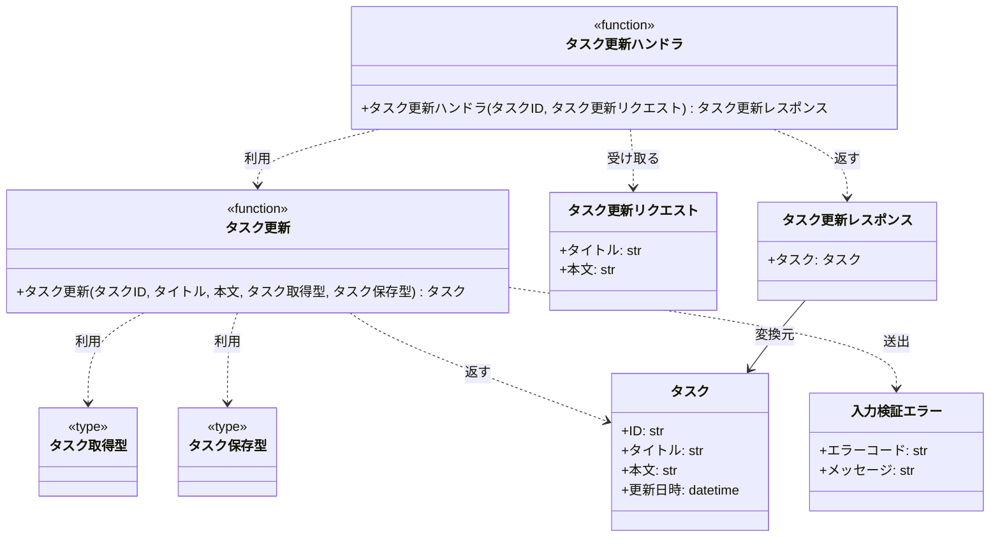
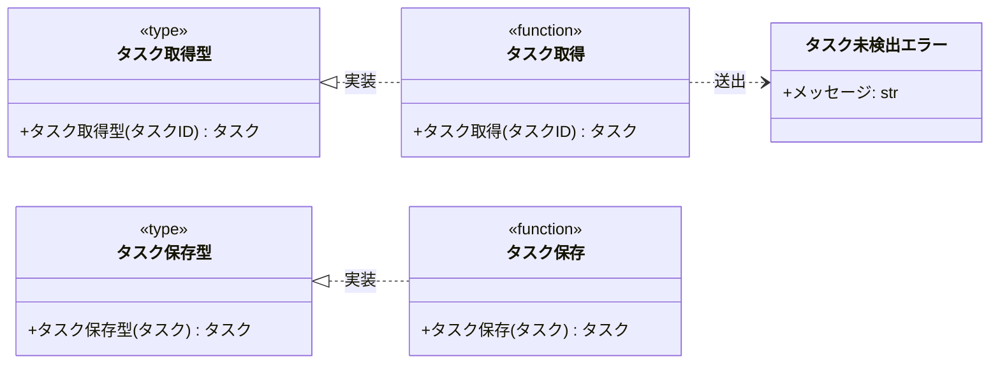

# モジュール構成: バックエンド / タスク

`タスク` ドメイン（バックエンド側）に属する構成要素詳細。

- 対応テストファイル: -

## 一覧

| ユースケース | 役割 | コンテナ | 種別 | 名前 | 概要 | 補足 |
| --- | --- | --- | --- | --- | --- | --- |
| 共通 | ドメインモデル | `src/tasks/models.py` | データモデル | [`Task`](#タスク) | タスク 1 件 | - |
| 共通 | 例外 | `src/tasks/errors.py` | クラス | [`ValidationError`](#入力検証エラー) | 入力値が制約を満たさない | - |
| 共通 | 例外 | `src/tasks/errors.py` | クラス | [`TaskNotFoundError`](#タスク未検出エラー) | 指定 ID のタスクが存在しない | - |
| タスク更新 | リクエストスキーマ | `src/tasks/schemas.py` | データモデル | [`UpdateTaskRequest`](#タスク更新リクエスト) | 更新リクエストのボディ | - |
| タスク更新 | レスポンススキーマ | `src/tasks/schemas.py` | データモデル | [`UpdateTaskResponse`](#タスク更新レスポンス) | 更新レスポンスのボディ | - |
| タスク更新 | 取得型（DI） | `src/tasks/types.py` | 関数型 | [`FindTask`](#タスク取得型) | タスク取得のシグネチャ型 | DI / Mock 差し替え用 |
| タスク更新 | 保存型（DI） | `src/tasks/types.py` | 関数型 | [`SaveTask`](#タスク保存型) | タスク保存のシグネチャ型 | DI / Mock 差し替え用 |
| タスク更新 | リポジトリ | `src/tasks/db.py` | 関数 | [`find_task`](#タスク取得) | ID でタスクを 1 件取得 | - |
| タスク更新 | リポジトリ | `src/tasks/db.py` | 関数 | [`save_task`](#タスク保存) | タスクの更新内容を書き戻す | - |
| タスク更新 | 定数 | `src/tasks/service.py` | 定数 | `TITLE_MIN_LENGTH` | タイトルの最小文字数（1） | - |
| タスク更新 | 定数 | `src/tasks/service.py` | 定数 | `TITLE_MAX_LENGTH` | タイトルの最大文字数（100） | - |
| タスク更新 | 定数 | `src/tasks/service.py` | 定数 | `CONTENT_MAX_LENGTH` | 本文の最大文字数（1000） | - |
| タスク更新 | サービス | `src/tasks/service.py` | 関数 | [`update_task`](#タスク更新) | タイトルと本文を更新して返す | - |
| タスク更新 | ハンドラ | `src/tasks/route.py` | 関数 | [`update_task_route`](#タスク更新ハンドラ) | PATCH /tasks/{task_id} の受け口 | - |

## ディレクトリ構成

```
src/tasks/
├── models.py     # Task
├── errors.py     # ValidationError / TaskNotFoundError
├── schemas.py    # UpdateTaskRequest / UpdateTaskResponse
├── types.py      # FindTask / SaveTask
├── db.py         # find_task / save_task
├── service.py    # 検証の定数と update_task
└── route.py      # update_task_route
```

## 構成図

### タスク更新



### タスク永続化



## タスク
> 物理名: `Task`<br>
> 種別: データモデル<br>
> コンテナ: `src/tasks/models.py`

タスク 1 件。
`tasks` テーブルの 1 行に対応する。

### プロパティ

| 論理名 | プロパティ名 | 型 | 可視性 | デフォルト | 説明 | 例 | 補足 |
| --- | --- | --- | --- | --- | --- | --- | --- |
| ID | `id` | `str` | 公開 | - | タスクの一意 ID | `"018f8a3c-1c2f-7a10-9f3d-2b6c9a51e0a4"` | 更新できない |
| タイトル | `title` | `str` | 公開 | - | タスクのタイトル | `"決算資料の作成"` | 1 文字以上 100 文字以内 |
| 本文 | `content` | `str` | 公開 | `""` | タスクの本文 | `"四半期の売上を集計する"` | 1000 文字以内 |
| 更新日時 | `updated_at` | `datetime` | 公開 | - | 最終更新日時 (UTC) | `datetime(2026, 8, 5, 6, 30, tzinfo=UTC)` | 保存時に詰め直す |

### メソッド

なし

### 単体テスト

なし

### 補足

- `@dataclass(frozen=True, slots=True, kw_only=True)` の不変オブジェクトとして扱い、更新は差し替えた新しいインスタンスで表す
- `created_at` は本ユースケースで参照しないため保持しない

## 入力検証エラー
> 物理名: `ValidationError`<br>
> 種別: クラス<br>
> コンテナ: `src/tasks/errors.py`

入力値が制約を満たさないときに送出する例外。
インターフェース境界では `400` に対応させる。

### プロパティ

| 論理名 | プロパティ名 | 型 | 可視性 | デフォルト | 説明 | 例 | 補足 |
| --- | --- | --- | --- | --- | --- | --- | --- |
| エラーコード | `code` | `Literal["invalid_title", "invalid_content"]` | 公開 | - | どのフィールドが制約違反かを表すコード | `"invalid_title"` | レスポンスのエラーコードにそのまま使う |
| メッセージ | `args[0]` | `str` | 公開 | - | 例外メッセージ | `"title は 1 文字以上 100 文字以内です"` | `Exception` の標準の持ち方 |

### メソッド

なし

### 単体テスト

なし

## タスク未検出エラー
> 物理名: `TaskNotFoundError`<br>
> 種別: クラス<br>
> コンテナ: `src/tasks/errors.py`

指定 ID のタスクが存在しないときに送出する例外。
インターフェース境界では `404` に対応させる。

### プロパティ

| 論理名 | プロパティ名 | 型 | 可視性 | デフォルト | 説明 | 例 | 補足 |
| --- | --- | --- | --- | --- | --- | --- | --- |
| メッセージ | `args[0]` | `str` | 公開 | - | 例外メッセージ | `"タスクが見つかりません: 018f8a3c-..."` | `Exception` の標準の持ち方 |

### メソッド

なし

### 単体テスト

なし

## タスク更新リクエスト
> 物理名: `UpdateTaskRequest`<br>
> 種別: データモデル<br>
> コンテナ: `src/tasks/schemas.py`

PATCH /tasks/{task_id} のリクエストボディ。

### プロパティ

| 論理名 | プロパティ名 | 型 | 可視性 | デフォルト | 説明 | 例 | 補足 |
| --- | --- | --- | --- | --- | --- | --- | --- |
| タイトル | `title` | `str` | 公開 | - | 更新後のタイトル | `"決算資料の作成"` | 文字数の検証は [タスク更新](#タスク更新) が行う |
| 本文 | `content` | `str \| None` | 公開 | `None` | 更新後の本文 | `"四半期の売上を集計する"` | `None` は更新前の本文を維持 |

### メソッド

なし

### 単体テスト

なし

### 補足

- `pydantic.BaseModel` として定義し、型と必須有無だけを担保する（文字数の上下限はサービス側の検証に寄せてエラーコードを一本化する）

## タスク更新レスポンス
> 物理名: `UpdateTaskResponse`<br>
> 種別: データモデル<br>
> コンテナ: `src/tasks/schemas.py`

PATCH /tasks/{task_id} のレスポンスボディ。

### プロパティ

| 論理名 | プロパティ名 | 型 | 可視性 | デフォルト | 説明 | 例 | 補足 |
| --- | --- | --- | --- | --- | --- | --- | --- |
| タスク | `task` | `TaskBody` | 公開 | - | 更新後のタスク | - | 入れ子のオブジェクト |
| タスク ID | `task.id` | `str` | 公開 | - | タスクの一意 ID | `"018f8a3c-1c2f-7a10-9f3d-2b6c9a51e0a4"` | - |
| タスクタイトル | `task.title` | `str` | 公開 | - | 更新後のタイトル | `"決算資料の作成"` | - |
| タスク本文 | `task.content` | `str` | 公開 | - | 更新後の本文 | `"四半期の売上を集計する"` | - |
| タスク更新日時 | `task.updated_at` | `datetime` | 公開 | - | 更新日時 (UTC) | `datetime(2026, 8, 5, 6, 30, tzinfo=UTC)` | JSON では ISO 8601 文字列 |

### メソッド

なし

### 単体テスト

なし

### 補足

- [タスク](#タスク) から変換して組み立てる（変換は [タスク更新ハンドラ](#タスク更新ハンドラ) が行う）

## `src/tasks/types.py`
> 種別: ファイル

タスクの永続化操作を差し替えるための関数型を置くファイル。

---

### タスク取得型
> 物理名: `FindTask`<br>
> 種別: 関数型

ID でタスクを 1 件取得する関数のシグネチャ。
DI / Mock 差し替え用。

#### 引数

| 論理名 | 引数名 | 型 | 必須 | デフォルト | 説明 | 補足 |
| --- | --- | --- | --- | --- | --- | --- |
| タスク ID | `task_id` | `str` | ✅ | - | 取得対象のタスク ID | - |

#### 戻り値

| 型 | 説明 | 補足 |
| --- | --- | --- |
| [`Task`](#タスク) | 取得したタスク | 見つからない場合は `TaskNotFoundError` を送出する契約 |

#### 実装

| 実装 | 補足 |
| --- | --- |
| [タスク取得](#タスク取得) | 本番の実装（PostgreSQL から取得） |

---

### タスク保存型
> 物理名: `SaveTask`<br>
> 種別: 関数型

タスクの更新内容を書き戻す関数のシグネチャ。
DI / Mock 差し替え用。

#### 引数

| 論理名 | 引数名 | 型 | 必須 | デフォルト | 説明 | 補足 |
| --- | --- | --- | --- | --- | --- | --- |
| タスク | `task` | [`Task`](#タスク) | ✅ | - | 書き戻す内容 | `id` で対象行を特定する |

#### 戻り値

| 型 | 説明 | 補足 |
| --- | --- | --- |
| [`Task`](#タスク) | 保存後のタスク | 保存時に詰めた `updated_at` を含む |

#### 実装

| 実装 | 補足 |
| --- | --- |
| [タスク保存](#タスク保存) | 本番の実装（PostgreSQL へ更新） |

## `src/tasks/db.py`
> 種別: ファイル

`tasks` テーブルへのアクセスを束ねる関数ファイル。
SQL を書くのは本ファイルだけに閉じる。

---

### タスク取得
> 物理名: `find_task`<br>
> 種別: 関数<br>
> 継承元: [`FindTask`](#タスク取得型)

ID で `tasks` から 1 行取得して [タスク](#タスク) に変換する。

#### 引数

| 論理名 | 引数名 | 型 | 必須 | デフォルト | 説明 | 補足 |
| --- | --- | --- | --- | --- | --- | --- |
| タスク ID | `task_id` | `str` | ✅ | - | 取得対象のタスク ID | - |

引数例:

```python
find_task("018f8a3c-1c2f-7a10-9f3d-2b6c9a51e0a4")
```

#### 戻り値

| 型 | 説明 | 補足 |
| --- | --- | --- |
| [`Task`](#タスク) | 取得したタスク | - |

戻り値例:

```python
Task(
    id="018f8a3c-1c2f-7a10-9f3d-2b6c9a51e0a4",
    title="決算資料の作成",
    content="四半期の売上を集計する",
    updated_at=datetime(2026, 8, 5, 5, 0, tzinfo=UTC),
)
```

#### 処理

1. `id` を条件に `tasks` から 1 行を SELECT する
2. 取得結果で返す値を確定する
   - 行が無い場合、`TaskNotFoundError` を投げる
   - 行がある場合、[タスク](#タスク) に詰め替えて返す

#### 例外

| 例外名 | 発生条件 | メッセージ | 補足 |
| --- | --- | --- | --- |
| `TaskNotFoundError` | `task_id` に一致する行が `tasks` に無い | `"タスクが見つかりません: {task_id}"` | - |

#### 単体テスト

セットアップ:

| セットアップ | 説明 | 補足 |
| --- | --- | --- |
| タスク行 | `tasks` に 1 行だけ登録した DB stub | `task_row` fixture |

| テスト名 | 正常/異常 | 概要 | 条件 | Mock | 期待値 | 補足 |
| --- | --- | --- | --- | --- | --- | --- |
| `test_find_task` | 正常 | 登録済み ID で取得できる | `task_id` に登録済みの ID を渡す | PostgreSQL | 登録内容と一致する `Task` を返す | - |
| `test_find_task_when_task_missing` | 異常 | 未登録 ID で取得できない | `task_id` に未登録の ID を渡す | PostgreSQL | `TaskNotFoundError` を送出 | 例外表「一致する行が無い」に対応 |

---

### タスク保存
> 物理名: `save_task`<br>
> 種別: 関数<br>
> 継承元: [`SaveTask`](#タスク保存型)

[タスク](#タスク) の内容を `tasks` の該当行へ書き戻す。

#### 引数

| 論理名 | 引数名 | 型 | 必須 | デフォルト | 説明 | 補足 |
| --- | --- | --- | --- | --- | --- | --- |
| タスク | `task` | [`Task`](#タスク) | ✅ | - | 書き戻す内容 | `id` で対象行を特定する |

引数例:

```python
save_task(
    Task(
        id="018f8a3c-1c2f-7a10-9f3d-2b6c9a51e0a4",
        title="決算資料の作成",
        content="四半期の売上を集計する",
        updated_at=datetime(2026, 8, 5, 5, 0, tzinfo=UTC),
    )
)
```

#### 戻り値

| 型 | 説明 | 補足 |
| --- | --- | --- |
| [`Task`](#タスク) | 保存後のタスク | `updated_at` は本関数で詰めた値 |

戻り値例:

```python
Task(
    id="018f8a3c-1c2f-7a10-9f3d-2b6c9a51e0a4",
    title="決算資料の作成",
    content="四半期の売上を集計する",
    updated_at=datetime(2026, 8, 5, 6, 30, tzinfo=UTC),
)
```

#### 処理

1. 現在時刻 (UTC) を求めて更新日時にする
2. `id` を条件に `tasks` の `title` / `content` / `updated_at` を UPDATE する
3. 更新日時を差し替えた [タスク](#タスク) を返す

#### 例外

なし

#### 単体テスト

セットアップ:

| セットアップ | 説明 | 補足 |
| --- | --- | --- |
| タスク行 | `tasks` に 1 行だけ登録した DB stub | `task_row` fixture |

| テスト名 | 正常/異常 | 概要 | 条件 | Mock | 期待値 | 補足 |
| --- | --- | --- | --- | --- | --- | --- |
| `test_save_task` | 正常 | 内容を書き戻せる | タイトルと本文を変えた `Task` を渡す | PostgreSQL | 渡した内容で行が更新され、`updated_at` が更新前より後の時刻になる | - |

## `src/tasks/service.py`
> 種別: ファイル

タスク更新のドメインロジックを束ねる関数ファイル。
文字数の上下限は本ファイルのモジュール定数（`TITLE_MIN_LENGTH` / `TITLE_MAX_LENGTH` / `CONTENT_MAX_LENGTH`）で持つ。

---

### タスク更新
> 物理名: `update_task`<br>
> 種別: 関数

登録済みタスクのタイトルと本文を更新し、更新後のタスクを返す。

#### 引数

| 論理名 | 引数名 | 型 | 必須 | デフォルト | 説明 | 補足 |
| --- | --- | --- | --- | --- | --- | --- |
| タスク ID | `task_id` | `str` | ✅ | - | 更新対象のタスク ID | - |
| タイトル | `title` | `str` | ✅ | - | 更新後のタイトル | キーワード専用引数 |
| 本文 | `content` | `str \| None` | - | `None` | 更新後の本文 | キーワード専用引数。`None` は更新前の本文を維持 |
| タスク取得 | `find` | [`FindTask`](#タスク取得型) | ✅ | - | 更新対象を取得する関数 | キーワード専用引数。DI |
| タスク保存 | `save` | [`SaveTask`](#タスク保存型) | ✅ | - | 更新内容を書き戻す関数 | キーワード専用引数。DI |

引数例:

```python
update_task(
    "018f8a3c-1c2f-7a10-9f3d-2b6c9a51e0a4",
    title="決算資料の作成",
    content="四半期の売上を集計する",
    find=find_task,
    save=save_task,
)
```

#### 戻り値

| 型 | 説明 | 補足 |
| --- | --- | --- |
| [`Task`](#タスク) | 更新後のタスク | 保存後の `updated_at` を含む |

戻り値例:

```python
Task(
    id="018f8a3c-1c2f-7a10-9f3d-2b6c9a51e0a4",
    title="決算資料の作成",
    content="四半期の売上を集計する",
    updated_at=datetime(2026, 8, 5, 6, 30, tzinfo=UTC),
)
```

#### 処理

1. タイトルの文字数を検証する
   - `TITLE_MIN_LENGTH` 未満 or `TITLE_MAX_LENGTH` 超の場合、`invalid_title` の `ValidationError` を投げる
2. 本文の文字数を検証する
   - `content` が `None` の場合、検証しない（更新前の本文を引き継ぐため）
   - `CONTENT_MAX_LENGTH` 超の場合、`invalid_content` の `ValidationError` を投げる
3. 更新対象のタスクを取得する（`find`）
4. 更新後の本文を確定する
   - `content` が `None` の場合、取得したタスクの本文を使う
   - `content` が `None` でない場合、その値を使う
5. ID を引き継いだ新しいタスクを作り、書き戻して返す（`save`）
   - `[INFO]` タスクを更新した（`task_id` / `title` の文字数 / `content` の文字数）

#### 例外

| 例外名 | 発生条件 | メッセージ | 補足 |
| --- | --- | --- | --- |
| `ValidationError` | `title` が `TITLE_MIN_LENGTH` 未満 or `TITLE_MAX_LENGTH` 超 | `"title は 1 文字以上 100 文字以内です"` | `code` は `invalid_title` |
| `ValidationError` | `content` が `CONTENT_MAX_LENGTH` 超 | `"content は 1000 文字以内です"` | `code` は `invalid_content` |
| `TaskNotFoundError` | `task_id` に一致するタスクが無い | `"タスクが見つかりません: {task_id}"` | [タスク取得](#タスク取得) から伝播 |

#### 単体テスト

セットアップ:

| セットアップ | 説明 | 補足 |
| --- | --- | --- |
| タスク | タイトル・本文とも設定済みのタスクを返す `find` と、渡された値を記録する `save` | `find_stub` / `save_spy` fixture |

| テスト名 | 正常/異常 | 概要 | 条件 | Mock | 期待値 | 補足 |
| --- | --- | --- | --- | --- | --- | --- |
| `test_update_task` | 正常 | タイトルと本文を更新できる | `title` と `content` の両方を渡す | `find` / `save` | 渡した値の `Task` を返し、`save` に同じ値が渡る | - |
| `test_update_task_when_content_omitted` | 正常 | 本文を省略すると更新前の値を維持する | `content` を渡さない | `find` / `save` | 本文が更新前のままの `Task` を返し、`save` にもその値が渡る | 処理ステップ 4 の分岐に対応 |
| `test_update_task_when_title_empty` | 異常 | 空のタイトルを弾く | `title` に `""` を渡す | `find` / `save` | `code` が `invalid_title` の `ValidationError` を送出し、`save` は呼ばれない | 例外表「`title` が下限未満」に対応 |
| `test_update_task_when_title_too_long` | 異常 | 上限超のタイトルを弾く | `title` に 101 文字を渡す | `find` / `save` | `code` が `invalid_title` の `ValidationError` を送出し、`save` は呼ばれない | 例外表「`title` が上限超」に対応 |
| `test_update_task_when_content_too_long` | 異常 | 上限超の本文を弾く | `content` に 1001 文字を渡す | `find` / `save` | `code` が `invalid_content` の `ValidationError` を送出し、`save` は呼ばれない | 例外表「`content` が上限超」に対応 |
| `test_update_task_when_task_missing` | 異常 | 未登録 ID を更新できない | `find` が `TaskNotFoundError` を送出する | `find` / `save` | `TaskNotFoundError` をそのまま伝播し、`save` は呼ばれない | [タスク取得](#タスク取得) からの伝播を代表で確認 |

### 補足

- 検証はタスクを取得する前に行い、存在しないタスクでも入力エラーを先に返す

## `src/tasks/route.py`
> 種別: ファイル

タスクの HTTP エンドポイントを定義するファイル。

---

### タスク更新ハンドラ
> 物理名: `update_task_route`<br>
> 種別: 関数

PATCH /tasks/{task_id} の受け口。
リクエストを [タスク更新](#タスク更新) に渡し、結果を [タスク更新レスポンス](#タスク更新レスポンス) に詰めて返す。

#### 引数

| 論理名 | 引数名 | 型 | 必須 | デフォルト | 説明 | 補足 |
| --- | --- | --- | --- | --- | --- | --- |
| タスク ID | `task_id` | `str` | ✅ | - | 更新対象のタスク ID | パスパラメータ |
| リクエスト | `body` | [`UpdateTaskRequest`](#タスク更新リクエスト) | ✅ | - | 更新内容 | リクエストボディ |

引数例:

```python
await update_task_route(
    "018f8a3c-1c2f-7a10-9f3d-2b6c9a51e0a4",
    UpdateTaskRequest(title="決算資料の作成", content="四半期の売上を集計する"),
)
```

#### 戻り値

| 型 | 説明 | 補足 |
| --- | --- | --- |
| [`UpdateTaskResponse`](#タスク更新レスポンス) | 更新後のタスク | HTTP ステータスは `200` |

戻り値例:

```python
UpdateTaskResponse(
    task=TaskBody(
        id="018f8a3c-1c2f-7a10-9f3d-2b6c9a51e0a4",
        title="決算資料の作成",
        content="四半期の売上を集計する",
        updated_at=datetime(2026, 8, 5, 6, 30, tzinfo=UTC),
    )
)
```

#### 処理

1. リクエストのタイトルと本文でタスクを更新する（[タスク更新](#タスク更新)）
2. 更新後のタスクを [タスク更新レスポンス](#タスク更新レスポンス) に詰めて返す

#### 例外

なし

#### 単体テスト

| テスト名 | 正常/異常 | 概要 | 条件 | Mock | 期待値 | 補足 |
| --- | --- | --- | --- | --- | --- | --- |
| `test_update_task_route` | 正常 | 更新結果をレスポンスに詰めて返す | 更新後の `Task` を返す `update_task` を配線 | `update_task` | `UpdateTaskResponse` を返し、`update_task` に `task_id` とボディの値が渡る | - |

### 補足

- 例外は握らずに伝播させ、`ValidationError` → `400` + `code` / `TaskNotFoundError` → `404` + `task_not_found` の変換はアプリ共通の例外ハンドラが担う
