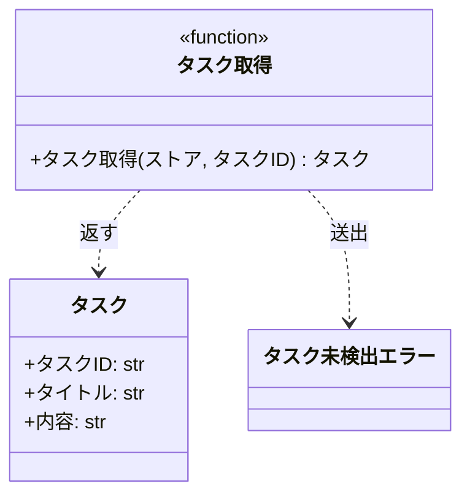

# モジュール構成: バックエンド / タスク

`タスク` ドメイン（バックエンド側）に属する構成要素詳細。

- 対応テストファイル: なし

## 一覧

| ユースケース | 役割 | コンテナ | 種別 | 名前 | 概要 | 補足 |
| --- | --- | --- | --- | --- | --- | --- |
| 共通 | ドメインモデル | `src/tasks/models.py` | データモデル | [`Task`](#タスク) | タスク 1 件の識別子・タイトル・内容 | - |
| 共通 | ドメイン例外 | `src/tasks/errors.py` | クラス | [`TaskNotFoundError`](#タスク未検出エラー) | 指定 ID のタスクが存在しない | [タスク取得](#タスク取得) が送出する |
| 共通 | ドメイン例外 | `src/tasks/errors.py` | クラス | [`ValidationError`](#検証エラー) | 入力値が制約を満たさない | 送出箇所がリポジトリ内に無い |
| 共通 | サービス | `src/tasks/service.py` | 関数 | [`get_task`](#タスク取得) | ストアからタスクを 1 件取得する | 呼び出し元がリポジトリ内に無い |

## ディレクトリ構成

```
src/tasks/
├── __init__.py   # 空ファイル（再エクスポートなし）
├── models.py     # Task
├── errors.py     # TaskNotFoundError / ValidationError
└── service.py    # get_task
```

## 構成図

### タスク取得の構成



---

### 検証エラーの構成


[検証エラー](#検証エラー) は他の構成要素から参照されていないため、単独のノードで置く。

## タスク
> 物理名: `Task`<br>
> 種別: データモデル<br>
> コンテナ: `src/tasks/models.py`

タスク 1 件を表す不変のデータモデル。

### プロパティ

| 論理名 | プロパティ名 | 型 | 可視性 | デフォルト | 説明 | 例 | 補足 |
| --- | --- | --- | --- | --- | --- | --- | --- |
| タスク ID | `id` | `str` | 公開 | - | タスクの識別子 | `"task_01"` | 形式の制約は実装に無い |
| タイトル | `title` | `str` | 公開 | - | タスクのタイトル | `"買い物"` | 長さ・必須の検証は実装に無い |
| 内容 | `content` | `str` | 公開 | `""` | タスクの内容 | `"牛乳を買う"` | 省略時は空文字 |

### メソッド

なし

### 単体テスト

なし

### 補足

- `@dataclass(frozen=True, slots=True, kw_only=True)` で定義されており、生成後の再代入ができずキーワード引数でのみ生成する
- 生成時に値を検証する処理は持たない

## タスク未検出エラー
> 物理名: `TaskNotFoundError`<br>
> 種別: クラス<br>
> コンテナ: `src/tasks/errors.py`<br>
> 継承元: `Exception`

指定 ID のタスクが存在しないことを表すドメイン例外。

### プロパティ

なし（`Exception` の既定のまま）

### メソッド

なし

### 単体テスト

なし

### 補足

- 送出箇所は [タスク取得](#タスク取得) の 1 箇所
- 捕捉している箇所はリポジトリ内に無い

## 検証エラー
> 物理名: `ValidationError`<br>
> 種別: クラス<br>
> コンテナ: `src/tasks/errors.py`<br>
> 継承元: `Exception`

入力値が制約を満たさないことを表すドメイン例外。

### プロパティ

なし（`Exception` の既定のまま）

### メソッド

なし

### 単体テスト

なし

### 補足

- 定義だけが存在し、送出箇所・捕捉箇所はリポジトリ内に無い

## `src/tasks/service.py`
> 種別: ファイル

タスクのドメインロジックを置く関数ファイル。

---

### タスク取得
> 物理名: `get_task`<br>
> 種別: 関数

ストアからタスクを 1 件取得する。

#### 引数

| 論理名 | 引数名 | 型 | 必須 | デフォルト | 説明 | 補足 |
| --- | --- | --- | --- | --- | --- | --- |
| ストア | `store` | [`dict[str, Task]`](#タスク) | ✅ | - | タスク ID をキーに [タスク](#タスク) を保持する辞書 | 呼び出し側が用意する |
| タスク ID | `task_id` | `str` | ✅ | - | 取得対象のタスク ID | - |

引数例:

```python
get_task({"task_01": Task(id="task_01", title="買い物")}, "task_01")
```

#### 戻り値

| 型 | 説明 | 補足 |
| --- | --- | --- |
| [`Task`](#タスク) | ストアから取り出したタスク | ストア内のインスタンスをそのまま返す |

戻り値例:

```python
Task(id="task_01", title="買い物", content="")
```

#### 処理

1. `task_id` がストアのキーに含まれるか確認する
   - 含まれない場合、[タスク未検出エラー](#タスク未検出エラー) を送出する
2. ストアから `task_id` に対応するタスクを返す

#### 例外

| 例外名 | 発生条件 | メッセージ | 補足 |
| --- | --- | --- | --- |
| `TaskNotFoundError` | `store` に `task_id` のキーが無い | `"task not found: {task_id}"` | メッセージは英語で実装されている |

#### 単体テスト

なし

### 補足

- 永続化層を持たず、ストアを引数で受け取る
- モジュール内の import は `from tasks.errors import ...` / `from tasks.models import ...` で、`src` をパッケージルートに置く前提になっている
