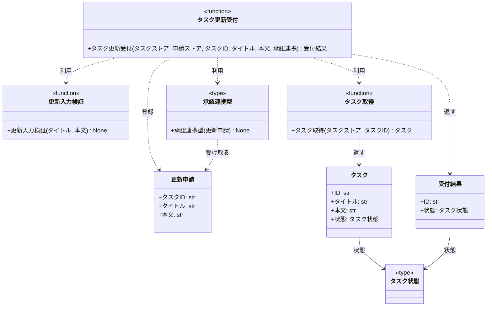

# モジュール構成: バックエンド / タスク

`タスク` ドメイン（バックエンド側）に属する構成要素詳細。

## 一覧

| ユースケース | 役割 | コンテナ | 種別 | 名前 | 概要 | 補足 |
| --- | --- | --- | --- | --- | --- | --- |
| 共通 | ドメインモデル | `tasks/models.py` | データモデル | [`Task`](#タスク) | タスク 1 件の確定値と状態 | - |
| 共通 | 列挙 | `tasks/models.py` | データモデル | [`TaskStatus`](#タスク状態) | タスクの確定 / 申請中を表すリテラル型 | - |
| 共通 | リポジトリ | `tasks/service.py` | 関数 | [`get_task`](#タスク取得) | ストアからタスクを 1 件取得 | 既存関数 |
| タスク更新 | 申請モデル | `tasks/models.py` | データモデル | [`TaskUpdateRequest`](#更新申請) | 承認待ちの編集内容 | 確定値とは別に保持する |
| タスク更新 | 応答モデル | `tasks/models.py` | データモデル | [`TaskAcceptance`](#受付結果) | 更新受付の同期応答 | 承認前の編集内容を持たない |
| タスク更新 | 定数 | `tasks/constants.py` | 定数 | `TITLE_MAX_LENGTH` | タイトルの最大文字数（100） | - |
| タスク更新 | 定数 | `tasks/constants.py` | 定数 | `CONTENT_MAX_LENGTH` | 本文の最大文字数（1000） | - |
| タスク更新 | 連携型（DI） | `tasks/types.py` | 関数型 | [`SubmitApproval`](#承認連携型) | 承認基盤へ承認依頼を渡す関数のシグネチャ | DI / Mock 差し替え用 |
| タスク更新 | バリデータ | `tasks/service.py` | 関数 | [`_validate_update_input`](#更新入力検証) | タイトル / 本文の長さ検証 | 失敗時 `ValidationError` |
| タスク更新 | サービス | `tasks/service.py` | 関数 | [`update_task`](#タスク更新受付) | 更新申請を受け付けて申請中にする | 承認完了は待たない |

## ディレクトリ構成

```
src/tasks/
├── __init__.py      # 公開シンボル
├── constants.py     # タイトル / 本文の長さ上限
├── errors.py        # TaskNotFoundError / ValidationError
├── models.py        # Task / TaskStatus / TaskUpdateRequest / TaskAcceptance
├── service.py       # get_task / update_task / 入力検証
└── types.py         # 承認連携の関数型エイリアス
```

## 構成図



## タスク
> 物理名: `Task`<br>
> 種別: データモデル<br>
> コンテナ: `tasks/models.py`

タスク 1 件。
タイトルと本文は承認済みの確定値だけを保持し、承認待ちの編集内容は [更新申請](#更新申請) 側が持つ。

### プロパティ

| 論理名 | プロパティ名 | 型 | 可視性 | デフォルト | 説明 | 例 | 補足 |
| --- | --- | --- | --- | --- | --- | --- | --- |
| ID | `id` | `str` | 公開 | - | タスク ID | `"t1"` | - |
| タイトル | `title` | `str` | 公開 | - | 確定済みのタスク名 | `"買い物"` | 承認前の編集内容は入らない |
| 本文 | `content` | `str` | 公開 | `""` | 確定済みの本文 | `"牛乳を買う"` | 承認前の編集内容は入らない |
| 状態 | `status` | [`TaskStatus`](#タスク状態) | 公開 | `"confirmed"` | 確定済みか申請中か | `"pending_approval"` | 一覧が申請中として表示するための状態 |

### メソッド

なし

### 単体テスト

なし

### 補足

- `@dataclass(frozen=True, slots=True, kw_only=True)` のため、状態の変更は `dataclasses.replace` で新インスタンスを作る

## タスク状態
> 物理名: `TaskStatus`<br>
> 種別: データモデル<br>
> コンテナ: `tasks/models.py`

タスクが確定済みか承認待ちかを表すリテラル型。

### プロパティ

| 論理名 | プロパティ名 | 型 | 可視性 | デフォルト | 説明 | 例 | 補足 |
| --- | --- | --- | --- | --- | --- | --- | --- |
| 確定済み | `"confirmed"` | `str` | 公開 | - | 承認待ちの更新申請がない状態 | `"confirmed"` | 新規作成時の初期値 |
| 申請中 | `"pending_approval"` | `str` | 公開 | - | 更新申請を受け付けて承認結果を待っている状態 | `"pending_approval"` | 一覧では申請中として表示する |

### メソッド

なし

### 単体テスト

なし

### 補足

- `Literal["confirmed", "pending_approval"]` の型エイリアスとして定義する（取りうる値が有限のため `str` にしない）
- 承認完了後に確定済みへ戻す遷移は epic のスコープ外のため、本サブシステムでは実装しない

## 更新申請
> 物理名: `TaskUpdateRequest`<br>
> 種別: データモデル<br>
> コンテナ: `tasks/models.py`

承認待ちの編集内容。
確定値である [タスク](#タスク) とは別に保持することで、承認前の値が一覧に出ないようにする。

### プロパティ

| 論理名 | プロパティ名 | 型 | 可視性 | デフォルト | 説明 | 例 | 補足 |
| --- | --- | --- | --- | --- | --- | --- | --- |
| タスク ID | `task_id` | `str` | 公開 | - | 申請対象のタスク ID | `"t1"` | - |
| タイトル | `title` | `str` | 公開 | - | 申請されたタスク名 | `"買い物リスト"` | 承認されるまで確定値にしない |
| 本文 | `content` | `str` | 公開 | - | 申請された本文 | `"牛乳とパンを買う"` | 承認されるまで確定値にしない |

### メソッド

なし

### 単体テスト

なし

### 補足

- 申請ストアは `dict[str, TaskUpdateRequest]`（キーはタスク ID）で保持する
- 同じタスクへの再申請は同じキーを上書きする（最後の申請だけが承認対象になる）

## 受付結果
> 物理名: `TaskAcceptance`<br>
> 種別: データモデル<br>
> コンテナ: `tasks/models.py`

更新受付の同期応答。
承認前の編集内容は確定値ではないため持たない。

### プロパティ

| 論理名 | プロパティ名 | 型 | 可視性 | デフォルト | 説明 | 例 | 補足 |
| --- | --- | --- | --- | --- | --- | --- | --- |
| ID | `id` | `str` | 公開 | - | 受け付けたタスクの ID | `"t1"` | - |
| 状態 | `status` | [`TaskStatus`](#タスク状態) | 公開 | - | 受付後のタスク状態 | `"pending_approval"` | 受付時は常に申請中 |

### メソッド

なし

### 単体テスト

なし

### 補足

- タイトル / 本文を持たせない設計は、承認前の編集内容を確定値として返さないという要件を型で担保するため

## `tasks/types.py`
> 種別: ファイル

外部依存を差し替えるための関数型エイリアスを置くファイル。

---

### 承認連携型
> 物理名: `SubmitApproval`<br>
> 種別: 関数型

更新申請を外部承認基盤へ渡す関数のシグネチャ。
DI / Mock 差し替え用。

#### 引数

| 論理名 | 引数名 | 型 | 必須 | デフォルト | 説明 | 補足 |
| --- | --- | --- | --- | --- | --- | --- |
| 更新申請 | `request` | [`TaskUpdateRequest`](#更新申請) | ✅ | - | 承認を依頼する編集内容 | - |

#### 戻り値

| 型 | 説明 | 補足 |
| --- | --- | --- |
| `None` | なし | 承認結果は戻り値で受け取らない |

#### 実装

| 実装 | 補足 |
| --- | --- |
| 本番の承認基盤クライアント | 本サブシステムのスコープ外（依頼の受け渡しのみを想定） |

## `tasks/service.py`
> 種別: ファイル

タスクのドメインロジックを束ねる関数ファイル。

---

### タスク取得
> 物理名: `get_task`<br>
> 種別: 関数

ストアからタスクを 1 件取得する。

#### 引数

| 論理名 | 引数名 | 型 | 必須 | デフォルト | 説明 | 補足 |
| --- | --- | --- | --- | --- | --- | --- |
| タスクストア | `store` | [`dict[str, Task]`](#タスク) | ✅ | - | タスクの保管先 | インメモリの dict |
| タスク ID | `task_id` | `str` | ✅ | - | 取得対象のタスク ID | - |

引数例:

```python
get_task({"t1": Task(id="t1", title="買い物")}, "t1")
```

#### 戻り値

| 型 | 説明 | 補足 |
| --- | --- | --- |
| [`Task`](#タスク) | 取得したタスク | - |

戻り値例:

```python
Task(id="t1", title="買い物", content="牛乳を買う", status="confirmed")
```

#### 処理

1. ストアに `task_id` があるか確認する
   - 無い場合、`TaskNotFoundError` を投げる
2. 該当のタスクを返す

#### 例外

| 例外名 | 発生条件 | メッセージ | 補足 |
| --- | --- | --- | --- |
| `TaskNotFoundError` | ストアに `task_id` が存在しない | `"task not found: {task_id}"` | - |

#### 単体テスト

| テスト名 | 正常/異常 | 概要 | 条件 | Mock | 期待値 | 補足 |
| --- | --- | --- | --- | --- | --- | --- |
| `test_get_task` | 正常 | 登録済みのタスクを取得する | ストアに `t1` を登録済み | なし | `t1` の `Task` を返す | - |
| `test_get_task_when_task_missing` | 異常 | 未登録の ID を指定する | ストアに `t1` が無い | なし | `TaskNotFoundError` を送出 | 例外表「ストアに `task_id` が存在しない」に対応 |

---

### 更新入力検証
> 物理名: `_validate_update_input`<br>
> 種別: 関数

更新申請のタイトルと本文が長さ制限を満たすかを検証する。

#### 引数

| 論理名 | 引数名 | 型 | 必須 | デフォルト | 説明 | 補足 |
| --- | --- | --- | --- | --- | --- | --- |
| タイトル | `title` | `str` | ✅ | - | 申請されたタスク名 | 1 文字以上 `TITLE_MAX_LENGTH` 以内 |
| 本文 | `content` | `str` | ✅ | - | 申請された本文 | `CONTENT_MAX_LENGTH` 以内 |

引数例:

```python
_validate_update_input("買い物リスト", "牛乳とパンを買う")
```

#### 戻り値

| 型 | 説明 | 補足 |
| --- | --- | --- |
| `None` | なし | 検証を通過した場合は何も返さない |

#### 処理

1. タイトルの長さを確認する
   - 空文字の場合、`ValidationError` を投げる
   - `TITLE_MAX_LENGTH` を超える場合、`ValidationError` を投げる
2. 本文の長さを確認する
   - `CONTENT_MAX_LENGTH` を超える場合、`ValidationError` を投げる

#### 例外

| 例外名 | 発生条件 | メッセージ | 補足 |
| --- | --- | --- | --- |
| `ValidationError` | `title` が空文字 | `"タイトルは 1 文字以上で入力してください"` | - |
| `ValidationError` | `title` が `TITLE_MAX_LENGTH` 超過 | `"タイトルは {TITLE_MAX_LENGTH} 文字以内で入力してください"` | 同じ例外の別発生箇所 |
| `ValidationError` | `content` が `CONTENT_MAX_LENGTH` 超過 | `"本文は {CONTENT_MAX_LENGTH} 文字以内で入力してください"` | 同じ例外の別発生箇所 |

#### 単体テスト

| テスト名 | 正常/異常 | 概要 | 条件 | Mock | 期待値 | 補足 |
| --- | --- | --- | --- | --- | --- | --- |
| `test_validate_update_input` | 正常 | 制限内の入力を通す | タイトル 1 文字以上 100 文字以内、本文 1000 文字以内 | なし | 例外を送出しない | - |
| `test_validate_update_input_when_title_empty` | 異常 | タイトルが空文字 | `title` が `""` | なし | `ValidationError` を送出 | 例外表「`title` が空文字」に対応 |
| `test_validate_update_input_when_title_too_long` | 異常 | タイトルが長すぎる | `title` が 101 文字 | なし | `ValidationError` を送出 | 例外表「`title` が `TITLE_MAX_LENGTH` 超過」に対応 |
| `test_validate_update_input_when_content_too_long` | 異常 | 本文が長すぎる | `content` が 1001 文字 | なし | `ValidationError` を送出 | 例外表「`content` が `CONTENT_MAX_LENGTH` 超過」に対応 |

---

### タスク更新受付
> 物理名: `update_task`<br>
> 種別: 関数

タスクの更新申請を受け付け、対象タスクを申請中にして受付結果を返す。
承認基盤の応答は待たない。

#### 引数

| 論理名 | 引数名 | 型 | 必須 | デフォルト | 説明 | 補足 |
| --- | --- | --- | --- | --- | --- | --- |
| タスクストア | `store` | [`dict[str, Task]`](#タスク) | ✅ | - | タスクの保管先 | インメモリの dict |
| 申請ストア | `requests` | [`dict[str, TaskUpdateRequest]`](#更新申請) | ✅ | - | 承認待ちの編集内容の保管先 | キーはタスク ID |
| タスク ID | `task_id` | `str` | ✅ | - | 更新対象のタスク ID | - |
| タイトル | `title` | `str` | ✅ | - | 申請するタスク名 | 1 文字以上 `TITLE_MAX_LENGTH` 以内 |
| 本文 | `content` | `str` | - | `""` | 申請する本文 | `CONTENT_MAX_LENGTH` 以内 |
| 承認連携 | `submit_approval` | [`SubmitApproval`](#承認連携型) | ✅ | - | 承認依頼を渡す関数 | キーワード引数で注入する |

引数例:

```python
update_task(store, requests, "t1", "買い物リスト", "牛乳とパンを買う", submit_approval=submit_to_platform)
```

#### 戻り値

| 型 | 説明 | 補足 |
| --- | --- | --- |
| [`TaskAcceptance`](#受付結果) | 受付結果 | 承認前の編集内容は含まない |

戻り値例:

```python
TaskAcceptance(id="t1", status="pending_approval")
```

#### 処理

1. 入力値を検証する（[更新入力検証](#更新入力検証)）
2. 更新対象のタスクを取得する（[タスク取得](#タスク取得)）
3. 更新申請を申請ストアに登録する
4. 対象タスクを申請中にしてタスクストアへ書き戻す
   - タイトルと本文は確定値のまま変更しない
5. 承認依頼を承認連携へ渡す（応答は待たない）
6. 受付結果を返す

#### 例外

| 例外名 | 発生条件 | メッセージ | 補足 |
| --- | --- | --- | --- |
| なし | - | - | 送出する例外は [更新入力検証](#更新入力検証) と [タスク取得](#タスク取得) から伝播するもののみ |

#### 単体テスト

セットアップ:

| セットアップ | 説明 | 補足 |
| --- | --- | --- |
| タスクストア | `t1` のタスクを登録済みの dict を用意する | fixture: `task_store` |
| 申請ストア | 空の dict を用意する | fixture: `request_store` |
| 承認連携 | 渡された更新申請を記録するだけの関数を用意する | fixture: `recording_submit_approval` |

| テスト名 | 正常/異常 | 概要 | 条件 | Mock | 期待値 | 補足 |
| --- | --- | --- | --- | --- | --- | --- |
| `test_update_task` | 正常 | 更新申請を受け付ける | 登録済みの `t1` に制限内のタイトルと本文を指定 | 承認連携 | `TaskAcceptance(id="t1", status="pending_approval")` を返す。タスクストアの `t1` が申請中になり、タイトルと本文は更新前のまま。申請ストアに申請内容が入る。承認連携に同じ申請が渡る | - |
| `test_update_task_when_task_missing` | 異常 | 未登録の ID を指定する | タスクストアに `t1` が無い | 承認連携 | `TaskNotFoundError` を送出。両ストアが変更されず、承認連携が呼ばれない | [タスク取得](#タスク取得) からの伝播 |
| `test_update_task_when_title_empty` | 異常 | タイトルが空文字 | `title` が `""` | 承認連携 | `ValidationError` を送出。両ストアが変更されず、承認連携が呼ばれない | [更新入力検証](#更新入力検証) からの伝播 |

### 補足

- 承認連携はキーワード引数で注入する（テストでは呼び出しを記録するだけの関数に差し替える）
- 承認結果の受信・反映は本サブシステムのスコープ外のため、確定済みへ戻す関数は置かない
