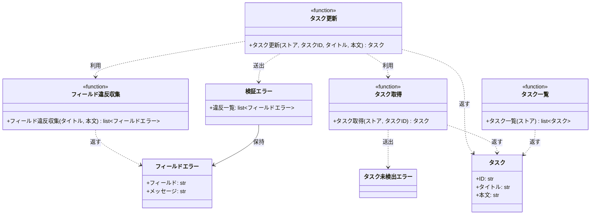

# モジュール構成: バックエンド / タスク

`タスク` ドメイン（バックエンド側）に属する構成要素詳細。

- 対応テストファイル: `tests/unit/tasks/test_service.py`

## 一覧

| ユースケース | 役割 | コンテナ | 種別 | 名前 | 概要 | 補足 |
| --- | --- | --- | --- | --- | --- | --- |
| 共通 | ドメインモデル | `src/tasks/models.py` | データモデル | [`Task`](#タスク) | タスク 1 件 | - |
| 共通 | ドメイン例外 | `src/tasks/errors.py` | クラス | [`TaskNotFoundError`](#タスク未検出エラー) | 指定 ID のタスクが存在しない | - |
| 共通 | クエリ | `src/tasks/service.py` | 関数 | [`get_task`](#タスク取得) | ストアからタスクを 1 件取得 | - |
| 共通 | クエリ | `src/tasks/service.py` | 関数 | [`list_tasks`](#タスク一覧) | ストアのタスクを ID 順で一覧化 | - |
| タスク更新 | 検証結果 DTO | `src/tasks/models.py` | データモデル | [`FieldError`](#フィールドエラー) | 1 フィールド分の検証違反 | - |
| タスク更新 | ドメイン例外 | `src/tasks/errors.py` | クラス | [`ValidationError`](#検証エラー) | 入力値が制約を満たさない | 違反を全件保持する |
| タスク更新 | 定数 | `src/tasks/service.py` | 定数 | `TITLE_MIN_LENGTH` | タイトルの最小文字数（`1`） | - |
| タスク更新 | 定数 | `src/tasks/service.py` | 定数 | `TITLE_MAX_LENGTH` | タイトルの最大文字数（`100`） | - |
| タスク更新 | 定数 | `src/tasks/service.py` | 定数 | `CONTENT_MAX_LENGTH` | 本文の最大文字数（`1000`） | - |
| タスク更新 | バリデータ | `src/tasks/service.py` | 関数 | [`_collect_field_errors`](#フィールド違反収集) | 全フィールドを検証して違反を集める | 内部関数 |
| タスク更新 | サービス | `src/tasks/service.py` | 関数 | [`update_task`](#タスク更新) | タイトルと本文を検証して更新 | - |

## ディレクトリ構成

```
src/tasks/
├── __init__.py   # パッケージ宣言（再エクスポートなし）
├── models.py     # Task / FieldError
├── errors.py     # TaskNotFoundError / ValidationError
└── service.py    # 取得 / 更新 / 一覧の関数と検証定数
```

## 構成図



## タスク
> 物理名: `Task`<br>
> 種別: データモデル<br>
> コンテナ: `src/tasks/models.py`

タスク 1 件。

### プロパティ

| 論理名 | プロパティ名 | 型 | 可視性 | デフォルト | 説明 | 例 | 補足 |
| --- | --- | --- | --- | --- | --- | --- | --- |
| ID | `id` | `str` | 公開 | - | タスクの識別子 | `"t1"` | ストアのキーと一致する |
| タイトル | `title` | `str` | 公開 | - | タスクのタイトル | `"決算資料の作成"` | - |
| 本文 | `content` | `str` | 公開 | `""` | タスクの詳細説明 | `"売上集計を先に済ませる"` | - |

### メソッド

なし

### 単体テスト

なし

### 補足

- `@dataclass(frozen=True, slots=True, kw_only=True)` の不変 DTO。
  更新は新しいインスタンスを作ってストアへ差し替える
- 永続化された表現は [ER 図: タスク](../../ER図/タスク.md#タスク-tasks) が持つ

## フィールドエラー
> 物理名: `FieldError`<br>
> 種別: データモデル<br>
> コンテナ: `src/tasks/models.py`

1 フィールド分の検証違反。

### プロパティ

| 論理名 | プロパティ名 | 型 | 可視性 | デフォルト | 説明 | 例 | 補足 |
| --- | --- | --- | --- | --- | --- | --- | --- |
| フィールド | `field` | `Literal["title", "content"]` | 公開 | - | 違反したフィールドの名前 | `"title"` | 画面のフィールド直下へエラーを出す紐付けに使う |
| メッセージ | `message` | `str` | 公開 | - | 違反内容の説明 | `"タイトルは 1 文字以上 100 文字以内で入力してください"` | 日本語。そのまま表示できる文言 |

### メソッド

なし

### 単体テスト

なし

## タスク未検出エラー
> 物理名: `TaskNotFoundError`<br>
> 種別: クラス<br>
> コンテナ: `src/tasks/errors.py`

指定 ID のタスクが存在しない。

### プロパティ

なし

### メソッド

なし

### 単体テスト

なし

### 補足

- `Exception` を直接継承する（本プロジェクトは共通の基底例外を持たない）

## 検証エラー
> 物理名: `ValidationError`<br>
> 種別: クラス<br>
> コンテナ: `src/tasks/errors.py`

入力値が制約を満たさない。
違反したフィールドを全件保持する。

### プロパティ

| 論理名 | プロパティ名 | 型 | 可視性 | デフォルト | 説明 | 例 | 補足 |
| --- | --- | --- | --- | --- | --- | --- | --- |
| 違反一覧 | `errors` | [`list[FieldError]`](#フィールドエラー) | 公開 | - | 検証に失敗した全フィールドの違反 | `[FieldError(field="title", message="...")]` | 1 件以上。検証を通った場合は例外自体を送出しない |

### メソッド

なし

### 単体テスト

なし

### 補足

- `Exception` の引数には違反一覧を連結した文言を渡し、`str(e)` だけでも原因が読めるようにする
- 呼び出し側は `errors` を読んでフィールド単位のインラインエラーを組み立てる

## `src/tasks/service.py`
> 種別: ファイル

タスクの取得 / 更新 / 一覧を担うドメインロジックの関数ファイル。
タスクストアは呼び出し側から `dict[str, Task]` として受け取る。

---

### タスク取得
> 物理名: `get_task`<br>
> 種別: 関数

ストアからタスクを 1 件取得する。

#### 引数

| 論理名 | 引数名 | 型 | 必須 | デフォルト | 説明 | 補足 |
| --- | --- | --- | --- | --- | --- | --- |
| ストア | `store` | [`dict[str, Task]`](#タスク) | ✅ | - | 取得元のタスクストア | - |
| タスク ID | `task_id` | `str` | ✅ | - | 取得対象のタスク ID | - |

引数例:

```python
get_task(store, "t1")
```

#### 戻り値

| 型 | 説明 | 補足 |
| --- | --- | --- |
| [`Task`](#タスク) | 取得したタスク | - |

戻り値例:

```python
Task(id="t1", title="旧タイトル", content="旧本文")
```

#### 処理

1. ストアに `task_id` が無ければ `TaskNotFoundError` を送出する
2. 該当するタスクを返す

#### 例外

| 例外名 | 発生条件 | メッセージ | 補足 |
| --- | --- | --- | --- |
| `TaskNotFoundError` | ストアに `task_id` のキーが無い | `"タスクが見つかりません: {task_id}"` | - |

#### 単体テスト

セットアップ:

| セットアップ | 説明 | 補足 |
| --- | --- | --- |
| ストア | `t1` のタスクを 1 件だけ持つストアを作る | ヘルパー `_store()` |

| テスト名 | 正常/異常 | 概要 | 条件 | Mock | 期待値 | 補足 |
| --- | --- | --- | --- | --- | --- | --- |
| `test_get_task` | 正常 | 登録済みのタスクを取得 | `task_id` に `t1` | なし | `t1` のタスクを返す | - |
| `test_get_task_when_task_missing` | 異常 | 未登録の ID を指定 | `task_id` に `missing` | なし | `TaskNotFoundError` を送出 | 例外表「ストアに `task_id` のキーが無い」に対応 |

---

### フィールド違反収集
> 物理名: `_collect_field_errors`<br>
> 種別: 関数

タイトルと本文を検証して、違反したフィールドを全件集める。

#### 引数

| 論理名 | 引数名 | 型 | 必須 | デフォルト | 説明 | 補足 |
| --- | --- | --- | --- | --- | --- | --- |
| タイトル | `title` | `str` | ✅ | - | 検証対象のタイトル | - |
| 本文 | `content` | `str` | ✅ | - | 検証対象の本文 | 省略時のデフォルト適用は呼び出し側が済ませる |

引数例:

```python
_collect_field_errors("", "a" * 1001)
```

#### 戻り値

| 型 | 説明 | 補足 |
| --- | --- | --- |
| [`list[FieldError]`](#フィールドエラー) | 違反したフィールドの一覧 | 違反が無ければ空リスト |

戻り値例:

```python
[
    FieldError(field="title", message="タイトルは 1 文字以上 100 文字以内で入力してください"),
    FieldError(field="content", message="本文は 1000 文字以内で入力してください"),
]
```

#### 処理

1. 空の違反一覧を用意する
2. タイトルの文字数が `TITLE_MIN_LENGTH` 〜 `TITLE_MAX_LENGTH` の範囲外なら `title` の違反を積む
3. 本文の文字数が `CONTENT_MAX_LENGTH` を超えていたら `content` の違反を積む
4. 積んだ違反一覧を返す

#### 例外

なし

#### 単体テスト

| テスト名 | 正常/異常 | 概要 | 条件 | Mock | 期待値 | 補足 |
| --- | --- | --- | --- | --- | --- | --- |
| `test_collect_field_errors` | 正常 | 全フィールドが有効 | タイトル 1 文字以上 100 文字以内・本文 1000 文字以内 | なし | 空リストを返す | - |
| `test_collect_field_errors_when_title_empty` | 正常 | タイトルが空 | タイトルに空文字 | なし | `title` の違反 1 件を返す | - |
| `test_collect_field_errors_when_title_too_long` | 正常 | タイトルが上限超過 | タイトルに 101 文字 | なし | `title` の違反 1 件を返す | - |
| `test_collect_field_errors_when_content_too_long` | 正常 | 本文が上限超過 | 本文に 1001 文字 | なし | `content` の違反 1 件を返す | - |
| `test_collect_field_errors_when_all_invalid` | 正常 | 複数フィールドが違反 | タイトルに空文字・本文に 1001 文字 | なし | `title` → `content` の順で違反 2 件を返す | 違反の順序も検証する |

---

### タスク更新
> 物理名: `update_task`<br>
> 種別: 関数

登録済みタスクのタイトルと本文を検証して更新する。

#### 引数

| 論理名 | 引数名 | 型 | 必須 | デフォルト | 説明 | 補足 |
| --- | --- | --- | --- | --- | --- | --- |
| ストア | `store` | [`dict[str, Task]`](#タスク) | ✅ | - | 更新対象のタスクストア | 破壊的に更新する |
| タスク ID | `task_id` | `str` | ✅ | - | 更新対象のタスク ID | - |
| タイトル | `title` | `str` | ✅ | - | 更新後のタイトル | 1 文字以上 100 文字以内 |
| 本文 | `content` | `str` | - | `""` | 更新後の本文 | 1000 文字以内 |

引数例:

```python
update_task(store, "t1", "決算資料の作成", "売上集計を先に済ませる")
```

#### 戻り値

| 型 | 説明 | 補足 |
| --- | --- | --- |
| [`Task`](#タスク) | 更新後のタスク | ストアに格納したものと同一のインスタンス |

戻り値例:

```python
Task(id="t1", title="決算資料の作成", content="売上集計を先に済ませる")
```

#### 処理

1. 入力値を検証して違反を集める（[フィールド違反収集](#フィールド違反収集)）
2. 違反が 1 件以上あれば `ValidationError` を送出する
3. 更新対象のタスクを取得する（[タスク取得](#タスク取得)）
4. 取得したタスクの ID に、渡されたタイトルと本文を組み合わせた新しいタスクを作る
5. 作ったタスクをストアへ書き戻して返す

#### 例外

| 例外名 | 発生条件 | メッセージ | 補足 |
| --- | --- | --- | --- |
| `ValidationError` | 検証で 1 件以上の違反がある | `"入力値が不正です: {違反メッセージを読点で連結}"` | 違反の詳細は `errors` が持つ |
| `TaskNotFoundError` | 検証を通った後、ストアに `task_id` のキーが無い | `"タスクが見つかりません: {task_id}"` | [タスク取得](#タスク取得) から伝播する |

#### 単体テスト

セットアップ:

| セットアップ | 説明 | 補足 |
| --- | --- | --- |
| ストア | `t1` のタスクを 1 件だけ持つストアを作る | ヘルパー `_store()` |

| テスト名 | 正常/異常 | 概要 | 条件 | Mock | 期待値 | 補足 |
| --- | --- | --- | --- | --- | --- | --- |
| `test_update_task` | 正常 | タイトルと本文を更新 | 有効なタイトルと本文を指定 | なし | 更新後のタスクを返し、ストアの `t1` も更新後の値になる | - |
| `test_update_task_when_content_omitted` | 正常 | 本文を省略 | `content` を渡さない | なし | 本文が空文字のタスクを返す | デフォルト値の分岐 |
| `test_update_task_when_title_empty` | 異常 | タイトルが空 | タイトルに空文字 | なし | `ValidationError` を送出し、`errors` が `title` の 1 件・ストアは不変 | 例外表「検証で 1 件以上の違反がある」に対応 |
| `test_update_task_when_title_too_long` | 異常 | タイトルが上限超過 | タイトルに 101 文字 | なし | `ValidationError` を送出し、`errors` が `title` の 1 件・ストアは不変 | 例外表「検証で 1 件以上の違反がある」に対応 |
| `test_update_task_when_content_too_long` | 異常 | 本文が上限超過 | 本文に 1001 文字 | なし | `ValidationError` を送出し、`errors` が `content` の 1 件・ストアは不変 | 例外表「検証で 1 件以上の違反がある」に対応 |
| `test_update_task_when_all_invalid` | 異常 | 複数フィールドが違反 | タイトルに空文字・本文に 1001 文字 | なし | `ValidationError` を送出し、`errors` が `title` → `content` の 2 件 | フィールド単位で返す設計の確認 |
| `test_update_task_when_task_missing` | 異常 | 未登録の ID を指定 | `task_id` に `missing`・入力値は有効 | なし | `TaskNotFoundError` を送出し、ストアは不変 | 例外表「ストアに `task_id` のキーが無い」に対応 |

---

### タスク一覧
> 物理名: `list_tasks`<br>
> 種別: 関数

ストアのタスクを ID 順で一覧にする。

#### 引数

| 論理名 | 引数名 | 型 | 必須 | デフォルト | 説明 | 補足 |
| --- | --- | --- | --- | --- | --- | --- |
| ストア | `store` | [`dict[str, Task]`](#タスク) | ✅ | - | 一覧化するタスクストア | - |

引数例:

```python
list_tasks(store)
```

#### 戻り値

| 型 | 説明 | 補足 |
| --- | --- | --- |
| [`list[Task]`](#タスク) | ID の昇順に並べたタスク | 空のストアでは空リスト |

戻り値例:

```python
[Task(id="t1", title="決算資料の作成", content="売上集計を先に済ませる")]
```

#### 処理

1. ストアのキーを昇順に並べる
2. 並べた順にタスクを取り出して一覧にして返す

#### 例外

なし

#### 単体テスト

| テスト名 | 正常/異常 | 概要 | 条件 | Mock | 期待値 | 補足 |
| --- | --- | --- | --- | --- | --- | --- |
| `test_list_tasks` | 正常 | ID 順で一覧化 | `t2` / `t1` の順で登録したストア | なし | `t1` → `t2` の順で返す | - |
| `test_list_tasks_when_store_empty` | 正常 | 空のストア | 空の `dict` | なし | 空リストを返す | - |

---

### 補足

- 検証は [フィールド違反収集](#フィールド違反収集) に集約し、[タスク更新](#タスク更新) は違反の有無だけを見る（検証条件の追加時に触る箇所を 1 つに保つ）
- タスクストアは引数で受け取るため、テストでは実物の `dict` をそのまま渡す（Mock 対象なし）
