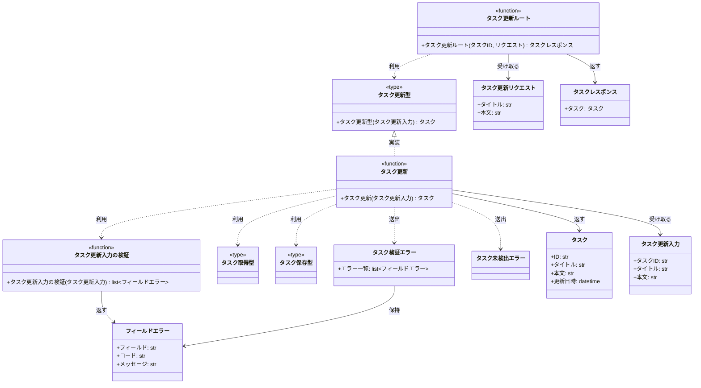
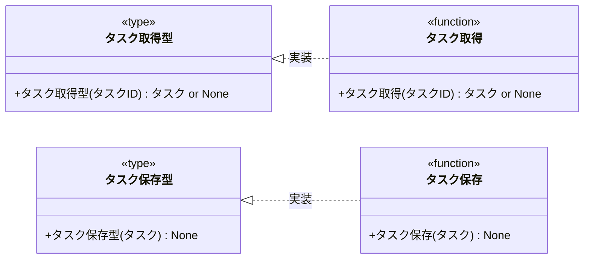

# モジュール構成: バックエンド / タスク

`タスク` ドメイン（バックエンド側）に属する構成要素詳細。
タスクのデータモデルと、タスク更新のルート・サービス・永続化を持つ。

- 対応テストファイル: 未記入（テストレビュー完了時に記入）

## 一覧

| ユースケース | 役割 | コンテナ | 種別 | 名前 | 概要 | 補足 |
| --- | --- | --- | --- | --- | --- | --- |
| 共通 | ドメインモデル | `tasks/types.py` | データモデル | [`Task`](#タスク) | タスク 1 件 | - |
| 共通 | 定数 | `tasks/types.py` | 定数 | `TITLE_MAX_LENGTH` | タイトルの最大文字数（100） | 詳細セクションなし |
| 共通 | 定数 | `tasks/types.py` | 定数 | `BODY_MAX_LENGTH` | 本文の最大文字数（10000） | 詳細セクションなし |
| 共通 | リポジトリ型（DI） | `tasks/types.py` | 関数型 | [`FindTask`](#タスク取得型) | タスク取得のシグネチャ | - |
| 共通 | リポジトリ型（DI） | `tasks/types.py` | 関数型 | [`SaveTask`](#タスク保存型) | タスク保存のシグネチャ | - |
| 共通 | リポジトリ | `tasks/db.py` | 関数 | [`find_task`](#タスク取得) | ID でタスクを取得 | - |
| 共通 | リポジトリ | `tasks/db.py` | 関数 | [`save_task`](#タスク保存) | タスクを保存 | - |
| タスク更新 | DTO | `tasks/types.py` | データモデル | [`TaskUpdateInput`](#タスク更新入力) | 更新の入力値 | - |
| タスク更新 | DTO | `tasks/types.py` | データモデル | [`FieldError`](#フィールドエラー) | フィールド単位の検証エラー | - |
| タスク更新 | 例外 | `tasks/errors.py` | クラス | [`TaskValidationError`](#タスク検証エラー) | 検証失敗を表す例外 | `FieldError` の一覧を持つ |
| タスク更新 | 例外 | `tasks/errors.py` | クラス | [`TaskNotFoundError`](#タスク未検出エラー) | 対象タスクが存在しないことを表す例外 | - |
| タスク更新 | バリデータ | `tasks/service.py` | 関数 | [`_validate_task_update`](#タスク更新入力の検証) | 更新入力を検証 | - |
| タスク更新 | サービス | `tasks/service.py` | 関数 | [`update_task`](#タスク更新) | タスクのタイトル・本文を更新 | - |
| タスク更新 | サービス型（DI） | `tasks/types.py` | 関数型 | [`UpdateTask`](#タスク更新型) | `update_task` のシグネチャ型 | route への注入用 |
| タスク更新 | リクエスト DTO | `tasks/route.py` | データモデル | [`TaskUpdateRequest`](#タスク更新リクエスト) | 更新リクエストボディ | - |
| タスク更新 | レスポンス DTO | `tasks/route.py` | データモデル | [`TaskResponse`](#タスクレスポンス) | 更新レスポンス | - |
| タスク更新 | ハンドラ | `tasks/route.py` | 関数 | [`update_task_route`](#タスク更新ルート) | `PUT /tasks/{task_id}` のハンドラ | - |

## ディレクトリ構成

```
src/app/features/tasks/
├── __init__.py   # 公開シンボル（Task / update_task / router）
├── types.py      # Task / TaskUpdateInput / FieldError / 定数 / 関数型
├── errors.py     # TaskValidationError
├── service.py    # 入力検証と更新のドメインロジック
├── db.py         # タスクの取得・保存
└── route.py      # PUT /tasks/{task_id}
```

## 構成図

### タスク更新



### タスクストア



## タスク
> 物理名: `Task`<br>
> 種別: データモデル<br>
> コンテナ: `tasks/types.py`

タスク 1 件を表す不変のドメインモデル。

### プロパティ

| 論理名 | プロパティ名 | 型 | 可視性 | デフォルト | 説明 | 例 | 補足 |
| --- | --- | --- | --- | --- | --- | --- | --- |
| ID | `id` | `str` | 公開 | - | タスクの一意 ID | `"3f2b1c88-9a10-4c3e-9f0b-2d5c7e11a840"` | UUID |
| タイトル | `title` | `str` | 公開 | - | タスクのタイトル | `"決算資料の作成"` | 1 文字以上 100 文字以内 |
| 本文 | `body` | `str` | 公開 | - | タスクの本文 | `"四半期の売上を集計する"` | 10000 文字以内・空文字可 |
| 更新日時 | `updated_at` | `datetime` | 公開 | - | 最終更新日時 | `datetime(2026, 8, 1, 12, 40, tzinfo=UTC)` | UTC の aware datetime |

### メソッド

なし

### 単体テスト

なし

### 補足

- `@dataclass(frozen=True, slots=True, kw_only=True)` で定義する（内部 DTO のため Pydantic は使わない）
- 更新は `dataclasses.replace` で新しいインスタンスを作る（インスタンスの書き換えはしない）

## タスク更新入力
> 物理名: `TaskUpdateInput`<br>
> 種別: データモデル<br>
> コンテナ: `tasks/types.py`

タスク更新の入力値。
HTTP レイヤーの [タスク更新リクエスト](#タスク更新リクエスト) をドメイン側の形に変換したもの。

### プロパティ

| 論理名 | プロパティ名 | 型 | 可視性 | デフォルト | 説明 | 例 | 補足 |
| --- | --- | --- | --- | --- | --- | --- | --- |
| タスク ID | `task_id` | `str` | 公開 | - | 更新対象のタスク ID | `"3f2b1c88-..."` | パスパラメータ由来 |
| タイトル | `title` | `str` | 公開 | - | 更新後のタイトル | `"決算資料の作成"` | 未加工の入力値（前後の空白を含みうる） |
| 本文 | `body` | `str` | 公開 | - | 更新後の本文 | `"四半期の売上を集計する"` | 未加工の入力値 |

### メソッド

なし

### 単体テスト

なし

### 補足

- 検証前の生の入力を保持する（前後の空白の除去は [タスク更新](#タスク更新) が行う）

## フィールドエラー
> 物理名: `FieldError`<br>
> 種別: データモデル<br>
> コンテナ: `tasks/types.py`

どのフィールドがどの理由で検証に失敗したかを表す。

### プロパティ

| 論理名 | プロパティ名 | 型 | 可視性 | デフォルト | 説明 | 例 | 補足 |
| --- | --- | --- | --- | --- | --- | --- | --- |
| フィールド | `field` | `Literal["title", "body"]` | 公開 | - | 失敗したフィールド名 | `"title"` | リクエストのパラメータ名と一致 |
| コード | `code` | `Literal["required", "too_long"]` | 公開 | - | 失敗の種別 | `"required"` | 画面側の出し分けに使う |
| メッセージ | `message` | `str` | 公開 | - | 画面表示用のメッセージ | `"タイトルを入力してください"` | 日本語 |

### メソッド

なし

### 単体テスト

なし

## タスク検証エラー
> 物理名: `TaskValidationError`<br>
> 種別: クラス<br>
> コンテナ: `tasks/errors.py`<br>
> 継承元: [`ValidationError`](./共通基盤.py.md#入力検証エラー)

タスクの入力検証に失敗したことを表す例外。
失敗した全フィールドの [フィールドエラー](#フィールドエラー) を保持する。

### プロパティ

| 論理名 | プロパティ名 | 型 | 可視性 | デフォルト | 説明 | 例 | 補足 |
| --- | --- | --- | --- | --- | --- | --- | --- |
| エラー一覧 | `errors` | [`list[FieldError]`](#フィールドエラー) | 公開 | - | 検証に失敗したフィールドの一覧 | `[FieldError(field="title", ...)]` | 1 件以上 |

### メソッド

なし

### 単体テスト

なし

### 補足

- 例外メッセージには失敗したフィールド名を並べる（`"タスクの入力検証に失敗しました: title"`）
- HTTP ステータスへの変換は [エラーハンドラ登録](./起動.py.md#エラーハンドラ登録) が行う

## タスク未検出エラー
> 物理名: `TaskNotFoundError`<br>
> 種別: クラス<br>
> コンテナ: `tasks/errors.py`<br>
> 継承元: [`NotFoundError`](./共通基盤.py.md#未検出エラー)

指定した ID のタスクが存在しないことを表す例外。

### プロパティ

なし

### メソッド

なし

### 単体テスト

なし

### 補足

- HTTP ステータスへの変換は [エラーハンドラ登録](./起動.py.md#エラーハンドラ登録) が行う

## `tasks/types.py`
> 種別: ファイル

タスクドメインのデータモデル・定数・関数型エイリアスを置くファイル。

---

### タスク取得型
> 物理名: `FindTask`<br>
> 種別: 関数型

ID でタスクを 1 件取得する関数のシグネチャ。
DI / Mock 差し替え用。

#### 引数

| 論理名 | 引数名 | 型 | 必須 | デフォルト | 説明 | 補足 |
| --- | --- | --- | --- | --- | --- | --- |
| タスク ID | `task_id` | `str` | ✅ | - | 取得対象のタスク ID | - |

#### 戻り値

| 型 | 説明 | 補足 |
| --- | --- | --- |
| [`Task \| None`](#タスク) | 見つかったタスク | 見つからない場合は `None` |

#### 実装

| 実装 | 補足 |
| --- | --- |
| [タスク取得](#タスク取得) | 本番の実装 |

---

### タスク保存型
> 物理名: `SaveTask`<br>
> 種別: 関数型

タスクを保存する関数のシグネチャ。
DI / Mock 差し替え用。

#### 引数

| 論理名 | 引数名 | 型 | 必須 | デフォルト | 説明 | 補足 |
| --- | --- | --- | --- | --- | --- | --- |
| タスク | `task` | [`Task`](#タスク) | ✅ | - | 保存するタスク | 既存 ID の場合は上書き |

#### 戻り値

| 型 | 説明 | 補足 |
| --- | --- | --- |
| `None` | なし | - |

#### 実装

| 実装 | 補足 |
| --- | --- |
| [タスク保存](#タスク保存) | 本番の実装 |

---

### タスク更新型
> 物理名: `UpdateTask`<br>
> 種別: 関数型

タスクを更新する関数のシグネチャ。
[タスク更新ルート](#タスク更新ルート) が依存を意識せずに呼べるようにするための型。

#### 引数

| 論理名 | 引数名 | 型 | 必須 | デフォルト | 説明 | 補足 |
| --- | --- | --- | --- | --- | --- | --- |
| 更新入力 | `input` | [`TaskUpdateInput`](#タスク更新入力) | ✅ | - | 更新の入力値 | - |

#### 戻り値

| 型 | 説明 | 補足 |
| --- | --- | --- |
| [`Task`](#タスク) | 更新後のタスク | - |

#### 実装

| 実装 | 補足 |
| --- | --- |
| [タスク更新](#タスク更新) | 本番の実装（依存は composition root で束ねる） |

### 補足

- `TITLE_MAX_LENGTH` / `BODY_MAX_LENGTH` は本ファイルのモジュール定数として置く（タスクドメイン専用のため `shared/constants.py` には置かない）

## `tasks/service.py`
> 種別: ファイル

タスク更新の入力検証と更新処理を持つファイル。

---

### タスク更新入力の検証
> 物理名: `_validate_task_update`<br>
> 種別: 関数

[タスク更新入力](#タスク更新入力) を検証し、失敗したフィールドの一覧を返す。
最初の失敗で打ち切らず、全フィールドを検証する。

#### 引数

| 論理名 | 引数名 | 型 | 必須 | デフォルト | 説明 | 補足 |
| --- | --- | --- | --- | --- | --- | --- |
| 更新入力 | `input` | [`TaskUpdateInput`](#タスク更新入力) | ✅ | - | 検証対象の入力値 | - |

引数例:

```python
_validate_task_update(TaskUpdateInput(task_id="3f2b1c88", title="決算資料の作成", body="集計する"))
```

#### 戻り値

| 型 | 説明 | 補足 |
| --- | --- | --- |
| [`list[FieldError]`](#フィールドエラー) | 検証に失敗したフィールドの一覧 | 全て通過した場合は空リスト |

戻り値例:

```python
[FieldError(field="title", code="required", message="タイトルを入力してください")]
```

#### 処理

1. タイトルの前後の空白を除去する
2. タイトルの検証結果を確定する
   - 空文字の場合、`required` のエラーを積む
   - `TITLE_MAX_LENGTH` を超える場合、`too_long` のエラーを積む
3. 本文が `BODY_MAX_LENGTH` を超える場合、`too_long` のエラーを積む
4. 積んだエラーの一覧を返す

#### 例外

なし

#### 単体テスト

| テスト名 | 正常/異常 | 概要 | 条件 | Mock | 期待値 | 補足 |
| --- | --- | --- | --- | --- | --- | --- |
| `test_validate_task_update` | 正常 | 全て通過 | タイトル 10 文字・本文 20 文字 | なし | 空リストを返す | - |
| `test_validate_task_update_when_title_blank` | 正常 | タイトルが空白のみ | タイトル `"   "` | なし | `field="title"` / `code="required"` の 1 件を返す | 空白除去後に空と判定 |
| `test_validate_task_update_when_title_too_long` | 正常 | タイトルが上限超過 | タイトル 101 文字 | なし | `field="title"` / `code="too_long"` の 1 件を返す | - |
| `test_validate_task_update_when_title_max_length` | 正常 | タイトルが上限ちょうど | タイトル 100 文字 | なし | 空リストを返す | 境界値 |
| `test_validate_task_update_when_body_too_long` | 正常 | 本文が上限超過 | 本文 10001 文字 | なし | `field="body"` / `code="too_long"` の 1 件を返す | - |
| `test_validate_task_update_when_body_empty` | 正常 | 本文が空 | 本文 `""` | なし | 空リストを返す | 本文は空を許可 |
| `test_validate_task_update_when_title_and_body_invalid` | 正常 | 複数フィールドが失敗 | タイトル `""` / 本文 10001 文字 | なし | 2 件を返す | 先頭で打ち切らないことの確認 |

---

### タスク更新
> 物理名: `update_task`<br>
> 種別: 関数<br>
> 継承元: [`UpdateTask`](#タスク更新型)

タスクのタイトル・本文を更新して、更新後のタスクを返す。

#### 引数

| 論理名 | 引数名 | 型 | 必須 | デフォルト | 説明 | 補足 |
| --- | --- | --- | --- | --- | --- | --- |
| 更新入力 | `input` | [`TaskUpdateInput`](#タスク更新入力) | ✅ | - | 更新の入力値 | - |
| タスク取得 | `find` | [`FindTask`](#タスク取得型) | ✅ | - | タスク取得の実装 | キーワード引数 |
| タスク保存 | `save` | [`SaveTask`](#タスク保存型) | ✅ | - | タスク保存の実装 | キーワード引数 |
| 現在時刻 | `now` | [`NowFn`](./共通基盤.py.md#現在時刻型) | ✅ | - | 更新日時の取得 | キーワード引数 |

引数例:

```python
update_task(input, find=find_task, save=save_task, now=now_utc)
```

#### 戻り値

| 型 | 説明 | 補足 |
| --- | --- | --- |
| [`Task`](#タスク) | 更新後のタスク | - |

戻り値例:

```python
Task(id="3f2b1c88", title="決算資料の作成", body="集計する", updated_at=datetime(2026, 8, 1, 12, 40, tzinfo=UTC))
```

#### 処理

1. 入力値を検証する（[タスク更新入力の検証](#タスク更新入力の検証)）
2. 失敗が 1 件以上あれば `TaskValidationError` を投げる
   - `[WARNING]` タスク更新の入力検証に失敗した（`task_id` / 失敗フィールド名の一覧）
3. `task_id` で既存タスクを取得する
4. 見つからなければ `TaskNotFoundError` を投げる
   - `[WARNING]` 更新対象のタスクが見つからなかった（`task_id`）
5. 空白を除去したタイトル・本文・現在時刻で新しいタスクを作る
6. タスクを保存して返す
   - `[INFO]` タスクを更新した（`task_id`）

#### 例外

| 例外名 | 発生条件 | メッセージ | 補足 |
| --- | --- | --- | --- |
| `TaskValidationError` | 入力検証に 1 件以上失敗した | `"タスクの入力検証に失敗しました: {フィールド名の一覧}"` | 失敗した全フィールドを保持 |
| `TaskNotFoundError` | `task_id` に対応するタスクが存在しない | `"タスクが見つかりません: {task_id}"` | - |

#### 単体テスト

| テスト名 | 正常/異常 | 概要 | 条件 | Mock | 期待値 | 補足 |
| --- | --- | --- | --- | --- | --- | --- |
| `test_update_task` | 正常 | タイトル・本文を更新 | 既存タスクあり・検証を通る入力 | `find` / `save` / `now` | 更新後の `Task` を返し、`save` に更新後のタスクが渡る | 更新日時が `now` の値になる |
| `test_update_task_when_title_has_spaces` | 正常 | タイトルの前後の空白を除去 | タイトル `"  資料作成  "` | `find` / `save` / `now` | `title="資料作成"` で保存される | - |
| `test_update_task_when_invalid` | 異常 | 入力検証に失敗 | タイトル `""` | `find` / `save` / `now` | `TaskValidationError` を送出し、`find` / `save` が呼ばれない | 例外表「入力検証に 1 件以上失敗した」に対応 |
| `test_update_task_when_task_missing` | 異常 | 対象タスクが存在しない | `find` が `None` を返す | `find` / `save` / `now` | `TaskNotFoundError` を送出し、`save` が呼ばれない | 例外表「`task_id` に対応するタスクが存在しない」に対応 |

## `tasks/db.py`
> 種別: ファイル

タスクの取得・保存を担うファイル。
本 subsystem ではプロセス内の辞書で保持し、永続化基盤の確定後に本ファイルの実装だけを差し替える。

---

### タスク取得
> 物理名: `find_task`<br>
> 種別: 関数<br>
> 継承元: [`FindTask`](#タスク取得型)

ID でタスクを 1 件取得する。

#### 引数

| 論理名 | 引数名 | 型 | 必須 | デフォルト | 説明 | 補足 |
| --- | --- | --- | --- | --- | --- | --- |
| タスク ID | `task_id` | `str` | ✅ | - | 取得対象のタスク ID | - |

引数例:

```python
find_task("3f2b1c88-9a10-4c3e-9f0b-2d5c7e11a840")
```

#### 戻り値

| 型 | 説明 | 補足 |
| --- | --- | --- |
| [`Task \| None`](#タスク) | 見つかったタスク | 見つからない場合は `None` |

戻り値例:

```python
Task(id="3f2b1c88", title="決算資料の作成", body="集計する", updated_at=datetime(2026, 8, 1, 12, 0, tzinfo=UTC))
```

#### 処理

1. ストアから `task_id` に対応するタスクを取り出して返す（未登録なら `None`）

#### 例外

なし

#### 単体テスト

セットアップ:

| セットアップ | 説明 | 補足 |
| --- | --- | --- |
| ストア初期化 | 各テストの前後でストアを空にする | fixture 名 `clean_task_store` |

| テスト名 | 正常/異常 | 概要 | 条件 | Mock | 期待値 | 補足 |
| --- | --- | --- | --- | --- | --- | --- |
| `test_find_task` | 正常 | 登録済みタスクを取得 | 事前に `save_task` で 1 件登録 | なし（プロセス内のストアを実操作） | 登録した `Task` を返す | - |
| `test_find_task_when_missing` | 正常 | 未登録の ID | ストアが空 | なし（プロセス内のストアを実操作） | `None` を返す | - |

---

### タスク保存
> 物理名: `save_task`<br>
> 種別: 関数<br>
> 継承元: [`SaveTask`](#タスク保存型)

タスクを保存する。
同じ ID のタスクが既にある場合は上書きする。

#### 引数

| 論理名 | 引数名 | 型 | 必須 | デフォルト | 説明 | 補足 |
| --- | --- | --- | --- | --- | --- | --- |
| タスク | `task` | [`Task`](#タスク) | ✅ | - | 保存するタスク | - |

引数例:

```python
save_task(Task(id="3f2b1c88", title="決算資料の作成", body="集計する", updated_at=now_utc()))
```

#### 戻り値

| 型 | 説明 | 補足 |
| --- | --- | --- |
| `None` | なし | - |

#### 処理

1. ストアに `task.id` をキーとしてタスクを格納する

#### 例外

なし

#### 単体テスト

セットアップ:

| セットアップ | 説明 | 補足 |
| --- | --- | --- |
| ストア初期化 | 各テストの前後でストアを空にする | fixture 名 `clean_task_store` |

| テスト名 | 正常/異常 | 概要 | 条件 | Mock | 期待値 | 補足 |
| --- | --- | --- | --- | --- | --- | --- |
| `test_save_task` | 正常 | 新規保存 | ストアが空 | なし（プロセス内のストアを実操作） | `find_task` で同じ内容が取得できる | - |
| `test_save_task_when_exists` | 正常 | 同じ ID で上書き | 同じ ID のタスクを 2 回保存 | なし（プロセス内のストアを実操作） | 後から保存した内容が取得できる | - |

## `tasks/route.py`
> 種別: ファイル

`PUT /tasks/{task_id}` の HTTP 境界を担うファイル。
リクエストの検証（型）・ドメインへの変換・レスポンスへの変換だけを行い、業務ロジックは持たない。

---

### タスク更新リクエスト
> 物理名: `TaskUpdateRequest`<br>
> 種別: データモデル

`PUT /tasks/{task_id}` のリクエストボディ。

#### プロパティ

| 論理名 | プロパティ名 | 型 | 可視性 | デフォルト | 説明 | 例 | 補足 |
| --- | --- | --- | --- | --- | --- | --- | --- |
| タイトル | `title` | `str` | 公開 | - | 更新後のタイトル | `"決算資料の作成"` | 文字数の検証はドメイン側で行う |
| 本文 | `body` | `str` | 公開 | - | 更新後の本文 | `"集計する"` | 文字数の検証はドメイン側で行う |

#### メソッド

`to_domain(task_id)` で [タスク更新入力](#タスク更新入力) に変換する。

#### 単体テスト

なし

#### 補足

- `pydantic.BaseModel` で定義する（外部境界のため）
- 文字数・空文字の検証を Pydantic の `Field` 制約で行わない。
  フィールド単位のエラー内容を自前の形式で返すため、検証は [タスク更新入力の検証](#タスク更新入力の検証) に集約する

---

### タスクレスポンス
> 物理名: `TaskResponse`<br>
> 種別: データモデル

`PUT /tasks/{task_id}` のレスポンスボディ。

#### プロパティ

| 論理名 | プロパティ名 | 型 | 可視性 | デフォルト | 説明 | 例 | 補足 |
| --- | --- | --- | --- | --- | --- | --- | --- |
| タスク | `task` | `TaskBody` | 公開 | - | 更新後のタスク | - | 入れ子の Pydantic モデル |
| タスク.ID | `task.id` | `str` | 公開 | - | タスク ID | `"3f2b1c88"` | - |
| タスク.タイトル | `task.title` | `str` | 公開 | - | 更新後のタイトル | `"決算資料の作成"` | - |
| タスク.本文 | `task.body` | `str` | 公開 | - | 更新後の本文 | `"集計する"` | - |
| タスク.更新日時 | `task.updatedAt` | `str` | 公開 | - | 更新日時 | `"2026-08-01T12:40:00+00:00"` | ISO 8601・UTC |

#### メソッド

`from_domain(task)` で [タスク](#タスク) から生成する。

#### 単体テスト

なし

#### 補足

- `updatedAt` だけ camelCase の別名を持たせる（他のフィールドは snake_case と同形）

---

### タスク更新ルート
> 物理名: `update_task_route`<br>
> 種別: 関数

`PUT /tasks/{task_id}` のハンドラ。

#### 引数

| 論理名 | 引数名 | 型 | 必須 | デフォルト | 説明 | 補足 |
| --- | --- | --- | --- | --- | --- | --- |
| タスク ID | `task_id` | `str` | ✅ | - | 更新対象のタスク ID | パスパラメータ |
| リクエスト | `payload` | [`TaskUpdateRequest`](#タスク更新リクエスト) | ✅ | - | 更新内容 | ボディ |
| タスク更新 | `update` | [`UpdateTask`](#タスク更新型) | ✅ | - | 更新処理の実装 | `Depends` で配線済み関数を受け取る |

引数例:

```python
await client.put("/tasks/3f2b1c88", json={"title": "決算資料の作成", "body": "集計する"})
```

#### 戻り値

| 型 | 説明 | 補足 |
| --- | --- | --- |
| [`TaskResponse`](#タスクレスポンス) | 更新後のタスク | ステータスコードは `200` |

戻り値例:

```python
{"task": {"id": "3f2b1c88", "title": "決算資料の作成", "body": "集計する", "updatedAt": "2026-08-01T12:40:00+00:00"}}
```

#### 処理

1. リクエストを [タスク更新入力](#タスク更新入力) に変換する
2. タスクを更新する（[タスク更新型](#タスク更新型)）
3. 更新後のタスクを [タスクレスポンス](#タスクレスポンス) に変換して返す

#### 例外

なし

#### 単体テスト

| テスト名 | 正常/異常 | 概要 | 条件 | Mock | 期待値 | 補足 |
| --- | --- | --- | --- | --- | --- | --- |
| `test_update_task_route` | 正常 | 更新結果をレスポンスへ変換 | 更新処理が `Task` を返す | `update`（[タスク更新型](#タスク更新型)） | `TaskResponse` を返し、`update` に変換済みの `TaskUpdateInput` が渡る | 例外はそのまま伝播させるため異常系の行は置かない |

### 補足

- ルーターは `APIRouter(prefix="/tasks", tags=["tasks"])` で定義し、composition root で `include_router` する（[FastAPI アプリ組み立て](./起動.py.md#fastapi-アプリ組み立て)）
- ハンドラ内で `HTTPException` を投げない。
  ドメイン例外から HTTP への変換は [エラーハンドラ登録](./起動.py.md#エラーハンドラ登録) が担う
