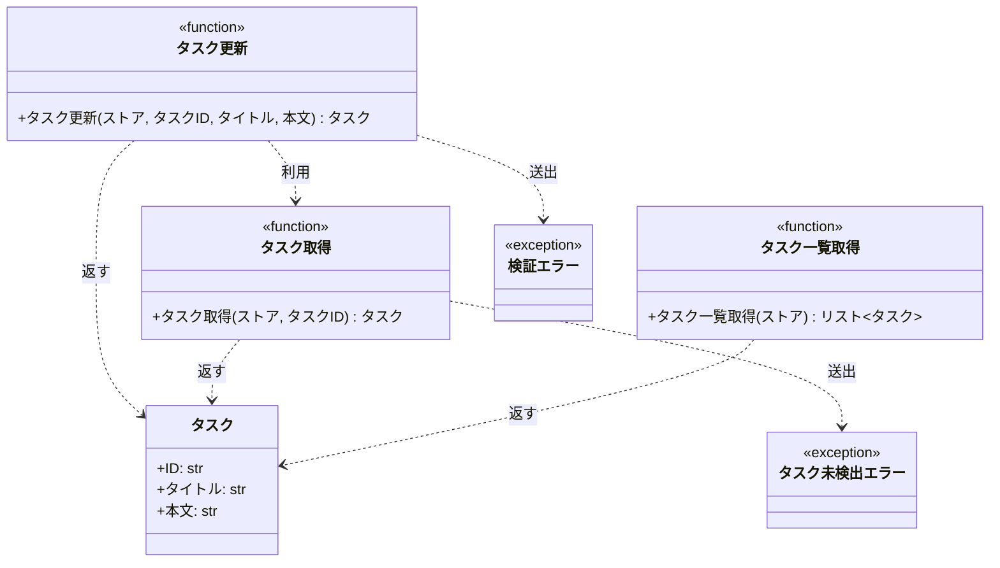

# モジュール構成: バックエンド / タスク

`タスク` ドメイン（バックエンド側）に属する構成要素詳細。

## 一覧

| ユースケース | 役割 | コンテナ | 種別 | 名前 | 概要 | 補足 |
| --- | --- | --- | --- | --- | --- | --- |
| 共通 | ドメインモデル | `tasks/models.py` | データモデル | [`Task`](#タスク) | タスク 1 件の内容 | - |
| 共通 | 例外 | `tasks/errors.py` | クラス | [`TaskNotFoundError`](#タスク未検出エラー) | 指定 ID のタスクが存在しない | - |
| 共通 | 例外 | `tasks/errors.py` | クラス | [`ValidationError`](#検証エラー) | 入力値が制約を満たさない | - |
| 共通 | クエリ | `tasks/service.py` | 関数 | [`get_task`](#タスク取得) | ストアからタスクを 1 件取得 | 未登録 ID は例外 |
| タスク編集 | サービス | `tasks/service.py` | 関数 | [`update_task`](#タスク更新) | タイトルと本文を検証して更新 | 違反時 `ValidationError` |
| タスク編集から一覧反映 | クエリ | `tasks/service.py` | 関数 | [`list_tasks`](#タスク一覧取得) | ストアのタスクを ID 順で一覧化 | - |

## ディレクトリ構成

```
src/tasks/
├── models.py     # Task
├── errors.py     # TaskNotFoundError / ValidationError
└── service.py    # get_task / update_task / list_tasks
```

## 構成図



## タスク
> 物理名: `Task`<br>
> 種別: データモデル<br>
> コンテナ: `tasks/models.py`

タスク 1 件の内容を保持する不変オブジェクト。

### プロパティ

| 論理名 | プロパティ名 | 型 | 可視性 | デフォルト | 説明 | 例 | 補足 |
| --- | --- | --- | --- | --- | --- | --- | --- |
| ID | `id` | `str` | 公開 | - | タスクの一意 ID | `"t1"` | ストアのキーと一致させる |
| タイトル | `title` | `str` | 公開 | - | タスクの表題 | `"新タイトル"` | 1 文字以上 100 文字以内（検証は [タスク更新](#タスク更新)） |
| 本文 | `content` | `str` | 公開 | `""` | タスクの詳細 | `"新本文"` | 1000 文字以内（検証は [タスク更新](#タスク更新)） |

### メソッド

なし

### 単体テスト

なし

### 補足

- `@dataclass(frozen=True, slots=True, kw_only=True)` で不変にしているため、更新は差し替えで行う

## タスク未検出エラー
> 物理名: `TaskNotFoundError`<br>
> 種別: クラス<br>
> コンテナ: `tasks/errors.py`

指定 ID のタスクがストアに存在しないことを表す例外。

### プロパティ

なし

### メソッド

なし

### 単体テスト

なし

## 検証エラー
> 物理名: `ValidationError`<br>
> 種別: クラス<br>
> コンテナ: `tasks/errors.py`

入力値が制約を満たさないことを表す例外。

### プロパティ

なし

### メソッド

なし

### 単体テスト

なし

## `tasks/service.py`
> 種別: ファイル

タスクの取得 / 更新 / 一覧化を担う関数ファイル。
ストアは `dict[str, Task]` を引数で受け取り、モジュール側では状態を持たない。

---

### タスク取得
> 物理名: `get_task`<br>
> 種別: 関数

ストアからタスクを 1 件取得する。

#### 引数

| 論理名 | 引数名 | 型 | 必須 | デフォルト | 説明 | 補足 |
| --- | --- | --- | --- | --- | --- | --- |
| ストア | `store` | `dict[str, Task]` | ✅ | - | タスクの保管先 | 値の型は [`Task`](#タスク) |
| タスク ID | `task_id` | `str` | ✅ | - | 取得対象の ID | - |

引数例:

```python
get_task({"t1": Task(id="t1", title="旧タイトル", content="旧本文")}, "t1")
```

#### 戻り値

| 型 | 説明 | 補足 |
| --- | --- | --- |
| [`Task`](#タスク) | 取得したタスク | - |

戻り値例:

```python
Task(id="t1", title="旧タイトル", content="旧本文")
```

#### 処理

1. 未登録の ID は例外にする
   - ストアに `task_id` が存在しない場合、`TaskNotFoundError` を送出する
2. ストアから該当タスクを返す

#### 例外

| 例外名 | 発生条件 | メッセージ | 補足 |
| --- | --- | --- | --- |
| `TaskNotFoundError` | ストアに `task_id` が存在しない | `"task not found: {task_id}"` | - |

#### 単体テスト

| テスト名 | 正常/異常 | 概要 | 条件 | Mock | 期待値 | 補足 |
| --- | --- | --- | --- | --- | --- | --- |
| `test_get_task` | 正常 | 登録済み ID でタスクを取得する | ストアに `t1` が存在する | なし | 該当の `Task` を返す | 未実装 |
| `test_get_task_when_task_missing` | 異常 | 未登録 ID を指定する | ストアに `t1` が存在しない | なし | `TaskNotFoundError` を送出 | 例外表「ストアに `task_id` が存在しない」に対応。未実装 |

---

### タスク更新
> 物理名: `update_task`<br>
> 種別: 関数

登録済みタスクのタイトルと本文を検証して更新する。

#### 引数

| 論理名 | 引数名 | 型 | 必須 | デフォルト | 説明 | 補足 |
| --- | --- | --- | --- | --- | --- | --- |
| ストア | `store` | `dict[str, Task]` | ✅ | - | タスクの保管先 | 値の型は [`Task`](#タスク) |
| タスク ID | `task_id` | `str` | ✅ | - | 更新対象の ID | - |
| タイトル | `title` | `str` | ✅ | - | 更新後の表題 | 1 文字以上 100 文字以内 |
| 本文 | `content` | `str` | - | `""` | 更新後の詳細 | 1000 文字以内 |

引数例:

```python
update_task({"t1": Task(id="t1", title="旧タイトル", content="旧本文")}, "t1", "新タイトル", "新本文")
```

#### 戻り値

| 型 | 説明 | 補足 |
| --- | --- | --- |
| [`Task`](#タスク) | 更新後のタスク | ストアにも同じ値を書き戻す |

戻り値例:

```python
Task(id="t1", title="新タイトル", content="新本文")
```

#### 処理

1. タイトルを検証する
   - 1 文字未満または 100 文字超の場合、`ValidationError` を送出する
2. 本文を検証する
   - 1000 文字超の場合、`ValidationError` を送出する
3. 対象タスクを取得する（[タスク取得](#タスク取得)）
4. 差し替えたタスクをストアに書き戻して返す

#### 例外

| 例外名 | 発生条件 | メッセージ | 補足 |
| --- | --- | --- | --- |
| `ValidationError` | `title` が 1 文字未満または 100 文字超 | `"title は 1 文字以上 100 文字以内"` | 上限違反と下限違反で同じメッセージを使う |
| `ValidationError` | `content` が 1000 文字超 | `"content は 1000 文字以内"` | - |

#### 単体テスト

| テスト名 | 正常/異常 | 概要 | 条件 | Mock | 期待値 | 補足 |
| --- | --- | --- | --- | --- | --- | --- |
| `test_update_task` | 正常 | タイトルと本文を更新する | ストアに `t1` が存在し、タイトル・本文とも制約内 | なし | 更新後の `Task` を返し、ストアの値も差し替わる | 実装済み |
| `test_update_task_when_title_empty` | 異常 | タイトルが空 | `title` が `""` | なし | `ValidationError` を送出し、ストアは変わらない | 例外表「`title` が 1 文字未満または 100 文字超」に対応。実装済み |
| `test_update_task_when_title_too_long` | 異常 | タイトルが上限超過 | `title` が 101 文字 | なし | `ValidationError` を送出し、ストアは変わらない | 例外表「`title` が 1 文字未満または 100 文字超」に対応。未実装 |
| `test_update_task_when_content_too_long` | 異常 | 本文が上限超過 | `content` が 1001 文字 | なし | `ValidationError` を送出し、ストアは変わらない | 例外表「`content` が 1000 文字超」に対応。未実装 |

---

### タスク一覧取得
> 物理名: `list_tasks`<br>
> 種別: 関数

ストアのタスクを ID 順で一覧にする。

#### 引数

| 論理名 | 引数名 | 型 | 必須 | デフォルト | 説明 | 補足 |
| --- | --- | --- | --- | --- | --- | --- |
| ストア | `store` | `dict[str, Task]` | ✅ | - | タスクの保管先 | 値の型は [`Task`](#タスク) |

引数例:

```python
list_tasks({"t2": Task(id="t2", title="B"), "t1": Task(id="t1", title="A")})
```

#### 戻り値

| 型 | 説明 | 補足 |
| --- | --- | --- |
| `list[`[`Task`](#タスク)`]` | ID の昇順に並べたタスク | - |

戻り値例:

```python
[Task(id="t1", title="A", content=""), Task(id="t2", title="B", content="")]
```

#### 処理

1. ストアのキーを昇順に並べ、対応するタスクを順に取り出して返す

#### 例外

なし

#### 単体テスト

| テスト名 | 正常/異常 | 概要 | 条件 | Mock | 期待値 | 補足 |
| --- | --- | --- | --- | --- | --- | --- |
| `test_list_tasks` | 正常 | ID 昇順で一覧化する | ストアに `t2` / `t1` を挿入順が逆で登録 | なし | `t1` / `t2` の順で返す | 未実装 |

### 補足

- ストアは呼び出し側が持ち、本ファイルの関数はすべて引数で受け取る（モジュール変数に状態を持たない）
- 単体テスト表の補足列にある「未実装」は、対応するテストが現時点のテストコードに存在しないことを指す
