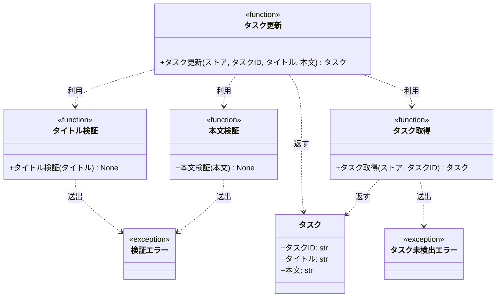

# モジュール構成: バックエンド / タスク

`タスク` ドメイン（バックエンド側）に属する構成要素詳細。

## 一覧

| ユースケース | 役割 | コンテナ | 種別 | 名前 | 概要 | 補足 |
| --- | --- | --- | --- | --- | --- | --- |
| 共通 | ドメインモデル | `tasks/models.py` | データモデル | [`Task`](#タスク) | タスク 1 件 | - |
| 共通 | 例外 | `tasks/errors.py` | クラス | [`TaskNotFoundError`](#タスク未検出エラー) | 指定 ID のタスクが存在しない | - |
| 共通 | 例外 | `tasks/errors.py` | クラス | [`ValidationError`](#検証エラー) | 入力値が制約を満たさない | - |
| 共通 | 定数 | `tasks/constants.py` | 定数 | `TITLE_MIN_LENGTH` | タイトルの最小文字数 | 値: `1` |
| 共通 | 定数 | `tasks/constants.py` | 定数 | `TITLE_MAX_LENGTH` | タイトルの最大文字数 | 値: `100` |
| 共通 | 定数 | `tasks/constants.py` | 定数 | `CONTENT_MAX_LENGTH` | 本文の最大文字数 | 値: `1000` |
| タスク編集 | バリデータ | `tasks/validators.py` | 関数 | [`validate_title`](#タイトル検証) | タイトルの文字数を検証する | 外部ライブラリを使わない自前実装 |
| タスク編集 | バリデータ | `tasks/validators.py` | 関数 | [`validate_content`](#本文検証) | 本文の文字数を検証する | 外部ライブラリを使わない自前実装 |
| タスク編集 | クエリ | `tasks/service.py` | 関数 | [`get_task`](#タスク取得) | ストアからタスクを 1 件取得する | - |
| タスク編集 | サービス | `tasks/service.py` | 関数 | [`update_task`](#タスク更新) | タイトルと本文を更新する | - |

## ディレクトリ構成

```
src/tasks/
├── models.py       # Task
├── errors.py       # TaskNotFoundError / ValidationError
├── constants.py    # 入力検証の文字数制限
├── validators.py   # 入力検証（自前実装）
└── service.py      # get_task / update_task
```

## 構成図



## タスク
> 物理名: `Task`<br>
> 種別: データモデル<br>
> コンテナ: `tasks/models.py`

タスク 1 件。

### プロパティ

| 論理名 | プロパティ名 | 型 | 可視性 | デフォルト | 説明 | 例 | 補足 |
| --- | --- | --- | --- | --- | --- | --- | --- |
| タスク ID | `id` | `str` | 公開 | - | タスクの一意 ID | `"t1"` | - |
| タイトル | `title` | `str` | 公開 | - | タスク名 | `"買い物"` | 検証は [タイトル検証](#タイトル検証) が担う |
| 本文 | `content` | `str` | 公開 | `""` | タスクの本文 | `"牛乳を買う"` | 検証は [本文検証](#本文検証) が担う |

### メソッド

なし

### 単体テスト

なし

### 補足

- `@dataclass(frozen=True, slots=True, kw_only=True)` の不変データモデル。
  更新は `dataclasses.replace` で新しいインスタンスを作る

## タスク未検出エラー
> 物理名: `TaskNotFoundError`<br>
> 種別: クラス<br>
> コンテナ: `tasks/errors.py`

指定 ID のタスクが存在しない。

### プロパティ

なし

### メソッド

なし

### 単体テスト

なし

## 検証エラー
> 物理名: `ValidationError`<br>
> 種別: クラス<br>
> コンテナ: `tasks/errors.py`

入力値が制約を満たさない。

### プロパティ

なし

### メソッド

なし

### 単体テスト

なし

### 補足

- 違反したフィールド名は属性ではなくメッセージ本文に含める（`"title must be ..."`）。
  画面のインライン表示はフロントエンド側の入力検証で行うため、バックエンドはフィールド単位の判別情報を返さない

## `tasks/validators.py`
> 種別: ファイル

タスクの入力値を検証する関数ファイル。
外部バリデーションライブラリを使わず、標準ライブラリの範囲だけで検証する。
各関数は違反を見つけた時点で [`ValidationError`](#検証エラー) を送出し、正常時は何も返さない。

---

### タイトル検証
> 物理名: `validate_title`<br>
> 種別: 関数

タイトルの文字数が許容範囲に収まっているかを検証する。

#### 引数

| 論理名 | 引数名 | 型 | 必須 | デフォルト | 説明 | 補足 |
| --- | --- | --- | --- | --- | --- | --- |
| タイトル | `title` | `str` | ✅ | - | 検証対象のタイトル | - |

引数例:

```python
validate_title("買い物")
```

#### 戻り値

| 型 | 説明 | 補足 |
| --- | --- | --- |
| `None` | なし | 違反時は例外で通知する |

#### 処理

1. 文字数が `TITLE_MIN_LENGTH` 未満、または `TITLE_MAX_LENGTH` 超過なら `ValidationError` を送出する

#### 例外

| 例外名 | 発生条件 | メッセージ | 補足 |
| --- | --- | --- | --- |
| `ValidationError` | 文字数が `TITLE_MIN_LENGTH` 未満 or `TITLE_MAX_LENGTH` 超過 | `"title must be between {TITLE_MIN_LENGTH} and {TITLE_MAX_LENGTH} characters"` | 空文字は最小文字数違反として同じ行で扱う |

#### 単体テスト

| テスト名 | 正常/異常 | 概要 | 条件 | Mock | 期待値 | 補足 |
| --- | --- | --- | --- | --- | --- | --- |
| `test_validate_title` | 正常 | 許容範囲のタイトルを通す | 1 文字 / 100 文字の境界値 | なし | 例外を送出しない | 下限・上限の境界を両方確認する |
| `test_validate_title_when_empty` | 異常 | 空タイトルを弾く | `title` に空文字 | なし | `ValidationError` を送出 | 例外表「`TITLE_MIN_LENGTH` 未満」に対応 |
| `test_validate_title_when_too_long` | 異常 | 長すぎるタイトルを弾く | 101 文字 | なし | `ValidationError` を送出 | 例外表「`TITLE_MAX_LENGTH` 超過」に対応 |

---

### 本文検証
> 物理名: `validate_content`<br>
> 種別: 関数

本文の文字数が上限に収まっているかを検証する。

#### 引数

| 論理名 | 引数名 | 型 | 必須 | デフォルト | 説明 | 補足 |
| --- | --- | --- | --- | --- | --- | --- |
| 本文 | `content` | `str` | ✅ | - | 検証対象の本文 | 空文字は許容する |

引数例:

```python
validate_content("牛乳を買う")
```

#### 戻り値

| 型 | 説明 | 補足 |
| --- | --- | --- |
| `None` | なし | 違反時は例外で通知する |

#### 処理

1. 文字数が `CONTENT_MAX_LENGTH` を超過していれば `ValidationError` を送出する

#### 例外

| 例外名 | 発生条件 | メッセージ | 補足 |
| --- | --- | --- | --- |
| `ValidationError` | 文字数が `CONTENT_MAX_LENGTH` 超過 | `"content must be {CONTENT_MAX_LENGTH} characters or fewer"` | - |

#### 単体テスト

| テスト名 | 正常/異常 | 概要 | 条件 | Mock | 期待値 | 補足 |
| --- | --- | --- | --- | --- | --- | --- |
| `test_validate_content` | 正常 | 許容範囲の本文を通す | 空文字 / 1000 文字の境界値 | なし | 例外を送出しない | 空文字が許容されることを確認する |
| `test_validate_content_when_too_long` | 異常 | 長すぎる本文を弾く | 1001 文字 | なし | `ValidationError` を送出 | 例外表「`CONTENT_MAX_LENGTH` 超過」に対応 |

## `tasks/service.py`
> 種別: ファイル

タスクのドメインロジックを束ねる関数ファイル。
ストアはインメモリの `dict[str, Task]` を引数で受け取る。

---

### タスク取得
> 物理名: `get_task`<br>
> 種別: 関数

ストアからタスクを 1 件取得する。

#### 引数

| 論理名 | 引数名 | 型 | 必須 | デフォルト | 説明 | 補足 |
| --- | --- | --- | --- | --- | --- | --- |
| ストア | `store` | [`dict[str, Task]`](#タスク) | ✅ | - | タスク ID をキーにしたインメモリストア | - |
| タスク ID | `task_id` | `str` | ✅ | - | 取得対象のタスク ID | - |

引数例:

```python
get_task({"t1": Task(id="t1", title="買い物")}, "t1")
```

#### 戻り値

| 型 | 説明 | 補足 |
| --- | --- | --- |
| [`Task`](#タスク) | 取得したタスク | - |

戻り値例:

```python
Task(id="t1", title="買い物", content="牛乳を買う")
```

#### 処理

1. ストアに `task_id` が無ければ `TaskNotFoundError` を送出する
2. ストアから該当タスクを返す

#### 例外

| 例外名 | 発生条件 | メッセージ | 補足 |
| --- | --- | --- | --- |
| `TaskNotFoundError` | ストアに `task_id` が存在しない | `"task not found: {task_id}"` | - |

#### 単体テスト

| テスト名 | 正常/異常 | 概要 | 条件 | Mock | 期待値 | 補足 |
| --- | --- | --- | --- | --- | --- | --- |
| `test_get_task` | 正常 | 登録済みタスクを取得する | ストアに `t1` を登録済み | なし | 登録した `Task` を返す | - |
| `test_get_task_when_task_missing` | 異常 | 未登録 ID を弾く | ストアに存在しない ID | なし | `TaskNotFoundError` を送出 | 例外表「`task_id` が存在しない」に対応 |

---

### タスク更新
> 物理名: `update_task`<br>
> 種別: 関数

登録済みタスクのタイトルと本文を更新する。

#### 引数

| 論理名 | 引数名 | 型 | 必須 | デフォルト | 説明 | 補足 |
| --- | --- | --- | --- | --- | --- | --- |
| ストア | `store` | [`dict[str, Task]`](#タスク) | ✅ | - | タスク ID をキーにしたインメモリストア | 更新結果を書き戻す |
| タスク ID | `task_id` | `str` | ✅ | - | 更新対象のタスク ID | - |
| タイトル | `title` | `str` | ✅ | - | 更新後のタスク名 | 1 文字以上 100 文字以内 |
| 本文 | `content` | `str` | - | `""` | 更新後の本文 | 1000 文字以内 |

引数例:

```python
update_task(store, "t1", title="買い物", content="牛乳を買う")
```

#### 戻り値

| 型 | 説明 | 補足 |
| --- | --- | --- |
| [`Task`](#タスク) | 更新後のタスク | ストアに書き戻したものと同一インスタンス |

戻り値例:

```python
Task(id="t1", title="買い物", content="牛乳を買う")
```

#### 処理

1. タイトルを検証する（[タイトル検証](#タイトル検証)）
2. 本文を検証する（[本文検証](#本文検証)）
3. 更新対象のタスクを取得する（[タスク取得](#タスク取得)）
4. 取得したタスクのタイトルと本文を差し替えた新しいタスクを作り、ストアへ書き戻して返す

#### 例外

なし

#### 単体テスト

セットアップ:

| セットアップ | 説明 | 補足 |
| --- | --- | --- |
| ストア | `t1` のタスクを 1 件登録した `dict` を用意する | 物理名: `store` |

| テスト名 | 正常/異常 | 概要 | 条件 | Mock | 期待値 | 補足 |
| --- | --- | --- | --- | --- | --- | --- |
| `test_update_task` | 正常 | タイトルと本文を更新する | 許容範囲のタイトルと本文を指定 | なし（同ドメインの純粋関数を実物のまま使う） | 更新後の `Task` を返し、ストアの `t1` も更新後の値になる | - |
| `test_update_task_when_title_invalid` | 異常 | 検証失敗を伝播する | `title` に空文字 | なし（同ドメインの純粋関数を実物のまま使う） | `ValidationError` を送出し、ストアが変更されていない | [タイトル検証](#タイトル検証) からの伝播の代表確認 |
| `test_update_task_when_task_missing` | 異常 | 未登録 ID を弾く | 存在しない `task_id` を指定 | なし（同ドメインの純粋関数を実物のまま使う） | `TaskNotFoundError` を送出し、ストアが変更されていない | [タスク取得](#タスク取得) からの伝播の代表確認 |

### 補足

- 検証（ステップ 1-2）を存在確認（ステップ 3）より先に置く。
  検証は副作用がなくストアに触れないため、どちらの違反も起きた場合は入力値の誤りを先に返すほうが呼び出し側が直しやすい
- [`update_task`](#タスク更新) 自身は例外を送出しない。
  [タイトル検証](#タイトル検証) / [本文検証](#本文検証) の `ValidationError` と [タスク取得](#タスク取得) の `TaskNotFoundError` はキャッチせずそのまま伝播させる
- 文字数の上限・下限はコードに直接書かず `tasks/constants.py` の定数を参照する
