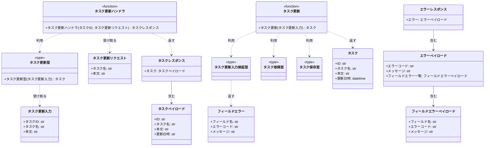
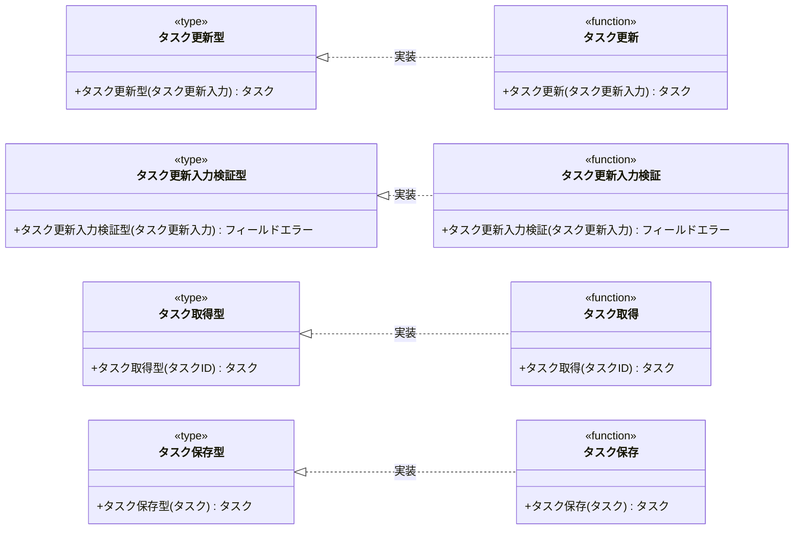
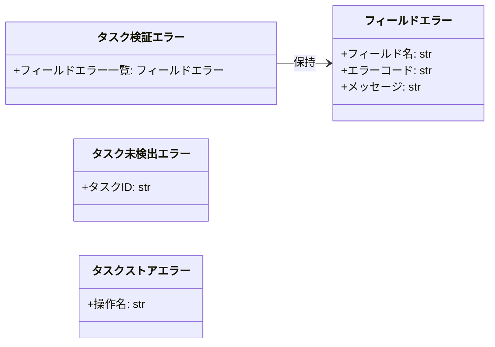

# モジュール構成: バックエンド / タスク

`タスク` ドメイン（バックエンド側）に属する構成要素詳細。

## 一覧

| ユースケース | 役割 | コンテナ | 種別 | 名前 | 概要 | 補足 |
| --- | --- | --- | --- | --- | --- | --- |
| 共通 | ドメインモデル | `src/tasks/types.py` | データモデル | [`Task`](#タスク) | tasks テーブル 1 行に対応するタスク | - |
| 共通 | DTO | `src/tasks/types.py` | データモデル | [`FieldError`](#フィールドエラー) | フィールド単位の検証エラー 1 件 | - |
| 共通 | 例外 | `src/tasks/types.py` | クラス | [`TaskValidationError`](#タスク検証エラー) | 検証に失敗した項目を全件運ぶ例外 | 400 に対応 |
| 共通 | 例外 | `src/tasks/types.py` | クラス | [`TaskNotFoundError`](#タスク未検出エラー) | 対象タスクが存在しないことを表す例外 | 404 に対応 |
| 共通 | 例外 | `src/tasks/types.py` | クラス | [`TaskStoreError`](#タスクストアエラー) | tasks テーブルの読み書き失敗を表す例外 | 500 に対応 |
| 共通 | 定数 | `src/tasks/constants.py` | 定数 | `TITLE_MAX_LENGTH` | タスク名の最大文字数（100） | 単純即値のため詳細セクションなし |
| 共通 | 定数 | `src/tasks/constants.py` | 定数 | `BODY_MAX_LENGTH` | 本文の最大文字数（2000） | 単純即値のため詳細セクションなし |
| 共通 | リポジトリ | `src/tasks/db.py` | 関数 | [`find_task`](#タスク取得) | ID でタスクを 1 件取得する | - |
| 共通 | リポジトリ型（DI） | `src/tasks/types.py` | 関数型 | [`FindTask`](#タスク取得型) | `find_task` のシグネチャ型 | DI / Mock 差し替え用 |
| タスク更新 | DTO | `src/tasks/types.py` | データモデル | [`UpdateTaskInput`](#タスク更新入力) | 更新の入力値をまとめた内部 DTO | - |
| タスク更新 | リクエストスキーマ | `src/tasks/schemas.py` | データモデル | [`UpdateTaskRequest`](#タスク更新リクエスト) | 更新リクエストのボディ | - |
| タスク更新 | レスポンススキーマ | `src/tasks/schemas.py` | データモデル | [`TaskPayload`](#タスクペイロード) | レスポンスのタスク部分 | - |
| タスク更新 | レスポンススキーマ | `src/tasks/schemas.py` | データモデル | [`TaskResponse`](#タスクレスポンス) | 更新成功時のレスポンス | - |
| タスク更新 | レスポンススキーマ | `src/tasks/schemas.py` | データモデル | [`FieldErrorPayload`](#フィールドエラーペイロード) | レスポンスの検証エラー 1 件 | - |
| タスク更新 | レスポンススキーマ | `src/tasks/schemas.py` | データモデル | [`ErrorPayload`](#エラーペイロード) | レスポンスのエラー本体 | - |
| タスク更新 | レスポンススキーマ | `src/tasks/schemas.py` | データモデル | [`ErrorResponse`](#エラーレスポンス) | 異常時のレスポンス | 共通の例外ハンドラが組み立てる |
| タスク更新 | バリデータ | `src/tasks/validators.py` | 関数 | [`validate_update_task_input`](#タスク更新入力検証) | 入力値を全項目検証して失敗を返す | - |
| タスク更新 | バリデータ型（DI） | `src/tasks/types.py` | 関数型 | [`ValidateUpdateTaskInput`](#タスク更新入力検証型) | `validate_update_task_input` のシグネチャ型 | DI / Mock 差し替え用 |
| タスク更新 | サービス | `src/tasks/service.py` | 関数 | [`update_task`](#タスク更新) | 検証 → 取得 → 保存を束ねる | - |
| タスク更新 | サービス型（DI） | `src/tasks/types.py` | 関数型 | [`UpdateTask`](#タスク更新型) | `update_task` のシグネチャ型 | DI / Mock 差し替え用 |
| タスク更新 | リポジトリ | `src/tasks/db.py` | 関数 | [`save_task`](#タスク保存) | タスクの更新内容を永続化する | - |
| タスク更新 | リポジトリ型（DI） | `src/tasks/types.py` | 関数型 | [`SaveTask`](#タスク保存型) | `save_task` のシグネチャ型 | DI / Mock 差し替え用 |
| タスク更新 | ハンドラ | `src/tasks/route.py` | 関数 | [`update_task_route`](#タスク更新ハンドラ) | `PUT /tasks/{task_id}` の入口 | - |

## ディレクトリ構成

```
src/tasks/
├── constants.py     # TITLE_MAX_LENGTH / BODY_MAX_LENGTH
├── types.py         # Task / FieldError / UpdateTaskInput / 例外 / 関数型
├── schemas.py       # リクエスト / レスポンスの Pydantic モデル
├── validators.py    # validate_update_task_input
├── service.py       # update_task
├── db.py            # find_task / save_task
└── route.py         # PUT /tasks/{task_id}
```

## 構成図

### タスク更新



---

### 関数型の実装



---

### 例外



## タスク
> 物理名: `Task`<br>
> 種別: データモデル<br>
> コンテナ: `src/tasks/types.py`

tasks テーブルの 1 行に対応するタスク。

### プロパティ

| 論理名 | プロパティ名 | 型 | 可視性 | デフォルト | 説明 | 例 | 補足 |
| --- | --- | --- | --- | --- | --- | --- | --- |
| ID | `id` | `str` | 公開 | - | タスクの一意 ID | `"3f2b1c88-0f3e-4f7a-9a2b-5f1c2d3e4a5b"` | - |
| タスク名 | `title` | `str` | 公開 | - | タスク名 | `"決算資料の作成"` | 空文字は取らない（検証済みの値だけを載せる） |
| 本文 | `body` | `str` | 公開 | - | タスクの本文 | `"四半期分の売上を集計する"` | 本文なしは空文字 |
| 更新日時 | `updated_at` | `datetime` | 公開 | - | 最終更新日時 | `datetime(2026, 7, 31, 4, 12, 33, tzinfo=UTC)` | タイムゾーン付き UTC |

### メソッド

なし

### 単体テスト

なし

## フィールドエラー
> 物理名: `FieldError`<br>
> 種別: データモデル<br>
> コンテナ: `src/tasks/types.py`

検証に失敗したフィールド 1 件分の内容。

### プロパティ

| 論理名 | プロパティ名 | 型 | 可視性 | デフォルト | 説明 | 例 | 補足 |
| --- | --- | --- | --- | --- | --- | --- | --- |
| フィールド名 | `field` | `Literal["title", "body"]` | 公開 | - | 検証に失敗したフィールド | `"title"` | - |
| エラーコード | `code` | `Literal["required", "too_long"]` | 公開 | - | 違反した検証ルール | `"required"` | - |
| メッセージ | `message` | `str` | 公開 | - | 画面のインラインエラーに表示する文言 | `"タスク名を入力してください"` | - |

### メソッド

なし

### 単体テスト

なし

## タスク更新入力
> 物理名: `UpdateTaskInput`<br>
> 種別: データモデル<br>
> コンテナ: `src/tasks/types.py`

更新に必要な入力値をまとめた内部 DTO。

### プロパティ

| 論理名 | プロパティ名 | 型 | 可視性 | デフォルト | 説明 | 例 | 補足 |
| --- | --- | --- | --- | --- | --- | --- | --- |
| タスクID | `task_id` | `str` | 公開 | - | 更新対象のタスク ID | `"3f2b1c88-0f3e-4f7a-9a2b-5f1c2d3e4a5b"` | パスパラメータ由来 |
| タスク名 | `title` | `str` | 公開 | - | 更新後のタスク名 | `"決算資料の作成"` | 未検証の値が入る |
| 本文 | `body` | `str` | 公開 | - | 更新後の本文 | `"四半期分の売上を集計する"` | 未検証の値が入る |

### メソッド

なし

### 単体テスト

なし

## タスク検証エラー
> 物理名: `TaskValidationError`<br>
> 種別: クラス<br>
> コンテナ: `src/tasks/types.py`

入力検証に失敗した項目を全件まとめて運ぶ例外。

### プロパティ

| 論理名 | プロパティ名 | 型 | 可視性 | デフォルト | 説明 | 例 | 補足 |
| --- | --- | --- | --- | --- | --- | --- | --- |
| フィールドエラー一覧 | `errors` | [`list[FieldError]`](#フィールドエラー) | 公開 | - | 検証に失敗した項目 | `[FieldError(field="title", code="required", ...)]` | 1 件以上必ず入る |

### メソッド

なし

### 単体テスト

なし

## タスク未検出エラー
> 物理名: `TaskNotFoundError`<br>
> 種別: クラス<br>
> コンテナ: `src/tasks/types.py`

指定 ID のタスクが存在しないことを表す例外。

### プロパティ

| 論理名 | プロパティ名 | 型 | 可視性 | デフォルト | 説明 | 例 | 補足 |
| --- | --- | --- | --- | --- | --- | --- | --- |
| タスクID | `task_id` | `str` | 公開 | - | 見つからなかったタスクの ID | `"missing-id"` | - |

### メソッド

なし

### 単体テスト

なし

## タスクストアエラー
> 物理名: `TaskStoreError`<br>
> 種別: クラス<br>
> コンテナ: `src/tasks/types.py`

tasks テーブルの読み書きに失敗したことを表す例外。
DB ドライバの例外をこの型にラップして、上位が DB 実装を知らずに済むようにする。

### プロパティ

| 論理名 | プロパティ名 | 型 | 可視性 | デフォルト | 説明 | 例 | 補足 |
| --- | --- | --- | --- | --- | --- | --- | --- |
| 操作名 | `operation` | `Literal["find", "save"]` | 公開 | - | 失敗した操作 | `"save"` | - |

### メソッド

なし

### 単体テスト

なし

## タスク更新リクエスト
> 物理名: `UpdateTaskRequest`<br>
> 種別: データモデル<br>
> コンテナ: `src/tasks/schemas.py`

`PUT /tasks/{task_id}` のリクエストボディ。

### プロパティ

| 論理名 | プロパティ名 | 型 | 可視性 | デフォルト | 説明 | 例 | 補足 |
| --- | --- | --- | --- | --- | --- | --- | --- |
| タスク名 | `title` | `str` | 公開 | - | 更新後のタスク名 | `"決算資料の作成"` | 文字数の検証はスキーマではなくバリデータで行う |
| 本文 | `body` | `str` | 公開 | `""` | 更新後の本文 | `"四半期分の売上を集計する"` | 省略時は空文字で上書き |

### メソッド

なし

### 単体テスト

なし

## タスクペイロード
> 物理名: `TaskPayload`<br>
> 種別: データモデル<br>
> コンテナ: `src/tasks/schemas.py`

レスポンスに載せるタスク 1 件分。

### プロパティ

| 論理名 | プロパティ名 | 型 | 可視性 | デフォルト | 説明 | 例 | 補足 |
| --- | --- | --- | --- | --- | --- | --- | --- |
| ID | `id` | `str` | 公開 | - | タスク ID | `"3f2b1c88-0f3e-4f7a-9a2b-5f1c2d3e4a5b"` | - |
| タスク名 | `title` | `str` | 公開 | - | 更新後のタスク名 | `"決算資料の作成"` | - |
| 本文 | `body` | `str` | 公開 | - | 更新後の本文 | `"四半期分の売上を集計する"` | - |
| 更新日時 | `updated_at` | `str` | 公開 | - | 更新日時（ISO 8601・UTC） | `"2026-07-31T04:12:33+00:00"` | JSON 上のフィールド名は `updatedAt` |

### メソッド

なし

### 単体テスト

なし

## タスクレスポンス
> 物理名: `TaskResponse`<br>
> 種別: データモデル<br>
> コンテナ: `src/tasks/schemas.py`

更新成功時のレスポンスボディ。

### プロパティ

| 論理名 | プロパティ名 | 型 | 可視性 | デフォルト | 説明 | 例 | 補足 |
| --- | --- | --- | --- | --- | --- | --- | --- |
| タスク | `task` | [`TaskPayload`](#タスクペイロード) | 公開 | - | 更新後のタスク | `TaskPayload(id="3f2b...", ...)` | - |

### メソッド

なし

### 単体テスト

なし

## フィールドエラーペイロード
> 物理名: `FieldErrorPayload`<br>
> 種別: データモデル<br>
> コンテナ: `src/tasks/schemas.py`

レスポンスに載せる検証エラー 1 件分。

### プロパティ

| 論理名 | プロパティ名 | 型 | 可視性 | デフォルト | 説明 | 例 | 補足 |
| --- | --- | --- | --- | --- | --- | --- | --- |
| フィールド名 | `field` | `Literal["title", "body"]` | 公開 | - | 検証に失敗したフィールド | `"title"` | - |
| エラーコード | `code` | `Literal["required", "too_long"]` | 公開 | - | 違反した検証ルール | `"required"` | - |
| メッセージ | `message` | `str` | 公開 | - | 表示用メッセージ | `"タスク名を入力してください"` | - |

### メソッド

なし

### 単体テスト

なし

## エラーペイロード
> 物理名: `ErrorPayload`<br>
> 種別: データモデル<br>
> コンテナ: `src/tasks/schemas.py`

レスポンスのエラー本体。

### プロパティ

| 論理名 | プロパティ名 | 型 | 可視性 | デフォルト | 説明 | 例 | 補足 |
| --- | --- | --- | --- | --- | --- | --- | --- |
| エラーコード | `code` | `Literal["validation_failed", "task_not_found", "internal_error"]` | 公開 | - | エラー種別 | `"validation_failed"` | - |
| メッセージ | `message` | `str` | 公開 | - | 表示用メッセージ | `"入力内容に誤りがあります"` | - |
| フィールドエラー一覧 | `fields` | [`list[FieldErrorPayload]`](#フィールドエラーペイロード) | 公開 | `[]` | フィールド単位の検証エラー | `[FieldErrorPayload(field="title", ...)]` | `validation_failed` 以外では空 |

### メソッド

なし

### 単体テスト

なし

## エラーレスポンス
> 物理名: `ErrorResponse`<br>
> 種別: データモデル<br>
> コンテナ: `src/tasks/schemas.py`

異常時のレスポンスボディ。

### プロパティ

| 論理名 | プロパティ名 | 型 | 可視性 | デフォルト | 説明 | 例 | 補足 |
| --- | --- | --- | --- | --- | --- | --- | --- |
| エラー | `error` | [`ErrorPayload`](#エラーペイロード) | 公開 | - | エラー内容 | `ErrorPayload(code="task_not_found", ...)` | - |

### メソッド

なし

### 単体テスト

なし

## `src/tasks/types.py`
> 種別: ファイル

タスクドメインの DTO・例外・関数型エイリアスを置くファイル。
関数型は全て DI で差し替える依存の口として定義する。

---

### タスク更新型
> 物理名: `UpdateTask`<br>
> 種別: 関数型

タスクを更新する関数のシグネチャ。

#### 引数

| 論理名 | 引数名 | 型 | 必須 | デフォルト | 説明 | 補足 |
| --- | --- | --- | --- | --- | --- | --- |
| タスク更新入力 | `task_input` | [`UpdateTaskInput`](#タスク更新入力) | ✅ | - | 更新の入力値 | - |

#### 戻り値

| 型 | 説明 | 補足 |
| --- | --- | --- |
| [`Task`](#タスク) | 更新後のタスク | - |

#### 実装

| 実装 | 補足 |
| --- | --- |
| [タスク更新](#タスク更新) | 本番の実装 |

---

### タスク更新入力検証型
> 物理名: `ValidateUpdateTaskInput`<br>
> 種別: 関数型

入力値を検証する関数のシグネチャ。

#### 引数

| 論理名 | 引数名 | 型 | 必須 | デフォルト | 説明 | 補足 |
| --- | --- | --- | --- | --- | --- | --- |
| タスク更新入力 | `task_input` | [`UpdateTaskInput`](#タスク更新入力) | ✅ | - | 検証対象の入力値 | - |

#### 戻り値

| 型 | 説明 | 補足 |
| --- | --- | --- |
| [`list[FieldError]`](#フィールドエラー) | 検証に失敗した項目 | 失敗なしなら空リスト |

#### 実装

| 実装 | 補足 |
| --- | --- |
| [タスク更新入力検証](#タスク更新入力検証) | 本番の実装 |

---

### タスク取得型
> 物理名: `FindTask`<br>
> 種別: 関数型

ID でタスクを 1 件取得する関数のシグネチャ。

#### 引数

| 論理名 | 引数名 | 型 | 必須 | デフォルト | 説明 | 補足 |
| --- | --- | --- | --- | --- | --- | --- |
| タスクID | `task_id` | `str` | ✅ | - | 取得対象のタスク ID | - |

#### 戻り値

| 型 | 説明 | 補足 |
| --- | --- | --- |
| [`Task \| None`](#タスク) | 見つかったタスク | 見つからない場合は `None` |

#### 実装

| 実装 | 補足 |
| --- | --- |
| [タスク取得](#タスク取得) | 本番の実装 |

---

### タスク保存型
> 物理名: `SaveTask`<br>
> 種別: 関数型

タスクの更新内容を永続化する関数のシグネチャ。

#### 引数

| 論理名 | 引数名 | 型 | 必須 | デフォルト | 説明 | 補足 |
| --- | --- | --- | --- | --- | --- | --- |
| タスク | `task` | [`Task`](#タスク) | ✅ | - | 保存するタスク | 更新後の値が入っている |

#### 戻り値

| 型 | 説明 | 補足 |
| --- | --- | --- |
| [`Task`](#タスク) | 保存後のタスク | - |

#### 実装

| 実装 | 補足 |
| --- | --- |
| [タスク保存](#タスク保存) | 本番の実装 |

## `src/tasks/validators.py`
> 種別: ファイル

タスクの入力検証を集約するファイル。
検証結果は例外ではなく [`FieldError`](#フィールドエラー) のリストで返し、例外に変換するかは呼び出し側が決める。

---

### タスク更新入力検証
> 物理名: `validate_update_task_input`<br>
> 種別: 関数<br>
> 継承元: [`ValidateUpdateTaskInput`](#タスク更新入力検証型)

タスク更新の入力値を全項目検証し、失敗した項目を返す。

#### 引数

| 論理名 | 引数名 | 型 | 必須 | デフォルト | 説明 | 補足 |
| --- | --- | --- | --- | --- | --- | --- |
| タスク更新入力 | `task_input` | [`UpdateTaskInput`](#タスク更新入力) | ✅ | - | 検証対象の入力値 | - |

引数例:

```python
validate_update_task_input(UpdateTaskInput(task_id="3f2b1c88", title="", body=""))
```

#### 戻り値

| 型 | 説明 | 補足 |
| --- | --- | --- |
| [`list[FieldError]`](#フィールドエラー) | 検証に失敗した項目 | 失敗なしなら空リスト |

戻り値例:

```python
[FieldError(field="title", code="required", message="タスク名を入力してください")]
```

#### 処理

1. タスク名の前後の空白を除去する
2. タスク名を検証する
   - 空文字の場合、`required` の [`FieldError`](#フィールドエラー) を積む
   - `TITLE_MAX_LENGTH` を超える場合、`too_long` の [`FieldError`](#フィールドエラー) を積む
3. 本文を検証する
   - `BODY_MAX_LENGTH` を超える場合、`too_long` の [`FieldError`](#フィールドエラー) を積む
4. 積んだ失敗項目をそのまま返す（1 件目で打ち切らない）

#### 例外

なし

#### 単体テスト

| テスト名 | 正常/異常 | 概要 | 条件 | Mock | 期待値 | 補足 |
| --- | --- | --- | --- | --- | --- | --- |
| `test_validate_update_task_input` | 正常 | 全項目が制限内 | タスク名 10 文字 / 本文 100 文字 | なし | 空リストを返す | - |
| `test_validate_update_task_input_when_title_empty` | 異常 | タスク名が空 | タスク名が空文字 | なし | `field="title"` / `code="required"` の 1 件を返す | - |
| `test_validate_update_task_input_when_title_blank` | 異常 | タスク名が空白のみ | タスク名が半角スペース 3 文字 | なし | `field="title"` / `code="required"` の 1 件を返す | 前後の空白を除去する分岐に対応 |
| `test_validate_update_task_input_when_title_too_long` | 異常 | タスク名が上限超過 | タスク名 101 文字 | なし | `field="title"` / `code="too_long"` の 1 件を返す | - |
| `test_validate_update_task_input_when_body_too_long` | 異常 | 本文が上限超過 | 本文 2001 文字 | なし | `field="body"` / `code="too_long"` の 1 件を返す | - |
| `test_validate_update_task_input_when_both_invalid` | 異常 | 複数項目が不正 | タスク名が空 + 本文 2001 文字 | なし | 2 件を返す | 打ち切らない挙動に対応 |

## `src/tasks/service.py`
> 種別: ファイル

タスク更新のドメインロジックを束ねる関数ファイル。
外部依存（検証・取得・保存・現在時刻）は全て関数型でキーワード引数から受け取る。

---

### タスク更新
> 物理名: `update_task`<br>
> 種別: 関数<br>
> 継承元: [`UpdateTask`](#タスク更新型)

入力値を検証してから対象タスクを更新する。

#### 引数

| 論理名 | 引数名 | 型 | 必須 | デフォルト | 説明 | 補足 |
| --- | --- | --- | --- | --- | --- | --- |
| タスク更新入力 | `task_input` | [`UpdateTaskInput`](#タスク更新入力) | ✅ | - | 更新の入力値 | - |
| 検証 | `validate` | [`ValidateUpdateTaskInput`](#タスク更新入力検証型) | ✅ | - | 入力検証の実装 | キーワード引数 |
| 取得 | `find` | [`FindTask`](#タスク取得型) | ✅ | - | タスク取得の実装 | キーワード引数 |
| 保存 | `save` | [`SaveTask`](#タスク保存型) | ✅ | - | タスク保存の実装 | キーワード引数 |
| 現在時刻 | `now` | `Callable[[], datetime]` | ✅ | - | 更新日時の生成 | キーワード引数。テストで固定時刻に差し替える |

引数例:

```python
update_task(
    UpdateTaskInput(task_id="3f2b1c88", title="決算資料の作成", body="四半期分の売上を集計する"),
    validate=validate_update_task_input,
    find=find_task,
    save=save_task,
    now=now_utc,
)
```

#### 戻り値

| 型 | 説明 | 補足 |
| --- | --- | --- |
| [`Task`](#タスク) | 更新後のタスク | - |

戻り値例:

```python
Task(id="3f2b1c88", title="決算資料の作成", body="四半期分の売上を集計する", updated_at=datetime(2026, 7, 31, 4, 12, 33, tzinfo=UTC))
```

#### 処理

1. 入力値を検証する（[タスク更新入力検証](#タスク更新入力検証)）
   - 失敗項目がある場合、[`TaskValidationError`](#タスク検証エラー) を投げる
   - `[WARNING]` 入力検証に失敗した（`task_id` / 失敗したフィールド名の一覧）
2. 対象タスクを取得する（[タスク取得](#タスク取得)）
   - 見つからない場合、[`TaskNotFoundError`](#タスク未検出エラー) を投げる
   - `[WARNING]` 更新対象のタスクが見つからなかった（`task_id`）
3. 取得したタスクにタスク名・本文・現在時刻を反映した新しい [`Task`](#タスク) を組み立てる
4. 組み立てたタスクを保存して返す（[タスク保存](#タスク保存)）
   - `[INFO]` タスクを更新した（`task_id`）

#### 例外

| 例外名 | 発生条件 | メッセージ | 補足 |
| --- | --- | --- | --- |
| `TaskValidationError` | 入力検証で失敗項目が 1 件以上ある | `"入力内容に誤りがあります"` | 400 に対応 |
| `TaskNotFoundError` | 指定 ID のタスクが取得できない | `"タスクが見つかりません: {task_id}"` | 404 に対応 |

#### 単体テスト

| テスト名 | 正常/異常 | 概要 | 条件 | Mock | 期待値 | 補足 |
| --- | --- | --- | --- | --- | --- | --- |
| `test_update_task` | 正常 | 検証を通って更新される | 検証が空リスト / 取得が既存タスクを返す | `validate` / `find` / `save` / `now` | 更新後の `Task` を返し、`save` に反映済みの `Task` が渡る | 更新日時が `now` の値になる |
| `test_update_task_when_validation_failed` | 異常 | 入力検証に失敗 | 検証が `FieldError` を 1 件返す | `validate` / `find` / `save` / `now` | `TaskValidationError` を投げ、`find` / `save` を呼ばない | 例外表「失敗項目が 1 件以上ある」に対応 |
| `test_update_task_when_task_missing` | 異常 | 対象タスクが無い | 取得が `None` を返す | `validate` / `find` / `save` / `now` | `TaskNotFoundError` を投げ、`save` を呼ばない | 例外表「指定 ID のタスクが取得できない」に対応 |

## `src/tasks/db.py`
> 種別: ファイル

tasks テーブルへの読み書きを担う関数ファイル。
DB ドライバの例外はこのファイルで [`TaskStoreError`](#タスクストアエラー) にラップし、上位へ素通しさせない。

---

### タスク取得
> 物理名: `find_task`<br>
> 種別: 関数<br>
> 継承元: [`FindTask`](#タスク取得型)

ID でタスクを 1 件取得する。

#### 引数

| 論理名 | 引数名 | 型 | 必須 | デフォルト | 説明 | 補足 |
| --- | --- | --- | --- | --- | --- | --- |
| タスクID | `task_id` | `str` | ✅ | - | 取得対象のタスク ID | - |

引数例:

```python
find_task("3f2b1c88-0f3e-4f7a-9a2b-5f1c2d3e4a5b")
```

#### 戻り値

| 型 | 説明 | 補足 |
| --- | --- | --- |
| [`Task \| None`](#タスク) | 見つかったタスク | 見つからない場合は `None` |

戻り値例:

```python
Task(id="3f2b1c88", title="決算資料の作成", body="", updated_at=datetime(2026, 7, 30, 1, 0, 0, tzinfo=UTC))
```

#### 処理

1. tasks テーブルから ID 一致の 1 行を取得する（DB ドライバが例外を投げた場合、[`TaskStoreError`](#タスクストアエラー) にラップして投げる）
2. 取得結果から戻り値を確定する
   - 行がある場合、[`Task`](#タスク) に変換して返す
   - 行が無い場合、`None` を返す

#### 例外

| 例外名 | 発生条件 | メッセージ | 補足 |
| --- | --- | --- | --- |
| `TaskStoreError` | 取得時に DB ドライバが例外を投げた | `"タスクの取得に失敗しました"` | 500 に対応 |

#### 単体テスト

| テスト名 | 正常/異常 | 概要 | 条件 | Mock | 期待値 | 補足 |
| --- | --- | --- | --- | --- | --- | --- |
| `test_find_task` | 正常 | 既存タスクを取得 | ID 一致の行がある | DB 接続 | `Task` を返す | - |
| `test_find_task_when_row_missing` | 正常 | 該当行なし | ID 一致の行が無い | DB 接続 | `None` を返す | - |
| `test_find_task_when_driver_raises` | 異常 | DB 例外 | DB 接続が例外を投げる | DB 接続 | `TaskStoreError` を投げる | 例外表「取得時に DB ドライバが例外を投げた」に対応 |

---

### タスク保存
> 物理名: `save_task`<br>
> 種別: 関数<br>
> 継承元: [`SaveTask`](#タスク保存型)

タスクの更新内容を tasks テーブルに反映する。

#### 引数

| 論理名 | 引数名 | 型 | 必須 | デフォルト | 説明 | 補足 |
| --- | --- | --- | --- | --- | --- | --- |
| タスク | `task` | [`Task`](#タスク) | ✅ | - | 保存するタスク | 更新後の値が入っている |

引数例:

```python
save_task(Task(id="3f2b1c88", title="決算資料の作成", body="", updated_at=datetime(2026, 7, 31, 4, 12, 33, tzinfo=UTC)))
```

#### 戻り値

| 型 | 説明 | 補足 |
| --- | --- | --- |
| [`Task`](#タスク) | 保存後のタスク | 引数と同じ値が返る |

戻り値例:

```python
Task(id="3f2b1c88", title="決算資料の作成", body="", updated_at=datetime(2026, 7, 31, 4, 12, 33, tzinfo=UTC))
```

#### 処理

1. tasks テーブルの該当行のタスク名・本文・更新日時を更新する（DB ドライバが例外を投げた場合、[`TaskStoreError`](#タスクストアエラー) にラップして投げる）
2. 保存したタスクを返す

#### 例外

| 例外名 | 発生条件 | メッセージ | 補足 |
| --- | --- | --- | --- |
| `TaskStoreError` | 更新時に DB ドライバが例外を投げた | `"タスクの保存に失敗しました"` | 500 に対応 |

#### 単体テスト

| テスト名 | 正常/異常 | 概要 | 条件 | Mock | 期待値 | 補足 |
| --- | --- | --- | --- | --- | --- | --- |
| `test_save_task` | 正常 | 更新が反映される | 該当行がある | DB 接続 | 保存後の `Task` を返し、DB 接続に更新文が渡る | - |
| `test_save_task_when_driver_raises` | 異常 | DB 例外 | DB 接続が例外を投げる | DB 接続 | `TaskStoreError` を投げる | 例外表「更新時に DB ドライバが例外を投げた」に対応 |

## `src/tasks/route.py`
> 種別: ファイル

タスクの HTTP ルーターを置くファイル。
リクエスト / レスポンスの詰め替えだけを行い、業務ロジックは [`src/tasks/service.py`](#srctasksservicepy) 側に置く。

---

### タスク更新ハンドラ
> 物理名: `update_task_route`<br>
> 種別: 関数

`PUT /tasks/{task_id}` を受けてタスクを更新する。

#### 引数

| 論理名 | 引数名 | 型 | 必須 | デフォルト | 説明 | 補足 |
| --- | --- | --- | --- | --- | --- | --- |
| タスクID | `task_id` | `str` | ✅ | - | 更新対象のタスク ID | パスパラメータ |
| リクエスト | `request` | [`UpdateTaskRequest`](#タスク更新リクエスト) | ✅ | - | リクエストボディ | - |
| タスク更新 | `update` | [`UpdateTask`](#タスク更新型) | ✅ | - | 更新処理の実装 | `Depends` で注入 |

引数例:

```python
update_task_route("3f2b1c88", UpdateTaskRequest(title="決算資料の作成", body=""), update=wired_update_task)
```

#### 戻り値

| 型 | 説明 | 補足 |
| --- | --- | --- |
| [`TaskResponse`](#タスクレスポンス) | 更新後のタスク | ステータスコードは `200` |

戻り値例:

```python
TaskResponse(task=TaskPayload(id="3f2b1c88", title="決算資料の作成", body="", updated_at="2026-07-31T04:12:33+00:00"))
```

#### 処理

1. パスパラメータとリクエストボディから [`UpdateTaskInput`](#タスク更新入力) を組み立てる
2. タスクを更新する（[タスク更新](#タスク更新)）
3. 更新後のタスクを [`TaskResponse`](#タスクレスポンス) に詰めて返す

#### 例外

なし

#### 単体テスト

| テスト名 | 正常/異常 | 概要 | 条件 | Mock | 期待値 | 補足 |
| --- | --- | --- | --- | --- | --- | --- |
| `test_update_task_route` | 正常 | 更新後のタスクを返す | 更新処理が `Task` を返す | `update` | `TaskResponse` を返し、`update` に組み立てた `UpdateTaskInput` が渡る | - |
| `test_update_task_route_when_update_raises` | 異常 | 例外を変換しない | 更新処理が `TaskValidationError` を投げる | `update` | `TaskValidationError` がそのまま送出される | HTTP 変換は共通の例外ハンドラの責務 |

### 補足

- 本ファイルは例外を捕まえず、そのまま送出する。
  例外から HTTP レスポンスへの変換は共通の例外ハンドラが担い、[`ErrorResponse`](#エラーレスポンス) を組み立てる
- 例外とステータスコードの対応は次のとおり

| 例外 | ステータスコード | `error.code` |
| --- | --- | --- |
| [`TaskValidationError`](#タスク検証エラー) | `400` | `validation_failed` |
| [`TaskNotFoundError`](#タスク未検出エラー) | `404` | `task_not_found` |
| [`TaskStoreError`](#タスクストアエラー) | `500` | `internal_error` |
