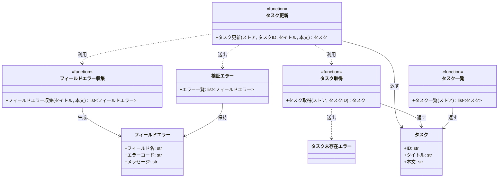

# モジュール構成: バックエンド / タスク

`タスク` ドメイン（バックエンド側）に属する構成要素詳細。

- 対応テストファイル: `tests/unit/tasks/test_service.py`

## 一覧

| ユースケース | 役割 | コンテナ | 種別 | 名前 | 概要 | 補足 |
| --- | --- | --- | --- | --- | --- | --- |
| 共通 | ドメインモデル | `tasks/models.py` | データモデル | [`Task`](#タスク) | タスク 1 件 | 不変（frozen） |
| 共通 | エラー詳細 | `tasks/errors.py` | データモデル | [`FieldError`](#フィールドエラー) | フィールド単位の検証エラー 1 件 | 不変（frozen） |
| 共通 | 例外 | `tasks/errors.py` | クラス | [`ValidationError`](#検証エラー) | 入力値が制約を満たさない | フィールドエラーを複数保持する |
| 共通 | 例外 | `tasks/errors.py` | クラス | [`TaskNotFoundError`](#タスク未存在エラー) | 指定 ID のタスクが存在しない | - |
| 共通 | 定数 | `tasks/service.py` | 定数 | `TITLE_MIN_LENGTH` | タイトルの最小文字数 | 値は `1` |
| 共通 | 定数 | `tasks/service.py` | 定数 | `TITLE_MAX_LENGTH` | タイトルの最大文字数 | 値は `100` |
| 共通 | 定数 | `tasks/service.py` | 定数 | `CONTENT_MAX_LENGTH` | 本文の最大文字数 | 値は `1000` |
| 共通 | サービス | `tasks/service.py` | 関数 | [`get_task`](#タスク取得) | ストアからタスクを 1 件取得する | - |
| 共通 | サービス | `tasks/service.py` | 関数 | [`list_tasks`](#タスク一覧) | ストアのタスクを ID 順で一覧にする | - |
| タスク更新 | バリデータ | `tasks/service.py` | 関数 | [`_collect_field_errors`](#フィールドエラー収集) | 全フィールドを検証して違反を集める | - |
| タスク更新 | サービス | `tasks/service.py` | 関数 | [`update_task`](#タスク更新) | タスクのタイトルと本文を更新する | - |

## ディレクトリ構成

```
src/tasks/
├── __init__.py      # パッケージ宣言（空）
├── models.py        # Task
├── errors.py        # FieldError / ValidationError / TaskNotFoundError
└── service.py       # 検証・更新・取得・一覧の関数と文字数制限の定数
```

## 構成図



## タスク
> 物理名: `Task`<br>
> 種別: データモデル<br>
> コンテナ: `tasks/models.py`

タスク 1 件。

### プロパティ

| 論理名 | プロパティ名 | 型 | 可視性 | デフォルト | 説明 | 例 | 補足 |
| --- | --- | --- | --- | --- | --- | --- | --- |
| ID | `id` | `str` | 公開 | - | タスクの識別子 | `"t1"` | ストアのキーと同じ値 |
| タイトル | `title` | `str` | 公開 | - | タスクのタイトル | `"決算資料の作成"` | - |
| 本文 | `content` | `str` | 公開 | `""` | タスクの本文 | `"四半期分をまとめる"` | - |

### メソッド

なし

### 単体テスト

なし

### 補足

- 不変（`frozen=True`）のため、更新は新しいインスタンスを作ってストアへ書き戻す

## フィールドエラー
> 物理名: `FieldError`<br>
> 種別: データモデル<br>
> コンテナ: `tasks/errors.py`

どのフィールドが、どの理由で検証に失敗したかを表す 1 件分のエラー。

### プロパティ

| 論理名 | プロパティ名 | 型 | 可視性 | デフォルト | 説明 | 例 | 補足 |
| --- | --- | --- | --- | --- | --- | --- | --- |
| フィールド名 | `field` | `str` | 公開 | - | 違反したフィールドの名前 | `"title"` | リクエストのパラメータ名と一致させる |
| エラーコード | `code` | `Literal["required", "too_long"]` | 公開 | - | 違反の種類 | `"required"` | 呼び出し側の表示出し分け用 |
| メッセージ | `message` | `str` | 公開 | - | 利用者向けの説明 | `"タイトルを入力してください"` | 日本語 |

### メソッド

なし

### 単体テスト

なし

## 検証エラー
> 物理名: `ValidationError`<br>
> 種別: クラス<br>
> コンテナ: `tasks/errors.py`

入力値が制約を満たさないときに送出する例外。
違反したフィールドの一覧を保持する。

### プロパティ

| 論理名 | プロパティ名 | 型 | 可視性 | デフォルト | 説明 | 例 | 補足 |
| --- | --- | --- | --- | --- | --- | --- | --- |
| エラー一覧 | `errors` | [`list[FieldError]`](#フィールドエラー) | 公開 | - | 違反したフィールドのエラー | `[FieldError(field="title", ...)]` | 1 件以上。検証した順で並ぶ |

### メソッド

なし

### 単体テスト

なし

### 補足

- コンストラクタは [`list[FieldError]`](#フィールドエラー) を受け取り、`Exception` の引数にもそのまま渡す

## タスク未存在エラー
> 物理名: `TaskNotFoundError`<br>
> 種別: クラス<br>
> コンテナ: `tasks/errors.py`

指定 ID のタスクがストアに存在しないときに送出する例外。

### プロパティ

なし

### メソッド

なし

### 単体テスト

なし

## `tasks/service.py`
> 種別: ファイル

タスクの検証・更新・取得・一覧を担う関数ファイル。
タスクの保持先はストア（`dict[str, Task]`）で、引数として受け取る。

---

### フィールドエラー収集
> 物理名: `_collect_field_errors`<br>
> 種別: 関数

タイトルと本文を検証し、違反したフィールドのエラーを集めて返す。
最初の違反で打ち切らず、全フィールドを検証する。

#### 引数

| 論理名 | 引数名 | 型 | 必須 | デフォルト | 説明 | 補足 |
| --- | --- | --- | --- | --- | --- | --- |
| タイトル | `title` | `str` | ✅ | - | 検証するタイトル | - |
| 本文 | `content` | `str` | ✅ | - | 検証する本文 | 呼び出し元で省略時の空文字を解決済み |

引数例:

```python
_collect_field_errors("新タイトル", "新本文")
```

#### 戻り値

| 型 | 説明 | 補足 |
| --- | --- | --- |
| [`list[FieldError]`](#フィールドエラー) | 違反したフィールドのエラー | 違反なしの場合は空リスト |

戻り値例:

```python
[FieldError(field="title", code="required", message="タイトルを入力してください")]
```

#### 処理

1. 空のエラー一覧を用意する
2. タイトルの文字数を判定してエラー一覧に足す
   - `TITLE_MIN_LENGTH` 未満の場合、`title` / `required` / `タイトルを入力してください` を足す
   - `TITLE_MAX_LENGTH` 超過の場合、`title` / `too_long` / `タイトルは 100 文字以内で入力してください` を足す
   - どちらでもない場合、何も足さない
3. 本文の文字数を判定してエラー一覧に足す
   - `CONTENT_MAX_LENGTH` 超過の場合、`content` / `too_long` / `本文は 1000 文字以内で入力してください` を足す
   - 超過していない場合、何も足さない
4. エラー一覧を返す

#### 例外

なし

#### 単体テスト

| テスト名 | 正常/異常 | 概要 | 条件 | Mock | 期待値 | 補足 |
| --- | --- | --- | --- | --- | --- | --- |
| `test_collect_field_errors` | 正常 | 制限内なら違反なし | タイトル 1 文字以上 100 文字以内・本文 1000 文字以内 | なし | 空リストを返す | - |
| `test_collect_field_errors_when_title_empty` | 正常 | タイトルが空 | `title` が空文字 | なし | `title` / `required` の 1 件を返す | - |
| `test_collect_field_errors_when_title_too_long` | 正常 | タイトルが上限超過 | `title` が 101 文字 | なし | `title` / `too_long` の 1 件を返す | - |
| `test_collect_field_errors_when_content_too_long` | 正常 | 本文が上限超過 | `content` が 1001 文字 | なし | `content` / `too_long` の 1 件を返す | - |
| `test_collect_field_errors_when_multiple_fields_invalid` | 正常 | 2 フィールドが同時に違反 | `title` が空文字・`content` が 1001 文字 | なし | `title` / `content` の順で 2 件を返す | 打ち切らずに全フィールドを検証することの確認 |

---

### タスク更新
> 物理名: `update_task`<br>
> 種別: 関数

登録済みタスクのタイトルと本文を更新して返す。

#### 引数

| 論理名 | 引数名 | 型 | 必須 | デフォルト | 説明 | 補足 |
| --- | --- | --- | --- | --- | --- | --- |
| ストア | `store` | [`dict[str, Task]`](#タスク) | ✅ | - | タスクの保持先 | キーはタスク ID |
| タスク ID | `task_id` | `str` | ✅ | - | 更新対象のタスク ID | - |
| タイトル | `title` | `str` | ✅ | - | 更新後のタイトル | 1 文字以上 100 文字以内 |
| 本文 | `content` | `str` | - | `""` | 更新後の本文 | 1000 文字以内 |

引数例:

```python
update_task(store, "t1", "新タイトル", "新本文")
```

#### 戻り値

| 型 | 説明 | 補足 |
| --- | --- | --- |
| [`Task`](#タスク) | 更新後のタスク | ストアに書き戻したものと同じインスタンス |

戻り値例:

```python
Task(id="t1", title="新タイトル", content="新本文")
```

#### 処理

1. 全フィールドの違反を集める（[フィールドエラー収集](#フィールドエラー収集)）
2. 違反が 1 件以上あれば `ValidationError` を送出する
3. 対象のタスクを取得する（[タスク取得](#タスク取得)）
4. 更新後のタスクを組み立ててストアへ書き戻す
5. 更新後のタスクを返す

#### 例外

| 例外名 | 発生条件 | メッセージ | 補足 |
| --- | --- | --- | --- |
| `ValidationError` | タイトルまたは本文が制限を満たさない | `"入力値が不正です"` | 違反したフィールドは `errors` が持つ |
| `TaskNotFoundError` | `task_id` のタスクがストアに存在しない | `"task not found: {task_id}"` | [タスク取得](#タスク取得) から伝播する |

#### 単体テスト

セットアップ:

| セットアップ | 説明 | 補足 |
| --- | --- | --- |
| ストア | `t1`（タイトル `旧タイトル` / 本文 `旧本文`）だけを持つストアを作る | 各テストで作り直す |

| テスト名 | 正常/異常 | 概要 | 条件 | Mock | 期待値 | 補足 |
| --- | --- | --- | --- | --- | --- | --- |
| `test_update_task` | 正常 | タイトルと本文を更新 | 制限を満たす `title` と `content` | なし | 更新後の [`Task`](#タスク) を返し、ストアの `t1` も更新後の値になる | - |
| `test_update_task_when_content_omitted` | 正常 | 本文を省略 | `content` を渡さない | なし | 返るタスクの `content` が空文字になる | - |
| `test_update_task_when_title_empty` | 異常 | タイトルが空 | `title` が空文字 | なし | `title` / `required` の 1 件を持つ `ValidationError` を送出し、ストアは変化しない | 例外表「タイトルまたは本文が制限を満たさない」に対応 |
| `test_update_task_when_title_too_long` | 異常 | タイトルが上限超過 | `title` が 101 文字 | なし | `title` / `too_long` の 1 件を持つ `ValidationError` を送出する | 例外表「タイトルまたは本文が制限を満たさない」に対応 |
| `test_update_task_when_content_too_long` | 異常 | 本文が上限超過 | `content` が 1001 文字 | なし | `content` / `too_long` の 1 件を持つ `ValidationError` を送出する | 例外表「タイトルまたは本文が制限を満たさない」に対応 |
| `test_update_task_when_multiple_fields_invalid` | 異常 | 2 フィールドが同時に違反 | `title` が空文字・`content` が 1001 文字 | なし | 2 件のエラーを持つ `ValidationError` を送出する | 全フィールドを検証してから送出することの確認 |
| `test_update_task_when_task_missing` | 異常 | 対象タスクが未登録 | 未登録の `task_id`・制限を満たす `title` | なし | `TaskNotFoundError` を送出し、ストアは変化しない | 例外表「`task_id` のタスクがストアに存在しない」に対応 |

---

### タスク取得
> 物理名: `get_task`<br>
> 種別: 関数

ストアからタスクを 1 件取得する。

#### 引数

| 論理名 | 引数名 | 型 | 必須 | デフォルト | 説明 | 補足 |
| --- | --- | --- | --- | --- | --- | --- |
| ストア | `store` | [`dict[str, Task]`](#タスク) | ✅ | - | タスクの保持先 | キーはタスク ID |
| タスク ID | `task_id` | `str` | ✅ | - | 取得対象のタスク ID | - |

引数例:

```python
get_task(store, "t1")
```

#### 戻り値

| 型 | 説明 | 補足 |
| --- | --- | --- |
| [`Task`](#タスク) | 取得したタスク | - |

戻り値例:

```python
Task(id="t1", title="旧タイトル", content="旧本文")
```

#### 処理

1. ストアに `task_id` があるか判定する
   - 無い場合、`TaskNotFoundError` を送出する
2. ストアから取り出したタスクを返す

#### 例外

| 例外名 | 発生条件 | メッセージ | 補足 |
| --- | --- | --- | --- |
| `TaskNotFoundError` | `task_id` がストアに存在しない | `"task not found: {task_id}"` | - |

#### 単体テスト

セットアップ:

| セットアップ | 説明 | 補足 |
| --- | --- | --- |
| ストア | `t1`（タイトル `旧タイトル` / 本文 `旧本文`）だけを持つストアを作る | 各テストで作り直す |

| テスト名 | 正常/異常 | 概要 | 条件 | Mock | 期待値 | 補足 |
| --- | --- | --- | --- | --- | --- | --- |
| `test_get_task` | 正常 | 登録済みタスクを取得 | 登録済みの `task_id` | なし | 該当の [`Task`](#タスク) を返す | - |
| `test_get_task_when_task_missing` | 異常 | 未登録の ID を指定 | 未登録の `task_id` | なし | `TaskNotFoundError` を送出する | 例外表「`task_id` がストアに存在しない」に対応 |

---

### タスク一覧
> 物理名: `list_tasks`<br>
> 種別: 関数

ストアのタスクを ID 順で一覧にする。

#### 引数

| 論理名 | 引数名 | 型 | 必須 | デフォルト | 説明 | 補足 |
| --- | --- | --- | --- | --- | --- | --- |
| ストア | `store` | [`dict[str, Task]`](#タスク) | ✅ | - | タスクの保持先 | キーはタスク ID |

引数例:

```python
list_tasks(store)
```

#### 戻り値

| 型 | 説明 | 補足 |
| --- | --- | --- |
| [`list[Task]`](#タスク) | ID の昇順に並べたタスク | 空のストアでは空リスト |

戻り値例:

```python
[Task(id="t1", title="旧タイトル", content="旧本文")]
```

#### 処理

1. ストアのキーを昇順に並べ、対応するタスクを並べて返す

#### 例外

なし

#### 単体テスト

| テスト名 | 正常/異常 | 概要 | 条件 | Mock | 期待値 | 補足 |
| --- | --- | --- | --- | --- | --- | --- |
| `test_list_tasks` | 正常 | ID の昇順で並ぶ | `t2` / `t1` の順で登録したストア | なし | `t1` / `t2` の順のリストを返す | 登録順に依存しないことの確認 |

---

### 補足

- タスクの保持先はモジュール内に持たず、全ての関数が引数のストアを受け取る（テストごとに独立したストアを渡せる）
- 検証は [フィールドエラー収集](#フィールドエラー収集) に閉じ、[タスク更新](#タスク更新) は送出の判断だけを行う
