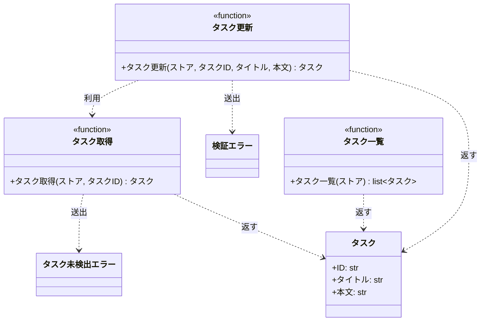

# モジュール構成: バックエンド / タスク

`タスク` ドメイン（バックエンド側）に属する構成要素詳細。

- 対応テストファイル: `tests/unit/tasks/test_service.py`

## 一覧

| ユースケース | 役割 | コンテナ | 種別 | 名前 | 概要 | 補足 |
| --- | --- | --- | --- | --- | --- | --- |
| 共通 | ドメインモデル | `src/tasks/models.py` | データモデル | [`Task`](#タスク) | タスク 1 件の内容 | - |
| 共通 | 例外 | `src/tasks/errors.py` | クラス | [`TaskNotFoundError`](#タスク未検出エラー) | 指定 ID のタスクが存在しない | - |
| 共通 | 例外 | `src/tasks/errors.py` | クラス | [`ValidationError`](#検証エラー) | 入力値が制約を満たさない | - |
| 共通 | 定数 | `src/tasks/service.py` | 定数 | `TITLE_MIN_LENGTH` | タイトルの下限文字数 | 値は `1` |
| 共通 | 定数 | `src/tasks/service.py` | 定数 | `TITLE_MAX_LENGTH` | タイトルの上限文字数 | 値は `100` |
| 共通 | 定数 | `src/tasks/service.py` | 定数 | `CONTENT_MAX_LENGTH` | 本文の上限文字数 | 値は `1000` |
| 共通 | サービス | `src/tasks/service.py` | 関数 | [`get_task`](#タスク取得) | ストアからタスクを 1 件取得 | - |
| 共通 | サービス | `src/tasks/service.py` | 関数 | [`list_tasks`](#タスク一覧) | ストアのタスクを ID 順で一覧化 | - |
| タスク更新 | サービス | `src/tasks/service.py` | 関数 | [`update_task`](#タスク更新) | タイトルと本文を置き換えて返す | - |

## ディレクトリ構成

```
src/tasks/
├── models.py     # Task
├── errors.py     # TaskNotFoundError / ValidationError
└── service.py    # 文字数の上限定数とタスクの取得・更新・一覧
```

## 構成図



## タスク
> 物理名: `Task`<br>
> 種別: データモデル<br>
> コンテナ: `src/tasks/models.py`

タスク 1 件の内容を持つ不変のデータモデル。

### プロパティ

| 論理名 | プロパティ名 | 型 | 可視性 | デフォルト | 説明 | 例 | 補足 |
| --- | --- | --- | --- | --- | --- | --- | --- |
| ID | `id` | `str` | 公開 | - | タスクを一意に識別する ID | `"t1"` | 更新では変更しない |
| タイトル | `title` | `str` | 公開 | - | タスクの見出し | `"新タイトル"` | - |
| 本文 | `content` | `str` | 公開 | `""` | タスクの詳細 | `"新本文"` | - |

### メソッド

なし

### 単体テスト

なし

## タスク未検出エラー
> 物理名: `TaskNotFoundError`<br>
> 種別: クラス<br>
> コンテナ: `src/tasks/errors.py`

指定 ID のタスクがストアに存在しないことを表す例外。

### プロパティ

なし

### メソッド

なし

### 単体テスト

なし

## 検証エラー
> 物理名: `ValidationError`<br>
> 種別: クラス<br>
> コンテナ: `src/tasks/errors.py`

入力値が文字数の制約を満たさないことを表す例外。

### プロパティ

なし

### メソッド

なし

### 単体テスト

なし

## `src/tasks/service.py`
> 種別: ファイル

タスクの取得・更新・一覧をストア（タスク ID をキーにした辞書）に対して行う関数ファイル。

---

### タスク取得
> 物理名: `get_task`<br>
> 種別: 関数

ストアからタスクを 1 件取得する。

#### 引数

| 論理名 | 引数名 | 型 | 必須 | デフォルト | 説明 | 補足 |
| --- | --- | --- | --- | --- | --- | --- |
| ストア | `store` | [`dict[str, Task]`](#タスク) | ✅ | - | タスク ID をキーにした保管先 | - |
| タスク ID | `task_id` | `str` | ✅ | - | 取得対象のタスク ID | - |

引数例:

```python
get_task(store, "t1")
```

#### 戻り値

| 型 | 説明 | 補足 |
| --- | --- | --- |
| [`Task`](#タスク) | 該当するタスク | - |

戻り値例:

```python
Task(id="t1", title="旧タイトル", content="旧本文")
```

#### 処理

1. ストアに `task_id` が登録されているかを確認する（未登録なら `TaskNotFoundError`）
2. 該当するタスクを返す

#### 例外

| 例外名 | 発生条件 | メッセージ | 補足 |
| --- | --- | --- | --- |
| `TaskNotFoundError` | ストアに `task_id` のキーがない | `"task not found: {task_id}"` | - |

#### 単体テスト

セットアップ:

| セットアップ | 説明 | 補足 |
| --- | --- | --- |
| ストア | `t1` のタスク 1 件を持つ辞書 | `_store()` |

| テスト名 | 正常/異常 | 概要 | 条件 | Mock | 期待値 | 補足 |
| --- | --- | --- | --- | --- | --- | --- |
| `test_get_task` | 正常 | 登録済み ID のタスクを取得 | `task_id` に `t1` を指定 | なし | 登録済みの `Task` を返す | - |
| `test_get_task_when_task_missing` | 異常 | 未登録 ID を指定 | `task_id` にストアに無い ID を指定 | なし | `TaskNotFoundError` を送出 | 例外表「ストアに `task_id` のキーがない」に対応 |

---

### タスク更新
> 物理名: `update_task`<br>
> 種別: 関数

登録済みタスクのタイトルと本文を置き換えて返す。

#### 引数

| 論理名 | 引数名 | 型 | 必須 | デフォルト | 説明 | 補足 |
| --- | --- | --- | --- | --- | --- | --- |
| ストア | `store` | [`dict[str, Task]`](#タスク) | ✅ | - | タスク ID をキーにした保管先 | - |
| タスク ID | `task_id` | `str` | ✅ | - | 更新対象のタスク ID | - |
| タイトル | `title` | `str` | ✅ | - | 更新後のタイトル | 1 文字以上 100 文字以内 |
| 本文 | `content` | `str` | - | `""` | 更新後の本文 | 1000 文字以内 |

引数例:

```python
update_task(store, "t1", "新タイトル", "新本文")
```

#### 戻り値

| 型 | 説明 | 補足 |
| --- | --- | --- |
| [`Task`](#タスク) | 更新後のタスク | ストアにも同じ値が書き戻される |

戻り値例:

```python
Task(id="t1", title="新タイトル", content="新本文")
```

#### 処理

1. タイトルの文字数が下限以上・上限以下かを検証する（範囲外なら `ValidationError`）
2. 本文の文字数が上限以下かを検証する（超過なら `ValidationError`）
3. 更新対象のタスクを取得する（[タスク取得](#タスク取得)）
4. タイトルと本文を差し替えたタスクをストアに書き戻して返す

#### 例外

| 例外名 | 発生条件 | メッセージ | 補足 |
| --- | --- | --- | --- |
| `ValidationError` | タイトルの文字数が下限未満 | `"title は {下限} 文字以上 {上限} 文字以内"` | - |
| `ValidationError` | タイトルの文字数が上限超過 | `"title は {下限} 文字以上 {上限} 文字以内"` | 同じ例外の別発生条件 |
| `ValidationError` | 本文の文字数が上限超過 | `"content は {上限} 文字以内"` | - |

#### 単体テスト

セットアップ:

| セットアップ | 説明 | 補足 |
| --- | --- | --- |
| ストア | `t1` のタスク 1 件を持つ辞書 | `_store()` |

| テスト名 | 正常/異常 | 概要 | 条件 | Mock | 期待値 | 補足 |
| --- | --- | --- | --- | --- | --- | --- |
| `test_update_task` | 正常 | タイトルと本文を更新 | タイトルと本文の両方を指定 | なし | 指定値の `Task` を返し、ストアも同じ値になる | - |
| `test_update_task_when_content_omitted` | 正常 | 本文を省略 | `content` を指定しない | なし | 本文が空文字の `Task` を返す | - |
| `test_update_task_when_title_empty` | 異常 | タイトルが空 | `title` に空文字を指定 | なし | `ValidationError` を送出 | 例外表「タイトルの文字数が下限未満」に対応 |
| `test_update_task_when_title_too_long` | 異常 | タイトルが上限超過 | `title` に 101 文字を指定 | なし | `ValidationError` を送出 | 例外表「タイトルの文字数が上限超過」に対応 |
| `test_update_task_when_content_too_long` | 異常 | 本文が上限超過 | `content` に 1001 文字を指定 | なし | `ValidationError` を送出 | 例外表「本文の文字数が上限超過」に対応 |
| `test_update_task_when_task_missing` | 異常 | 未登録 ID を指定 | `task_id` にストアに無い ID を指定 | なし | `TaskNotFoundError` を送出し、ストアは変わらない | [タスク取得](#タスク取得) から伝播 |

---

### タスク一覧
> 物理名: `list_tasks`<br>
> 種別: 関数

ストアのタスクを ID 順で一覧にする。

#### 引数

| 論理名 | 引数名 | 型 | 必須 | デフォルト | 説明 | 補足 |
| --- | --- | --- | --- | --- | --- | --- |
| ストア | `store` | [`dict[str, Task]`](#タスク) | ✅ | - | タスク ID をキーにした保管先 | - |

引数例:

```python
list_tasks(store)
```

#### 戻り値

| 型 | 説明 | 補足 |
| --- | --- | --- |
| [`list[Task]`](#タスク) | ID の昇順に並べたタスク | 空のストアでは空リスト |

戻り値例:

```python
[Task(id="t1", title="新タイトル", content="新本文")]
```

#### 処理

1. ストアのキーを昇順に並べ、対応するタスクを同じ順で返す

#### 例外

なし

#### 単体テスト

| テスト名 | 正常/異常 | 概要 | 条件 | Mock | 期待値 | 補足 |
| --- | --- | --- | --- | --- | --- | --- |
| `test_list_tasks` | 正常 | ID の昇順で並べて返す | `t2` / `t1` の順で登録した辞書を渡す | なし | `t1` / `t2` の順の `list[Task]` を返す | - |
