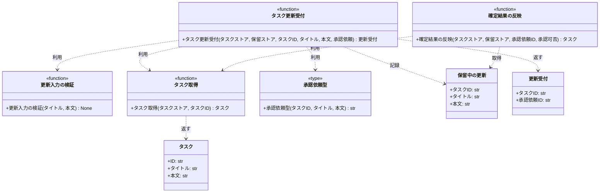

# モジュール構成: バックエンド / タスク

`タスク` ドメイン（バックエンド側）に属する構成要素詳細。

## 一覧

| ユースケース | 役割 | コンテナ | 種別 | 名前 | 概要 | 補足 |
| --- | --- | --- | --- | --- | --- | --- |
| 共通 | ドメインモデル | `src/tasks/models.py` | データモデル | [`Task`](#タスク) | タスク 1 件 | - |
| 共通 | 例外 | `src/tasks/errors.py` | クラス | `TaskNotFoundError` | 指定 ID のタスクが存在しない | - |
| 共通 | 例外 | `src/tasks/errors.py` | クラス | `ValidationError` | 入力値が制約を満たさない | - |
| 共通 | 参照 | `src/tasks/service.py` | 関数 | [`get_task`](#タスク取得) | ストアからタスクを 1 件取得する | - |
| タスク更新 | DTO | `src/tasks/models.py` | データモデル | [`PendingUpdate`](#保留中の更新) | 承認確定を待っている更新内容 | 確定結果の反映でも参照する |
| タスク更新 | DTO | `src/tasks/models.py` | データモデル | [`UpdateAcceptance`](#更新受付) | 受付完了として返す内容 | - |
| タスク更新 | 連携型（DI） | `src/tasks/types.py` | 関数型 | [`RequestApproval`](#承認依頼型) | 承認基盤へ承認を依頼する関数のシグネチャ | - |
| タスク更新 | 例外 | `src/tasks/errors.py` | クラス | `ApprovalRequestError` | 承認基盤が依頼を受け付けない | - |
| タスク更新 | バリデータ | `src/tasks/service.py` | 関数 | [`_validate_update_input`](#更新入力の検証) | 更新入力の文字数を検証する | - |
| タスク更新 | サービス | `src/tasks/service.py` | 関数 | [`update_task`](#タスク更新受付) | 更新を受け付けて承認基盤へ依頼する | - |
| タスク更新確定 | 例外 | `src/tasks/errors.py` | クラス | `PendingUpdateNotFoundError` | 承認依頼 ID の保留が残っていない | - |
| タスク更新確定 | サービス | `src/tasks/service.py` | 関数 | [`apply_approval_result`](#確定結果の反映) | 確定を受けてタスクへ反映する | 否認時は保留の破棄のみ |

## ディレクトリ構成

```
src/tasks/
├── models.py     # Task / PendingUpdate / UpdateAcceptance
├── errors.py     # タスクドメインの例外
├── types.py      # 承認基盤連携の関数型
└── service.py    # 取得・更新受付・確定結果の反映
```

## 構成図



## タスク
> 物理名: `Task`<br>
> 種別: データモデル<br>
> コンテナ: `src/tasks/models.py`

タスク 1 件。

### プロパティ

| 論理名 | プロパティ名 | 型 | 可視性 | デフォルト | 説明 | 例 | 補足 |
| --- | --- | --- | --- | --- | --- | --- | --- |
| ID | `id` | `str` | public | - | タスク ID | `"t1"` | - |
| タイトル | `title` | `str` | public | - | タスク名 | `"買い物"` | - |
| 本文 | `content` | `str` | public | `""` | 本文 | `"牛乳を買う"` | - |

### メソッド

なし

### 単体テスト

なし

## 保留中の更新
> 物理名: `PendingUpdate`<br>
> 種別: データモデル<br>
> コンテナ: `src/tasks/models.py`

承認確定を待っている更新内容。
承認依頼 ID をキーに保留ストアへ記録し、確定を受けた時点でタスクへ反映する。

### プロパティ

| 論理名 | プロパティ名 | 型 | 可視性 | デフォルト | 説明 | 例 | 補足 |
| --- | --- | --- | --- | --- | --- | --- | --- |
| タスク ID | `task_id` | `str` | public | - | 更新対象のタスク ID | `"t1"` | - |
| タイトル | `title` | `str` | public | - | 更新後のタスク名 | `"買い物リスト"` | - |
| 本文 | `content` | `str` | public | - | 更新後の本文 | `"牛乳とパンを買う"` | - |

### メソッド

なし

### 単体テスト

なし

## 更新受付
> 物理名: `UpdateAcceptance`<br>
> 種別: データモデル<br>
> コンテナ: `src/tasks/models.py`

更新を受け付けた結果として返す内容。

### プロパティ

| 論理名 | プロパティ名 | 型 | 可視性 | デフォルト | 説明 | 例 | 補足 |
| --- | --- | --- | --- | --- | --- | --- | --- |
| タスク ID | `task_id` | `str` | public | - | 受け付けた更新対象のタスク ID | `"t1"` | - |
| 承認依頼 ID | `request_id` | `str` | public | - | 承認基盤が採番した承認依頼 ID | `"r1"` | - |

### メソッド

なし

### 単体テスト

なし

## `src/tasks/types.py`
> 種別: ファイル

承認基盤との連携を差し替え可能にする関数型を置くファイル。

### 承認依頼型
> 物理名: `RequestApproval`<br>
> 種別: 関数型

承認基盤へ更新の承認を依頼する関数のシグネチャ。
DI / Mock 差し替え用。

#### 引数

| 論理名 | 引数名 | 型 | 必須 | デフォルト | 説明 | 補足 |
| --- | --- | --- | --- | --- | --- | --- |
| タスク ID | `task_id` | `str` | ✅ | - | 更新対象のタスク ID | - |
| タイトル | `title` | `str` | ✅ | - | 更新後のタスク名 | - |
| 本文 | `content` | `str` | ✅ | - | 更新後の本文 | - |

#### 戻り値

| 型 | 説明 | 補足 |
| --- | --- | --- |
| `str` | 承認基盤が採番した承認依頼 ID | - |

#### 実装

| 実装 | 補足 |
| --- | --- |
| なし | 承認基盤への接続実装は本 subsystem のスコープ外。単体テストでは stub 関数を注入する |

## `src/tasks/service.py`
> 種別: ファイル

タスクの取得・更新の受付・確定結果の反映を行う関数ファイル。
ストアはインメモリの辞書で、呼び出し側から引数で受け取る。

### タスク取得
> 物理名: `get_task`<br>
> 種別: 関数

ストアからタスクを 1 件取得する。

#### 引数

| 論理名 | 引数名 | 型 | 必須 | デフォルト | 説明 | 補足 |
| --- | --- | --- | --- | --- | --- | --- |
| タスクストア | `store` | [`dict[str, Task]`](#タスク) | ✅ | - | タスクの保管先 | - |
| タスク ID | `task_id` | `str` | ✅ | - | 取得対象のタスク ID | - |

引数例:

```python
get_task(store, "t1")
```

#### 戻り値

| 型 | 説明 | 補足 |
| --- | --- | --- |
| [`Task`](#タスク) | 取得したタスク | - |

戻り値例:

```python
Task(id="t1", title="買い物", content="牛乳を買う")
```

#### 処理

1. ストアに `task_id` が登録されているか確認する
   - 未登録の場合、`TaskNotFoundError` を送出する
2. 該当タスクを返す

#### 例外

| 例外名 | 発生条件 | メッセージ | 補足 |
| --- | --- | --- | --- |
| `TaskNotFoundError` | `task_id` がストアに未登録 | `"task not found: {task_id}"` | - |

#### 単体テスト

| テスト名 | 正常/異常 | 概要 | 条件 | Mock | 期待値 | 補足 |
| --- | --- | --- | --- | --- | --- | --- |
| `test_get_task` | 正常 | 登録済みのタスクを取得 | `t1` を登録済み | なし | `t1` の `Task` を返す | - |
| `test_get_task_when_task_missing` | 異常 | 未登録の ID を指定 | ストアが空 | なし | `TaskNotFoundError` を送出 | 例外表「`task_id` がストアに未登録」に対応 |

### 更新入力の検証
> 物理名: `_validate_update_input`<br>
> 種別: 関数

更新入力のタイトルと本文が文字数の制約を満たすか検証する。

#### 引数

| 論理名 | 引数名 | 型 | 必須 | デフォルト | 説明 | 補足 |
| --- | --- | --- | --- | --- | --- | --- |
| タイトル | `title` | `str` | ✅ | - | 更新後のタスク名 | - |
| 本文 | `content` | `str` | ✅ | - | 更新後の本文 | - |

引数例:

```python
_validate_update_input("買い物", "牛乳を買う")
```

#### 戻り値

| 型 | 説明 | 補足 |
| --- | --- | --- |
| `None` | なし | 制約を満たす場合は何も返さない |

#### 処理

1. タイトルの文字数を確認する
   - 空の場合、`ValidationError` を送出する
   - 100 文字を超える場合、`ValidationError` を送出する
2. 本文の文字数を確認する
   - 1000 文字を超える場合、`ValidationError` を送出する

#### 例外

| 例外名 | 発生条件 | メッセージ | 補足 |
| --- | --- | --- | --- |
| `ValidationError` | `title` が空 | `"タイトルは 1 文字以上にしてください"` | - |
| `ValidationError` | `title` が 100 文字超 | `"タイトルは 100 文字以内にしてください"` | 同じ例外の別発生箇所 |
| `ValidationError` | `content` が 1000 文字超 | `"本文は 1000 文字以内にしてください"` | 同じ例外の別発生箇所 |

#### 単体テスト

| テスト名 | 正常/異常 | 概要 | 条件 | Mock | 期待値 | 補足 |
| --- | --- | --- | --- | --- | --- | --- |
| `test_validate_update_input` | 正常 | 制約内の入力 | タイトル 1 文字、本文 1 文字 | なし | 例外を送出しない | - |
| `test_validate_update_input_when_title_empty` | 異常 | タイトルが空 | `title` に空文字 | なし | `ValidationError` を送出 | 例外表「`title` が空」に対応 |
| `test_validate_update_input_when_title_too_long` | 異常 | タイトルが長い | `title` が 101 文字 | なし | `ValidationError` を送出 | 例外表「`title` が 100 文字超」に対応 |
| `test_validate_update_input_when_content_too_long` | 異常 | 本文が長い | `content` が 1001 文字 | なし | `ValidationError` を送出 | 例外表「`content` が 1000 文字超」に対応 |

### タスク更新受付
> 物理名: `update_task`<br>
> 種別: 関数

タスクの更新を受け付け、承認基盤へ承認を依頼して受付完了を返す。
タスクストアはこの時点では更新しない。

#### 引数

| 論理名 | 引数名 | 型 | 必須 | デフォルト | 説明 | 補足 |
| --- | --- | --- | --- | --- | --- | --- |
| タスクストア | `store` | [`dict[str, Task]`](#タスク) | ✅ | - | タスクの保管先 | - |
| 保留ストア | `pending` | [`dict[str, PendingUpdate]`](#保留中の更新) | ✅ | - | 承認確定を待つ更新内容の保管先 | 承認依頼 ID をキーにする |
| タスク ID | `task_id` | `str` | ✅ | - | 更新対象のタスク ID | - |
| タイトル | `title` | `str` | ✅ | - | 更新後のタスク名 | 1 文字以上 100 文字以内 |
| 本文 | `content` | `str` | - | `""` | 更新後の本文 | 1000 文字以内 |
| 承認依頼 | `request_approval` | [`RequestApproval`](#承認依頼型) | ✅ | - | 承認基盤へ承認を依頼する関数 | キーワード引数で注入する |

引数例:

```python
update_task(store, pending, "t1", "買い物リスト", "牛乳とパンを買う", request_approval=request_approval)
```

#### 戻り値

| 型 | 説明 | 補足 |
| --- | --- | --- |
| [`UpdateAcceptance`](#更新受付) | 受付完了として返す内容 | - |

戻り値例:

```python
UpdateAcceptance(task_id="t1", request_id="r1")
```

#### 処理

1. 入力値を検証する（[更新入力の検証](#更新入力の検証)）
2. 更新対象のタスクが登録済みであることを確認する（[タスク取得](#タスク取得)）
3. 承認基盤へ更新の承認を依頼して承認依頼 ID を受け取る
   - 依頼が受け付けられない場合、注入した関数が送出する `ApprovalRequestError` がそのまま伝播する
   - `[INFO]` 更新の承認を依頼した（`task_id` / `request_id`）
4. 承認依頼 ID をキーに更新内容を保留ストアへ記録する
5. 受付完了を返す

#### 例外

| 例外名 | 発生条件 | メッセージ | 補足 |
| --- | --- | --- | --- |
| `ValidationError` | 入力値が文字数の制約を満たさない | `"タイトルは 1 文字以上にしてください"` 等 | [更新入力の検証](#更新入力の検証) が送出する |
| `TaskNotFoundError` | `task_id` がストアに未登録 | `"task not found: {task_id}"` | [タスク取得](#タスク取得) が送出する |
| `ApprovalRequestError` | 承認基盤が依頼を受け付けない | `"承認の依頼に失敗しました: {task_id}"` | 注入した承認依頼関数が送出し、そのまま伝播する |

#### 単体テスト

| テスト名 | 正常/異常 | 概要 | 条件 | Mock | 期待値 | 補足 |
| --- | --- | --- | --- | --- | --- | --- |
| `test_update_task` | 正常 | 更新の受付が成立する | `t1` を登録済み、承認依頼が `r1` を返す | `request_approval` | `UpdateAcceptance` を返し、保留ストアに `r1` の更新内容が入り、タスクストアは変わらない。承認依頼に `task_id` / `title` / `content` が渡る | - |
| `test_update_task_when_title_empty` | 異常 | タイトルが空 | `title` に空文字 | `request_approval` | `ValidationError` を送出し、承認依頼が呼ばれない | 例外表「入力値が文字数の制約を満たさない」に対応 |
| `test_update_task_when_task_missing` | 異常 | 未登録のタスクを指定 | ストアが空 | `request_approval` | `TaskNotFoundError` を送出し、承認依頼が呼ばれない | 例外表「`task_id` がストアに未登録」に対応 |
| `test_update_task_when_approval_request_fails` | 異常 | 承認依頼が失敗 | 承認依頼が `ApprovalRequestError` を送出 | `request_approval` | `ApprovalRequestError` が伝播し、保留ストアに記録されない | 例外表「承認基盤が依頼を受け付けない」に対応 |

### 確定結果の反映
> 物理名: `apply_approval_result`<br>
> 種別: 関数

承認基盤からの確定を受けて、保留中の更新内容をタスクへ反映する。
否認の確定では反映せず、保留の破棄だけを行う。

#### 引数

| 論理名 | 引数名 | 型 | 必須 | デフォルト | 説明 | 補足 |
| --- | --- | --- | --- | --- | --- | --- |
| タスクストア | `store` | [`dict[str, Task]`](#タスク) | ✅ | - | タスクの保管先 | - |
| 保留ストア | `pending` | [`dict[str, PendingUpdate]`](#保留中の更新) | ✅ | - | 承認確定を待つ更新内容の保管先 | - |
| 承認依頼 ID | `request_id` | `str` | ✅ | - | 確定した更新の承認依頼 ID | - |
| 承認可否 | `approved` | `bool` | ✅ | - | 承認されたか | キーワード引数。`False` は否認の確定 |

引数例:

```python
apply_approval_result(store, pending, "r1", approved=True)
```

#### 戻り値

| 型 | 説明 | 補足 |
| --- | --- | --- |
| [`Task`](#タスク) | 確定を処理した後のタスク | 否認時は編集前のタスク |

戻り値例:

```python
Task(id="t1", title="買い物リスト", content="牛乳とパンを買う")
```

#### 処理

1. 保留ストアから `request_id` の更新内容を取り出す
   - 残っていない場合、`PendingUpdateNotFoundError` を送出する
2. 承認可否で反映するかを決める
   - 承認された場合、保留の内容でタスクストアの該当タスクを差し替える
     - `[INFO]` 承認確定をタスクへ反映した（`request_id` / `task_id`）
   - 否認された場合、タスクを編集前のまま据え置く
     - `[INFO]` 否認確定を受けて保留を破棄した（`request_id` / `task_id`）
3. 処理済みの保留を保留ストアから削除する
4. 処理後のタスクを返す（[タスク取得](#タスク取得)）

#### 例外

| 例外名 | 発生条件 | メッセージ | 補足 |
| --- | --- | --- | --- |
| `PendingUpdateNotFoundError` | `request_id` の保留が保留ストアに残っていない | `"保留中の更新が見つかりません: {request_id}"` | 同じ承認依頼 ID で 2 回目の通知が届いた場合もここに該当する |

#### 単体テスト

| テスト名 | 正常/異常 | 概要 | 条件 | Mock | 期待値 | 補足 |
| --- | --- | --- | --- | --- | --- | --- |
| `test_apply_approval_result` | 正常 | 承認確定を反映する | `t1` を登録済み、`r1` の保留あり、`approved` に `True` | なし | 更新後の `Task` を返し、タスクストアが更新内容になり、保留ストアから `r1` が消える | - |
| `test_apply_approval_result_when_rejected` | 正常 | 否認確定を処理する | `r1` の保留あり、`approved` に `False` | なし | 編集前の `Task` を返し、タスクストアが変わらず、保留ストアから `r1` が消える | - |
| `test_apply_approval_result_when_pending_missing` | 異常 | 保留が残っていない | 保留ストアが空 | なし | `PendingUpdateNotFoundError` を送出し、タスクストアが変わらない | 例外表「`request_id` の保留が保留ストアに残っていない」に対応 |

### 補足

- 承認基盤への依頼は [承認依頼型](#承認依頼型) で抽象化し、実体は呼び出し側から注入する。
  本 subsystem では接続実装を持たない
- タスクストアと保留ストアはどちらもインメモリの辞書で、寿命はプロセスと一致する
