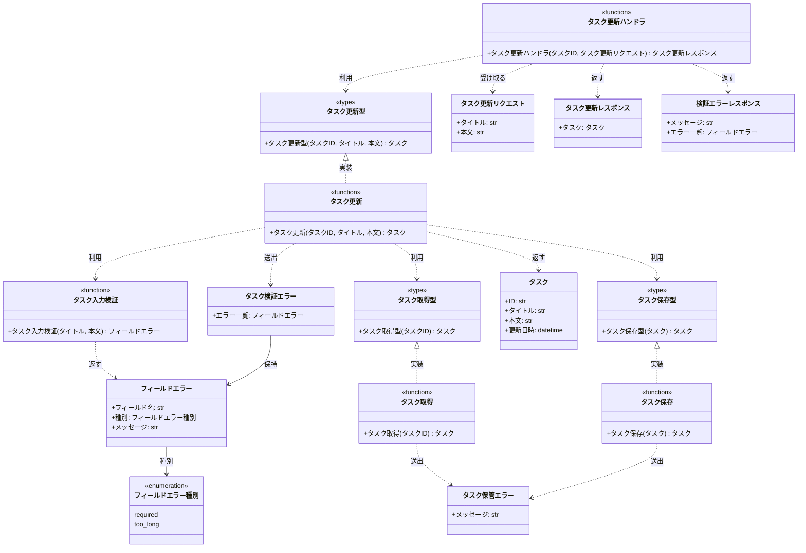

# モジュール構成: バックエンド / タスク

`タスク` ドメイン（バックエンド側）に属する構成要素詳細。
[タスク更新](../../バックエンド結合/タスク更新.py.md) の実現に必要な要素をまとめる。

## 一覧

| ユースケース | 役割 | コンテナ | 種別 | 名前 | 概要 | 補足 |
| --- | --- | --- | --- | --- | --- | --- |
| 共通 | ドメインモデル | `features/tasks/types.py` | データモデル | [`Task`](#タスク) | タスクのドメイン表現 | - |
| 共通 | 検証結果 | `features/tasks/types.py` | データモデル | [`FieldError`](#フィールドエラー) | フィールド単位の検証エラー 1 件 | - |
| 共通 | 列挙 | `features/tasks/types.py` | Enum | [`FieldErrorCode`](#フィールドエラー種別) | 検証エラーの種別 | `Literal` の型エイリアス |
| 共通 | ドメイン例外 | `features/tasks/types.py` | クラス | [`TaskValidationError`](#タスク検証エラー) | 入力値の検証失敗を表す例外 | `400` に対応 |
| 共通 | ドメイン例外 | `features/tasks/types.py` | クラス | [`TaskStorageError`](#タスク保管エラー) | DB 操作の失敗を表す例外 | `500` に対応 |
| 共通 | 定数 | `features/tasks/types.py` | 定数 | `TITLE_MAX_LENGTH` | タスク名の最大文字数（`100`） | - |
| 共通 | 定数 | `features/tasks/types.py` | 定数 | `BODY_MAX_LENGTH` | 本文の最大文字数（`10000`） | - |
| タスク更新 | DTO | `features/tasks/schemas.py` | データモデル | [`UpdateTaskRequest`](#タスク更新リクエスト) | 更新リクエストのボディ | - |
| タスク更新 | DTO | `features/tasks/schemas.py` | データモデル | [`UpdateTaskResponse`](#タスク更新レスポンス) | 更新レスポンスのボディ | - |
| タスク更新 | DTO | `features/tasks/schemas.py` | データモデル | [`ValidationErrorResponse`](#検証エラーレスポンス) | 検証エラー時のボディ | `400` のボディ |
| タスク更新 | ハンドラ | `features/tasks/route.py` | 関数 | [`update_task_route`](#タスク更新ハンドラ) | `PUT /tasks/{task_id}` の受け口 | - |
| タスク更新 | サービス | `features/tasks/service.py` | 関数 | [`update_task`](#タスク更新) | 検証してタスクを更新 | - |
| タスク更新 | バリデータ | `features/tasks/service.py` | 関数 | [`_validate_task_input`](#タスク入力検証) | 入力値を検証してエラーを集める | 内部関数 |
| タスク更新 | リポジトリ | `features/tasks/db.py` | 関数 | [`find_task`](#タスク取得) | ID で 1 件取得 | - |
| タスク更新 | リポジトリ | `features/tasks/db.py` | 関数 | [`save_task`](#タスク保存) | タイトル・本文・更新日時を保存 | - |
| タスク更新 | サービス型（DI） | `features/tasks/types.py` | 関数型 | [`UpdateTask`](#タスク更新型) | `update_task` のシグネチャ型 | 配線後の形 |
| タスク更新 | リポジトリ型（DI） | `features/tasks/types.py` | 関数型 | [`FindTask`](#タスク取得型) | `find_task` のシグネチャ型 | - |
| タスク更新 | リポジトリ型（DI） | `features/tasks/types.py` | 関数型 | [`SaveTask`](#タスク保存型) | `save_task` のシグネチャ型 | - |

## ディレクトリ構成

```
src/taskapp/features/tasks/
├── __init__.py    # 公開シンボルの再エクスポート
├── types.py       # Task / FieldError / 例外 / 定数 / 関数型
├── schemas.py     # リクエスト / レスポンスの Pydantic モデル
├── service.py     # update_task / _validate_task_input
├── db.py          # find_task / save_task
└── route.py       # PUT /tasks/{task_id}
```

## 構成図



## タスク
> 物理名: `Task`<br>
> 種別: データモデル<br>
> コンテナ: `features/tasks/types.py`

タスク 1 件のドメイン表現。

### プロパティ

| 論理名 | プロパティ名 | 型 | 可視性 | デフォルト | 説明 | 例 | 補足 |
| --- | --- | --- | --- | --- | --- | --- | --- |
| ID | `id` | `str` | 公開 | - | タスク ID | `"3f2b1c88-9d4a-4e77-b0c1-5a2e8f1d6b30"` | UUID |
| タイトル | `title` | `str` | 公開 | - | タスク名 | `"決算資料の作成"` | 1〜100 文字 |
| 本文 | `body` | `str` | 公開 | - | タスク本文 | `"四半期分の売上をまとめる"` | 空文字を許容 |
| 更新日時 | `updated_at` | `datetime` | 公開 | - | 最終更新日時 | `datetime(2026, 7, 26, 5, 18, 2, tzinfo=UTC)` | UTC の aware datetime |

### メソッド

なし

### 単体テスト

なし

### 補足

- `@dataclass(frozen=True, slots=True, kw_only=True)` の内部 DTO として定義する
- 更新は差し替えた新インスタンスを作って表現する（同一インスタンスを書き換えない）

## フィールドエラー
> 物理名: `FieldError`<br>
> 種別: データモデル<br>
> コンテナ: `features/tasks/types.py`

入力値の検証に失敗したフィールド 1 件分の情報。

### プロパティ

| 論理名 | プロパティ名 | 型 | 可視性 | デフォルト | 説明 | 例 | 補足 |
| --- | --- | --- | --- | --- | --- | --- | --- |
| フィールド名 | `field` | `str` | 公開 | - | 検証に失敗したフィールド名 | `"title"` | リクエストのパラメータ名と一致 |
| 種別 | `code` | [`FieldErrorCode`](#フィールドエラー種別) | 公開 | - | エラーの種別 | `"required"` | - |
| メッセージ | `message` | `str` | 公開 | - | 表示用メッセージ | `"タスク名を入力してください"` | 日本語 |

### メソッド

なし

### 単体テスト

なし

## フィールドエラー種別
> 物理名: `FieldErrorCode`<br>
> 種別: Enum<br>
> コンテナ: `features/tasks/types.py`

検証エラーの種別。
`Literal["required", "too_long"]` の型エイリアスとして定義する。

### 値一覧

| 値 | 論理名 | 説明 | 補足 |
| --- | --- | --- | --- |
| `required` | 必須未入力 | 必須のフィールドが空だった | タスク名が空文字・空白のみの場合 |
| `too_long` | 文字数超過 | フィールドの文字数が上限を超えた | タスク名 100 文字超・本文 10000 文字超の場合 |

### メソッド

なし

### 単体テスト

なし

## タスク検証エラー
> 物理名: `TaskValidationError`<br>
> 種別: クラス<br>
> コンテナ: `features/tasks/types.py`<br>
> 継承元: `ValidationError`

入力値の検証に失敗したことを表す例外。
失敗したフィールドの一覧を保持し、`400` のボディに変換される。

### プロパティ

| 論理名 | プロパティ名 | 型 | 可視性 | デフォルト | 説明 | 例 | 補足 |
| --- | --- | --- | --- | --- | --- | --- | --- |
| エラー一覧 | `errors` | [`list[FieldError]`](#フィールドエラー) | 公開 | - | 検証に失敗したフィールドの一覧 | `[FieldError(field="title", ...)]` | 1 件以上 |

### メソッド

なし

### 単体テスト

なし

### 補足

- `ValidationError` は `shared/errors.py` の共通例外階層に属する（`AppError` 系）
- 例外ハンドラが本例外を捕捉して [検証エラーレスポンス](#検証エラーレスポンス) + `400` に変換する

## タスク保管エラー
> 物理名: `TaskStorageError`<br>
> 種別: クラス<br>
> コンテナ: `features/tasks/types.py`<br>
> 継承元: `AppError`

タスク DB への読み書きが失敗したことを表す例外。

### プロパティ

なし

### メソッド

なし

### 単体テスト

なし

### 補足

- DB は自前インフラのため `IntegrationError`（`502`）ではなく `AppError` 直下に置き、`500` にマップする

## タスク更新リクエスト
> 物理名: `UpdateTaskRequest`<br>
> 種別: データモデル<br>
> コンテナ: `features/tasks/schemas.py`

`PUT /tasks/{task_id}` のリクエストボディ。

### プロパティ

| 論理名 | プロパティ名 | 型 | 可視性 | デフォルト | 説明 | 例 | 補足 |
| --- | --- | --- | --- | --- | --- | --- | --- |
| タイトル | `title` | `str` | 公開 | - | タスク名 | `"決算資料の作成"` | 検証は [タスク入力検証](#タスク入力検証) が行う |
| 本文 | `body` | `str` | 公開 | - | タスク本文 | `"四半期分の売上をまとめる"` | 空文字を許容 |

### メソッド

なし

### 単体テスト

なし

### 補足

- `pydantic.BaseModel` として定義する（外部境界の DTO）
- 文字数の検証は Pydantic の `Field` ではなく [タスク入力検証](#タスク入力検証) に集約する（フィールド単位のエラーを 1 度に集めて返すため）

## タスク更新レスポンス
> 物理名: `UpdateTaskResponse`<br>
> 種別: データモデル<br>
> コンテナ: `features/tasks/schemas.py`

`200` のレスポンスボディ。

### プロパティ

| 論理名 | プロパティ名 | 型 | 可視性 | デフォルト | 説明 | 例 | 補足 |
| --- | --- | --- | --- | --- | --- | --- | --- |
| タスク | `task` | `TaskPayload` | 公開 | - | 更新後のタスク | `{"id": "3f2b...", ...}` | `id` / `title` / `body` / `updated_at` を持つネストモデル |

### メソッド

なし

### 単体テスト

なし

### 補足

- `updated_at` は ISO 8601（UTC）の文字列にシリアライズする
- [タスク](#タスク) から変換する `from_domain` クラスメソッドを持たせ、ハンドラ側を 1 行にする

## 検証エラーレスポンス
> 物理名: `ValidationErrorResponse`<br>
> 種別: データモデル<br>
> コンテナ: `features/tasks/schemas.py`

`400` のレスポンスボディ。

### プロパティ

| 論理名 | プロパティ名 | 型 | 可視性 | デフォルト | 説明 | 例 | 補足 |
| --- | --- | --- | --- | --- | --- | --- | --- |
| メッセージ | `message` | `str` | 公開 | `"入力値が不正です"` | エラー全体の要約 | `"入力値が不正です"` | - |
| エラー一覧 | `errors` | [`list[FieldError]`](#フィールドエラー) | 公開 | - | フィールド単位のエラー | `[{"field": "title", ...}]` | [タスク検証エラー](#タスク検証エラー) から転記 |

### メソッド

なし

### 単体テスト

なし

## `features/tasks/types.py`
> 種別: ファイル

タスクドメインの型定義を集約するファイル。
DI 用の関数型エイリアスを置く。

### タスク更新型
> 物理名: `UpdateTask`<br>
> 種別: 関数型

タスクを更新する関数のシグネチャ。
リポジトリ関数を配線した後の形で、ハンドラはこの型だけを知る。

#### 引数

| 論理名 | 引数名 | 型 | 必須 | デフォルト | 説明 | 補足 |
| --- | --- | --- | --- | --- | --- | --- |
| タスク ID | `task_id` | `str` | ✅ | - | 更新対象のタスク ID | - |
| タイトル | `title` | `str` | ✅ | - | 更新後のタスク名 | - |
| 本文 | `body` | `str` | ✅ | - | 更新後のタスク本文 | - |

#### 戻り値

| 型 | 説明 | 補足 |
| --- | --- | --- |
| [`Task`](#タスク) | 更新後のタスク | - |

#### 実装

| 実装 | 補足 |
| --- | --- |
| [タスク更新](#タスク更新) | 本番の実装（`find` / `save` / `now` を `partial` で埋めて配線する） |

### タスク取得型
> 物理名: `FindTask`<br>
> 種別: 関数型

タスクを 1 件取得する関数のシグネチャ。

#### 引数

| 論理名 | 引数名 | 型 | 必須 | デフォルト | 説明 | 補足 |
| --- | --- | --- | --- | --- | --- | --- |
| タスク ID | `task_id` | `str` | ✅ | - | 取得対象のタスク ID | - |

#### 戻り値

| 型 | 説明 | 補足 |
| --- | --- | --- |
| [`Task \| None`](#タスク) | 見つかったタスク。無ければ `None` | - |

#### 実装

| 実装 | 補足 |
| --- | --- |
| [タスク取得](#タスク取得) | 本番の実装 |

### タスク保存型
> 物理名: `SaveTask`<br>
> 種別: 関数型

タスクを保存する関数のシグネチャ。

#### 引数

| 論理名 | 引数名 | 型 | 必須 | デフォルト | 説明 | 補足 |
| --- | --- | --- | --- | --- | --- | --- |
| タスク | `task` | [`Task`](#タスク) | ✅ | - | 保存するタスク | 更新後の値が入っている |

#### 戻り値

| 型 | 説明 | 補足 |
| --- | --- | --- |
| [`Task`](#タスク) | 保存後のタスク | - |

#### 実装

| 実装 | 補足 |
| --- | --- |
| [タスク保存](#タスク保存) | 本番の実装 |

## `features/tasks/service.py`
> 種別: ファイル

タスク更新のドメインロジックを束ねる関数ファイル。

### タスク更新
> 物理名: `update_task`<br>
> 種別: 関数<br>
> 継承元: [`UpdateTask`](#タスク更新型)

入力値を検証したうえでタスクのタイトル・本文を更新する。

#### 引数

| 論理名 | 引数名 | 型 | 必須 | デフォルト | 説明 | 補足 |
| --- | --- | --- | --- | --- | --- | --- |
| タスク ID | `task_id` | `str` | ✅ | - | 更新対象のタスク ID | - |
| タイトル | `title` | `str` | ✅ | - | 更新後のタスク名 | - |
| 本文 | `body` | `str` | ✅ | - | 更新後のタスク本文 | - |
| タスク取得 | `find` | [`FindTask`](#タスク取得型) | ✅ | - | タスクを 1 件取得する関数 | キーワード専用引数 |
| タスク保存 | `save` | [`SaveTask`](#タスク保存型) | ✅ | - | タスクを保存する関数 | キーワード専用引数 |
| 現在時刻 | `now` | `NowFn` | ✅ | - | 現在時刻を返す関数 | `shared/types.py` の横断型。テストで固定時刻に差し替える |

引数例:

```python
update_task("3f2b1c88", "決算資料の作成", "四半期分の売上をまとめる", find=find_task, save=save_task, now=now_utc)
```

#### 戻り値

| 型 | 説明 | 補足 |
| --- | --- | --- |
| [`Task`](#タスク) | 更新後のタスク | - |

戻り値例:

```python
Task(id="3f2b1c88", title="決算資料の作成", body="四半期分の売上をまとめる", updated_at=datetime(2026, 7, 26, 5, 18, 2, tzinfo=UTC))
```

#### 処理

1. 入力値を検証する（[タスク入力検証](#タスク入力検証)）
   - エラーが 1 件以上ある場合、`TaskValidationError` を投げる
     - `[WARNING]` 入力値の検証に失敗した（`task_id` / 失敗したフィールド名の一覧）
2. `task_id` でタスクを取得する（[タスク取得](#タスク取得型)）
   - 見つからない場合、`NotFoundError` を投げる
     - `[WARNING]` 更新対象のタスクが存在しない（`task_id`）
3. タイトル・本文・更新日時を差し替えたタスクを組み立てて保存する（[タスク保存](#タスク保存型)）
   - `[INFO]` タスクを更新した（`task_id`）
4. 保存後のタスクを返す

#### 例外

| 例外名 | 発生条件 | メッセージ | 補足 |
| --- | --- | --- | --- |
| `TaskValidationError` | 入力値の検証で 1 件以上のエラーが出た | `"入力値が不正です"` | `400` に変換される |
| `NotFoundError` | `task_id` に一致するタスクが無い | `"タスクが見つかりません: {task_id}"` | `404` に変換される |

#### 単体テスト

| テスト名 | 正常/異常 | 概要 | 条件 | Mock | 期待値 | 補足 |
| --- | --- | --- | --- | --- | --- | --- |
| `test_update_task` | 正常 | タイトル・本文を更新できる | 既存タスクが取得できる | `find` / `save` / `now` | 更新後の `Task` を返し、`save` に更新後の値が渡る | - |
| `test_update_task_when_title_empty` | 異常 | タスク名が空 | `title` が空文字 | `find` / `save` / `now` | `TaskValidationError` を送出し、`save` が呼ばれない | 例外表「検証で 1 件以上のエラー」に対応 |
| `test_update_task_when_title_too_long` | 異常 | タスク名が上限超過 | `title` が 101 文字 | `find` / `save` / `now` | `TaskValidationError` を送出し、`save` が呼ばれない | 例外表「検証で 1 件以上のエラー」に対応 |
| `test_update_task_when_task_missing` | 異常 | 対象タスクが無い | `find` が `None` を返す | `find` / `save` / `now` | `NotFoundError` を送出し、`save` が呼ばれない | 例外表「一致するタスクが無い」に対応 |

### タスク入力検証
> 物理名: `_validate_task_input`<br>
> 種別: 関数

タイトル・本文を検証し、失敗したフィールドの一覧を返す。

#### 引数

| 論理名 | 引数名 | 型 | 必須 | デフォルト | 説明 | 補足 |
| --- | --- | --- | --- | --- | --- | --- |
| タイトル | `title` | `str` | ✅ | - | 検証対象のタスク名 | - |
| 本文 | `body` | `str` | ✅ | - | 検証対象のタスク本文 | - |

引数例:

```python
_validate_task_input("", "四半期分の売上をまとめる")
```

#### 戻り値

| 型 | 説明 | 補足 |
| --- | --- | --- |
| [`list[FieldError]`](#フィールドエラー) | 検証に失敗したフィールドの一覧 | 全て通れば空リスト |

戻り値例:

```python
[FieldError(field="title", code="required", message="タスク名を入力してください")]
```

#### 処理

1. タイトルを検証する
   - 空文字・空白のみの場合、`required` のフィールドエラーを積む
   - `TITLE_MAX_LENGTH` を超える場合、`too_long` のフィールドエラーを積む
2. 本文を検証する
   - `BODY_MAX_LENGTH` を超える場合、`too_long` のフィールドエラーを積む
3. 積んだフィールドエラーの一覧を返す

#### 例外

なし

#### 単体テスト

| テスト名 | 正常/異常 | 概要 | 条件 | Mock | 期待値 | 補足 |
| --- | --- | --- | --- | --- | --- | --- |
| `test_validate_task_input` | 正常 | 上限内の入力は全て通る | `title` が 100 文字・`body` が 10000 文字 | なし | 空リストを返す | 境界値 |
| `test_validate_task_input_when_title_empty` | 正常 | タスク名が空 | `title` が空文字 | なし | `title` / `required` の 1 件を返す | - |
| `test_validate_task_input_when_title_blank` | 正常 | タスク名が空白のみ | `title` が `"   "` | なし | `title` / `required` の 1 件を返す | - |
| `test_validate_task_input_when_title_too_long` | 正常 | タスク名が上限超過 | `title` が 101 文字 | なし | `title` / `too_long` の 1 件を返す | 境界値 |
| `test_validate_task_input_when_body_too_long` | 正常 | 本文が上限超過 | `body` が 10001 文字 | なし | `body` / `too_long` の 1 件を返す | 境界値 |
| `test_validate_task_input_when_both_invalid` | 正常 | 両方が不正 | `title` が空文字・`body` が 10001 文字 | なし | 2 件のフィールドエラーを返す | 1 度に集めて返すことの確認 |

## `features/tasks/db.py`
> 種別: ファイル

タスク DB への読み書きを担う関数ファイル。

### タスク取得
> 物理名: `find_task`<br>
> 種別: 関数<br>
> 継承元: [`FindTask`](#タスク取得型)

タスク ID で 1 件取得する。

#### 引数

| 論理名 | 引数名 | 型 | 必須 | デフォルト | 説明 | 補足 |
| --- | --- | --- | --- | --- | --- | --- |
| タスク ID | `task_id` | `str` | ✅ | - | 取得対象のタスク ID | - |

引数例:

```python
find_task("3f2b1c88")
```

#### 戻り値

| 型 | 説明 | 補足 |
| --- | --- | --- |
| [`Task \| None`](#タスク) | 見つかったタスク。無ければ `None` | - |

戻り値例:

```python
Task(id="3f2b1c88", title="決算資料の作成", body="", updated_at=datetime(2026, 7, 20, 1, 0, 0, tzinfo=UTC))
```

#### 処理

1. `task_id` を条件に tasks テーブルから 1 行を取得する（読み取りが失敗した場合、`TaskStorageError` を投げる）
   - `[ERROR]` タスクの取得に失敗した（`task_id`）
2. 取得結果を確定して返す
   - 行がある場合、[タスク](#タスク) に変換して返す
   - 行が無い場合、`None` を返す

#### 例外

| 例外名 | 発生条件 | メッセージ | 補足 |
| --- | --- | --- | --- |
| `TaskStorageError` | tasks テーブルの読み取りで DB エラー | `"タスクの取得に失敗しました: {task_id}"` | `500` に変換される |

#### 単体テスト

| テスト名 | 正常/異常 | 概要 | 条件 | Mock | 期待値 | 補足 |
| --- | --- | --- | --- | --- | --- | --- |
| `test_find_task` | 正常 | 既存タスクを取得 | 対象行が 1 件ある | DB クライアント | `Task` を返す | - |
| `test_find_task_when_missing` | 正常 | 対象行が無い | 該当行なし | DB クライアント | `None` を返す | - |
| `test_find_task_when_db_error` | 異常 | 読み取りが失敗 | DB クライアントが例外を送出 | DB クライアント | `TaskStorageError` を送出 | 例外表「読み取りで DB エラー」に対応 |

### タスク保存
> 物理名: `save_task`<br>
> 種別: 関数<br>
> 継承元: [`SaveTask`](#タスク保存型)

タスクのタイトル・本文・更新日時を保存する。

#### 引数

| 論理名 | 引数名 | 型 | 必須 | デフォルト | 説明 | 補足 |
| --- | --- | --- | --- | --- | --- | --- |
| タスク | `task` | [`Task`](#タスク) | ✅ | - | 保存するタスク | 更新後の値が入っている |

引数例:

```python
save_task(Task(id="3f2b1c88", title="決算資料の作成", body="四半期分の売上をまとめる", updated_at=datetime(2026, 7, 26, 5, 18, 2, tzinfo=UTC)))
```

#### 戻り値

| 型 | 説明 | 補足 |
| --- | --- | --- |
| [`Task`](#タスク) | 保存後のタスク | 引数と同じ値 |

戻り値例:

```python
Task(id="3f2b1c88", title="決算資料の作成", body="四半期分の売上をまとめる", updated_at=datetime(2026, 7, 26, 5, 18, 2, tzinfo=UTC))
```

#### 処理

1. `task` の ID を条件に tasks テーブルの `title` / `body` / `updated_at` を更新する（書き込みが失敗した場合、`TaskStorageError` を投げる）
   - `[ERROR]` タスクの保存に失敗した（`task.id`）
2. 保存したタスクを返す

#### 例外

| 例外名 | 発生条件 | メッセージ | 補足 |
| --- | --- | --- | --- |
| `TaskStorageError` | tasks テーブルの更新で DB エラー | `"タスクの保存に失敗しました: {task_id}"` | `500` に変換される |

#### 単体テスト

| テスト名 | 正常/異常 | 概要 | 条件 | Mock | 期待値 | 補足 |
| --- | --- | --- | --- | --- | --- | --- |
| `test_save_task` | 正常 | タイトル・本文を保存 | 対象行が 1 件ある | DB クライアント | 保存後の `Task` を返し、DB クライアントに更新値が渡る | - |
| `test_save_task_when_db_error` | 異常 | 書き込みが失敗 | DB クライアントが例外を送出 | DB クライアント | `TaskStorageError` を送出 | 例外表「更新で DB エラー」に対応 |

## `features/tasks/route.py`
> 種別: ファイル

`PUT /tasks/{task_id}` のルーターを持つファイル。

### タスク更新ハンドラ
> 物理名: `update_task_route`<br>
> 種別: 関数

リクエストを受けてタスク更新を呼び出し、レスポンスに変換して返す。

#### 引数

| 論理名 | 引数名 | 型 | 必須 | デフォルト | 説明 | 補足 |
| --- | --- | --- | --- | --- | --- | --- |
| タスク ID | `task_id` | `str` | ✅ | - | 更新対象のタスク ID | パスパラメータ |
| リクエスト | `payload` | [`UpdateTaskRequest`](#タスク更新リクエスト) | ✅ | - | リクエストボディ | - |
| タスク更新 | `update` | [`UpdateTask`](#タスク更新型) | ✅ | - | 配線済みのタスク更新関数 | `Depends` で注入 |

引数例:

```python
await update_task_route("3f2b1c88", UpdateTaskRequest(title="決算資料の作成", body="四半期分の売上をまとめる"), update=handlers.update_task)
```

#### 戻り値

| 型 | 説明 | 補足 |
| --- | --- | --- |
| [`UpdateTaskResponse`](#タスク更新レスポンス) | 更新後のタスク | `200` で返る |

戻り値例:

```python
UpdateTaskResponse(task=TaskPayload(id="3f2b1c88", title="決算資料の作成", body="四半期分の売上をまとめる", updated_at="2026-07-26T05:18:02+00:00"))
```

#### 処理

1. タスク更新を呼び出す（[タスク更新](#タスク更新型)）
2. 更新後のタスクを [タスク更新レスポンス](#タスク更新レスポンス) に変換して返す

#### 例外

なし

#### 単体テスト

なし

### 補足

- 例外は握らず、`register_exception_handlers` が `TaskValidationError` → `400` / `NotFoundError` → `404` / `TaskStorageError` → `500` に変換する
- ハンドラの経路は結合テスト（[タスク更新](../../バックエンド結合/タスク更新.py.md)）で担保する
