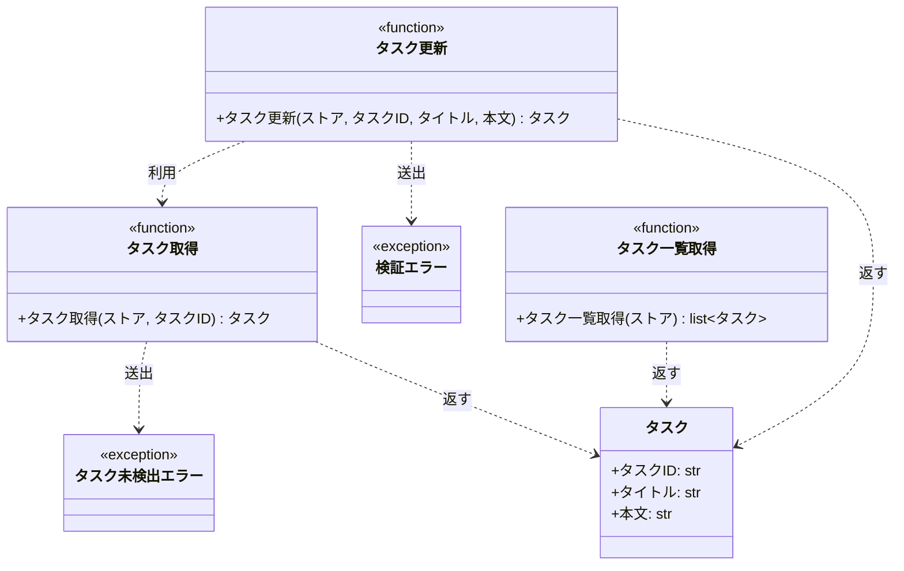

# モジュール構成: バックエンド / タスク

`タスク` ドメイン（バックエンド側）に属する構成要素詳細。

- 対応テストファイル: `tests/unit/tasks/test_service.py`

## 一覧

| ユースケース | 役割 | コンテナ | 種別 | 名前 | 概要 | 補足 |
| --- | --- | --- | --- | --- | --- | --- |
| 共通 | ドメインモデル | `src/tasks/models.py` | データモデル | [`Task`](#タスク) | タスク 1 件 | - |
| 共通 | 例外 | `src/tasks/errors.py` | クラス | [`TaskNotFoundError`](#タスク未検出エラー) | 指定 ID のタスクが存在しない | - |
| 共通 | 例外 | `src/tasks/errors.py` | クラス | [`ValidationError`](#検証エラー) | 入力値が制約を満たさない | - |
| 共通 | 定数 | `src/tasks/service.py` | 定数 | `TITLE_MIN_LENGTH` | タイトルの最小文字数 | 値は `1` |
| 共通 | 定数 | `src/tasks/service.py` | 定数 | `TITLE_MAX_LENGTH` | タイトルの最大文字数 | 値は `100` |
| 共通 | 定数 | `src/tasks/service.py` | 定数 | `CONTENT_MAX_LENGTH` | 本文の最大文字数 | 値は `1000` |
| 共通 | クエリ | `src/tasks/service.py` | 関数 | [`get_task`](#タスク取得) | ストアからタスクを 1 件取得する | - |
| タスク更新 | サービス | `src/tasks/service.py` | 関数 | [`update_task`](#タスク更新) | タイトルと本文を更新する | - |
| タスク一覧取得 | クエリ | `src/tasks/service.py` | 関数 | [`list_tasks`](#タスク一覧取得) | ストアのタスクを ID 順で一覧にする | - |

## ディレクトリ構成

```
src/tasks/
├── __init__.py   # パッケージ宣言
├── models.py     # Task
├── errors.py     # TaskNotFoundError / ValidationError
└── service.py    # タスクの取得・更新・一覧と文字数の定数
```

## 構成図



## タスク
> 物理名: `Task`<br>
> 種別: データモデル<br>
> コンテナ: `src/tasks/models.py`

タスク 1 件を表す不変のデータモデル。

### プロパティ

| 論理名 | プロパティ名 | 型 | 可視性 | デフォルト | 説明 | 例 | 補足 |
| --- | --- | --- | --- | --- | --- | --- | --- |
| タスク ID | `id` | `str` | 公開 | - | タスクを一意に識別する ID | `"t1"` | ストアのキーと同じ値 |
| タイトル | `title` | `str` | 公開 | - | タスクのタイトル | `"新タイトル"` | - |
| 本文 | `content` | `str` | 公開 | `""` | タスクの本文 | `"新本文"` | - |

### メソッド

なし

### 単体テスト

なし

### 補足

- `@dataclass(frozen=True, slots=True, kw_only=True)` で不変にしているため、更新は新しいインスタンスの生成で行う

## タスク未検出エラー
> 物理名: `TaskNotFoundError`<br>
> 種別: クラス<br>
> コンテナ: `src/tasks/errors.py`

指定 ID のタスクがストアに存在しないことを表す例外。

### プロパティ

なし

### メソッド

なし

### 単体テスト

なし

### 補足

- 組み込みの `Exception` を継承し、独自の属性は持たない

## 検証エラー
> 物理名: `ValidationError`<br>
> 種別: クラス<br>
> コンテナ: `src/tasks/errors.py`

入力値が制約を満たさないことを表す例外。

### プロパティ

なし

### メソッド

なし

### 単体テスト

なし

### 補足

- 組み込みの `Exception` を継承し、独自の属性は持たない

## `src/tasks/service.py`
> 種別: ファイル

タスクの取得・更新・一覧のドメインロジックと、入力値の文字数制限の定数を持つ関数ファイル。

---

### タスク取得
> 物理名: `get_task`<br>
> 種別: 関数

ストアから指定 ID のタスクを 1 件取得する。

#### 引数

| 論理名 | 引数名 | 型 | 必須 | デフォルト | 説明 | 補足 |
| --- | --- | --- | --- | --- | --- | --- |
| ストア | `store` | [`dict[str, Task]`](#タスク) | ✅ | - | タスクの保管先 | キーはタスク ID |
| タスク ID | `task_id` | `str` | ✅ | - | 取得対象のタスク ID | - |

引数例:

```python
get_task(store, "t1")
```

#### 戻り値

| 型 | 説明 | 補足 |
| --- | --- | --- |
| [`Task`](#タスク) | 取得したタスク | - |

戻り値例:

```python
Task(id="t1", title="旧タイトル", content="旧本文")
```

#### 処理

1. ストアに `task_id` のキーがあるかを確認する
   - 無い場合、`TaskNotFoundError` を投げる
2. `task_id` に対応するタスクを返す

#### 例外

| 例外名 | 発生条件 | メッセージ | 補足 |
| --- | --- | --- | --- |
| `TaskNotFoundError` | ストアに `task_id` のキーが無い | `"task not found: {task_id}"` | - |

#### 単体テスト

セットアップ:

| セットアップ | 説明 | 補足 |
| --- | --- | --- |
| ストア | `t1` のタスクを 1 件登録した dict を作る | 物理名 `_store` |

| テスト名 | 正常/異常 | 概要 | 条件 | Mock | 期待値 | 補足 |
| --- | --- | --- | --- | --- | --- | --- |
| `test_get_task` | 正常 | 登録済みタスクを取得する | `task_id` に `"t1"` を渡す | なし | 登録済みの `Task` を返す | - |
| `test_get_task_when_task_missing` | 異常 | 未登録の ID を渡す | `task_id` に `"missing"` を渡す | なし | `TaskNotFoundError` を送出する | 例外表「ストアに `task_id` のキーが無い」に対応 |

---

### タスク更新
> 物理名: `update_task`<br>
> 種別: 関数

登録済みタスクのタイトルと本文を更新して返す。

#### 引数

| 論理名 | 引数名 | 型 | 必須 | デフォルト | 説明 | 補足 |
| --- | --- | --- | --- | --- | --- | --- |
| ストア | `store` | [`dict[str, Task]`](#タスク) | ✅ | - | タスクの保管先 | キーはタスク ID |
| タスク ID | `task_id` | `str` | ✅ | - | 更新対象のタスク ID | - |
| タイトル | `title` | `str` | ✅ | - | 更新後のタイトル | 1 文字以上 100 文字以内 |
| 本文 | `content` | `str` | - | `""` | 更新後の本文 | 1000 文字以内 |

引数例:

```python
update_task(store, "t1", "新タイトル", "新本文")
```

#### 戻り値

| 型 | 説明 | 補足 |
| --- | --- | --- |
| [`Task`](#タスク) | 更新後のタスク | ストアにも同じインスタンスが入る |

戻り値例:

```python
Task(id="t1", title="新タイトル", content="新本文")
```

#### 処理

1. タイトルの文字数を検証する
   - `TITLE_MIN_LENGTH` 未満 or `TITLE_MAX_LENGTH` 超の場合、`ValidationError` を投げる
2. 本文の文字数を検証する
   - `CONTENT_MAX_LENGTH` 超の場合、`ValidationError` を投げる
3. 更新対象のタスクを取得する（[タスク取得](#タスク取得)）
4. タイトルと本文を差し替えたタスクを組み立ててストアへ書き戻し、それを返す

#### 例外

| 例外名 | 発生条件 | メッセージ | 補足 |
| --- | --- | --- | --- |
| `ValidationError` | タイトルが `TITLE_MIN_LENGTH` 未満 or `TITLE_MAX_LENGTH` 超 | `"title は 1 文字以上 100 文字以内"` | - |
| `ValidationError` | 本文が `CONTENT_MAX_LENGTH` 超 | `"content は 1000 文字以内"` | 同じ例外の別発生箇所 |
| `TaskNotFoundError` | ストアに `task_id` のキーが無い | `"task not found: {task_id}"` | [タスク取得](#タスク取得) から伝播する |

#### 単体テスト

セットアップ:

| セットアップ | 説明 | 補足 |
| --- | --- | --- |
| ストア | `t1` のタスクを 1 件登録した dict を作る | 物理名 `_store` |

| テスト名 | 正常/異常 | 概要 | 条件 | Mock | 期待値 | 補足 |
| --- | --- | --- | --- | --- | --- | --- |
| `test_update_task` | 正常 | タイトルと本文を更新する | タイトルと本文の両方を渡す | なし | 戻り値とストアの `t1` が新しい値になる | - |
| `test_update_task_when_content_omitted` | 正常 | 本文を省略する | `content` を渡さない | なし | 戻り値の本文が空文字になる | 省略時の分岐 |
| `test_update_task_when_title_empty` | 異常 | タイトルが空文字 | `title` に `""` を渡す | なし | `ValidationError` を送出する | 例外表「タイトルが `TITLE_MIN_LENGTH` 未満」に対応 |
| `test_update_task_when_title_too_long` | 異常 | タイトルが 101 文字 | `title` に 101 文字を渡す | なし | `ValidationError` を送出する | 例外表「タイトルが `TITLE_MAX_LENGTH` 超」に対応 |
| `test_update_task_when_content_too_long` | 異常 | 本文が 1001 文字 | `content` に 1001 文字を渡す | なし | `ValidationError` を送出する | 例外表「本文が `CONTENT_MAX_LENGTH` 超」に対応 |
| `test_update_task_when_task_missing` | 異常 | 未登録の ID を渡す | `task_id` に `"missing"` を渡す | なし | `TaskNotFoundError` を送出し、ストアの `t1` は変わらない | 例外表「ストアに `task_id` のキーが無い」に対応 |

---

### タスク一覧取得
> 物理名: `list_tasks`<br>
> 種別: 関数

ストアのタスクを ID の昇順で一覧にする。

#### 引数

| 論理名 | 引数名 | 型 | 必須 | デフォルト | 説明 | 補足 |
| --- | --- | --- | --- | --- | --- | --- |
| ストア | `store` | [`dict[str, Task]`](#タスク) | ✅ | - | タスクの保管先 | キーはタスク ID |

引数例:

```python
list_tasks(store)
```

#### 戻り値

| 型 | 説明 | 補足 |
| --- | --- | --- |
| [`list[Task]`](#タスク) | ID の昇順に並べたタスク | ストアが空なら空リスト |

戻り値例:

```python
[Task(id="t1", title="新タイトル", content="新本文")]
```

#### 処理

1. ストアのキーを昇順に並べる
2. 並べた順にタスクを取り出して一覧で返す

#### 例外

なし

#### 単体テスト

セットアップ:

| セットアップ | 説明 | 補足 |
| --- | --- | --- |
| ストア | `t1` のタスクを 1 件登録した dict を作る | 物理名 `_store` |

| テスト名 | 正常/異常 | 概要 | 条件 | Mock | 期待値 | 補足 |
| --- | --- | --- | --- | --- | --- | --- |
| `test_list_tasks` | 正常 | ID の昇順で一覧にする | `t2` を追加してから ID 昇順でない順で登録する | なし | `t1` / `t2` の順で並んだリストを返す | - |
