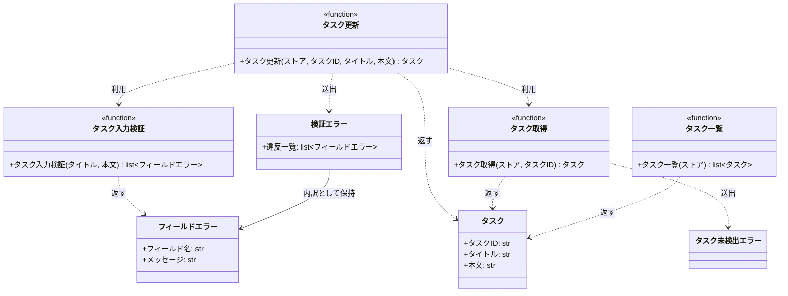

# モジュール構成: バックエンド / タスク

`タスク` ドメイン（バックエンド側）に属する構成要素詳細。

- 対応テストファイル: `tests/unit/tasks/test_service.py`

## 一覧

| ユースケース | 役割 | コンテナ | 種別 | 名前 | 概要 | 補足 |
| --- | --- | --- | --- | --- | --- | --- |
| 共通 | ドメインモデル | `src/tasks/models.py` | データモデル | [`Task`](#タスク) | タスク 1 件 | - |
| 共通 | エラー詳細 | `src/tasks/errors.py` | データモデル | [`FieldError`](#フィールドエラー) | 検証に失敗したフィールド 1 件 | - |
| 共通 | 例外 | `src/tasks/errors.py` | クラス | [`ValidationError`](#検証エラー) | 入力値の制約違反 | フィールド単位の内訳を保持 |
| 共通 | 例外 | `src/tasks/errors.py` | クラス | [`TaskNotFoundError`](#タスク未検出エラー) | 指定 ID のタスクが存在しない | - |
| 共通 | 定数 | `src/tasks/service.py` | 定数 | `TITLE_MIN_LENGTH` | タイトルの最小文字数 | 値は 1 |
| 共通 | 定数 | `src/tasks/service.py` | 定数 | `TITLE_MAX_LENGTH` | タイトルの最大文字数 | 値は 100 |
| 共通 | 定数 | `src/tasks/service.py` | 定数 | `CONTENT_MAX_LENGTH` | 本文の最大文字数 | 値は 1000 |
| 共通 | サービス | `src/tasks/service.py` | 関数 | [`get_task`](#タスク取得) | ストアからタスクを 1 件取得 | - |
| 共通 | サービス | `src/tasks/service.py` | 関数 | [`list_tasks`](#タスク一覧) | ストアのタスクを ID 順で一覧化 | - |
| タスク更新 | バリデータ | `src/tasks/service.py` | 関数 | [`_validate_task_input`](#タスク入力検証) | タイトルと本文を検証して違反を集める | 途中で打ち切らない |
| タスク更新 | サービス | `src/tasks/service.py` | 関数 | [`update_task`](#タスク更新) | 検証してタスクを更新 | - |

## ディレクトリ構成

```
src/tasks/
├── models.py       # Task
├── errors.py       # FieldError / ValidationError / TaskNotFoundError
└── service.py      # 文字数の定数とタスク操作の関数
```

## 構成図



## タスク
> 物理名: `Task`<br>
> 種別: データモデル<br>
> コンテナ: `src/tasks/models.py`

タスク 1 件の内容を持つ不変のデータモデル。

### プロパティ

| 論理名 | プロパティ名 | 型 | 可視性 | デフォルト | 説明 | 例 | 補足 |
| --- | --- | --- | --- | --- | --- | --- | --- |
| タスクID | `id` | `str` | public | - | タスクの一意な識別子 | `"t1"` | 更新では変えない |
| タイトル | `title` | `str` | public | - | タスク名 | `"新タイトル"` | - |
| 本文 | `content` | `str` | public | `""` | タスクの詳細 | `"新本文"` | - |

### メソッド

なし

### 単体テスト

なし

## フィールドエラー
> 物理名: `FieldError`<br>
> 種別: データモデル<br>
> コンテナ: `src/tasks/errors.py`

検証に失敗したフィールド 1 件の内訳。
呼び出し側はこの内訳を見てどの入力欄の直下にエラーを出すかを決める。

### プロパティ

| 論理名 | プロパティ名 | 型 | 可視性 | デフォルト | 説明 | 例 | 補足 |
| --- | --- | --- | --- | --- | --- | --- | --- |
| フィールド名 | `field` | `Literal["title", "content"]` | public | - | 検証に失敗した入力欄 | `"title"` | 呼び出し側が表示先を決める鍵 |
| メッセージ | `message` | `str` | public | - | 違反内容の説明 | `"タイトルは 1 文字以上 100 文字以内で入力してください"` | そのまま画面に出せる文言 |

### メソッド

なし

### 単体テスト

なし

## 検証エラー
> 物理名: `ValidationError`<br>
> 種別: クラス<br>
> コンテナ: `src/tasks/errors.py`

入力値が制約を満たさないことを表す例外。
違反したフィールドの内訳を全件保持する。

### プロパティ

| 論理名 | プロパティ名 | 型 | 可視性 | デフォルト | 説明 | 例 | 補足 |
| --- | --- | --- | --- | --- | --- | --- | --- |
| 違反一覧 | `errors` | [`list[FieldError]`](#フィールドエラー) | public | - | 検証に失敗したフィールドの一覧 | `[FieldError(field="title", message="...")]` | 検証順（`title` → `content`）で並ぶ |

### 初期化
> 物理名: `__init__`<br>
> 種別: メソッド

違反一覧を受け取って保持する。

#### 引数

| 論理名 | 引数名 | 型 | 必須 | デフォルト | 説明 | 補足 |
| --- | --- | --- | --- | --- | --- | --- |
| 違反一覧 | `errors` | [`list[FieldError]`](#フィールドエラー) | ✅ | - | 検証に失敗したフィールドの一覧 | 空リストは渡さない |

引数例:

```python
ValidationError([FieldError(field="title", message="タイトルは 1 文字以上 100 文字以内で入力してください")])
```

#### 戻り値

| 型 | 説明 | 補足 |
| --- | --- | --- |
| `None` | なし | - |

#### 処理

1. 違反一覧をプロパティに保持する
2. 違反のメッセージを連結した文字列を基底の例外メッセージとして渡す

#### 例外

なし

#### 単体テスト

| テスト名 | 正常/異常 | 概要 | 条件 | Mock | 期待値 | 補足 |
| --- | --- | --- | --- | --- | --- | --- |
| `test_validation_error` | 正常 | 違反一覧を保持して例外メッセージに反映する | `FieldError` 2 件で生成 | なし | `errors` が渡した 2 件を保持し、`str()` に両方のメッセージが含まれる | - |

## タスク未検出エラー
> 物理名: `TaskNotFoundError`<br>
> 種別: クラス<br>
> コンテナ: `src/tasks/errors.py`

指定 ID のタスクがストアに存在しないことを表す例外。

### プロパティ

なし

### メソッド

なし

### 単体テスト

なし

## `src/tasks/service.py`
> 種別: ファイル

タスク操作のドメインロジックと文字数制限の定数を束ねる関数ファイル。

---

### タスク入力検証
> 物理名: `_validate_task_input`<br>
> 種別: 関数

タイトルと本文を検証し、違反したフィールドの一覧を返す。
最初の違反で打ち切らず、全フィールドを検証する。

#### 引数

| 論理名 | 引数名 | 型 | 必須 | デフォルト | 説明 | 補足 |
| --- | --- | --- | --- | --- | --- | --- |
| タイトル | `title` | `str` | ✅ | - | 検証するタスク名 | - |
| 本文 | `content` | `str` | ✅ | - | 検証する本文 | - |

引数例:

```python
_validate_task_input("", "a" * 1001)
```

#### 戻り値

| 型 | 説明 | 補足 |
| --- | --- | --- |
| [`list[FieldError]`](#フィールドエラー) | 検証に失敗したフィールドの一覧 | 違反が無ければ空リスト |

戻り値例:

```python
[
    FieldError(field="title", message="タイトルは 1 文字以上 100 文字以内で入力してください"),
    FieldError(field="content", message="本文は 1000 文字以内で入力してください"),
]
```

#### 処理

1. 違反を溜める空のリストを用意する
2. タイトルの文字数が `TITLE_MIN_LENGTH` 以上 `TITLE_MAX_LENGTH` 以下かを判定する
   - 範囲外の場合、`field="title"` の違反をリストに追加する
3. 本文の文字数が `CONTENT_MAX_LENGTH` 以下かを判定する
   - 超過している場合、`field="content"` の違反をリストに追加する
4. 違反のリストを返す

#### 例外

なし

#### 単体テスト

| テスト名 | 正常/異常 | 概要 | 条件 | Mock | 期待値 | 補足 |
| --- | --- | --- | --- | --- | --- | --- |
| `test_validate_task_input` | 正常 | 制限内の入力では違反なし | 有効なタイトルと本文 | なし | 空リストを返す | - |
| `test_validate_task_input_when_title_empty` | 正常 | タイトルが空 | `title=""` | なし | `field="title"` の 1 件を返す | - |
| `test_validate_task_input_when_title_too_long` | 正常 | タイトルが 101 文字 | `title="a" * 101` | なし | `field="title"` の 1 件を返す | - |
| `test_validate_task_input_when_content_too_long` | 正常 | 本文が 1001 文字 | `content="a" * 1001` | なし | `field="content"` の 1 件を返す | - |
| `test_validate_task_input_when_both_invalid` | 正常 | タイトルと本文の両方が不正 | `title=""` + `content="a" * 1001` | なし | `title` → `content` の順で 2 件を返す | 送出順の確認 |

---

### タスク取得
> 物理名: `get_task`<br>
> 種別: 関数

ストアからタスクを 1 件取得する。

#### 引数

| 論理名 | 引数名 | 型 | 必須 | デフォルト | 説明 | 補足 |
| --- | --- | --- | --- | --- | --- | --- |
| ストア | `store` | [`dict[str, Task]`](#タスク) | ✅ | - | タスクの保管先 | 呼び出し側が保持する |
| タスクID | `task_id` | `str` | ✅ | - | 取得対象の ID | - |

引数例:

```python
get_task(store, "t1")
```

#### 戻り値

| 型 | 説明 | 補足 |
| --- | --- | --- |
| [`Task`](#タスク) | 取得したタスク | - |

戻り値例:

```python
Task(id="t1", title="旧タイトル", content="旧本文")
```

#### 処理

1. `task_id` がストアに存在するかを判定する
   - 存在しない場合、`TaskNotFoundError` を送出する
2. 該当するタスクを返す

#### 例外

| 例外名 | 発生条件 | メッセージ | 補足 |
| --- | --- | --- | --- |
| `TaskNotFoundError` | `task_id` がストアに無い | `"task not found: {task_id}"` | - |

#### 単体テスト

| テスト名 | 正常/異常 | 概要 | 条件 | Mock | 期待値 | 補足 |
| --- | --- | --- | --- | --- | --- | --- |
| `test_get_task` | 正常 | 登録済みタスクを取得 | `t1` を登録済み | なし | 登録したタスクを返す | - |
| `test_get_task_when_task_missing` | 異常 | 未登録の ID を指定 | `missing` を指定 | なし | `TaskNotFoundError` を送出 | 例外表「`task_id` がストアに無い」に対応 |

---

### タスク更新
> 物理名: `update_task`<br>
> 種別: 関数

登録済みタスクのタイトルと本文を検証して更新する。

#### 引数

| 論理名 | 引数名 | 型 | 必須 | デフォルト | 説明 | 補足 |
| --- | --- | --- | --- | --- | --- | --- |
| ストア | `store` | [`dict[str, Task]`](#タスク) | ✅ | - | タスクの保管先 | 呼び出し側が保持する |
| タスクID | `task_id` | `str` | ✅ | - | 更新対象の ID | - |
| タイトル | `title` | `str` | ✅ | - | 更新後のタスク名 | - |
| 本文 | `content` | `str` | - | `""` | 更新後の本文 | 省略時は空文字で上書きする |

引数例:

```python
update_task(store, "t1", "新タイトル", "新本文")
```

#### 戻り値

| 型 | 説明 | 補足 |
| --- | --- | --- |
| [`Task`](#タスク) | 更新後のタスク | 同じインスタンスをストアにも書き戻す |

戻り値例:

```python
Task(id="t1", title="新タイトル", content="新本文")
```

#### 処理

1. タイトルと本文を検証する（[タスク入力検証](#タスク入力検証)）
   - 違反が 1 件以上ある場合、その一覧を持つ `ValidationError` を送出する
2. 更新対象のタスクを取得する（[タスク取得](#タスク取得)）
3. 取得したタスクの ID を保ったまま更新後のタスクを組み立て、ストアに書き戻す
4. 更新後のタスクを返す

#### 例外

| 例外名 | 発生条件 | メッセージ | 補足 |
| --- | --- | --- | --- |
| `ValidationError` | [タスク入力検証](#タスク入力検証) が返した違反が 1 件以上 | `"入力値が正しくありません"` | 内訳は `errors` が持つ |
| `TaskNotFoundError` | `task_id` がストアに無い | - | [タスク取得](#タスク取得) から伝播する |

#### 単体テスト

| テスト名 | 正常/異常 | 概要 | 条件 | Mock | 期待値 | 補足 |
| --- | --- | --- | --- | --- | --- | --- |
| `test_update_task` | 正常 | タイトルと本文を更新 | `t1` を登録済み + 有効な入力 | なし | 更新後のタスクを返し、ストアの `t1` も差し替わる | - |
| `test_update_task_when_content_omitted` | 正常 | 本文を省略 | 本文を渡さずに呼ぶ | なし | 本文が空文字のタスクを返す | - |
| `test_update_task_when_title_invalid` | 異常 | タイトルが不正 | `title=""` | なし | `ValidationError` を送出し、`errors` が `field="title"` の 1 件 | 例外表「違反が 1 件以上」に対応 |
| `test_update_task_when_content_invalid` | 異常 | 本文が不正 | `content="a" * 1001` | なし | `ValidationError` を送出し、`errors` が `field="content"` の 1 件 | 例外表「違反が 1 件以上」に対応 |
| `test_update_task_when_both_invalid` | 異常 | タイトルと本文の両方が不正 | `title=""` + `content="a" * 1001` | なし | `ValidationError` を送出し、`errors` が 2 件 | 例外表「違反が 1 件以上」に対応 |
| `test_update_task_when_task_missing` | 異常 | 未登録の ID を指定 | `missing` + 有効なタイトル | なし | `TaskNotFoundError` を送出し、ストアが変わらない | 書き戻しが起きないことの確認 |

---

### タスク一覧
> 物理名: `list_tasks`<br>
> 種別: 関数

ストアのタスクを ID 順で一覧にする。

#### 引数

| 論理名 | 引数名 | 型 | 必須 | デフォルト | 説明 | 補足 |
| --- | --- | --- | --- | --- | --- | --- |
| ストア | `store` | [`dict[str, Task]`](#タスク) | ✅ | - | タスクの保管先 | 呼び出し側が保持する |

引数例:

```python
list_tasks(store)
```

#### 戻り値

| 型 | 説明 | 補足 |
| --- | --- | --- |
| [`list[Task]`](#タスク) | ID の昇順に並べたタスク | 空のストアでは空リスト |

戻り値例:

```python
[Task(id="t1", title="新タイトル", content="新本文")]
```

#### 処理

1. ストアのキーを昇順に並べる
2. 並べた順にタスクを取り出してリストで返す

#### 例外

なし

#### 単体テスト

| テスト名 | 正常/異常 | 概要 | 条件 | Mock | 期待値 | 補足 |
| --- | --- | --- | --- | --- | --- | --- |
| `test_list_tasks` | 正常 | ID の昇順で一覧化 | `t2` → `t1` の順で登録 | なし | `t1` → `t2` の順で返す | - |

---

### 補足

- 検証は [タスク入力検証](#タスク入力検証) に集約し、更新以外の入力経路が増えても同じ制約を再利用する
- 文字数の定数を変えるときは、インターフェース定義（バックエンド）の制限列も同じ commit で更新する
