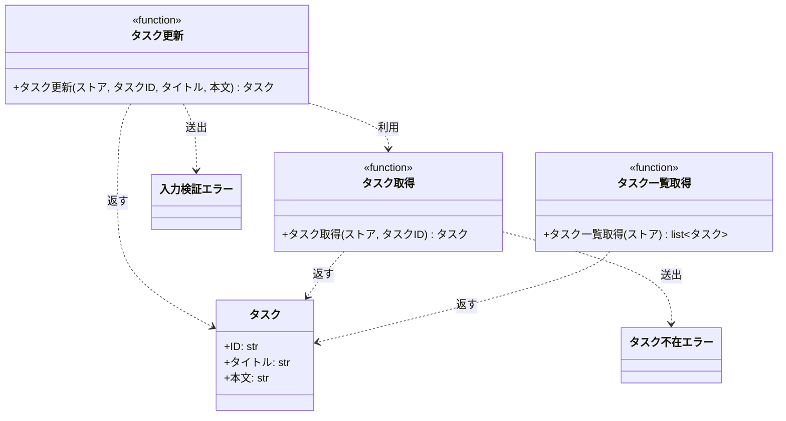

# モジュール構成: バックエンド / タスク

`タスク` ドメイン（バックエンド側）に属する構成要素詳細。

- 対応テストファイル: `tests/unit/tasks/test_service.py`

## 一覧

| ユースケース | 役割 | コンテナ | 種別 | 名前 | 概要 | 補足 |
| --- | --- | --- | --- | --- | --- | --- |
| 共通 | ドメインモデル | `src/tasks/models.py` | データモデル | [`Task`](#タスク) | タスク 1 件 | - |
| 共通 | 例外 | `src/tasks/errors.py` | クラス | [`TaskNotFoundError`](#タスク不在エラー) | 指定 ID のタスクが存在しない | - |
| 共通 | 例外 | `src/tasks/errors.py` | クラス | [`ValidationError`](#入力検証エラー) | 入力値が制約を満たさない | - |
| 共通 | 定数 | `src/tasks/service.py` | 定数 | `TITLE_MIN_LENGTH` | タイトルの最小文字数 | 値は `1` |
| 共通 | 定数 | `src/tasks/service.py` | 定数 | `TITLE_MAX_LENGTH` | タイトルの最大文字数 | 値は `100` |
| 共通 | 定数 | `src/tasks/service.py` | 定数 | `CONTENT_MAX_LENGTH` | 本文の最大文字数 | 値は `1000` |
| 共通 | サービス | `src/tasks/service.py` | 関数 | [`get_task`](#タスク取得) | ストアからタスクを 1 件取得する | - |
| 共通 | サービス | `src/tasks/service.py` | 関数 | [`list_tasks`](#タスク一覧取得) | ストアのタスクを ID 順で一覧化する | - |
| タスク更新 | サービス | `src/tasks/service.py` | 関数 | [`update_task`](#タスク更新) | タイトルと本文を更新する | - |

## ディレクトリ構成

```
src/tasks/
├── models.py     # Task
├── errors.py     # TaskNotFoundError / ValidationError
└── service.py    # get_task / update_task / list_tasks
```

## 構成図



## タスク
> 物理名: `Task`<br>
> 種別: データモデル<br>
> コンテナ: `src/tasks/models.py`

タスク 1 件を表す不変のデータモデル。

### プロパティ

| 論理名 | プロパティ名 | 型 | 可視性 | デフォルト | 説明 | 例 | 補足 |
| --- | --- | --- | --- | --- | --- | --- | --- |
| ID | `id` | `str` | 公開 | - | タスクを一意に識別する ID | `"t1"` | 更新では変更しない |
| タイトル | `title` | `str` | 公開 | - | タスクのタイトル | `"新タイトル"` | - |
| 本文 | `content` | `str` | 公開 | `""` | タスクの本文 | `"新本文"` | - |

### メソッド

なし

### 単体テスト

なし

### 補足

- `frozen=True` の dataclass にして、更新は新しいインスタンスの生成で表す

## タスク不在エラー
> 物理名: `TaskNotFoundError`<br>
> 種別: クラス<br>
> コンテナ: `src/tasks/errors.py`

指定 ID のタスクがストアに存在しないことを表す例外。

### プロパティ

なし

### メソッド

なし

### 単体テスト

なし

## 入力検証エラー
> 物理名: `ValidationError`<br>
> 種別: クラス<br>
> コンテナ: `src/tasks/errors.py`

入力値が制約を満たさないことを表す例外。

### プロパティ

なし

### メソッド

なし

### 単体テスト

なし

## `src/tasks/service.py`
> 種別: ファイル

タスクの取得・更新・一覧化を担う関数ファイル。
ストアは呼び出し側が保持する `dict[str, Task]` を引数で受け取り、本ファイルでは永続化層を持たない。

---

### タスク取得
> 物理名: `get_task`<br>
> 種別: 関数

ストアから ID でタスクを 1 件取得する。

#### 引数

| 論理名 | 引数名 | 型 | 必須 | デフォルト | 説明 | 補足 |
| --- | --- | --- | --- | --- | --- | --- |
| ストア | `store` | [`dict[str, Task]`](#タスク) | ✅ | - | タスクを保持する辞書 | キーはタスク ID |
| タスク ID | `task_id` | `str` | ✅ | - | 取得対象のタスク ID | - |

引数例:

```python
get_task({"t1": Task(id="t1", title="旧タイトル", content="旧本文")}, "t1")
```

#### 戻り値

| 型 | 説明 | 補足 |
| --- | --- | --- |
| [`Task`](#タスク) | 取得したタスク | - |

戻り値例:

```python
Task(id="t1", title="旧タイトル", content="旧本文")
```

#### 処理

1. `task_id` がストアに存在するか確認する
   - 存在しない場合、[タスク不在エラー](#タスク不在エラー)を送出する
2. ストアから取り出したタスクを返す

#### 例外

| 例外名 | 発生条件 | メッセージ | 補足 |
| --- | --- | --- | --- |
| [`TaskNotFoundError`](#タスク不在エラー) | `task_id` がストアに存在しない | `"task not found: {task_id}"` | - |

#### 単体テスト

セットアップ:

| セットアップ | 説明 | 補足 |
| --- | --- | --- |
| タスクストア | `t1`（タイトル `旧タイトル` / 本文 `旧本文`）を 1 件登録した辞書 | `_store()` |

| テスト名 | 正常/異常 | 概要 | 条件 | Mock | 期待値 | 補足 |
| --- | --- | --- | --- | --- | --- | --- |
| `test_get_task` | 正常 | 登録済みのタスクを取得する | `task_id` に `t1` を指定 | なし | 登録済みの `Task` を返す | - |
| `test_get_task_when_task_missing` | 異常 | 未登録の ID を指定する | `task_id` に `missing` を指定 | なし | `TaskNotFoundError` を送出する | 例外表「`task_id` がストアに存在しない」に対応 |

---

### タスク更新
> 物理名: `update_task`<br>
> 種別: 関数

登録済みタスクのタイトルと本文を更新して返す。

#### 引数

| 論理名 | 引数名 | 型 | 必須 | デフォルト | 説明 | 補足 |
| --- | --- | --- | --- | --- | --- | --- |
| ストア | `store` | [`dict[str, Task]`](#タスク) | ✅ | - | タスクを保持する辞書 | 更新後のタスクを書き戻す先 |
| タスク ID | `task_id` | `str` | ✅ | - | 更新対象のタスク ID | - |
| タイトル | `title` | `str` | ✅ | - | 更新後のタイトル | 1 文字以上 100 文字以内 |
| 本文 | `content` | `str` | - | `""` | 更新後の本文 | 1000 文字以内 |

引数例:

```python
update_task(store, "t1", "新タイトル", "新本文")
```

#### 戻り値

| 型 | 説明 | 補足 |
| --- | --- | --- |
| [`Task`](#タスク) | 更新後のタスク | 同じ値がストアにも書き戻される |

戻り値例:

```python
Task(id="t1", title="新タイトル", content="新本文")
```

#### 処理

1. タイトルの文字数を検証する
   - `TITLE_MIN_LENGTH` 未満または `TITLE_MAX_LENGTH` 超の場合、[入力検証エラー](#入力検証エラー)を送出する
2. 本文の文字数を検証する
   - `CONTENT_MAX_LENGTH` 超の場合、[入力検証エラー](#入力検証エラー)を送出する
3. 更新対象のタスクを取得する（[タスク取得](#タスク取得)）
4. 取得したタスクの ID を引き継いだ新しいタスクを組み立ててストアへ書き戻し、それを返す

#### 例外

| 例外名 | 発生条件 | メッセージ | 補足 |
| --- | --- | --- | --- |
| [`ValidationError`](#入力検証エラー) | タイトルの文字数が範囲外 | `"title は 1 文字以上 100 文字以内"` | - |
| [`ValidationError`](#入力検証エラー) | 本文の文字数が上限超過 | `"content は 1000 文字以内"` | 同じ例外の別発生箇所 |
| [`TaskNotFoundError`](#タスク不在エラー) | `task_id` がストアに存在しない | `"task not found: {task_id}"` | [タスク取得](#タスク取得)から伝播する |

#### 単体テスト

セットアップ:

| セットアップ | 説明 | 補足 |
| --- | --- | --- |
| タスクストア | `t1`（タイトル `旧タイトル` / 本文 `旧本文`）を 1 件登録した辞書 | `_store()` |

| テスト名 | 正常/異常 | 概要 | 条件 | Mock | 期待値 | 補足 |
| --- | --- | --- | --- | --- | --- | --- |
| `test_update_task` | 正常 | タイトルと本文を更新する | `新タイトル` / `新本文` を指定 | なし | 更新後の `Task` を返し、ストアの `t1` も同じ値になる | - |
| `test_update_task_when_content_omitted` | 正常 | 本文を省略する | `content` を渡さない | なし | 本文が空文字の `Task` を返す | デフォルト値の分岐 |
| `test_update_task_when_title_empty` | 異常 | タイトルが空 | `title` に空文字を指定 | なし | `ValidationError` を送出し、ストアの `t1` は変化しない | 例外表「タイトルの文字数が範囲外」に対応 |
| `test_update_task_when_title_too_long` | 異常 | タイトルが上限超過 | `title` に 101 文字を指定 | なし | `ValidationError` を送出し、ストアの `t1` は変化しない | 例外表「タイトルの文字数が範囲外」に対応 |
| `test_update_task_when_content_too_long` | 異常 | 本文が上限超過 | `content` に 1001 文字を指定 | なし | `ValidationError` を送出し、ストアの `t1` は変化しない | 例外表「本文の文字数が上限超過」に対応 |
| `test_update_task_when_task_missing` | 異常 | 未登録の ID を指定する | `task_id` に `missing` を指定 | なし | `TaskNotFoundError` を送出し、ストアは変化しない | 検証を通過してから取得する順序を確認する |

---

### タスク一覧取得
> 物理名: `list_tasks`<br>
> 種別: 関数

ストアのタスクを ID の昇順で一覧にする。

#### 引数

| 論理名 | 引数名 | 型 | 必須 | デフォルト | 説明 | 補足 |
| --- | --- | --- | --- | --- | --- | --- |
| ストア | `store` | [`dict[str, Task]`](#タスク) | ✅ | - | タスクを保持する辞書 | - |

引数例:

```python
list_tasks(store)
```

#### 戻り値

| 型 | 説明 | 補足 |
| --- | --- | --- |
| [`list[Task]`](#タスク) | ID の昇順に並べたタスク | ストアが空なら空リスト |

戻り値例:

```python
[Task(id="t1", title="新タイトル", content="新本文")]
```

#### 処理

1. ストアのキーを昇順に並べ、対応するタスクを同じ順で並べて返す

#### 例外

なし

#### 単体テスト

| テスト名 | 正常/異常 | 概要 | 条件 | Mock | 期待値 | 補足 |
| --- | --- | --- | --- | --- | --- | --- |
| `test_list_tasks` | 正常 | ID の昇順で一覧化する | `t2` / `t1` の順に登録したストア | なし | `t1` → `t2` の順の `list[Task]` を返す | 登録順ではなく ID 順になることを確認する |

---

### 補足

- 文字数の閾値は本ファイルの定数（`TITLE_MIN_LENGTH` / `TITLE_MAX_LENGTH` / `CONTENT_MAX_LENGTH`）で定義し、各関数はそれを参照する
- 更新は既存インスタンスの書き換えではなく新しい [`Task`](#タスク) の生成で行う（データモデルが不変のため）
