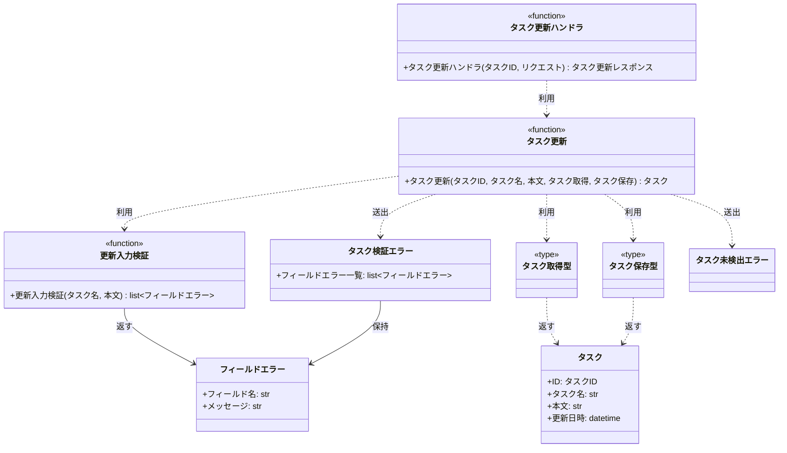
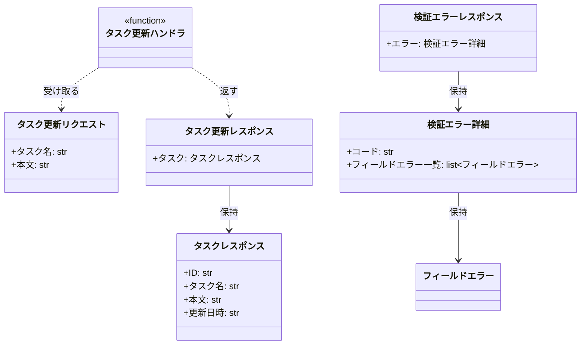
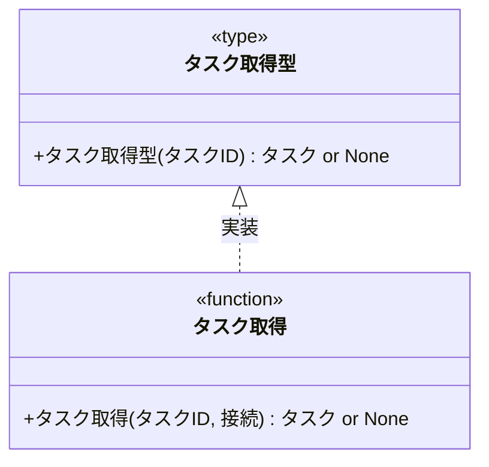
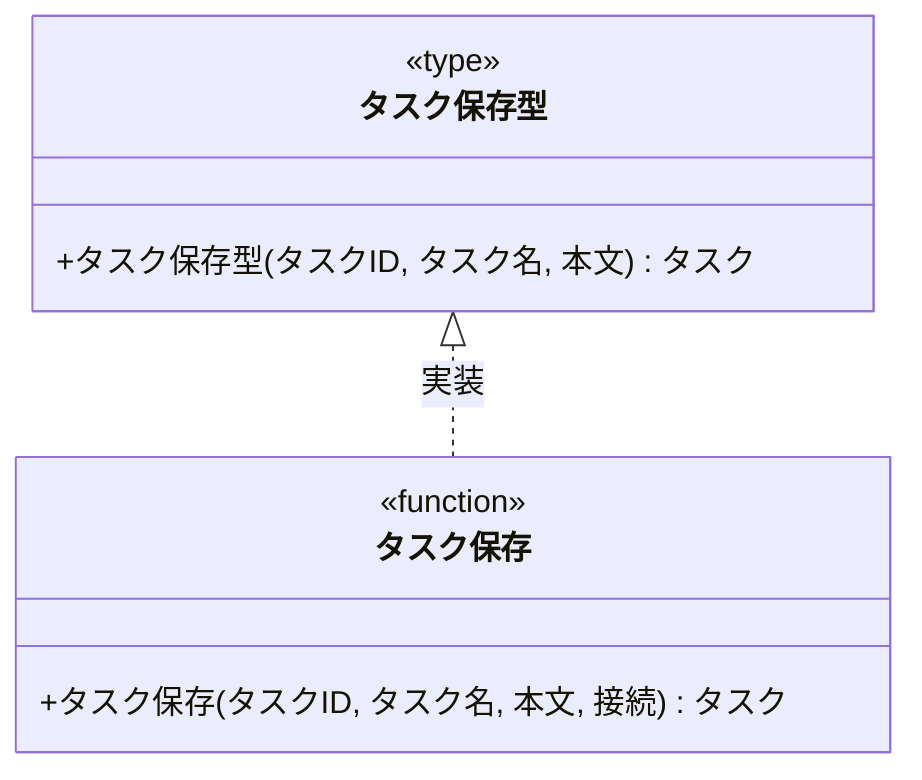

# モジュール構成: バックエンド / タスク

`タスク` ドメイン（バックエンド側）に属する構成要素詳細。
タスク更新ユースケース（`設計図/バックエンド結合/タスク更新.py.md`）を実装する。

## 一覧

| ユースケース | 役割 | コンテナ | 種別 | 名前 | 概要 | 補足 |
| --- | --- | --- | --- | --- | --- | --- |
| 共通 | ドメインモデル | `features/task/types.py` | データモデル | [`Task`](#タスク) | タスクのドメイン表現 | - |
| 共通 | DTO | `features/task/types.py` | データモデル | [`FieldError`](#フィールドエラー) | フィールド単位の検証エラー | - |
| 共通 | 定数 | `features/task/types.py` | 定数 | `TITLE_MAX_LENGTH` | タスク名の最大文字数（100） | 単純即値 |
| 共通 | 定数 | `features/task/types.py` | 定数 | `DESCRIPTION_MAX_LENGTH` | 本文の最大文字数（2000） | 単純即値 |
| 共通 | 例外 | `features/task/types.py` | クラス | [`TaskValidationError`](#タスク検証エラー) | 入力検証の失敗 | - |
| 共通 | 例外 | `features/task/types.py` | クラス | [`TaskNotFoundError`](#タスク未検出エラー) | 対象タスクが存在しない | - |
| 共通 | リポジトリ型（DI） | `features/task/types.py` | 関数型 | [`FindTask`](#タスク取得型) | タスク 1 件取得のシグネチャ | DI / Mock 差し替え用 |
| 共通 | リポジトリ型（DI） | `features/task/types.py` | 関数型 | [`SaveTask`](#タスク保存型) | タスク更新のシグネチャ | DI / Mock 差し替え用 |
| タスク更新 | DTO | `features/task/schemas.py` | データモデル | [`UpdateTaskRequest`](#タスク更新リクエスト) | 更新リクエストのボディ | - |
| タスク更新 | DTO | `features/task/schemas.py` | データモデル | [`TaskResponse`](#タスクレスポンス) | レスポンス内のタスク | - |
| タスク更新 | DTO | `features/task/schemas.py` | データモデル | [`UpdateTaskResponse`](#タスク更新レスポンス) | 更新成功時のレスポンス | - |
| タスク更新 | DTO | `features/task/schemas.py` | データモデル | [`ValidationErrorDetail`](#検証エラー詳細) | 検証エラーの中身 | - |
| タスク更新 | DTO | `features/task/schemas.py` | データモデル | [`ValidationErrorResponse`](#検証エラーレスポンス) | 検証失敗時のレスポンス | OpenAPI 記述用 |
| タスク更新 | バリデータ | `features/task/service.py` | 関数 | [`_validate_update_input`](#更新入力検証) | タスク名と本文を検証 | 内部関数 |
| タスク更新 | サービス | `features/task/service.py` | 関数 | [`update_task`](#タスク更新) | 検証 → 取得 → 保存を束ねる | - |
| タスク更新 | リポジトリ | `features/task/db.py` | 関数 | [`find_task`](#タスク取得) | タスク ID で 1 件取得 | [`FindTask`](#タスク取得型) の実装 |
| タスク更新 | リポジトリ | `features/task/db.py` | 関数 | [`save_task`](#タスク保存) | タスク名と本文を更新 | [`SaveTask`](#タスク保存型) の実装 |
| タスク更新 | ハンドラ | `features/task/route.py` | 関数 | [`update_task_route`](#タスク更新ハンドラ) | `PUT /tasks/{taskId}` の入口 | - |

## ディレクトリ構成

```
src/taskapp/features/task/
├── __init__.py     # 公開シンボルの再エクスポート
├── types.py        # Task / FieldError / 定数 / 例外 / 関数型
├── schemas.py      # HTTP 境界の Pydantic モデル
├── service.py      # update_task と入力検証
├── db.py           # find_task / save_task
└── route.py        # PUT /tasks/{taskId}
```

## 構成図

### タスク更新



---

### HTTPスキーマ



---

### タスク取得型



---

### タスク保存型



## タスク
> 物理名: `Task`<br>
> 種別: データモデル<br>
> コンテナ: `features/task/types.py`

タスクのドメイン表現。

### プロパティ

| 論理名 | プロパティ名 | 型 | 可視性 | デフォルト | 説明 | 例 | 補足 |
| --- | --- | --- | --- | --- | --- | --- | --- |
| ID | `id` | `TaskId` | 公開 | - | タスクの一意 ID | `"3f2b1c88-9a1c-4e02-b24d-7f5612ab34cd"` | `type TaskId = str` |
| タスク名 | `title` | `str` | 公開 | - | タスク名 | `"決算資料の作成"` | 前後の空白は除去済み |
| 本文 | `description` | `str` | 公開 | - | タスク本文 | `"四半期分の売上を集計する"` | 本文なしは空文字 |
| 更新日時 | `updated_at` | `datetime` | 公開 | - | 最終更新日時 | `2026-07-27T04:12:33+00:00` | UTC |

### メソッド

なし

### 単体テスト

なし

### 補足

- `@dataclass(frozen=True, slots=True, kw_only=True)` で定義する（関数間で受け渡す内部 DTO のため）

## フィールドエラー
> 物理名: `FieldError`<br>
> 種別: データモデル<br>
> コンテナ: `features/task/types.py`

検証に失敗したフィールド 1 件分のエラー。

### プロパティ

| 論理名 | プロパティ名 | 型 | 可視性 | デフォルト | 説明 | 例 | 補足 |
| --- | --- | --- | --- | --- | --- | --- | --- |
| フィールド名 | `field` | `Literal["title", "description"]` | 公開 | - | 検証に失敗したフィールド | `"title"` | リクエストのパラメータ名と一致 |
| メッセージ | `message` | `str` | 公開 | - | 画面にそのまま出す文言 | `"タスク名を入力してください"` | 日本語 |

### メソッド

なし

### 単体テスト

なし

### 補足

- 内部 DTO と HTTP レスポンスの両方で使うため `pydantic.BaseModel` で定義する（2 プロパティのみの素の構造で、dataclass と Pydantic に二重定義すると DRY に反するため）

## タスク検証エラー
> 物理名: `TaskValidationError`<br>
> 種別: クラス<br>
> コンテナ: `features/task/types.py`<br>
> 継承元: `ValidationError`

入力検証に失敗したことを表す例外。
失敗したフィールドの一覧を保持する。

### プロパティ

| 論理名 | プロパティ名 | 型 | 可視性 | デフォルト | 説明 | 例 | 補足 |
| --- | --- | --- | --- | --- | --- | --- | --- |
| フィールドエラー一覧 | `fields` | [`list[FieldError]`](#フィールドエラー) | 公開 | - | 失敗したフィールドの全件 | `[FieldError(field="title", ...)]` | 1 件以上 |

### メソッド

なし

### 単体テスト

なし

### 補足

- 親の `ValidationError` は `shared/errors.py`（別分類）で定義する
- HTTP 400 への変換は `server` 側の例外ハンドラが担う

## タスク未検出エラー
> 物理名: `TaskNotFoundError`<br>
> 種別: クラス<br>
> コンテナ: `features/task/types.py`<br>
> 継承元: `NotFoundError`

指定したタスク ID のタスクが存在しないことを表す例外。

### プロパティ

なし

### メソッド

なし

### 単体テスト

なし

### 補足

- 親の `NotFoundError` は `shared/errors.py`（別分類）で定義する
- HTTP 404 への変換は `server` 側の例外ハンドラが担う

## タスク更新リクエスト
> 物理名: `UpdateTaskRequest`<br>
> 種別: データモデル<br>
> コンテナ: `features/task/schemas.py`

`PUT /tasks/{taskId}` のリクエストボディ。

### プロパティ

| 論理名 | プロパティ名 | 型 | 可視性 | デフォルト | 説明 | 例 | 補足 |
| --- | --- | --- | --- | --- | --- | --- | --- |
| タスク名 | `title` | `str` | 公開 | - | 更新後のタスク名 | `"決算資料の作成"` | 文字数の検証は [更新入力検証](#更新入力検証) が行う |
| 本文 | `description` | `str` | 公開 | `""` | 更新後の本文 | `"四半期分の売上を集計する"` | 省略時は本文なし |

### メソッド

なし

### 単体テスト

なし

### 補足

- `pydantic.BaseModel` で定義する
- 文字数制限を `Field` に持たせない（制限値を定数と `Field` の 2 箇所に書くと DRY に反するため、検証は [更新入力検証](#更新入力検証) に集約する）

## タスクレスポンス
> 物理名: `TaskResponse`<br>
> 種別: データモデル<br>
> コンテナ: `features/task/schemas.py`

レスポンスに載せる更新後のタスク。

### プロパティ

| 論理名 | プロパティ名 | 型 | 可視性 | デフォルト | 説明 | 例 | 補足 |
| --- | --- | --- | --- | --- | --- | --- | --- |
| ID | `id` | `str` | 公開 | - | タスク ID | `"3f2b1c88-9a1c-4e02-b24d-7f5612ab34cd"` | - |
| タスク名 | `title` | `str` | 公開 | - | 更新後のタスク名 | `"決算資料の作成"` | - |
| 本文 | `description` | `str` | 公開 | - | 更新後の本文 | `"四半期分の売上を集計する"` | - |
| 更新日時 | `updatedAt` | `str` | 公開 | - | 最終更新日時 | `"2026-07-27T04:12:33+00:00"` | ISO 8601・UTC |

### メソッド

なし

### 単体テスト

なし

### 補足

- `pydantic.BaseModel` で定義する
- [タスク](#タスク) から詰め替える `from_domain` を `@classmethod` で持たせ、[タスク更新ハンドラ](#タスク更新ハンドラ) を 1 行にする

## タスク更新レスポンス
> 物理名: `UpdateTaskResponse`<br>
> 種別: データモデル<br>
> コンテナ: `features/task/schemas.py`

更新成功時のレスポンス全体。

### プロパティ

| 論理名 | プロパティ名 | 型 | 可視性 | デフォルト | 説明 | 例 | 補足 |
| --- | --- | --- | --- | --- | --- | --- | --- |
| タスク | `task` | [`TaskResponse`](#タスクレスポンス) | 公開 | - | 更新後のタスク | - | - |

### メソッド

なし

### 単体テスト

なし

### 補足

- `pydantic.BaseModel` で定義する

## 検証エラー詳細
> 物理名: `ValidationErrorDetail`<br>
> 種別: データモデル<br>
> コンテナ: `features/task/schemas.py`

検証失敗レスポンスの `error` 直下。

### プロパティ

| 論理名 | プロパティ名 | 型 | 可視性 | デフォルト | 説明 | 例 | 補足 |
| --- | --- | --- | --- | --- | --- | --- | --- |
| コード | `code` | `Literal["validation_error"]` | 公開 | `"validation_error"` | エラー種別 | `"validation_error"` | 固定値 |
| フィールドエラー一覧 | `fields` | [`list[FieldError]`](#フィールドエラー) | 公開 | - | 失敗したフィールドの全件 | - | 1 件以上 |

### メソッド

なし

### 単体テスト

なし

### 補足

- `pydantic.BaseModel` で定義する

## 検証エラーレスポンス
> 物理名: `ValidationErrorResponse`<br>
> 種別: データモデル<br>
> コンテナ: `features/task/schemas.py`

検証失敗時のレスポンス全体。

### プロパティ

| 論理名 | プロパティ名 | 型 | 可視性 | デフォルト | 説明 | 例 | 補足 |
| --- | --- | --- | --- | --- | --- | --- | --- |
| エラー | `error` | [`ValidationErrorDetail`](#検証エラー詳細) | 公開 | - | エラー内容 | - | - |

### メソッド

なし

### 単体テスト

なし

### 補足

- `pydantic.BaseModel` で定義する
- 実際にこのボディを組み立てるのは `server` 側の例外ハンドラで、本モデルは [タスク更新ハンドラ](#タスク更新ハンドラ) の `responses` に載せて OpenAPI に反映するために使う

## `features/task/types.py`
> 種別: ファイル

タスクドメインの型定義を集約するファイル。
外部依存（DB アクセス）は関数の型エイリアスで抽象化する。

---

### タスク取得型
> 物理名: `FindTask`<br>
> 種別: 関数型

タスク ID で 1 件取得する関数のシグネチャ。
DI / Mock 差し替え用。

#### 引数

| 論理名 | 引数名 | 型 | 必須 | デフォルト | 説明 | 補足 |
| --- | --- | --- | --- | --- | --- | --- |
| タスク ID | `task_id` | `TaskId` | ✅ | - | 取得対象のタスク ID | - |

#### 戻り値

| 型 | 説明 | 補足 |
| --- | --- | --- |
| [`Task \| None`](#タスク) | 見つかったタスク | 見つからない場合は `None` |

#### 実装

| 実装 | 補足 |
| --- | --- |
| [タスク取得](#タスク取得) | 本番の実装（DB 接続を `partial` で束ねて注入する） |

---

### タスク保存型
> 物理名: `SaveTask`<br>
> 種別: 関数型

タスク名と本文を更新する関数のシグネチャ。
DI / Mock 差し替え用。

#### 引数

| 論理名 | 引数名 | 型 | 必須 | デフォルト | 説明 | 補足 |
| --- | --- | --- | --- | --- | --- | --- |
| タスク ID | `task_id` | `TaskId` | ✅ | - | 更新対象のタスク ID | - |
| タスク名 | `title` | `str` | ✅ | - | 更新後のタスク名 | 検証済みの値 |
| 本文 | `description` | `str` | ✅ | - | 更新後の本文 | 検証済みの値 |

#### 戻り値

| 型 | 説明 | 補足 |
| --- | --- | --- |
| [`Task`](#タスク) | 更新後のタスク | `updated_at` は更新後の値 |

#### 実装

| 実装 | 補足 |
| --- | --- |
| [タスク保存](#タスク保存) | 本番の実装（DB 接続を `partial` で束ねて注入する） |

### 補足

- `TaskId` は `type TaskId = str` の識別子型エイリアスとして本ファイルに定義する
- 定数 `TITLE_MAX_LENGTH`（100）と `DESCRIPTION_MAX_LENGTH`（2000）も本ファイルに置き、[更新入力検証](#更新入力検証) から参照する

## `features/task/service.py`
> 種別: ファイル

タスク更新のドメインロジックを束ねる関数ファイル。

---

### 更新入力検証
> 物理名: `_validate_update_input`<br>
> 種別: 関数

タスク名と本文を検証し、失敗したフィールドの一覧を返す。

#### 引数

| 論理名 | 引数名 | 型 | 必須 | デフォルト | 説明 | 補足 |
| --- | --- | --- | --- | --- | --- | --- |
| タスク名 | `title` | `str` | ✅ | - | 検証対象のタスク名 | 前後の空白を含む生の値 |
| 本文 | `description` | `str` | ✅ | - | 検証対象の本文 | - |

引数例:

```python
_validate_update_input(title="  決算資料の作成  ", description="四半期分の売上を集計する")
```

#### 戻り値

| 型 | 説明 | 補足 |
| --- | --- | --- |
| [`list[FieldError]`](#フィールドエラー) | 失敗したフィールドの一覧 | 全て通過した場合は空リスト |

戻り値例:

```python
[FieldError(field="title", message="タスク名を入力してください")]
```

#### 処理

1. `title` の前後の空白を除去する
2. 除去後の `title` の文字数から、タスク名のフィールドエラーを決める
   - 0 文字の場合、`"タスク名を入力してください"` のフィールドエラーを積む
   - `TITLE_MAX_LENGTH` を超える場合、`"タスク名は 100 文字以内で入力してください"` のフィールドエラーを積む
3. `description` が `DESCRIPTION_MAX_LENGTH` を超える場合、`"本文は 2000 文字以内で入力してください"` のフィールドエラーを積む
4. 積んだフィールドエラーの一覧を返す

#### 例外

なし

#### 単体テスト

| テスト名 | 正常/異常 | 概要 | 条件 | Mock | 期待値 | 補足 |
| --- | --- | --- | --- | --- | --- | --- |
| `test_validate_update_input` | 正常 | 全て制限内で通過する | `title` 10 文字 / `description` 20 文字 | なし | 空リストを返す | - |
| `test_validate_update_input_when_title_blank` | 正常 | 空白のみのタスク名を空と判定する | `title` が `"   "` | なし | `field="title"` のエラー 1 件を返す | 前後の空白除去の分岐 |
| `test_validate_update_input_when_title_too_long` | 正常 | タスク名が上限超過 | `title` が 101 文字 | なし | `field="title"` のエラー 1 件を返す | - |
| `test_validate_update_input_when_title_max_length` | 正常 | タスク名が上限ちょうど | `title` が 100 文字 | なし | 空リストを返す | 境界値 |
| `test_validate_update_input_when_description_too_long` | 正常 | 本文が上限超過 | `description` が 2001 文字 | なし | `field="description"` のエラー 1 件を返す | - |
| `test_validate_update_input_when_all_invalid` | 正常 | タスク名と本文が両方不正 | `title` が空 / `description` が 2001 文字 | なし | エラー 2 件を返す | 複数フィールドの積み上げ |

---

### タスク更新
> 物理名: `update_task`<br>
> 種別: 関数

タスク名と本文を検証してから更新し、更新後のタスクを返す。

#### 引数

| 論理名 | 引数名 | 型 | 必須 | デフォルト | 説明 | 補足 |
| --- | --- | --- | --- | --- | --- | --- |
| タスク ID | `task_id` | `TaskId` | ✅ | - | 更新対象のタスク ID | - |
| タスク名 | `title` | `str` | ✅ | - | 更新後のタスク名 | 検証前の生の値 |
| 本文 | `description` | `str` | ✅ | - | 更新後の本文 | 検証前の生の値 |
| タスク取得 | `find` | [`FindTask`](#タスク取得型) | ✅ | - | タスク取得の実装 | キーワード専用引数 |
| タスク保存 | `save` | [`SaveTask`](#タスク保存型) | ✅ | - | タスク保存の実装 | キーワード専用引数 |

引数例:

```python
update_task(
    task_id="3f2b1c88-9a1c-4e02-b24d-7f5612ab34cd",
    title="決算資料の作成",
    description="四半期分の売上を集計する",
    find=find_task_wired,
    save=save_task_wired,
)
```

#### 戻り値

| 型 | 説明 | 補足 |
| --- | --- | --- |
| [`Task`](#タスク) | 更新後のタスク | - |

戻り値例:

```python
Task(
    id="3f2b1c88-9a1c-4e02-b24d-7f5612ab34cd",
    title="決算資料の作成",
    description="四半期分の売上を集計する",
    updated_at=datetime(2026, 7, 27, 4, 12, 33, tzinfo=UTC),
)
```

#### 処理

1. 入力値を検証する（[更新入力検証](#更新入力検証)）
   - フィールドエラーが 1 件以上ある場合、`TaskValidationError` を投げる
   - `[WARNING]` 入力検証に失敗した（`task_id` / 失敗したフィールド名の一覧）
2. `task_id` でタスクを取得する（注入された [タスク取得型](#タスク取得型)）
   - `None` が返った場合、`TaskNotFoundError` を投げる
   - `[WARNING]` 存在しないタスクの更新を拒否した（`task_id`）
3. 前後の空白を除去したタスク名と本文で保存する（注入された [タスク保存型](#タスク保存型)）
   - `[INFO]` タスクを更新した（`task_id`）
4. 保存後のタスクを返す

#### 例外

| 例外名 | 発生条件 | メッセージ | 補足 |
| --- | --- | --- | --- |
| `TaskValidationError` | [更新入力検証](#更新入力検証) がフィールドエラーを 1 件以上返した | `"入力値の検証に失敗しました"` | `fields` に失敗したフィールドを載せる |
| `TaskNotFoundError` | [タスク取得型](#タスク取得型) が `None` を返した | `"タスクが見つかりません: {task_id}"` | - |

#### 単体テスト

| テスト名 | 正常/異常 | 概要 | 条件 | Mock | 期待値 | 補足 |
| --- | --- | --- | --- | --- | --- | --- |
| `test_update_task` | 正常 | 検証を通過して更新できる | 既存タスクあり / 制限内の入力 | タスク取得 + タスク保存 | 更新後の `Task` を返す。タスク保存に前後の空白を除去した値が渡る | - |
| `test_update_task_when_validation_failed` | 異常 | 入力検証に失敗 | `title` が空文字 | タスク取得 + タスク保存 | `TaskValidationError` を投げる。タスク取得もタスク保存も呼ばれない | 例外表「フィールドエラーを 1 件以上返した」に対応 |
| `test_update_task_when_task_not_found` | 異常 | 対象タスクが存在しない | タスク取得が `None` を返す | タスク取得 + タスク保存 | `TaskNotFoundError` を投げる。タスク保存は呼ばれない | 例外表「`None` を返した」に対応 |

### 補足

- 検証の制限値は [`features/task/types.py`](#featurestasktypespy) の定数のみを参照する（同じ数値をここに書かない）

## `features/task/db.py`
> 種別: ファイル

tasks テーブルへのアクセス関数を集約するファイル。
DB 接続はキーワード専用引数で受け取り、`main.py` で `partial` により束ねる。

---

### タスク取得
> 物理名: `find_task`<br>
> 種別: 関数<br>
> 継承元: [`FindTask`](#タスク取得型)

タスク ID で tasks テーブルから 1 件取得する。

#### 引数

| 論理名 | 引数名 | 型 | 必須 | デフォルト | 説明 | 補足 |
| --- | --- | --- | --- | --- | --- | --- |
| タスク ID | `task_id` | `TaskId` | ✅ | - | 取得対象のタスク ID | - |
| 接続 | `conn` | `Connection` | ✅ | - | DB 接続 | キーワード専用引数 |

引数例:

```python
find_task("3f2b1c88-9a1c-4e02-b24d-7f5612ab34cd", conn=conn)
```

#### 戻り値

| 型 | 説明 | 補足 |
| --- | --- | --- |
| [`Task \| None`](#タスク) | 見つかったタスク | 見つからない場合は `None` |

戻り値例:

```python
Task(
    id="3f2b1c88-9a1c-4e02-b24d-7f5612ab34cd",
    title="決算資料の作成",
    description="四半期分の売上を集計する",
    updated_at=datetime(2026, 7, 26, 9, 0, 0, tzinfo=UTC),
)
```

#### 処理

1. `task_id` で tasks テーブルの 1 行を SELECT する
2. 取得結果から戻り値を決める
   - 行がある場合、[タスク](#タスク) に詰め替えて返す
   - 行がない場合、`None` を返す

#### 例外

なし

#### 単体テスト

| テスト名 | 正常/異常 | 概要 | 条件 | Mock | 期待値 | 補足 |
| --- | --- | --- | --- | --- | --- | --- |
| `test_find_task` | 正常 | 既存タスクを取得できる | tasks に該当行あり | DB 接続 | `Task` を返す | - |
| `test_find_task_when_row_missing` | 正常 | 該当行なし | tasks に該当行なし | DB 接続 | `None` を返す | 分岐の片側 |

---

### タスク保存
> 物理名: `save_task`<br>
> 種別: 関数<br>
> 継承元: [`SaveTask`](#タスク保存型)

tasks テーブルのタスク名と本文を更新する。

#### 引数

| 論理名 | 引数名 | 型 | 必須 | デフォルト | 説明 | 補足 |
| --- | --- | --- | --- | --- | --- | --- |
| タスク ID | `task_id` | `TaskId` | ✅ | - | 更新対象のタスク ID | - |
| タスク名 | `title` | `str` | ✅ | - | 更新後のタスク名 | 検証済みの値 |
| 本文 | `description` | `str` | ✅ | - | 更新後の本文 | 検証済みの値 |
| 接続 | `conn` | `Connection` | ✅ | - | DB 接続 | キーワード専用引数 |

引数例:

```python
save_task(
    "3f2b1c88-9a1c-4e02-b24d-7f5612ab34cd",
    "決算資料の作成",
    "四半期分の売上を集計する",
    conn=conn,
)
```

#### 戻り値

| 型 | 説明 | 補足 |
| --- | --- | --- |
| [`Task`](#タスク) | 更新後のタスク | - |

戻り値例:

```python
Task(
    id="3f2b1c88-9a1c-4e02-b24d-7f5612ab34cd",
    title="決算資料の作成",
    description="四半期分の売上を集計する",
    updated_at=datetime(2026, 7, 27, 4, 12, 33, tzinfo=UTC),
)
```

#### 処理

1. `task_id` の行の `title` / `description` / `updated_at` を UPDATE する（`updated_at` は SQL の `NOW()` で採番し、`RETURNING` で更新後の行を受け取る）
2. 返った行を [タスク](#タスク) に詰め替えて返す

#### 例外

なし

#### 単体テスト

| テスト名 | 正常/異常 | 概要 | 条件 | Mock | 期待値 | 補足 |
| --- | --- | --- | --- | --- | --- | --- |
| `test_save_task` | 正常 | タスク名と本文を更新できる | tasks に該当行あり | DB 接続 | 更新後の `Task` を返す。UPDATE に送信値が渡る | - |

### 補足

- DB 書き込みが失敗した場合の例外はドライバの例外をそのまま伝播させる（`server` 側の最上位ハンドラが 500 に変換する）

## `features/task/route.py`
> 種別: ファイル

タスクドメインの FastAPI ルーターを定義するファイル。

---

### タスク更新ハンドラ
> 物理名: `update_task_route`<br>
> 種別: 関数

`PUT /tasks/{taskId}` を受けて [タスク更新](#タスク更新) を呼ぶ。

#### 引数

| 論理名 | 引数名 | 型 | 必須 | デフォルト | 説明 | 補足 |
| --- | --- | --- | --- | --- | --- | --- |
| タスク ID | `task_id` | `TaskId` | ✅ | - | 更新対象のタスク ID | パスパラメータ |
| リクエスト | `body` | [`UpdateTaskRequest`](#タスク更新リクエスト) | ✅ | - | 更新内容 | リクエストボディ |
| リクエストオブジェクト | `request` | `Request` | ✅ | - | 配線済み関数の取り出し元 | `request.app.state.handlers` を参照 |

引数例:

```python
PUT /tasks/3f2b1c88-9a1c-4e02-b24d-7f5612ab34cd
{"title": "決算資料の作成", "description": "四半期分の売上を集計する"}
```

#### 戻り値

| 型 | 説明 | 補足 |
| --- | --- | --- |
| [`UpdateTaskResponse`](#タスク更新レスポンス) | 更新後のタスク | `status_code=200` |

戻り値例:

```python
{
    "task": {
        "id": "3f2b1c88-9a1c-4e02-b24d-7f5612ab34cd",
        "title": "決算資料の作成",
        "description": "四半期分の売上を集計する",
        "updatedAt": "2026-07-27T04:12:33+00:00",
    }
}
```

#### 処理

1. 配線済みのタスク更新を取り出して呼ぶ（[タスク更新](#タスク更新)）
2. 返ったタスクを [タスク更新レスポンス](#タスク更新レスポンス) に詰め替えて返す

#### 例外

なし

#### 単体テスト

| テスト名 | 正常/異常 | 概要 | 条件 | Mock | 期待値 | 補足 |
| --- | --- | --- | --- | --- | --- | --- |
| `test_update_task_route` | 正常 | 更新後のタスクを返す | 配線済みタスク更新が `Task` を返す | タスク更新 | `200` + `UpdateTaskResponse`。タスク更新にパスパラメータとボディの値が渡る | - |

### 補足

- 例外は捕捉せず伝播させる（`TaskValidationError` → 400 / `TaskNotFoundError` → 404 の変換は `server` 側の例外ハンドラが担う）
- `responses` に `400` = [検証エラーレスポンス](#検証エラーレスポンス) を宣言して OpenAPI に反映する
