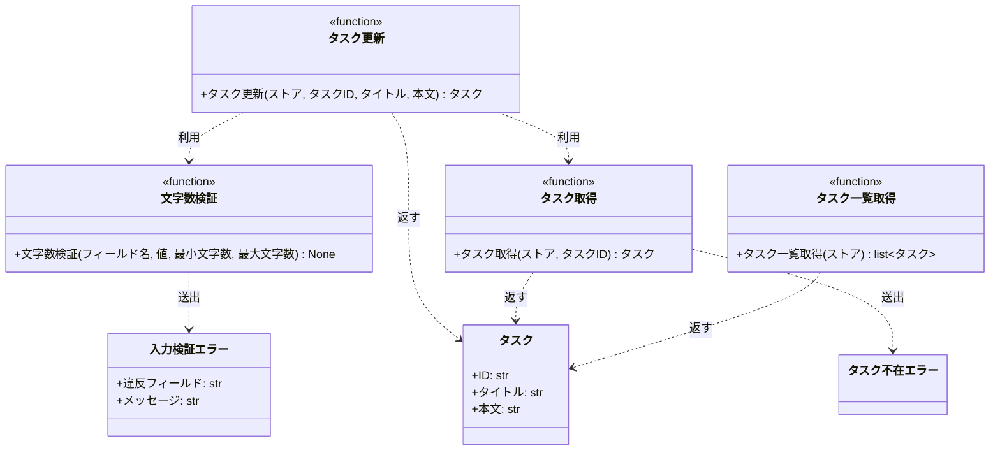

# モジュール構成: バックエンド / タスク

`タスク` ドメイン（バックエンド 側）に属する構成要素詳細。

- 対応テストファイル: `tests/unit/tasks/test_service.py` / `tests/unit/tasks/test_errors.py`

## 一覧

| ユースケース | 役割 | コンテナ | 種別 | 名前 | 概要 | 補足 |
| --- | --- | --- | --- | --- | --- | --- |
| 共通 | ドメインモデル | `src/tasks/models.py` | データモデル | [`Task`](#タスク) | タスク 1 件 | - |
| 共通 | ドメイン例外 | `src/tasks/errors.py` | クラス | [`TaskNotFoundError`](#タスク不在エラー) | 指定 ID のタスクが存在しない | - |
| 共通 | ドメイン例外 | `src/tasks/errors.py` | クラス | [`ValidationError`](#入力検証エラー) | 入力値が制約を満たさない | 違反フィールド名を保持する |
| 共通 | 定数 | `src/tasks/service.py` | 定数 | `TITLE_MIN_LENGTH` | タイトルの最小文字数 | 値は `1` |
| 共通 | 定数 | `src/tasks/service.py` | 定数 | `TITLE_MAX_LENGTH` | タイトルの最大文字数 | 値は `100` |
| 共通 | 定数 | `src/tasks/service.py` | 定数 | `CONTENT_MAX_LENGTH` | 本文の最大文字数 | 値は `1000` |
| 共通 | クエリ | `src/tasks/service.py` | 関数 | [`get_task`](#タスク取得) | ストアからタスクを 1 件取得する | - |
| 共通 | クエリ | `src/tasks/service.py` | 関数 | [`list_tasks`](#タスク一覧取得) | ストアのタスクを ID 順で一覧にする | - |
| タスク編集 | バリデータ | `src/tasks/service.py` | 関数 | [`_validate_length`](#文字数検証) | 文字数が範囲内かを検証する | 内部関数 |
| タスク編集 | サービス | `src/tasks/service.py` | 関数 | [`update_task`](#タスク更新) | タイトルと本文を検証して更新する | - |

## ディレクトリ構成

```
src/tasks/
├── models.py     # Task
├── errors.py     # TaskNotFoundError / ValidationError
└── service.py    # 定数 / get_task / _validate_length / update_task / list_tasks
```

## 構成図



## タスク
> 物理名: `Task`<br>
> 種別: データモデル<br>
> コンテナ: `src/tasks/models.py`

タスク 1 件を表す不変のデータモデル。

### プロパティ

| 論理名 | プロパティ名 | 型 | 可視性 | デフォルト | 説明 | 例 | 補足 |
| --- | --- | --- | --- | --- | --- | --- | --- |
| ID | `id` | `str` | 公開 | - | タスクの識別子 | `"t1"` | ストアのキーと同じ値を持つ |
| タイトル | `title` | `str` | 公開 | - | タスクのタイトル | `"週次レポート作成"` | 1〜100 文字 |
| 本文 | `content` | `str` | 公開 | `""` | タスクの詳細説明 | `"〇〇を完了させる"` | 1000 文字以内 |

### メソッド

なし

### 単体テスト

なし

### 補足

- `@dataclass(frozen=True, slots=True, kw_only=True)` で不変にする。
  更新は同じ ID の新しいインスタンスへ差し替える形で行う

## タスク不在エラー
> 物理名: `TaskNotFoundError`<br>
> 種別: クラス<br>
> コンテナ: `src/tasks/errors.py`

指定した ID のタスクがストアに存在しないことを表すドメイン例外。

### プロパティ

なし

### メソッド

なし

### 単体テスト

なし

## 入力検証エラー
> 物理名: `ValidationError`<br>
> 種別: クラス<br>
> コンテナ: `src/tasks/errors.py`

入力値が制約を満たさないことを表すドメイン例外。
呼び出し元がフィールド単位でエラーを出し分けられるよう、違反したフィールド名を保持する。

### プロパティ

| 論理名 | プロパティ名 | 型 | 可視性 | デフォルト | 説明 | 例 | 補足 |
| --- | --- | --- | --- | --- | --- | --- | --- |
| 違反フィールド | `field` | `str` | 公開 | - | 制約に違反した入力フィールド名 | `"title"` | 呼び出し元の出し分けキー |
| メッセージ | `message` | `str` | 公開 | - | 違反内容の説明 | `"1 文字以上 100 文字以内"` | フィールド名は含めない |

### 初期化
> 物理名: `__init__`<br>
> 種別: メソッド

違反フィールド名とメッセージを受け取って保持する。

#### 引数

| 論理名 | 引数名 | 型 | 必須 | デフォルト | 説明 | 補足 |
| --- | --- | --- | --- | --- | --- | --- |
| 違反フィールド | `field` | `str` | ✅ | - | 制約に違反した入力フィールド名 | - |
| メッセージ | `message` | `str` | ✅ | - | 違反内容の説明 | - |

引数例:

```python
raise ValidationError("title", "1 文字以上 100 文字以内")
```

#### 戻り値

| 型 | 説明 | 補足 |
| --- | --- | --- |
| `None` | 返り値なし | - |

#### 処理

1. `{field}: {message}` の形式にした文字列を基底クラスへ渡す
2. `field` と `message` を属性に保持する

#### 例外

なし

#### 単体テスト

| テスト名 | 正常/異常 | 概要 | 条件 | Mock | 期待値 | 補足 |
| --- | --- | --- | --- | --- | --- | --- |
| `test_init` | 正常 | 属性と文字列表現が設定される | `field="title"` / `message="1 文字以上 100 文字以内"` | なし | `field` / `message` が引数どおりで、文字列表現が `"title: 1 文字以上 100 文字以内"` になる | - |

## `src/tasks/service.py`
> 種別: ファイル

タスクの取得・検証・更新・一覧化を行う関数ファイル。
ストアは呼び出し側が保持する辞書を引数で受け取る。

---

### タスク取得
> 物理名: `get_task`<br>
> 種別: 関数

ストアからタスクを 1 件取得する。

#### 引数

| 論理名 | 引数名 | 型 | 必須 | デフォルト | 説明 | 補足 |
| --- | --- | --- | --- | --- | --- | --- |
| ストア | `store` | [`dict[str, Task]`](#タスク) | ✅ | - | 検索対象のタスクストア | - |
| タスク ID | `task_id` | `str` | ✅ | - | 取得するタスクの識別子 | - |

引数例:

```python
get_task({"t1": Task(id="t1", title="旧タイトル", content="旧本文")}, "t1")
```

#### 戻り値

| 型 | 説明 | 補足 |
| --- | --- | --- |
| [`Task`](#タスク) | 取得したタスク | - |

戻り値例:

```python
Task(id="t1", title="旧タイトル", content="旧本文")
```

#### 処理

1. `task_id` がストアに無ければ `TaskNotFoundError` を投げる
2. ストアから取り出したタスクを返す

#### 例外

| 例外名 | 発生条件 | メッセージ | 補足 |
| --- | --- | --- | --- |
| `TaskNotFoundError` | `task_id` がストアに存在しない | `"task not found: {task_id}"` | - |

#### 単体テスト

| テスト名 | 正常/異常 | 概要 | 条件 | Mock | 期待値 | 補足 |
| --- | --- | --- | --- | --- | --- | --- |
| `test_get_task` | 正常 | 登録済みのタスクを取得する | ストアに `t1` を登録 | なし | `t1` のタスクを返す | - |
| `test_get_task_when_task_missing` | 異常 | 未登録の ID を指定する | ストアに `missing` は未登録 | なし | `TaskNotFoundError` を送出する | 例外表「`task_id` がストアに存在しない」に対応 |

---

### 文字数検証
> 物理名: `_validate_length`<br>
> 種別: 関数

文字数が指定範囲に収まっているかを検証する。

#### 引数

| 論理名 | 引数名 | 型 | 必須 | デフォルト | 説明 | 補足 |
| --- | --- | --- | --- | --- | --- | --- |
| フィールド名 | `field` | `str` | ✅ | - | 検証対象の入力フィールド名 | 例外の `field` に入る |
| 値 | `value` | `str` | ✅ | - | 検証する文字列 | - |
| 最小文字数 | `min_length` | `int` | ✅ | - | 許容する最小の文字数 | キーワード専用引数 |
| 最大文字数 | `max_length` | `int` | ✅ | - | 許容する最大の文字数 | キーワード専用引数 |

引数例:

```python
_validate_length("title", "新タイトル", min_length=TITLE_MIN_LENGTH, max_length=TITLE_MAX_LENGTH)
```

#### 戻り値

| 型 | 説明 | 補足 |
| --- | --- | --- |
| `None` | 返り値なし | 不合格は例外で表す |

#### 処理

1. 文字数が `min_length` 未満 or `max_length` 超過なら `ValidationError` を投げる

#### 例外

| 例外名 | 発生条件 | メッセージ | 補足 |
| --- | --- | --- | --- |
| `ValidationError` | 文字数が `min_length` 未満 or `max_length` 超過 | `"{min_length} 文字以上 {max_length} 文字以内"` | `field` に引数のフィールド名が入る |

#### 単体テスト

| テスト名 | 正常/異常 | 概要 | 条件 | Mock | 期待値 | 補足 |
| --- | --- | --- | --- | --- | --- | --- |
| `test_validate_length` | 正常 | 範囲内の値を渡す | `value="新タイトル"` / 1〜100 | なし | 例外を送出しない | - |
| `test_validate_length_when_too_short` | 異常 | 下限未満の値を渡す | `value=""` / 1〜100 | なし | `ValidationError` を送出し、`field` が引数のフィールド名になる | 例外表「文字数が範囲外」に対応 |
| `test_validate_length_when_too_long` | 異常 | 上限超過の値を渡す | `value` が 101 文字 / 1〜100 | なし | `ValidationError` を送出し、`field` が引数のフィールド名になる | 例外表「文字数が範囲外」に対応 |

---

### タスク更新
> 物理名: `update_task`<br>
> 種別: 関数

登録済みタスクのタイトルと本文を検証したうえで更新する。

#### 引数

| 論理名 | 引数名 | 型 | 必須 | デフォルト | 説明 | 補足 |
| --- | --- | --- | --- | --- | --- | --- |
| ストア | `store` | [`dict[str, Task]`](#タスク) | ✅ | - | 更新対象のタスクストア | 更新結果を書き戻す |
| タスク ID | `task_id` | `str` | ✅ | - | 更新するタスクの識別子 | - |
| タイトル | `title` | `str` | ✅ | - | 更新後のタイトル | 1〜100 文字 |
| 本文 | `content` | `str` | - | `""` | 更新後の本文 | 1000 文字以内 |

引数例:

```python
update_task(store, "t1", "新タイトル", "新本文")
```

#### 戻り値

| 型 | 説明 | 補足 |
| --- | --- | --- |
| [`Task`](#タスク) | 更新後のタスク | ストアに書き戻したものと同じインスタンス |

戻り値例:

```python
Task(id="t1", title="新タイトル", content="新本文")
```

#### 処理

1. タイトルの文字数を検証する（[文字数検証](#文字数検証)）
2. 本文の文字数を検証する（[文字数検証](#文字数検証)）
3. 更新対象のタスクを取得する（[タスク取得](#タスク取得)）
4. タイトルと本文を差し替えたタスクをストアに書き戻して返す

#### 例外

| 例外名 | 発生条件 | メッセージ | 補足 |
| --- | --- | --- | --- |
| `ValidationError` | タイトルが 1 文字未満 or 100 文字超過 | `"1 文字以上 100 文字以内"` | `field` は `title`。[文字数検証](#文字数検証) から送出 |
| `ValidationError` | 本文が 1000 文字超過 | `"0 文字以上 1000 文字以内"` | `field` は `content`。[文字数検証](#文字数検証) から送出 |
| `TaskNotFoundError` | `task_id` がストアに存在しない | `"task not found: {task_id}"` | [タスク取得](#タスク取得) から伝播 |

#### 単体テスト

| テスト名 | 正常/異常 | 概要 | 条件 | Mock | 期待値 | 補足 |
| --- | --- | --- | --- | --- | --- | --- |
| `test_update_task` | 正常 | タイトルと本文を更新する | ストアに `t1` を登録 | なし | 更新後のタスクを返し、ストアの `t1` も置き換わる | - |
| `test_update_task_when_content_omitted` | 正常 | 本文を省略する | `content` を渡さない | なし | 本文が空文字のタスクを返す | 省略時の既定値の分岐 |
| `test_update_task_when_title_empty` | 異常 | タイトルが空文字 | `title=""` | なし | `ValidationError`（`field` が `title`）を送出し、ストアは変わらない | 例外表「タイトルが 1 文字未満 or 100 文字超過」に対応 |
| `test_update_task_when_title_too_long` | 異常 | タイトルが 101 文字 | `title` が 101 文字 | なし | `ValidationError`（`field` が `title`）を送出し、ストアは変わらない | 例外表「タイトルが 1 文字未満 or 100 文字超過」に対応 |
| `test_update_task_when_content_too_long` | 異常 | 本文が 1001 文字 | `content` が 1001 文字 | なし | `ValidationError`（`field` が `content`）を送出し、ストアは変わらない | 例外表「本文が 1000 文字超過」に対応 |
| `test_update_task_when_task_missing` | 異常 | 未登録の ID を指定する | `task_id="missing"` | なし | `TaskNotFoundError` を送出し、ストアは変わらない | 伝播経路の代表確認。副作用が起きないことを見る |

---

### タスク一覧取得
> 物理名: `list_tasks`<br>
> 種別: 関数

ストアのタスクを ID 順で一覧にする。

#### 引数

| 論理名 | 引数名 | 型 | 必須 | デフォルト | 説明 | 補足 |
| --- | --- | --- | --- | --- | --- | --- |
| ストア | `store` | [`dict[str, Task]`](#タスク) | ✅ | - | 一覧化するタスクストア | - |

引数例:

```python
list_tasks(store)
```

#### 戻り値

| 型 | 説明 | 補足 |
| --- | --- | --- |
| [`list[Task]`](#タスク) | ID の昇順に並べたタスク | - |

戻り値例:

```python
[Task(id="t1", title="新タイトル", content="新本文"), Task(id="t2", title="別タスク", content="")]
```

#### 処理

1. ストアのキーを昇順に並べ、対応するタスクを並べて返す

#### 例外

なし

#### 単体テスト

| テスト名 | 正常/異常 | 概要 | 条件 | Mock | 期待値 | 補足 |
| --- | --- | --- | --- | --- | --- | --- |
| `test_list_tasks` | 正常 | ID の昇順に並べる | ストアへ `t2` / `t1` の順で登録 | なし | `t1` → `t2` の順のリストを返す | - |

---

### 補足

- ストアは呼び出し側が保持する辞書を引数で受け取り、永続化層は持たない
- 検証は文字数の範囲だけを扱い、フィールドごとの上限値は定数で持つ
