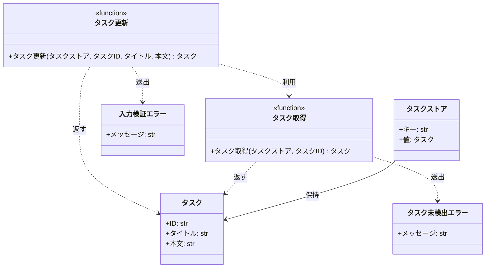

# モジュール構成: バックエンド / タスク

`タスク` ドメイン（バックエンド側）に属する構成要素詳細。

- 対応テストファイル: -

## 一覧

| ユースケース | 役割 | コンテナ | 種別 | 名前 | 概要 | 補足 |
| --- | --- | --- | --- | --- | --- | --- |
| 共通 | ドメインモデル | `src/tasks/models.py` | データモデル | [`Task`](#タスク) | タスク 1 件 | - |
| 共通 | ストア型 | `src/tasks/models.py` | データモデル | [`TaskStore`](#タスクストア) | タスク ID をキーにした保持領域 | 型エイリアス |
| 共通 | 例外 | `src/tasks/errors.py` | クラス | [`TaskNotFoundError`](#タスク未検出エラー) | 指定 ID のタスクが存在しない | - |
| 共通 | 例外 | `src/tasks/errors.py` | クラス | [`ValidationError`](#入力検証エラー) | 入力値が制約を満たさない | - |
| タスク更新 | 定数 | `src/tasks/service.py` | 定数 | `TITLE_MIN_LENGTH` | タイトルの最小文字数（1） | - |
| タスク更新 | 定数 | `src/tasks/service.py` | 定数 | `TITLE_MAX_LENGTH` | タイトルの最大文字数（100） | - |
| タスク更新 | 定数 | `src/tasks/service.py` | 定数 | `CONTENT_MAX_LENGTH` | 本文の最大文字数（1000） | - |
| タスク更新 | 取得 | `src/tasks/service.py` | 関数 | [`get_task`](#タスク取得) | ストアからタスクを 1 件取得 | - |
| タスク更新 | サービス | `src/tasks/service.py` | 関数 | [`update_task`](#タスク更新) | タイトルと本文を更新して返す | - |

## ディレクトリ構成

```
src/tasks/
├── models.py    # Task / TaskStore
├── errors.py    # TaskNotFoundError / ValidationError
└── service.py   # 検証の定数と get_task / update_task
```

## 構成図



## タスク
> 物理名: `Task`<br>
> 種別: データモデル<br>
> コンテナ: `src/tasks/models.py`

タスク 1 件。

### プロパティ

| 論理名 | プロパティ名 | 型 | 可視性 | デフォルト | 説明 | 例 | 補足 |
| --- | --- | --- | --- | --- | --- | --- | --- |
| ID | `id` | `str` | 公開 | - | タスクの一意 ID | `"task_01"` | 更新できない |
| タイトル | `title` | `str` | 公開 | - | タスクのタイトル | `"決算資料の作成"` | 1 文字以上 100 文字以内 |
| 本文 | `content` | `str` | 公開 | `""` | タスクの本文 | `"四半期の売上を集計する"` | 1000 文字以内 |

### メソッド

なし

### 単体テスト

なし

### 補足

- 不変オブジェクトとして扱い、更新は差し替えた新しいインスタンスで表す

## タスクストア
> 物理名: `TaskStore`<br>
> 種別: データモデル<br>
> コンテナ: `src/tasks/models.py`

タスク ID をキーにして [タスク](#タスク) を保持する領域（`dict[str, Task]` の型エイリアス）。

### プロパティ

| 論理名 | プロパティ名 | 型 | 可視性 | デフォルト | 説明 | 例 | 補足 |
| --- | --- | --- | --- | --- | --- | --- | --- |
| キー | - | `str` | 公開 | - | タスクの一意 ID | `"task_01"` | [`Task.id`](#タスク) と同じ値 |
| 値 | - | [`Task`](#タスク) | 公開 | - | 保持しているタスク | - | - |

### メソッド

なし

### 単体テスト

なし

### 補足

- 永続化層を持たないため、プロセス内の辞書をそのまま保持領域として扱う

## タスク未検出エラー
> 物理名: `TaskNotFoundError`<br>
> 種別: クラス<br>
> コンテナ: `src/tasks/errors.py`

指定 ID のタスクが存在しないときに送出する例外。
インターフェース境界では `404` に対応させる。

### プロパティ

| 論理名 | プロパティ名 | 型 | 可視性 | デフォルト | 説明 | 例 | 補足 |
| --- | --- | --- | --- | --- | --- | --- | --- |
| メッセージ | `args[0]` | `str` | 公開 | - | 例外メッセージ | `"タスクが見つかりません: task_99"` | `Exception` の標準の持ち方 |

### メソッド

なし

### 単体テスト

なし

## 入力検証エラー
> 物理名: `ValidationError`<br>
> 種別: クラス<br>
> コンテナ: `src/tasks/errors.py`

入力値が制約を満たさないときに送出する例外。
インターフェース境界では `400` に対応させる。

### プロパティ

| 論理名 | プロパティ名 | 型 | 可視性 | デフォルト | 説明 | 例 | 補足 |
| --- | --- | --- | --- | --- | --- | --- | --- |
| メッセージ | `args[0]` | `str` | 公開 | - | 例外メッセージ | `"title は 1 文字以上 100 文字以内です"` | `Exception` の標準の持ち方 |

### メソッド

なし

### 単体テスト

なし

## `src/tasks/service.py`
> 種別: ファイル

タスクの取得と更新のドメインロジックを束ねる関数ファイル。
文字数の上下限は本ファイルのモジュール定数（`TITLE_MIN_LENGTH` / `TITLE_MAX_LENGTH` / `CONTENT_MAX_LENGTH`）で持つ。

---

### タスク取得
> 物理名: `get_task`<br>
> 種別: 関数

ストアからタスクを 1 件取得する。

#### 引数

| 論理名 | 引数名 | 型 | 必須 | デフォルト | 説明 | 補足 |
| --- | --- | --- | --- | --- | --- | --- |
| タスクストア | `store` | [`TaskStore`](#タスクストア) | ✅ | - | 取得元の保持領域 | - |
| タスク ID | `task_id` | `str` | ✅ | - | 取得対象のタスク ID | - |

引数例:

```python
get_task(store, "task_01")
```

#### 戻り値

| 型 | 説明 | 補足 |
| --- | --- | --- |
| [`Task`](#タスク) | 取得したタスク | - |

戻り値例:

```python
Task(id="task_01", title="決算資料の作成", content="四半期の売上を集計する")
```

#### 処理

1. `task_id` がストアに登録されているかを確認する
   - 登録されていない場合、`TaskNotFoundError` を投げる
2. 該当のタスクを返す

#### 例外

| 例外名 | 発生条件 | メッセージ | 補足 |
| --- | --- | --- | --- |
| `TaskNotFoundError` | `task_id` がストアに存在しない | `"タスクが見つかりません: {task_id}"` | - |

#### 単体テスト

セットアップ:

| セットアップ | 説明 | 補足 |
| --- | --- | --- |
| タスクストア | `task_01` を 1 件だけ登録した辞書 | `store` fixture |

| テスト名 | 正常/異常 | 概要 | 条件 | Mock | 期待値 | 補足 |
| --- | --- | --- | --- | --- | --- | --- |
| `test_get_task` | 正常 | 登録済み ID で取得できる | `task_id` に `task_01` を渡す | なし | 登録した `Task` を返す | - |
| `test_get_task_when_task_missing` | 異常 | 未登録 ID で取得できない | `task_id` に `task_99` を渡す | なし | `TaskNotFoundError` を送出 | 例外表「`task_id` がストアに存在しない」に対応 |

---

### タスク更新
> 物理名: `update_task`<br>
> 種別: 関数

登録済みタスクのタイトルと本文を更新し、更新後のタスクを返す。

#### 引数

| 論理名 | 引数名 | 型 | 必須 | デフォルト | 説明 | 補足 |
| --- | --- | --- | --- | --- | --- | --- |
| タスクストア | `store` | [`TaskStore`](#タスクストア) | ✅ | - | 更新対象を保持する領域 | 更新結果を書き戻す |
| タスク ID | `task_id` | `str` | ✅ | - | 更新対象のタスク ID | - |
| タイトル | `title` | `str` | ✅ | - | 更新後のタイトル | キーワード専用引数 |
| 本文 | `content` | `str \| None` | - | `None` | 更新後の本文 | キーワード専用引数。`None` は更新前の本文を維持 |

引数例:

```python
update_task(store, "task_01", title="決算資料の作成", content="四半期の売上を集計する")
```

#### 戻り値

| 型 | 説明 | 補足 |
| --- | --- | --- |
| [`Task`](#タスク) | 更新後のタスク | ストアに保存済みのインスタンスと同一 |

戻り値例:

```python
Task(id="task_01", title="決算資料の作成", content="四半期の売上を集計する")
```

#### 処理

1. タイトルの文字数を検証する
   - `TITLE_MIN_LENGTH` 未満 or `TITLE_MAX_LENGTH` 超の場合、`ValidationError` を投げる
2. 本文の文字数を検証する
   - `content` が `None` の場合、検証しない（更新前の本文を引き継ぐため）
   - `CONTENT_MAX_LENGTH` 超の場合、`ValidationError` を投げる
3. 更新対象のタスクを取得する（[タスク取得](#タスク取得)）
4. 更新後の本文を確定する
   - `content` が `None` の場合、取得したタスクの本文を使う
   - `content` が `None` でない場合、その値を使う
5. ID を引き継いだ新しいタスクを作り、ストアへ書き戻して返す

#### 例外

| 例外名 | 発生条件 | メッセージ | 補足 |
| --- | --- | --- | --- |
| `ValidationError` | `title` が `TITLE_MIN_LENGTH` 未満 or `TITLE_MAX_LENGTH` 超 | `"title は 1 文字以上 100 文字以内です"` | - |
| `ValidationError` | `content` が `CONTENT_MAX_LENGTH` 超 | `"content は 1000 文字以内です"` | - |
| `TaskNotFoundError` | `task_id` がストアに存在しない | `"タスクが見つかりません: {task_id}"` | [タスク取得](#タスク取得) から伝播 |

#### 単体テスト

セットアップ:

| セットアップ | 説明 | 補足 |
| --- | --- | --- |
| タスクストア | `task_01` をタイトル・本文とも設定済みで 1 件登録した辞書 | `store` fixture |

| テスト名 | 正常/異常 | 概要 | 条件 | Mock | 期待値 | 補足 |
| --- | --- | --- | --- | --- | --- | --- |
| `test_update_task` | 正常 | タイトルと本文を更新できる | `title` と `content` の両方を渡す | なし | 渡した値の `Task` を返し、ストアも置き換わる | - |
| `test_update_task_when_content_omitted` | 正常 | 本文を省略すると更新前の値を維持する | `content` を渡さない | なし | 本文が更新前のままの `Task` を返す | 処理ステップ 4 の分岐に対応 |
| `test_update_task_when_title_empty` | 異常 | 空のタイトルを弾く | `title` に `""` を渡す | なし | `ValidationError` を送出し、ストアは不変 | 例外表「`title` が下限未満」に対応 |
| `test_update_task_when_title_too_long` | 異常 | 上限超のタイトルを弾く | `title` に 101 文字を渡す | なし | `ValidationError` を送出し、ストアは不変 | 例外表「`title` が上限超」に対応 |
| `test_update_task_when_content_too_long` | 異常 | 上限超の本文を弾く | `content` に 1001 文字を渡す | なし | `ValidationError` を送出し、ストアは不変 | 例外表「`content` が上限超」に対応 |
| `test_update_task_when_task_missing` | 異常 | 未登録 ID を更新できない | `task_id` に `task_99` を渡す | なし | `TaskNotFoundError` を送出し、ストアは不変 | [タスク取得](#タスク取得) からの伝播を代表で確認 |

### 補足

- 検証はタスクを取得する前に行い、存在しないタスクでも入力エラーを先に返す
