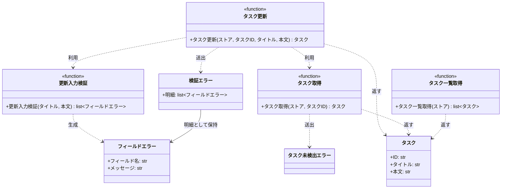

# モジュール構成: バックエンド / タスク

`タスク` ドメイン（バックエンド側）に属する構成要素詳細。

- 対応テストファイル: 未記入

## 一覧

| ユースケース | 役割 | コンテナ | 種別 | 名前 | 概要 | 補足 |
| --- | --- | --- | --- | --- | --- | --- |
| 共通 | ドメインモデル | `src/tasks/models.py` | データモデル | [`Task`](#タスク) | タスク 1 件 | - |
| 共通 | エラー明細 | `src/tasks/errors.py` | データモデル | [`FieldError`](#フィールドエラー) | 検証違反 1 件のフィールドと理由 | - |
| 共通 | 例外 | `src/tasks/errors.py` | クラス | [`ValidationError`](#検証エラー) | 入力値が制約を満たさない | フィールド単位の明細を持つ |
| 共通 | 例外 | `src/tasks/errors.py` | クラス | [`TaskNotFoundError`](#タスク未検出エラー) | 指定 ID のタスクが存在しない | - |
| 共通 | 定数 | `src/tasks/service.py` | 定数 | `TITLE_MIN_LENGTH` | タイトルの最小文字数 | 値: `1` |
| 共通 | 定数 | `src/tasks/service.py` | 定数 | `TITLE_MAX_LENGTH` | タイトルの最大文字数 | 値: `100` |
| 共通 | 定数 | `src/tasks/service.py` | 定数 | `CONTENT_MAX_LENGTH` | 本文の最大文字数 | 値: `1000` |
| 共通 | クエリ | `src/tasks/service.py` | 関数 | [`get_task`](#タスク取得) | ストアからタスクを 1 件取得する | - |
| 共通 | クエリ | `src/tasks/service.py` | 関数 | [`list_tasks`](#タスク一覧取得) | ストアのタスクを ID 順で一覧にする | 更新結果の一覧反映の確認に使う |
| タスク更新 | バリデータ | `src/tasks/service.py` | 関数 | [`_validate_update_input`](#更新入力検証) | タイトルと本文の違反を全件集める | 内部関数 |
| タスク更新 | サービス | `src/tasks/service.py` | 関数 | [`update_task`](#タスク更新) | 登録済みタスクのタイトルと本文を更新する | - |

## ディレクトリ構成

```
src/tasks/
├── models.py    # Task
├── errors.py    # FieldError / ValidationError / TaskNotFoundError
└── service.py   # 文字数の定数 / get_task / list_tasks / _validate_update_input / update_task
```

## 構成図



## タスク
> 物理名: `Task`<br>
> 種別: データモデル<br>
> コンテナ: `src/tasks/models.py`

タスク 1 件。

### プロパティ

| 論理名 | プロパティ名 | 型 | 可視性 | デフォルト | 説明 | 例 | 補足 |
| --- | --- | --- | --- | --- | --- | --- | --- |
| ID | `id` | `str` | 公開 | - | タスクの一意な識別子 | `"t1"` | 更新では変更しない |
| タイトル | `title` | `str` | 公開 | - | タスク名 | `"決算資料の作成"` | - |
| 本文 | `content` | `str` | 公開 | `""` | タスクの説明 | `"四半期分の売上をまとめる"` | - |

### メソッド

なし

### 単体テスト

なし

## フィールドエラー
> 物理名: `FieldError`<br>
> 種別: データモデル<br>
> コンテナ: `src/tasks/errors.py`

検証違反 1 件を、どのフィールドがなぜ弾かれたかの組で表す。

### プロパティ

| 論理名 | プロパティ名 | 型 | 可視性 | デフォルト | 説明 | 例 | 補足 |
| --- | --- | --- | --- | --- | --- | --- | --- |
| フィールド名 | `field` | `Literal["title", "content"]` | 公開 | - | 違反したリクエストのフィールド名 | `"title"` | 画面のインライン表示位置の決定に使う |
| メッセージ | `message` | `str` | 公開 | - | 違反理由の表示文 | `"タイトルは 1 文字以上 100 文字以内で入力してください"` | そのまま画面に出す前提 |

### メソッド

なし

### 単体テスト

なし

## 検証エラー
> 物理名: `ValidationError`<br>
> 種別: クラス<br>
> コンテナ: `src/tasks/errors.py`

入力値が制約を満たさないときに送出する例外。
違反したフィールドの明細を全件保持する。

### プロパティ

| 論理名 | プロパティ名 | 型 | 可視性 | デフォルト | 説明 | 例 | 補足 |
| --- | --- | --- | --- | --- | --- | --- | --- |
| 明細 | `errors` | [`list[FieldError]`](#フィールドエラー) | 公開 | - | 検出した違反の全件 | `[FieldError(field="title", ...)]` | 1 件以上が入る |

### 初期化

> 物理名: `__init__`<br>
> 種別: メソッド

明細を受け取り、明細のメッセージを連結した文字列を例外メッセージにする。

#### 引数

| 論理名 | 引数名 | 型 | 必須 | デフォルト | 説明 | 補足 |
| --- | --- | --- | --- | --- | --- | --- |
| 明細 | `errors` | [`list[FieldError]`](#フィールドエラー) | ✅ | - | 検出した違反の全件 | 空リストは渡さない |

引数例:

```python
raise ValidationError([FieldError(field="title", message="タイトルは 1 文字以上 100 文字以内で入力してください")])
```

#### 戻り値

| 型 | 説明 | 補足 |
| --- | --- | --- |
| `None` | なし | - |

#### 処理

1. 明細を `errors` に保持する
2. 明細のメッセージを ` / ` で連結し、基底クラスの例外メッセージにする

#### 例外

なし

#### 単体テスト

| テスト名 | 正常/異常 | 概要 | 条件 | Mock | 期待値 | 補足 |
| --- | --- | --- | --- | --- | --- | --- |
| `test_validation_error_init` | 正常 | 明細を保持し例外メッセージを組み立てる | 明細 2 件で生成 | なし | `errors` が 2 件で、`str()` が 2 件のメッセージを ` / ` で連結した文字列になる | - |

### 実装

なし

## タスク未検出エラー
> 物理名: `TaskNotFoundError`<br>
> 種別: クラス<br>
> コンテナ: `src/tasks/errors.py`

指定 ID のタスクが存在しないときに送出する例外。

### プロパティ

なし

### メソッド

なし

### 単体テスト

なし

## `src/tasks/service.py`
> 種別: ファイル

タスクの取得 / 更新 / 一覧のドメインロジックを束ねる関数ファイル。
タスクの保管先はモジュール内に閉じず、呼び出し元が渡す `dict[str, Task]`（タスクストア）で受ける。

---

### タスク取得
> 物理名: `get_task`<br>
> 種別: 関数

ストアからタスクを 1 件取得する。

#### 引数

| 論理名 | 引数名 | 型 | 必須 | デフォルト | 説明 | 補足 |
| --- | --- | --- | --- | --- | --- | --- |
| ストア | `store` | [`dict[str, Task]`](#タスク) | ✅ | - | タスク ID をキーにしたタスクの保管先 | - |
| タスク ID | `task_id` | `str` | ✅ | - | 取得対象のタスク ID | - |

引数例:

```python
get_task({"t1": Task(id="t1", title="旧タイトル")}, "t1")
```

#### 戻り値

| 型 | 説明 | 補足 |
| --- | --- | --- |
| [`Task`](#タスク) | 取得したタスク | - |

戻り値例:

```python
Task(id="t1", title="旧タイトル", content="旧本文")
```

#### 処理

1. ストアに `task_id` があるかを確かめる
   - 無い場合、`TaskNotFoundError` を投げる
2. ストアから取り出したタスクを返す

#### 例外

| 例外名 | 発生条件 | メッセージ | 補足 |
| --- | --- | --- | --- |
| `TaskNotFoundError` | ストアに `task_id` のキーが無い | `"task not found: {task_id}"` | - |

#### 単体テスト

| テスト名 | 正常/異常 | 概要 | 条件 | Mock | 期待値 | 補足 |
| --- | --- | --- | --- | --- | --- | --- |
| `test_get_task` | 正常 | 登録済み ID でタスクを取得 | `t1` を登録済みのストアに `task_id="t1"` | なし | 登録した `Task` を返す | - |
| `test_get_task_when_task_missing` | 異常 | 未登録 ID | `task_id="missing"` | なし | `TaskNotFoundError` を送出 | 例外表「`task_id` のキーが無い」に対応 |

---

### タスク一覧取得
> 物理名: `list_tasks`<br>
> 種別: 関数

ストアのタスクを ID 順で一覧にする。

#### 引数

| 論理名 | 引数名 | 型 | 必須 | デフォルト | 説明 | 補足 |
| --- | --- | --- | --- | --- | --- | --- |
| ストア | `store` | [`dict[str, Task]`](#タスク) | ✅ | - | タスク ID をキーにしたタスクの保管先 | - |

引数例:

```python
list_tasks({"t2": Task(id="t2", title="B"), "t1": Task(id="t1", title="A")})
```

#### 戻り値

| 型 | 説明 | 補足 |
| --- | --- | --- |
| [`list[Task]`](#タスク) | ID の昇順に並べたタスク | 空ストアでは空リスト |

戻り値例:

```python
[Task(id="t1", title="A", content=""), Task(id="t2", title="B", content="")]
```

#### 処理

1. ストアのキーを昇順に並べ、その順でタスクを取り出したリストを返す

#### 例外

なし

#### 単体テスト

| テスト名 | 正常/異常 | 概要 | 条件 | Mock | 期待値 | 補足 |
| --- | --- | --- | --- | --- | --- | --- |
| `test_list_tasks` | 正常 | ID の昇順で並べ替える | 挿入順が `t2` → `t1` のストア | なし | `t1` → `t2` の順のリストを返す | - |
| `test_list_tasks_when_store_empty` | 正常 | 空ストア | 空の dict | なし | 空リストを返す | - |

---

### 更新入力検証
> 物理名: `_validate_update_input`<br>
> 種別: 関数

タイトルと本文を検証し、違反を全件集めて返す。
違反が見つかっても打ち切らず、両フィールドを最後まで検証する。

#### 引数

| 論理名 | 引数名 | 型 | 必須 | デフォルト | 説明 | 補足 |
| --- | --- | --- | --- | --- | --- | --- |
| タイトル | `title` | `str` | ✅ | - | 更新後のタスク名 | - |
| 本文 | `content` | `str` | ✅ | - | 更新後のタスク本文 | 呼び出し元でデフォルト適用済み |

引数例:

```python
_validate_update_input("新タイトル", "新本文")
```

#### 戻り値

| 型 | 説明 | 補足 |
| --- | --- | --- |
| [`list[FieldError]`](#フィールドエラー) | 検出した違反の全件 | 違反なしでは空リスト |

戻り値例:

```python
[FieldError(field="title", message="タイトルは 1 文字以上 100 文字以内で入力してください")]
```

#### 処理

1. 空の明細リストを用意する
2. タイトルの文字数が `TITLE_MIN_LENGTH` 以上 `TITLE_MAX_LENGTH` 以下かを確かめる
   - 範囲外の場合、`title` の明細を追加する
3. 本文の文字数が `CONTENT_MAX_LENGTH` 以下かを確かめる
   - 超過の場合、`content` の明細を追加する
4. 明細リストを返す

#### 例外

なし

#### 単体テスト

| テスト名 | 正常/異常 | 概要 | 条件 | Mock | 期待値 | 補足 |
| --- | --- | --- | --- | --- | --- | --- |
| `test_validate_update_input` | 正常 | 違反なし | タイトル 1 文字以上 100 文字以内・本文 1000 文字以内 | なし | 空リストを返す | - |
| `test_validate_update_input_when_title_empty` | 正常 | タイトルが空 | `title=""` | なし | `title` の明細 1 件を返す | - |
| `test_validate_update_input_when_title_too_long` | 正常 | タイトルが上限超過 | `title` が 101 文字 | なし | `title` の明細 1 件を返す | - |
| `test_validate_update_input_when_content_too_long` | 正常 | 本文が上限超過 | `content` が 1001 文字 | なし | `content` の明細 1 件を返す | - |
| `test_validate_update_input_when_both_invalid` | 正常 | 両フィールドが違反 | `title=""` かつ `content` が 1001 文字 | なし | `title` と `content` の明細 2 件を返す | 打ち切らず全件集めることの確認 |

---

### タスク更新
> 物理名: `update_task`<br>
> 種別: 関数

登録済みタスクのタイトルと本文を更新して返す。

#### 引数

| 論理名 | 引数名 | 型 | 必須 | デフォルト | 説明 | 補足 |
| --- | --- | --- | --- | --- | --- | --- |
| ストア | `store` | [`dict[str, Task]`](#タスク) | ✅ | - | タスク ID をキーにしたタスクの保管先 | 更新結果を書き戻す |
| タスク ID | `task_id` | `str` | ✅ | - | 更新対象のタスク ID | - |
| タイトル | `title` | `str` | ✅ | - | 更新後のタスク名 | - |
| 本文 | `content` | `str` | - | `""` | 更新後のタスク本文 | 省略すると本文が空になる |

引数例:

```python
update_task({"t1": Task(id="t1", title="旧タイトル")}, "t1", "新タイトル", "新本文")
```

#### 戻り値

| 型 | 説明 | 補足 |
| --- | --- | --- |
| [`Task`](#タスク) | 更新後のタスク | ストアに書き戻した値と同一 |

戻り値例:

```python
Task(id="t1", title="新タイトル", content="新本文")
```

#### 処理

1. タイトルと本文を検証する（[更新入力検証](#更新入力検証)）
   - 明細が 1 件以上の場合、その明細を持つ `ValidationError` を投げる
2. 対象タスクを取得する（[タスク取得](#タスク取得)）
3. 更新後のタスクを組み立ててストアに書き戻し、そのタスクを返す

#### 例外

| 例外名 | 発生条件 | メッセージ | 補足 |
| --- | --- | --- | --- |
| `ValidationError` | 検証で 1 件以上の違反を検出 | 明細のメッセージを ` / ` で連結した文字列 | 明細は [`FieldError`](#フィールドエラー) の全件 |
| `TaskNotFoundError` | ストアに `task_id` のキーが無い | `"task not found: {task_id}"` | [タスク取得](#タスク取得) から伝播する |

#### 単体テスト

| テスト名 | 正常/異常 | 概要 | 条件 | Mock | 期待値 | 補足 |
| --- | --- | --- | --- | --- | --- | --- |
| `test_update_task` | 正常 | タイトルと本文を更新 | `t1` を登録済みのストアに新しいタイトルと本文 | なし | 更新後の `Task` を返し、ストアの `t1` も置き換わる | - |
| `test_update_task_when_content_omitted` | 正常 | 本文を省略 | 本文引数を渡さない | なし | 本文が `""` の `Task` を返し、ストアの本文も `""` になる | - |
| `test_update_task_when_title_empty` | 異常 | タイトルが空 | `title=""` | なし | `ValidationError` を送出し、明細が `title` 1 件・ストアは不変 | 例外表「1 件以上の違反を検出」に対応 |
| `test_update_task_when_title_too_long` | 異常 | タイトルが上限超過 | `title` が 101 文字 | なし | `ValidationError` を送出し、明細が `title` 1 件 | 例外表「1 件以上の違反を検出」に対応 |
| `test_update_task_when_content_too_long` | 異常 | 本文が上限超過 | `content` が 1001 文字 | なし | `ValidationError` を送出し、明細が `content` 1 件 | 例外表「1 件以上の違反を検出」に対応 |
| `test_update_task_when_both_invalid` | 異常 | 両フィールドが違反 | `title=""` かつ `content` が 1001 文字 | なし | `ValidationError` を送出し、明細が 2 件 | 打ち切らず全件返すことの確認 |
| `test_update_task_when_task_missing` | 異常 | 未登録 ID | `task_id="missing"` に有効なタイトル | なし | `TaskNotFoundError` を送出し、ストアに新規タスクが作られない | 例外表「[タスク取得](#タスク取得) から伝播」の代表確認 |

---

### 補足

- 文字数の上限は業務ルールであって環境で変える値ではないため、設定ファイルではなくモジュール定数に置く
- 検証を対象タスクの取得より先に行うため、未登録 ID と入力違反が同時に起きた入力では検証エラーだけが返る
