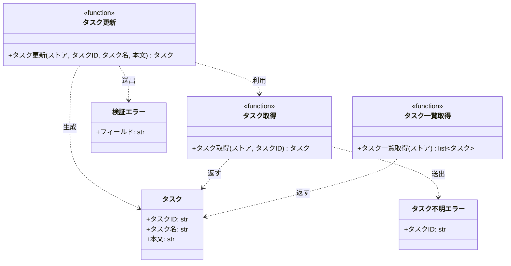

# モジュール構成: バックエンド / タスク

`タスク` ドメイン（バックエンド側）に属する構成要素詳細。

- 対応テストファイル: -

## 一覧

| ユースケース | 役割 | コンテナ | 種別 | 名前 | 概要 | 補足 |
| --- | --- | --- | --- | --- | --- | --- |
| 共通 | ドメインモデル | `tasks/models.py` | データモデル | [`Task`](#タスク) | タスク 1 件 | - |
| 共通 | ドメイン例外 | `tasks/errors.py` | クラス | [`TaskNotFoundError`](#タスク不明エラー) | 指定 ID のタスクが存在しない | - |
| 共通 | ドメイン例外 | `tasks/errors.py` | クラス | [`ValidationError`](#検証エラー) | 入力値が制約を満たさない | 失敗した項目名を持つ |
| 共通 | クエリ | `tasks/service.py` | 関数 | [`get_task`](#タスク取得) | ストアからタスクを 1 件取得する | - |
| 共通 | クエリ | `tasks/service.py` | 関数 | [`list_tasks`](#タスク一覧取得) | ストアの全タスクを登録順で返す | 編集結果を一覧へ反映する複合 UC で使う |
| タスク編集 | 定数 | `tasks/constants.py` | 定数 | `TITLE_MAX_LENGTH` | タスク名の最大文字数 | `100` |
| タスク編集 | 定数 | `tasks/constants.py` | 定数 | `CONTENT_MAX_LENGTH` | 本文の最大文字数 | `1000` |
| タスク編集 | サービス | `tasks/service.py` | 関数 | [`update_task`](#タスク更新) | タスクのタイトルと本文を更新する | 検証をこの関数に集約する |

## ディレクトリ構成

```
src/tasks/
├── models.py        # Task
├── errors.py        # TaskNotFoundError / ValidationError
├── constants.py     # タスク名・本文の最大文字数
└── service.py       # get_task / list_tasks / update_task
```

## 構成図



## タスク
> 物理名: `Task`<br>
> 種別: データモデル<br>
> コンテナ: `tasks/models.py`

タスク 1 件を表す不変のドメインモデル。

### プロパティ

| 論理名 | プロパティ名 | 型 | 可視性 | デフォルト | 説明 | 例 | 補足 |
| --- | --- | --- | --- | --- | --- | --- | --- |
| タスク ID | `id` | `str` | public | - | タスクの一意識別子 | `"t1"` | ストアのキーと一致させる |
| タスク名 | `title` | `str` | public | - | 一覧と編集画面に出す表示名 | `"新タイトル"` | - |
| 本文 | `content` | `str` | public | `""` | タスクの詳細 | `"新本文"` | - |

### メソッド

なし

### 単体テスト

なし

### 補足

- `@dataclass(frozen=True, slots=True, kw_only=True)` の不変オブジェクトにする
- 更新は既存インスタンスの書き換えではなく、新しいインスタンスを作ってストアの値を置き換えることで行う（[タスク更新](#タスク更新)）

## タスク不明エラー
> 物理名: `TaskNotFoundError`<br>
> 種別: クラス<br>
> コンテナ: `tasks/errors.py`

指定 ID のタスクがストアに存在しないことを表す例外。

### プロパティ

なし

### メソッド

なし

### 単体テスト

なし

## 検証エラー
> 物理名: `ValidationError`<br>
> 種別: クラス<br>
> コンテナ: `tasks/errors.py`

入力値が制約を満たさないことを表す例外。
どの項目で失敗したかを呼び出し元がフィールド単位で判別できるようにする。

### プロパティ

| 論理名 | プロパティ名 | 型 | 可視性 | デフォルト | 説明 | 例 | 補足 |
| --- | --- | --- | --- | --- | --- | --- | --- |
| フィールド | `field` | `Literal["title", "content"]` | public | - | 検証に失敗した項目名 | `"title"` | 検証対象が増えたらリテラルを追加する |

### 初期化
> 物理名: `__init__`<br>
> 種別: メソッド

メッセージと失敗した項目名を受け取る。

#### 引数

| 論理名 | 引数名 | 型 | 必須 | デフォルト | 説明 | 補足 |
| --- | --- | --- | --- | --- | --- | --- |
| メッセージ | `message` | `str` | ✅ | - | 失敗の内容を説明する文言 | 画面にそのまま出せる日本語 |
| フィールド | `field` | `Literal["title", "content"]` | ✅ | - | 検証に失敗した項目名 | キーワード引数で受ける |

引数例:

```python
raise ValidationError("タスク名を入力してください", field="title")
```

#### 戻り値

| 型 | 説明 | 補足 |
| --- | --- | --- |
| `None` | なし | - |

#### 処理

1. 基底クラスの初期化にメッセージを渡す
2. フィールドを自身のプロパティに保持する

#### 例外

なし

#### 単体テスト

| テスト名 | 正常/異常 | 概要 | 条件 | Mock | 期待値 | 補足 |
| --- | --- | --- | --- | --- | --- | --- |
| `test_validation_error` | 正常 | メッセージと項目名を保持する | `message` と `field` を渡して生成 | なし | `str()` がメッセージを返し、`field` が渡した値になる | - |

### 補足

- 送出箇所は [タスク更新](#タスク更新) のみ。検証を行う関数が増えたら同じ例外を使い回す

## `tasks/service.py`
> 種別: ファイル

タスクの取得・一覧・更新を提供する関数ファイル。
ストアは呼び出し側が保持する `dict[str, Task]` を引数で受け取り、この層では生成も破棄もしない。

### タスク取得
> 物理名: `get_task`<br>
> 種別: 関数

ストアからタスクを 1 件取得する。

#### 引数

| 論理名 | 引数名 | 型 | 必須 | デフォルト | 説明 | 補足 |
| --- | --- | --- | --- | --- | --- | --- |
| ストア | `store` | `dict[str, `[`Task`](#タスク)`]` | ✅ | - | タスクを保持するインメモリのストア | キーはタスク ID |
| タスク ID | `task_id` | `str` | ✅ | - | 取得対象のタスク ID | - |

引数例:

```python
get_task(store, "t1")
```

#### 戻り値

| 型 | 説明 | 補足 |
| --- | --- | --- |
| [`Task`](#タスク) | 該当するタスク | ストアに入っているインスタンスをそのまま返す |

戻り値例:

```python
Task(id="t1", title="旧タイトル", content="旧本文")
```

#### 処理

1. `task_id` がストアに存在するかを確認する
   - 存在しない場合、[`TaskNotFoundError`](#タスク不明エラー) を送出する
2. 該当するタスクを返す

#### 例外

| 例外名 | 発生条件 | メッセージ | 補足 |
| --- | --- | --- | --- |
| `TaskNotFoundError` | `task_id` がストアに存在しない | `"task not found: {task_id}"` | - |

#### 単体テスト

セットアップ:

| セットアップ | 説明 | 補足 |
| --- | --- | --- |
| ストア | `t1` のタスクを 1 件だけ入れた辞書を作る | 物理名 `_store` |

| テスト名 | 正常/異常 | 概要 | 条件 | Mock | 期待値 | 補足 |
| --- | --- | --- | --- | --- | --- | --- |
| `test_get_task` | 正常 | 登録済みの ID でタスクを取得 | `t1` を指定 | なし | 登録した `Task` を返す | - |
| `test_get_task_when_task_missing` | 異常 | 未登録の ID を指定 | `missing` を指定 | なし | `TaskNotFoundError` を送出 | 例外表「`task_id` がストアに存在しない」に対応 |

### タスク一覧取得
> 物理名: `list_tasks`<br>
> 種別: 関数

ストアの全タスクを登録順で返す。

#### 引数

| 論理名 | 引数名 | 型 | 必須 | デフォルト | 説明 | 補足 |
| --- | --- | --- | --- | --- | --- | --- |
| ストア | `store` | `dict[str, `[`Task`](#タスク)`]` | ✅ | - | タスクを保持するインメモリのストア | キーはタスク ID |

引数例:

```python
list_tasks(store)
```

#### 戻り値

| 型 | 説明 | 補足 |
| --- | --- | --- |
| `list[`[`Task`](#タスク)`]` | 登録順に並べたタスクの一覧 | 空ストアでは空リスト |

戻り値例:

```python
[Task(id="t1", title="新タイトル", content="新本文")]
```

#### 処理

1. ストアの値を登録順のリストにして返す

#### 例外

なし

#### 単体テスト

セットアップ:

| セットアップ | 説明 | 補足 |
| --- | --- | --- |
| ストア | `t1` のタスクを 1 件だけ入れた辞書を作る | 物理名 `_store` |

| テスト名 | 正常/異常 | 概要 | 条件 | Mock | 期待値 | 補足 |
| --- | --- | --- | --- | --- | --- | --- |
| `test_list_tasks` | 正常 | 登録済みのタスクを一覧で返す | `t1` を含むストアを渡す | なし | 登録した `Task` を 1 件含むリストを返す | - |
| `test_list_tasks_when_store_empty` | 正常 | ストアが空 | 空の辞書を渡す | なし | 空リストを返す | - |

### タスク更新
> 物理名: `update_task`<br>
> 種別: 関数

登録済みタスクのタイトルと本文を更新し、更新後のタスクを返す。

#### 引数

| 論理名 | 引数名 | 型 | 必須 | デフォルト | 説明 | 補足 |
| --- | --- | --- | --- | --- | --- | --- |
| ストア | `store` | `dict[str, `[`Task`](#タスク)`]` | ✅ | - | タスクを保持するインメモリのストア | 更新結果をここに書き戻す |
| タスク ID | `task_id` | `str` | ✅ | - | 更新対象のタスク ID | - |
| タスク名 | `title` | `str` | ✅ | - | 更新後のタスク名 | 1 文字以上 `TITLE_MAX_LENGTH` 以内 |
| 本文 | `content` | `str` | - | `""` | 更新後の本文 | `CONTENT_MAX_LENGTH` 以内 |

引数例:

```python
update_task(store, "t1", "新タイトル", "新本文")
```

#### 戻り値

| 型 | 説明 | 補足 |
| --- | --- | --- |
| [`Task`](#タスク) | 更新後のタスク | ストアに書き戻したものと同一のインスタンス |

戻り値例:

```python
Task(id="t1", title="新タイトル", content="新本文")
```

#### 処理

1. 更新対象のタスクを取得する（[タスク取得](#タスク取得)）
2. タスク名を検証する
   - 空文字の場合、[`ValidationError`](#検証エラー)（`field` は `title`）を送出する
   - `TITLE_MAX_LENGTH` を超える場合、[`ValidationError`](#検証エラー)（`field` は `title`）を送出する
3. 本文を検証する
   - `CONTENT_MAX_LENGTH` を超える場合、[`ValidationError`](#検証エラー)（`field` は `content`）を送出する
4. 更新後の値を持つ [`Task`](#タスク) を組み立ててストアの該当キーを置き換え、組み立てたタスクを返す

#### 例外

| 例外名 | 発生条件 | メッセージ | 補足 |
| --- | --- | --- | --- |
| `TaskNotFoundError` | `task_id` がストアに存在しない | `"task not found: {task_id}"` | [タスク取得](#タスク取得) から伝播する |
| `ValidationError` | `title` が空文字 | `"タスク名を入力してください"` | `field` は `title` |
| `ValidationError` | `title` が `TITLE_MAX_LENGTH` を超える | `"タスク名は 100 文字以内で入力してください"` | `field` は `title` |
| `ValidationError` | `content` が `CONTENT_MAX_LENGTH` を超える | `"本文は 1000 文字以内で入力してください"` | `field` は `content` |

#### 単体テスト

セットアップ:

| セットアップ | 説明 | 補足 |
| --- | --- | --- |
| ストア | `t1` のタスクを 1 件だけ入れた辞書を作る | 物理名 `_store` |

| テスト名 | 正常/異常 | 概要 | 条件 | Mock | 期待値 | 補足 |
| --- | --- | --- | --- | --- | --- | --- |
| `test_update_task` | 正常 | タイトルと本文を更新 | `title` と `content` を指定 | なし | 更新後の `Task` を返し、ストアの値も更新後になる | - |
| `test_update_task_when_content_omitted` | 正常 | 本文を省略 | `content` を渡さない | なし | 返るタスクの本文が空文字になる | デフォルト値の分岐 |
| `test_update_task_when_title_empty` | 異常 | タスク名が空 | `title` に空文字 | なし | `ValidationError` を送出し、`field` が `title` | 例外表「`title` が空文字」に対応 |
| `test_update_task_when_title_too_long` | 異常 | タスク名が上限超過 | `title` に 101 文字 | なし | `ValidationError` を送出し、`field` が `title` | 例外表「`title` が `TITLE_MAX_LENGTH` を超える」に対応 |
| `test_update_task_when_content_too_long` | 異常 | 本文が上限超過 | `content` に 1001 文字 | なし | `ValidationError` を送出し、`field` が `content` | 例外表「`content` が `CONTENT_MAX_LENGTH` を超える」に対応 |
| `test_update_task_when_task_missing` | 異常 | 未登録の ID を指定 | `missing` を指定 | なし | `TaskNotFoundError` を送出し、ストアが変更されていない | 例外表「`task_id` がストアに存在しない」に対応 |
