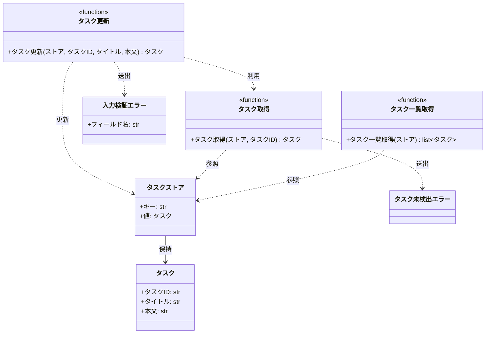

# モジュール構成: バックエンド / タスク

`タスク` ドメイン（バックエンド側）に属する構成要素詳細。

- 対応テストファイル: `tests/unit/tasks/test_service.py`

## 一覧

| ユースケース | 役割 | コンテナ | 種別 | 名前 | 概要 | 補足 |
| --- | --- | --- | --- | --- | --- | --- |
| 共通 | ドメインモデル | `src/tasks/models.py` | データモデル | [`Task`](#タスク) | タスク 1 件 | - |
| 共通 | ストア型 | `src/tasks/models.py` | データモデル | [`TaskStore`](#タスクストア) | タスク ID をキーにタスクを保持する入れ物 | `dict[str, Task]` の型エイリアス |
| 共通 | 例外 | `src/tasks/errors.py` | クラス | [`TaskNotFoundError`](#タスク未検出エラー) | 指定 ID のタスクが存在しない | - |
| 共通 | 例外 | `src/tasks/errors.py` | クラス | [`ValidationError`](#入力検証エラー) | 入力値が制約を満たさない | 不合格のフィールド名を保持する |
| 共通 | サービス | `src/tasks/service.py` | 関数 | [`get_task`](#タスク取得) | ストアからタスクを 1 件取得する | - |
| タスク編集 | 定数 | `src/tasks/service.py` | 定数 | `TITLE_MAX_LENGTH` | タイトルの最大文字数 | `100` |
| タスク編集 | 定数 | `src/tasks/service.py` | 定数 | `CONTENT_MAX_LENGTH` | 本文の最大文字数 | `1000` |
| タスク編集 | サービス | `src/tasks/service.py` | 関数 | [`update_task`](#タスク更新) | タスクのタイトルと本文を検証して更新する | - |
| タスク編集 | サービス | `src/tasks/service.py` | 関数 | [`list_tasks`](#タスク一覧取得) | ストアのタスクを一覧で返す | 編集結果が一覧に反映されたことの確認に使う |

## ディレクトリ構成

```
src/tasks/
├── __init__.py      # 公開シンボルの再エクスポート
├── models.py        # Task / TaskStore
├── errors.py        # TaskNotFoundError / ValidationError
└── service.py       # タスクの取得・更新・一覧
```

## 構成図



## タスク
> 物理名: `Task`<br>
> 種別: データモデル<br>
> コンテナ: `src/tasks/models.py`

タスク 1 件を表す不変のデータモデル。

### プロパティ

| 論理名 | プロパティ名 | 型 | 可視性 | デフォルト | 説明 | 例 | 補足 |
| --- | --- | --- | --- | --- | --- | --- | --- |
| タスク ID | `id` | `str` | 公開 | - | タスクの一意な識別子 | `"t1"` | - |
| タイトル | `title` | `str` | 公開 | - | タスク名 | `"新タイトル"` | - |
| 本文 | `content` | `str` | 公開 | `""` | タスクの本文 | `"新本文"` | - |

### メソッド

なし

### 単体テスト

なし

## タスクストア
> 物理名: `TaskStore`<br>
> 種別: データモデル<br>
> コンテナ: `src/tasks/models.py`

タスク ID をキーに [タスク](#タスク) を保持する入れ物の型エイリアス。

### プロパティ

| 論理名 | プロパティ名 | 型 | 可視性 | デフォルト | 説明 | 例 | 補足 |
| --- | --- | --- | --- | --- | --- | --- | --- |
| キー | - | `str` | 公開 | - | タスク ID | `"t1"` | [タスク](#タスク) の `id` と同じ値 |
| 値 | - | [`Task`](#タスク) | 公開 | - | 当該 ID のタスク | `Task(id="t1", ...)` | - |

### メソッド

なし

### 単体テスト

なし

## タスク未検出エラー
> 物理名: `TaskNotFoundError`<br>
> 種別: クラス<br>
> コンテナ: `src/tasks/errors.py`

指定 ID のタスクがストアに存在しないことを表す例外。

### プロパティ

なし

### メソッド

なし

### 単体テスト

なし

## 入力検証エラー
> 物理名: `ValidationError`<br>
> 種別: クラス<br>
> コンテナ: `src/tasks/errors.py`

入力値が制約を満たさないことを表す例外。
どのフィールドが不合格だったかを呼び出し元へ返すため、フィールド名を保持する。

### プロパティ

| 論理名 | プロパティ名 | 型 | 可視性 | デフォルト | 説明 | 例 | 補足 |
| --- | --- | --- | --- | --- | --- | --- | --- |
| フィールド名 | `field` | `Literal["title", "content"]` | 公開 | - | 不合格になったフィールド | `"title"` | 検証対象のフィールドが増えたらリテラルを追加する |

### 初期化
> 物理名: `__init__`<br>
> 種別: メソッド

フィールド名とメッセージを受け取って例外を組み立てる。

#### 引数

| 論理名 | 引数名 | 型 | 必須 | デフォルト | 説明 | 補足 |
| --- | --- | --- | --- | --- | --- | --- |
| フィールド名 | `field` | `Literal["title", "content"]` | ✅ | - | 不合格になったフィールド | - |
| メッセージ | `message` | `str` | ✅ | - | 不合格の内容 | 基底の `Exception` へ渡す |

引数例:

```python
raise ValidationError("title", "タイトルを入力してください")
```

#### 戻り値

| 型 | 説明 | 補足 |
| --- | --- | --- |
| `None` | なし | - |

#### 処理

1. `message` を基底クラスへ渡して初期化する
2. `field` を自身のプロパティへ保持する

#### 例外

なし

#### 単体テスト

なし

## `src/tasks/service.py`
> 種別: ファイル

タスクの取得・更新・一覧を提供する関数ファイル。
永続化先は引数で受け取る [タスクストア](#タスクストア) だけで、外部への依存を持たない。

---

### タスク取得
> 物理名: `get_task`<br>
> 種別: 関数

ストアからタスクを 1 件取得する。

#### 引数

| 論理名 | 引数名 | 型 | 必須 | デフォルト | 説明 | 補足 |
| --- | --- | --- | --- | --- | --- | --- |
| ストア | `store` | [`TaskStore`](#タスクストア) | ✅ | - | 取得元のストア | - |
| タスク ID | `task_id` | `str` | ✅ | - | 取得対象のタスク ID | - |

引数例:

```python
get_task(store, "t1")
```

#### 戻り値

| 型 | 説明 | 補足 |
| --- | --- | --- |
| [`Task`](#タスク) | 取得したタスク | - |

戻り値例:

```python
Task(id="t1", title="旧タイトル", content="旧本文")
```

#### 処理

1. `task_id` がストアに登録されているかを確かめる
   - 未登録の場合、`TaskNotFoundError` を送出する
2. 該当するタスクを返す

#### 例外

| 例外名 | 発生条件 | メッセージ | 補足 |
| --- | --- | --- | --- |
| `TaskNotFoundError` | `task_id` がストアに未登録 | `"task not found: {task_id}"` | - |

#### 単体テスト

セットアップ:

| セットアップ | 説明 | 補足 |
| --- | --- | --- |
| ストア | `t1` のタスク 1 件を持つ dict | 物理名 `_store()` |

| テスト名 | 正常/異常 | 概要 | 条件 | Mock | 期待値 | 補足 |
| --- | --- | --- | --- | --- | --- | --- |
| `test_get_task` | 正常 | 登録済みの ID で取得 | `task_id` に `t1` を渡す | なし | `t1` の [`Task`](#タスク) を返す | - |
| `test_get_task_when_task_missing` | 異常 | 未登録の ID で取得 | `task_id` に `missing` を渡す | なし | `TaskNotFoundError` を送出する | 例外表「`task_id` が未登録」に対応 |

---

### タスク更新
> 物理名: `update_task`<br>
> 種別: 関数

タイトルと本文を検証したうえでストア上のタスクを更新する。

#### 引数

| 論理名 | 引数名 | 型 | 必須 | デフォルト | 説明 | 補足 |
| --- | --- | --- | --- | --- | --- | --- |
| ストア | `store` | [`TaskStore`](#タスクストア) | ✅ | - | 更新対象を保持するストア | 更新結果を書き戻す |
| タスク ID | `task_id` | `str` | ✅ | - | 更新対象のタスク ID | - |
| タイトル | `title` | `str` | ✅ | - | 更新後のタスク名 | - |
| 本文 | `content` | `str` | - | `""` | 更新後の本文 | 省略すると空文字で上書きする |

引数例:

```python
update_task(store, "t1", "新タイトル", "新本文")
```

#### 戻り値

| 型 | 説明 | 補足 |
| --- | --- | --- |
| [`Task`](#タスク) | 更新後のタスク | ストアへ格納した値と同じ |

戻り値例:

```python
Task(id="t1", title="新タイトル", content="新本文")
```

#### 処理

1. タイトルが空文字でないことを確かめる
   - 空文字の場合、`ValidationError`（`field` は `title`）を送出する
2. タイトルが `TITLE_MAX_LENGTH` 以内であることを確かめる
   - 超える場合、`ValidationError`（`field` は `title`）を送出する
3. 本文が `CONTENT_MAX_LENGTH` 以内であることを確かめる
   - 超える場合、`ValidationError`（`field` は `content`）を送出する
4. `task_id` でタスクを取得する（[タスク取得](#タスク取得)）
5. 取得したタスクのタイトルと本文を差し替えたタスクを作り、ストアへ格納する
6. 格納したタスクを返す

#### 例外

| 例外名 | 発生条件 | メッセージ | 補足 |
| --- | --- | --- | --- |
| `ValidationError` | タイトルが空文字 | `"タイトルを入力してください"` | `field` は `title` |
| `ValidationError` | タイトルが `TITLE_MAX_LENGTH` を超える | `"タイトルは 100 文字以内で入力してください"` | `field` は `title` |
| `ValidationError` | 本文が `CONTENT_MAX_LENGTH` を超える | `"本文は 1000 文字以内で入力してください"` | `field` は `content` |
| `TaskNotFoundError` | `task_id` がストアに未登録 | `"task not found: {task_id}"` | [タスク取得](#タスク取得) が送出する |

#### 単体テスト

セットアップ:

| セットアップ | 説明 | 補足 |
| --- | --- | --- |
| ストア | `t1` のタスク 1 件を持つ dict | 物理名 `_store()` |

| テスト名 | 正常/異常 | 概要 | 条件 | Mock | 期待値 | 補足 |
| --- | --- | --- | --- | --- | --- | --- |
| `test_update_task` | 正常 | タイトルと本文を更新 | `title` と `content` に有効値を渡す | なし | 更新後の [`Task`](#タスク) を返し、ストアの `t1` も同じ値になる | - |
| `test_update_task_when_content_omitted` | 正常 | 本文を省略 | `content` を渡さない | なし | 返るタスクとストアの `t1` の本文が空文字になる | - |
| `test_update_task_when_title_empty` | 異常 | タイトルが空 | `title` に空文字を渡す | なし | `ValidationError` を送出し、`field` が `title` になる | 例外表「タイトルが空文字」に対応 |
| `test_update_task_when_title_too_long` | 異常 | タイトルが上限超過 | `title` に 101 文字を渡す | なし | `ValidationError` を送出し、`field` が `title` になる | 例外表「タイトルが `TITLE_MAX_LENGTH` を超える」に対応 |
| `test_update_task_when_content_too_long` | 異常 | 本文が上限超過 | `content` に 1001 文字を渡す | なし | `ValidationError` を送出し、`field` が `content` になる | 例外表「本文が `CONTENT_MAX_LENGTH` を超える」に対応 |
| `test_update_task_when_task_missing` | 異常 | 未登録の ID を指定 | `task_id` に `missing` を渡す | なし | `TaskNotFoundError` を送出し、ストアの `t1` は更新前のまま | 例外表「`task_id` が未登録」に対応 |

---

### タスク一覧取得
> 物理名: `list_tasks`<br>
> 種別: 関数

ストアが持つタスクを一覧で返す。

#### 引数

| 論理名 | 引数名 | 型 | 必須 | デフォルト | 説明 | 補足 |
| --- | --- | --- | --- | --- | --- | --- |
| ストア | `store` | [`TaskStore`](#タスクストア) | ✅ | - | 取得元のストア | - |

引数例:

```python
list_tasks(store)
```

#### 戻り値

| 型 | 説明 | 補足 |
| --- | --- | --- |
| `list[Task]` | ストアが持つ全タスク | ストアへの登録順で並ぶ |

戻り値例:

```python
[Task(id="t1", title="新タイトル", content="新本文")]
```

#### 処理

1. ストアの値をリストにして返す

#### 例外

なし

#### 単体テスト

セットアップ:

| セットアップ | 説明 | 補足 |
| --- | --- | --- |
| ストア | `t1` のタスク 1 件を持つ dict | 物理名 `_store()` |

| テスト名 | 正常/異常 | 概要 | 条件 | Mock | 期待値 | 補足 |
| --- | --- | --- | --- | --- | --- | --- |
| `test_list_tasks` | 正常 | 登録済みのタスクを一覧で返す | `t1` を持つストアを渡す | なし | `t1` の [`Task`](#タスク) 1 件のリストを返す | - |
| `test_list_tasks_when_store_empty` | 正常 | 空のストアを渡す | 空の dict を渡す | なし | 空リストを返す | 空一覧の境界値 |
