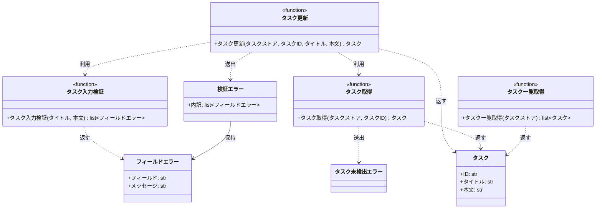

# モジュール構成: バックエンド / タスク

`タスク` ドメイン（バックエンド側）に属する構成要素詳細。

- 対応テストファイル: `tests/unit/tasks/test_service.py`

## 一覧

| ユースケース | 役割 | コンテナ | 種別 | 名前 | 概要 | 補足 |
| --- | --- | --- | --- | --- | --- | --- |
| 共通 | ドメインモデル | `src/tasks/models.py` | データモデル | [`Task`](#タスク) | タスク 1 件 | - |
| 共通 | エラー詳細 | `src/tasks/errors.py` | データモデル | [`FieldError`](#フィールドエラー) | フィールド 1 件分の検証エラー | - |
| 共通 | 例外 | `src/tasks/errors.py` | クラス | [`TaskNotFoundError`](#タスク未検出エラー) | 指定 ID のタスクが存在しない | - |
| 共通 | 例外 | `src/tasks/errors.py` | クラス | [`ValidationError`](#検証エラー) | 入力値が制約を満たさない | 違反フィールドの内訳を持つ |
| 共通 | 定数 | `src/tasks/service.py` | 定数 | `TITLE_MIN_LENGTH` | タイトルの最小文字数 | 値は `1` |
| 共通 | 定数 | `src/tasks/service.py` | 定数 | `TITLE_MAX_LENGTH` | タイトルの最大文字数 | 値は `100` |
| 共通 | 定数 | `src/tasks/service.py` | 定数 | `CONTENT_MAX_LENGTH` | 本文の最大文字数 | 値は `1000` |
| 共通 | サービス | `src/tasks/service.py` | 関数 | [`get_task`](#タスク取得) | ストアからタスクを 1 件取得する | - |
| 共通 | サービス | `src/tasks/service.py` | 関数 | [`list_tasks`](#タスク一覧取得) | ストアのタスクを ID 順で一覧にする | - |
| タスク更新 | バリデータ | `src/tasks/service.py` | 関数 | [`validate_task_input`](#タスク入力検証) | 入力値を検証して違反の内訳を返す | - |
| タスク更新 | サービス | `src/tasks/service.py` | 関数 | [`update_task`](#タスク更新) | タイトルと本文を更新する | - |

## ディレクトリ構成

```
src/tasks/
├── models.py     # Task
├── errors.py     # FieldError / TaskNotFoundError / ValidationError
└── service.py    # 検証と取得 / 更新のドメインロジック
```

## 構成図



## タスク
> 物理名: `Task`<br>
> 種別: データモデル<br>
> コンテナ: `src/tasks/models.py`

タスク 1 件を表す不変のドメインモデル。

### プロパティ

| 論理名 | プロパティ名 | 型 | 可視性 | デフォルト | 説明 | 例 | 補足 |
| --- | --- | --- | --- | --- | --- | --- | --- |
| ID | `id` | `str` | 公開 | - | タスクの一意 ID | `"t1"` | ストアのキーと一致する |
| タイトル | `title` | `str` | 公開 | - | タスク名 | `"新タイトル"` | 1 文字以上 100 文字以内 |
| 本文 | `content` | `str` | 公開 | `""` | タスクの本文 | `"新本文"` | 1000 文字以内 |

### メソッド

なし

### 単体テスト

なし

### 補足

- 不変（frozen）なので更新は新しいインスタンスを作ってストアへ差し替える

## フィールドエラー
> 物理名: `FieldError`<br>
> 種別: データモデル<br>
> コンテナ: `src/tasks/errors.py`

検証に失敗したフィールド 1 件分の内訳。

### プロパティ

| 論理名 | プロパティ名 | 型 | 可視性 | デフォルト | 説明 | 例 | 補足 |
| --- | --- | --- | --- | --- | --- | --- | --- |
| フィールド | `field` | `Literal["title", "content"]` | 公開 | - | 違反したフィールド名 | `"title"` | 呼び出し元が入力欄と対応付ける |
| メッセージ | `message` | `str` | 公開 | - | 違反内容の説明 | `"タイトルは 1 文字以上 100 文字以内で入力してください"` | 利用者向けの日本語 |

### メソッド

なし

### 単体テスト

なし

## タスク未検出エラー
> 物理名: `TaskNotFoundError`<br>
> 種別: クラス<br>
> コンテナ: `src/tasks/errors.py`

指定 ID のタスクがストアに無いことを表す例外。

### プロパティ

なし

### メソッド

なし

### 単体テスト

なし

## 検証エラー
> 物理名: `ValidationError`<br>
> 種別: クラス<br>
> コンテナ: `src/tasks/errors.py`

入力値が制約を満たさないことを表す例外。
違反したフィールドの内訳を全件保持する。

### プロパティ

| 論理名 | プロパティ名 | 型 | 可視性 | デフォルト | 説明 | 例 | 補足 |
| --- | --- | --- | --- | --- | --- | --- | --- |
| 内訳 | `errors` | [`list[FieldError]`](#フィールドエラー) | 公開 | - | 違反したフィールドの一覧 | `[FieldError(field="title", message="...")]` | 検証した順に並ぶ |

### 初期化
> 物理名: `__init__`<br>
> 種別: メソッド

内訳を受け取って保持し、例外メッセージを組み立てる。

#### 引数

| 論理名 | 引数名 | 型 | 必須 | デフォルト | 説明 | 補足 |
| --- | --- | --- | --- | --- | --- | --- |
| 内訳 | `errors` | [`list[FieldError]`](#フィールドエラー) | ✅ | - | 違反したフィールドの一覧 | 空リストでは送出しない |

引数例:

```python
raise ValidationError([FieldError(field="title", message="タイトルは 1 文字以上 100 文字以内で入力してください")])
```

#### 戻り値

| 型 | 説明 | 補足 |
| --- | --- | --- |
| `None` | なし | - |

#### 処理

1. 内訳をプロパティに保持する
2. 内訳のフィールド名を並べた文字列を例外メッセージとして親クラスへ渡す

#### 例外

なし

#### 単体テスト

| テスト名 | 正常/異常 | 概要 | 条件 | Mock | 期待値 | 補足 |
| --- | --- | --- | --- | --- | --- | --- |
| `test_init` | 正常 | 内訳を保持する | 内訳 2 件を渡す | なし | `errors` に渡した 2 件が入り、メッセージに両方のフィールド名が含まれる | - |

### 単体テスト

なし

## `src/tasks/service.py`
> 種別: ファイル

タスクの取得・検証・更新のドメインロジックを束ねる関数ファイル。
タスクの保管先は呼び出し元から渡される辞書（タスクストア）で、本ファイルは永続化の実体を持たない。

---

### タスク取得
> 物理名: `get_task`<br>
> 種別: 関数

ストアからタスクを 1 件取得する。

#### 引数

| 論理名 | 引数名 | 型 | 必須 | デフォルト | 説明 | 補足 |
| --- | --- | --- | --- | --- | --- | --- |
| タスクストア | `store` | [`dict[str, Task]`](#タスク) | ✅ | - | タスク ID をキーにした保管先 | 呼び出し元が保持する |
| タスク ID | `task_id` | `str` | ✅ | - | 取得対象のタスク ID | - |

引数例:

```python
get_task(store, "t1")
```

#### 戻り値

| 型 | 説明 | 補足 |
| --- | --- | --- |
| [`Task`](#タスク) | 取得したタスク | - |

戻り値例:

```python
Task(id="t1", title="旧タイトル", content="旧本文")
```

#### 処理

1. ストアに `task_id` が登録されているかを判定する
   - 未登録の場合、`TaskNotFoundError` を送出する
2. 該当するタスクを返す

#### 例外

| 例外名 | 発生条件 | メッセージ | 補足 |
| --- | --- | --- | --- |
| `TaskNotFoundError` | `task_id` がストアに無い | `"task not found: {task_id}"` | - |

#### 単体テスト

セットアップ:

| セットアップ | 説明 | 補足 |
| --- | --- | --- |
| タスクストア | `t1` のタスク 1 件だけを入れた辞書を返す | ヘルパー関数 `_store()` |

| テスト名 | 正常/異常 | 概要 | 条件 | Mock | 期待値 | 補足 |
| --- | --- | --- | --- | --- | --- | --- |
| `test_get_task` | 正常 | 登録済み ID で取得 | `task_id` に `"t1"` を渡す | なし | `t1` のタスクを返す | - |
| `test_get_task_when_task_missing` | 異常 | 未登録 ID を指定 | `task_id` に未登録の ID を渡す | なし | `TaskNotFoundError` を送出する | 例外表「`task_id` がストアに無い」に対応 |

---

### タスク一覧取得
> 物理名: `list_tasks`<br>
> 種別: 関数

ストアのタスクを ID の昇順で一覧にする。

#### 引数

| 論理名 | 引数名 | 型 | 必須 | デフォルト | 説明 | 補足 |
| --- | --- | --- | --- | --- | --- | --- |
| タスクストア | `store` | [`dict[str, Task]`](#タスク) | ✅ | - | タスク ID をキーにした保管先 | - |

引数例:

```python
list_tasks(store)
```

#### 戻り値

| 型 | 説明 | 補足 |
| --- | --- | --- |
| [`list[Task]`](#タスク) | ID 昇順に並べたタスク | 空ストアでは空リスト |

戻り値例:

```python
[Task(id="t1", title="新タイトル", content="新本文")]
```

#### 処理

1. ストアのキーを昇順に並べ、対応するタスクを順に詰めたリストを返す

#### 例外

なし

#### 単体テスト

| テスト名 | 正常/異常 | 概要 | 条件 | Mock | 期待値 | 補足 |
| --- | --- | --- | --- | --- | --- | --- |
| `test_list_tasks` | 正常 | ID 昇順に並ぶ | `t2` を先に入れた辞書を渡す | なし | `t1` → `t2` の順のリストを返す | - |
| `test_list_tasks_when_store_empty` | 正常 | 空ストア | 空の辞書を渡す | なし | 空リストを返す | - |

---

### タスク入力検証
> 物理名: `validate_task_input`<br>
> 種別: 関数

タイトルと本文を検証し、違反したフィールドの内訳を一覧で返す。

#### 引数

| 論理名 | 引数名 | 型 | 必須 | デフォルト | 説明 | 補足 |
| --- | --- | --- | --- | --- | --- | --- |
| タイトル | `title` | `str` | ✅ | - | 検証するタスク名 | - |
| 本文 | `content` | `str` | ✅ | - | 検証するタスク本文 | 省略時の既定値は呼び出し元が決める |

引数例:

```python
validate_task_input("", "a" * 1001)
```

#### 戻り値

| 型 | 説明 | 補足 |
| --- | --- | --- |
| [`list[FieldError]`](#フィールドエラー) | 違反したフィールドの内訳 | 違反が無ければ空リスト |

戻り値例:

```python
[
    FieldError(field="title", message="タイトルは 1 文字以上 100 文字以内で入力してください"),
    FieldError(field="content", message="本文は 1000 文字以内で入力してください"),
]
```

#### 処理

1. 空の内訳リストを用意する
2. タイトルの文字数が `TITLE_MIN_LENGTH` 以上 `TITLE_MAX_LENGTH` 以内かを判定する
   - 範囲外の場合、タイトルの内訳を追加する
3. 本文の文字数が `CONTENT_MAX_LENGTH` 以内かを判定する
   - 超過している場合、本文の内訳を追加する
4. 内訳リストを返す

#### 例外

なし

#### 単体テスト

| テスト名 | 正常/異常 | 概要 | 条件 | Mock | 期待値 | 補足 |
| --- | --- | --- | --- | --- | --- | --- |
| `test_validate_task_input` | 正常 | 制限内の入力 | タイトル 5 文字・本文 5 文字 | なし | 空リストを返す | - |
| `test_validate_task_input_when_title_empty` | 正常 | タイトルが空 | タイトル 0 文字 | なし | タイトルの内訳 1 件を返す | - |
| `test_validate_task_input_when_title_too_long` | 正常 | タイトルが上限超過 | タイトル 101 文字 | なし | タイトルの内訳 1 件を返す | - |
| `test_validate_task_input_when_content_too_long` | 正常 | 本文が上限超過 | 本文 1001 文字 | なし | 本文の内訳 1 件を返す | - |
| `test_validate_task_input_when_both_invalid` | 正常 | 2 フィールド同時違反 | タイトル 0 文字・本文 1001 文字 | なし | タイトル → 本文の順で 2 件を返す | 内訳の順序も検証する |

---

### タスク更新
> 物理名: `update_task`<br>
> 種別: 関数

登録済みタスクのタイトルと本文を更新して返す。

#### 引数

| 論理名 | 引数名 | 型 | 必須 | デフォルト | 説明 | 補足 |
| --- | --- | --- | --- | --- | --- | --- |
| タスクストア | `store` | [`dict[str, Task]`](#タスク) | ✅ | - | タスク ID をキーにした保管先 | 更新は本引数を直接書き換える |
| タスク ID | `task_id` | `str` | ✅ | - | 更新対象のタスク ID | - |
| タイトル | `title` | `str` | ✅ | - | 更新後のタスク名 | - |
| 本文 | `content` | `str` | - | `""` | 更新後の本文 | 省略時は本文を空にする |

引数例:

```python
update_task(store, "t1", "新タイトル", "新本文")
```

#### 戻り値

| 型 | 説明 | 補足 |
| --- | --- | --- |
| [`Task`](#タスク) | 更新後のタスク | ストアへ書き戻したものと同一の値 |

戻り値例:

```python
Task(id="t1", title="新タイトル", content="新本文")
```

#### 処理

1. 入力値を検証して違反の内訳を得る（[タスク入力検証](#タスク入力検証)）
   - 内訳が空でない場合、`ValidationError` を送出する
2. 更新対象のタスクを取得する（[タスク取得](#タスク取得)）
3. 更新後の値でタスクを組み立て、ストアの同じ ID へ書き戻す
4. 更新後のタスクを返す

#### 例外

| 例外名 | 発生条件 | メッセージ | 補足 |
| --- | --- | --- | --- |
| `ValidationError` | 入力検証の内訳が 1 件以上 | `"入力値が不正です: {フィールド名の一覧}"` | 内訳は `errors` が持つ |
| `TaskNotFoundError` | `task_id` がストアに無い | `"task not found: {task_id}"` | [タスク取得](#タスク取得) から伝播 |

#### 単体テスト

セットアップ:

| セットアップ | 説明 | 補足 |
| --- | --- | --- |
| タスクストア | `t1` のタスク 1 件だけを入れた辞書を返す | ヘルパー関数 `_store()` |

| テスト名 | 正常/異常 | 概要 | 条件 | Mock | 期待値 | 補足 |
| --- | --- | --- | --- | --- | --- | --- |
| `test_update_task` | 正常 | タイトルと本文を更新 | タイトルと本文を指定して呼ぶ | なし | 更新後のタスクを返し、ストアの `t1` も置き換わる | - |
| `test_update_task_when_content_omitted` | 正常 | 本文を省略 | `content` を渡さない | なし | 本文が空文字のタスクを返す | デフォルト値の分岐 |
| `test_update_task_when_input_invalid` | 異常 | 入力検証に違反 | タイトルに空文字を渡す | なし | `ValidationError` を送出し、内訳にタイトルが入る | 例外表「入力検証の内訳が 1 件以上」に対応 |
| `test_update_task_when_task_missing` | 異常 | 未登録の ID を指定 | 未登録の `task_id` を渡す | なし | `TaskNotFoundError` を送出し、ストアが変わらない | ストアを変更しないことの確認 |

---

### 補足

- 入力検証を対象タスクの存在確認より先に行う（未登録 ID でも入力不正が先に返る）
- 検証は違反を集めてから 1 度だけ送出する（先頭 1 件で打ち切らない）
- 文字数の上限値は定数に集約し、検証関数とメッセージの両方から参照する
