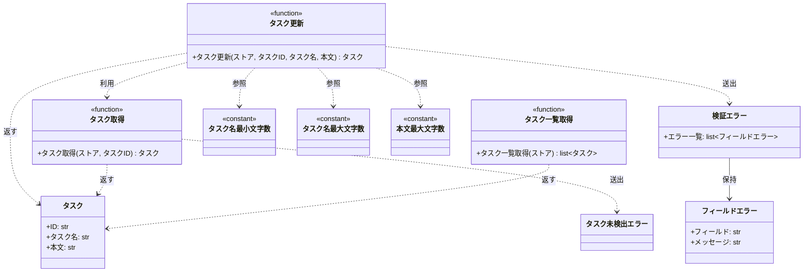

# モジュール構成: バックエンド / タスク

`タスク` ドメイン（バックエンド側）に属する構成要素詳細。

- 対応テストファイル: 未記入

## 一覧

| ユースケース | 役割 | コンテナ | 種別 | 名前 | 概要 | 補足 |
| --- | --- | --- | --- | --- | --- | --- |
| 共通 | ドメインモデル | `src/tasks/models.py` | データモデル | [`Task`](#タスク) | タスク 1 件 | - |
| 共通 | エラー詳細 | `src/tasks/errors.py` | データモデル | [`FieldError`](#フィールドエラー) | 検証に失敗したフィールド 1 件の内容 | - |
| 共通 | ドメイン例外 | `src/tasks/errors.py` | クラス | [`ValidationError`](#検証エラー) | 入力値が制約を満たさない | 違反したフィールドを全件保持する |
| 共通 | ドメイン例外 | `src/tasks/errors.py` | クラス | [`TaskNotFoundError`](#タスク未検出エラー) | 指定 ID のタスクが存在しない | - |
| 共通 | 定数 | `src/tasks/service.py` | 定数 | `TITLE_MIN_LENGTH` | タスク名の最小文字数 | 値は `1` |
| 共通 | 定数 | `src/tasks/service.py` | 定数 | `TITLE_MAX_LENGTH` | タスク名の最大文字数 | 値は `100` |
| 共通 | 定数 | `src/tasks/service.py` | 定数 | `CONTENT_MAX_LENGTH` | 本文の最大文字数 | 値は `1000` |
| 共通 | クエリ | `src/tasks/service.py` | 関数 | [`get_task`](#タスク取得) | ストアからタスクを 1 件取得 | - |
| タスク編集 | サービス | `src/tasks/service.py` | 関数 | [`update_task`](#タスク更新) | 入力値を検証してタスクを更新 | - |
| タスク一覧 | クエリ | `src/tasks/service.py` | 関数 | [`list_tasks`](#タスク一覧取得) | ストアのタスクを ID 順で一覧化 | - |

## ディレクトリ構成

```
src/tasks/
├── models.py     # Task
├── errors.py     # FieldError / ValidationError / TaskNotFoundError
└── service.py    # get_task / update_task / list_tasks と文字数制限の定数
```

## 構成図



## タスク
> 物理名: `Task`<br>
> 種別: データモデル<br>
> コンテナ: `src/tasks/models.py`

タスク 1 件を表す不変のドメインモデル。

### プロパティ

| 論理名 | プロパティ名 | 型 | 可視性 | デフォルト | 説明 | 例 | 補足 |
| --- | --- | --- | --- | --- | --- | --- | --- |
| ID | `id` | `str` | 公開 | - | タスクの一意な識別子 | `"t1"` | ストアのキーと一致する |
| タスク名 | `title` | `str` | 公開 | - | タスクの見出し | `"新タイトル"` | 1 文字以上 100 文字以内 |
| 本文 | `content` | `str` | 公開 | `""` | タスクの説明 | `"新本文"` | 1000 文字以内 |

### メソッド

なし

### 単体テスト

なし

## フィールドエラー
> 物理名: `FieldError`<br>
> 種別: データモデル<br>
> コンテナ: `src/tasks/errors.py`

検証に失敗したフィールド 1 件の内容。
[検証エラー](#検証エラー) が違反したフィールドの数だけ保持する。

### プロパティ

| 論理名 | プロパティ名 | 型 | 可視性 | デフォルト | 説明 | 例 | 補足 |
| --- | --- | --- | --- | --- | --- | --- | --- |
| フィールド | `field` | `Literal["title", "content"]` | 公開 | - | 違反した入力フィールド | `"title"` | 検証対象を増やしたら値を追加する |
| メッセージ | `message` | `str` | 公開 | - | 呼び出し元にそのまま表示できる説明 | `"タスク名は 1 文字以上 100 文字以内で入力してください"` | - |

### メソッド

なし

### 単体テスト

なし

## 検証エラー
> 物理名: `ValidationError`<br>
> 種別: クラス<br>
> コンテナ: `src/tasks/errors.py`

入力値が制約を満たさないことを表す例外。
違反した [フィールドエラー](#フィールドエラー) を全件保持し、呼び出し元がフィールド単位でエラーを出し分けられるようにする。

### プロパティ

| 論理名 | プロパティ名 | 型 | 可視性 | デフォルト | 説明 | 例 | 補足 |
| --- | --- | --- | --- | --- | --- | --- | --- |
| エラー一覧 | `errors` | [`list[FieldError]`](#フィールドエラー) | 公開 | - | 違反したフィールドの一覧 | `[FieldError(field="title", message="...")]` | 検証した順（タスク名 → 本文）で並ぶ |

### 初期化
> 物理名: `__init__`<br>
> 種別: メソッド

フィールドエラーの一覧を受け取り、基底の例外メッセージを組み立てる。

#### 引数

| 論理名 | 引数名 | 型 | 必須 | デフォルト | 説明 | 補足 |
| --- | --- | --- | --- | --- | --- | --- |
| エラー一覧 | `errors` | [`list[FieldError]`](#フィールドエラー) | ✅ | - | 違反したフィールドの一覧 | 1 件以上を渡す |

引数例:

```python
ValidationError([FieldError(field="title", message="タスク名は 1 文字以上 100 文字以内で入力してください")])
```

#### 戻り値

| 型 | 説明 | 補足 |
| --- | --- | --- |
| `None` | なし | - |

#### 処理

1. 各フィールドエラーを `{フィールド}: {メッセージ}` に整形し、`; ` で連結した文字列を基底の例外メッセージにする
2. 受け取った一覧をそのまま `errors` に保持する

#### 例外

なし

#### 単体テスト

| テスト名 | 正常/異常 | 概要 | 条件 | Mock | 期待値 | 補足 |
| --- | --- | --- | --- | --- | --- | --- |
| `test_validation_error` | 正常 | フィールドエラーからメッセージを組み立てる | `title` と `content` の 2 件を渡す | なし | `errors` が渡した 2 件、`str()` が `; ` 連結の文字列 | - |

### 単体テスト

なし

## タスク未検出エラー
> 物理名: `TaskNotFoundError`<br>
> 種別: クラス<br>
> コンテナ: `src/tasks/errors.py`

指定 ID のタスクがストアに存在しないことを表す例外。

### プロパティ

なし

### メソッド

なし

### 単体テスト

なし

## `src/tasks/service.py`
> 種別: ファイル

タスクの取得・更新・一覧化を行う関数ファイル。
タスクの保持先はプロセス内の `dict[str, Task]` で、全関数が第 1 引数で受け取る。

### タスク取得
> 物理名: `get_task`<br>
> 種別: 関数

ストアからタスクを 1 件取得する。

#### 引数

| 論理名 | 引数名 | 型 | 必須 | デフォルト | 説明 | 補足 |
| --- | --- | --- | --- | --- | --- | --- |
| ストア | `store` | [`dict[str, Task]`](#タスク) | ✅ | - | タスクの保持先 | - |
| タスク ID | `task_id` | `str` | ✅ | - | 取得対象のタスク ID | - |

引数例:

```python
get_task(store, "t1")
```

#### 戻り値

| 型 | 説明 | 補足 |
| --- | --- | --- |
| [`Task`](#タスク) | 取得したタスク | - |

戻り値例:

```python
Task(id="t1", title="旧タイトル", content="旧本文")
```

#### 処理

1. ストアに `task_id` のキーがあるか確認する
   - 無い場合、`TaskNotFoundError` を送出する
2. 該当するタスクを返す

#### 例外

| 例外名 | 発生条件 | メッセージ | 補足 |
| --- | --- | --- | --- |
| `TaskNotFoundError` | ストアに `task_id` のキーが無い | `"タスクが見つかりません: {task_id}"` | - |

#### 単体テスト

セットアップ:

| セットアップ | 説明 | 補足 |
| --- | --- | --- |
| ストア | `t1` のタスク 1 件を持つ dict を組み立てる | 物理名 `_store` |

| テスト名 | 正常/異常 | 概要 | 条件 | Mock | 期待値 | 補足 |
| --- | --- | --- | --- | --- | --- | --- |
| `test_get_task` | 正常 | 登録済みタスクを取得する | `task_id` に `t1` を渡す | なし | `t1` のタスクを返す | - |
| `test_get_task_when_task_missing` | 異常 | 未登録 ID を指定する | `task_id` に `missing` を渡す | なし | `TaskNotFoundError` を送出する | 例外表「`task_id` のキーが無い」に対応 |

### タスク更新
> 物理名: `update_task`<br>
> 種別: 関数

入力値を検証したうえで登録済みタスクのタスク名と本文を更新する。

#### 引数

| 論理名 | 引数名 | 型 | 必須 | デフォルト | 説明 | 補足 |
| --- | --- | --- | --- | --- | --- | --- |
| ストア | `store` | [`dict[str, Task]`](#タスク) | ✅ | - | タスクの保持先 | - |
| タスク ID | `task_id` | `str` | ✅ | - | 更新対象のタスク ID | - |
| タスク名 | `title` | `str` | ✅ | - | 更新後のタスク名 | 1 文字以上 100 文字以内 |
| 本文 | `content` | `str` | - | `""` | 更新後の本文 | 1000 文字以内 |

引数例:

```python
update_task(store, "t1", "新タイトル", "新本文")
```

#### 戻り値

| 型 | 説明 | 補足 |
| --- | --- | --- |
| [`Task`](#タスク) | 更新後のタスク | ストアの内容も同じインスタンスに差し替わる |

戻り値例:

```python
Task(id="t1", title="新タイトル", content="新本文")
```

#### 処理

1. タスク名の文字数を検証し、`TITLE_MIN_LENGTH` 〜 `TITLE_MAX_LENGTH` の範囲外なら `title` のフィールドエラーを溜める
2. 本文の文字数を検証し、`CONTENT_MAX_LENGTH` を超えていたら `content` のフィールドエラーを溜める
3. 溜めたフィールドエラーが 1 件以上あれば `ValidationError` を送出する
4. 更新対象のタスクを取得する（[タスク取得](#タスク取得)）
5. 取得したタスクの ID を引き継いだ新しいタスクを組み立て、ストアへ書き戻して返す

#### 例外

| 例外名 | 発生条件 | メッセージ | 補足 |
| --- | --- | --- | --- |
| `ValidationError` | タスク名が `TITLE_MIN_LENGTH` 未満 or `TITLE_MAX_LENGTH` 超 | `"タスク名は 1 文字以上 100 文字以内で入力してください"` | `errors` の `title` 行のメッセージ |
| `ValidationError` | 本文が `CONTENT_MAX_LENGTH` 超 | `"本文は 1000 文字以内で入力してください"` | `errors` の `content` 行のメッセージ |
| `TaskNotFoundError` | ストアに `task_id` のキーが無い | `"タスクが見つかりません: {task_id}"` | [タスク取得](#タスク取得) から伝播する |

#### 単体テスト

セットアップ:

| セットアップ | 説明 | 補足 |
| --- | --- | --- |
| ストア | `t1` のタスク 1 件を持つ dict を組み立てる | 物理名 `_store` |

| テスト名 | 正常/異常 | 概要 | 条件 | Mock | 期待値 | 補足 |
| --- | --- | --- | --- | --- | --- | --- |
| `test_update_task` | 正常 | タスク名と本文を更新する | 有効なタスク名と本文を渡す | なし | 更新後のタスクを返し、ストアの `t1` も差し替わる | - |
| `test_update_task_when_content_omitted` | 正常 | 本文を省略する | `content` を渡さない | なし | 本文が `""` のタスクを返す | - |
| `test_update_task_when_title_empty` | 異常 | タスク名が空 | `title` に `""` を渡す | なし | `ValidationError` を送出し、`errors` は `title` の 1 件 | 例外表「タスク名が範囲外」に対応 |
| `test_update_task_when_title_too_long` | 異常 | タスク名が 101 文字 | `title` に 101 文字を渡す | なし | `ValidationError` を送出し、`errors` は `title` の 1 件 | 例外表「タスク名が範囲外」に対応 |
| `test_update_task_when_content_too_long` | 異常 | 本文が 1001 文字 | `content` に 1001 文字を渡す | なし | `ValidationError` を送出し、`errors` は `content` の 1 件 | 例外表「本文が範囲外」に対応 |
| `test_update_task_when_title_and_content_invalid` | 異常 | 両フィールドが違反 | `title` に `""`、`content` に 1001 文字を渡す | なし | `ValidationError` を送出し、`errors` は `title` → `content` の 2 件 | 打ち切らずに全件返すことの確認 |
| `test_update_task_when_task_missing` | 異常 | 未登録 ID を指定する | `task_id` に `missing` を渡す | なし | `TaskNotFoundError` を送出し、ストアは変わらない | 検証通過後に伝播することの確認 |

### タスク一覧取得
> 物理名: `list_tasks`<br>
> 種別: 関数

ストアのタスクを ID 昇順で一覧にする。

#### 引数

| 論理名 | 引数名 | 型 | 必須 | デフォルト | 説明 | 補足 |
| --- | --- | --- | --- | --- | --- | --- |
| ストア | `store` | [`dict[str, Task]`](#タスク) | ✅ | - | タスクの保持先 | - |

引数例:

```python
list_tasks(store)
```

#### 戻り値

| 型 | 説明 | 補足 |
| --- | --- | --- |
| [`list[Task]`](#タスク) | ID 昇順に並べたタスクの一覧 | 空のストアでは空リスト |

戻り値例:

```python
[Task(id="t1", title="新タイトル", content="新本文")]
```

#### 処理

1. ストアのキーを昇順に並べ、対応するタスクを並べた一覧を返す

#### 例外

なし

#### 単体テスト

| テスト名 | 正常/異常 | 概要 | 条件 | Mock | 期待値 | 補足 |
| --- | --- | --- | --- | --- | --- | --- |
| `test_list_tasks` | 正常 | ID 昇順で一覧化する | `t2` / `t1` の順で登録したストアを渡す | なし | `t1` → `t2` の順のリストを返す | - |
| `test_list_tasks_when_store_empty` | 正常 | 空のストアを渡す | 空の dict を渡す | なし | 空リストを返す | - |
