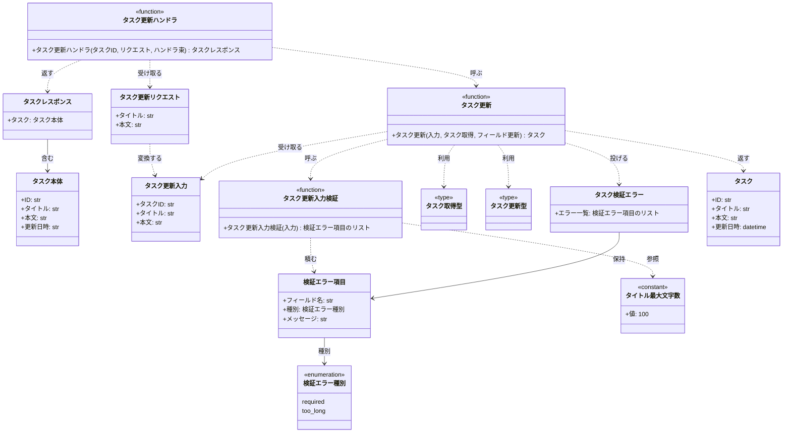
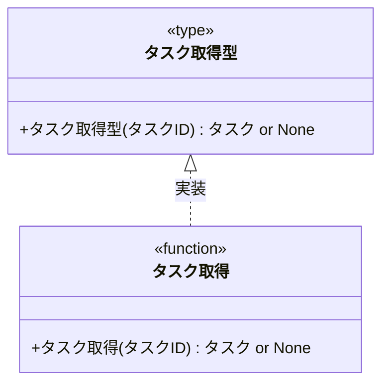
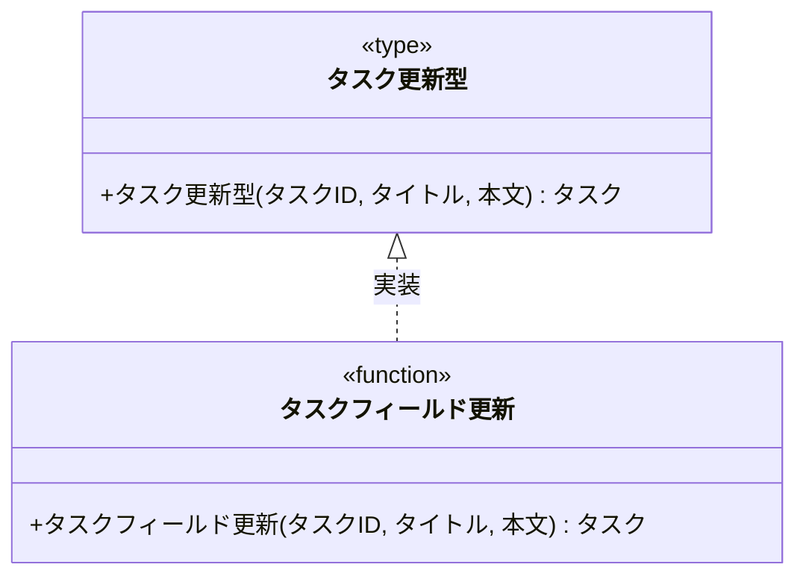

# モジュール構成: バックエンド / タスク

`タスク` ドメイン（バックエンド側）に属する構成要素詳細。
[タスク更新](../../バックエンド結合/タスク更新.py.md) のインターフェースを実装する関数群を扱う。

## 一覧

| ユースケース | 役割 | コンテナ | 種別 | 名前 | 概要 | 補足 |
| --- | --- | --- | --- | --- | --- | --- |
| 共通 | ドメインモデル | `features/tasks/types.py` | データモデル | [`Task`](#タスク) | タスクのドメインモデル | - |
| 共通 | 列挙 | `features/tasks/types.py` | Enum | [`ValidationCode`](#検証エラー種別) | 検証エラーの種別 | - |
| 共通 | DTO | `features/tasks/types.py` | データモデル | [`ValidationErrorItem`](#検証エラー項目) | フィールド単位の検証エラー | - |
| タスク更新 | 定数 | `features/tasks/types.py` | 定数 | `TITLE_MAX_LENGTH` | タイトルの上限文字数（100） | 単純即値のため詳細セクションなし |
| タスク更新 | 入力 DTO | `features/tasks/types.py` | データモデル | [`UpdateTaskInput`](#タスク更新入力) | 更新の入力値 | - |
| タスク更新 | 例外 | `features/tasks/types.py` | クラス | [`TaskValidationError`](#タスク検証エラー) | 検証失敗（失敗した規則を全件保持） | - |
| タスク更新 | リポジトリ型（DI） | `features/tasks/types.py` | 関数型 | [`FindTask`](#タスク取得型) | 1 件取得のシグネチャ | - |
| タスク更新 | リポジトリ型（DI） | `features/tasks/types.py` | 関数型 | [`UpdateTaskFields`](#タスク更新型) | 更新のシグネチャ | - |
| タスク更新 | リクエスト DTO | `features/tasks/schemas.py` | データモデル | [`UpdateTaskRequest`](#タスク更新リクエスト) | 更新リクエストのボディ | - |
| タスク更新 | レスポンス DTO | `features/tasks/schemas.py` | データモデル | [`TaskPayload`](#タスク本体) | レスポンスのタスク部分 | - |
| タスク更新 | レスポンス DTO | `features/tasks/schemas.py` | データモデル | [`TaskResponse`](#タスクレスポンス) | 更新成功時のレスポンス | - |
| タスク更新 | サービス | `features/tasks/service.py` | 関数 | [`update_task`](#タスク更新) | 検証 → 取得 → 更新 | - |
| タスク更新 | バリデータ | `features/tasks/service.py` | 関数 | [`_validate_update_task_input`](#タスク更新入力検証) | タイトルの必須・文字数を検証 | - |
| タスク更新 | リポジトリ | `features/tasks/db.py` | 関数 | [`find_task`](#タスク取得) | `task_id` で 1 件取得 | - |
| タスク更新 | リポジトリ | `features/tasks/db.py` | 関数 | [`update_task_fields`](#タスクフィールド更新) | タイトル・本文を更新して更新後を返す | - |
| タスク更新 | ハンドラ | `features/tasks/route.py` | 関数 | [`put_task`](#タスク更新ハンドラ) | `PUT /tasks/{task_id}` のハンドラ | - |

## ディレクトリ構成

```
src/taskapp/features/tasks/
├── types.py         # Task / UpdateTaskInput / ValidationErrorItem / 関数型 / TaskValidationError / TITLE_MAX_LENGTH
├── schemas.py       # UpdateTaskRequest / TaskPayload / TaskResponse
├── service.py       # update_task / _validate_update_task_input
├── db.py            # find_task / update_task_fields
└── route.py         # put_task
```

## 構成図

### 更新フロー



### 取得型の実装



### 更新型の実装



## タスク
> 物理名: `Task`<br>
> 種別: データモデル<br>
> コンテナ: `features/tasks/types.py`

タスクのドメインモデル。
関数間で受け渡す内部 DTO で、HTTP 境界の形は [タスク本体](#タスク本体) が持つ。

### プロパティ

| 論理名 | プロパティ名 | 型 | 可視性 | デフォルト | 説明 | 例 | 補足 |
| --- | --- | --- | --- | --- | --- | --- | --- |
| ID | `id` | `str` | 公開 | - | タスク ID | `"3f2b1c88-9d41-4a7e-8b02-5c6d7e8f9a01"` | UUID |
| タイトル | `title` | `str` | 公開 | - | タスク名 | `"決算資料の作成"` | - |
| 本文 | `body` | `str` | 公開 | - | タスク本文 | `"四半期分の売上を集計する。"` | 空文字は本文なしを表す |
| 更新日時 | `updated_at` | `datetime` | 公開 | - | 最終更新日時 | `datetime(2026, 7, 26, 13, 20, 41, tzinfo=UTC)` | DB 側で採番した値 |

### メソッド

なし

### 単体テスト

なし

### 補足

- `@dataclass(frozen=True, slots=True, kw_only=True)` で定義する
- タイトル・本文以外のカラム（状態・期限等）は本サブシステムで扱わないためプロパティに持たない

## 検証エラー種別
> 物理名: `ValidationCode`<br>
> 種別: Enum<br>
> コンテナ: `features/tasks/types.py`

検証がどの規則で失敗したかを表す種別。

### 値一覧

| 値 | 論理名 | 説明 | 補足 |
| --- | --- | --- | --- |
| `required` | 必須 | 値が空である | `title` が空文字のとき |
| `too_long` | 文字数超過 | 上限文字数を超えている | `title` が `TITLE_MAX_LENGTH` を超えるとき |

### 補足

- 実体は `type ValidationCode = Literal["required", "too_long"]`（固定の選択肢は `Literal` で表す言語規約に従う）

## 検証エラー項目
> 物理名: `ValidationErrorItem`<br>
> 種別: データモデル<br>
> コンテナ: `features/tasks/types.py`

どのフィールドがどの規則で失敗したかを 1 件で表す DTO。

### プロパティ

| 論理名 | プロパティ名 | 型 | 可視性 | デフォルト | 説明 | 例 | 補足 |
| --- | --- | --- | --- | --- | --- | --- | --- |
| フィールド名 | `field` | `str` | 公開 | - | エラー対象のフィールド名 | `"title"` | リクエストのパラメータ名と一致させる |
| 種別 | `code` | [`ValidationCode`](#検証エラー種別) | 公開 | - | 失敗した規則 | `"required"` | - |
| メッセージ | `message` | `str` | 公開 | - | 表示用のエラーメッセージ | `"タスク名を入力してください。"` | 呼び出し元がインライン表示に使う |

### メソッド

なし

### 単体テスト

なし

## タスク更新入力
> 物理名: `UpdateTaskInput`<br>
> 種別: データモデル<br>
> コンテナ: `features/tasks/types.py`

タスク更新の入力値をまとめた内部 DTO。

### プロパティ

| 論理名 | プロパティ名 | 型 | 可視性 | デフォルト | 説明 | 例 | 補足 |
| --- | --- | --- | --- | --- | --- | --- | --- |
| タスク ID | `task_id` | `str` | 公開 | - | 更新対象のタスク ID | `"3f2b1c88-9d41-4a7e-8b02-5c6d7e8f9a01"` | パスパラメータ由来 |
| タイトル | `title` | `str` | 公開 | - | 更新後のタスク名 | `"決算資料の作成"` | 未検証の生の入力値 |
| 本文 | `body` | `str` | 公開 | - | 更新後のタスク本文 | `"四半期分の売上を集計する。"` | 未検証の生の入力値 |

### メソッド

なし

### 単体テスト

なし

### 補足

- 検証前の値を運ぶ DTO のため、業務ルールを満たすことは保証しない（検証は [タスク更新入力検証](#タスク更新入力検証) が担う）

## タスク検証エラー
> 物理名: `TaskValidationError`<br>
> 種別: クラス<br>
> コンテナ: `features/tasks/types.py`<br>
> 継承元: `ValidationError`（`shared/errors.py`）

タスクの入力検証に失敗したことを表す例外。
失敗した規則を全件保持する。

### プロパティ

| 論理名 | プロパティ名 | 型 | 可視性 | デフォルト | 説明 | 例 | 補足 |
| --- | --- | --- | --- | --- | --- | --- | --- |
| エラー一覧 | `errors` | [`list[ValidationErrorItem]`](#検証エラー項目) | 公開 | - | 失敗した検証規則の全件 | `[ValidationErrorItem(field="title", code="required", ...)]` | 最初の 1 件で打ち切らない |

### メソッド

なし

### 単体テスト

なし

### 補足

- HTTP ステータスへの変換とレスポンスボディの組み立ては例外ハンドラの責務（配線側の分類）

## `features/tasks/types.py`
> 種別: ファイル

タスクドメインの DTO・定数・関数型エイリアスを置くファイル。
外部依存（DB アクセス）は関数型エイリアスで抽象化し、実体は配線側で注入する。

---

### タスク取得型
> 物理名: `FindTask`<br>
> 種別: 関数型

`task_id` でタスクを 1 件取得する関数のシグネチャ。
DI / Mock 差し替え用。

#### 引数

| 論理名 | 引数名 | 型 | 必須 | デフォルト | 説明 | 補足 |
| --- | --- | --- | --- | --- | --- | --- |
| タスク ID | `task_id` | `str` | ✅ | - | 取得対象のタスク ID | - |

#### 戻り値

| 型 | 説明 | 補足 |
| --- | --- | --- |
| [`Task \| None`](#タスク) | 見つかったタスク | 見つからない場合は `None` |

#### 実装

| 実装 | 補足 |
| --- | --- |
| [タスク取得](#タスク取得) | 本番の実装（DB アクセス） |

---

### タスク更新型
> 物理名: `UpdateTaskFields`<br>
> 種別: 関数型

タスクのタイトル・本文を更新する関数のシグネチャ。
DI / Mock 差し替え用。

#### 引数

| 論理名 | 引数名 | 型 | 必須 | デフォルト | 説明 | 補足 |
| --- | --- | --- | --- | --- | --- | --- |
| タスク ID | `task_id` | `str` | ✅ | - | 更新対象のタスク ID | - |
| タイトル | `title` | `str` | ✅ | - | 更新後のタスク名 | 検証済みの値 |
| 本文 | `body` | `str` | ✅ | - | 更新後のタスク本文 | 検証済みの値 |

#### 戻り値

| 型 | 説明 | 補足 |
| --- | --- | --- |
| [`Task`](#タスク) | 更新後のタスク | `updated_at` は DB 側で採番した値 |

#### 実装

| 実装 | 補足 |
| --- | --- |
| [タスクフィールド更新](#タスクフィールド更新) | 本番の実装（DB アクセス） |

## タスク更新リクエスト
> 物理名: `UpdateTaskRequest`<br>
> 種別: データモデル<br>
> コンテナ: `features/tasks/schemas.py`

`PUT /tasks/{task_id}` のリクエストボディ。
型の検証だけを担い、業務ルール（必須・文字数）の検証は [タスク更新入力検証](#タスク更新入力検証) が担う。

### プロパティ

| 論理名 | プロパティ名 | 型 | 可視性 | デフォルト | 説明 | 例 | 補足 |
| --- | --- | --- | --- | --- | --- | --- | --- |
| タイトル | `title` | `str` | 公開 | - | 更新後のタスク名 | `"決算資料の作成"` | 文字数制約は付けない |
| 本文 | `body` | `str` | 公開 | - | 更新後のタスク本文 | `"四半期分の売上を集計する。"` | 空文字を許容する |

### ドメイン変換
> 物理名: `to_domain`<br>
> 種別: メソッド

リクエストボディとパスパラメータから [タスク更新入力](#タスク更新入力) を組み立てる。

#### 引数

| 論理名 | 引数名 | 型 | 必須 | デフォルト | 説明 | 補足 |
| --- | --- | --- | --- | --- | --- | --- |
| タスク ID | `task_id` | `str` | ✅ | - | 更新対象のタスク ID | パスパラメータ由来 |

引数例:

```python
req.to_domain("3f2b1c88-9d41-4a7e-8b02-5c6d7e8f9a01")
```

#### 戻り値

| 型 | 説明 | 補足 |
| --- | --- | --- |
| [`UpdateTaskInput`](#タスク更新入力) | 組み立てた入力 DTO | - |

戻り値例:

```python
UpdateTaskInput(task_id="3f2b1c88-...", title="決算資料の作成", body="四半期分の売上を集計する。")
```

#### 処理

1. `task_id` と自身の `title` / `body` から タスク更新入力 を組み立てて返す

#### 例外

なし

#### 単体テスト

| テスト名 | 正常/異常 | 概要 | 条件 | Mock | 期待値 | 補足 |
| --- | --- | --- | --- | --- | --- | --- |
| `test_update_task_request_to_domain` | 正常 | リクエストを入力 DTO に変換 | `title` / `body` を持つリクエスト | なし | `task_id` / `title` / `body` が転記された `UpdateTaskInput` を返す | - |

### 補足

- Pydantic の `Field` に `min_length` / `max_length` を付けない。
  付けると FastAPI 既定の 422 + Pydantic 形式のエラーになり、[タスク更新](../../バックエンド結合/タスク更新.py.md) が定めた 400 + `errors` の形と合わなくなる

## タスク本体
> 物理名: `TaskPayload`<br>
> 種別: データモデル<br>
> コンテナ: `features/tasks/schemas.py`

レスポンスの `task` フィールドの中身。

### プロパティ

| 論理名 | プロパティ名 | 型 | 可視性 | デフォルト | 説明 | 例 | 補足 |
| --- | --- | --- | --- | --- | --- | --- | --- |
| ID | `id` | `str` | 公開 | - | タスク ID | `"3f2b1c88-9d41-4a7e-8b02-5c6d7e8f9a01"` | - |
| タイトル | `title` | `str` | 公開 | - | 更新後のタスク名 | `"決算資料の作成"` | - |
| 本文 | `body` | `str` | 公開 | - | 更新後のタスク本文 | `"四半期分の売上を集計する。"` | - |
| 更新日時 | `updated_at` | `datetime` | 公開 | - | 最終更新日時 | `datetime(2026, 7, 26, 13, 20, 41, tzinfo=UTC)` | ISO 8601 文字列として直列化される |

### メソッド

なし

### 単体テスト

なし

## タスクレスポンス
> 物理名: `TaskResponse`<br>
> 種別: データモデル<br>
> コンテナ: `features/tasks/schemas.py`

更新成功時のレスポンスボディ。

### プロパティ

| 論理名 | プロパティ名 | 型 | 可視性 | デフォルト | 説明 | 例 | 補足 |
| --- | --- | --- | --- | --- | --- | --- | --- |
| タスク | `task` | [`TaskPayload`](#タスク本体) | 公開 | - | 更新後のタスク | `TaskPayload(id="3f2b1c88-...", ...)` | - |

### ドメインから生成
> 物理名: `from_domain`<br>
> 種別: メソッド

[タスク](#タスク) からレスポンスボディを組み立てる。

#### 引数

| 論理名 | 引数名 | 型 | 必須 | デフォルト | 説明 | 補足 |
| --- | --- | --- | --- | --- | --- | --- |
| タスク | `task` | [`Task`](#タスク) | ✅ | - | 更新後のタスク | - |

引数例:

```python
TaskResponse.from_domain(task)
```

#### 戻り値

| 型 | 説明 | 補足 |
| --- | --- | --- |
| `Self` | 組み立てたレスポンスボディ | - |

戻り値例:

```python
TaskResponse(task=TaskPayload(id="3f2b1c88-...", title="決算資料の作成", body="...", updated_at=datetime(...)))
```

#### 処理

1. タスクの各プロパティを タスク本体 に転記し、`task` に載せて返す

#### 例外

なし

#### 単体テスト

| テスト名 | 正常/異常 | 概要 | 条件 | Mock | 期待値 | 補足 |
| --- | --- | --- | --- | --- | --- | --- |
| `test_task_response_from_domain` | 正常 | ドメインモデルからレスポンスを生成 | `Task` を 1 件渡す | なし | `task` に `id` / `title` / `body` / `updated_at` が転記された `TaskResponse` を返す | - |

## `features/tasks/service.py`
> 種別: ファイル

タスク更新のビジネスロジックを束ねる関数ファイル。
DB アクセスは関数型エイリアスで受け取り、本ファイルからは実体を知らない。

---

### タスク更新
> 物理名: `update_task`<br>
> 種別: 関数

入力値を検証し、対象タスクを取得してタイトル・本文を更新する。

#### 引数

| 論理名 | 引数名 | 型 | 必須 | デフォルト | 説明 | 補足 |
| --- | --- | --- | --- | --- | --- | --- |
| 入力 | `input` | [`UpdateTaskInput`](#タスク更新入力) | ✅ | - | 更新の入力値 | - |
| タスク取得 | `find` | [`FindTask`](#タスク取得型) | ✅ | - | 対象タスクの取得関数 | キーワード引数で注入 |
| フィールド更新 | `update` | [`UpdateTaskFields`](#タスク更新型) | ✅ | - | 更新の実行関数 | キーワード引数で注入 |

引数例:

```python
update_task(input, find=find_task, update=update_task_fields)
```

#### 戻り値

| 型 | 説明 | 補足 |
| --- | --- | --- |
| [`Task`](#タスク) | 更新後のタスク | - |

戻り値例:

```python
Task(id="3f2b1c88-...", title="決算資料の作成", body="四半期分の売上を集計する。", updated_at=datetime(2026, 7, 26, 13, 20, 41, tzinfo=UTC))
```

#### 処理

1. 入力値を検証して失敗した規則を集める（[タスク更新入力検証](#タスク更新入力検証)）
2. 失敗した規則が 1 件以上あれば [タスク検証エラー](#タスク検証エラー) を投げる
   - `[WARNING]` 検証エラーで更新を中止した（`task_id` / `codes`）
3. `task_id` で対象タスクを取得し、見つからなければ `NotFoundError` を投げる
   - `[WARNING]` 対象タスクが存在しないため更新を中止した（`task_id`）
4. タイトル・本文を更新して更新後のタスクを返す
   - `[INFO]` タスクを更新した（`task_id` / `updated_at`）

#### 例外

| 例外名 | 発生条件 | メッセージ | 補足 |
| --- | --- | --- | --- |
| `TaskValidationError` | 失敗した検証規則が 1 件以上 | `"タスクの入力値が不正です。"` | `errors` に失敗した規則を全件載せる |
| `NotFoundError` | `task_id` のタスクが存在しない | `"タスクが見つかりません: {task_id}"` | `shared/errors.py` の共通例外 |

#### 単体テスト

| テスト名 | 正常/異常 | 概要 | 条件 | Mock | 期待値 | 補足 |
| --- | --- | --- | --- | --- | --- | --- |
| `test_update_task` | 正常 | 検証を通過して更新に成功する | 有効な `title` / `body`・取得関数が `Task` を返す | タスク取得型 + タスク更新型 | 更新後の `Task` を返し、更新関数に `task_id` / `title` / `body` が渡る | - |
| `test_update_task_when_title_empty` | 異常 | タイトルが空文字 | `title` が空文字 | タスク取得型 + タスク更新型 | `TaskValidationError`（`errors` が `required` 1 件）を raise し、取得関数・更新関数とも呼ばれない | 例外表「失敗した検証規則が 1 件以上」に対応 |
| `test_update_task_when_title_too_long` | 異常 | タイトルが上限超過 | `title` が 101 文字 | タスク取得型 + タスク更新型 | `TaskValidationError`（`errors` が `too_long` 1 件）を raise し、取得関数・更新関数とも呼ばれない | 例外表「失敗した検証規則が 1 件以上」に対応 |
| `test_update_task_when_task_missing` | 異常 | 対象タスクが存在しない | 取得関数が `None` を返す | タスク取得型 + タスク更新型 | `NotFoundError` を raise し、更新関数は呼ばれない | 例外表「タスクが存在しない」に対応 |

---

### タスク更新入力検証
> 物理名: `_validate_update_task_input`<br>
> 種別: 関数

タスク更新入力の業務ルールを検証し、失敗した規則を全件返す。

#### 引数

| 論理名 | 引数名 | 型 | 必須 | デフォルト | 説明 | 補足 |
| --- | --- | --- | --- | --- | --- | --- |
| 入力 | `input` | [`UpdateTaskInput`](#タスク更新入力) | ✅ | - | 検証対象の入力値 | - |

引数例:

```python
_validate_update_task_input(UpdateTaskInput(task_id="3f2b1c88-...", title="", body=""))
```

#### 戻り値

| 型 | 説明 | 補足 |
| --- | --- | --- |
| [`list[ValidationErrorItem]`](#検証エラー項目) | 失敗した検証規則の一覧 | 全て通れば空リスト |

戻り値例:

```python
[ValidationErrorItem(field="title", code="required", message="タスク名を入力してください。")]
```

#### 処理

1. タイトルが空文字かを判定する
   - 空文字の場合、`required` の 検証エラー項目 を積む
2. タイトルの文字数が `TITLE_MAX_LENGTH` を超えるかを判定する
   - 超える場合、`too_long` の 検証エラー項目 を積む
3. 積んだ 検証エラー項目 の一覧を返す

#### 例外

なし

#### 単体テスト

| テスト名 | 正常/異常 | 概要 | 条件 | Mock | 期待値 | 補足 |
| --- | --- | --- | --- | --- | --- | --- |
| `test_validate_update_task_input` | 正常 | 全ての規則を通過する | `title` が 1 文字以上 100 文字以内 | なし | 空リストを返す | - |
| `test_validate_update_task_input_when_title_empty` | 正常 | タイトルが空文字 | `title` が空文字 | なし | `field: "title"` / `code: "required"` の 1 件を返す | - |
| `test_validate_update_task_input_when_title_too_long` | 正常 | タイトルが上限超過 | `title` が 101 文字 | なし | `field: "title"` / `code: "too_long"` の 1 件を返す | - |
| `test_validate_update_task_input_when_title_at_limit` | 正常 | タイトルが上限ちょうど | `title` が 100 文字 | なし | 空リストを返す | 境界値 |

### 補足

- 本関数は例外を投げず一覧を返す（失敗した規則を全件返すため。例外への変換は [タスク更新](#タスク更新) が行う）

## `features/tasks/db.py`
> 種別: ファイル

tasks テーブルへの永続化操作を集約する関数ファイル。

---

### タスク取得
> 物理名: `find_task`<br>
> 種別: 関数<br>
> 継承元: [`FindTask`](#タスク取得型)

`task_id` で tasks テーブルからタスクを 1 件取得する。

#### 引数

| 論理名 | 引数名 | 型 | 必須 | デフォルト | 説明 | 補足 |
| --- | --- | --- | --- | --- | --- | --- |
| タスク ID | `task_id` | `str` | ✅ | - | 取得対象のタスク ID | - |

引数例:

```python
find_task("3f2b1c88-9d41-4a7e-8b02-5c6d7e8f9a01")
```

#### 戻り値

| 型 | 説明 | 補足 |
| --- | --- | --- |
| [`Task \| None`](#タスク) | 見つかったタスク | 見つからない場合は `None` |

戻り値例:

```python
Task(id="3f2b1c88-...", title="決算資料の作成", body="四半期分の売上を集計する。", updated_at=datetime(2026, 7, 26, 12, 0, 0, tzinfo=UTC))
```

#### 処理

1. `task_id` で tasks テーブルを検索する
2. 検索結果を戻り値に変換する
   - 該当行がある場合、タスク に変換して返す
   - 該当行がない場合、`None` を返す

#### 例外

なし

#### 単体テスト

| テスト名 | 正常/異常 | 概要 | 条件 | Mock | 期待値 | 補足 |
| --- | --- | --- | --- | --- | --- | --- |
| `test_find_task` | 正常 | 該当行を取得する | tasks に対象行を用意 | DB | `id` / `title` / `body` / `updated_at` が入った `Task` を返す | - |
| `test_find_task_when_missing` | 正常 | 該当行がない | tasks に対象行を用意しない | DB | `None` を返す | - |

---

### タスクフィールド更新
> 物理名: `update_task_fields`<br>
> 種別: 関数<br>
> 継承元: [`UpdateTaskFields`](#タスク更新型)

tasks テーブルの対象行のタイトル・本文を更新し、更新後のタスクを返す。

#### 引数

| 論理名 | 引数名 | 型 | 必須 | デフォルト | 説明 | 補足 |
| --- | --- | --- | --- | --- | --- | --- |
| タスク ID | `task_id` | `str` | ✅ | - | 更新対象のタスク ID | - |
| タイトル | `title` | `str` | ✅ | - | 更新後のタスク名 | 検証済みの値 |
| 本文 | `body` | `str` | ✅ | - | 更新後のタスク本文 | 検証済みの値 |

引数例:

```python
update_task_fields("3f2b1c88-9d41-4a7e-8b02-5c6d7e8f9a01", "決算資料の作成", "四半期分の売上を集計する。")
```

#### 戻り値

| 型 | 説明 | 補足 |
| --- | --- | --- |
| [`Task`](#タスク) | 更新後のタスク | `updated_at` は DB 側で採番した値 |

戻り値例:

```python
Task(id="3f2b1c88-...", title="決算資料の作成", body="四半期分の売上を集計する。", updated_at=datetime(2026, 7, 26, 13, 20, 41, tzinfo=UTC))
```

#### 処理

1. tasks テーブルの対象行の `title` / `body` / `updated_at` を更新する（`updated_at` は DB の現在時刻）
2. 更新後の行を タスク に変換して返す

#### 例外

なし

#### 単体テスト

| テスト名 | 正常/異常 | 概要 | 条件 | Mock | 期待値 | 補足 |
| --- | --- | --- | --- | --- | --- | --- |
| `test_update_task_fields` | 正常 | 対象行を更新する | tasks に対象行を用意 | DB | `title` / `body` が送信値になり、`updated_at` が更新前より後の `Task` を返す | - |

### 補足

- 対象行の存在確認は呼び出し側（[タスク更新](#タスク更新)）が済ませている前提で、本ファイルでは行わない
- DB ドライバの例外はそのまま伝播させ、共通例外へのラップは配線側の分類が担う

## `features/tasks/route.py`
> 種別: ファイル

タスクドメインの HTTP ハンドラを置くファイル。
`APIRouter(prefix="/tasks", tags=["tasks"])` に登録する。

---

### タスク更新ハンドラ
> 物理名: `put_task`<br>
> 種別: 関数

`PUT /tasks/{task_id}` を受けて [タスク更新](#タスク更新) を呼び、更新後のタスクを返す。

#### 引数

| 論理名 | 引数名 | 型 | 必須 | デフォルト | 説明 | 補足 |
| --- | --- | --- | --- | --- | --- | --- |
| タスク ID | `task_id` | `str` | ✅ | - | 更新対象のタスク ID | `Annotated[str, Path()]` で受ける |
| リクエスト | `req` | [`UpdateTaskRequest`](#タスク更新リクエスト) | ✅ | - | リクエストボディ | - |
| ハンドラ束 | `handlers` | `Handlers` | ✅ | - | 配線済み関数の束 | `Annotated[Handlers, Depends(get_handlers)]`。定義は配線側の分類 |

引数例:

```python
await put_task("3f2b1c88-9d41-4a7e-8b02-5c6d7e8f9a01", UpdateTaskRequest(title="決算資料の作成", body="..."), handlers)
```

#### 戻り値

| 型 | 説明 | 補足 |
| --- | --- | --- |
| [`TaskResponse`](#タスクレスポンス) | 更新後のタスク | `response_model` にも指定してレスポンスを検証する |

戻り値例:

```python
TaskResponse(task=TaskPayload(id="3f2b1c88-...", title="決算資料の作成", body="...", updated_at=datetime(...)))
```

#### 処理

1. リクエストとパスパラメータを タスク更新入力 に変換する（[ドメイン変換](#ドメイン変換)）
2. 配線済みの タスク更新 を呼んで更新後のタスクを得る（[タスク更新](#タスク更新)）
3. 更新後のタスクをレスポンスに変換して返す（[ドメインから生成](#ドメインから生成)）

#### 例外

なし

#### 単体テスト

| テスト名 | 正常/異常 | 概要 | 条件 | Mock | 期待値 | 補足 |
| --- | --- | --- | --- | --- | --- | --- |
| `test_put_task` | 正常 | 更新後のタスクを返す | 更新に成功する タスク更新 を注入 | タスク更新 | `TaskResponse` を返し、タスク更新に変換後の `UpdateTaskInput` が渡る | - |

### 補足

- 本ファイルで `HTTPException` を投げない。
  `TaskValidationError` / `NotFoundError` はそのまま伝播させ、HTTP ステータスとレスポンスボディへの変換は例外ハンドラ（配線側の分類）が担う
