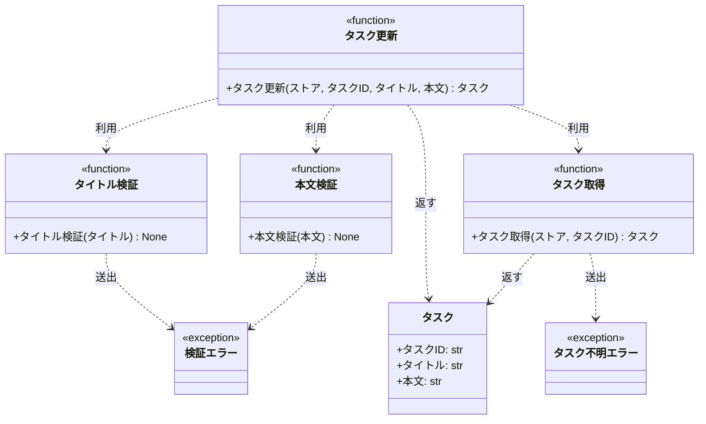

# モジュール構成: バックエンド / タスク

`タスク` ドメイン（バックエンド側）に属する構成要素詳細。

- 対応テストファイル: 未記入

## 一覧

| ユースケース | 役割 | コンテナ | 種別 | 名前 | 概要 | 補足 |
| --- | --- | --- | --- | --- | --- | --- |
| 共通 | ドメインモデル | `tasks/models.py` | データモデル | [`Task`](#タスク) | タスク 1 件 | - |
| 共通 | 例外 | `tasks/errors.py` | クラス | [`TaskNotFoundError`](#タスク不明エラー) | 指定 ID のタスクが存在しない | - |
| 共通 | 例外 | `tasks/errors.py` | クラス | [`ValidationError`](#検証エラー) | 入力値が制約を満たさない | - |
| 共通 | 定数 | `tasks/constants.py` | 定数 | `TITLE_MIN_LENGTH` | タイトルの最小文字数 | 値は `1` |
| 共通 | 定数 | `tasks/constants.py` | 定数 | `TITLE_MAX_LENGTH` | タイトルの最大文字数 | 値は `100` |
| 共通 | 定数 | `tasks/constants.py` | 定数 | `CONTENT_MAX_LENGTH` | 本文の最大文字数 | 値は `1000` |
| 共通 | クエリ | `tasks/service.py` | 関数 | [`get_task`](#タスク取得) | ストアからタスクを 1 件取得する | - |
| タスク更新 | バリデータ | `tasks/service.py` | 関数 | [`_validate_title`](#タイトル検証) | タイトルの文字数を検証する | - |
| タスク更新 | バリデータ | `tasks/service.py` | 関数 | [`_validate_content`](#本文検証) | 本文の文字数を検証する | - |
| タスク更新 | サービス | `tasks/service.py` | 関数 | [`update_task`](#タスク更新) | タスクのタイトルと本文を更新する | - |

## ディレクトリ構成

```
src/tasks/
├── models.py       # Task
├── errors.py       # TaskNotFoundError / ValidationError
├── constants.py    # 文字数制限の定数
└── service.py      # タスクの取得 / 更新と入力検証
```

## 構成図



## タスク
> 物理名: `Task`<br>
> 種別: データモデル<br>
> コンテナ: `tasks/models.py`

タスク 1 件を表す不変のドメインモデル。

### プロパティ

| 論理名 | プロパティ名 | 型 | 可視性 | デフォルト | 説明 | 例 | 補足 |
| --- | --- | --- | --- | --- | --- | --- | --- |
| タスク ID | `id` | `str` | 公開 | - | タスクの一意 ID | `"t1"` | - |
| タイトル | `title` | `str` | 公開 | - | タスク名 | `"買い物"` | - |
| 本文 | `content` | `str` | 公開 | `""` | タスクの詳細 | `"牛乳を買う"` | - |

### メソッド

なし

### 単体テスト

なし

### 補足

- `@dataclass(frozen=True, slots=True, kw_only=True)` の不変モデル。
  更新は既存インスタンスの書き換えではなく、値を差し替えた新しいインスタンスの生成で行う

## タスク不明エラー
> 物理名: `TaskNotFoundError`<br>
> 種別: クラス<br>
> コンテナ: `tasks/errors.py`

指定 ID のタスクがストアに存在しないときに送出する例外。

### プロパティ

なし

### メソッド

なし

### 単体テスト

なし

## 検証エラー
> 物理名: `ValidationError`<br>
> 種別: クラス<br>
> コンテナ: `tasks/errors.py`

入力値が制約を満たさないときに送出する例外。

### プロパティ

なし

### メソッド

なし

### 単体テスト

なし

## `tasks/service.py`
> 種別: ファイル

タスクの取得・更新と、更新時の入力検証を担う関数ファイル。
検証は外部ライブラリに依存せず、標準機能だけで行う。

---

### タスク取得
> 物理名: `get_task`<br>
> 種別: 関数

ストアからタスクを 1 件取得する。

#### 引数

| 論理名 | 引数名 | 型 | 必須 | デフォルト | 説明 | 補足 |
| --- | --- | --- | --- | --- | --- | --- |
| ストア | `store` | [`dict[str, Task]`](#タスク) | ✅ | - | タスク ID をキーにしたインメモリのタスクストア | - |
| タスク ID | `task_id` | `str` | ✅ | - | 取得対象のタスク ID | - |

引数例:

```python
get_task({"t1": Task(id="t1", title="買い物", content="牛乳を買う")}, "t1")
```

#### 戻り値

| 型 | 説明 | 補足 |
| --- | --- | --- |
| [`Task`](#タスク) | 取得したタスク | - |

戻り値例:

```python
Task(id="t1", title="買い物", content="牛乳を買う")
```

#### 処理

1. ストアに `task_id` のキーが存在するかを確かめる
   - 存在しない場合、`TaskNotFoundError` を送出する
2. 該当するタスクを返す

#### 例外

| 例外名 | 発生条件 | メッセージ | 補足 |
| --- | --- | --- | --- |
| `TaskNotFoundError` | `store` に `task_id` のキーが無い | `f"task not found: {task_id}"` | 既存実装のメッセージを維持する |

#### 単体テスト

セットアップ:

| セットアップ | 説明 | 補足 |
| --- | --- | --- |
| タスクストア | `t1`（タイトル `旧タイトル` / 本文 `旧本文`）を 1 件登録した dict を作る | 物理名 `_store` |

| テスト名 | 正常/異常 | 概要 | 条件 | Mock | 期待値 | 補足 |
| --- | --- | --- | --- | --- | --- | --- |
| `test_get_task` | 正常 | 登録済みの ID でタスクを取得する | `task_id` に `t1` を指定 | なし（インメモリのストアを実物のまま使う） | 登録済みの `Task` を返す | - |
| `test_get_task_when_task_missing` | 異常 | 未登録の ID を指定する | `task_id` に未登録の値を指定 | なし（インメモリのストアを実物のまま使う） | `TaskNotFoundError` を送出する | 例外表「`store` に `task_id` のキーが無い」に対応 |

---

### タイトル検証
> 物理名: `_validate_title`<br>
> 種別: 関数

タイトルの文字数が制限内かを検証する。

#### 引数

| 論理名 | 引数名 | 型 | 必須 | デフォルト | 説明 | 補足 |
| --- | --- | --- | --- | --- | --- | --- |
| タイトル | `title` | `str` | ✅ | - | 検証対象のタイトル | - |

引数例:

```python
_validate_title("買い物")
```

#### 戻り値

| 型 | 説明 | 補足 |
| --- | --- | --- |
| `None` | 値を返さない | 制限を満たさない場合は例外を送出する |

#### 処理

1. タイトルの文字数が `TITLE_MIN_LENGTH` 以上 `TITLE_MAX_LENGTH` 以下かを確かめる
   - 範囲外の場合、`ValidationError` を送出する

#### 例外

| 例外名 | 発生条件 | メッセージ | 補足 |
| --- | --- | --- | --- |
| `ValidationError` | 文字数が `TITLE_MIN_LENGTH` 未満、または `TITLE_MAX_LENGTH` 超過 | `f"タイトルは {TITLE_MIN_LENGTH} 文字以上 {TITLE_MAX_LENGTH} 文字以内で指定してください: {len(title)} 文字"` | 空文字は 0 文字として下限違反に含まれる |

#### 単体テスト

なし

制限内 / 下限違反 / 上限違反の分岐は [タスク更新](#タスク更新) の単体テストで網羅する（同一ファイル内のヘルパーは呼び出し元経由で検証する）。

---

### 本文検証
> 物理名: `_validate_content`<br>
> 種別: 関数

本文の文字数が制限内かを検証する。

#### 引数

| 論理名 | 引数名 | 型 | 必須 | デフォルト | 説明 | 補足 |
| --- | --- | --- | --- | --- | --- | --- |
| 本文 | `content` | `str` | ✅ | - | 検証対象の本文 | - |

引数例:

```python
_validate_content("牛乳を買う")
```

#### 戻り値

| 型 | 説明 | 補足 |
| --- | --- | --- |
| `None` | 値を返さない | 制限を満たさない場合は例外を送出する |

#### 処理

1. 本文の文字数が `CONTENT_MAX_LENGTH` 以下かを確かめる
   - 超過している場合、`ValidationError` を送出する

#### 例外

| 例外名 | 発生条件 | メッセージ | 補足 |
| --- | --- | --- | --- |
| `ValidationError` | 文字数が `CONTENT_MAX_LENGTH` 超過 | `f"本文は {CONTENT_MAX_LENGTH} 文字以内で指定してください: {len(content)} 文字"` | 下限は無い（空文字を許容する） |

#### 単体テスト

なし

制限内 / 上限違反の分岐は [タスク更新](#タスク更新) の単体テストで網羅する（同一ファイル内のヘルパーは呼び出し元経由で検証する）。

---

### タスク更新
> 物理名: `update_task`<br>
> 種別: 関数

登録済みのタスクのタイトルと本文を更新する。

#### 引数

| 論理名 | 引数名 | 型 | 必須 | デフォルト | 説明 | 補足 |
| --- | --- | --- | --- | --- | --- | --- |
| ストア | `store` | [`dict[str, Task]`](#タスク) | ✅ | - | タスク ID をキーにしたインメモリのタスクストア | 更新結果を書き戻す |
| タスク ID | `task_id` | `str` | ✅ | - | 更新対象のタスク ID | - |
| タイトル | `title` | `str` | ✅ | - | 更新後のタスク名 | `TITLE_MIN_LENGTH`〜`TITLE_MAX_LENGTH` 文字 |
| 本文 | `content` | `str` | - | `""` | 更新後の本文 | `CONTENT_MAX_LENGTH` 文字以内 |

引数例:

```python
update_task(store, "t1", "買い物", "牛乳を買う")
```

#### 戻り値

| 型 | 説明 | 補足 |
| --- | --- | --- |
| [`Task`](#タスク) | 更新後のタスク | ストアにも同じインスタンスが入る |

戻り値例:

```python
Task(id="t1", title="買い物", content="牛乳を買う")
```

#### 処理

1. タイトルを検証する（[タイトル検証](#タイトル検証)）
2. 本文を検証する（[本文検証](#本文検証)）
3. 更新対象のタスクを取得する（[タスク取得](#タスク取得)）
4. 取得したタスクのタイトルと本文を差し替えた新しいタスクを作る
5. 作ったタスクをストアへ書き戻して返す

#### 例外

| 例外名 | 発生条件 | メッセージ | 補足 |
| --- | --- | --- | --- |
| `ValidationError` | タイトルが制限外 | [タイトル検証](#タイトル検証) の例外表を参照 | [タイトル検証](#タイトル検証) から伝播する |
| `ValidationError` | 本文が制限外 | [本文検証](#本文検証) の例外表を参照 | [本文検証](#本文検証) から伝播する |
| `TaskNotFoundError` | `store` に `task_id` のキーが無い | [タスク取得](#タスク取得) の例外表を参照 | [タスク取得](#タスク取得) から伝播する |

#### 単体テスト

セットアップ:

| セットアップ | 説明 | 補足 |
| --- | --- | --- |
| タスクストア | `t1`（タイトル `旧タイトル` / 本文 `旧本文`）を 1 件登録した dict を作る | 物理名 `_store` |

| テスト名 | 正常/異常 | 概要 | 条件 | Mock | 期待値 | 補足 |
| --- | --- | --- | --- | --- | --- | --- |
| `test_update_task` | 正常 | タイトルと本文を更新する | `t1` に新しいタイトルと本文を指定 | なし（インメモリのストアを実物のまま使う） | 更新後の `Task` を返し、ストアの `t1` も更新後の値になる | - |
| `test_update_task_when_content_omitted` | 正常 | 本文を省略する | `content` を渡さない | なし（インメモリのストアを実物のまま使う） | 返る `Task` の本文が `""` になる | 引数のデフォルト値の分岐 |
| `test_update_task_when_title_empty` | 異常 | タイトルに空文字を指定する | `title` に `""` を指定 | なし（インメモリのストアを実物のまま使う） | `ValidationError` を送出し、ストアが変わらない | 例外表「タイトルが制限外」に対応 |
| `test_update_task_when_title_too_long` | 異常 | タイトルが上限を超える | `title` に 101 文字を指定 | なし（インメモリのストアを実物のまま使う） | `ValidationError` を送出し、ストアが変わらない | 例外表「タイトルが制限外」に対応 |
| `test_update_task_when_content_too_long` | 異常 | 本文が上限を超える | `content` に 1001 文字を指定 | なし（インメモリのストアを実物のまま使う） | `ValidationError` を送出し、ストアが変わらない | 例外表「本文が制限外」に対応 |
| `test_update_task_when_task_missing` | 異常 | 未登録の ID を更新する | `task_id` に未登録の値を指定 | なし（インメモリのストアを実物のまま使う） | `TaskNotFoundError` を送出し、ストアが変わらない | 例外表「`store` に `task_id` のキーが無い」に対応 |

### 補足

- ストアはインメモリの dict を引数で受け取る（永続化層は本サブシステムのスコープ外）
- 検証を取得より先に行う理由は、`設計図/インターフェース定義/バックエンド/タスク更新.py.md` の正常系フローが「入力値の検証 → タスクを更新」の順で、異常系（タイトルが空）のフローがストアに触れないため
