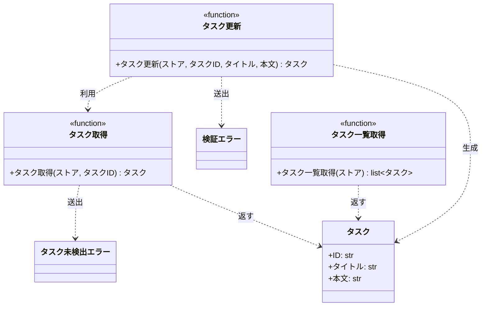

# モジュール構成: バックエンド / タスク

現状の実装から起こしたモジュール構成。

- 対応テストファイル: `tests/unit/tasks/test_service.py`

## 一覧

| ユースケース | 役割 | コンテナ | 種別 | 名前 | 概要 | 補足 |
| --- | --- | --- | --- | --- | --- | --- |
| 共通 | ドメインモデル | `src/tasks/models.py` | データモデル | [`Task`](#タスク) | タスク 1 件 | - |
| 共通 | 例外 | `src/tasks/errors.py` | クラス | [`TaskNotFoundError`](#タスク未検出エラー) | 指定 ID のタスクが存在しない | - |
| 共通 | 例外 | `src/tasks/errors.py` | クラス | [`ValidationError`](#検証エラー) | 入力値が制約を満たさない | - |
| 共通 | 取得 | `src/tasks/service.py` | 関数 | [`get_task`](#タスク取得) | ストアからタスクを 1 件取得する | 現状は [タスク更新](#タスク更新) からのみ呼ばれる |
| タスク編集 | 定数 | `src/tasks/service.py` | 定数 | `TITLE_MIN_LENGTH` | タイトルの最小文字数（`1`） | 単純即値のため詳細セクションなし |
| タスク編集 | 定数 | `src/tasks/service.py` | 定数 | `TITLE_MAX_LENGTH` | タイトルの最大文字数（`100`） | 単純即値のため詳細セクションなし |
| タスク編集 | 定数 | `src/tasks/service.py` | 定数 | `CONTENT_MAX_LENGTH` | 本文の最大文字数（`1000`） | 単純即値のため詳細セクションなし |
| タスク編集 | サービス | `src/tasks/service.py` | 関数 | [`update_task`](#タスク更新) | タスクのタイトルと本文を更新する | - |
| タスク一覧 | サービス | `src/tasks/service.py` | 関数 | [`list_tasks`](#タスク一覧取得) | ストアのタスクを ID 順で一覧にする | 本 subsystem の担当範囲外だが同一ファイルにあるため載せる |

## ディレクトリ構成

```
src/tasks/
├── __init__.py   # 空（パッケージ宣言のみ）
├── models.py     # Task
├── errors.py     # TaskNotFoundError / ValidationError
└── service.py    # 検証用の定数と get_task / update_task / list_tasks
```

## 構成図



## タスク
> 物理名: `Task`<br>
> 種別: データモデル<br>
> コンテナ: `src/tasks/models.py`

タスク 1 件を表すデータモデル。

### プロパティ

| 論理名 | プロパティ名 | 型 | 可視性 | デフォルト | 説明 | 例 | 補足 |
| --- | --- | --- | --- | --- | --- | --- | --- |
| ID | `id` | `str` | 公開 | - | タスクの識別子 | `"t1"` | 採番の実装は本リポジトリに存在しない |
| タイトル | `title` | `str` | 公開 | - | タスクのタイトル | `"新タイトル"` | - |
| 本文 | `content` | `str` | 公開 | `""` | タスクの本文 | `"新本文"` | - |

### メソッド

なし

### 単体テスト

なし

### 補足

- `@dataclass(frozen=True, slots=True, kw_only=True)` で定義されており、生成後の書き換えはできない。
  更新は [タスク更新](#タスク更新) が新しいインスタンスを作り直す形で行う
- キーワード引数でのみ生成できる

## タスク未検出エラー
> 物理名: `TaskNotFoundError`<br>
> 種別: クラス<br>
> コンテナ: `src/tasks/errors.py`

指定 ID のタスクが存在しないときに送出する例外。

### プロパティ

なし

### メソッド

なし

### 単体テスト

なし

### 補足

- `Exception` を直接継承しており、独自の属性・メソッドは持たない

## 検証エラー
> 物理名: `ValidationError`<br>
> 種別: クラス<br>
> コンテナ: `src/tasks/errors.py`

入力値が制約を満たさないときに送出する例外。

### プロパティ

なし

### メソッド

なし

### 単体テスト

なし

### 補足

- `Exception` を直接継承しており、独自の属性・メソッドは持たない
- 標準ライブラリや Pydantic の同名例外とは無関係の独自定義

## `src/tasks/service.py`
> 種別: ファイル

タスクのドメインロジックを束ねる関数ファイル。
タスクの取得・更新・一覧と、更新時の検証に使う長さの定数を持つ。

---

### タスク取得
> 物理名: `get_task`<br>
> 種別: 関数

ストアからタスクを 1 件取得する。

#### 引数

| 論理名 | 引数名 | 型 | 必須 | デフォルト | 説明 | 補足 |
| --- | --- | --- | --- | --- | --- | --- |
| ストア | `store` | [`dict[str, Task]`](#タスク) | ✅ | - | タスク ID をキーにしたタスクの辞書 | 呼び出し側が保持する |
| タスク ID | `task_id` | `str` | ✅ | - | 取得対象のタスク ID | - |

引数例:

```py
get_task({"t1": Task(id="t1", title="旧タイトル", content="旧本文")}, "t1")
```

#### 戻り値

| 型 | 説明 | 補足 |
| --- | --- | --- |
| [`Task`](#タスク) | 取得したタスク | - |

戻り値例:

```py
Task(id="t1", title="旧タイトル", content="旧本文")
```

#### 処理

1. 未登録の ID は例外にする
   - `task_id` が `store` のキーに無い場合、`TaskNotFoundError` を送出する
2. `store` から `task_id` のタスクを取り出して返す

#### 例外

| 例外名 | 発生条件 | メッセージ | 補足 |
| --- | --- | --- | --- |
| `TaskNotFoundError` | `task_id` が `store` のキーに無い | `"task not found: {task_id}"` | - |

#### 単体テスト

なし

---

### タスク更新
> 物理名: `update_task`<br>
> 種別: 関数

登録済みタスクのタイトルと本文を更新して返す。

#### 引数

| 論理名 | 引数名 | 型 | 必須 | デフォルト | 説明 | 補足 |
| --- | --- | --- | --- | --- | --- | --- |
| ストア | `store` | [`dict[str, Task]`](#タスク) | ✅ | - | タスク ID をキーにしたタスクの辞書 | 呼び出し側が保持する |
| タスク ID | `task_id` | `str` | ✅ | - | 更新対象のタスク ID | - |
| タイトル | `title` | `str` | ✅ | - | 更新後のタイトル | 1 文字以上 100 文字以内 |
| 本文 | `content` | `str` | - | `""` | 更新後の本文 | 1000 文字以内。省略すると空文字で上書きする |

引数例:

```py
update_task({"t1": Task(id="t1", title="旧タイトル", content="旧本文")}, "t1", "新タイトル", "新本文")
```

#### 戻り値

| 型 | 説明 | 補足 |
| --- | --- | --- |
| [`Task`](#タスク) | 更新後のタスク | `store` にも同じインスタンスが書き戻される |

戻り値例:

```py
Task(id="t1", title="新タイトル", content="新本文")
```

#### 処理

1. タイトルを検証する
   - `title` の文字数が `TITLE_MIN_LENGTH` 以上 `TITLE_MAX_LENGTH` 以内でない場合、`ValidationError` を送出する
2. 本文を検証する
   - `content` の文字数が `CONTENT_MAX_LENGTH` を超える場合、`ValidationError` を送出する
3. 対象タスクを取得する（[タスク取得](#タスク取得)）
4. 差し替えたタスクを書き戻して返す
   - `id` は取得したタスクの値を引き継ぎ、`title` / `content` は引数の値で新しいインスタンスを作る

#### 例外

| 例外名 | 発生条件 | メッセージ | 補足 |
| --- | --- | --- | --- |
| `ValidationError` | `title` の文字数が 1 未満または 100 超 | `"title は 1 文字以上 100 文字以内"` | 上限・下限は定数から埋め込まれる |
| `ValidationError` | `content` の文字数が 1000 超 | `"content は 1000 文字以内"` | 上限は定数から埋め込まれる |

`TaskNotFoundError` は [タスク取得](#タスク取得) からそのまま伝播する。

#### 単体テスト

セットアップ:

| セットアップ | 説明 | 補足 |
| --- | --- | --- |
| タスクストア | `t1`（タイトル `旧タイトル` / 本文 `旧本文`）を 1 件だけ持つ辞書 | `_store()` |

| テスト名 | 正常/異常 | 概要 | 条件 | Mock | 期待値 | 補足 |
| --- | --- | --- | --- | --- | --- | --- |
| `test_update_task` | 正常 | タイトルと本文を更新する | `t1` に `新タイトル` / `新本文` を渡す | なし | 戻り値と `store["t1"]` が新しい内容になる | - |
| `test_update_task_when_content_omitted` | 正常 | 本文を省略する | `content` を渡さない | なし | 戻り値の `content` が空文字になる | - |
| `test_update_task_when_title_empty` | 異常 | タイトルが空 | `title` に空文字を渡す | なし | `ValidationError` を送出 | 例外表「`title` の文字数が 1 未満または 100 超」に対応 |
| `test_update_task_when_title_too_long` | 異常 | タイトルが 101 文字 | `title` に `a` × 101 を渡す | なし | `ValidationError` を送出 | 例外表「`title` の文字数が 1 未満または 100 超」に対応 |
| `test_update_task_when_content_too_long` | 異常 | 本文が 1001 文字 | `content` に `a` × 1001 を渡す | なし | `ValidationError` を送出 | 例外表「`content` の文字数が 1000 超」に対応 |
| `test_update_task_when_task_missing` | 異常 | 未登録のタスク ID | `task_id` に `missing` を渡す | なし | `TaskNotFoundError` を送出し `store["t1"]` が変わらない | [タスク取得](#タスク取得) からの伝播を確認している |

---

### タスク一覧取得
> 物理名: `list_tasks`<br>
> 種別: 関数

ストアのタスクを ID 順で一覧にする。

#### 引数

| 論理名 | 引数名 | 型 | 必須 | デフォルト | 説明 | 補足 |
| --- | --- | --- | --- | --- | --- | --- |
| ストア | `store` | [`dict[str, Task]`](#タスク) | ✅ | - | タスク ID をキーにしたタスクの辞書 | 呼び出し側が保持する |

引数例:

```py
list_tasks({"t1": Task(id="t1", title="旧タイトル", content="旧本文")})
```

#### 戻り値

| 型 | 説明 | 補足 |
| --- | --- | --- |
| [`list[Task]`](#タスク) | タスク ID の昇順に並べたタスク | 空の `store` では空リストになる |

戻り値例:

```py
[Task(id="t1", title="旧タイトル", content="旧本文")]
```

#### 処理

1. `store` のキーを昇順に並べ、その順でタスクを取り出してリストにして返す

#### 例外

なし

#### 単体テスト

なし

---

### 補足

- 永続化層は持たず、タスクは呼び出し側が渡す `dict[str, Task]` の上に載る。
  プロセスをまたいで残る保存先の実装は本リポジトリに存在しない
- 検証は [タスク更新](#タスク更新) の中で直接行っており、専用のバリデータ関数には切り出されていない
- [タスク取得](#タスク取得) / [タスク一覧取得](#タスク一覧取得) には単体テストが無く、`tests/unit/tasks/test_service.py` は [タスク更新](#タスク更新) だけを対象にしている
