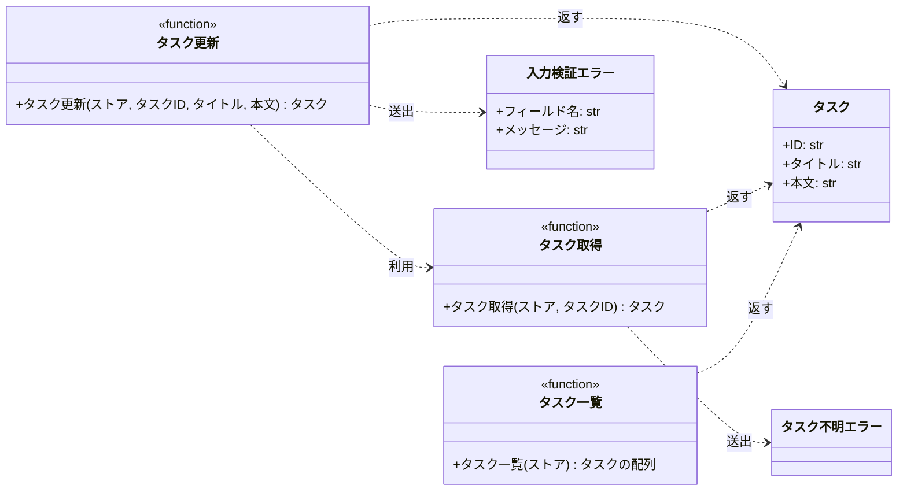

# モジュール構成: バックエンド / タスク

`タスク` ドメイン（バックエンド側）に属する構成要素詳細。

- 対応テストファイル: `tests/unit/tasks/test_service.py`

## 一覧

| ユースケース | 役割 | コンテナ | 種別 | 名前 | 概要 | 補足 |
| --- | --- | --- | --- | --- | --- | --- |
| 共通 | ドメインモデル | `src/tasks/models.py` | データモデル | [`Task`](#タスク) | タスク 1 件 | - |
| 共通 | 例外 | `src/tasks/errors.py` | クラス | [`TaskNotFoundError`](#タスク不明エラー) | 指定 ID のタスクが存在しない | - |
| 共通 | 例外 | `src/tasks/errors.py` | クラス | [`ValidationError`](#入力検証エラー) | 入力値が制約を満たさない | 失敗したフィールド名を持つ |
| 共通 | 定数 | `src/tasks/service.py` | 定数 | `TITLE_MIN_LENGTH` | タイトルの最小文字数 | 値は `1` |
| 共通 | 定数 | `src/tasks/service.py` | 定数 | `TITLE_MAX_LENGTH` | タイトルの最大文字数 | 値は `100` |
| 共通 | 定数 | `src/tasks/service.py` | 定数 | `CONTENT_MAX_LENGTH` | 本文の最大文字数 | 値は `1000` |
| 共通 | サービス | `src/tasks/service.py` | 関数 | [`get_task`](#タスク取得) | ストアからタスクを 1 件取得する | - |
| 共通 | サービス | `src/tasks/service.py` | 関数 | [`list_tasks`](#タスク一覧) | ストアのタスクを ID 順で一覧にする | - |
| タスク更新 | サービス | `src/tasks/service.py` | 関数 | [`update_task`](#タスク更新) | タイトルと本文を更新する | - |

## ディレクトリ構成

```
src/tasks/
├── models.py     # Task
├── errors.py     # TaskNotFoundError / ValidationError
└── service.py    # タスク取得 / タスク一覧 / タスク更新
```

## 構成図



## タスク
> 物理名: `Task`<br>
> 種別: データモデル<br>
> コンテナ: `src/tasks/models.py`

タスク 1 件を表す不変のデータモデル。

### プロパティ

| 論理名 | プロパティ名 | 型 | 可視性 | デフォルト | 説明 | 例 | 補足 |
| --- | --- | --- | --- | --- | --- | --- | --- |
| ID | `id` | `str` | 公開 | - | タスクの一意な識別子 | `"t1"` | ストアのキーと一致させる |
| タイトル | `title` | `str` | 公開 | - | タスク名 | `"新タイトル"` | - |
| 本文 | `content` | `str` | 公開 | `""` | タスクの説明 | `"新本文"` | - |

### メソッド

なし

### 単体テスト

なし

### 補足

- `frozen=True` の dataclass にし、更新は新しいインスタンスへの差し替えで行う

## タスク不明エラー
> 物理名: `TaskNotFoundError`<br>
> 種別: クラス<br>
> コンテナ: `src/tasks/errors.py`

指定した ID のタスクがストアに存在しないことを表す例外。

### プロパティ

なし

### メソッド

なし

### 単体テスト

なし

## 入力検証エラー
> 物理名: `ValidationError`<br>
> 種別: クラス<br>
> コンテナ: `src/tasks/errors.py`

入力値が制約を満たさないことを表す例外。
どのフィールドで失敗したかを呼び出し元が機械的に判別できるように、フィールド名を保持する。

### プロパティ

| 論理名 | プロパティ名 | 型 | 可視性 | デフォルト | 説明 | 例 | 補足 |
| --- | --- | --- | --- | --- | --- | --- | --- |
| フィールド名 | `field` | `Literal["title", "content"]` | 公開 | - | 検証に失敗した入力の名前 | `"title"` | 呼び出し元がエラーの表示位置を決めるのに使う |
| メッセージ | `message` | `str` | 公開 | - | 失敗した理由 | `"タイトルは 1 文字以上 100 文字以内で入力してください"` | 利用者にそのまま見せる文言 |

### メソッド

なし

### 単体テスト

なし

## `src/tasks/service.py`
> 種別: ファイル

タスクの取得・一覧・更新を担う関数ファイル。
ストアは呼び出し元から [タスク](#タスク) を値に持つ辞書として受け取る。

---

### タスク取得
> 物理名: `get_task`<br>
> 種別: 関数

ストアからタスクを 1 件取得する。

#### 引数

| 論理名 | 引数名 | 型 | 必須 | デフォルト | 説明 | 補足 |
| --- | --- | --- | --- | --- | --- | --- |
| ストア | `store` | [`dict[str, Task]`](#タスク) | ✅ | - | タスクを保持する辞書 | 呼び出し元が注入する |
| タスク ID | `task_id` | `str` | ✅ | - | 取得対象のタスク ID | - |

引数例:

```python
get_task(store, "t1")
```

#### 戻り値

| 型 | 説明 | 補足 |
| --- | --- | --- |
| [`Task`](#タスク) | 取得したタスク | - |

戻り値例:

```python
Task(id="t1", title="旧タイトル", content="旧本文")
```

#### 処理

1. `task_id` がストアに存在するかを確かめる
   - 存在しない場合、`TaskNotFoundError` を送出する
2. ストアから該当するタスクを返す

#### 例外

| 例外名 | 発生条件 | メッセージ | 補足 |
| --- | --- | --- | --- |
| [`TaskNotFoundError`](#タスク不明エラー) | `task_id` がストアに存在しない | `"タスクが見つかりません: {task_id}"` | - |

#### 単体テスト

セットアップ:

| セットアップ | 説明 | 補足 |
| --- | --- | --- |
| ストア | `t1` のタスク 1 件を持つ辞書を作る | `_store()` |

| テスト名 | 正常/異常 | 概要 | 条件 | Mock | 期待値 | 補足 |
| --- | --- | --- | --- | --- | --- | --- |
| `test_get_task` | 正常 | 登録済みのタスクを取得する | `task_id` に `"t1"` | なし（インメモリのストアを実物のまま使う） | `t1` のタスクを返す | - |
| `test_get_task_when_task_missing` | 異常 | 未登録の ID を指定する | `task_id` に `"missing"` | なし（インメモリのストアを実物のまま使う） | `TaskNotFoundError` を送出する | 例外表「`task_id` がストアに存在しない」に対応 |

---

### タスク一覧
> 物理名: `list_tasks`<br>
> 種別: 関数

ストアのタスクを ID の昇順で一覧にする。

#### 引数

| 論理名 | 引数名 | 型 | 必須 | デフォルト | 説明 | 補足 |
| --- | --- | --- | --- | --- | --- | --- |
| ストア | `store` | [`dict[str, Task]`](#タスク) | ✅ | - | タスクを保持する辞書 | 呼び出し元が注入する |

引数例:

```python
list_tasks(store)
```

#### 戻り値

| 型 | 説明 | 補足 |
| --- | --- | --- |
| [`list[Task]`](#タスク) | ID の昇順に並べたタスク | ストアが空なら空のリスト |

戻り値例:

```python
[Task(id="t1", title="新タイトル", content="新本文")]
```

#### 処理

1. ストアのキーを昇順に並べ、対応するタスクをその順で集めて返す

#### 例外

なし

#### 単体テスト

| テスト名 | 正常/異常 | 概要 | 条件 | Mock | 期待値 | 補足 |
| --- | --- | --- | --- | --- | --- | --- |
| `test_list_tasks` | 正常 | ID の昇順に並べる | `t2` / `t1` の順に入れた辞書 | なし（インメモリのストアを実物のまま使う） | `t1` / `t2` の順のリストを返す | - |
| `test_list_tasks_when_store_empty` | 正常 | 空のストアを渡す | 空の辞書 | なし（インメモリのストアを実物のまま使う） | 空のリストを返す | - |

---

### タスク更新
> 物理名: `update_task`<br>
> 種別: 関数

登録済みタスクのタイトルと本文を更新して返す。

#### 引数

| 論理名 | 引数名 | 型 | 必須 | デフォルト | 説明 | 補足 |
| --- | --- | --- | --- | --- | --- | --- |
| ストア | `store` | [`dict[str, Task]`](#タスク) | ✅ | - | タスクを保持する辞書 | 呼び出し元が注入する |
| タスク ID | `task_id` | `str` | ✅ | - | 更新対象のタスク ID | - |
| タイトル | `title` | `str` | ✅ | - | 更新後のタスク名 | 1 文字以上 100 文字以内 |
| 本文 | `content` | `str` | - | `""` | 更新後の説明 | 1000 文字以内。省略時は空文字で上書きする |

引数例:

```python
update_task(store, "t1", "新タイトル", "新本文")
```

#### 戻り値

| 型 | 説明 | 補足 |
| --- | --- | --- |
| [`Task`](#タスク) | 更新後のタスク | ストアに書き戻したものと同じインスタンス |

戻り値例:

```python
Task(id="t1", title="新タイトル", content="新本文")
```

#### 処理

1. タイトルの文字数を検証する
   - `TITLE_MIN_LENGTH` 未満 or `TITLE_MAX_LENGTH` 超の場合、`ValidationError` を送出する
2. 本文の文字数を検証する
   - `CONTENT_MAX_LENGTH` 超の場合、`ValidationError` を送出する
3. 更新対象のタスクを取得する（[タスク取得](#タスク取得)）
4. タイトルと本文を差し替えたタスクを作り、ストアに書き戻して返す

#### 例外

| 例外名 | 発生条件 | メッセージ | 補足 |
| --- | --- | --- | --- |
| [`ValidationError`](#入力検証エラー) | `title` が `TITLE_MIN_LENGTH` 未満 or `TITLE_MAX_LENGTH` 超 | `"タイトルは 1 文字以上 100 文字以内で入力してください"` | `field` は `"title"` |
| [`ValidationError`](#入力検証エラー) | `content` が `CONTENT_MAX_LENGTH` 超 | `"本文は 1000 文字以内で入力してください"` | `field` は `"content"` |

#### 単体テスト

セットアップ:

| セットアップ | 説明 | 補足 |
| --- | --- | --- |
| ストア | `t1` のタスク 1 件を持つ辞書を作る | `_store()` |

| テスト名 | 正常/異常 | 概要 | 条件 | Mock | 期待値 | 補足 |
| --- | --- | --- | --- | --- | --- | --- |
| `test_update_task` | 正常 | タイトルと本文を更新する | `title` と `content` の両方を渡す | なし（インメモリのストアを実物のまま使う） | 更新後のタスクを返し、ストアの `t1` も更新後の値になる | - |
| `test_update_task_when_content_omitted` | 正常 | 本文を省略する | `content` を渡さない | なし（インメモリのストアを実物のまま使う） | 返るタスクとストアの `t1` の本文が空文字になる | デフォルト値の分岐 |
| `test_update_task_when_title_empty` | 異常 | タイトルが空 | `title` に空文字 | なし（インメモリのストアを実物のまま使う） | `ValidationError` を送出し、`field` が `"title"`。ストアは不変 | 例外表「`title` が `TITLE_MIN_LENGTH` 未満 or `TITLE_MAX_LENGTH` 超」に対応 |
| `test_update_task_when_title_too_long` | 異常 | タイトルが上限超過 | `title` に 101 文字 | なし（インメモリのストアを実物のまま使う） | `ValidationError` を送出し、`field` が `"title"`。ストアは不変 | 例外表「`title` が `TITLE_MIN_LENGTH` 未満 or `TITLE_MAX_LENGTH` 超」に対応 |
| `test_update_task_when_content_too_long` | 異常 | 本文が上限超過 | `content` に 1001 文字 | なし（インメモリのストアを実物のまま使う） | `ValidationError` を送出し、`field` が `"content"`。ストアは不変 | 例外表「`content` が `CONTENT_MAX_LENGTH` 超」に対応 |
| `test_update_task_when_task_missing` | 異常 | 未登録の ID を指定する | `task_id` に `"missing"` | なし（インメモリのストアを実物のまま使う） | `TaskNotFoundError` を送出し、ストアは不変 | [タスク取得](#タスク取得) の分岐に入る |

### 補足

- 検証はタスクの取得より先に行うため、未登録 ID と入力不正が同時に起きた場合は `ValidationError` が出る
- 更新は全置換で、部分更新は扱わない（呼び出し元が更新後の全項目を渡す）
