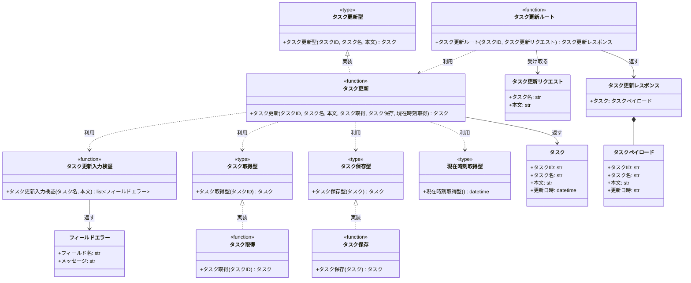

# モジュール構成: バックエンド / タスク

`タスク` ドメイン（バックエンド側）に属する構成要素詳細。

## 一覧

| ユースケース | 役割 | コンテナ | 種別 | 名前 | 概要 | 補足 |
| --- | --- | --- | --- | --- | --- | --- |
| 共通 | ドメインモデル | `features/tasks/types.py` | データモデル | [`Task`](#タスク) | タスク 1 件を表す内部 DTO | - |
| 共通 | 定数 | `features/tasks/types.py` | 定数 | `TITLE_MAX_LENGTH` | タスク名の最大文字数（100） | 単純即値のため詳細セクションなし |
| タスク編集 | リクエスト DTO | `features/tasks/types.py` | データモデル | [`UpdateTaskRequest`](#タスク更新リクエスト) | 更新リクエストのボディ | - |
| タスク編集 | レスポンス DTO | `features/tasks/types.py` | データモデル | [`UpdateTaskResponse`](#タスク更新レスポンス) | 更新レスポンスのボディ | - |
| タスク編集 | レスポンス DTO | `features/tasks/types.py` | データモデル | [`TaskPayload`](#タスクペイロード) | レスポンスのタスク部分 | - |
| タスク編集 | エラー明細 DTO | `features/tasks/types.py` | データモデル | [`FieldError`](#フィールドエラー) | フィールド単位の検証エラー | - |
| タスク編集 | 取得型（DI） | `features/tasks/types.py` | 関数型 | [`FindTask`](#タスク取得型) | タスク 1 件取得のシグネチャ | - |
| タスク編集 | 保存型（DI） | `features/tasks/types.py` | 関数型 | [`SaveTask`](#タスク保存型) | タスク保存のシグネチャ | - |
| タスク編集 | 時刻型（DI） | `features/tasks/types.py` | 関数型 | [`NowFn`](#現在時刻取得型) | 現在時刻取得のシグネチャ | テストで固定値に差し替える |
| タスク編集 | サービス型（DI） | `features/tasks/types.py` | 関数型 | [`UpdateTask`](#タスク更新型) | タスク更新のシグネチャ | 配線済み関数の型 |
| タスク編集 | バリデータ | `features/tasks/service.py` | 関数 | [`validate_update_task_input`](#タスク更新入力検証) | 更新入力を検証してエラー一覧を返す | - |
| タスク編集 | サービス | `features/tasks/service.py` | 関数 | [`update_task`](#タスク更新) | 検証を通ったタスクを更新する | - |
| タスク編集 | リポジトリ | `features/tasks/db.py` | 関数 | [`find_task_by_id`](#タスク取得) | ID でタスクを 1 件取得 | - |
| タスク編集 | リポジトリ | `features/tasks/db.py` | 関数 | [`save_task`](#タスク保存) | タスクを保存 | - |
| タスク編集 | ハンドラ | `features/tasks/route.py` | 関数 | [`update_task_route`](#タスク更新ルート) | `PUT /tasks/{task_id}` のハンドラ | - |

## ディレクトリ構成

```
src/app/features/tasks/
├── __init__.py   # 公開シンボル（update_task / router）
├── types.py      # Task / 各 DTO / 関数型 / 定数
├── service.py    # 入力検証と更新のドメインロジック
├── db.py         # tasks テーブルの読み書き
└── route.py      # PUT /tasks/{task_id}
```

## 構成図



## タスク
> 物理名: `Task`<br>
> 種別: データモデル<br>
> コンテナ: `features/tasks/types.py`

タスク 1 件を表す内部 DTO。

### プロパティ

| 論理名 | プロパティ名 | 型 | 可視性 | デフォルト | 説明 | 例 | 補足 |
| --- | --- | --- | --- | --- | --- | --- | --- |
| タスク ID | `id` | `str` | 公開 | - | タスクの一意 ID | `"3f2b1c88-..."` | - |
| タスク名 | `title` | `str` | 公開 | - | タスク名 | `"決算資料の作成"` | - |
| 本文 | `body` | `str` | 公開 | - | タスク本文 | `"四半期分の売上を集計する"` | - |
| 更新日時 | `updated_at` | `datetime` | 公開 | - | 最終更新日時（UTC） | `2026-07-27T04:18:02+00:00` | 画面表示時に JST へ変換する |

### メソッド

なし

### 単体テスト

なし

### 補足

- 関数間で受け渡す内部 DTO のため `@dataclass(frozen=True, slots=True, kw_only=True)` で定義する

## タスク更新リクエスト
> 物理名: `UpdateTaskRequest`<br>
> 種別: データモデル<br>
> コンテナ: `features/tasks/types.py`

`PUT /tasks/{task_id}` のリクエストボディ。

### プロパティ

| 論理名 | プロパティ名 | 型 | 可視性 | デフォルト | 説明 | 例 | 補足 |
| --- | --- | --- | --- | --- | --- | --- | --- |
| タスク名 | `title` | `str` | 公開 | - | 更新後のタスク名 | `"決算資料の作成"` | 文字数の検証は [タスク更新入力検証](#タスク更新入力検証) が行う |
| 本文 | `body` | `str` | 公開 | - | 更新後の本文 | `"四半期分の売上を集計する"` | 空文字可 |

### メソッド

なし

### 単体テスト

なし

### 補足

- 外部 HTTP 境界の DTO のため `pydantic.BaseModel` で定義する
- 文字数・空文字の検証は Pydantic の `Field` ではなく [タスク更新入力検証](#タスク更新入力検証) に集約する（フィールド単位のエラーを 1 度に全件返すため）

## タスク更新レスポンス
> 物理名: `UpdateTaskResponse`<br>
> 種別: データモデル<br>
> コンテナ: `features/tasks/types.py`

`PUT /tasks/{task_id}` の成功時レスポンスボディ。

### プロパティ

| 論理名 | プロパティ名 | 型 | 可視性 | デフォルト | 説明 | 例 | 補足 |
| --- | --- | --- | --- | --- | --- | --- | --- |
| タスク | `task` | [`TaskPayload`](#タスクペイロード) | 公開 | - | 更新後のタスク | - | - |

### メソッド

なし

### 単体テスト

なし

## タスクペイロード
> 物理名: `TaskPayload`<br>
> 種別: データモデル<br>
> コンテナ: `features/tasks/types.py`

レスポンスに載せるタスク 1 件の表現。

### プロパティ

| 論理名 | プロパティ名 | 型 | 可視性 | デフォルト | 説明 | 例 | 補足 |
| --- | --- | --- | --- | --- | --- | --- | --- |
| タスク ID | `id` | `str` | 公開 | - | タスクの一意 ID | `"3f2b1c88-..."` | - |
| タスク名 | `title` | `str` | 公開 | - | 更新後のタスク名 | `"決算資料の作成"` | - |
| 本文 | `body` | `str` | 公開 | - | 更新後の本文 | `"四半期分の売上を集計する"` | - |
| 更新日時 | `updated_at` | `str` | 公開 | - | 最終更新日時（ISO 8601・UTC） | `"2026-07-27T04:18:02+00:00"` | [タスク](#タスク) の `datetime` を文字列化した値 |

### メソッド

なし

### 単体テスト

なし

## フィールドエラー
> 物理名: `FieldError`<br>
> 種別: データモデル<br>
> コンテナ: `features/tasks/types.py`

どのフィールドが、なぜ不正だったかを表す検証エラー 1 件。

### プロパティ

| 論理名 | プロパティ名 | 型 | 可視性 | デフォルト | 説明 | 例 | 補足 |
| --- | --- | --- | --- | --- | --- | --- | --- |
| フィールド名 | `field` | `Literal["title", "body"]` | 公開 | - | 不正だったフィールド | `"title"` | 画面のインライン表示位置の決定に使う |
| メッセージ | `message` | `str` | 公開 | - | 画面に表示する理由 | `"タスク名を入力してください"` | - |

### メソッド

なし

### 単体テスト

なし

## `features/tasks/types.py`
> 種別: ファイル

タスクドメインの DTO・関数型・定数を置くファイル。

---

### タスク取得型
> 物理名: `FindTask`<br>
> 種別: 関数型

タスクを 1 件取得する関数のシグネチャ。

#### 引数

| 論理名 | 引数名 | 型 | 必須 | デフォルト | 説明 | 補足 |
| --- | --- | --- | --- | --- | --- | --- |
| タスク ID | `task_id` | `str` | ✅ | - | 取得対象のタスク ID | - |

#### 戻り値

| 型 | 説明 | 補足 |
| --- | --- | --- |
| [`Task \| None`](#タスク) | 見つかったタスク | 見つからない場合は `None` |

#### 実装

| 実装 | 補足 |
| --- | --- |
| [タスク取得](#タスク取得) | 本番の実装（tasks テーブルを読む） |

---

### タスク保存型
> 物理名: `SaveTask`<br>
> 種別: 関数型

タスクを保存する関数のシグネチャ。

#### 引数

| 論理名 | 引数名 | 型 | 必須 | デフォルト | 説明 | 補足 |
| --- | --- | --- | --- | --- | --- | --- |
| タスク | `task` | [`Task`](#タスク) | ✅ | - | 保存するタスク | `id` で対象行を特定する |

#### 戻り値

| 型 | 説明 | 補足 |
| --- | --- | --- |
| [`Task`](#タスク) | 保存後のタスク | - |

#### 実装

| 実装 | 補足 |
| --- | --- |
| [タスク保存](#タスク保存) | 本番の実装（tasks テーブルを更新する） |

---

### 現在時刻取得型
> 物理名: `NowFn`<br>
> 種別: 関数型

現在時刻を返す関数のシグネチャ。

#### 引数

なし

#### 戻り値

| 型 | 説明 | 補足 |
| --- | --- | --- |
| `datetime` | 現在時刻（UTC） | - |

#### 実装

| 実装 | 補足 |
| --- | --- |
| `now_utc` | 本番の実装（`shared/utils.py`） |

---

### タスク更新型
> 物理名: `UpdateTask`<br>
> 種別: 関数型

依存を配線済みのタスク更新関数のシグネチャ。

#### 引数

| 論理名 | 引数名 | 型 | 必須 | デフォルト | 説明 | 補足 |
| --- | --- | --- | --- | --- | --- | --- |
| タスク ID | `task_id` | `str` | ✅ | - | 更新対象のタスク ID | - |
| タスク名 | `title` | `str` | ✅ | - | 更新後のタスク名 | - |
| 本文 | `body` | `str` | ✅ | - | 更新後の本文 | - |

#### 戻り値

| 型 | 説明 | 補足 |
| --- | --- | --- |
| [`Task`](#タスク) | 更新後のタスク | - |

#### 実装

| 実装 | 補足 |
| --- | --- |
| [タスク更新](#タスク更新) | 本番の実装（composition root で `find` / `save` / `now` を注入する） |

## `features/tasks/service.py`
> 種別: ファイル

タスク更新のドメインロジックを束ねる関数ファイル。

---

### タスク更新入力検証
> 物理名: `validate_update_task_input`<br>
> 種別: 関数

更新入力を検証し、不正なフィールドのエラー一覧を返す。

#### 引数

| 論理名 | 引数名 | 型 | 必須 | デフォルト | 説明 | 補足 |
| --- | --- | --- | --- | --- | --- | --- |
| タスク名 | `title` | `str` | ✅ | - | 更新後のタスク名 | - |
| 本文 | `body` | `str` | ✅ | - | 更新後の本文 | 現時点で制限なし。引数で受けて将来の制限追加に備える |

引数例:

```python
validate_update_task_input("決算資料の作成", "四半期分の売上を集計する")
```

#### 戻り値

| 型 | 説明 | 補足 |
| --- | --- | --- |
| [`list[FieldError]`](#フィールドエラー) | 不正だったフィールドのエラー一覧 | 全て妥当なら空リスト |

戻り値例:

```python
[FieldError(field="title", message="タスク名を入力してください")]
```

#### 処理

1. エラー一覧を空で用意する
2. タスク名の前後の空白を取り除いた文字列を作る
3. 空白を除いたタスク名が空ならエラー一覧に `title` のエラーを追加する
4. 空白を除いたタスク名が `TITLE_MAX_LENGTH` を超えていればエラー一覧に `title` のエラーを追加する
5. エラー一覧を返す

#### 例外

なし

#### 単体テスト

| テスト名 | 正常/異常 | 概要 | 条件 | Mock | 期待値 | 補足 |
| --- | --- | --- | --- | --- | --- | --- |
| `test_validate_update_task_input` | 正常 | 制限内の入力を通す | `title` が 1 文字以上 100 文字以内 | なし | 空リストを返す | - |
| `test_validate_update_task_input_when_title_max_length` | 正常 | 上限ちょうどを通す | `title` が 100 文字 | なし | 空リストを返す | 境界値 |
| `test_validate_update_task_input_when_title_blank` | 異常 | 空白のみのタスク名を弾く | `title` が `"   "` | なし | `title` のエラー 1 件を返す | 結合の異常系（タスク名が空・400）に対応 |
| `test_validate_update_task_input_when_title_too_long` | 異常 | 上限超過のタスク名を弾く | `title` が 101 文字 | なし | `title` のエラー 1 件を返す | 結合の異常系（タスク名が 100 文字超・400）に対応 |

---

### タスク更新
> 物理名: `update_task`<br>
> 種別: 関数<br>
> 継承元: [`UpdateTask`](#タスク更新型)

入力を検証したうえで対象タスクを更新する。

#### 引数

| 論理名 | 引数名 | 型 | 必須 | デフォルト | 説明 | 補足 |
| --- | --- | --- | --- | --- | --- | --- |
| タスク ID | `task_id` | `str` | ✅ | - | 更新対象のタスク ID | - |
| タスク名 | `title` | `str` | ✅ | - | 更新後のタスク名 | - |
| 本文 | `body` | `str` | ✅ | - | 更新後の本文 | - |
| タスク取得 | `find` | [`FindTask`](#タスク取得型) | ✅ | - | 対象タスクの取得関数 | キーワード引数で注入する |
| タスク保存 | `save` | [`SaveTask`](#タスク保存型) | ✅ | - | タスクの保存関数 | キーワード引数で注入する |
| 現在時刻取得 | `now` | [`NowFn`](#現在時刻取得型) | ✅ | - | 更新日時の生成関数 | キーワード引数で注入する |

引数例:

```python
update_task("3f2b1c88-...", "決算資料の作成", "四半期分の売上を集計する", find=find_task_by_id, save=save_task, now=now_utc)
```

#### 戻り値

| 型 | 説明 | 補足 |
| --- | --- | --- |
| [`Task`](#タスク) | 更新後のタスク | - |

戻り値例:

```python
Task(id="3f2b1c88-...", title="決算資料の作成", body="四半期分の売上を集計する", updated_at=datetime(2026, 7, 27, 4, 18, 2, tzinfo=UTC))
```

#### 処理

1. 入力値を検証する（[タスク更新入力検証](#タスク更新入力検証)）
   - エラーが 1 件以上の場合、`ValidationError` を投げる
   - `[WARNING]` 入力値の検証に失敗した（`task_id` / 不正だったフィールド名）
2. `task_id` で既存タスクを取得する（`find`）
   - 見つからない場合、`NotFoundError` を投げる
   - `[WARNING]` 更新対象のタスクが見つからなかった（`task_id`）
3. タスク名・本文・更新日時を差し替えたタスクを組み立てる（更新日時は `now` から取得）
4. 組み立てたタスクを保存して返す（`save`）
   - `[INFO]` タスクを更新した（`task_id`）

#### 例外

| 例外名 | 発生条件 | メッセージ | 補足 |
| --- | --- | --- | --- |
| `ValidationError` | 検証エラーが 1 件以上 | `"入力値が不正です"` | フィールド単位のエラー一覧を保持し、例外ハンドラが `detail` に載せる |
| `NotFoundError` | `task_id` に一致するタスクが存在しない | `"タスクが見つかりません: {task_id}"` | - |

#### 単体テスト

| テスト名 | 正常/異常 | 概要 | 条件 | Mock | 期待値 | 補足 |
| --- | --- | --- | --- | --- | --- | --- |
| `test_update_task` | 正常 | 検証を通過して更新する | 対象タスクが存在する | `find` / `save` / `now` | 更新後の `Task` を返し、`save` に新しい `title` / `body` / `updated_at` が渡る | - |
| `test_update_task_when_title_invalid` | 異常 | 検証失敗で更新しない | `title` が空文字 | `find` / `save` / `now` | `ValidationError` を投げ、`find` / `save` が呼ばれない | 例外表「検証エラーが 1 件以上」に対応 |
| `test_update_task_when_task_missing` | 異常 | 対象タスクなしで更新しない | `find` が `None` を返す | `find` / `save` / `now` | `NotFoundError` を投げ、`save` が呼ばれない | 例外表「一致するタスクが存在しない」に対応 |

## `features/tasks/db.py`
> 種別: ファイル

tasks テーブルの読み書きを担う関数ファイル。

---

### タスク取得
> 物理名: `find_task_by_id`<br>
> 種別: 関数<br>
> 継承元: [`FindTask`](#タスク取得型)

ID で tasks テーブルからタスクを 1 件取得する。

#### 引数

| 論理名 | 引数名 | 型 | 必須 | デフォルト | 説明 | 補足 |
| --- | --- | --- | --- | --- | --- | --- |
| タスク ID | `task_id` | `str` | ✅ | - | 取得対象のタスク ID | - |

引数例:

```python
find_task_by_id("3f2b1c88-...")
```

#### 戻り値

| 型 | 説明 | 補足 |
| --- | --- | --- |
| [`Task \| None`](#タスク) | 見つかったタスク | 見つからない場合は `None` |

戻り値例:

```python
Task(id="3f2b1c88-...", title="決算資料の作成", body="", updated_at=datetime(2026, 7, 26, 9, 0, 0, tzinfo=UTC))
```

#### 処理

1. tasks テーブルから `task_id` に一致する行を 1 件取得する
2. 取得結果で戻り値を確定する
   - 行がある場合、[`Task`](#タスク) に詰めて返す
   - 行がない場合、`None` を返す

#### 例外

| 例外名 | 発生条件 | メッセージ | 補足 |
| --- | --- | --- | --- |
| `DatabaseError` | SELECT で SQL 例外 | `"タスクの読み取りに失敗しました: {task_id}"` | - |

#### 単体テスト

| テスト名 | 正常/異常 | 概要 | 条件 | Mock | 期待値 | 補足 |
| --- | --- | --- | --- | --- | --- | --- |
| `test_find_task_by_id` | 正常 | 既存タスクを取得する | 一致する行がある | DB 接続 | `Task` を返す | - |
| `test_find_task_by_id_when_row_missing` | 正常 | 未登録 ID で `None` を返す | 一致する行がない | DB 接続 | `None` を返す | 結合の異常系（対象タスクが存在しない・404）に対応 |
| `test_find_task_by_id_when_sql_error` | 異常 | SQL 例外を変換する | DB 接続が SQL 例外を投げる | DB 接続 | `DatabaseError` を投げる | 例外表「SELECT で SQL 例外」に対応 |

---

### タスク保存
> 物理名: `save_task`<br>
> 種別: 関数<br>
> 継承元: [`SaveTask`](#タスク保存型)

tasks テーブルの対象行を更新後の内容で書き換える。

#### 引数

| 論理名 | 引数名 | 型 | 必須 | デフォルト | 説明 | 補足 |
| --- | --- | --- | --- | --- | --- | --- |
| タスク | `task` | [`Task`](#タスク) | ✅ | - | 保存するタスク | `id` で対象行を特定する |

引数例:

```python
save_task(Task(id="3f2b1c88-...", title="決算資料の作成", body="", updated_at=now_utc()))
```

#### 戻り値

| 型 | 説明 | 補足 |
| --- | --- | --- |
| [`Task`](#タスク) | 保存後のタスク | - |

戻り値例:

```python
Task(id="3f2b1c88-...", title="決算資料の作成", body="", updated_at=datetime(2026, 7, 27, 4, 18, 2, tzinfo=UTC))
```

#### 処理

1. tasks テーブルの `task.id` の行の `title` / `body` / `updated_at` を更新する
2. 更新後の行から [`Task`](#タスク) を組み立てて返す

#### 例外

| 例外名 | 発生条件 | メッセージ | 補足 |
| --- | --- | --- | --- |
| `DatabaseError` | UPDATE で SQL 例外 | `"タスクの保存に失敗しました: {task_id}"` | 結合のステータスコード `500` に対応 |

#### 単体テスト

| テスト名 | 正常/異常 | 概要 | 条件 | Mock | 期待値 | 補足 |
| --- | --- | --- | --- | --- | --- | --- |
| `test_save_task` | 正常 | 対象行を更新する | 一致する行がある | DB 接続 | 更新後の `Task` を返す | - |
| `test_save_task_when_sql_error` | 異常 | SQL 例外を変換する | DB 接続が SQL 例外を投げる | DB 接続 | `DatabaseError` を投げる | 例外表「UPDATE で SQL 例外」に対応 |

## `features/tasks/route.py`
> 種別: ファイル

タスクドメインの FastAPI ルーターを置くファイル。

---

### タスク更新ルート
> 物理名: `update_task_route`<br>
> 種別: 関数

`PUT /tasks/{task_id}` を受けてタスクを更新する。

#### 引数

| 論理名 | 引数名 | 型 | 必須 | デフォルト | 説明 | 補足 |
| --- | --- | --- | --- | --- | --- | --- |
| タスク ID | `task_id` | `str` | ✅ | - | 更新対象のタスク ID | パスパラメータ |
| リクエスト | `payload` | [`UpdateTaskRequest`](#タスク更新リクエスト) | ✅ | - | 更新内容 | リクエストボディ |
| 配線済み関数 | `handlers` | `Handlers` | ✅ | - | composition root で配線した関数の束 | `Depends` で受け取る |

引数例:

```python
await update_task_route("3f2b1c88-...", UpdateTaskRequest(title="決算資料の作成", body=""), handlers)
```

#### 戻り値

| 型 | 説明 | 補足 |
| --- | --- | --- |
| [`UpdateTaskResponse`](#タスク更新レスポンス) | 更新後のタスク | ステータスコードは `200` |

戻り値例:

```python
UpdateTaskResponse(task=TaskPayload(id="3f2b1c88-...", title="決算資料の作成", body="", updated_at="2026-07-27T04:18:02+00:00"))
```

#### 処理

1. 配線済みのタスク更新関数にパスパラメータとボディを渡して更新する（[タスク更新](#タスク更新)）
2. 更新後のタスクを [タスク更新レスポンス](#タスク更新レスポンス) に詰めて返す

#### 例外

なし

#### 単体テスト

| テスト名 | 正常/異常 | 概要 | 条件 | Mock | 期待値 | 補足 |
| --- | --- | --- | --- | --- | --- | --- |
| `test_update_task_route` | 正常 | 更新結果を 200 で返す | 配線済みのタスク更新が `Task` を返す | 配線済みのタスク更新 | `200` + `task` を含むボディ | - |
| `test_update_task_route_when_validation_error` | 異常 | 検証エラーを 400 で返す | 配線済みのタスク更新が `ValidationError` を投げる | 配線済みのタスク更新 | `400` + `code: validation_failed` + `detail` にフィールド単位のエラー | 例外ハンドラ経由 |
| `test_update_task_route_when_task_missing` | 異常 | 対象なしを 404 で返す | 配線済みのタスク更新が `NotFoundError` を投げる | 配線済みのタスク更新 | `404` + `code: task_not_found` | 例外ハンドラ経由 |

### 補足

- ルートは入力パース・サービス呼び出し・レスポンス変換だけを行い、検証・取得・保存のロジックは持たない
- `ValidationError` / `NotFoundError` から HTTP への変換は共通の例外ハンドラが担うため、本ファイルで `HTTPException` は投げない
