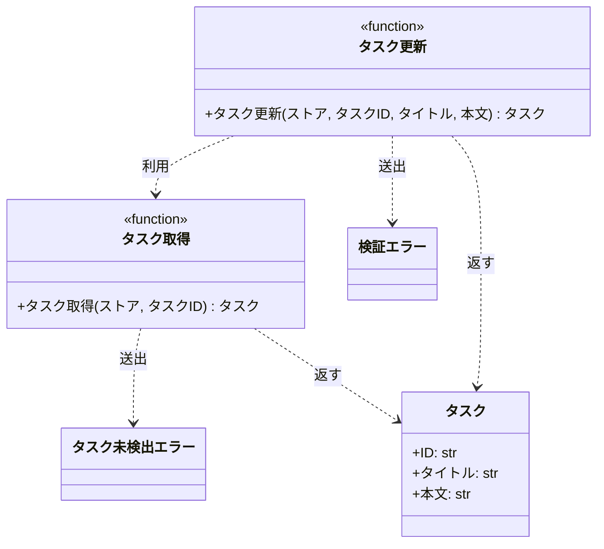

# モジュール構成: バックエンド / タスク

`タスク` ドメイン（バックエンド側）に属する構成要素詳細。

- 対応テストファイル: -

## 一覧

| ユースケース | 役割 | コンテナ | 種別 | 名前 | 概要 | 補足 |
| --- | --- | --- | --- | --- | --- | --- |
| 共通 | ドメインモデル | `tasks/models.py` | データモデル | [`Task`](#タスク) | タスク 1 件 | 既存 |
| 共通 | 例外 | `tasks/errors.py` | クラス | [`TaskNotFoundError`](#タスク未検出エラー) | 指定 ID のタスクが存在しない | 既存 |
| 共通 | 例外 | `tasks/errors.py` | クラス | [`ValidationError`](#検証エラー) | 入力値が制約を満たさない | 既存。本 subsystem で初めて送出する |
| 共通 | サービス | `tasks/service.py` | 関数 | [`get_task`](#タスク取得) | ストアからタスクを 1 件取得する | 既存 |
| タスク編集 | サービス | `tasks/service.py` | 関数 | [`update_task`](#タスク更新) | タスクのタイトルと本文を更新する | 本 subsystem で追加 |

## ディレクトリ構成

```
src/tasks/
├── models.py     # Task
├── errors.py     # TaskNotFoundError / ValidationError
└── service.py    # get_task / update_task
```

## 構成図



## タスク
> 物理名: `Task`<br>
> 種別: データモデル<br>
> コンテナ: `tasks/models.py`

タスク 1 件を表す不変のデータモデル。

### プロパティ

| 論理名 | プロパティ名 | 型 | 可視性 | デフォルト | 説明 | 例 | 補足 |
| --- | --- | --- | --- | --- | --- | --- | --- |
| ID | `id` | `str` | 公開 | - | タスクを一意に識別する ID | `"t1"` | ストアのキーと同じ値 |
| タイトル | `title` | `str` | 公開 | - | タスク名 | `"新タイトル"` | 1 文字以上 100 文字以内 |
| 本文 | `content` | `str` | 公開 | `""` | タスクの本文 | `"新本文"` | 1000 文字以内 |

### メソッド

なし

### 単体テスト

なし

### 補足

- `frozen` なデータモデルなので、更新は差し替えた新しいインスタンスを作って行う（[タスク更新](#タスク更新)）

## タスク未検出エラー
> 物理名: `TaskNotFoundError`<br>
> 種別: クラス<br>
> コンテナ: `tasks/errors.py`

指定 ID のタスクがストアに存在しないことを表す例外。

### プロパティ

なし

### メソッド

なし

### 単体テスト

なし

## 検証エラー
> 物理名: `ValidationError`<br>
> 種別: クラス<br>
> コンテナ: `tasks/errors.py`

入力値が制約を満たさないことを表す例外。

### プロパティ

なし

### メソッド

なし

### 単体テスト

なし

## `tasks/service.py`
> 種別: ファイル

タスクのドメインロジックを束ねる関数ファイル。
ストアはインメモリの `dict` を引数で受け取り、この層では永続化先を持たない。

---

### タスク取得
> 物理名: `get_task`<br>
> 種別: 関数

ストアからタスクを 1 件取得する。

#### 引数

| 論理名 | 引数名 | 型 | 必須 | デフォルト | 説明 | 補足 |
| --- | --- | --- | --- | --- | --- | --- |
| ストア | `store` | [`dict[str, Task]`](#タスク) | ✅ | - | タスクを保持するインメモリのストア | キーはタスク ID |
| タスク ID | `task_id` | `str` | ✅ | - | 取得対象のタスク ID | - |

引数例:

```python
get_task(store, "t1")
```

#### 戻り値

| 型 | 説明 | 補足 |
| --- | --- | --- |
| [`Task`](#タスク) | 取得したタスク | - |

戻り値例:

```python
Task(id="t1", title="旧タイトル", content="旧本文")
```

#### 処理

1. ストアに `task_id` が存在するか確認する
   - 存在しない場合、`TaskNotFoundError` を送出する
2. ストアから該当のタスクを返す

#### 例外

| 例外名 | 発生条件 | メッセージ | 補足 |
| --- | --- | --- | --- |
| `TaskNotFoundError` | `task_id` がストアに未登録 | `"task not found: {task_id}"` | - |

#### 単体テスト

なし

---

### タスク更新
> 物理名: `update_task`<br>
> 種別: 関数

タスクのタイトルと本文を更新する。

#### 引数

| 論理名 | 引数名 | 型 | 必須 | デフォルト | 説明 | 補足 |
| --- | --- | --- | --- | --- | --- | --- |
| ストア | `store` | [`dict[str, Task]`](#タスク) | ✅ | - | タスクを保持するインメモリのストア | キーはタスク ID |
| タスク ID | `task_id` | `str` | ✅ | - | 更新対象のタスク ID | - |
| タイトル | `title` | `str` | ✅ | - | 更新後のタスク名 | 1 文字以上 100 文字以内 |
| 本文 | `content` | `str` | - | `""` | 更新後の本文 | 1000 文字以内。省略時は既存の本文を残さず空文字で上書きする |

引数例:

```python
update_task(store, "t1", "新タイトル", "新本文")
```

#### 戻り値

| 型 | 説明 | 補足 |
| --- | --- | --- |
| [`Task`](#タスク) | 更新後のタスク | ストアに書き戻したものと同じインスタンス |

戻り値例:

```python
Task(id="t1", title="新タイトル", content="新本文")
```

#### 処理

1. タイトルの文字数を検証する
   - 0 文字 または 100 文字超の場合、`ValidationError` を送出する
2. 本文の文字数を検証する
   - 1000 文字超の場合、`ValidationError` を送出する
3. 更新対象のタスクをストアから取得する（[タスク取得](#タスク取得)）
   - 未登録の場合、[タスク取得](#タスク取得) が送出した `TaskNotFoundError` をそのまま伝播させる
4. タイトルと本文を差し替えた新しいタスクを作り、ストアへ書き戻して返す

#### 例外

| 例外名 | 発生条件 | メッセージ | 補足 |
| --- | --- | --- | --- |
| `ValidationError` | `title` が 0 文字 または 100 文字超 | `"タイトルは 1 文字以上 100 文字以内にしてください"` | - |
| `ValidationError` | `content` が 1000 文字超 | `"本文は 1000 文字以内にしてください"` | 同じ例外の別発生箇所 |
| `TaskNotFoundError` | `task_id` がストアに未登録 | `"task not found: {task_id}"` | [タスク取得](#タスク取得) が送出したものを伝播 |

#### 単体テスト

| テスト名 | 正常/異常 | 概要 | 条件 | Mock | 期待値 | 補足 |
| --- | --- | --- | --- | --- | --- | --- |
| `test_update_task` | 正常 | タイトルと本文を更新する | `t1` を登録済みのストアに有効なタイトルと本文を渡す | なし（インメモリの `dict` を実物のまま使う） | 更新後の `Task` を返し、ストアの `t1` も更新後の値になる | - |
| `test_update_task_when_content_omitted` | 正常 | 本文を省略する | `content` を省略する | なし（インメモリの `dict` を実物のまま使う） | 本文が空文字の `Task` を返す | 省略時に既存の本文を残さないことの確認 |
| `test_update_task_when_title_empty` | 異常 | タイトルが空 | `title` に空文字を渡す | なし（インメモリの `dict` を実物のまま使う） | `ValidationError` を送出し、ストアが変更されない | 例外表「`title` が 0 文字 または 100 文字超」に対応 |
| `test_update_task_when_title_too_long` | 異常 | タイトルが上限超え | `title` に 101 文字を渡す | なし（インメモリの `dict` を実物のまま使う） | `ValidationError` を送出し、ストアが変更されない | 例外表「`title` が 0 文字 または 100 文字超」に対応 |
| `test_update_task_when_content_too_long` | 異常 | 本文が上限超え | `content` に 1001 文字を渡す | なし（インメモリの `dict` を実物のまま使う） | `ValidationError` を送出し、ストアが変更されない | 例外表「`content` が 1000 文字超」に対応 |
| `test_update_task_when_task_missing` | 異常 | 未登録の ID | `task_id` に未登録の ID を渡す | なし（インメモリの `dict` を実物のまま使う） | `TaskNotFoundError` を送出し、ストアが変更されない | 例外表「`task_id` がストアに未登録」に対応 |

### 補足

- 入力検証は外部のバリデーションライブラリを使わず、[タスク更新](#タスク更新) の中で自前実装する。
  検証要件が文字数チェックの 2 件だけで外部ライブラリを必要とする複雑さがなく、調査した候補もライセンス・メンテナンス状況の理由で採用できなかったため
- 文字数の上限値は [インターフェース定義（タスク更新）](../../インターフェース定義/バックエンド/タスク更新.py.md) のリクエスト表と同じ値を使う
