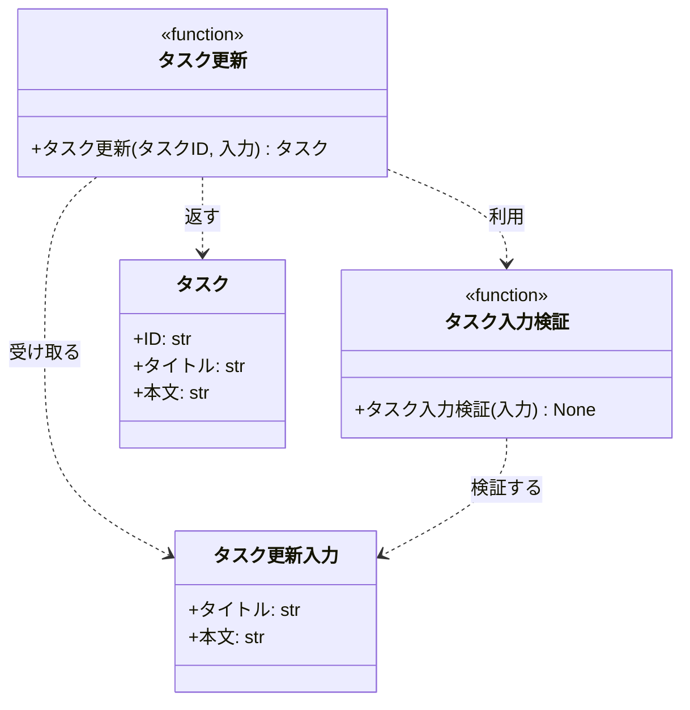

# モジュール構成: バックエンド / タスク

`タスク` ドメイン（バックエンド側）に属する構成要素詳細。

## 一覧

| ユースケース | 役割 | コンテナ | 種別 | 名前 | 概要 | 補足 |
| --- | --- | --- | --- | --- | --- | --- |
| 共通 | ドメインモデル | `src/tasks/types.py` | データモデル | [`Task`](#タスク) | タスク 1 件の属性 | 既存 `tasks` テーブルの既存カラムに対応 |
| 共通 | DTO | `src/tasks/types.py` | データモデル | [`UpdateTaskInput`](#タスク更新入力) | 更新リクエストの入力値 | - |
| 共通 | 定数 | `src/tasks/types.py` | 定数 | `TITLE_MAX_LENGTH` | タイトルの最大文字数（100） | 単純即値のため詳細セクションなし |
| 共通 | リポジトリ型（DI） | `src/tasks/types.py` | 関数型 | [`FindTask`](#タスク取得型) | タスク 1 件を取得する関数のシグネチャ | DI / Mock 差し替え用 |
| 共通 | リポジトリ型（DI） | `src/tasks/types.py` | 関数型 | [`SaveTask`](#タスク保存型) | タスクを永続化する関数のシグネチャ | DI / Mock 差し替え用 |
| タスク編集 | バリデータ | `src/tasks/service.py` | 関数 | [`validate_task_input`](#タスク入力検証) | 更新入力をフィールド単位で検証する | 失敗時 `ValidationError` |
| タスク編集 | サービス | `src/tasks/service.py` | 関数 | [`update_task`](#タスク更新) | タスクのタイトルと本文を更新する | 検証は [タスク入力検証](#タスク入力検証) に集約する |

## ディレクトリ構成

```
src/tasks/
├── types.py      # Task / UpdateTaskInput / TITLE_MAX_LENGTH
└── service.py    # 入力検証とタスク更新のドメインロジック
```

## 構成図



## タスク
> 物理名: `Task`<br>
> 種別: データモデル<br>
> コンテナ: `src/tasks/types.py`

タスク 1 件の属性。
既存 `tasks` テーブルの既存カラムに対応する。

### プロパティ

| 論理名 | プロパティ名 | 型 | 可視性 | デフォルト | 説明 | 例 | 補足 |
| --- | --- | --- | --- | --- | --- | --- | --- |
| ID | `id` | `str` | 公開 | - | タスクの一意識別子 | `"task_01"` | - |
| タイトル | `title` | `str` | 公開 | - | タスクのタイトル | `"買い物に行く"` | 最大 `TITLE_MAX_LENGTH` 文字 |
| 本文 | `body` | `str` | 公開 | `""` | タスクの本文 | `"牛乳と卵"` | 空文字を許容する |

### メソッド

なし

### 単体テスト

なし

## タスク更新入力
> 物理名: `UpdateTaskInput`<br>
> 種別: データモデル<br>
> コンテナ: `src/tasks/types.py`

タスク更新リクエストで受け取る入力値。

### プロパティ

| 論理名 | プロパティ名 | 型 | 可視性 | デフォルト | 説明 | 例 | 補足 |
| --- | --- | --- | --- | --- | --- | --- | --- |
| タイトル | `title` | `str` | 公開 | - | 更新後のタイトル | `"買い物に行く"` | 空文字不可 |
| 本文 | `body` | `str` | 公開 | `""` | 更新後の本文 | `"牛乳と卵"` | 空文字を許容する |

### メソッド

なし

### 単体テスト

なし

## `src/tasks/types.py`
> 種別: ファイル

タスクドメインのデータモデル・定数・関数型を置くファイル。

---

### タスク取得型
> 物理名: `FindTask`<br>
> 種別: 関数型

タスク ID から 1 件取得する関数のシグネチャ。
DI / Mock 差し替え用。

#### 引数

| 論理名 | 引数名 | 型 | 必須 | デフォルト | 説明 | 補足 |
| --- | --- | --- | --- | --- | --- | --- |
| タスク ID | `task_id` | `str` | ✅ | - | 取得対象のタスク ID | - |

#### 戻り値

| 型 | 説明 | 補足 |
| --- | --- | --- |
| [`Task \| None`](#タスク) | 見つかったタスク（無ければ `None`） | - |

#### 実装

| 実装 | 補足 |
| --- | --- |
| 永続化層の取得関数 | 本 subsystem のスコープ外（既存の取得処理を注入する） |

---

### タスク保存型
> 物理名: `SaveTask`<br>
> 種別: 関数型

タスクを永続化する関数のシグネチャ。
DI / Mock 差し替え用。

#### 引数

| 論理名 | 引数名 | 型 | 必須 | デフォルト | 説明 | 補足 |
| --- | --- | --- | --- | --- | --- | --- |
| タスク | `task` | [`Task`](#タスク) | ✅ | - | 保存するタスク | - |

#### 戻り値

| 型 | 説明 | 補足 |
| --- | --- | --- |
| [`Task`](#タスク) | 保存後のタスク | - |

#### 実装

| 実装 | 補足 |
| --- | --- |
| 永続化層の保存関数 | 本 subsystem のスコープ外（既存の永続化処理を注入する） |

## `src/tasks/service.py`
> 種別: ファイル

タスクの入力検証と更新のドメインロジックを束ねる関数ファイル。

---

### タスク入力検証
> 物理名: `validate_task_input`<br>
> 種別: 関数

更新入力をフィールド単位で検証する。

#### 引数

| 論理名 | 引数名 | 型 | 必須 | デフォルト | 説明 | 補足 |
| --- | --- | --- | --- | --- | --- | --- |
| 入力 | `input` | [`UpdateTaskInput`](#タスク更新入力) | ✅ | - | 検証対象の更新入力 | - |

引数例:

```python
validate_task_input(UpdateTaskInput(title="買い物に行く", body="牛乳と卵"))
```

#### 戻り値

| 型 | 説明 | 補足 |
| --- | --- | --- |
| `None` | 戻り値なし（検証失敗は例外で通知する） | - |

#### 処理

1. フィールド単位のエラーを集める入れ物を用意する
2. タイトルが空文字（前後の空白を除いた結果が空）ならタイトルのエラーとして記録する
3. タイトルが `TITLE_MAX_LENGTH` を超えていればタイトルのエラーとして記録する
4. エラーが 1 件以上あれば `ValidationError` を投げる
   - `[WARNING]` 入力検証に失敗した（`errors`）

#### 例外

| 例外名 | 発生条件 | メッセージ | 補足 |
| --- | --- | --- | --- |
| `ValidationError` | タイトルが空文字 | `"タイトルを入力してください"` | `errors` に `title` キーで格納する |
| `ValidationError` | タイトルが `TITLE_MAX_LENGTH` を超える | `"タイトルは 100 文字以内で入力してください"` | `errors` に `title` キーで格納する |

#### 単体テスト

| テスト名 | 正常/異常 | 概要 | 条件 | Mock | 期待値 | 補足 |
| --- | --- | --- | --- | --- | --- | --- |
| `test_validate_task_input` | 正常 | 妥当な入力を検証する | タイトル 1 文字以上 100 文字以内 | なし | 例外を投げない | - |
| `test_validate_task_input_when_title_empty` | 異常 | タイトルが空文字 | `title` が `""` | なし | `ValidationError` を投げ、`errors` に `title` を含む | 例外表「タイトルが空文字」に対応 |
| `test_validate_task_input_when_title_blank` | 異常 | タイトルが空白のみ | `title` が `"   "` | なし | `ValidationError` を投げ、`errors` に `title` を含む | 例外表「タイトルが空文字」に対応 |
| `test_validate_task_input_when_title_too_long` | 異常 | タイトルが上限超過 | `title` が 101 文字 | なし | `ValidationError` を投げ、`errors` に `title` を含む | 例外表「タイトルが `TITLE_MAX_LENGTH` を超える」に対応 |

---

### タスク更新
> 物理名: `update_task`<br>
> 種別: 関数

タスクのタイトルと本文を更新する。

#### 引数

| 論理名 | 引数名 | 型 | 必須 | デフォルト | 説明 | 補足 |
| --- | --- | --- | --- | --- | --- | --- |
| タスク ID | `task_id` | `str` | ✅ | - | 更新対象のタスク ID | - |
| 入力 | `input` | [`UpdateTaskInput`](#タスク更新入力) | ✅ | - | 更新後の値 | - |
| タスク取得 | `find` | [`FindTask`](#タスク取得型) | ✅ | - | タスク 1 件を取得する関数 | 型エイリアス DI |
| タスク保存 | `save` | [`SaveTask`](#タスク保存型) | ✅ | - | タスクを永続化する関数 | 型エイリアス DI |

引数例:

```python
update_task("task_01", UpdateTaskInput(title="買い物に行く", body="牛乳と卵"), find=find_task, save=save_task)
```

#### 戻り値

| 型 | 説明 | 補足 |
| --- | --- | --- |
| [`Task`](#タスク) | 更新後のタスク | - |

戻り値例:

```python
Task(id="task_01", title="買い物に行く", body="牛乳と卵")
```

#### 処理

1. 入力を検証する（[タスク入力検証](#タスク入力検証)）
2. `task_id` でタスクを取得する
3. 取得結果で処理を分ける
   - 見つからない場合、`NotFoundError` を投げる
     - `[WARNING]` 更新対象のタスクが存在しなかった（`task_id`）
   - 見つかった場合、次のステップへ進む
4. タイトルと本文を入力値で置き換えたタスクを保存して返す
   - `[INFO]` タスクを更新した（`task_id`）

#### 例外

| 例外名 | 発生条件 | メッセージ | 補足 |
| --- | --- | --- | --- |
| `NotFoundError` | `task_id` に対応するタスクが存在しない | `"タスクが見つかりません: {task_id}"` | - |

#### 単体テスト

| テスト名 | 正常/異常 | 概要 | 条件 | Mock | 期待値 | 補足 |
| --- | --- | --- | --- | --- | --- | --- |
| `test_update_task` | 正常 | タイトルと本文を更新する | 対象タスクが存在する | `find` / `save` | 更新後の `Task` を返し、`save` に更新後の値が渡る | - |
| `test_update_task_when_task_missing` | 異常 | 対象タスクが存在しない | `find` が `None` を返す | `find` / `save` | `NotFoundError` を投げ、`save` は呼ばれない | 例外表「タスクが存在しない」に対応 |
| `test_update_task_when_title_empty` | 異常 | 入力検証で弾く | `title` が `""` | `find` / `save` | `ValidationError` を投げ、`find` / `save` は呼ばれない | 検証が更新より前に走ることの確認 |

---

### 補足

- 更新対象は既存 `tasks` テーブルの既存カラム（`title` / `body`）のみで、更新履歴や監査カラムは持たない（親 Issue #1251 のスコープ外「DB スキーマの変更」に該当するため）
- 永続化は型エイリアス DI（[`FindTask`](#タスク取得型) / [`SaveTask`](#タスク保存型)）で受け取り、単体テストでは Mock 関数を注入する
