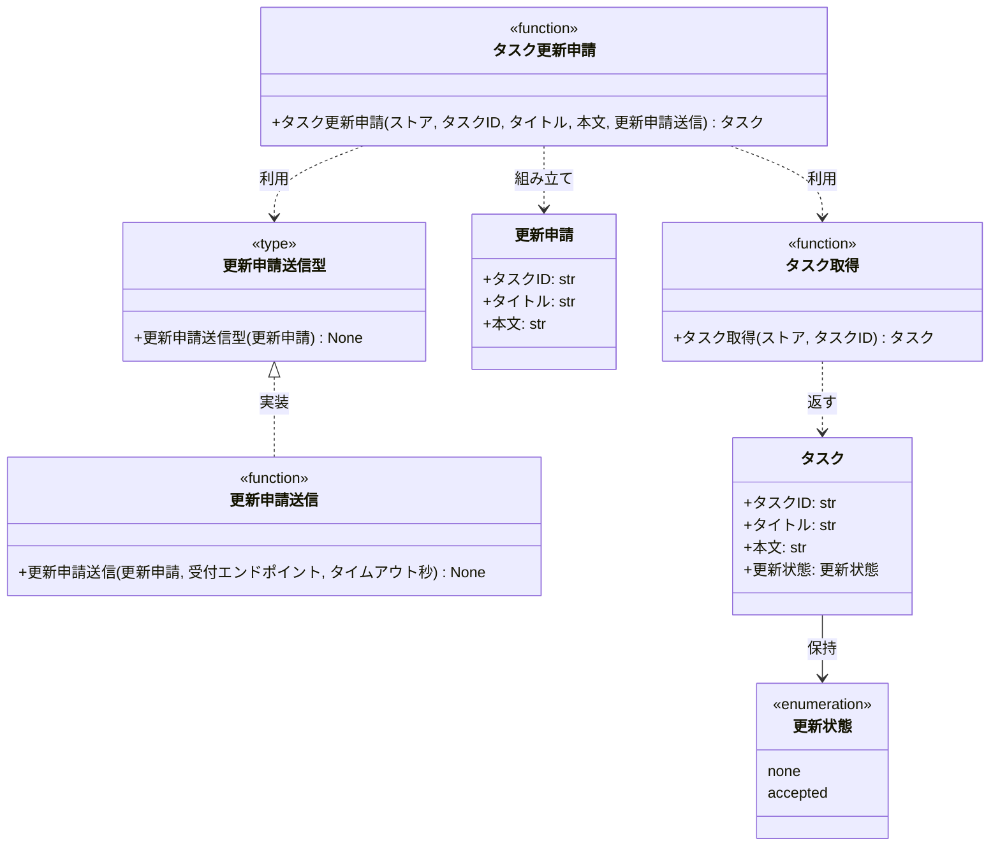

# モジュール構成: バックエンド / タスク

`タスク` ドメイン（バックエンド側）に属する構成要素詳細。
タスクの保持内容と、更新を外部承認基盤へ申請して受付応答を受け取るまでの関数群を扱う。

## 一覧

| ユースケース | 役割 | コンテナ | 種別 | 名前 | 概要 | 補足 |
| --- | --- | --- | --- | --- | --- | --- |
| 共通 | ドメインモデル | `tasks/models.py` | データモデル | [`Task`](#タスク) | タスク 1 件 | - |
| 共通 | 列挙 | `tasks/types.py` | Enum | [`UpdateStatus`](#更新状態) | 更新申請の状態 | `Literal` で表現 |
| 共通 | 例外 | `tasks/errors.py` | クラス | `TaskNotFoundError` | 指定 ID のタスクが存在しない | 詳細セクションなし |
| 共通 | 例外 | `tasks/errors.py` | クラス | `ValidationError` | 入力値が制約を満たさない | 詳細セクションなし |
| 共通 | 定数 | `tasks/constants.py` | 定数 | `TITLE_MAX_LENGTH` | タイトルの最大文字数 | `100` |
| 共通 | 定数 | `tasks/constants.py` | 定数 | `CONTENT_MAX_LENGTH` | 本文の最大文字数 | `1000` |
| 共通 | クエリ | `tasks/service.py` | 関数 | [`get_task`](#タスク取得) | ストアからタスクを 1 件取得する | - |
| タスク編集 | DTO | `tasks/types.py` | データモデル | [`UpdateRequest`](#更新申請) | 承認基盤へ送る更新申請の内容 | - |
| タスク編集 | クライアント型（DI） | `tasks/types.py` | 関数型 | [`SubmitUpdateRequest`](#更新申請送信型) | 更新申請を送る関数のシグネチャ | Mock 差し替え用 |
| タスク編集 | 例外 | `tasks/errors.py` | クラス | `UpdateRequestNotAcceptedError` | 承認基盤が更新申請を受け付けなかった | 詳細セクションなし |
| タスク編集 | 定数 | `tasks/constants.py` | 定数 | `APPROVAL_REQUEST_TIMEOUT_SECONDS` | 承認基盤への申請を打ち切る秒数 | `5.0` |
| タスク編集 | サービス | `tasks/service.py` | 関数 | [`update_task`](#タスク更新申請) | 更新を承認基盤へ申請して受付済みにする | - |
| タスク編集 | クライアント実装 | `tasks/client.py` | 関数 | [`submit_update_request`](#更新申請送信) | 承認基盤へ更新申請を送る | - |

## ディレクトリ構成

```
src/tasks/
├── models.py        # Task
├── types.py         # UpdateStatus / UpdateRequest / SubmitUpdateRequest
├── constants.py     # 検証上限・申請タイムアウト
├── errors.py        # TaskNotFoundError / ValidationError / UpdateRequestNotAcceptedError
├── client.py        # 承認基盤への更新申請
└── service.py       # get_task / update_task
```

## 構成図



更新申請送信型の実装は[更新申請送信](#更新申請送信)の 1 つだけで矢印が 1 塊に収まるため、実装群の図は分けていない。

## タスク
> 物理名: `Task`<br>
> 種別: データモデル<br>
> コンテナ: `tasks/models.py`

タスク 1 件。
タイトルと本文は承認完了をもって確定するため、更新申請を出しただけでは値が変わらず[更新状態](#更新状態)だけが変わる。

### プロパティ

| 論理名 | プロパティ名 | 型 | 可視性 | デフォルト | 説明 | 例 | 補足 |
| --- | --- | --- | --- | --- | --- | --- | --- |
| タスク ID | `id` | `str` | 公開 | - | タスクの一意 ID | `"t1"` | - |
| タイトル | `title` | `str` | 公開 | - | タスク名 | `"買い物"` | 承認済みの確定値 |
| 本文 | `content` | `str` | 公開 | `""` | タスクの本文 | `"牛乳を買う"` | 承認済みの確定値 |
| 更新状態 | `update_status` | [`UpdateStatus`](#更新状態) | 公開 | `"none"` | 更新申請の受付状態 | `"accepted"` | 一覧取得時に受付済みを判別する情報 |

### メソッド

なし

### 単体テスト

なし

### 補足

- `frozen=True` の不変データモデルとして扱い、更新状態の変更は `dataclasses.replace` で新インスタンスを作る
- 申請したタイトル・本文は保持しない（承認結果の反映が epic #410 のスコープ外で、保持しても消費先がないため）

## 更新状態
> 物理名: `UpdateStatus`<br>
> 種別: Enum<br>
> コンテナ: `tasks/types.py`

タスクの更新申請の受付状態。
`Literal` の型エイリアスで表現する。

### 値一覧

| 値 | 論理名 | 説明 | 補足 |
| --- | --- | --- | --- |
| `none` | 申請なし | 更新申請を出していない | 初期値 |
| `accepted` | 受付済み | 承認基盤が更新申請を受け付けた | 承認の完了は表さない |

### メソッド

なし

### 単体テスト

なし

### 補足

- 承認の完了・否認を表す値は持たない（承認結果の反映が本 epic のスコープ外のため）

## 更新申請
> 物理名: `UpdateRequest`<br>
> 種別: データモデル<br>
> コンテナ: `tasks/types.py`

承認基盤へ送る更新申請の内容。

### プロパティ

| 論理名 | プロパティ名 | 型 | 可視性 | デフォルト | 説明 | 例 | 補足 |
| --- | --- | --- | --- | --- | --- | --- | --- |
| タスク ID | `task_id` | `str` | 公開 | - | 更新対象のタスク ID | `"t1"` | - |
| タイトル | `title` | `str` | 公開 | - | 申請するタスク名 | `"買い物リスト"` | 検証済みの値 |
| 本文 | `content` | `str` | 公開 | `""` | 申請する本文 | `"牛乳と卵を買う"` | 検証済みの値 |

### メソッド

なし

### 単体テスト

なし

### 補足

- 検証を通過した値だけを持つ（組み立て前に[タスク更新申請](#タスク更新申請)が検証する）

## `tasks/types.py`
> 種別: ファイル

タスクドメインの型エイリアスと、外部へ渡す DTO を定義するファイル。
[更新状態](#更新状態) と [更新申請](#更新申請) もこのファイルに置く。

---

### 更新申請送信型
> 物理名: `SubmitUpdateRequest`<br>
> 種別: 関数型

承認基盤へ更新申請を送る関数のシグネチャ。
DI / Mock 差し替え用。

#### 引数

| 論理名 | 引数名 | 型 | 必須 | デフォルト | 説明 | 補足 |
| --- | --- | --- | --- | --- | --- | --- |
| 更新申請 | `request` | [`UpdateRequest`](#更新申請) | ✅ | - | 承認基盤へ送る申請内容 | - |

#### 戻り値

| 型 | 説明 | 補足 |
| --- | --- | --- |
| `None` | なし | 受付できた場合だけ正常終了する |

#### 実装

| 実装 | 補足 |
| --- | --- |
| [更新申請送信](#更新申請送信) | 本番の実装。受付エンドポイントとタイムアウトを部分適用して注入する |

## `tasks/service.py`
> 種別: ファイル

タスクのドメインロジックを束ねる関数ファイル。

---

### タスク取得
> 物理名: `get_task`<br>
> 種別: 関数

ストアからタスクを 1 件取得する。

#### 引数

| 論理名 | 引数名 | 型 | 必須 | デフォルト | 説明 | 補足 |
| --- | --- | --- | --- | --- | --- | --- |
| ストア | `store` | [`dict[str, Task]`](#タスク) | ✅ | - | タスク ID をキーにしたインメモリストア | - |
| タスク ID | `task_id` | `str` | ✅ | - | 取得対象のタスク ID | - |

引数例:

```python
get_task({"t1": Task(id="t1", title="買い物")}, "t1")
```

#### 戻り値

| 型 | 説明 | 補足 |
| --- | --- | --- |
| [`Task`](#タスク) | 取得したタスク | - |

戻り値例:

```python
Task(id="t1", title="買い物", content="", update_status="none")
```

#### 処理

1. ストアに `task_id` があるかを確かめる
   - ない場合、`TaskNotFoundError` を送出する
2. 該当タスクを返す

#### 例外

| 例外名 | 発生条件 | メッセージ | 補足 |
| --- | --- | --- | --- |
| `TaskNotFoundError` | ストアに `task_id` が存在しない | `"task not found: {task_id}"` | - |

#### 単体テスト

セットアップ:

| セットアップ | 説明 | 補足 |
| --- | --- | --- |
| タスクストア | `t1` のタスク 1 件を持つ dict | `task_store` |

| テスト名 | 正常/異常 | 概要 | 条件 | Mock | 期待値 | 補足 |
| --- | --- | --- | --- | --- | --- | --- |
| `test_get_task` | 正常 | 登録済みのタスクを取得する | `task_id="t1"` | なし | `t1` の `Task` を返す | - |
| `test_get_task_when_task_missing` | 異常 | 未登録の ID を指定する | `task_id="unknown"` | なし | `TaskNotFoundError` を送出する | 例外表「ストアに `task_id` が存在しない」に対応 |

---

### タスク更新申請
> 物理名: `update_task`<br>
> 種別: 関数

タスクの更新を承認基盤へ申請し、受け付けられたタスクを受付済みにする。

#### 引数

| 論理名 | 引数名 | 型 | 必須 | デフォルト | 説明 | 補足 |
| --- | --- | --- | --- | --- | --- | --- |
| ストア | `store` | [`dict[str, Task]`](#タスク) | ✅ | - | タスク ID をキーにしたインメモリストア | 受付済みへの書き戻し先 |
| タスク ID | `task_id` | `str` | ✅ | - | 更新対象のタスク ID | - |
| タイトル | `title` | `str` | ✅ | - | 申請するタスク名 | 1 文字以上 `TITLE_MAX_LENGTH` 文字以内 |
| 本文 | `content` | `str` | - | `""` | 申請する本文 | `CONTENT_MAX_LENGTH` 文字以内 |
| 更新申請送信 | `submit` | [`SubmitUpdateRequest`](#更新申請送信型) | ✅ | - | 承認基盤へ申請を送る関数 | キーワード専用引数 |

引数例:

```python
update_task(store, "t1", "買い物リスト", "牛乳と卵を買う", submit=submit)
```

#### 戻り値

| 型 | 説明 | 補足 |
| --- | --- | --- |
| [`Task`](#タスク) | 受付済みになったタスク | `update_status` が `"accepted"` |

戻り値例:

```python
Task(id="t1", title="買い物", content="", update_status="accepted")
```

#### 処理

1. タイトルと本文の制約を検証する
   - タイトルが空 or `TITLE_MAX_LENGTH` 超過の場合、`ValidationError` を送出する
   - 本文が `CONTENT_MAX_LENGTH` 超過の場合、`ValidationError` を送出する
2. 対象タスクをストアから取得する（[タスク取得](#タスク取得)）
3. 取得したタスクの ID と申請内容から[更新申請](#更新申請)を組み立てる
4. 承認基盤へ更新申請を送る（[更新申請送信型](#更新申請送信型)）
   - `[INFO]` 更新申請を送信した（`task_id`）
   - 受け付けられなかった場合、`UpdateRequestNotAcceptedError` がそのまま伝播してストアは変更されない
5. 対象タスクを受付済みにしてストアへ書き戻す
   - 申請したタイトルと本文は反映しない（承認完了をもって確定するため）
   - `[INFO]` 更新申請が受け付けられた（`task_id`）
6. 受付済みのタスクを返す

#### 例外

| 例外名 | 発生条件 | メッセージ | 補足 |
| --- | --- | --- | --- |
| `ValidationError` | タイトルが空 or `TITLE_MAX_LENGTH` 超過 | `"title must be 1 to {TITLE_MAX_LENGTH} characters"` | 申請は送らない |
| `ValidationError` | 本文が `CONTENT_MAX_LENGTH` 超過 | `"content must be {CONTENT_MAX_LENGTH} characters or less"` | 申請は送らない |
| `TaskNotFoundError` | ストアに `task_id` が存在しない | `"task not found: {task_id}"` | [タスク取得](#タスク取得)から伝播。申請は送らない |
| `UpdateRequestNotAcceptedError` | 承認基盤が更新申請を受け付けない | `"update request was not accepted: {task_id}"` | [更新申請送信](#更新申請送信)から伝播 |

#### 単体テスト

セットアップ:

| セットアップ | 説明 | 補足 |
| --- | --- | --- |
| タスクストア | `t1` のタスク 1 件を持つ dict | `task_store` |
| 受け付ける承認基盤 | 渡された申請を記録して正常終了する関数 | `accepting_submit` |
| 受け付けない承認基盤 | `UpdateRequestNotAcceptedError` を送出する関数 | `rejecting_submit` |

| テスト名 | 正常/異常 | 概要 | 条件 | Mock | 期待値 | 補足 |
| --- | --- | --- | --- | --- | --- | --- |
| `test_update_task` | 正常 | 更新申請が受け付けられる | 有効なタイトルと本文 | 更新申請送信 | `update_status` が `"accepted"` のタスクを返す。申請したタイトルと本文が Mock に渡る。ストアのタイトルと本文は変わらない | 結合「正常系」に対応 |
| `test_update_task_when_title_empty` | 異常 | タイトルが空 | `title=""` | 更新申請送信 | `ValidationError` を送出する。Mock が呼ばれない | 例外表「タイトルが空 or 上限超過」に対応 |
| `test_update_task_when_title_too_long` | 異常 | タイトルが上限超過 | `TITLE_MAX_LENGTH` + 1 文字 | 更新申請送信 | `ValidationError` を送出する。Mock が呼ばれない | 例外表「タイトルが空 or 上限超過」に対応 |
| `test_update_task_when_content_too_long` | 異常 | 本文が上限超過 | `CONTENT_MAX_LENGTH` + 1 文字 | 更新申請送信 | `ValidationError` を送出する。Mock が呼ばれない | 例外表「本文が上限超過」に対応 |
| `test_update_task_when_task_missing` | 異常 | 未登録の ID を指定する | `task_id="unknown"` | 更新申請送信 | `TaskNotFoundError` を送出する。Mock が呼ばれない | 例外表「ストアに `task_id` が存在しない」に対応 |
| `test_update_task_when_not_accepted` | 異常 | 承認基盤が受付に失敗する | Mock が `UpdateRequestNotAcceptedError` を送出 | 更新申請送信 | `UpdateRequestNotAcceptedError` が伝播する。ストアの `update_status` が `"none"` のまま | 結合「更新申請が受け付けられない」に対応 |

### 補足

- 検証は本関数にインラインで置き、ヘルパー関数に切り出さない（分岐が 3 つで、切り出すと同じ分岐を 2 箇所でテストすることになるため）
- 承認基盤への到達手段は引数の関数型で受け取り、本ファイルは HTTP を知らない

## `tasks/client.py`
> 種別: ファイル

承認基盤の受付エンドポイントを叩くラッパー関数のファイル。
実 API と話す境界層。

---

### 更新申請送信
> 物理名: `submit_update_request`<br>
> 種別: 関数<br>
> 継承元: [`SubmitUpdateRequest`](#更新申請送信型)

承認基盤へ更新申請を送り、受付応答を受け取る。

#### 引数

| 論理名 | 引数名 | 型 | 必須 | デフォルト | 説明 | 補足 |
| --- | --- | --- | --- | --- | --- | --- |
| 更新申請 | `request` | [`UpdateRequest`](#更新申請) | ✅ | - | 承認基盤へ送る申請内容 | - |
| 受付エンドポイント | `endpoint` | `str` | ✅ | - | 承認基盤の受付 URL | キーワード専用引数 |
| タイムアウト秒 | `timeout_seconds` | `float` | - | `APPROVAL_REQUEST_TIMEOUT_SECONDS` | 応答を待つ上限秒数 | キーワード専用引数 |

引数例:

```python
submit_update_request(request, endpoint="https://approval.example.com/requests")
```

#### 戻り値

| 型 | 説明 | 補足 |
| --- | --- | --- |
| `None` | なし | 受付できた場合だけ正常終了する |

#### 処理

1. 申請内容を JSON にして受付エンドポイントへ POST する
   - 応答を待つ上限は `timeout_seconds`
2. 応答から受付の可否を判定する
   - 2xx の場合、受付成功として正常終了する
     - `[INFO]` 更新申請が受け付けられた（`task_id`）
   - 2xx 以外・タイムアウト・接続失敗の場合、`UpdateRequestNotAcceptedError` を送出する
     - `[WARNING]` 更新申請が受け付けられなかった（`task_id` / 事由）

#### 例外

| 例外名 | 発生条件 | メッセージ | 補足 |
| --- | --- | --- | --- |
| `UpdateRequestNotAcceptedError` | 応答が 2xx 以外 | `"update request was not accepted: {task_id}"` | 受付拒否 |
| `UpdateRequestNotAcceptedError` | `timeout_seconds` を超えて応答が返らない | `"update request was not accepted: {task_id}"` | 同じ例外の別発生箇所。原因例外を `raise from` で連鎖する |
| `UpdateRequestNotAcceptedError` | 承認基盤へ接続できない | `"update request was not accepted: {task_id}"` | 同じ例外の別発生箇所。原因例外を `raise from` で連鎖する |

#### 単体テスト

セットアップ:

| セットアップ | 説明 | 補足 |
| --- | --- | --- |
| 更新申請 | `t1` 宛の申請 1 件 | `update_request` |

| テスト名 | 正常/異常 | 概要 | 条件 | Mock | 期待値 | 補足 |
| --- | --- | --- | --- | --- | --- | --- |
| `test_submit_update_request` | 正常 | 受付応答を受け取る | 応答が 200 | `urllib.request.urlopen` | 例外を送出しない。申請内容が JSON で POST される | - |
| `test_submit_update_request_when_rejected` | 異常 | 受付を拒否される | 応答が 409 | `urllib.request.urlopen` | `UpdateRequestNotAcceptedError` を送出する | 例外表「応答が 2xx 以外」に対応 |
| `test_submit_update_request_when_timeout` | 異常 | 応答が返らない | Mock が `TimeoutError` を送出 | `urllib.request.urlopen` | `UpdateRequestNotAcceptedError` を送出する | 例外表「`timeout_seconds` を超えて応答が返らない」に対応 |
| `test_submit_update_request_when_unreachable` | 異常 | 接続できない | Mock が `URLError` を送出 | `urllib.request.urlopen` | `UpdateRequestNotAcceptedError` を送出する | 例外表「承認基盤へ接続できない」に対応 |

#### 疎通テスト

なし

### 補足

- 薄いラッパーに留め、業務ロジックは[タスク更新申請](#タスク更新申請)側に置く
- 承認基盤の実エンドポイントが sandbox に存在しないため疎通テストは置かない（`urllib` を差し替えた単体テストで応答パターンを担保する）
- 受付失敗の内訳（拒否 / タイムアウト / 接続失敗）は呼び出し元へ渡さない（結末が同じため単一の例外に畳む）

## 補足

- 例外クラス（`TaskNotFoundError` / `ValidationError` / `UpdateRequestNotAcceptedError`）は `tasks/errors.py` に docstring だけを持つマーカークラスとして定義するため、詳細セクションを持たない。
  送出条件は各関数の例外表が正となる
- 承認結果の非同期通知の受信・承認待ち状態の照会に対応する構成要素は置かない（epic #410 のスコープ外）
