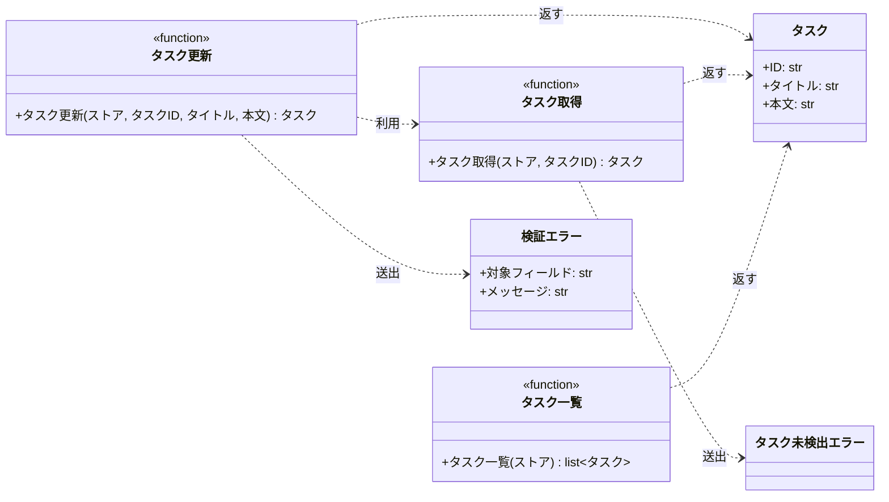

# モジュール構成: バックエンド / タスク

`タスク` ドメイン（バックエンド側）に属する構成要素詳細。

- 対応テストファイル: `tests/unit/tasks/test_service.py`

## 一覧

| ユースケース | 役割 | コンテナ | 種別 | 名前 | 概要 | 補足 |
| --- | --- | --- | --- | --- | --- | --- |
| 共通 | ドメインモデル | `src/tasks/models.py` | データモデル | [`Task`](#タスク) | タスク 1 件 | - |
| 共通 | 例外 | `src/tasks/errors.py` | クラス | [`TaskNotFoundError`](#タスク未検出エラー) | 指定 ID のタスクが存在しない | - |
| 共通 | 例外 | `src/tasks/errors.py` | クラス | [`ValidationError`](#検証エラー) | 入力値が制約を満たさない | 失敗したフィールドを `field` で識別する |
| 共通 | 定数 | `src/tasks/service.py` | 定数 | `TITLE_MIN_LENGTH` | タイトルの最小文字数 | 値は `1` |
| 共通 | 定数 | `src/tasks/service.py` | 定数 | `TITLE_MAX_LENGTH` | タイトルの最大文字数 | 値は `100` |
| 共通 | 定数 | `src/tasks/service.py` | 定数 | `CONTENT_MAX_LENGTH` | 本文の最大文字数 | 値は `1000` |
| 共通 | サービス | `src/tasks/service.py` | 関数 | [`get_task`](#タスク取得) | ストアからタスクを 1 件取得する | - |
| 共通 | サービス | `src/tasks/service.py` | 関数 | [`list_tasks`](#タスク一覧) | ストアのタスクを ID 順で一覧にする | - |
| タスク編集 | サービス | `src/tasks/service.py` | 関数 | [`update_task`](#タスク更新) | タイトルと本文を検証して更新する | - |

## ディレクトリ構成

```
src/tasks/
├── models.py     # Task
├── errors.py     # TaskNotFoundError / ValidationError
└── service.py    # 検証・取得・更新・一覧のドメインロジック
```

## 構成図



## タスク
> 物理名: `Task`<br>
> 種別: データモデル<br>
> コンテナ: `src/tasks/models.py`

タスク 1 件を表す不変のデータモデル。

### プロパティ

| 論理名 | プロパティ名 | 型 | 可視性 | デフォルト | 説明 | 例 | 補足 |
| --- | --- | --- | --- | --- | --- | --- | --- |
| ID | `id` | `str` | 公開 | - | タスクの一意識別子 | `"t1"` | ストアのキーと一致する |
| タイトル | `title` | `str` | 公開 | - | タスク名 | `"新タイトル"` | 更新時の検証対象 |
| 本文 | `content` | `str` | 公開 | `""` | タスクの本文 | `"新本文"` | 更新時の検証対象 |

### メソッド

なし

### 単体テスト

なし

### 補足

- `@dataclass(frozen=True, slots=True, kw_only=True)` で不変にしているため、更新は差し替えたインスタンスの生成で行う

## タスク未検出エラー
> 物理名: `TaskNotFoundError`<br>
> 種別: クラス<br>
> コンテナ: `src/tasks/errors.py`<br>
> 継承元: `Exception`

指定 ID のタスクがストアに存在しないことを表す例外。

### プロパティ

なし

### メソッド

なし

### 単体テスト

なし

## 検証エラー
> 物理名: `ValidationError`<br>
> 種別: クラス<br>
> コンテナ: `src/tasks/errors.py`<br>
> 継承元: `Exception`

入力値が制約を満たさないことを表す例外。
どのフィールドの検証に失敗したかを `field` で持ち、呼び出し元がフィールド単位でエラーを出し分けられるようにする。

### プロパティ

| 論理名 | プロパティ名 | 型 | 可視性 | デフォルト | 説明 | 例 | 補足 |
| --- | --- | --- | --- | --- | --- | --- | --- |
| 対象フィールド | `field` | `Literal["title", "content"]` | 公開 | - | 検証に失敗した入力フィールド | `"title"` | 検証対象のフィールドが増えたらリテラルを足す |
| メッセージ | `message` | `str` | 公開 | - | 失敗内容の説明 | `"タイトルは 1 文字以上 100 文字以内"` | `str(例外)` でも同じ文字列が返る |

### 初期化
> 物理名: `__init__`<br>
> 種別: メソッド

対象フィールドとメッセージを受け取って例外を組み立てる。

#### 引数

| 論理名 | 引数名 | 型 | 必須 | デフォルト | 説明 | 補足 |
| --- | --- | --- | --- | --- | --- | --- |
| 対象フィールド | `field` | `Literal["title", "content"]` | ✅ | - | 検証に失敗した入力フィールド | - |
| メッセージ | `message` | `str` | ✅ | - | 失敗内容の説明 | - |

引数例:

```python
raise ValidationError("title", "タイトルは 1 文字以上 100 文字以内")
```

#### 戻り値

| 型 | 説明 | 補足 |
| --- | --- | --- |
| `None` | なし | - |

#### 処理

1. メッセージを基底クラスへ渡す（`str(例外)` でメッセージが読めるようにする）
2. 対象フィールドとメッセージを属性として保持する

#### 例外

なし

#### 単体テスト

| テスト名 | 正常/異常 | 概要 | 条件 | Mock | 期待値 | 補足 |
| --- | --- | --- | --- | --- | --- | --- |
| `test_validation_error` | 正常 | 対象フィールドとメッセージを保持する | `ValidationError("title", "タイトルは 1 文字以上 100 文字以内")` | なし | `field` / `message` が引数のとおりで、`str(例外)` がメッセージと一致する | - |

## `src/tasks/service.py`
> 種別: ファイル

タスクの取得・更新・一覧のドメインロジックを束ねる関数ファイル。
ストアは引数で受け取るインメモリの辞書で、外部依存を持たない。

---

### タスク取得
> 物理名: `get_task`<br>
> 種別: 関数

ストアからタスクを 1 件取得する。

#### 引数

| 論理名 | 引数名 | 型 | 必須 | デフォルト | 説明 | 補足 |
| --- | --- | --- | --- | --- | --- | --- |
| ストア | `store` | `dict[str, Task]` | ✅ | - | タスクの保管先 | 呼び出し側が保持する |
| タスク ID | `task_id` | `str` | ✅ | - | 取得対象のタスク ID | - |

引数例:

```python
get_task(store, "t1")
```

#### 戻り値

| 型 | 説明 | 補足 |
| --- | --- | --- |
| [`Task`](#タスク) | 取得したタスク | - |

戻り値例:

```python
Task(id="t1", title="旧タイトル", content="旧本文")
```

#### 処理

1. ストアに指定 ID があるかを確かめる
   - 無い場合、[`TaskNotFoundError`](#タスク未検出エラー) を送出する
2. 該当するタスクを返す

#### 例外

| 例外名 | 発生条件 | メッセージ | 補足 |
| --- | --- | --- | --- |
| [`TaskNotFoundError`](#タスク未検出エラー) | `task_id` がストアに存在しない | `"task not found: {task_id}"` | - |

#### 単体テスト

| テスト名 | 正常/異常 | 概要 | 条件 | Mock | 期待値 | 補足 |
| --- | --- | --- | --- | --- | --- | --- |
| `test_get_task` | 正常 | 登録済みのタスクを取得する | `t1` が登録済み | なし | 登録した [`Task`](#タスク) を返す | - |
| `test_get_task_when_task_missing` | 異常 | 未登録の ID を渡す | `task_id` が `"missing"` | なし | [`TaskNotFoundError`](#タスク未検出エラー) を送出する | 例外表「`task_id` がストアに存在しない」に対応 |

---

### タスク更新
> 物理名: `update_task`<br>
> 種別: 関数

登録済みタスクのタイトルと本文を検証したうえで更新する。

#### 引数

| 論理名 | 引数名 | 型 | 必須 | デフォルト | 説明 | 補足 |
| --- | --- | --- | --- | --- | --- | --- |
| ストア | `store` | `dict[str, Task]` | ✅ | - | タスクの保管先 | 呼び出し側が保持する |
| タスク ID | `task_id` | `str` | ✅ | - | 更新対象のタスク ID | - |
| タイトル | `title` | `str` | ✅ | - | 更新後のタスク名 | 1 文字以上 100 文字以内 |
| 本文 | `content` | `str` | - | `""` | 更新後の本文 | 1000 文字以内 |

引数例:

```python
update_task(store, "t1", "新タイトル", "新本文")
```

#### 戻り値

| 型 | 説明 | 補足 |
| --- | --- | --- |
| [`Task`](#タスク) | 更新後のタスク | ストアに書き戻したものと同一のインスタンス |

戻り値例:

```python
Task(id="t1", title="新タイトル", content="新本文")
```

#### 処理

1. タイトルの文字数を検証する
   - `TITLE_MIN_LENGTH` 未満 or `TITLE_MAX_LENGTH` 超の場合、対象フィールドを `"title"` にして [`ValidationError`](#検証エラー) を送出する
2. 本文の文字数を検証する
   - `CONTENT_MAX_LENGTH` 超の場合、対象フィールドを `"content"` にして [`ValidationError`](#検証エラー) を送出する
3. 対象タスクを取得する（[タスク取得](#タスク取得)）
4. タイトルと本文を差し替えたタスクを組み立ててストアへ書き戻す
5. 書き戻したタスクを返す

#### 例外

| 例外名 | 発生条件 | メッセージ | 補足 |
| --- | --- | --- | --- |
| [`ValidationError`](#検証エラー) | `title` の文字数が `TITLE_MIN_LENGTH` 未満 | `"タイトルは 1 文字以上 100 文字以内"` | `field` が `"title"` |
| [`ValidationError`](#検証エラー) | `title` の文字数が `TITLE_MAX_LENGTH` 超 | `"タイトルは 1 文字以上 100 文字以内"` | `field` が `"title"` |
| [`ValidationError`](#検証エラー) | `content` の文字数が `CONTENT_MAX_LENGTH` 超 | `"本文は 1000 文字以内"` | `field` が `"content"` |
| [`TaskNotFoundError`](#タスク未検出エラー) | `task_id` がストアに存在しない | `"task not found: {task_id}"` | [タスク取得](#タスク取得) が送出したものをそのまま伝播する |

#### 単体テスト

| テスト名 | 正常/異常 | 概要 | 条件 | Mock | 期待値 | 補足 |
| --- | --- | --- | --- | --- | --- | --- |
| `test_update_task` | 正常 | タイトルと本文を更新する | `t1` が登録済みで正常値を渡す | なし | 更新後の [`Task`](#タスク) を返し、ストアの `t1` も置き換わる | - |
| `test_update_task_when_content_omitted` | 正常 | 本文を省略する | `content` を渡さない | なし | 戻り値とストアの `content` が `""` になる | - |
| `test_update_task_when_title_empty` | 異常 | タイトルが空 | `title` が `""` | なし | [`ValidationError`](#検証エラー) を送出し、`field` が `"title"` | 例外表「`title` の文字数が `TITLE_MIN_LENGTH` 未満」に対応 |
| `test_update_task_when_title_too_long` | 異常 | タイトルが 101 文字 | `title` が 101 文字 | なし | [`ValidationError`](#検証エラー) を送出し、`field` が `"title"` | 例外表「`title` の文字数が `TITLE_MAX_LENGTH` 超」に対応 |
| `test_update_task_when_content_too_long` | 異常 | 本文が 1001 文字 | `title` は正常値・`content` が 1001 文字 | なし | [`ValidationError`](#検証エラー) を送出し、`field` が `"content"` | 例外表「`content` の文字数が `CONTENT_MAX_LENGTH` 超」に対応 |
| `test_update_task_when_task_missing` | 異常 | 未登録の ID を渡す | `task_id` が `"missing"` | なし | [`TaskNotFoundError`](#タスク未検出エラー) を送出し、ストアの `t1` は変わらない | 例外表「`task_id` がストアに存在しない」に対応 |

---

### タスク一覧
> 物理名: `list_tasks`<br>
> 種別: 関数

ストアのタスクを ID 順で一覧にする。

#### 引数

| 論理名 | 引数名 | 型 | 必須 | デフォルト | 説明 | 補足 |
| --- | --- | --- | --- | --- | --- | --- |
| ストア | `store` | `dict[str, Task]` | ✅ | - | タスクの保管先 | 呼び出し側が保持する |

引数例:

```python
list_tasks(store)
```

#### 戻り値

| 型 | 説明 | 補足 |
| --- | --- | --- |
| `list[Task]` | ID の昇順に並べたタスク | 空のストアでは空リスト |

戻り値例:

```python
[Task(id="t1", title="新タイトル", content="新本文")]
```

#### 処理

1. ストアのキーを昇順に並べる
2. 並べた順にタスクを取り出してリストで返す

#### 例外

なし

#### 単体テスト

| テスト名 | 正常/異常 | 概要 | 条件 | Mock | 期待値 | 補足 |
| --- | --- | --- | --- | --- | --- | --- |
| `test_list_tasks` | 正常 | ID の昇順で一覧にする | `t2` / `t1` の順で登録済み | なし | `t1` → `t2` の順のリストを返す | - |

### 補足

- 検証は最初に違反したフィールドで打ち切るため、送出される [`ValidationError`](#検証エラー) は 1 件になる
- 検証をタスクの取得より先に行うため、未登録の ID と入力値違反が同時に起きた場合は入力値違反が優先される
