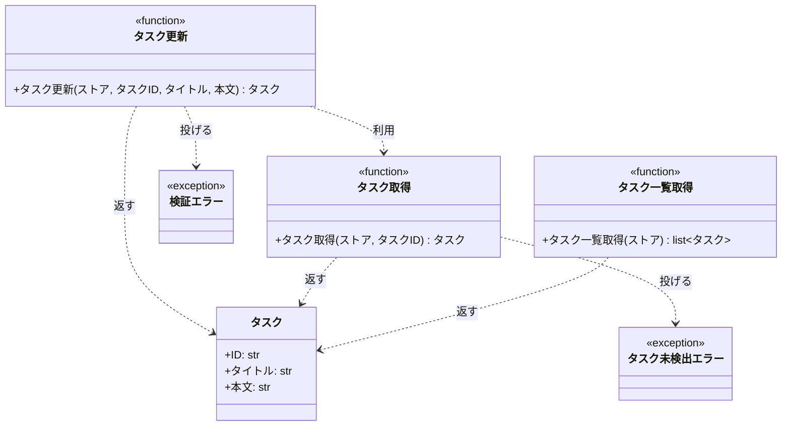

# モジュール構成: バックエンド / タスク

`タスク` ドメイン（バックエンド側）に属する構成要素詳細。
対応テストファイル: 未記入

## 一覧

| ユースケース | 役割 | コンテナ | 種別 | 名前 | 概要 | 補足 |
| --- | --- | --- | --- | --- | --- | --- |
| 共通 | ドメインモデル | `src/tasks/models.py` | データモデル | [`Task`](#タスク) | タスク 1 件 | - |
| 共通 | 例外 | `src/tasks/errors.py` | クラス | [`TaskNotFoundError`](#タスク未検出エラー) | 指定 ID のタスクが存在しない | - |
| 共通 | 例外 | `src/tasks/errors.py` | クラス | [`ValidationError`](#検証エラー) | 入力値が制約を満たさない | - |
| 共通 | 定数 | `src/tasks/service.py` | 定数 | `TITLE_MIN_LENGTH` | タイトルの最小文字数（`1`） | 単純即値のため詳細セクションを持たない |
| 共通 | 定数 | `src/tasks/service.py` | 定数 | `TITLE_MAX_LENGTH` | タイトルの最大文字数（`100`） | 単純即値のため詳細セクションを持たない |
| 共通 | 定数 | `src/tasks/service.py` | 定数 | `CONTENT_MAX_LENGTH` | 本文の最大文字数（`1000`） | 単純即値のため詳細セクションを持たない |
| 共通 | クエリ | `src/tasks/service.py` | 関数 | [`get_task`](#タスク取得) | ストアからタスクを 1 件取得する | - |
| 共通 | クエリ | `src/tasks/service.py` | 関数 | [`list_tasks`](#タスク一覧取得) | ストアのタスクを ID 順で一覧にする | - |
| タスク編集 | サービス | `src/tasks/service.py` | 関数 | [`update_task`](#タスク更新) | 登録済みタスクのタイトルと本文を更新する | - |

## ディレクトリ構成

```
src/tasks/
├── models.py     # Task（タスクのドメインモデル）
├── errors.py     # TaskNotFoundError / ValidationError
└── service.py    # 文字数の上下限定数とタスク操作の関数
```

## 構成図



## タスク
> 物理名: `Task`<br>
> 種別: データモデル<br>
> コンテナ: `src/tasks/models.py`

タスク 1 件を表す不変のドメインモデル。

### プロパティ

| 論理名 | プロパティ名 | 型 | 可視性 | デフォルト | 説明 | 例 | 補足 |
| --- | --- | --- | --- | --- | --- | --- | --- |
| ID | `id` | `str` | 公開 | - | ストア上でタスクを一意に識別するキー | `"t1"` | ストアの辞書キーと同じ値を入れる |
| タイトル | `title` | `str` | 公開 | - | タスクの見出し | `"買い物に行く"` | 長さ制約の検証は [タスク更新](#タスク更新) が持つ |
| 本文 | `content` | `str` | 公開 | `""` | タスクの詳細説明 | `"牛乳と卵"` | 長さ制約の検証は [タスク更新](#タスク更新) が持つ |

### メソッド

なし

### 単体テスト

なし

### 補足

- `@dataclass(frozen=True, slots=True, kw_only=True)` のため、更新は差し替え（新インスタンス生成）で行う
- 文字数の制約はモデル側に持たせず、更新の入口である [タスク更新](#タスク更新) に集約する（生成経路が増えたときに検証が分散しないようにするため）

## タスク未検出エラー
> 物理名: `TaskNotFoundError`<br>
> 種別: クラス<br>
> コンテナ: `src/tasks/errors.py`

指定 ID のタスクがストアに存在しないことを表す例外。

### プロパティ

なし

### メソッド

なし

### 単体テスト

なし

## 検証エラー
> 物理名: `ValidationError`<br>
> 種別: クラス<br>
> コンテナ: `src/tasks/errors.py`

入力値が文字数の制約を満たさないことを表す例外。

### プロパティ

なし

### メソッド

なし

### 単体テスト

なし

## `src/tasks/service.py`
> 種別: ファイル

タスクの取得・更新・一覧化を担う関数ファイル。
ストアは `dict[str, Task]` を引数で受け取り、この層では永続化先を持たない。

---

### タスク取得
> 物理名: `get_task`<br>
> 種別: 関数

ストアからタスクを 1 件取得する。

#### 引数

| 論理名 | 引数名 | 型 | 必須 | デフォルト | 説明 | 補足 |
| --- | --- | --- | --- | --- | --- | --- |
| ストア | `store` | [`dict[str, Task]`](#タスク) | ✅ | - | タスク ID をキーに持つ辞書 | 呼び出し側が保持する |
| タスク ID | `task_id` | `str` | ✅ | - | 取得対象のタスク ID | - |

引数例:

```python
get_task({"t1": Task(id="t1", title="旧タイトル")}, "t1")
```

#### 戻り値

| 型 | 説明 | 補足 |
| --- | --- | --- |
| [`Task`](#タスク) | ストアに登録されているタスク | - |

戻り値例:

```python
Task(id="t1", title="旧タイトル", content="旧本文")
```

#### 処理

1. ストアに `task_id` が登録されているかを確かめる
   - 登録されていない場合、タスク未検出エラーを投げる
2. 該当するタスクを返す

#### 例外

| 例外名 | 発生条件 | メッセージ | 補足 |
| --- | --- | --- | --- |
| `TaskNotFoundError` | ストアに `task_id` が存在しない | `"task not found: {task_id}"` | - |

#### 単体テスト

セットアップ:

| セットアップ | 説明 | 補足 |
| --- | --- | --- |
| ストア | `t1` を 1 件登録した辞書 | 物理名 `_store()` |

| テスト名 | 正常/異常 | 概要 | 条件 | Mock | 期待値 | 補足 |
| --- | --- | --- | --- | --- | --- | --- |
| `test_get_task` | 正常 | 登録済み ID のタスクを取得する | `task_id="t1"` | なし | `t1` の `Task` を返す | - |
| `test_get_task_when_task_missing` | 異常 | 未登録 ID を指定する | `task_id="missing"` | なし | `TaskNotFoundError` を投げる | 例外表「ストアに `task_id` が存在しない」に対応 |

---

### タスク更新
> 物理名: `update_task`<br>
> 種別: 関数

登録済みタスクのタイトルと本文を更新して返す。

#### 引数

| 論理名 | 引数名 | 型 | 必須 | デフォルト | 説明 | 補足 |
| --- | --- | --- | --- | --- | --- | --- |
| ストア | `store` | [`dict[str, Task]`](#タスク) | ✅ | - | タスク ID をキーに持つ辞書 | 更新後の値を書き戻す |
| タスク ID | `task_id` | `str` | ✅ | - | 更新対象のタスク ID | - |
| タイトル | `title` | `str` | ✅ | - | 更新後のタイトル | `TITLE_MIN_LENGTH` 以上 `TITLE_MAX_LENGTH` 以内 |
| 本文 | `content` | `str` | - | `""` | 更新後の本文 | `CONTENT_MAX_LENGTH` 以内。省略時は空文字で上書きする |

引数例:

```python
update_task({"t1": Task(id="t1", title="旧タイトル")}, "t1", "新タイトル", "新本文")
```

#### 戻り値

| 型 | 説明 | 補足 |
| --- | --- | --- |
| [`Task`](#タスク) | 更新後のタスク | ストアにも同じインスタンスを書き戻す |

戻り値例:

```python
Task(id="t1", title="新タイトル", content="新本文")
```

#### 処理

1. タイトルの文字数を検証する
   - `TITLE_MIN_LENGTH` 未満、または `TITLE_MAX_LENGTH` 超過の場合、検証エラーを投げる
2. 本文の文字数を検証する
   - `CONTENT_MAX_LENGTH` 超過の場合、検証エラーを投げる
3. 更新対象のタスクを取得する（[タスク取得](#タスク取得)）
4. 取得したタスクの ID を保ったまま新しいタスクを組み立て、ストアに書き戻して返す

#### 例外

| 例外名 | 発生条件 | メッセージ | 補足 |
| --- | --- | --- | --- |
| `ValidationError` | タイトルが `TITLE_MIN_LENGTH` 未満、または `TITLE_MAX_LENGTH` 超過 | `"title は 1 文字以上 100 文字以内"` | 空文字は下限違反として扱う |
| `ValidationError` | 本文が `CONTENT_MAX_LENGTH` 超過 | `"content は 1000 文字以内"` | 同じ例外の別発生箇所 |
| `TaskNotFoundError` | ストアに `task_id` が存在しない | `"task not found: {task_id}"` | [タスク取得](#タスク取得) から伝播する |

#### 単体テスト

セットアップ:

| セットアップ | 説明 | 補足 |
| --- | --- | --- |
| ストア | `t1` を 1 件登録した辞書 | 物理名 `_store()` |

| テスト名 | 正常/異常 | 概要 | 条件 | Mock | 期待値 | 補足 |
| --- | --- | --- | --- | --- | --- | --- |
| `test_update_task` | 正常 | タイトルと本文を更新する | `title="新タイトル"` / `content="新本文"` | なし | 更新後の `Task` を返し、ストアの値も入れ替わる | - |
| `test_update_task_when_content_omitted` | 正常 | 本文を省略する | `content` を渡さない | なし | 本文が空文字になる | 既定値の分岐に対応 |
| `test_update_task_when_title_empty` | 異常 | タイトルを空文字にする | `title=""` | なし | `ValidationError` を投げる | 例外表「タイトルが `TITLE_MIN_LENGTH` 未満」に対応 |
| `test_update_task_when_title_too_long` | 異常 | タイトルを 101 文字にする | `title="a" * 101` | なし | `ValidationError` を投げる | 例外表「タイトルが `TITLE_MAX_LENGTH` 超過」に対応 |
| `test_update_task_when_content_too_long` | 異常 | 本文を 1001 文字にする | `content="a" * 1001` | なし | `ValidationError` を投げる | 例外表「本文が `CONTENT_MAX_LENGTH` 超過」に対応 |
| `test_update_task_when_task_missing` | 異常 | 未登録 ID を指定する | `task_id="missing"` | なし | `TaskNotFoundError` を投げ、ストアは変化しない | 伝播経路の代表確認 |

---

### タスク一覧取得
> 物理名: `list_tasks`<br>
> 種別: 関数

ストアのタスクを ID 順で一覧にする。

#### 引数

| 論理名 | 引数名 | 型 | 必須 | デフォルト | 説明 | 補足 |
| --- | --- | --- | --- | --- | --- | --- |
| ストア | `store` | [`dict[str, Task]`](#タスク) | ✅ | - | タスク ID をキーに持つ辞書 | - |

引数例:

```python
list_tasks({"t2": Task(id="t2", title="B"), "t1": Task(id="t1", title="A")})
```

#### 戻り値

| 型 | 説明 | 補足 |
| --- | --- | --- |
| [`list[Task]`](#タスク) | ID の昇順に並べたタスク | 辞書の挿入順ではなく ID 順にする |

戻り値例:

```python
[Task(id="t1", title="A"), Task(id="t2", title="B")]
```

#### 処理

1. ストアのキーを昇順に並べ、その順でタスクを取り出して返す

#### 例外

なし

#### 単体テスト

| テスト名 | 正常/異常 | 概要 | 条件 | Mock | 期待値 | 補足 |
| --- | --- | --- | --- | --- | --- | --- |
| `test_list_tasks` | 正常 | 挿入順と異なる ID 順で並べ替える | `t2` / `t1` の順で登録した辞書 | なし | `t1` / `t2` の順のリストを返す | 空の辞書は分岐を持たないため行を置かない |

### 補足

- 文字数の制約は 3 つの定数に集約し、検証も例外メッセージも同じ定数を参照する（値を変える箇所を 1 つに保つため）
- ストアは引数で受け取る辞書に限定し、この層では永続化先を持たない（保存先が決まったときに関数の型エイリアスで差し替えられるようにするため）
