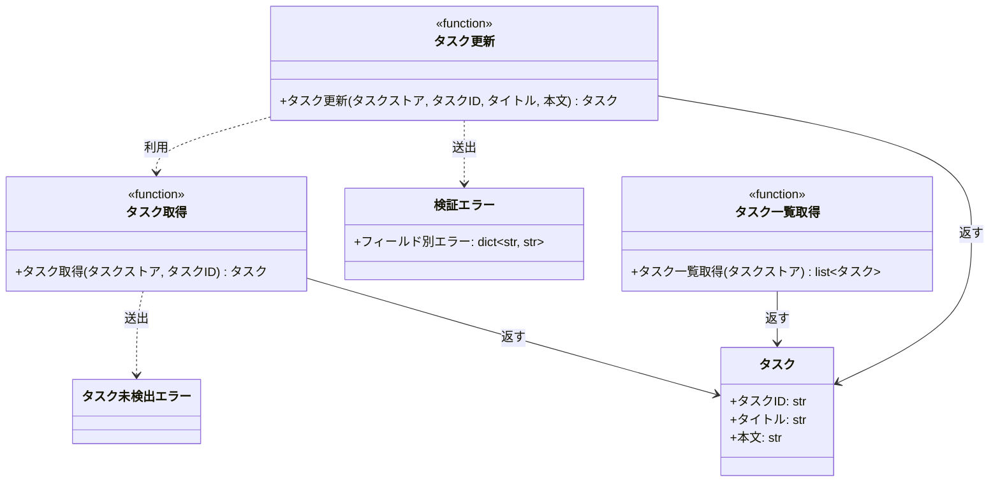

# モジュール構成: バックエンド / タスク

`タスク` ドメイン（バックエンド側）に属する構成要素詳細。

- 対応テストファイル: 未記入（テストのレビュー完了時に記入する）

## 一覧

| ユースケース | 役割 | コンテナ | 種別 | 名前 | 概要 | 補足 |
| --- | --- | --- | --- | --- | --- | --- |
| 共通 | ドメインモデル | `tasks/models.py` | データモデル | [`Task`](#タスク) | タスク 1 件 | - |
| 共通 | 例外 | `tasks/errors.py` | クラス | [`TaskNotFoundError`](#タスク未検出エラー) | 指定 ID のタスクが存在しない | - |
| 共通 | 例外 | `tasks/errors.py` | クラス | [`ValidationError`](#検証エラー) | 入力値が制約を満たさない | フィールド別のエラーを持つ |
| 共通 | 定数 | `tasks/service.py` | 定数 | `TITLE_MIN_LENGTH` | タイトルの最小文字数（`1`） | 単純即値のため詳細セクションなし |
| 共通 | 定数 | `tasks/service.py` | 定数 | `TITLE_MAX_LENGTH` | タイトルの最大文字数（`100`） | 単純即値のため詳細セクションなし |
| 共通 | 定数 | `tasks/service.py` | 定数 | `CONTENT_MAX_LENGTH` | 本文の最大文字数（`1000`） | 単純即値のため詳細セクションなし |
| 共通 | クエリ | `tasks/service.py` | 関数 | [`get_task`](#タスク取得) | ID でタスクを 1 件取得する | - |
| 共通 | クエリ | `tasks/service.py` | 関数 | [`list_tasks`](#タスク一覧取得) | ストアのタスクを ID 順で一覧にする | - |
| タスク更新 | サービス | `tasks/service.py` | 関数 | [`update_task`](#タスク更新) | タイトルと本文を差し替えて更新する | - |

## ディレクトリ構成

```
src/tasks/
├── models.py    # Task
├── errors.py    # TaskNotFoundError / ValidationError
└── service.py   # 取得・更新・一覧の関数と文字数の上下限
```

## 構成図



## タスク
> 物理名: `Task`<br>
> 種別: データモデル<br>
> コンテナ: `tasks/models.py`

タスク 1 件を表す不変のデータモデル。

### プロパティ

| 論理名 | プロパティ名 | 型 | 可視性 | デフォルト | 説明 | 例 | 補足 |
| --- | --- | --- | --- | --- | --- | --- | --- |
| タスク ID | `id` | `str` | 公開 | - | タスクを一意に識別する ID | `"t1"` | ストアのキーと一致する |
| タイトル | `title` | `str` | 公開 | - | タスクのタイトル | `"新タイトル"` | - |
| 本文 | `content` | `str` | 公開 | `""` | タスクの本文 | `"新本文"` | - |

### メソッド

なし

### 単体テスト

なし

### 補足

- `frozen=True` の不変データモデルにする（更新は新しいインスタンスへの差し替えで行う）

## タスク未検出エラー
> 物理名: `TaskNotFoundError`<br>
> 種別: クラス<br>
> コンテナ: `tasks/errors.py`

指定 ID のタスクがストアに存在しないことを表す例外。

### プロパティ

なし

### メソッド

なし

### 単体テスト

なし

## 検証エラー
> 物理名: `ValidationError`<br>
> 種別: クラス<br>
> コンテナ: `tasks/errors.py`

入力値が制約を満たさないことを表す例外。
どのフィールドがどの理由で弾かれたかを呼び出し元が読めるように、フィールド別のエラーを保持する。

### プロパティ

| 論理名 | プロパティ名 | 型 | 可視性 | デフォルト | 説明 | 例 | 補足 |
| --- | --- | --- | --- | --- | --- | --- | --- |
| フィールド別エラー | `errors` | `dict[str, str]` | 公開 | - | フィールド名からエラーメッセージへの対応 | `{"title": "タイトルは 1 文字以上 100 文字以内"}` | 検証に失敗した全フィールドが入る |

### 初期化
> 物理名: `__init__`<br>
> 種別: メソッド

フィールド別エラーを受け取り、その内容を例外メッセージにも載せる。

#### 引数

| 論理名 | 引数名 | 型 | 必須 | デフォルト | 説明 | 補足 |
| --- | --- | --- | --- | --- | --- | --- |
| フィールド別エラー | `errors` | `dict[str, str]` | ✅ | - | フィールド名からエラーメッセージへの対応 | 空辞書は渡さない |

引数例:

```python
raise ValidationError({"title": "タイトルは 1 文字以上 100 文字以内"})
```

#### 戻り値

| 型 | 説明 | 補足 |
| --- | --- | --- |
| `None` | なし | - |

#### 処理

1. フィールド別エラーを属性に保持する
2. フィールド名とメッセージを連結した文字列を例外メッセージとして親クラスへ渡す

#### 例外

なし

#### 単体テスト

| テスト名 | 正常/異常 | 概要 | 条件 | Mock | 期待値 | 補足 |
| --- | --- | --- | --- | --- | --- | --- |
| `test_validation_error` | 正常 | フィールド別エラーを保持する | `{"title": "..."}` を渡す | なし | `errors` が渡した辞書と一致し、例外メッセージにフィールド名が含まれる | - |

## `tasks/service.py`
> 種別: ファイル

タスクの取得・更新・一覧をタスクストア（`dict[str, Task]`）に対して行う関数ファイル。
タスクストアは呼び出し元が保持し、全関数が第 1 引数で受け取る。

---

### タスク取得
> 物理名: `get_task`<br>
> 種別: 関数

タスクストアからタスクを 1 件取得する。

#### 引数

| 論理名 | 引数名 | 型 | 必須 | デフォルト | 説明 | 補足 |
| --- | --- | --- | --- | --- | --- | --- |
| タスクストア | `store` | [`dict[str, Task]`](#タスク) | ✅ | - | タスク ID をキーに持つ保管先 | 呼び出し元が保持する |
| タスク ID | `task_id` | `str` | ✅ | - | 取得対象のタスク ID | - |

引数例:

```python
get_task(store, "t1")
```

#### 戻り値

| 型 | 説明 | 補足 |
| --- | --- | --- |
| [`Task`](#タスク) | 取得したタスク | - |

戻り値例:

```python
Task(id="t1", title="旧タイトル", content="旧本文")
```

#### 処理

1. タスク ID がタスクストアに存在するかを確認する
   - 存在しない場合、`TaskNotFoundError` を投げる（[タスク未検出エラー](#タスク未検出エラー)）
2. 該当するタスクを返す

#### 例外

| 例外名 | 発生条件 | メッセージ | 補足 |
| --- | --- | --- | --- |
| `TaskNotFoundError` | タスク ID がタスクストアに存在しない | `"タスクが見つかりません: {task_id}"` | - |

#### 単体テスト

セットアップ:

| セットアップ | 説明 | 補足 |
| --- | --- | --- |
| タスクストア | `t1` のタスクを 1 件だけ入れた辞書 | ヘルパー関数 `_store` |

| テスト名 | 正常/異常 | 概要 | 条件 | Mock | 期待値 | 補足 |
| --- | --- | --- | --- | --- | --- | --- |
| `test_get_task` | 正常 | 登録済み ID で取得する | `task_id` に `t1` を渡す | なし | `t1` のタスクを返す | - |
| `test_get_task_when_task_missing` | 異常 | 未登録 ID で取得する | `task_id` に `missing` を渡す | なし | `TaskNotFoundError` を送出する | 例外表「タスクストアに存在しない」に対応 |

---

### タスク更新
> 物理名: `update_task`<br>
> 種別: 関数

登録済みタスクのタイトルと本文を差し替えて、更新後のタスクを返す。

#### 引数

| 論理名 | 引数名 | 型 | 必須 | デフォルト | 説明 | 補足 |
| --- | --- | --- | --- | --- | --- | --- |
| タスクストア | `store` | [`dict[str, Task]`](#タスク) | ✅ | - | タスク ID をキーに持つ保管先 | 呼び出し元が保持する |
| タスク ID | `task_id` | `str` | ✅ | - | 更新対象のタスク ID | - |
| タイトル | `title` | `str` | ✅ | - | 更新後のタイトル | 1 文字以上 100 文字以内 |
| 本文 | `content` | `str` | - | `""` | 更新後の本文 | 1000 文字以内 |

引数例:

```python
update_task(store, "t1", "新タイトル", "新本文")
```

#### 戻り値

| 型 | 説明 | 補足 |
| --- | --- | --- |
| [`Task`](#タスク) | 更新後のタスク | タスクストアに書き戻したものと同じインスタンス |

戻り値例:

```python
Task(id="t1", title="新タイトル", content="新本文")
```

#### 処理

1. フィールド別エラーの入れ物を用意する
2. タイトルの文字数を検証する
   - 下限未満または上限超過の場合、`title` のエラーを積む
3. 本文の文字数を検証する
   - 上限超過の場合、`content` のエラーを積む
4. エラーが 1 件でもあれば `ValidationError` を投げる（[検証エラー](#検証エラー)）
5. 更新対象のタスクを取得する（[タスク取得](#タスク取得)）
6. タイトルと本文を差し替えた[タスク](#タスク)を作り、タスクストアへ書き戻して返す

#### 例外

| 例外名 | 発生条件 | メッセージ | 補足 |
| --- | --- | --- | --- |
| `ValidationError` | タイトルが 1 文字未満または 100 文字超 | `{"title": "タイトルは 1 文字以上 100 文字以内"}` | フィールド別エラーの内容 |
| `ValidationError` | 本文が 1000 文字超 | `{"content": "本文は 1000 文字以内"}` | フィールド別エラーの内容 |

#### 単体テスト

セットアップ:

| セットアップ | 説明 | 補足 |
| --- | --- | --- |
| タスクストア | `t1` のタスクを 1 件だけ入れた辞書 | ヘルパー関数 `_store` |

| テスト名 | 正常/異常 | 概要 | 条件 | Mock | 期待値 | 補足 |
| --- | --- | --- | --- | --- | --- | --- |
| `test_update_task` | 正常 | タイトルと本文を更新する | タイトルと本文を両方渡す | なし | 更新後のタスクを返し、タスクストアの `t1` も差し替わる | - |
| `test_update_task_when_content_omitted` | 正常 | 本文を省略する | 本文を渡さない | なし | 返るタスクとタスクストアの本文が空文字になる | デフォルト値の分岐 |
| `test_update_task_when_title_empty` | 異常 | タイトルが空 | タイトルに空文字を渡す | なし | `ValidationError` を送出し、フィールド別エラーに `title` が入る | 例外表「1 文字未満」に対応 |
| `test_update_task_when_title_too_long` | 異常 | タイトルが上限超過 | タイトルに 101 文字を渡す | なし | `ValidationError` を送出し、フィールド別エラーに `title` が入る | 例外表「100 文字超」に対応 |
| `test_update_task_when_content_too_long` | 異常 | 本文が上限超過 | 本文に 1001 文字を渡す | なし | `ValidationError` を送出し、フィールド別エラーに `content` が入る | 例外表「本文が 1000 文字超」に対応 |
| `test_update_task_when_title_and_content_invalid` | 異常 | タイトルと本文が両方不正 | タイトルに空文字、本文に 1001 文字を渡す | なし | `ValidationError` のフィールド別エラーに `title` と `content` の両方が入る | 最初の失敗で打ち切らないことの確認 |
| `test_update_task_when_task_missing` | 異常 | 対象タスクが存在しない | `task_id` に `missing` を渡す | なし | `TaskNotFoundError` を送出し、タスクストアが変わらない | [タスク取得](#タスク取得)からの伝播経路の代表確認 |

---

### タスク一覧取得
> 物理名: `list_tasks`<br>
> 種別: 関数

タスクストアのタスクを ID の昇順で一覧にする。

#### 引数

| 論理名 | 引数名 | 型 | 必須 | デフォルト | 説明 | 補足 |
| --- | --- | --- | --- | --- | --- | --- |
| タスクストア | `store` | [`dict[str, Task]`](#タスク) | ✅ | - | タスク ID をキーに持つ保管先 | 呼び出し元が保持する |

引数例:

```python
list_tasks(store)
```

#### 戻り値

| 型 | 説明 | 補足 |
| --- | --- | --- |
| [`list[Task]`](#タスク) | ID の昇順に並べたタスク | 登録が無ければ空リスト |

戻り値例:

```python
[Task(id="t1", title="新タイトル", content="新本文")]
```

#### 処理

1. タスクストアのキーを昇順に並べる
2. 並び順どおりにタスクを取り出して返す

#### 例外

なし

#### 単体テスト

| テスト名 | 正常/異常 | 概要 | 条件 | Mock | 期待値 | 補足 |
| --- | --- | --- | --- | --- | --- | --- |
| `test_list_tasks` | 正常 | ID の昇順で並べる | `t2` / `t1` の順で登録した辞書を渡す | なし | `t1` / `t2` の順のリストを返す | - |
| `test_list_tasks_when_empty` | 正常 | 登録が無い | 空の辞書を渡す | なし | 空リストを返す | 境界の確認 |
