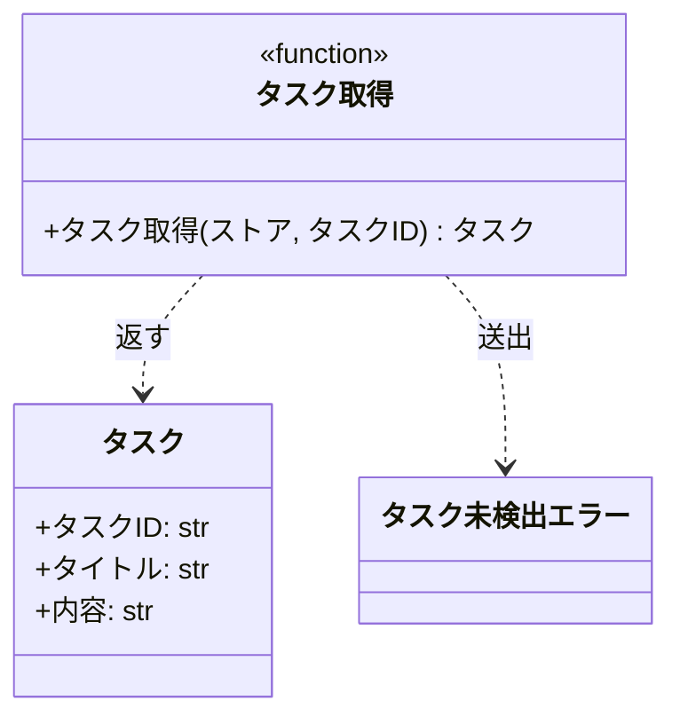
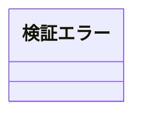

# モジュール構成: バックエンド / タスク

`タスク` ドメイン（バックエンド側）に属する構成要素詳細。

- 対応テストファイル: なし（`src/tasks/` の各ファイルに対応する単体テストは実装に存在しない）

## 一覧

| ユースケース | 役割 | コンテナ | 種別 | 名前 | 概要 | 補足 |
| --- | --- | --- | --- | --- | --- | --- |
| 共通 | ドメインモデル | `src/tasks/models.py` | データモデル | [`Task`](#タスク) | タスク 1 件 | - |
| 共通 | 例外 | `src/tasks/errors.py` | クラス | [`TaskNotFoundError`](#タスク未検出エラー) | 指定 ID のタスクが存在しない | - |
| 共通 | 例外 | `src/tasks/errors.py` | クラス | [`ValidationError`](#検証エラー) | 入力値が制約を満たさない | 送出箇所は実装に存在しない |
| 共通 | サービス | `src/tasks/service.py` | 関数 | [`get_task`](#タスク取得) | ストアからタスクを 1 件取得する | 呼び出し元は実装に存在しない |

## ディレクトリ構成

```
src/tasks/
├── __init__.py   # 空（パッケージマーカー）
├── models.py     # Task
├── errors.py     # TaskNotFoundError / ValidationError
└── service.py    # get_task
```

## 構成図

### タスク取得



---

### 検証エラー



## タスク
> 物理名: `Task`<br>
> 種別: データモデル<br>
> コンテナ: `src/tasks/models.py`

タスク 1 件を表すドメインモデル。

### プロパティ

| 論理名 | プロパティ名 | 型 | 可視性 | デフォルト | 説明 | 例 | 補足 |
| --- | --- | --- | --- | --- | --- | --- | --- |
| タスク ID | `id` | `str` | 公開 | - | タスクの識別子 | - | 採番規則は実装に存在しない |
| タイトル | `title` | `str` | 公開 | - | タスクのタイトル | - | 長さ・必須の制約は実装に存在しない |
| 内容 | `content` | `str` | 公開 | `""` | タスクの内容 | - | - |

### メソッド

なし

### 単体テスト

なし

### 補足

- `@dataclass(frozen=True, slots=True, kw_only=True)` で定義されている（不変・`__slots__` あり・キーワード専用引数）
- 永続化先を持たず、[タスク取得](#タスク取得) の引数で渡される `dict[str, Task]` のストアに保持される

## タスク未検出エラー
> 物理名: `TaskNotFoundError`<br>
> 種別: クラス<br>
> コンテナ: `src/tasks/errors.py`

指定 ID のタスクが存在しないことを表す例外。

### プロパティ

なし

### メソッド

なし

### 単体テスト

なし

### 補足

- `Exception` を直接継承しており、独自の属性・メソッドは持たない
- 送出箇所は [タスク取得](#タスク取得) の 1 箇所

## 検証エラー
> 物理名: `ValidationError`<br>
> 種別: クラス<br>
> コンテナ: `src/tasks/errors.py`

入力値が制約を満たさないことを表す例外。

### プロパティ

なし

### メソッド

なし

### 単体テスト

なし

### 補足

- `Exception` を直接継承しており、独自の属性・メソッドは持たない
- `src/` 配下に送出箇所・捕捉箇所がなく、どの制約違反で使うかは実装から読み取れない

## `src/tasks/service.py`
> 種別: ファイル

タスクのドメインロジックを置く関数ファイル。

---

### タスク取得
> 物理名: `get_task`<br>
> 種別: 関数

ストアからタスクを 1 件取得する。

#### 引数

| 論理名 | 引数名 | 型 | 必須 | デフォルト | 説明 | 補足 |
| --- | --- | --- | --- | --- | --- | --- |
| ストア | `store` | [`dict[str, Task]`](#タスク) | ✅ | - | タスク ID をキーに持つ保持先 | 呼び出し側が用意する |
| タスク ID | `task_id` | `str` | ✅ | - | 取得するタスクの識別子 | - |

引数例:

```python
get_task({"t1": Task(id="t1", title="買い物")}, "t1")
```

#### 戻り値

| 型 | 説明 | 補足 |
| --- | --- | --- |
| [`Task`](#タスク) | ストアから取り出したタスク | ストア内のインスタンスをそのまま返す |

戻り値例:

```python
Task(id="t1", title="買い物", content="")
```

#### 処理

1. `task_id` がストアに登録されているかを判定する
   - 未登録の場合、`TaskNotFoundError` を送出する
2. ストアから `task_id` に対応するタスクを取り出して返す

#### 例外

| 例外名 | 発生条件 | メッセージ | 補足 |
| --- | --- | --- | --- |
| [`TaskNotFoundError`](#タスク未検出エラー) | `task_id` がストアに存在しない | `"task not found: {task_id}"` | メッセージは英語（言語ルールの「例外 raise 時のメッセージは日本語」と異なる） |

#### 単体テスト

なし

### 補足

- ストアを引数で受け取るため、永続化層への依存を持たない
- 取得以外の操作（作成・更新・削除）に対応する関数は実装に存在しない
