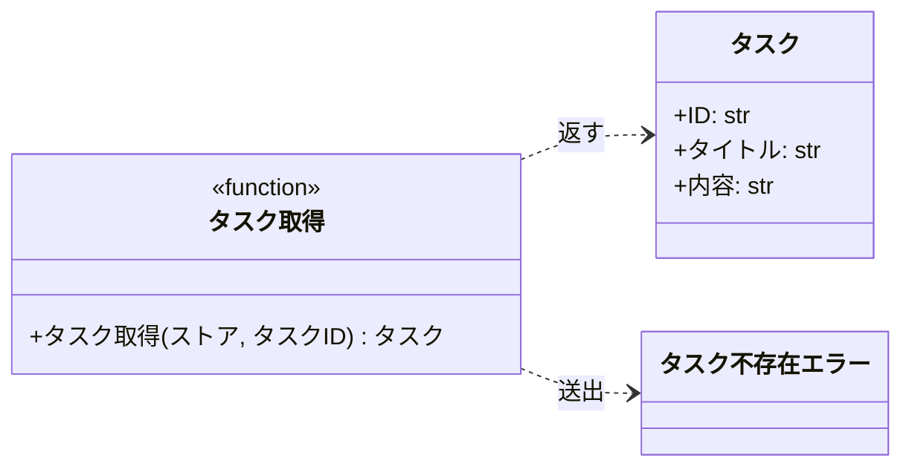

# モジュール構成: バックエンド / タスク

`タスク` ドメイン（バックエンド側）に属する構成要素詳細。

- 対応テストファイル: `tests/unit/tasks/test_service.py`

## 一覧

| ユースケース | 役割 | コンテナ | 種別 | 名前 | 概要 | 補足 |
| --- | --- | --- | --- | --- | --- | --- |
| 共通 | ドメインモデル | `src/tasks/models.py` | データモデル | [`Task`](#タスク) | タスク 1 件を表す不変データ | - |
| 共通 | 例外 | `src/tasks/errors.py` | クラス | [`TaskNotFoundError`](#タスク不存在エラー) | 指定 ID のタスクが存在しない | - |
| 共通 | 例外 | `src/tasks/errors.py` | クラス | [`ValidationError`](#バリデーションエラー) | 入力値が制約を満たさない | 実装内に送出箇所なし |
| 共通 | 公開シンボル | `src/tasks/__init__.py` | - | `tasks` | パッケージ宣言 | 中身は空 |
| 共通 | サービス | `src/tasks/service.py` | 関数 | [`get_task`](#タスク取得) | ストアからタスクを 1 件取得する | 実装内に呼び出し元なし |

## ディレクトリ構成

```
src/tasks/
├── __init__.py   # 空（パッケージ宣言のみ）
├── models.py     # Task
├── errors.py     # TaskNotFoundError / ValidationError
└── service.py    # get_task
```

## 構成図

### タスク取得



---

### バリデーションエラー


## タスク
> 物理名: `Task`<br>
> 種別: データモデル<br>
> コンテナ: `src/tasks/models.py`

タスク 1 件を表すデータモデル。

### プロパティ

| 論理名 | プロパティ名 | 型 | 可視性 | デフォルト | 説明 | 例 | 補足 |
| --- | --- | --- | --- | --- | --- | --- | --- |
| ID | `id` | `str` | 公開 | - | タスクの識別子 | `"t1"` | - |
| タイトル | `title` | `str` | 公開 | - | タスクの表題 | `"旧タイトル"` | - |
| 内容 | `content` | `str` | 公開 | `""` | タスクの本文 | `"旧本文"` | - |

### メソッド

なし

### 単体テスト

なし

### 補足

- `@dataclass(frozen=True, slots=True, kw_only=True)` で定義されており、生成後の値変更ができず、キーワード引数でのみ生成できる

## タスク不存在エラー
> 物理名: `TaskNotFoundError`<br>
> 種別: クラス<br>
> コンテナ: `src/tasks/errors.py`<br>
> 継承元: `Exception`

指定 ID のタスクが存在しないことを表す例外。

### プロパティ

なし

### メソッド

なし

### 単体テスト

なし

### 補足

- クラス本体は docstring のみで、`Exception` の振る舞いをそのまま使う
- 送出箇所は [タスク取得](#タスク取得) の 1 箇所

## バリデーションエラー
> 物理名: `ValidationError`<br>
> 種別: クラス<br>
> コンテナ: `src/tasks/errors.py`<br>
> 継承元: `Exception`

入力値が制約を満たさないことを表す例外。

### プロパティ

なし

### メソッド

なし

### 単体テスト

なし

### 補足

- クラス本体は docstring のみで、`Exception` の振る舞いをそのまま使う
- `src/` 配下に送出箇所が無く、どの制約に対応する例外かは実装から読み取れない

## `src/tasks/service.py`
> 種別: ファイル

タスクのドメインロジックを置く関数ファイル。

---

### タスク取得
> 物理名: `get_task`<br>
> 種別: 関数

ストアからタスクを 1 件取得する。

#### 引数

| 論理名 | 引数名 | 型 | 必須 | デフォルト | 説明 | 補足 |
| --- | --- | --- | --- | --- | --- | --- |
| ストア | `store` | [`dict[str, Task]`](#タスク) | ✅ | - | タスク ID をキーにしたタスクの辞書 | 呼び出し側が保持する |
| タスク ID | `task_id` | `str` | ✅ | - | 取得対象のタスク ID | - |

引数例:

```py
get_task({"t1": Task(id="t1", title="旧タイトル", content="旧本文")}, "t1")
```

#### 戻り値

| 型 | 説明 | 補足 |
| --- | --- | --- |
| [`Task`](#タスク) | ストアから取り出したタスク | ストア内のインスタンスをそのまま返す |

戻り値例:

```py
Task(id="t1", title="旧タイトル", content="旧本文")
```

#### 処理

1. `task_id` がストアのキーに含まれるか確認する
   - 含まれない場合、`TaskNotFoundError` を投げる
2. ストアから `task_id` に対応するタスクを返す

#### 例外

| 例外名 | 発生条件 | メッセージ | 補足 |
| --- | --- | --- | --- |
| [`TaskNotFoundError`](#タスク不存在エラー) | `task_id` がストアのキーに含まれない | `"task not found: {task_id}"` | メッセージは英語 |

#### 単体テスト

なし
