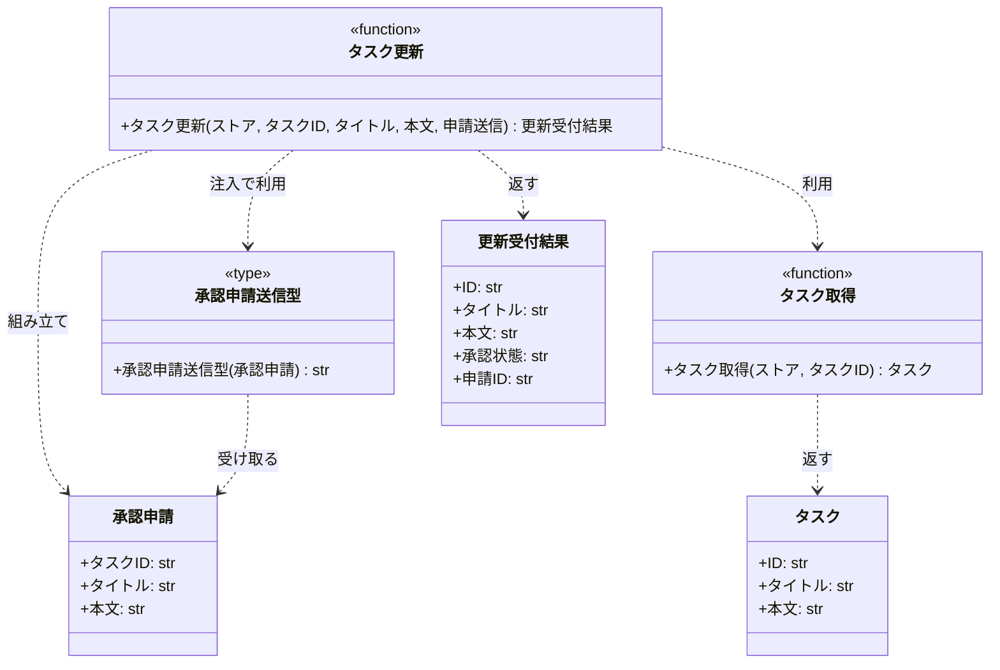

# モジュール構成: バックエンド / タスク

`タスク` ドメイン（バックエンド側）に属する構成要素詳細。
更新は外部承認基盤への申請送信までを担い、承認確定はスコープに含めない。

対応テストファイル: -

## 一覧

| ユースケース | 役割 | コンテナ | 種別 | 名前 | 概要 | 補足 |
| --- | --- | --- | --- | --- | --- | --- |
| 共通 | ドメインモデル | `tasks/models.py` | データモデル | [`Task`](#タスク) | タスク 1 件 | - |
| 共通 | 例外 | `tasks/errors.py` | クラス | `TaskNotFoundError` | 指定 ID のタスクが存在しない | 詳細セクションなし |
| 共通 | 例外 | `tasks/errors.py` | クラス | `ValidationError` | 入力値が制約を満たさない | 詳細セクションなし |
| 共通 | クエリ | `tasks/service.py` | 関数 | [`get_task`](#タスク取得) | ストアからタスクを 1 件取得する | - |
| タスク更新 | DTO | `tasks/models.py` | データモデル | [`UpdateAcceptance`](#更新受付結果) | 更新申請の受付結果 | - |
| タスク更新 | DTO | `tasks/types.py` | データモデル | [`ApprovalRequest`](#承認申請) | 承認基盤へ送る更新申請 | - |
| タスク更新 | 連携型（DI） | `tasks/types.py` | 関数型 | [`SubmitApprovalRequest`](#承認申請送信型) | 申請送信関数のシグネチャ | Mock 差し替え用 |
| タスク更新 | 例外 | `tasks/errors.py` | クラス | `ApprovalRequestError` | 承認基盤が申請を受け付けない | 詳細セクションなし |
| タスク更新 | サービス | `tasks/service.py` | 関数 | [`update_task`](#タスク更新) | 更新申請を送信して受付結果を返す | - |

## ディレクトリ構成

```
src/
└── tasks/
    ├── models.py     # Task / UpdateAcceptance
    ├── types.py      # ApprovalRequest / SubmitApprovalRequest
    ├── errors.py     # TaskNotFoundError / ValidationError / ApprovalRequestError
    └── service.py    # get_task / update_task
```

## 構成図



## タスク
> 物理名: `Task`<br>
> 種別: データモデル<br>
> コンテナ: `tasks/models.py`

ストアに登録されたタスク 1 件。
承認確定をもって更新確定とするため、申請中の内容は本モデルに保持しない。

### プロパティ

| 論理名 | プロパティ名 | 型 | 可視性 | デフォルト | 説明 | 例 | 補足 |
| --- | --- | --- | --- | --- | --- | --- | --- |
| ID | `id` | `str` | 公開 | - | タスクを一意に識別する ID | `"t1"` | - |
| タイトル | `title` | `str` | 公開 | - | 確定済みのタスク名 | `"買い物"` | - |
| 本文 | `content` | `str` | 公開 | `""` | 確定済みの本文 | `"牛乳を買う"` | - |

### メソッド

なし

### 単体テスト

なし

## 更新受付結果
> 物理名: `UpdateAcceptance`<br>
> 種別: データモデル<br>
> コンテナ: `tasks/models.py`

更新申請が承認基盤に受け付けられたことを表す応答。
承認確定を待たずに返すため、申請中の内容と承認状態を持つ。

### プロパティ

| 論理名 | プロパティ名 | 型 | 可視性 | デフォルト | 説明 | 例 | 補足 |
| --- | --- | --- | --- | --- | --- | --- | --- |
| ID | `id` | `str` | 公開 | - | 申請対象のタスク ID | `"t1"` | - |
| タイトル | `title` | `str` | 公開 | - | 申請中のタスク名 | `"買い物リスト"` | ストアの値には反映されない |
| 本文 | `content` | `str` | 公開 | - | 申請中の本文 | `"牛乳と卵を買う"` | ストアの値には反映されない |
| 承認状態 | `status` | `Literal["pending_approval"]` | 公開 | `"pending_approval"` | 承認の進行状態 | `"pending_approval"` | 本 UC では承認待ちのみを返す |
| 申請 ID | `request_id` | `str` | 公開 | - | 承認基盤が採番した申請 ID | `"req-001"` | 承認結果との突合に使う |

### メソッド

なし

### 単体テスト

なし

## 承認申請
> 物理名: `ApprovalRequest`<br>
> 種別: データモデル<br>
> コンテナ: `tasks/types.py`

承認基盤へ送る更新申請の内容。
承認基盤の応答形式には踏み込まず、送信に必要な最小限の項目だけを持つ。

### プロパティ

| 論理名 | プロパティ名 | 型 | 可視性 | デフォルト | 説明 | 例 | 補足 |
| --- | --- | --- | --- | --- | --- | --- | --- |
| タスク ID | `task_id` | `str` | 公開 | - | 申請対象のタスク ID | `"t1"` | - |
| タイトル | `title` | `str` | 公開 | - | 申請するタスク名 | `"買い物リスト"` | 検証済みの値のみ渡る |
| 本文 | `content` | `str` | 公開 | - | 申請する本文 | `"牛乳と卵を買う"` | 検証済みの値のみ渡る |

### メソッド

なし

### 単体テスト

なし

## `tasks/types.py`
> 種別: ファイル

承認基盤との連携を抽象化する DTO と関数型を置くファイル。

---

### 承認申請送信型
> 物理名: `SubmitApprovalRequest`<br>
> 種別: 関数型

承認基盤へ更新申請を送信し、採番された申請 ID を受け取る関数のシグネチャ。
接続先を差し替えられるようにするための DI 用の型。

#### 引数

| 論理名 | 引数名 | 型 | 必須 | デフォルト | 説明 | 補足 |
| --- | --- | --- | --- | --- | --- | --- |
| 承認申請 | `request` | [`ApprovalRequest`](#承認申請) | ✅ | - | 送信する更新申請 | - |

#### 戻り値

| 型 | 説明 | 補足 |
| --- | --- | --- |
| `str` | 承認基盤が採番した申請 ID | 受付に失敗した場合は `ApprovalRequestError` を送出する |

#### 実装

| 実装 | 補足 |
| --- | --- |
| なし | 承認基盤の接続仕様が未確定のため、本 subsystem では実装を持たない。単体テストでは Mock 関数を注入する |

## `tasks/service.py`
> 種別: ファイル

タスクのドメインロジックを束ねる関数ファイル。

---

### タスク取得
> 物理名: `get_task`<br>
> 種別: 関数

ストアからタスクを 1 件取得する。

#### 引数

| 論理名 | 引数名 | 型 | 必須 | デフォルト | 説明 | 補足 |
| --- | --- | --- | --- | --- | --- | --- |
| ストア | `store` | [`dict[str, Task]`](#タスク) | ✅ | - | タスクを保持するインメモリのストア | - |
| タスク ID | `task_id` | `str` | ✅ | - | 取得対象のタスク ID | - |

引数例:

```python
get_task({"t1": Task(id="t1", title="買い物")}, "t1")
```

#### 戻り値

| 型 | 説明 | 補足 |
| --- | --- | --- |
| [`Task`](#タスク) | 該当するタスク | - |

戻り値例:

```python
Task(id="t1", title="買い物", content="牛乳を買う")
```

#### 処理

1. ストアに ID が存在するかを確かめる
   - 存在しない場合、`TaskNotFoundError` を送出する
2. 該当するタスクを返す

#### 例外

| 例外名 | 発生条件 | メッセージ | 補足 |
| --- | --- | --- | --- |
| `TaskNotFoundError` | ストアに `task_id` が存在しない | `"task not found: {task_id}"` | - |

#### 単体テスト

| テスト名 | 正常/異常 | 概要 | 条件 | Mock | 期待値 | 補足 |
| --- | --- | --- | --- | --- | --- | --- |
| `test_get_task` | 正常 | 登録済みのタスクを取得する | ストアに `t1` を登録済み | なし | `t1` の `Task` を返す | - |
| `test_get_task_when_task_missing` | 異常 | 未登録の ID を指定する | ストアに存在しない ID | なし | `TaskNotFoundError` を送出 | 例外表「ストアに `task_id` が存在しない」に対応 |

---

### タスク更新
> 物理名: `update_task`<br>
> 種別: 関数

タスクの更新を承認基盤へ申請し、受付結果を返す。
承認確定をもって更新確定とするため、本関数はストアを変更しない。

#### 引数

| 論理名 | 引数名 | 型 | 必須 | デフォルト | 説明 | 補足 |
| --- | --- | --- | --- | --- | --- | --- |
| ストア | `store` | [`dict[str, Task]`](#タスク) | ✅ | - | タスクを保持するインメモリのストア | 対象の存在確認にのみ使う |
| タスク ID | `task_id` | `str` | ✅ | - | 更新対象のタスク ID | - |
| タイトル | `title` | `str` | ✅ | - | 申請するタスク名 | 1 文字以上 100 文字以内 |
| 本文 | `content` | `str` | - | `""` | 申請する本文 | 1000 文字以内 |
| 申請送信 | `submit` | [`SubmitApprovalRequest`](#承認申請送信型) | ✅ | - | 承認基盤へ申請を送信する関数 | キーワード専用引数 |

引数例:

```python
update_task(store, "t1", "買い物リスト", "牛乳と卵を買う", submit=submit_approval_request)
```

#### 戻り値

| 型 | 説明 | 補足 |
| --- | --- | --- |
| [`UpdateAcceptance`](#更新受付結果) | 承認待ちの受付結果 | - |

戻り値例:

```python
UpdateAcceptance(
    id="t1",
    title="買い物リスト",
    content="牛乳と卵を買う",
    status="pending_approval",
    request_id="req-001",
)
```

#### 処理

1. タイトルの文字数を検証する
   - 1 文字未満または 100 文字超の場合、`ValidationError` を送出する
2. 本文の文字数を検証する
   - 1000 文字超の場合、`ValidationError` を送出する
3. 対象タスクがストアに存在することを確かめる（[タスク取得](#タスク取得)）
4. 申請内容を組み立てて承認基盤へ送信し、申請 ID を受け取る
   - 送信に失敗した場合、`ApprovalRequestError` がそのまま伝播する
5. 申請内容と承認待ちの状態から受付結果を組み立てて返す

#### 例外

| 例外名 | 発生条件 | メッセージ | 補足 |
| --- | --- | --- | --- |
| `ValidationError` | `title` が 1 文字未満または 100 文字超 | `"タイトルは 1 文字以上 100 文字以内で指定してください"` | - |
| `ValidationError` | `content` が 1000 文字超 | `"本文は 1000 文字以内で指定してください"` | - |
| `TaskNotFoundError` | ストアに `task_id` が存在しない | `"task not found: {task_id}"` | [タスク取得](#タスク取得) から伝播する |
| `ApprovalRequestError` | 承認基盤が申請を受け付けない | 送信側が付けたメッセージをそのまま伝播 | `submit` の実装が送出する |

#### 単体テスト

セットアップ:

| セットアップ | 説明 | 補足 |
| --- | --- | --- |
| ストア | `t1` のタスクを 1 件登録したインメモリの `dict` | 各テストで作り直す |

| テスト名 | 正常/異常 | 概要 | 条件 | Mock | 期待値 | 補足 |
| --- | --- | --- | --- | --- | --- | --- |
| `test_update_task` | 正常 | 申請を送信して受付結果を返す | 登録済みの `t1` と妥当なタイトル・本文 | `submit`（`"req-001"` を返す） | `status` が `pending_approval` の `UpdateAcceptance` を返す・`submit` に申請内容が渡る・ストアの `t1` が変更されない | - |
| `test_update_task_when_title_empty` | 異常 | タイトルが空 | `title` に空文字 | `submit`（呼ばれないことを検証） | `ValidationError` を送出・`submit` 未呼び出し | 例外表「`title` が 1 文字未満または 100 文字超」に対応 |
| `test_update_task_when_title_too_long` | 異常 | タイトルが上限超過 | `title` に 101 文字 | `submit`（呼ばれないことを検証） | `ValidationError` を送出・`submit` 未呼び出し | 例外表「`title` が 1 文字未満または 100 文字超」に対応 |
| `test_update_task_when_content_too_long` | 異常 | 本文が上限超過 | `content` に 1001 文字 | `submit`（呼ばれないことを検証） | `ValidationError` を送出・`submit` 未呼び出し | 例外表「`content` が 1000 文字超」に対応 |
| `test_update_task_when_task_missing` | 異常 | 未登録の ID を指定する | ストアに存在しない `task_id` | `submit`（呼ばれないことを検証） | `TaskNotFoundError` を送出・`submit` 未呼び出し | 結合の異常系（タスク不明）に対応 |
| `test_update_task_when_submit_fails` | 異常 | 申請の送信に失敗する | `submit` が `ApprovalRequestError` を送出 | `submit`（例外を送出） | `ApprovalRequestError` を送出・ストアの `t1` が変更されない | 例外表「承認基盤が申請を受け付けない」に対応 |

### 補足

- 承認基盤への接続実装は本 subsystem に含めない（[承認申請送信型](#承認申請送信型) を注入して受ける）
- 承認結果の受信と、それによるストアの更新確定は本 UC のスコープ外
