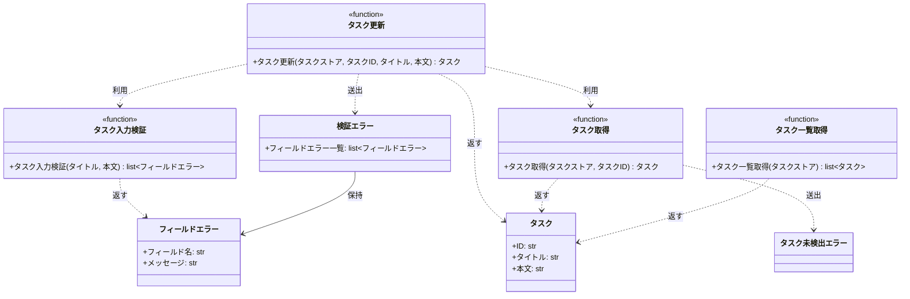

# モジュール構成: バックエンド / タスク

`タスク` ドメイン（バックエンド側）に属する構成要素詳細。

- 対応テストファイル: `tests/unit/tasks/test_service.py` / `tests/unit/tasks/test_errors.py`

## 一覧

| ユースケース | 役割 | コンテナ | 種別 | 名前 | 概要 | 補足 |
| --- | --- | --- | --- | --- | --- | --- |
| 共通 | ドメインモデル | `src/tasks/models.py` | データモデル | [`Task`](#タスク) | タスク 1 件 | - |
| 共通 | エラー詳細 | `src/tasks/errors.py` | データモデル | [`FieldError`](#フィールドエラー) | 検証に失敗したフィールド 1 件分の内容 | - |
| 共通 | 例外 | `src/tasks/errors.py` | クラス | [`TaskNotFoundError`](#タスク未検出エラー) | 指定 ID のタスクが存在しない | - |
| 共通 | 例外 | `src/tasks/errors.py` | クラス | [`ValidationError`](#検証エラー) | 入力値が制約を満たさない | 違反フィールドを全件保持する |
| 共通 | 定数 | `src/tasks/service.py` | 定数 | `TITLE_MIN_LENGTH` | タイトルの最小文字数（`1`） | - |
| 共通 | 定数 | `src/tasks/service.py` | 定数 | `TITLE_MAX_LENGTH` | タイトルの最大文字数（`100`） | - |
| 共通 | 定数 | `src/tasks/service.py` | 定数 | `CONTENT_MAX_LENGTH` | 本文の最大文字数（`1000`） | - |
| 共通 | クエリ | `src/tasks/service.py` | 関数 | [`get_task`](#タスク取得) | ストアからタスクを 1 件取得する | - |
| 共通 | クエリ | `src/tasks/service.py` | 関数 | [`list_tasks`](#タスク一覧取得) | ストアのタスクを ID 順で一覧にする | - |
| タスク更新 | バリデータ | `src/tasks/service.py` | 関数 | [`_validate_task_input`](#タスク入力検証) | 入力値を検証して違反フィールドを全件返す | - |
| タスク更新 | サービス | `src/tasks/service.py` | 関数 | [`update_task`](#タスク更新) | タイトルと本文を更新して返す | - |

## ディレクトリ構成

```
src/tasks/
├── models.py     # Task
├── errors.py     # FieldError / TaskNotFoundError / ValidationError
└── service.py    # 文字数の定数 / get_task / list_tasks / _validate_task_input / update_task
```

## 構成図



## タスク
> 物理名: `Task`<br>
> 種別: データモデル<br>
> コンテナ: `src/tasks/models.py`

タスク 1 件。

### プロパティ

| 論理名 | プロパティ名 | 型 | 可視性 | デフォルト | 説明 | 例 | 補足 |
| --- | --- | --- | --- | --- | --- | --- | --- |
| ID | `id` | `str` | 公開 | - | タスクの一意 ID | `"t1"` | - |
| タイトル | `title` | `str` | 公開 | - | タスク名 | `"決算資料の作成"` | - |
| 本文 | `content` | `str` | 公開 | `""` | タスクの本文 | `"Q2 分の売上をまとめる"` | - |

### メソッド

なし

### 単体テスト

なし

### 補足

- `@dataclass(frozen=True, slots=True, kw_only=True)` の不変データモデルにする（更新はインスタンスの差し替えで表現する）

## フィールドエラー
> 物理名: `FieldError`<br>
> 種別: データモデル<br>
> コンテナ: `src/tasks/errors.py`

検証に失敗したフィールド 1 件分の内容。

### プロパティ

| 論理名 | プロパティ名 | 型 | 可視性 | デフォルト | 説明 | 例 | 補足 |
| --- | --- | --- | --- | --- | --- | --- | --- |
| フィールド名 | `field` | `Literal["title", "content"]` | 公開 | - | 違反したフィールドの名前 | `"title"` | インターフェース定義のリクエストのパラメータ名と一致させる |
| メッセージ | `message` | `str` | 公開 | - | 違反の理由 | `"タイトルは必須です"` | 画面のインラインエラーにそのまま表示する想定 |

### メソッド

なし

### 単体テスト

なし

## タスク未検出エラー
> 物理名: `TaskNotFoundError`<br>
> 種別: クラス<br>
> コンテナ: `src/tasks/errors.py`

指定 ID のタスクが存在しないときに送出する例外。

### プロパティ

なし

### メソッド

なし

### 単体テスト

なし

## 検証エラー
> 物理名: `ValidationError`<br>
> 種別: クラス<br>
> コンテナ: `src/tasks/errors.py`

入力値が制約を満たさないときに送出する例外。
違反したフィールドを全件保持する。

### プロパティ

| 論理名 | プロパティ名 | 型 | 可視性 | デフォルト | 説明 | 例 | 補足 |
| --- | --- | --- | --- | --- | --- | --- | --- |
| フィールドエラー一覧 | `errors` | [`list[FieldError]`](#フィールドエラー) | 公開 | - | 違反したフィールドの一覧 | `[FieldError(field="title", message="タイトルは必須です")]` | 必ず 1 件以上を持つ |

---

### 初期化
> 物理名: `__init__`<br>
> 種別: メソッド

フィールドエラー一覧を受け取り、例外メッセージを組み立てる。

#### 引数

| 論理名 | 引数名 | 型 | 必須 | デフォルト | 説明 | 補足 |
| --- | --- | --- | --- | --- | --- | --- |
| フィールドエラー一覧 | `errors` | [`list[FieldError]`](#フィールドエラー) | ✅ | - | 違反したフィールドの一覧 | 空リストは渡さない |

引数例:

```python
raise ValidationError([FieldError(field="title", message="タイトルは必須です")])
```

#### 戻り値

| 型 | 説明 | 補足 |
| --- | --- | --- |
| `None` | なし | - |

#### 処理

1. `errors` の各件を `"{field}: {message}"` に整形し、`"; "` で連結した文字列を例外メッセージにする
2. `errors` をプロパティに保持する

#### 例外

なし

#### 単体テスト

| テスト名 | 正常/異常 | 概要 | 条件 | Mock | 期待値 | 補足 |
| --- | --- | --- | --- | --- | --- | --- |
| `test_validation_error` | 正常 | 1 件からメッセージを組み立てる | `errors` に `title` の 1 件を渡す | なし | 例外メッセージが `"title: タイトルは必須です"`・`errors` が渡した一覧と一致 | - |
| `test_validation_error_when_multiple_errors` | 正常 | 複数件を連結する | `errors` に `title` と `content` の 2 件を渡す | なし | 例外メッセージが 2 件を `"; "` で連結した文字列になる | - |

---

### 補足

- 例外の基底は `Exception`（プロジェクトに共通の例外基底クラスがないため）

## `src/tasks/service.py`
> 種別: ファイル

タスクのドメインロジックを束ねる関数ファイル。
タスクの保持先は呼び出し元が持つ `dict[str, Task]`（タスクストア）で表現し、本ファイルの関数はそれを引数で受け取る。

---

### タスク取得
> 物理名: `get_task`<br>
> 種別: 関数

ストアからタスクを 1 件取得する。

#### 引数

| 論理名 | 引数名 | 型 | 必須 | デフォルト | 説明 | 補足 |
| --- | --- | --- | --- | --- | --- | --- |
| タスクストア | `store` | [`dict[str, Task]`](#タスク) | ✅ | - | タスク ID をキーにしたタスクの保持先 | - |
| タスク ID | `task_id` | `str` | ✅ | - | 取得対象のタスク ID | - |

引数例:

```python
get_task({"t1": Task(id="t1", title="旧タイトル", content="旧本文")}, "t1")
```

#### 戻り値

| 型 | 説明 | 補足 |
| --- | --- | --- |
| [`Task`](#タスク) | 取得したタスク | - |

戻り値例:

```python
Task(id="t1", title="旧タイトル", content="旧本文")
```

#### 処理

1. `task_id` がストアに無ければ `TaskNotFoundError` を投げる
2. ストアから取り出したタスクを返す

#### 例外

| 例外名 | 発生条件 | メッセージ | 補足 |
| --- | --- | --- | --- |
| `TaskNotFoundError` | `task_id` がストアに存在しない | `"タスクが見つかりません: {task_id}"` | - |

#### 単体テスト

| テスト名 | 正常/異常 | 概要 | 条件 | Mock | 期待値 | 補足 |
| --- | --- | --- | --- | --- | --- | --- |
| `test_get_task` | 正常 | 登録済みの ID で取得する | ストアに `t1` を登録 | なし | `t1` のタスクを返す | - |
| `test_get_task_when_task_missing` | 異常 | 未登録の ID で取得する | ストアに無い ID を渡す | なし | `TaskNotFoundError` を送出 | 例外表「`task_id` がストアに存在しない」に対応 |

---

### タスク一覧取得
> 物理名: `list_tasks`<br>
> 種別: 関数

ストアのタスクを ID 順で一覧にする。

#### 引数

| 論理名 | 引数名 | 型 | 必須 | デフォルト | 説明 | 補足 |
| --- | --- | --- | --- | --- | --- | --- |
| タスクストア | `store` | [`dict[str, Task]`](#タスク) | ✅ | - | タスク ID をキーにしたタスクの保持先 | - |

引数例:

```python
list_tasks({"t2": Task(id="t2", title="B"), "t1": Task(id="t1", title="A")})
```

#### 戻り値

| 型 | 説明 | 補足 |
| --- | --- | --- |
| [`list[Task]`](#タスク) | タスク ID の昇順に並べたタスク | ストアが空なら空リスト |

戻り値例:

```python
[Task(id="t1", title="A", content=""), Task(id="t2", title="B", content="")]
```

#### 処理

1. ストアのキーを昇順に並べ、対応するタスクを順に並べたリストを返す

#### 例外

なし

#### 単体テスト

| テスト名 | 正常/異常 | 概要 | 条件 | Mock | 期待値 | 補足 |
| --- | --- | --- | --- | --- | --- | --- |
| `test_list_tasks` | 正常 | ID の昇順で並べる | `t2` / `t1` の順で登録したストア | なし | `t1` → `t2` の順のリストを返す | - |
| `test_list_tasks_when_store_empty` | 正常 | 空のストアを渡す | ストアが空 | なし | 空リストを返す | - |

---

### タスク入力検証
> 物理名: `_validate_task_input`<br>
> 種別: 関数

タイトルと本文を検証し、違反したフィールドを全件返す。

#### 引数

| 論理名 | 引数名 | 型 | 必須 | デフォルト | 説明 | 補足 |
| --- | --- | --- | --- | --- | --- | --- |
| タイトル | `title` | `str` | ✅ | - | 検証するタスク名 | - |
| 本文 | `content` | `str` | ✅ | - | 検証するタスク本文 | - |

引数例:

```python
_validate_task_input("", "a" * 1001)
```

#### 戻り値

| 型 | 説明 | 補足 |
| --- | --- | --- |
| [`list[FieldError]`](#フィールドエラー) | 違反したフィールドの一覧 | 違反が無ければ空リスト |

戻り値例:

```python
[
    FieldError(field="title", message="タイトルは必須です"),
    FieldError(field="content", message="本文は 1000 文字以内で入力してください"),
]
```

#### 処理

1. 違反を貯める空のリストを用意する
2. タイトルの文字数を判定する
   - `TITLE_MIN_LENGTH` 未満の場合、`title` のフィールドエラー（`"タイトルは必須です"`）を追加する
   - `TITLE_MAX_LENGTH` を超える場合、`title` のフィールドエラー（`"タイトルは 100 文字以内で入力してください"`）を追加する
3. 本文の文字数を判定する
   - `CONTENT_MAX_LENGTH` を超える場合、`content` のフィールドエラー（`"本文は 1000 文字以内で入力してください"`）を追加する
4. 貯めた違反の一覧を返す

#### 例外

なし

#### 単体テスト

| テスト名 | 正常/異常 | 概要 | 条件 | Mock | 期待値 | 補足 |
| --- | --- | --- | --- | --- | --- | --- |
| `test_validate_task_input` | 正常 | 制約内の入力を検証する | タイトル 1〜100 文字・本文 1000 文字以内 | なし | 空リストを返す | - |
| `test_validate_task_input_when_title_empty` | 異常 | タイトルが空 | タイトルが `""` | なし | `title` のエラー 1 件だけを返す | 処理ステップ 2 の下限分岐 |
| `test_validate_task_input_when_title_too_long` | 異常 | タイトルが上限超過 | タイトルが 101 文字 | なし | `title` のエラー 1 件だけを返す | 処理ステップ 2 の上限分岐 |
| `test_validate_task_input_when_content_too_long` | 異常 | 本文が上限超過 | 本文が 1001 文字 | なし | `content` のエラー 1 件だけを返す | 処理ステップ 3 の分岐 |
| `test_validate_task_input_when_both_invalid` | 異常 | タイトルと本文が同時に違反 | タイトルが `""`・本文が 1001 文字 | なし | `title` と `content` のエラー 2 件を返す | 全件返すことの確認 |

---

### タスク更新
> 物理名: `update_task`<br>
> 種別: 関数

登録済みタスクのタイトルと本文を更新して返す。

#### 引数

| 論理名 | 引数名 | 型 | 必須 | デフォルト | 説明 | 補足 |
| --- | --- | --- | --- | --- | --- | --- |
| タスクストア | `store` | [`dict[str, Task]`](#タスク) | ✅ | - | タスク ID をキーにしたタスクの保持先 | 更新結果をここへ書き戻す |
| タスク ID | `task_id` | `str` | ✅ | - | 更新対象のタスク ID | - |
| タイトル | `title` | `str` | ✅ | - | 更新後のタスク名 | - |
| 本文 | `content` | `str` | - | `""` | 更新後の本文 | 省略すると空文字で上書きする |

引数例:

```python
update_task(store, "t1", "新タイトル", "新本文")
```

#### 戻り値

| 型 | 説明 | 補足 |
| --- | --- | --- |
| [`Task`](#タスク) | 更新後のタスク | ストアに書き戻したものと同じインスタンス |

戻り値例:

```python
Task(id="t1", title="新タイトル", content="新本文")
```

#### 処理

1. 入力値を検証する（[タスク入力検証](#タスク入力検証)）
2. 検証結果で処理を分ける
   - 違反が 1 件以上ある場合、違反の一覧を渡して `ValidationError` を投げる
   - 違反が無い場合、次のステップへ進む
3. 更新対象のタスクを取得する（[タスク取得](#タスク取得)）
4. 取得したタスクの ID を保ったままタイトルと本文を差し替えたタスクを作り、ストアへ書き戻して返す

#### 例外

| 例外名 | 発生条件 | メッセージ | 補足 |
| --- | --- | --- | --- |
| `ValidationError` | 入力値の検証で 1 件以上の違反が見つかった | 違反を `"{field}: {message}"` に整形して `"; "` で連結した文字列 | 違反したフィールドは `errors` プロパティが持つ |
| `TaskNotFoundError` | `task_id` がストアに存在しない | `"タスクが見つかりません: {task_id}"` | [タスク取得](#タスク取得) から伝播する |

#### 単体テスト

セットアップ:

| セットアップ | 説明 | 補足 |
| --- | --- | --- |
| タスクストア | `t1`（タイトル `"旧タイトル"` / 本文 `"旧本文"`）を 1 件だけ登録したストア | `_store()` ヘルパーで毎回作り直す |

| テスト名 | 正常/異常 | 概要 | 条件 | Mock | 期待値 | 補足 |
| --- | --- | --- | --- | --- | --- | --- |
| `test_update_task` | 正常 | タイトルと本文を更新する | タイトル・本文とも制約内 | なし | 更新後の `Task` を返し、ストアの `t1` も置き換わる | - |
| `test_update_task_when_content_omitted` | 正常 | 本文を省略する | `content` を渡さない | なし | 本文が `""` の `Task` を返す | 処理ステップ 4 の既定値 |
| `test_update_task_when_title_empty` | 異常 | タイトルが空 | タイトルが `""` | なし | `ValidationError` を送出し、`errors` が `title` の 1 件・ストアは更新前のまま | 例外表「検証で 1 件以上の違反」に対応 |
| `test_update_task_when_title_too_long` | 異常 | タイトルが上限超過 | タイトルが 101 文字 | なし | `ValidationError` を送出し、`errors` が `title` の 1 件 | 例外表「検証で 1 件以上の違反」に対応 |
| `test_update_task_when_content_too_long` | 異常 | 本文が上限超過 | 本文が 1001 文字 | なし | `ValidationError` を送出し、`errors` が `content` の 1 件 | 例外表「検証で 1 件以上の違反」に対応 |
| `test_update_task_when_both_invalid` | 異常 | タイトルと本文が同時に違反 | タイトルが `""`・本文が 1001 文字 | なし | `ValidationError` の `errors` が 2 件 | 全件返すことの確認 |
| `test_update_task_when_task_missing` | 異常 | 未登録の ID を渡す | ストアに無い ID を渡す | なし | `TaskNotFoundError` を送出し、ストアは更新前のまま | 例外表「`task_id` がストアに存在しない」に対応 |

---

### 補足

- タスクストアは呼び出し元が持つ `dict` をそのまま受け取る（永続化層は本サブシステムのスコープ外）
- 文字数の定数は本ファイルの先頭に置き、検証は [タスク入力検証](#タスク入力検証) に集約する（検証ロジックを他の関数へ散らさない）
