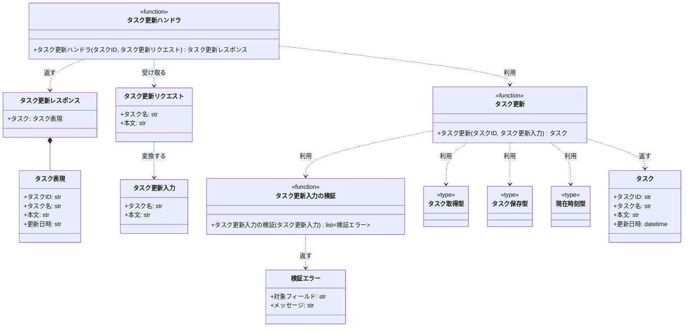
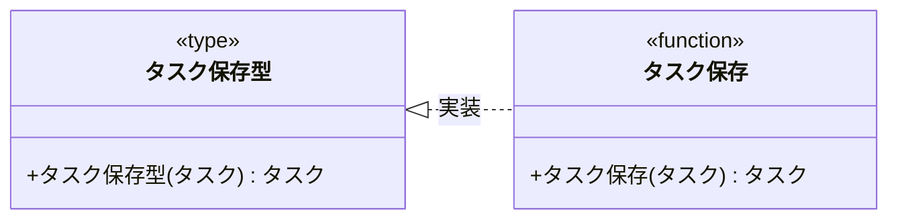

# モジュール構成: バックエンド / タスク

`タスク` ドメイン（バックエンド側）に属する構成要素詳細。

- 対応テストファイル: `-`（テストレビュー完了時に記入）

## 一覧

| ユースケース | 役割 | コンテナ | 種別 | 名前 | 概要 | 補足 |
| --- | --- | --- | --- | --- | --- | --- |
| 共通 | 定数 | `features/tasks/types.py` | 定数 | `TITLE_MAX_LENGTH` | タスク名の最大文字数（100） | 単純即値のため詳細セクションなし |
| タスク更新 | ドメインモデル | `features/tasks/types.py` | データモデル | [`Task`](#タスク) | タスク 1 件の内容 | - |
| タスク更新 | 入力 DTO | `features/tasks/types.py` | データモデル | [`TaskUpdateInput`](#タスク更新入力) | 更新に使う入力値 | - |
| タスク更新 | 検証結果 DTO | `features/tasks/types.py` | データモデル | [`ValidationIssue`](#検証エラー) | フィールド単位の検証エラー 1 件 | - |
| タスク更新 | 取得型（DI） | `features/tasks/types.py` | 関数型 | [`FindTask`](#タスク取得型) | `find_task` のシグネチャ型 | DI / Mock 差し替え用 |
| タスク更新 | 保存型（DI） | `features/tasks/types.py` | 関数型 | [`SaveTask`](#タスク保存型) | `save_task` のシグネチャ型 | DI / Mock 差し替え用 |
| タスク更新 | 時刻取得型（DI） | `features/tasks/types.py` | 関数型 | [`NowFn`](#現在時刻型) | 現在時刻を返す関数のシグネチャ型 | DI / Mock 差し替え用 |
| タスク更新 | リクエストスキーマ | `features/tasks/schemas.py` | データモデル | [`UpdateTaskRequest`](#タスク更新リクエスト) | 更新リクエストのボディ | - |
| タスク更新 | レスポンススキーマ | `features/tasks/schemas.py` | データモデル | [`UpdateTaskResponse`](#タスク更新レスポンス) | 更新レスポンスのボディ | - |
| タスク更新 | レスポンス要素 | `features/tasks/schemas.py` | データモデル | [`TaskPayload`](#タスク表現) | レスポンスに載せるタスク | - |
| タスク更新 | バリデータ | `features/tasks/validators.py` | 関数 | [`validate_task_update`](#タスク更新入力の検証) | 更新入力の検証 | 例外は投げず検証エラーの一覧を返す |
| タスク更新 | サービス | `features/tasks/service.py` | 関数 | [`update_task`](#タスク更新) | タスクの更新 | - |
| タスク更新 | 永続化 | `features/tasks/db.py` | 関数 | [`find_task`](#タスク取得) | タスク 1 件の取得 | - |
| タスク更新 | 永続化 | `features/tasks/db.py` | 関数 | [`save_task`](#タスク保存) | タスク 1 件の保存 | - |
| タスク更新 | ハンドラ | `features/tasks/route.py` | 関数 | [`update_task_route`](#タスク更新ハンドラ) | `PUT /tasks/{taskId}` のハンドラ | - |

## ディレクトリ構成

```
src/taskapp/features/tasks/
├── __init__.py      # 公開シンボルの再エクスポート
├── types.py         # Task / TaskUpdateInput / ValidationIssue / 関数型 / 定数
├── schemas.py       # UpdateTaskRequest / UpdateTaskResponse / TaskPayload
├── route.py         # PUT /tasks/{taskId} のハンドラ
├── service.py       # タスク更新のドメインロジック
├── validators.py    # 更新入力の検証
└── db.py            # tasks テーブルへの取得 / 保存
```

## 構成図

### タスク更新



### タスク取得型


### タスク保存型



## タスク
> 物理名: `Task`<br>
> 種別: データモデル<br>
> コンテナ: `features/tasks/types.py`

タスク 1 件の内容を表す内部 DTO。

### プロパティ

| 論理名 | プロパティ名 | 型 | 可視性 | デフォルト | 説明 | 例 | 補足 |
| --- | --- | --- | --- | --- | --- | --- | --- |
| タスク ID | `id` | `str` | 公開 | - | タスクの一意 ID | `"task_01"` | - |
| タスク名 | `title` | `str` | 公開 | - | タスク名 | `"決算資料の作成"` | - |
| 本文 | `body` | `str` | 公開 | - | タスク本文 | `"四半期の売上をまとめる"` | 空文字を許容 |
| 更新日時 | `updated_at` | `datetime` | 公開 | - | 最後に更新した時刻 | `datetime(2026, 8, 6, 6, 20, tzinfo=UTC)` | UTC のタイムゾーン付き |

### メソッド

なし

### 単体テスト

なし

## タスク更新入力
> 物理名: `TaskUpdateInput`<br>
> 種別: データモデル<br>
> コンテナ: `features/tasks/types.py`

タスク更新で受け取る入力値。

### プロパティ

| 論理名 | プロパティ名 | 型 | 可視性 | デフォルト | 説明 | 例 | 補足 |
| --- | --- | --- | --- | --- | --- | --- | --- |
| タスク名 | `title` | `str` | 公開 | - | 更新後のタスク名 | `"決算資料の作成"` | 前後の空白を除去した値が入る |
| 本文 | `body` | `str` | 公開 | - | 更新後の本文 | `"四半期の売上をまとめる"` | 空文字を許容 |

### メソッド

なし

### 単体テスト

なし

## 検証エラー
> 物理名: `ValidationIssue`<br>
> 種別: データモデル<br>
> コンテナ: `features/tasks/types.py`

フィールド単位の検証エラー 1 件。

### プロパティ

| 論理名 | プロパティ名 | 型 | 可視性 | デフォルト | 説明 | 例 | 補足 |
| --- | --- | --- | --- | --- | --- | --- | --- |
| 対象フィールド | `field` | `Literal["title", "body"]` | 公開 | - | エラーが起きた入力欄 | `"title"` | リクエストのパラメータ名と一致させる |
| メッセージ | `message` | `str` | 公開 | - | 入力欄の直下に出す文言 | `"タスク名を入力してください"` | 日本語 |

### メソッド

なし

### 単体テスト

なし

## タスク更新リクエスト
> 物理名: `UpdateTaskRequest`<br>
> 種別: データモデル<br>
> コンテナ: `features/tasks/schemas.py`

`PUT /tasks/{taskId}` のリクエストボディ。

### プロパティ

| 論理名 | プロパティ名 | 型 | 可視性 | デフォルト | 説明 | 例 | 補足 |
| --- | --- | --- | --- | --- | --- | --- | --- |
| タスク名 | `title` | `str` | 公開 | - | 更新後のタスク名 | `"決算資料の作成"` | 文字数の検証は [タスク更新入力の検証](#タスク更新入力の検証) が行う |
| 本文 | `body` | `str` | 公開 | - | 更新後の本文 | `"四半期の売上をまとめる"` | 空文字を許容 |

### ドメイン入力への変換
> 物理名: `to_domain`<br>
> 種別: メソッド

リクエストボディを [タスク更新入力](#タスク更新入力) に変換する。

#### 引数

なし

#### 戻り値

| 型 | 説明 | 補足 |
| --- | --- | --- |
| [`TaskUpdateInput`](#タスク更新入力) | 変換後の入力値 | - |

戻り値例:

```python
TaskUpdateInput(title="決算資料の作成", body="四半期の売上をまとめる")
```

#### 処理

1. タスク名の前後の空白を除去する
2. 除去したタスク名と本文で [タスク更新入力](#タスク更新入力) を作って返す

#### 例外

なし

#### 単体テスト

| テスト名 | 正常/異常 | 概要 | 条件 | Mock | 期待値 | 補足 |
| --- | --- | --- | --- | --- | --- | --- |
| `test_to_domain` | 正常 | 入力値へ変換する | `title` / `body` に値を持つリクエスト | なし | 同じ値の `TaskUpdateInput` を返す | - |
| `test_to_domain_when_title_has_spaces` | 正常 | タスク名の空白を除去する | `title` が `"  決算資料  "` | なし | `title` が `"決算資料"` の `TaskUpdateInput` を返す | - |

### 単体テスト

なし

## タスク表現
> 物理名: `TaskPayload`<br>
> 種別: データモデル<br>
> コンテナ: `features/tasks/schemas.py`

レスポンスに載せるタスク 1 件。

### プロパティ

| 論理名 | プロパティ名 | 型 | 可視性 | デフォルト | 説明 | 例 | 補足 |
| --- | --- | --- | --- | --- | --- | --- | --- |
| タスク ID | `id` | `str` | 公開 | - | タスクの一意 ID | `"task_01"` | - |
| タスク名 | `title` | `str` | 公開 | - | 更新後のタスク名 | `"決算資料の作成"` | - |
| 本文 | `body` | `str` | 公開 | - | 更新後の本文 | `"四半期の売上をまとめる"` | - |
| 更新日時 | `updated_at` | `str` | 公開 | - | 更新日時（ISO 8601） | `"2026-08-06T06:20:00+00:00"` | レスポンスでは `updatedAt` として出す |

### メソッド

なし

### 単体テスト

なし

## タスク更新レスポンス
> 物理名: `UpdateTaskResponse`<br>
> 種別: データモデル<br>
> コンテナ: `features/tasks/schemas.py`

`PUT /tasks/{taskId}` のレスポンスボディ。

### プロパティ

| 論理名 | プロパティ名 | 型 | 可視性 | デフォルト | 説明 | 例 | 補足 |
| --- | --- | --- | --- | --- | --- | --- | --- |
| タスク | `task` | [`TaskPayload`](#タスク表現) | 公開 | - | 更新後のタスク | - | - |

### ドメインからの生成
> 物理名: `from_domain`<br>
> 種別: メソッド

更新後の [タスク](#タスク) からレスポンスボディを組み立てる。

#### 引数

| 論理名 | 引数名 | 型 | 必須 | デフォルト | 説明 | 補足 |
| --- | --- | --- | --- | --- | --- | --- |
| タスク | `task` | [`Task`](#タスク) | ✅ | - | 更新後のタスク | - |

引数例:

```python
UpdateTaskResponse.from_domain(task)
```

#### 戻り値

| 型 | 説明 | 補足 |
| --- | --- | --- |
| [`UpdateTaskResponse`](#タスク更新レスポンス) | 組み立てたレスポンスボディ | - |

戻り値例:

```python
UpdateTaskResponse(
    task=TaskPayload(
        id="task_01",
        title="決算資料の作成",
        body="四半期の売上をまとめる",
        updated_at="2026-08-06T06:20:00+00:00",
    )
)
```

#### 処理

1. 更新日時を ISO 8601 文字列に変換する
2. タスクの各項目を [タスク表現](#タスク表現) に詰め替えてレスポンスを返す

#### 例外

なし

#### 単体テスト

| テスト名 | 正常/異常 | 概要 | 条件 | Mock | 期待値 | 補足 |
| --- | --- | --- | --- | --- | --- | --- |
| `test_from_domain` | 正常 | タスクからレスポンスを組み立てる | 更新日時が UTC の `Task` | なし | `task.updated_at` が ISO 8601 文字列のレスポンスを返す | - |

### 単体テスト

なし

## `features/tasks/types.py`
> 種別: ファイル

タスクドメインの DTO・関数型・定数を置くファイル。

---

### タスク取得型
> 物理名: `FindTask`<br>
> 種別: 関数型

タスク ID で 1 件取得する関数のシグネチャ。
DI / Mock 差し替え用。

#### 引数

| 論理名 | 引数名 | 型 | 必須 | デフォルト | 説明 | 補足 |
| --- | --- | --- | --- | --- | --- | --- |
| タスク ID | `task_id` | `str` | ✅ | - | 取得対象のタスク ID | - |

#### 戻り値

| 型 | 説明 | 補足 |
| --- | --- | --- |
| [`Task \| None`](#タスク) | 取得したタスク | 対象が無ければ `None` |

#### 実装

| 実装 | 補足 |
| --- | --- |
| [タスク取得](#タスク取得) | 本番の実装 |

---

### タスク保存型
> 物理名: `SaveTask`<br>
> 種別: 関数型

タスク 1 件を保存する関数のシグネチャ。
DI / Mock 差し替え用。

#### 引数

| 論理名 | 引数名 | 型 | 必須 | デフォルト | 説明 | 補足 |
| --- | --- | --- | --- | --- | --- | --- |
| タスク | `task` | [`Task`](#タスク) | ✅ | - | 保存するタスク | - |

#### 戻り値

| 型 | 説明 | 補足 |
| --- | --- | --- |
| [`Task`](#タスク) | 保存後のタスク | - |

#### 実装

| 実装 | 補足 |
| --- | --- |
| [タスク保存](#タスク保存) | 本番の実装 |

---

### 現在時刻型
> 物理名: `NowFn`<br>
> 種別: 関数型

現在時刻を返す関数のシグネチャ。
更新日時を固定してテストするための DI 用。

#### 引数

なし

#### 戻り値

| 型 | 説明 | 補足 |
| --- | --- | --- |
| `datetime` | 現在時刻 | UTC のタイムゾーン付き |

#### 実装

| 実装 | 補足 |
| --- | --- |
| `partial(datetime.now, UTC)` | 本番の実装。composition root で注入する |

## `features/tasks/validators.py`
> 種別: ファイル

タスクの入力値を検証する関数ファイル。

---

### タスク更新入力の検証
> 物理名: `validate_task_update`<br>
> 種別: 関数

タスク更新の入力値を検証し、見つかった検証エラーを全て返す。

#### 引数

| 論理名 | 引数名 | 型 | 必須 | デフォルト | 説明 | 補足 |
| --- | --- | --- | --- | --- | --- | --- |
| 入力値 | `input` | [`TaskUpdateInput`](#タスク更新入力) | ✅ | - | 検証する入力値 | - |

引数例:

```python
validate_task_update(TaskUpdateInput(title="決算資料の作成", body="四半期の売上をまとめる"))
```

#### 戻り値

| 型 | 説明 | 補足 |
| --- | --- | --- |
| [`list[ValidationIssue]`](#検証エラー) | 見つかった検証エラー | 問題が無ければ空のリスト |

戻り値例:

```python
[ValidationIssue(field="title", message="タスク名を入力してください")]
```

#### 処理

1. 検証エラーの一覧を空で用意する
2. タスク名の文字数で妥当性を判定する
   - 0 文字の場合、`title` の検証エラー「タスク名を入力してください」を追加する
   - `TITLE_MAX_LENGTH` を超える場合、`title` の検証エラー「タスク名は 100 文字以内で入力してください」を追加する
3. 検証エラーの一覧を返す

本文は上限を設けていないため検証しない。

#### 例外

なし

#### 単体テスト

| テスト名 | 正常/異常 | 概要 | 条件 | Mock | 期待値 | 補足 |
| --- | --- | --- | --- | --- | --- | --- |
| `test_validate_task_update` | 正常 | 妥当な入力を通す | `title` が 1 文字以上 100 文字以内 | なし | 空のリストを返す | - |
| `test_validate_task_update_when_title_empty` | 正常 | タスク名が空 | `title` が空文字 | なし | `field` が `title` の検証エラー 1 件を返す | - |
| `test_validate_task_update_when_title_max_length` | 正常 | タスク名が上限ちょうど | `title` が 100 文字 | なし | 空のリストを返す | 境界値 |
| `test_validate_task_update_when_title_too_long` | 正常 | タスク名が上限超過 | `title` が 101 文字 | なし | `field` が `title` の検証エラー 1 件を返す | 境界値 |
| `test_validate_task_update_when_body_empty` | 正常 | 本文が空 | `body` が空文字 | なし | 空のリストを返す | 本文は上限なし |

## `features/tasks/service.py`
> 種別: ファイル

タスク更新のドメインロジックを束ねる関数ファイル。

---

### タスク更新
> 物理名: `update_task`<br>
> 種別: 関数

入力値を検証してからタスクのタイトルと本文を差し替え、保存する。

#### 引数

| 論理名 | 引数名 | 型 | 必須 | デフォルト | 説明 | 補足 |
| --- | --- | --- | --- | --- | --- | --- |
| タスク ID | `task_id` | `str` | ✅ | - | 更新対象のタスク ID | - |
| 入力値 | `input` | [`TaskUpdateInput`](#タスク更新入力) | ✅ | - | 更新に使う入力値 | - |
| タスク取得 | `find` | [`FindTask`](#タスク取得型) | ✅ | - | 対象タスクの取得関数 | キーワード引数で注入 |
| タスク保存 | `save` | [`SaveTask`](#タスク保存型) | ✅ | - | タスクの保存関数 | キーワード引数で注入 |
| 現在時刻 | `now` | [`NowFn`](#現在時刻型) | ✅ | - | 更新日時に入れる時刻の取得関数 | キーワード引数で注入 |

引数例:

```python
update_task(
    "task_01",
    TaskUpdateInput(title="決算資料の作成", body="四半期の売上をまとめる"),
    find=find_task,
    save=save_task,
    now=partial(datetime.now, UTC),
)
```

#### 戻り値

| 型 | 説明 | 補足 |
| --- | --- | --- |
| [`Task`](#タスク) | 更新後のタスク | - |

戻り値例:

```python
Task(
    id="task_01",
    title="決算資料の作成",
    body="四半期の売上をまとめる",
    updated_at=datetime(2026, 8, 6, 6, 20, tzinfo=UTC),
)
```

#### 処理

1. 入力値を検証する（[タスク更新入力の検証](#タスク更新入力の検証)）
   - 検証エラーが 1 件以上ある場合、検証エラーの一覧を持たせた `ValidationError` を投げる
   - `[WARNING]` タスク更新の入力値を却下した（`task_id` / 検証エラーの対象フィールド）
2. タスク ID で更新対象のタスクを取得する（[タスク取得](#タスク取得)）
   - 取得結果が `None` の場合、`NotFoundError` を投げる
   - `[WARNING]` 更新対象のタスクが見つからなかった（`task_id`）
3. 取得したタスクのタイトル・本文を入力値で差し替え、更新日時に現在時刻を入れたタスクを作る
4. タスクを保存して返す（[タスク保存](#タスク保存)）
   - `[INFO]` タスクを更新した（`task_id`）

#### 例外

| 例外名 | 発生条件 | メッセージ | 補足 |
| --- | --- | --- | --- |
| `ValidationError` | 入力値の検証エラーが 1 件以上 | `"タスクの入力値が不正です"` | 検証エラーの一覧を属性で保持する |
| `NotFoundError` | 指定した ID のタスクが存在しない | `"タスクが見つかりません: {task_id}"` | - |

#### 単体テスト

| テスト名 | 正常/異常 | 概要 | 条件 | Mock | 期待値 | 補足 |
| --- | --- | --- | --- | --- | --- | --- |
| `test_update_task` | 正常 | 妥当な入力で更新する | 対象タスクが存在し、入力値が妥当 | タスク取得 / タスク保存 / 現在時刻 | 更新後の `Task` を返し、タスク保存にタイトル・本文・更新日時を差し替えたタスクが渡る | 検証は副作用の無い純粋関数のため実物を使う |
| `test_update_task_when_input_invalid` | 異常 | 入力値が不正 | `title` が空文字 | タスク取得 / タスク保存 / 現在時刻 | `ValidationError` を投げ、タスク取得もタスク保存も呼ばれない | 例外表「検証エラーが 1 件以上」に対応 |
| `test_update_task_when_task_missing` | 異常 | 対象タスクが不在 | タスク取得が `None` を返す | タスク取得 / タスク保存 / 現在時刻 | `NotFoundError` を投げ、タスク保存が呼ばれない | 例外表「タスクが存在しない」に対応 |

## `features/tasks/db.py`
> 種別: ファイル

tasks テーブルへの取得 / 保存を行う関数ファイル。

---

### タスク取得
> 物理名: `find_task`<br>
> 種別: 関数<br>
> 継承元: [`FindTask`](#タスク取得型)

タスク ID で tasks テーブルから 1 件取得する。

#### 引数

| 論理名 | 引数名 | 型 | 必須 | デフォルト | 説明 | 補足 |
| --- | --- | --- | --- | --- | --- | --- |
| タスク ID | `task_id` | `str` | ✅ | - | 取得対象のタスク ID | - |

引数例:

```python
find_task("task_01")
```

#### 戻り値

| 型 | 説明 | 補足 |
| --- | --- | --- |
| [`Task \| None`](#タスク) | 取得したタスク | 対象行が無ければ `None` |

戻り値例:

```python
Task(
    id="task_01",
    title="決算資料の作成",
    body="四半期の売上をまとめる",
    updated_at=datetime(2026, 8, 6, 6, 0, tzinfo=UTC),
)
```

#### 処理

1. タスク ID で tasks テーブルの 1 行を取得する
2. 取得結果で戻り値を確定する
   - 行がある場合、[タスク](#タスク) に詰め替えて返す
   - 行が無い場合、`None` を返す

#### 例外

| 例外名 | 発生条件 | メッセージ | 補足 |
| --- | --- | --- | --- |
| `IntegrationError` | tasks テーブルの参照で DB エラー | `"タスクの取得に失敗しました: {task_id}"` | 原因例外を `raise from` で連鎖する |

#### 単体テスト

| テスト名 | 正常/異常 | 概要 | 条件 | Mock | 期待値 | 補足 |
| --- | --- | --- | --- | --- | --- | --- |
| `test_find_task` | 正常 | 対象行を取得する | tasks に対象行を投入 | DB 接続 | 行の内容と一致する `Task` を返す | - |
| `test_find_task_when_row_missing` | 正常 | 対象行が無い | tasks に対象行を投入しない | DB 接続 | `None` を返す | - |
| `test_find_task_when_db_error` | 異常 | 参照が失敗 | DB 接続が参照時に例外を投げる | DB 接続 | `IntegrationError` を投げる | 例外表「参照で DB エラー」に対応 |

---

### タスク保存
> 物理名: `save_task`<br>
> 種別: 関数<br>
> 継承元: [`SaveTask`](#タスク保存型)

tasks テーブルの対象行を更新する。

#### 引数

| 論理名 | 引数名 | 型 | 必須 | デフォルト | 説明 | 補足 |
| --- | --- | --- | --- | --- | --- | --- |
| タスク | `task` | [`Task`](#タスク) | ✅ | - | 保存するタスク | - |

引数例:

```python
save_task(task)
```

#### 戻り値

| 型 | 説明 | 補足 |
| --- | --- | --- |
| [`Task`](#タスク) | 保存後のタスク | 引数と同じ内容 |

戻り値例:

```python
Task(
    id="task_01",
    title="決算資料の作成",
    body="四半期の売上をまとめる",
    updated_at=datetime(2026, 8, 6, 6, 20, tzinfo=UTC),
)
```

#### 処理

1. タスク ID で tasks テーブルの対象行のタイトル・本文・更新日時を更新する
2. 保存したタスクを返す

#### 例外

| 例外名 | 発生条件 | メッセージ | 補足 |
| --- | --- | --- | --- |
| `IntegrationError` | tasks テーブルの更新で DB エラー | `"タスクの保存に失敗しました: {task_id}"` | 原因例外を `raise from` で連鎖する |

#### 単体テスト

| テスト名 | 正常/異常 | 概要 | 条件 | Mock | 期待値 | 補足 |
| --- | --- | --- | --- | --- | --- | --- |
| `test_save_task` | 正常 | 対象行を更新する | tasks に対象行を投入 | DB 接続 | 対象行のタイトル・本文・更新日時が引数の値になる | - |
| `test_save_task_when_db_error` | 異常 | 更新が失敗 | DB 接続が更新時に例外を投げる | DB 接続 | `IntegrationError` を投げる | 例外表「更新で DB エラー」に対応 |

## `features/tasks/route.py`
> 種別: ファイル

タスクの HTTP エンドポイントを定義する関数ファイル。

---

### タスク更新ハンドラ
> 物理名: `update_task_route`<br>
> 種別: 関数

`PUT /tasks/{taskId}` を受けてタスクを更新し、更新後のタスクを返す。

#### 引数

| 論理名 | 引数名 | 型 | 必須 | デフォルト | 説明 | 補足 |
| --- | --- | --- | --- | --- | --- | --- |
| タスク ID | `task_id` | `str` | ✅ | - | 更新対象のタスク ID | パスパラメータ |
| リクエスト | `request` | [`UpdateTaskRequest`](#タスク更新リクエスト) | ✅ | - | 更新リクエストのボディ | - |
| 配線済み関数 | `handlers` | `Handlers` | ✅ | - | composition root で配線した関数の束 | `Depends` で受け取る |

引数例:

```python
await update_task_route("task_01", UpdateTaskRequest(title="決算資料の作成", body="四半期の売上をまとめる"), handlers)
```

#### 戻り値

| 型 | 説明 | 補足 |
| --- | --- | --- |
| [`UpdateTaskResponse`](#タスク更新レスポンス) | 更新後のタスク | `200 OK` で返す |

戻り値例:

```python
UpdateTaskResponse(
    task=TaskPayload(
        id="task_01",
        title="決算資料の作成",
        body="四半期の売上をまとめる",
        updated_at="2026-08-06T06:20:00+00:00",
    )
)
```

#### 処理

1. リクエストをドメインの入力値に変換する（[ドメイン入力への変換](#ドメイン入力への変換)）
2. タスクを更新する（[タスク更新](#タスク更新)）
3. 更新後のタスクをレスポンスに変換して返す（[ドメインからの生成](#ドメインからの生成)）

#### 例外

なし

#### 単体テスト

| テスト名 | 正常/異常 | 概要 | 条件 | Mock | 期待値 | 補足 |
| --- | --- | --- | --- | --- | --- | --- |
| `test_update_task_route` | 正常 | 更新結果を返す | [タスク更新](#タスク更新) が更新後の `Task` を返す | タスク更新 | 更新後の値を持つ `UpdateTaskResponse` を返す | - |
| `test_update_task_route_when_service_raises` | 正常 | 例外をそのまま伝播する | [タスク更新](#タスク更新) が `NotFoundError` を投げる | タスク更新 | `NotFoundError` がハンドラの外へ伝播する | 捕まえずに共通の例外ハンドラへ渡す |

### 補足

- `update_task` の例外を HTTP ステータスにマップするのは共通の例外ハンドラの責務で、本ファイルでは捕まえない（`ValidationError` → 400 / `NotFoundError` → 404 / `IntegrationError` → 500）
- `find` / `save` / `now` を関数型で受けるのは、単体テストで DB と時刻を差し替えるため
