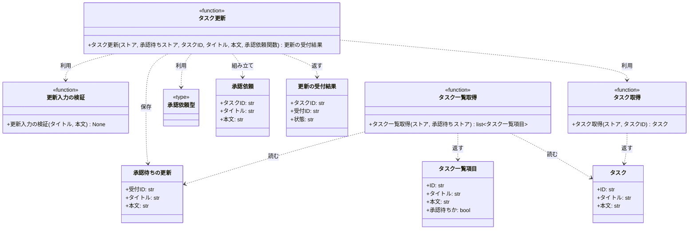
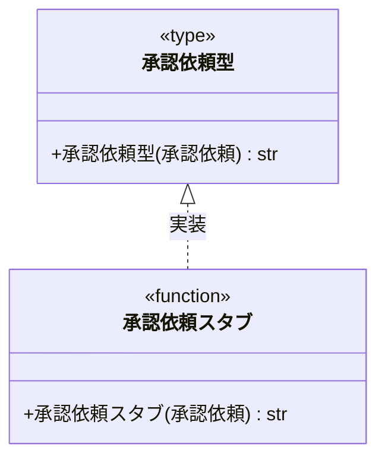
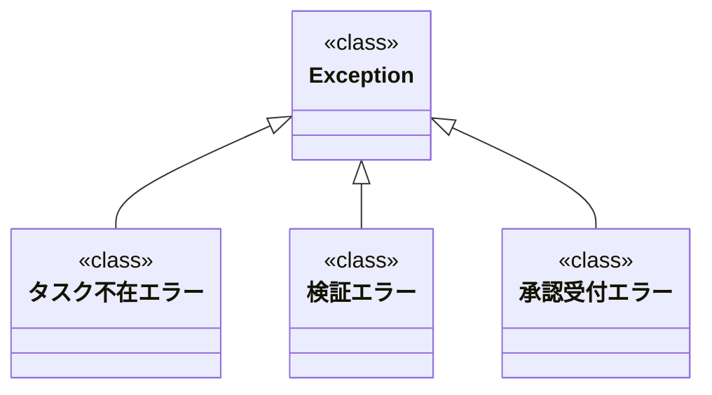

# モジュール構成: バックエンド / タスク

`タスク` ドメイン（バックエンド側）に属する構成要素詳細。
タスクの更新は外部承認基盤への受付までを担い、承認待ちの更新内容は確定済みのタスクとは別に保持する。

## 一覧

| ユースケース | 役割 | コンテナ | 種別 | 名前 | 概要 | 補足 |
| --- | --- | --- | --- | --- | --- | --- |
| 共通 | ドメインモデル | `tasks/models.py` | データモデル | [`Task`](#タスク) | 確定済みのタスク 1 件 | - |
| 共通 | 例外 | `tasks/errors.py` | クラス | `TaskNotFoundError` | 指定 ID のタスクが存在しない | 詳細セクションなし |
| 共通 | 例外 | `tasks/errors.py` | クラス | `ValidationError` | 入力値が制約を満たさない | 詳細セクションなし |
| 共通 | 例外 | `tasks/errors.py` | クラス | `ApprovalRequestError` | 承認基盤への受付が成立しない | 詳細セクションなし |
| 共通 | 取得 | `tasks/service.py` | 関数 | [`get_task`](#タスク取得) | ストアからタスクを 1 件取得する | - |
| タスク更新 | 定数 | `tasks/constants.py` | 定数 | `TITLE_MAX_LENGTH` | タイトルの最大文字数（`100`） | - |
| タスク更新 | 定数 | `tasks/constants.py` | 定数 | `CONTENT_MAX_LENGTH` | 本文の最大文字数（`1000`） | - |
| タスク更新 | 定数 | `tasks/constants.py` | 定数 | `APPROVAL_TIMEOUT_SECONDS` | 承認基盤への受付タイムアウト（`5.0`） | - |
| タスク更新 | バリデータ | `tasks/service.py` | 関数 | [`_validate_update_input`](#更新入力の検証) | タイトルと本文の制約を検証する | 内部専用 |
| タスク更新 | DTO | `tasks/models.py` | データモデル | [`ApprovalRequest`](#承認依頼) | 承認基盤へ送る更新内容 | - |
| タスク更新 | ドメインモデル | `tasks/models.py` | データモデル | [`PendingUpdate`](#承認待ちの更新) | 承認待ちとして保持する更新内容 | - |
| タスク更新 | DTO | `tasks/models.py` | データモデル | [`UpdateAcceptance`](#更新の受付結果) | 更新の受付結果 | - |
| タスク更新 | サービス | `tasks/service.py` | 関数 | [`update_task`](#タスク更新) | 更新を承認基盤へ受け付ける | - |
| タスク更新 | 連携契約（DI） | `tasks/types.py` | 関数型 | [`RequestApproval`](#承認依頼型) | 承認基盤へ受付を依頼する関数のシグネチャ | - |
| タスク更新 | 連携実装 | `tasks/approval_stub.py` | 関数 | [`request_approval_stub`](#承認依頼スタブ) | sandbox 用の承認基盤スタブ | - |
| タスク一覧取得 | DTO | `tasks/models.py` | データモデル | [`TaskListItem`](#タスク一覧項目) | 一覧の 1 件 | - |
| タスク一覧取得 | サービス | `tasks/service.py` | 関数 | [`list_tasks`](#タスク一覧取得) | 承認待ちの識別情報を付けて一覧を返す | - |

## ディレクトリ構成

```
src/tasks/
├── models.py         # Task / ApprovalRequest / PendingUpdate / UpdateAcceptance / TaskListItem
├── errors.py         # TaskNotFoundError / ValidationError / ApprovalRequestError
├── constants.py      # タイトル・本文の上限、承認基盤への受付タイムアウト
├── types.py          # RequestApproval（承認基盤への受付を依頼する関数型）
├── service.py        # get_task / update_task / list_tasks
└── approval_stub.py  # request_approval_stub（sandbox 用の承認基盤スタブ）
```

## 構成図

### タスクの更新と一覧



---

### 承認依頼型



---

### 例外



## タスク
> 物理名: `Task`<br>
> 種別: データモデル<br>
> コンテナ: `tasks/models.py`

承認が完了した確定値だけを持つタスク 1 件。

### プロパティ

| 論理名 | プロパティ名 | 型 | 可視性 | デフォルト | 説明 | 例 | 補足 |
| --- | --- | --- | --- | --- | --- | --- | --- |
| ID | `id` | `str` | 公開 | - | タスクの一意 ID | `"t1"` | - |
| タイトル | `title` | `str` | 公開 | - | 確定済みのタイトル | `"買い物"` | 承認待ちの更新は反映しない |
| 本文 | `content` | `str` | 公開 | `""` | 確定済みの本文 | `"牛乳を買う"` | 承認待ちの更新は反映しない |

### メソッド

なし

### 単体テスト

なし

## 承認依頼
> 物理名: `ApprovalRequest`<br>
> 種別: データモデル<br>
> コンテナ: `tasks/models.py`

承認基盤へ送る更新内容。

### プロパティ

| 論理名 | プロパティ名 | 型 | 可視性 | デフォルト | 説明 | 例 | 補足 |
| --- | --- | --- | --- | --- | --- | --- | --- |
| タスク ID | `task_id` | `str` | 公開 | - | 更新対象のタスク ID | `"t1"` | - |
| タイトル | `title` | `str` | 公開 | - | 更新後のタイトル | `"買い物リスト"` | 検証済みの値 |
| 本文 | `content` | `str` | 公開 | - | 更新後の本文 | `"牛乳と卵を買う"` | 検証済みの値 |

### メソッド

なし

### 単体テスト

なし

## 承認待ちの更新
> 物理名: `PendingUpdate`<br>
> 種別: データモデル<br>
> コンテナ: `tasks/models.py`

承認基盤が受け付け、まだ承認が完了していない更新内容。
確定済みの [タスク](#タスク) とは別のストアに保持する。

### プロパティ

| 論理名 | プロパティ名 | 型 | 可視性 | デフォルト | 説明 | 例 | 補足 |
| --- | --- | --- | --- | --- | --- | --- | --- |
| 受付 ID | `acceptance_id` | `str` | 公開 | - | 承認基盤が採番した受付 ID | `"a-001"` | 承認の追跡に使う |
| タイトル | `title` | `str` | 公開 | - | 承認待ちのタイトル | `"買い物リスト"` | - |
| 本文 | `content` | `str` | 公開 | - | 承認待ちの本文 | `"牛乳と卵を買う"` | - |

### メソッド

なし

### 単体テスト

なし

## 更新の受付結果
> 物理名: `UpdateAcceptance`<br>
> 種別: データモデル<br>
> コンテナ: `tasks/models.py`

更新の受付が成立したことを表す戻り値。

### プロパティ

| 論理名 | プロパティ名 | 型 | 可視性 | デフォルト | 説明 | 例 | 補足 |
| --- | --- | --- | --- | --- | --- | --- | --- |
| タスク ID | `task_id` | `str` | 公開 | - | 受付対象のタスク ID | `"t1"` | - |
| 受付 ID | `acceptance_id` | `str` | 公開 | - | 承認基盤が採番した受付 ID | `"a-001"` | - |
| 状態 | `status` | `Literal["pending_approval"]` | 公開 | `"pending_approval"` | 受付が成立した時点の状態 | `"pending_approval"` | 受付時点では承認待ちのみ |

### メソッド

なし

### 単体テスト

なし

## タスク一覧項目
> 物理名: `TaskListItem`<br>
> 種別: データモデル<br>
> コンテナ: `tasks/models.py`

一覧取得が返す 1 件。
確定値に承認待ちかどうかの識別情報を添えたもの。

### プロパティ

| 論理名 | プロパティ名 | 型 | 可視性 | デフォルト | 説明 | 例 | 補足 |
| --- | --- | --- | --- | --- | --- | --- | --- |
| ID | `id` | `str` | 公開 | - | タスクの一意 ID | `"t1"` | - |
| タイトル | `title` | `str` | 公開 | - | 確定済みのタイトル | `"買い物"` | - |
| 本文 | `content` | `str` | 公開 | - | 確定済みの本文 | `"牛乳を買う"` | - |
| 承認待ちか | `is_pending_approval` | `bool` | 公開 | - | 承認待ちの更新を保持しているか | `True` | 承認待ちストアに同じ ID があれば真 |

### メソッド

なし

### 単体テスト

なし

## `tasks/service.py`
> 種別: ファイル

タスクの取得・更新受付・一覧取得を担う関数ファイル。
確定済みのタスクストアと承認待ちストアを引数で受け取り、外部との通信は関数型で注入された依存に委ねる。

---

### タスク取得
> 物理名: `get_task`<br>
> 種別: 関数

ストアからタスクを 1 件取得する。

#### 引数

| 論理名 | 引数名 | 型 | 必須 | デフォルト | 説明 | 補足 |
| --- | --- | --- | --- | --- | --- | --- |
| ストア | `store` | `dict[str, Task]` | ✅ | - | タスク ID をキーにした確定済みタスク | - |
| タスク ID | `task_id` | `str` | ✅ | - | 取得対象のタスク ID | - |

引数例:

```python
get_task(store, "t1")
```

#### 戻り値

| 型 | 説明 | 補足 |
| --- | --- | --- |
| [`Task`](#タスク) | 取得したタスク | - |

戻り値例:

```python
Task(id="t1", title="買い物", content="牛乳を買う")
```

#### 処理

1. 未登録の ID は例外にする
2. 該当するタスクを返す

#### 例外

| 例外名 | 発生条件 | メッセージ | 補足 |
| --- | --- | --- | --- |
| `TaskNotFoundError` | `task_id` がストアに存在しない | `"task not found: {task_id}"` | - |

#### 単体テスト

| テスト名 | 正常/異常 | 概要 | 条件 | Mock | 期待値 | 補足 |
| --- | --- | --- | --- | --- | --- | --- |
| `test_get_task` | 正常 | 登録済みのタスクを取得する | `t1` を登録したストアを渡す | なし | `t1` の `Task` を返す | - |
| `test_get_task_when_task_missing` | 異常 | 未登録の ID を指定する | 空のストアを渡す | なし | `TaskNotFoundError` を送出する | 例外表「ストアに存在しない」に対応 |

---

### 更新入力の検証
> 物理名: `_validate_update_input`<br>
> 種別: 関数

更新のタイトルと本文が制約を満たすかを検証する。

#### 引数

| 論理名 | 引数名 | 型 | 必須 | デフォルト | 説明 | 補足 |
| --- | --- | --- | --- | --- | --- | --- |
| タイトル | `title` | `str` | ✅ | - | 更新後のタイトル | 1 文字以上 `TITLE_MAX_LENGTH` 文字以内 |
| 本文 | `content` | `str` | ✅ | - | 更新後の本文 | `CONTENT_MAX_LENGTH` 文字以内 |

引数例:

```python
_validate_update_input("買い物リスト", "牛乳と卵を買う")
```

#### 戻り値

| 型 | 説明 | 補足 |
| --- | --- | --- |
| `None` | なし | 制約を満たす場合は何も返さない |

#### 処理

1. タイトルの文字数を確かめる
   - 空文字の場合、`ValidationError` を送出する
   - `TITLE_MAX_LENGTH` を超える場合、`ValidationError` を送出する
2. 本文の文字数を確かめる
   - `CONTENT_MAX_LENGTH` を超える場合、`ValidationError` を送出する

#### 例外

| 例外名 | 発生条件 | メッセージ | 補足 |
| --- | --- | --- | --- |
| `ValidationError` | `title` が空文字 | `"title must not be empty"` | - |
| `ValidationError` | `title` が `TITLE_MAX_LENGTH` 超過 | `"title must be {TITLE_MAX_LENGTH} characters or less"` | - |
| `ValidationError` | `content` が `CONTENT_MAX_LENGTH` 超過 | `"content must be {CONTENT_MAX_LENGTH} characters or less"` | - |

#### 単体テスト

なし（同一ファイル内のヘルパーのため [タスク更新](#タスク更新) の単体テストで分岐を網羅する）

---

### タスク更新
> 物理名: `update_task`<br>
> 種別: 関数

タスクの更新を外部承認基盤へ受け付け、承認待ちとして保持する。
確定済みのタスクは書き換えない。

#### 引数

| 論理名 | 引数名 | 型 | 必須 | デフォルト | 説明 | 補足 |
| --- | --- | --- | --- | --- | --- | --- |
| ストア | `store` | `dict[str, Task]` | ✅ | - | タスク ID をキーにした確定済みタスク | 本関数では書き換えない |
| 承認待ちストア | `pending` | `dict[str, PendingUpdate]` | ✅ | - | タスク ID をキーにした承認待ちの更新 | 受付成立時に書き込む |
| タスク ID | `task_id` | `str` | ✅ | - | 更新対象のタスク ID | - |
| タイトル | `title` | `str` | ✅ | - | 更新後のタイトル | - |
| 本文 | `content` | `str` | - | `""` | 更新後の本文 | - |
| 承認依頼関数 | `request_approval` | [`RequestApproval`](#承認依頼型) | ✅ | - | 承認基盤へ受付を依頼する関数 | キーワード専用引数 |

引数例:

```python
update_task(store, pending, "t1", "買い物リスト", "牛乳と卵を買う", request_approval=request_approval_stub)
```

#### 戻り値

| 型 | 説明 | 補足 |
| --- | --- | --- |
| [`UpdateAcceptance`](#更新の受付結果) | 更新の受付結果 | 更新後のタスクは返さない |

戻り値例:

```python
UpdateAcceptance(task_id="t1", acceptance_id="a-001", status="pending_approval")
```

#### 処理

1. タイトルと本文を検証する（[更新入力の検証](#更新入力の検証)）
2. 更新対象のタスクが存在することを確かめる（[タスク取得](#タスク取得)）
3. 承認依頼を組み立てて承認基盤へ送り、受付 ID を受け取る（`request_approval` が `ApprovalRequestError` を送出した場合はそのまま伝播する）
4. 受付 ID と更新内容を承認待ちストアに保存する
   - 同じタスクの承認待ちが既にある場合、今回の受付内容で上書きする
5. 更新の受付結果を返す

#### 例外

| 例外名 | 発生条件 | メッセージ | 補足 |
| --- | --- | --- | --- |
| `ValidationError` | タイトルまたは本文が制約違反 | [更新入力の検証](#更新入力の検証) のメッセージ | 伝播のみ |
| `TaskNotFoundError` | `task_id` がストアに存在しない | [タスク取得](#タスク取得) のメッセージ | 伝播のみ |
| `ApprovalRequestError` | 承認基盤が受付に応じない | `request_approval` の実装が決めるメッセージ | 伝播のみ |

#### 単体テスト

セットアップ:

| セットアップ | 説明 | 補足 |
| --- | --- | --- |
| ストア | `t1` を登録した `dict[str, Task]` | fixture: `store` |
| 承認待ちストア | 空の `dict[str, PendingUpdate]` | fixture: `pending` |

| テスト名 | 正常/異常 | 概要 | 条件 | Mock | 期待値 | 補足 |
| --- | --- | --- | --- | --- | --- | --- |
| `test_update_task` | 正常 | 更新を受け付ける | 制約を満たすタイトルと本文を渡す | `request_approval`（固定の受付 ID を返す） | `UpdateAcceptance` を返し、承認待ちストアに `t1` が入り、`store["t1"]` が変わらない。`request_approval` に更新後の値を持つ `ApprovalRequest` が渡る | - |
| `test_update_task_when_pending_exists` | 正常 | 承認待ちを上書きする | `t1` の承認待ちが既にある状態で再度受け付ける | `request_approval`（新しい受付 ID を返す） | 承認待ちストアの `t1` が今回の受付内容になる | 承認待ちの件数は増えない |
| `test_update_task_when_title_empty` | 異常 | タイトルが空 | `title` に空文字を渡す | `request_approval` | `ValidationError` を送出し、`request_approval` が呼ばれず、承認待ちストアが空のまま | 例外表「タイトルまたは本文が制約違反」に対応 |
| `test_update_task_when_title_too_long` | 異常 | タイトルが長すぎる | `TITLE_MAX_LENGTH` + 1 文字のタイトルを渡す | `request_approval` | `ValidationError` を送出し、`request_approval` が呼ばれない | 例外表「タイトルまたは本文が制約違反」に対応 |
| `test_update_task_when_content_too_long` | 異常 | 本文が長すぎる | `CONTENT_MAX_LENGTH` + 1 文字の本文を渡す | `request_approval` | `ValidationError` を送出し、`request_approval` が呼ばれない | 例外表「タイトルまたは本文が制約違反」に対応 |
| `test_update_task_when_task_missing` | 異常 | 対象タスクが未登録 | 未登録の `task_id` を渡す | `request_approval` | `TaskNotFoundError` を送出し、`request_approval` が呼ばれず、承認待ちストアが空のまま | 例外表「ストアに存在しない」に対応 |
| `test_update_task_when_approval_fails` | 異常 | 承認基盤が受付に応じない | `request_approval` が `ApprovalRequestError` を送出する | `request_approval`（例外を送出） | `ApprovalRequestError` を送出し、承認待ちストアが空のまま | 例外表「承認基盤が受付に応じない」に対応 |

---

### タスク一覧取得
> 物理名: `list_tasks`<br>
> 種別: 関数

確定済みのタスクを、承認待ちかどうかの識別情報を添えて一覧で返す。

#### 引数

| 論理名 | 引数名 | 型 | 必須 | デフォルト | 説明 | 補足 |
| --- | --- | --- | --- | --- | --- | --- |
| ストア | `store` | `dict[str, Task]` | ✅ | - | タスク ID をキーにした確定済みタスク | - |
| 承認待ちストア | `pending` | `dict[str, PendingUpdate]` | ✅ | - | タスク ID をキーにした承認待ちの更新 | 判定にのみ使う |

引数例:

```python
list_tasks(store, pending)
```

#### 戻り値

| 型 | 説明 | 補足 |
| --- | --- | --- |
| [`list[TaskListItem]`](#タスク一覧項目) | 一覧の全件 | ストアへの登録順 |

戻り値例:

```python
[TaskListItem(id="t1", title="買い物", content="牛乳を買う", is_pending_approval=True)]
```

#### 処理

1. ストアのタスクを登録順にたどる
2. タスクごとに承認待ちストアへ同じ ID があるかを調べ、確定値と併せて一覧項目を組み立てる
3. 組み立てた一覧を返す

#### 例外

なし

#### 単体テスト

| テスト名 | 正常/異常 | 概要 | 条件 | Mock | 期待値 | 補足 |
| --- | --- | --- | --- | --- | --- | --- |
| `test_list_tasks` | 正常 | 承認待ちのない一覧を返す | `t1` を登録し承認待ちストアは空 | なし | `t1` の `is_pending_approval` が偽で、タイトルと本文が確定値になる | - |
| `test_list_tasks_when_pending_exists` | 正常 | 承認待ちを識別する | `t1` の承認待ちがある | なし | `t1` の `is_pending_approval` が真で、タイトルと本文は確定値のまま | 承認待ちの内容は返さない |
| `test_list_tasks_when_empty` | 正常 | タスクが 1 件もない | 空のストアを渡す | なし | 空のリストを返す | - |

## `tasks/types.py`
> 種別: ファイル

タスクドメインが外部依存を差し替えるための関数型を置くファイル。

---

### 承認依頼型
> 物理名: `RequestApproval`<br>
> 種別: 関数型

承認基盤へ更新の受付を依頼する関数のシグネチャ。
本番の承認基盤クライアントとテスト用のスタブを差し替えるために使う。

#### 引数

| 論理名 | 引数名 | 型 | 必須 | デフォルト | 説明 | 補足 |
| --- | --- | --- | --- | --- | --- | --- |
| 承認依頼 | `request` | [`ApprovalRequest`](#承認依頼) | ✅ | - | 承認基盤へ送る更新内容 | - |

#### 戻り値

| 型 | 説明 | 補足 |
| --- | --- | --- |
| `str` | 承認基盤が採番した受付 ID | 受付が成立しない場合は `ApprovalRequestError` を送出する |

#### 実装

| 実装 | 補足 |
| --- | --- |
| [承認依頼スタブ](#承認依頼スタブ) | sandbox で使う唯一の実装 |

## `tasks/approval_stub.py`
> 種別: ファイル

承認基盤の実クライアントが用意できるまでの代替実装を置くファイル。

---

### 承認依頼スタブ
> 物理名: `request_approval_stub`<br>
> 種別: 関数<br>
> 継承元: [`RequestApproval`](#承認依頼型)

承認基盤へ送らずに受付 ID を採番して返す、sandbox 用のスタブ。

#### 引数

| 論理名 | 引数名 | 型 | 必須 | デフォルト | 説明 | 補足 |
| --- | --- | --- | --- | --- | --- | --- |
| 承認依頼 | `request` | [`ApprovalRequest`](#承認依頼) | ✅ | - | 承認基盤へ送る更新内容 | 送信はせず受付 ID の採番にのみ使う |

引数例:

```python
request_approval_stub(ApprovalRequest(task_id="t1", title="買い物リスト", content="牛乳と卵を買う"))
```

#### 戻り値

| 型 | 説明 | 補足 |
| --- | --- | --- |
| `str` | 採番した受付 ID | - |

戻り値例:

```python
"a-3f2b1c88-..."
```

#### 処理

1. タスク ID と乱数から受付 ID を組み立てて返す

#### 例外

なし

#### 単体テスト

| テスト名 | 正常/異常 | 概要 | 条件 | Mock | 期待値 | 補足 |
| --- | --- | --- | --- | --- | --- | --- |
| `test_request_approval_stub` | 正常 | 受付 ID を採番する | 任意の `ApprovalRequest` を渡す | なし | 空でない文字列を返す | - |
| `test_request_approval_stub_when_called_twice` | 正常 | 受付 ID が重複しない | 同じ `ApprovalRequest` を 2 回渡す | なし | 2 回の戻り値が異なる | 承認の追跡に使うため一意性が要る |

## 補足

- 承認基盤への受付タイムアウト（`APPROVAL_TIMEOUT_SECONDS`）は、実クライアントを追加するときに [承認依頼型](#承認依頼型) の実装側で使う。
  [承認依頼スタブ](#承認依頼スタブ) は通信しないため参照しない
- 確定済みのタスクと承認待ちの更新を別のストアに分けているため、承認が却下されたときは承認待ちストアの該当項目を捨てるだけで済む（却下時の扱いはシステム要件のスコープ外）
- ログ出力は本ページの処理に含めていない。
  本プロジェクトにロガーの基盤がまだなく、その導入は本サブシステムの担当範囲を超えるため
