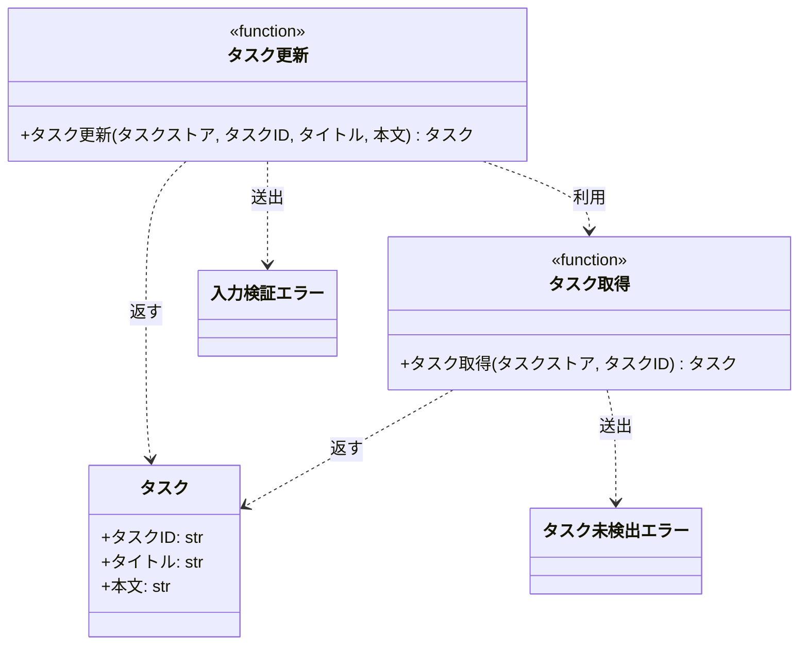

# モジュール構成: バックエンド / タスク

`タスク` ドメイン（バックエンド側）に属する構成要素詳細。

## 一覧

| ユースケース | 役割 | コンテナ | 種別 | 名前 | 概要 | 補足 |
| --- | --- | --- | --- | --- | --- | --- |
| 共通 | ドメインモデル | `src/tasks/models.py` | データモデル | [`Task`](#タスク) | タスク 1 件 | - |
| 共通 | 例外 | `src/tasks/errors.py` | クラス | [`TaskNotFoundError`](#タスク未検出エラー) | 指定 ID のタスクが存在しない | - |
| 共通 | 例外 | `src/tasks/errors.py` | クラス | [`ValidationError`](#入力検証エラー) | 入力値が制約を満たさない | - |
| 共通 | クエリ | `src/tasks/service.py` | 関数 | [`get_task`](#タスク取得) | ストアからタスクを 1 件取得 | - |
| タスク編集 | サービス | `src/tasks/service.py` | 関数 | [`update_task`](#タスク更新) | タイトルと本文を更新 | - |

## ディレクトリ構成

```
src/tasks/
├── __init__.py
├── models.py     # Task
├── errors.py     # TaskNotFoundError / ValidationError
└── service.py    # get_task / update_task
```

## 構成図



## タスク
> 物理名: `Task`<br>
> 種別: データモデル<br>
> コンテナ: `src/tasks/models.py`

タスク 1 件を表す不変のデータモデル。

### プロパティ

| 論理名 | プロパティ名 | 型 | 可視性 | デフォルト | 説明 | 例 | 補足 |
| --- | --- | --- | --- | --- | --- | --- | --- |
| タスク ID | `id` | `str` | 公開 | - | タスクの一意な識別子 | `"t1"` | ストアのキーと一致する |
| タイトル | `title` | `str` | 公開 | - | タスクのタイトル | `"新タイトル"` | - |
| 本文 | `content` | `str` | 公開 | `""` | タスクの本文 | `"新本文"` | - |

### メソッド

なし

### 単体テスト

なし

### 補足

- `frozen=True` の不変モデルのため、更新は新しいインスタンスを作ってストアに差し替える（[タスク更新](#タスク更新)）

## タスク未検出エラー
> 物理名: `TaskNotFoundError`<br>
> 種別: クラス<br>
> コンテナ: `src/tasks/errors.py`

指定 ID のタスクがストアに存在しないことを表す例外。

### プロパティ

なし

### メソッド

なし

### 単体テスト

なし

## 入力検証エラー
> 物理名: `ValidationError`<br>
> 種別: クラス<br>
> コンテナ: `src/tasks/errors.py`

入力値が文字数などの制約を満たさないことを表す例外。

### プロパティ

なし

### メソッド

なし

### 単体テスト

なし

## `src/tasks/service.py`
> 種別: ファイル

タスクのドメインロジックを束ねる関数ファイル。

---

### タスク取得
> 物理名: `get_task`<br>
> 種別: 関数

ストアからタスクを 1 件取得する。

#### 引数

| 論理名 | 引数名 | 型 | 必須 | デフォルト | 説明 | 補足 |
| --- | --- | --- | --- | --- | --- | --- |
| タスクストア | `store` | [`dict[str, Task]`](#タスク) | ✅ | - | タスク ID をキーに持つストア | 呼び出し側が保持する |
| タスク ID | `task_id` | `str` | ✅ | - | 取得対象のタスク ID | - |

引数例:

```python
get_task(store, "t1")
```

#### 戻り値

| 型 | 説明 | 補足 |
| --- | --- | --- |
| [`Task`](#タスク) | 取得したタスク | ストアが保持しているインスタンスをそのまま返す |

戻り値例:

```python
Task(id="t1", title="旧タイトル", content="旧本文")
```

#### 処理

1. 未登録の ID は例外にする
   - ストアに `task_id` が無い場合、`TaskNotFoundError` を投げる
2. 該当タスクを返す

#### 例外

| 例外名 | 発生条件 | メッセージ | 補足 |
| --- | --- | --- | --- |
| `TaskNotFoundError` | `task_id` がストアに存在しない | `"task not found: {task_id}"` | - |

#### 単体テスト

なし（[タスク更新](#タスク更新)の単体テストで取得経路と例外送出を確認する）

---

### タスク更新
> 物理名: `update_task`<br>
> 種別: 関数

登録済みタスクのタイトルと本文を更新して返す。

#### 引数

| 論理名 | 引数名 | 型 | 必須 | デフォルト | 説明 | 補足 |
| --- | --- | --- | --- | --- | --- | --- |
| タスクストア | `store` | [`dict[str, Task]`](#タスク) | ✅ | - | タスク ID をキーに持つストア | 更新結果を書き戻す |
| タスク ID | `task_id` | `str` | ✅ | - | 更新対象のタスク ID | - |
| タイトル | `title` | `str` | ✅ | - | 更新後のタイトル | 1 文字以上 100 文字以内 |
| 本文 | `content` | `str` | - | `""` | 更新後の本文 | 1000 文字以内 |

引数例:

```python
update_task(store, "t1", "新タイトル", "新本文")
```

#### 戻り値

| 型 | 説明 | 補足 |
| --- | --- | --- |
| [`Task`](#タスク) | 更新後のタスク | `store[task_id]` にも同じインスタンスが入る |

戻り値例:

```python
Task(id="t1", title="新タイトル", content="新本文")
```

#### 処理

1. タイトルを検証する
   - 1 文字未満 or 100 文字超過の場合、`ValidationError` を投げる
2. 本文を検証する
   - 1000 文字超過の場合、`ValidationError` を投げる
3. 対象タスクを取得する（[タスク取得](#タスク取得)）
4. 差し替えたタスクを書き戻して返す
   - タスク ID を引き継いだ新しい [`Task`](#タスク) を作り、ストアに上書きする

#### 例外

| 例外名 | 発生条件 | メッセージ | 補足 |
| --- | --- | --- | --- |
| `ValidationError` | `title` が 1 文字未満 or 100 文字超過 | `"title は 1 文字以上 100 文字以内"` | - |
| `ValidationError` | `content` が 1000 文字超過 | `"content は 1000 文字以内"` | 同じ例外の別発生箇所 |
| `TaskNotFoundError` | `task_id` がストアに存在しない | `"task not found: {task_id}"` | [タスク取得](#タスク取得)から伝播する |

#### 単体テスト

セットアップ:

| セットアップ | 説明 | 補足 |
| --- | --- | --- |
| タスクストア | `t1` のタスクを 1 件だけ持つストアを組み立てる | 物理名: `_store` |

| テスト名 | 正常/異常 | 概要 | 条件 | Mock | 期待値 | 補足 |
| --- | --- | --- | --- | --- | --- | --- |
| `test_update_task` | 正常 | タイトルと本文を更新する | タイトルと本文を指定して呼ぶ | なし | 更新後のタスクを返し、ストアにも反映される | - |
| `test_update_task_when_content_omitted` | 正常 | 本文を省略する | 本文の引数を渡さない | なし | 本文が空文字のタスクを返す | - |
| `test_update_task_when_title_empty` | 異常 | タイトルが空 | `title` に空文字を渡す | なし | `ValidationError` を送出 | 例外表「`title` が 1 文字未満」に対応 |
| `test_update_task_when_title_too_long` | 異常 | タイトルが 101 文字 | `title` に 101 文字を渡す | なし | `ValidationError` を送出 | 例外表「`title` が 100 文字超過」に対応 |
| `test_update_task_when_content_too_long` | 異常 | 本文が 1001 文字 | `content` に 1001 文字を渡す | なし | `ValidationError` を送出 | 例外表「`content` が 1000 文字超過」に対応 |
| `test_update_task_when_task_missing` | 異常 | 未登録のタスク ID | ストアに無い `task_id` を渡す | なし | `TaskNotFoundError` を送出し、既存タスクは不変 | 例外表「`task_id` がストアに存在しない」に対応 |

### 補足

- 更新はタイトルと本文の置き換え（部分更新は持たない）。
  本文を残したい場合は呼び出し側が現在値を渡す
