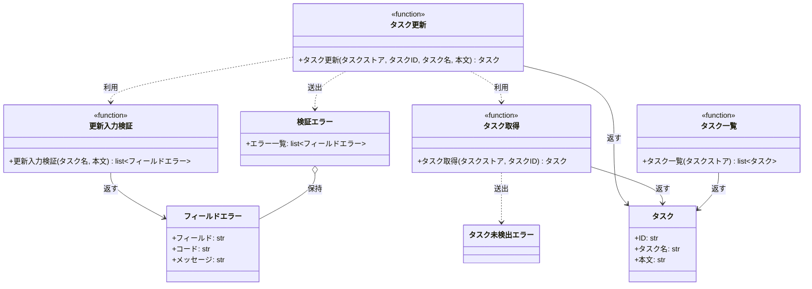

# モジュール構成: バックエンド / タスク

`タスク` ドメイン（バックエンド側）に属する構成要素詳細。
タスクの永続化先は持たず、呼び出し側から受け取った辞書をタスクストアとして読み書きする。

- 対応テストファイル: `tests/unit/tasks/test_service.py`

## 一覧

| ユースケース | 役割 | コンテナ | 種別 | 名前 | 概要 | 補足 |
| --- | --- | --- | --- | --- | --- | --- |
| 共通 | ドメインモデル | `tasks/models.py` | データモデル | [`Task`](#タスク) | タスク 1 件 | - |
| 共通 | エラー詳細 | `tasks/errors.py` | データモデル | [`FieldError`](#フィールドエラー) | 検証に失敗したフィールド 1 件分の内容 | - |
| 共通 | 例外 | `tasks/errors.py` | クラス | [`ValidationError`](#検証エラー) | 検証の失敗をフィールド単位でまとめて運ぶ例外 | - |
| 共通 | 例外 | `tasks/errors.py` | クラス | [`TaskNotFoundError`](#タスク未検出エラー) | 対象タスクが存在しないことを表す例外 | - |
| 共通 | 定数 | `tasks/service.py` | 定数 | `TITLE_MIN_LENGTH` | タスク名の最小文字数 | 値は `1` |
| 共通 | 定数 | `tasks/service.py` | 定数 | `TITLE_MAX_LENGTH` | タスク名の最大文字数 | 値は `100` |
| 共通 | 定数 | `tasks/service.py` | 定数 | `CONTENT_MAX_LENGTH` | 本文の最大文字数 | 値は `1000` |
| 共通 | 取得 | `tasks/service.py` | 関数 | [`get_task`](#タスク取得) | タスクストアからタスクを 1 件取得する | - |
| 共通 | 一覧 | `tasks/service.py` | 関数 | [`list_tasks`](#タスク一覧) | タスクストアのタスクを ID 順で一覧にする | - |
| タスク更新 | バリデータ | `tasks/service.py` | 関数 | [`_validate_update_input`](#更新入力検証) | 更新入力を検証して失敗したフィールドを集める | - |
| タスク更新 | サービス | `tasks/service.py` | 関数 | [`update_task`](#タスク更新) | 検証したうえでタスクを更新する | - |

## ディレクトリ構成

```
src/tasks/
├── models.py     # Task
├── errors.py     # FieldError / ValidationError / TaskNotFoundError
└── service.py    # 文字数の定数・取得・一覧・更新入力の検証・更新
```

## 構成図



## タスク
> 物理名: `Task`<br>
> 種別: データモデル<br>
> コンテナ: `tasks/models.py`

タスク 1 件を表す不変のデータモデル。

### プロパティ

| 論理名 | プロパティ名 | 型 | 可視性 | デフォルト | 説明 | 例 | 補足 |
| --- | --- | --- | --- | --- | --- | --- | --- |
| ID | `id` | `str` | public | - | タスクの一意識別子 | `"t1"` | タスクストアのキーと一致する |
| タスク名 | `title` | `str` | public | - | 一覧・編集画面に出す名前 | `"新タイトル"` | - |
| 本文 | `content` | `str` | public | `""` | タスクの詳細 | `"新本文"` | - |

### メソッド

なし

### 単体テスト

なし

## フィールドエラー
> 物理名: `FieldError`<br>
> 種別: データモデル<br>
> コンテナ: `tasks/errors.py`

検証に失敗したフィールド 1 件分の内容。

### プロパティ

| 論理名 | プロパティ名 | 型 | 可視性 | デフォルト | 説明 | 例 | 補足 |
| --- | --- | --- | --- | --- | --- | --- | --- |
| フィールド | `field` | `Literal["title", "content"]` | public | - | 検証に失敗したフィールド名 | `"title"` | インターフェース定義のリクエストのパラメータ名と一致させる |
| コード | `code` | `Literal["required", "too_long"]` | public | - | 失敗の種類 | `"required"` | 呼び出し側が表示やハンドリングの分岐に使う |
| メッセージ | `message` | `str` | public | - | 画面にそのまま出せる日本語の説明 | `"タスク名を入力してください"` | - |

### メソッド

なし

### 単体テスト

なし

## 検証エラー
> 物理名: `ValidationError`<br>
> 種別: クラス<br>
> コンテナ: `tasks/errors.py`

入力検証に失敗したことを表す例外。
失敗したフィールドを 1 件以上まとめて持つ。

### プロパティ

| 論理名 | プロパティ名 | 型 | 可視性 | デフォルト | 説明 | 例 | 補足 |
| --- | --- | --- | --- | --- | --- | --- | --- |
| エラー一覧 | `errors` | [`list[FieldError]`](#フィールドエラー) | public | - | 検証に失敗したフィールドの一覧 | `[FieldError(field="title", code="required", message="タスク名を入力してください")]` | 空の状態では送出しない |

### 初期化
> 物理名: `__init__`<br>
> 種別: メソッド

エラー一覧を保持し、基底の例外メッセージを組み立てる。

#### 引数

| 論理名 | 引数名 | 型 | 必須 | デフォルト | 説明 | 補足 |
| --- | --- | --- | --- | --- | --- | --- |
| エラー一覧 | `errors` | [`list[FieldError]`](#フィールドエラー) | ✅ | - | 検証に失敗したフィールドの一覧 | 1 件以上を渡す |

引数例:

```python
raise ValidationError([FieldError(field="title", code="required", message="タスク名を入力してください")])
```

#### 戻り値

| 型 | 説明 | 補足 |
| --- | --- | --- |
| `None` | なし | - |

#### 処理

1. 受け取ったエラー一覧を `errors` に保持する
2. エラー一覧のフィールド名を連結した文字列を例外メッセージとして基底クラスへ渡す

#### 例外

なし

#### 単体テスト

| テスト名 | 正常/異常 | 概要 | 条件 | Mock | 期待値 | 補足 |
| --- | --- | --- | --- | --- | --- | --- |
| `test_validation_error` | 正常 | エラー一覧の保持とメッセージ組み立て | `title` / `content` の 2 件を渡す | なし | `errors` が渡した 2 件と一致し、例外メッセージに両方のフィールド名が含まれる | - |

## タスク未検出エラー
> 物理名: `TaskNotFoundError`<br>
> 種別: クラス<br>
> コンテナ: `tasks/errors.py`

指定 ID のタスクがタスクストアに存在しないことを表す例外。

### プロパティ

なし

### メソッド

なし

### 単体テスト

なし

## `tasks/service.py`
> 種別: ファイル

タスクの取得・一覧・更新を行う関数ファイル。
タスクストアは呼び出し側から辞書で受け取り、この層では永続化先を決めない。

---

### タスク取得
> 物理名: `get_task`<br>
> 種別: 関数

タスクストアからタスクを 1 件取得する。

#### 引数

| 論理名 | 引数名 | 型 | 必須 | デフォルト | 説明 | 補足 |
| --- | --- | --- | --- | --- | --- | --- |
| タスクストア | `store` | [`dict[str, Task]`](#タスク) | ✅ | - | タスクを ID で引く辞書 | 呼び出し側が保持する |
| タスクID | `task_id` | `str` | ✅ | - | 取得対象のタスク ID | - |

引数例:

```python
get_task(store, "t1")
```

#### 戻り値

| 型 | 説明 | 補足 |
| --- | --- | --- |
| [`Task`](#タスク) | 取得したタスク | - |

戻り値例:

```python
Task(id="t1", title="旧タイトル", content="旧本文")
```

#### 処理

1. `task_id` がタスクストアのキーに無ければ `TaskNotFoundError` を送出する
2. タスクストアから該当タスクを返す

#### 例外

| 例外名 | 発生条件 | メッセージ | 補足 |
| --- | --- | --- | --- |
| `TaskNotFoundError` | `task_id` がタスクストアのキーに無い | `"タスクが見つかりません: {task_id}"` | - |

#### 単体テスト

セットアップ:

| セットアップ | 説明 | 補足 |
| --- | --- | --- |
| タスクストア | `t1` を 1 件登録した辞書を作る | ヘルパー関数 `_store` |

| テスト名 | 正常/異常 | 概要 | 条件 | Mock | 期待値 | 補足 |
| --- | --- | --- | --- | --- | --- | --- |
| `test_get_task` | 正常 | 登録済みタスクの取得 | `t1` を指定 | なし | 登録した `Task` を返す | - |
| `test_get_task_when_task_missing` | 異常 | 未登録 ID の指定 | `missing` を指定 | なし | `TaskNotFoundError` を送出する | 例外表「`task_id` がタスクストアのキーに無い」に対応 |

---

### タスク一覧
> 物理名: `list_tasks`<br>
> 種別: 関数

タスクストアのタスクを ID 順で一覧にする。

#### 引数

| 論理名 | 引数名 | 型 | 必須 | デフォルト | 説明 | 補足 |
| --- | --- | --- | --- | --- | --- | --- |
| タスクストア | `store` | [`dict[str, Task]`](#タスク) | ✅ | - | タスクを ID で引く辞書 | - |

引数例:

```python
list_tasks(store)
```

#### 戻り値

| 型 | 説明 | 補足 |
| --- | --- | --- |
| [`list[Task]`](#タスク) | ID の昇順に並べたタスク | 空のタスクストアなら空リスト |

戻り値例:

```python
[Task(id="t1", title="旧タイトル", content="旧本文")]
```

#### 処理

1. タスクストアのキーを昇順に並べ、その順でタスクを取り出して返す

#### 例外

なし

#### 単体テスト

| テスト名 | 正常/異常 | 概要 | 条件 | Mock | 期待値 | 補足 |
| --- | --- | --- | --- | --- | --- | --- |
| `test_list_tasks` | 正常 | ID の昇順に並ぶ | `t2` / `t1` の順で登録した辞書を渡す | なし | `t1` → `t2` の順で返る | - |
| `test_list_tasks_when_store_empty` | 正常 | 空のタスクストア | 空の辞書を渡す | なし | 空リストを返す | - |

---

### 更新入力検証
> 物理名: `_validate_update_input`<br>
> 種別: 関数

更新入力のタスク名と本文を検証し、失敗したフィールドを集めて返す。

#### 引数

| 論理名 | 引数名 | 型 | 必須 | デフォルト | 説明 | 補足 |
| --- | --- | --- | --- | --- | --- | --- |
| タスク名 | `title` | `str` | ✅ | - | 更新後のタスク名 | - |
| 本文 | `content` | `str` | ✅ | - | 更新後の本文 | 省略の解決は呼び出し側で済ませてから渡す |

引数例:

```python
_validate_update_input("", "a" * 1001)
```

#### 戻り値

| 型 | 説明 | 補足 |
| --- | --- | --- |
| [`list[FieldError]`](#フィールドエラー) | 検証に失敗したフィールドの一覧 | 全て制限内なら空リスト |

戻り値例:

```python
[
    FieldError(field="title", code="required", message="タスク名を入力してください"),
    FieldError(field="content", code="too_long", message="本文は 1000 文字以内で入力してください"),
]
```

#### 処理

1. 空のエラー一覧を用意する
2. タスク名の文字数を見てエラーを積む
   - `TITLE_MIN_LENGTH` 未満の場合、`title` / `required` のエラーを積む
   - `TITLE_MAX_LENGTH` を超える場合、`title` / `too_long` のエラーを積む
3. 本文が `CONTENT_MAX_LENGTH` を超える場合、`content` / `too_long` のエラーを積む
4. 積んだエラー一覧を返す

#### 例外

なし

#### 単体テスト

| テスト名 | 正常/異常 | 概要 | 条件 | Mock | 期待値 | 補足 |
| --- | --- | --- | --- | --- | --- | --- |
| `test_validate_update_input` | 正常 | 全て制限内 | タスク名 1 文字以上 100 文字以内・本文 1000 文字以内 | なし | 空リストを返す | - |
| `test_validate_update_input_when_title_empty` | 正常 | タスク名が空 | タスク名が `""` | なし | `title` / `required` の 1 件を返す | - |
| `test_validate_update_input_when_title_too_long` | 正常 | タスク名が上限超過 | タスク名が 101 文字 | なし | `title` / `too_long` の 1 件を返す | - |
| `test_validate_update_input_when_content_too_long` | 正常 | 本文が上限超過 | 本文が 1001 文字 | なし | `content` / `too_long` の 1 件を返す | - |
| `test_validate_update_input_when_multiple_invalid` | 正常 | 複数フィールドが不正 | タスク名が `""`・本文が 1001 文字 | なし | `title` → `content` の順で 2 件を返す | 1 件目で打ち切らないことの確認 |

---

### タスク更新
> 物理名: `update_task`<br>
> 種別: 関数

登録済みタスクのタスク名と本文を検証したうえで更新し、更新後のタスクを返す。

#### 引数

| 論理名 | 引数名 | 型 | 必須 | デフォルト | 説明 | 補足 |
| --- | --- | --- | --- | --- | --- | --- |
| タスクストア | `store` | [`dict[str, Task]`](#タスク) | ✅ | - | タスクを ID で引く辞書 | 更新はこの辞書を直接書き換える |
| タスクID | `task_id` | `str` | ✅ | - | 更新対象のタスク ID | - |
| タスク名 | `title` | `str` | ✅ | - | 更新後のタスク名 | - |
| 本文 | `content` | `str` | - | `""` | 更新後の本文 | 省略すると本文が空文字で上書きされる |

引数例:

```python
update_task(store, "t1", "新タイトル", "新本文")
```

#### 戻り値

| 型 | 説明 | 補足 |
| --- | --- | --- |
| [`Task`](#タスク) | 更新後のタスク | タスクストアに書き戻したものと同一 |

戻り値例:

```python
Task(id="t1", title="新タイトル", content="新本文")
```

#### 処理

1. タスク名と本文を検証する（[更新入力検証](#更新入力検証)）
2. 検証でエラーが 1 件以上返った場合、そのエラー一覧を載せた `ValidationError` を送出する
3. 更新対象のタスクを取得する（[タスク取得](#タスク取得)）
4. 取得したタスクの ID に新しいタスク名と本文を載せたタスクを作る
5. 作ったタスクをタスクストアへ書き戻して返す

#### 例外

| 例外名 | 発生条件 | メッセージ | 補足 |
| --- | --- | --- | --- |
| `ValidationError` | 更新入力検証がエラーを 1 件以上返した | `"入力値が不正です: title, content"` | 失敗したフィールドの内訳は `errors` が持つ |
| `TaskNotFoundError` | `task_id` がタスクストアのキーに無い | `"タスクが見つかりません: {task_id}"` | [タスク取得](#タスク取得) から伝播する |

#### 単体テスト

セットアップ:

| セットアップ | 説明 | 補足 |
| --- | --- | --- |
| タスクストア | `t1` を 1 件登録した辞書を作る | ヘルパー関数 `_store` |

| テスト名 | 正常/異常 | 概要 | 条件 | Mock | 期待値 | 補足 |
| --- | --- | --- | --- | --- | --- | --- |
| `test_update_task` | 正常 | タスク名と本文の更新 | 制限内のタスク名と本文を渡す | なし | 更新後の `Task` を返し、タスクストアの `t1` も更新後の内容になる | - |
| `test_update_task_when_content_omitted` | 正常 | 本文の省略 | 本文を渡さない | なし | 返るタスクとタスクストアの本文がどちらも空文字になる | デフォルト値の分岐 |
| `test_update_task_when_title_empty` | 異常 | タスク名が空 | タスク名が `""` | なし | `ValidationError` を送出し、`errors` が `title` / `required` の 1 件・タスクストアは編集前のまま | 例外表「更新入力検証がエラーを 1 件以上返した」に対応 |
| `test_update_task_when_title_too_long` | 異常 | タスク名が上限超過 | タスク名が 101 文字 | なし | `ValidationError` を送出し、`errors` が `title` / `too_long` の 1 件 | 例外表「更新入力検証がエラーを 1 件以上返した」に対応 |
| `test_update_task_when_content_too_long` | 異常 | 本文が上限超過 | 本文が 1001 文字 | なし | `ValidationError` を送出し、`errors` が `content` / `too_long` の 1 件 | 例外表「更新入力検証がエラーを 1 件以上返した」に対応 |
| `test_update_task_when_multiple_invalid` | 異常 | 複数フィールドが不正 | タスク名が `""`・本文が 1001 文字 | なし | `ValidationError` を送出し、`errors` が `title` → `content` の順で 2 件 | 例外表「更新入力検証がエラーを 1 件以上返した」に対応 |
| `test_update_task_when_task_missing` | 異常 | 未登録 ID の指定 | 制限内の入力で `missing` を指定 | なし | `TaskNotFoundError` を送出し、タスクストアは編集前のまま | 検証を通過してから存在確認する順序の確認 |

---

### 補足

- タスクストアは呼び出し側から辞書で受け取り、本ファイルでは永続化先を決めない（DB スキーマの変更は本サブシステムのスコープ外）
- タスク名 / 本文の上限値は定数に置き、検証関数と例外メッセージの両方から参照する
