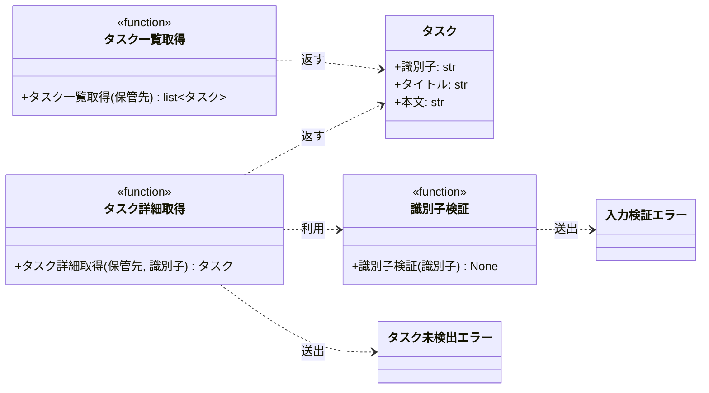

# モジュール構成: バックエンド / タスク

`タスク` ドメイン（バックエンド側）に属する構成要素詳細。
本サイクルの担当範囲は参照系（一覧取得・詳細取得）のみで、作成・更新・削除は持たない。

- 対応テストファイル: `tests/unit/tasks/test_query.py`

## 一覧

| ユースケース | 役割 | コンテナ | 種別 | 名前 | 概要 | 補足 |
| --- | --- | --- | --- | --- | --- | --- |
| 共通 | ドメインモデル | `src/tasks/types.py` | データモデル | [`Task`](#タスク) | タスク 1 件の識別子・タイトル・本文 | - |
| 共通 | 保管先の型 | `src/tasks/types.py` | データモデル | `TaskStore` | 識別子をキーにタスクを保持する辞書 | `dict[str, Task]` の型エイリアス。単純な別名のため詳細セクションなし |
| 共通 | 例外 | `src/tasks/errors.py` | クラス | [`TaskNotFoundError`](#タスク未検出エラー) | 指定した識別子のタスクが存在しない | - |
| 共通 | 例外 | `src/tasks/errors.py` | クラス | [`ValidationError`](#入力検証エラー) | 入力値が制約を満たさない | - |
| 共通 | 定数 | `src/tasks/query.py` | 定数 | `TASK_ID_MIN_LENGTH` | 識別子の最小長（`1`） | 単純即値のため詳細セクションなし |
| 共通 | 定数 | `src/tasks/query.py` | 定数 | `TASK_ID_MAX_LENGTH` | 識別子の最大長（`100`） | 単純即値のため詳細セクションなし |
| 共通 | バリデータ | `src/tasks/query.py` | 関数 | [`_validate_task_id`](#識別子検証) | 識別子の長さを検証する | - |
| タスク一覧取得 | クエリ | `src/tasks/query.py` | 関数 | [`list_tasks`](#タスク一覧取得) | 登録されているタスクを識別子の昇順で全件返す | - |
| タスク詳細取得 | クエリ | `src/tasks/query.py` | 関数 | [`get_task`](#タスク詳細取得) | 識別子を指定してタスク 1 件を返す | - |

## ディレクトリ構成

```
src/tasks/
├── __init__.py     # 公開シンボルの再エクスポート
├── types.py        # Task / TaskStore
├── errors.py       # TaskNotFoundError / ValidationError
└── query.py        # list_tasks / get_task / _validate_task_id / 識別子長の定数
```

## 構成図



## タスク
> 物理名: `Task`<br>
> 種別: データモデル<br>
> コンテナ: `src/tasks/types.py`

タスク 1 件。

### プロパティ

| 論理名 | プロパティ名 | 型 | 可視性 | デフォルト | 説明 | 例 | 補足 |
| --- | --- | --- | --- | --- | --- | --- | --- |
| 識別子 | `id` | `str` | 公開 | - | タスクを一意に識別する値 | `"t1"` | 保管先のキーと一致する |
| タイトル | `title` | `str` | 公開 | - | タスクのタイトル | `"週次レポートの提出"` | - |
| 本文 | `content` | `str` | 公開 | `""` | タスクの本文 | `"今週の進捗をまとめる"` | 未設定のタスクは空文字 |

### メソッド

なし

### 単体テスト

なし

### 補足

- `@dataclass(frozen=True, slots=True, kw_only=True)` で定義する（関数間で受け渡す不変 DTO）
- 値の検証は持たせない。
  本サイクルの担当は参照系のみで、生成経路はテストデータの構築だけのため

## タスク未検出エラー
> 物理名: `TaskNotFoundError`<br>
> 種別: クラス<br>
> コンテナ: `src/tasks/errors.py`

指定した識別子のタスクが保管先に存在しないことを表す例外。

### プロパティ

なし（`Exception` の標準プロパティのみ）

### メソッド

なし

### 単体テスト

なし

### 補足

- [入力検証エラー](#入力検証エラー) とは別の型にして、呼び出し側が「見つからない」と「入力不正」を区別できるようにする

## 入力検証エラー
> 物理名: `ValidationError`<br>
> 種別: クラス<br>
> コンテナ: `src/tasks/errors.py`

入力値が制約を満たさないことを表す例外。

### プロパティ

なし（`Exception` の標準プロパティのみ）

### メソッド

なし

### 単体テスト

なし

### 補足

- 本サイクルで送出するのは識別子の長さ違反のみ

## `src/tasks/query.py`
> 種別: ファイル

タスクの参照系関数を束ねる関数ファイル。
保管先は全ての関数が引数で受け取り、モジュールレベルの状態は持たない。

---

### タスク一覧取得
> 物理名: `list_tasks`<br>
> 種別: 関数

登録されているタスクを識別子の昇順で全件返す。

#### 引数

| 論理名 | 引数名 | 型 | 必須 | デフォルト | 説明 | 補足 |
| --- | --- | --- | --- | --- | --- | --- |
| 保管先 | `store` | `TaskStore` | ✅ | - | タスクの保管先 | 識別子をキーにした辞書 |

引数例:

```python
list_tasks({"t1": Task(id="t1", title="買い物リストの作成")})
```

#### 戻り値

| 型 | 説明 | 補足 |
| --- | --- | --- |
| [`list[Task]`](#タスク) | 識別子の昇順に並べたタスク | 登録が 0 件なら空の配列 |

戻り値例:

```python
[
    Task(id="t1", title="買い物リストの作成", content=""),
    Task(id="t2", title="週次レポートの提出", content="今週の進捗をまとめる"),
]
```

#### 処理

1. 保管先のキーを昇順に整列する
2. 整列したキーの順にタスクを取り出して配列にして返す

#### 例外

なし

#### 単体テスト

| テスト名 | 正常/異常 | 概要 | 条件 | Mock | 期待値 | 補足 |
| --- | --- | --- | --- | --- | --- | --- |
| `test_list_tasks` | 正常 | 識別子の昇順で全件返す | 登録順が昇順と食い違う 2 件を保管先に置く | なし | `t1`, `t2` の順で 2 件返る | 保管先の内容が変化していないことも確認する |
| `test_list_tasks_when_store_empty` | 正常 | 登録が 0 件 | 空の保管先を渡す | なし | 空の配列を返す | 例外を送出しない |

---

### タスク詳細取得
> 物理名: `get_task`<br>
> 種別: 関数

識別子を指定してタスク 1 件を返す。

#### 引数

| 論理名 | 引数名 | 型 | 必須 | デフォルト | 説明 | 補足 |
| --- | --- | --- | --- | --- | --- | --- |
| 保管先 | `store` | `TaskStore` | ✅ | - | タスクの保管先 | 識別子をキーにした辞書 |
| 識別子 | `task_id` | `str` | ✅ | - | 取得対象のタスクの識別子 | 1〜100 文字 |

引数例:

```python
get_task({"t1": Task(id="t1", title="買い物リストの作成")}, "t1")
```

#### 戻り値

| 型 | 説明 | 補足 |
| --- | --- | --- |
| [`Task`](#タスク) | 指定した識別子のタスク | - |

戻り値例:

```python
Task(id="t1", title="買い物リストの作成", content="")
```

#### 処理

1. 識別子の長さを検証する（[識別子検証](#識別子検証)）
2. 保管先に識別子が存在しなければ `TaskNotFoundError` を送出する
3. 保管先から識別子に対応するタスクを取り出して返す

#### 例外

| 例外名 | 発生条件 | メッセージ | 補足 |
| --- | --- | --- | --- |
| `ValidationError` | 識別子の長さが `TASK_ID_MIN_LENGTH` 未満または `TASK_ID_MAX_LENGTH` 超 | `"task_id は {TASK_ID_MIN_LENGTH} 文字以上 {TASK_ID_MAX_LENGTH} 文字以内"` | [識別子検証](#識別子検証) から伝播する |
| `TaskNotFoundError` | 識別子が保管先に存在しない | `"タスクが見つかりません: {task_id}"` | - |

#### 単体テスト

| テスト名 | 正常/異常 | 概要 | 条件 | Mock | 期待値 | 補足 |
| --- | --- | --- | --- | --- | --- | --- |
| `test_get_task` | 正常 | 登録済みの識別子で 1 件返す | `t1` を保管先に置いて `t1` を指定 | なし | `t1` のタスクを返す | 保管先の内容が変化していないことも確認する |
| `test_get_task_when_id_unregistered` | 異常 | 未登録の識別子 | `t1` のみ登録して `t9` を指定 | なし | `TaskNotFoundError` を送出 | 例外表「識別子が保管先に存在しない」に対応 |
| `test_get_task_when_id_empty` | 異常 | 識別子が空文字 | `task_id` に空文字を指定 | なし | `ValidationError` を送出 | 例外表「長さが最小長未満」に対応 |

---

### 識別子検証
> 物理名: `_validate_task_id`<br>
> 種別: 関数

識別子の長さが許容範囲内かを検証する。

#### 引数

| 論理名 | 引数名 | 型 | 必須 | デフォルト | 説明 | 補足 |
| --- | --- | --- | --- | --- | --- | --- |
| 識別子 | `task_id` | `str` | ✅ | - | 検証対象の識別子 | - |

引数例:

```python
_validate_task_id("t1")
```

#### 戻り値

| 型 | 説明 | 補足 |
| --- | --- | --- |
| `None` | 返さない | 許容範囲内なら何もせずに戻る |

#### 処理

1. 識別子の長さが `TASK_ID_MIN_LENGTH` 以上 `TASK_ID_MAX_LENGTH` 以下でなければ `ValidationError` を送出する

#### 例外

| 例外名 | 発生条件 | メッセージ | 補足 |
| --- | --- | --- | --- |
| `ValidationError` | 識別子の長さが `TASK_ID_MIN_LENGTH` 未満または `TASK_ID_MAX_LENGTH` 超 | `"task_id は {TASK_ID_MIN_LENGTH} 文字以上 {TASK_ID_MAX_LENGTH} 文字以内"` | メッセージは定数から組み立て、判定条件との食い違いが起きないようにする |

#### 単体テスト

| テスト名 | 正常/異常 | 概要 | 条件 | Mock | 期待値 | 補足 |
| --- | --- | --- | --- | --- | --- | --- |
| `test_validate_task_id_when_min_length` | 正常 | 下限ちょうど | 1 文字の識別子を渡す | なし | 例外を送出しない | 境界値 |
| `test_validate_task_id_when_max_length` | 正常 | 上限ちょうど | 100 文字の識別子を渡す | なし | 例外を送出しない | 境界値 |
| `test_validate_task_id_when_empty` | 異常 | 下限未満 | 空文字を渡す | なし | `ValidationError` を送出 | 境界値。例外表「最小長未満」に対応 |
| `test_validate_task_id_when_over_max_length` | 異常 | 上限超過 | 101 文字の識別子を渡す | なし | `ValidationError` を送出 | 境界値。例外表「最大長超」に対応 |

---

### 補足

- 参照系のみのため、いずれの関数も保管先の内容を書き換えない
- 保管先を引数で受け取るため、テストでは辞書を直接構築して差し替えられる（Mock を使わない）
