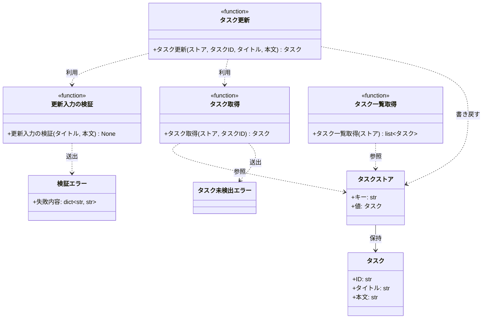
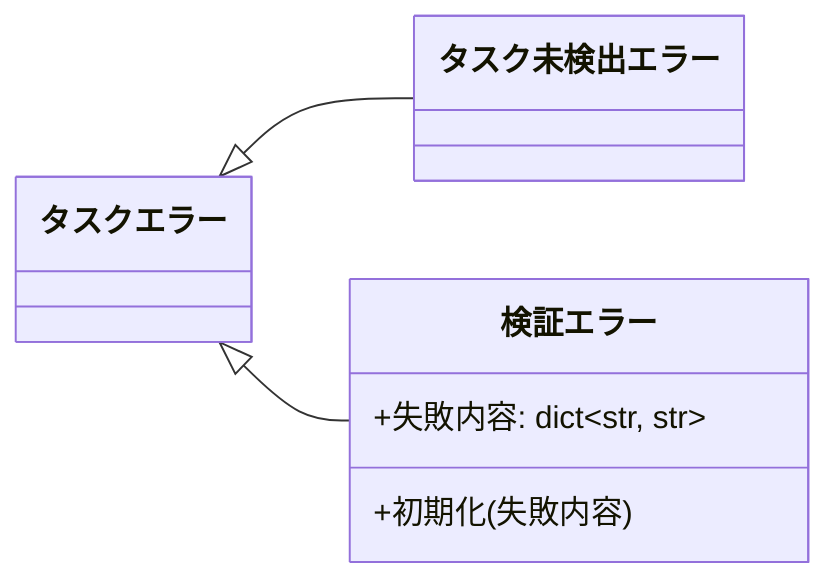

# モジュール構成: バックエンド / タスク

`タスク` ドメイン（バックエンド側）に属する構成要素詳細。
タスクの保持・取得・更新を担い、外部パッケージには依存しない（標準ライブラリのみ）。

## 一覧

| ユースケース | 役割 | コンテナ | 種別 | 名前 | 概要 | 補足 |
| --- | --- | --- | --- | --- | --- | --- |
| 共通 | ドメインモデル | `src/tasks/models.py` | データモデル | [`Task`](#タスク) | タスク 1 件 | - |
| 共通 | 型エイリアス | `src/tasks/models.py` | データモデル | [`TaskStore`](#タスクストア) | タスク ID をキーにした保持先 | - |
| 共通 | 例外基底 | `src/tasks/errors.py` | クラス | [`TaskError`](#タスクエラー) | タスクドメインの例外の基底 | - |
| 共通 | 例外 | `src/tasks/errors.py` | クラス | [`TaskNotFoundError`](#タスク未検出エラー) | 指定 ID のタスクが存在しない | - |
| 共通 | 例外 | `src/tasks/errors.py` | クラス | [`ValidationError`](#検証エラー) | 入力値が制約を満たさない | フィールド別のメッセージを保持 |
| 共通 | 定数 | `src/tasks/constants.py` | 定数 | `TITLE_MIN_LENGTH` | タイトルの下限文字数 | 値は 1 |
| 共通 | 定数 | `src/tasks/constants.py` | 定数 | `TITLE_MAX_LENGTH` | タイトルの上限文字数 | 値は 100 |
| 共通 | 定数 | `src/tasks/constants.py` | 定数 | `CONTENT_MAX_LENGTH` | 本文の上限文字数 | 値は 1000 |
| 共通 | クエリ | `src/tasks/service.py` | 関数 | [`get_task`](#タスク取得) | ID でタスクを 1 件取得する | - |
| 共通 | クエリ | `src/tasks/service.py` | 関数 | [`list_tasks`](#タスク一覧取得) | タスクを ID 順で一覧にする | - |
| タスク更新 | サービス | `src/tasks/service.py` | 関数 | [`update_task`](#タスク更新) | タイトルと本文を更新する | - |
| タスク更新 | バリデータ | `src/tasks/service.py` | 関数 | [`_validate_update_input`](#更新入力の検証) | 更新の入力値を検証する | 内部関数 |

## ディレクトリ構成

```
src/tasks/
├── __init__.py      # 公開シンボル（Task / TaskStore / 例外 / サービス関数）の再エクスポート
├── models.py        # Task / TaskStore
├── errors.py        # TaskError / TaskNotFoundError / ValidationError
├── constants.py     # タイトル・本文の長さ制限
└── service.py       # 取得 / 一覧 / 更新のドメインロジック
```

## 構成図

### タスク操作



---

### タスクエラー



## タスク
> 物理名: `Task`<br>
> 種別: データモデル<br>
> コンテナ: `src/tasks/models.py`

タスク 1 件。
生成後は書き換えず、更新時は新しいインスタンスに差し替える。

### プロパティ

| 論理名 | プロパティ名 | 型 | 可視性 | デフォルト | 説明 | 例 | 補足 |
| --- | --- | --- | --- | --- | --- | --- | --- |
| ID | `id` | `str` | 公開 | - | タスクの一意な識別子 | `"t1"` | 更新では変更しない |
| タイトル | `title` | `str` | 公開 | - | タスク名 | `"決算資料の作成"` | 前後の空白を除いた値 |
| 本文 | `content` | `str` | 公開 | `""` | タスクの内容 | `"四半期の売上を集計する"` | - |

### メソッド

なし

### 単体テスト

なし

### 補足

- `@dataclass(frozen=True, slots=True, kw_only=True)` で定義する（更新後の値を組み立てて差し替える前提のため、書き換え可能にしない）

## タスクストア
> 物理名: `TaskStore`<br>
> 種別: データモデル<br>
> コンテナ: `src/tasks/models.py`

タスクをタスク ID で引ける形で保持する入れ物（`dict[str, Task]` の型エイリアス）。
永続化はせず、呼び出し側が生成したものをサービス関数の引数で受け渡す。

### プロパティ

| 論理名 | プロパティ名 | 型 | 可視性 | デフォルト | 説明 | 例 | 補足 |
| --- | --- | --- | --- | --- | --- | --- | --- |
| キー | `key` | `str` | 公開 | - | タスク ID | `"t1"` | [タスク](#タスク) の ID と同じ値 |
| 値 | `value` | [`Task`](#タスク) | 公開 | - | キーに対応するタスク | `Task(id="t1", ...)` | - |

### メソッド

なし

### 単体テスト

なし

### 補足

- 実体は辞書なので、キー / 値はプロパティではなく辞書の要素として表している
- 保持先を差し替える予定が出た場合は、この型エイリアスの定義だけを変えれば利用側の型注釈は追従する

## タスクエラー
> 物理名: `TaskError`<br>
> 種別: クラス<br>
> コンテナ: `src/tasks/errors.py`

タスクドメインの例外の基底。
呼び出し側がタスク由来の失敗をまとめて捕まえられるようにするための型で、直接は送出しない。

### プロパティ

なし

### メソッド

なし

### 単体テスト

なし

## タスク未検出エラー
> 物理名: `TaskNotFoundError`<br>
> 種別: クラス<br>
> コンテナ: `src/tasks/errors.py`<br>
> 継承元: [`TaskError`](#タスクエラー)

指定した ID のタスクがストアに存在しない。

### プロパティ

なし

### メソッド

なし

### 単体テスト

なし

## 検証エラー
> 物理名: `ValidationError`<br>
> 種別: クラス<br>
> コンテナ: `src/tasks/errors.py`<br>
> 継承元: [`TaskError`](#タスクエラー)

入力値が制約を満たさない。
どのフィールドがなぜ失敗したかを保持し、呼び出し側がフィールド直下にエラーを出せるようにする。

### プロパティ

| 論理名 | プロパティ名 | 型 | 可視性 | デフォルト | 説明 | 例 | 補足 |
| --- | --- | --- | --- | --- | --- | --- | --- |
| 失敗内容 | `errors` | `dict[str, str]` | 公開 | - | フィールド名から表示メッセージへの対応 | `{"title": "タスク名を入力してください"}` | 失敗したフィールドだけが入る |

### 初期化
> 物理名: `__init__`<br>
> 種別: メソッド

失敗内容を受け取り、全フィールドを並べた文字列を例外メッセージにする。

#### 引数

| 論理名 | 引数名 | 型 | 必須 | デフォルト | 説明 | 補足 |
| --- | --- | --- | --- | --- | --- | --- |
| 失敗内容 | `errors` | `dict[str, str]` | ✅ | - | フィールド名から表示メッセージへの対応 | 空の辞書は渡さない |

引数例:

```python
raise ValidationError({"title": "タスク名を入力してください"})
```

#### 戻り値

| 型 | 説明 | 補足 |
| --- | --- | --- |
| `None` | なし | - |

#### 処理

1. 失敗内容を `{フィールド名}: {メッセージ}` の形でカンマ区切りに連結し、例外メッセージとして基底に渡す
2. 失敗内容をそのまま `errors` に保持する

#### 例外

なし

#### 単体テスト

| テスト名 | 正常/異常 | 概要 | 条件 | Mock | 期待値 | 補足 |
| --- | --- | --- | --- | --- | --- | --- |
| `test_validation_error` | 正常 | 失敗内容がメッセージと属性に入る | `{"title": "...", "content": "..."}` を渡す | なし | `errors` が渡した辞書と一致し、`str()` に両フィールド名が含まれる | - |

### 補足

- 失敗内容のキーはリクエストのパラメータ名（`title` / `content`）に合わせる（画面がフィールドと突き合わせるため）

## `src/tasks/service.py`
> 種別: ファイル

タスクの取得・一覧・更新のドメインロジックを束ねる関数ファイル。
保持先は引数の [タスクストア](#タスクストア) で受け取り、モジュール内に状態を持たない。

---

### タスク取得
> 物理名: `get_task`<br>
> 種別: 関数

ストアからタスクを 1 件取得する。

#### 引数

| 論理名 | 引数名 | 型 | 必須 | デフォルト | 説明 | 補足 |
| --- | --- | --- | --- | --- | --- | --- |
| ストア | `store` | [`TaskStore`](#タスクストア) | ✅ | - | タスクの保持先 | - |
| タスク ID | `task_id` | `str` | ✅ | - | 取得対象のタスク ID | - |

引数例:

```python
get_task(store, "t1")
```

#### 戻り値

| 型 | 説明 | 補足 |
| --- | --- | --- |
| [`Task`](#タスク) | 該当のタスク | - |

戻り値例:

```python
Task(id="t1", title="決算資料の作成", content="四半期の売上を集計する")
```

#### 処理

1. ストアに指定の ID があるかを判定する
   - 無い場合、`TaskNotFoundError` を送出する
2. 該当のタスクを返す

#### 例外

| 例外名 | 発生条件 | メッセージ | 補足 |
| --- | --- | --- | --- |
| `TaskNotFoundError` | ストアに指定の ID が無い | `"タスクが見つかりません: {task_id}"` | - |

#### 単体テスト

| テスト名 | 正常/異常 | 概要 | 条件 | Mock | 期待値 | 補足 |
| --- | --- | --- | --- | --- | --- | --- |
| `test_get_task` | 正常 | 登録済みの ID で取得できる | `t1` を登録したストア | なし | `t1` のタスクを返す | - |
| `test_get_task_when_task_missing` | 異常 | 未登録の ID を指定 | `t1` だけを登録したストアに `t2` を指定 | なし | `TaskNotFoundError` を送出 | 例外表「ストアに指定の ID が無い」に対応 |

---

### タスク一覧取得
> 物理名: `list_tasks`<br>
> 種別: 関数

ストアのタスクを ID の昇順で一覧にする。

#### 引数

| 論理名 | 引数名 | 型 | 必須 | デフォルト | 説明 | 補足 |
| --- | --- | --- | --- | --- | --- | --- |
| ストア | `store` | [`TaskStore`](#タスクストア) | ✅ | - | タスクの保持先 | - |

引数例:

```python
list_tasks(store)
```

#### 戻り値

| 型 | 説明 | 補足 |
| --- | --- | --- |
| `list[`[`Task`](#タスク)`]` | ID の昇順に並べたタスク | 空のストアでは空のリスト |

戻り値例:

```python
[Task(id="t1", title="決算資料の作成", content=""), Task(id="t2", title="請求書の送付", content="")]
```

#### 処理

1. ストアのキーを昇順に並べ、対応するタスクをその順で一覧にして返す

#### 例外

なし

#### 単体テスト

| テスト名 | 正常/異常 | 概要 | 条件 | Mock | 期待値 | 補足 |
| --- | --- | --- | --- | --- | --- | --- |
| `test_list_tasks` | 正常 | ID の昇順で並ぶ | `t2` → `t1` の順で登録したストア | なし | `t1` → `t2` の順のリストを返す | 登録順に依存しないことの確認 |
| `test_list_tasks_when_store_empty` | 正常 | 空のストア | 何も登録していないストア | なし | 空のリストを返す | - |

---

### タスク更新
> 物理名: `update_task`<br>
> 種別: 関数

登録済みタスクのタイトルと本文を更新して、更新後のタスクを返す。

#### 引数

| 論理名 | 引数名 | 型 | 必須 | デフォルト | 説明 | 補足 |
| --- | --- | --- | --- | --- | --- | --- |
| ストア | `store` | [`TaskStore`](#タスクストア) | ✅ | - | タスクの保持先 | - |
| タスク ID | `task_id` | `str` | ✅ | - | 更新対象のタスク ID | - |
| タイトル | `title` | `str` | ✅ | - | 更新後のタスク名 | 前後の空白は取り除いて扱う |
| 本文 | `content` | `str \| None` | - | `None` | 更新後の本文 | `None` は更新前の本文を維持する指定 |

引数例:

```python
update_task(store, "t1", title="決算資料の作成", content="四半期の売上を集計する")
```

#### 戻り値

| 型 | 説明 | 補足 |
| --- | --- | --- |
| [`Task`](#タスク) | 更新後のタスク | ストアに書き戻したものと同一 |

戻り値例:

```python
Task(id="t1", title="決算資料の作成", content="四半期の売上を集計する")
```

#### 処理

1. タイトルの前後の空白を取り除く
2. 取り除いたタイトルと本文を検証する（[更新入力の検証](#更新入力の検証)）
3. 更新対象のタスクを取得する（[タスク取得](#タスク取得)）
4. 本文の更新値を確定する
   - `None` の場合、取得したタスクの本文を使う
   - 指定されている場合、その値を使う
5. 更新後のタスクを組み立ててストアに書き戻し、返す

#### 例外

| 例外名 | 発生条件 | メッセージ | 補足 |
| --- | --- | --- | --- |
| `ValidationError` | タイトル / 本文が制限を満たさない | `"title: {メッセージ}"` | [更新入力の検証](#更新入力の検証) から伝播 |
| `TaskNotFoundError` | ストアに指定の ID が無い | `"タスクが見つかりません: {task_id}"` | [タスク取得](#タスク取得) から伝播 |

#### 単体テスト

| テスト名 | 正常/異常 | 概要 | 条件 | Mock | 期待値 | 補足 |
| --- | --- | --- | --- | --- | --- | --- |
| `test_update_task` | 正常 | タイトルと本文を更新する | `t1` を登録したストアに両方を指定 | なし | 更新後のタスクを返し、ストアの `t1` も同じ値になる | - |
| `test_update_task_when_content_omitted` | 正常 | 本文を省略する | 本文付きの `t1` にタイトルだけを指定 | なし | タイトルだけが変わり、本文は更新前の値のまま | 処理ステップ 4 の分岐 |
| `test_update_task_when_title_has_spaces` | 正常 | タイトルの前後に空白がある | `"  決算資料の作成  "` を指定 | なし | 空白を除いた値が保存されて返る | 処理ステップ 1 の確認 |

---

### 更新入力の検証
> 物理名: `_validate_update_input`<br>
> 種別: 関数

更新の入力値を検証し、満たさないフィールドがあればまとめて送出する。

#### 引数

| 論理名 | 引数名 | 型 | 必須 | デフォルト | 説明 | 補足 |
| --- | --- | --- | --- | --- | --- | --- |
| タイトル | `title` | `str` | ✅ | - | 前後の空白を取り除いたタスク名 | 取り除く処理は呼び出し側の責務 |
| 本文 | `content` | `str \| None` | ✅ | - | 更新後の本文 | `None` は検証しない |

引数例:

```python
_validate_update_input("決算資料の作成", "四半期の売上を集計する")
```

#### 戻り値

| 型 | 説明 | 補足 |
| --- | --- | --- |
| `None` | なし | 失敗は例外で伝える |

#### 処理

1. 失敗内容を集める辞書を空で用意する
2. タイトルの長さを判定して辞書に積む
   - 下限（`TITLE_MIN_LENGTH`）未満の場合、`title` に「タスク名を入力してください」を積む
   - 上限（`TITLE_MAX_LENGTH`）超の場合、`title` に「タスク名は 100 文字以内で入力してください」を積む
3. 本文が指定されている場合、上限（`CONTENT_MAX_LENGTH`）超なら `content` に「本文は 1000 文字以内で入力してください」を積む
4. 辞書が空でなければ `ValidationError` を送出する

#### 例外

| 例外名 | 発生条件 | メッセージ | 補足 |
| --- | --- | --- | --- |
| `ValidationError` | タイトルが下限未満 | `"title: タスク名を入力してください"` | - |
| `ValidationError` | タイトルが上限超過 | `"title: タスク名は 100 文字以内で入力してください"` | - |
| `ValidationError` | 本文が上限超過 | `"content: 本文は 1000 文字以内で入力してください"` | - |

#### 単体テスト

| テスト名 | 正常/異常 | 概要 | 条件 | Mock | 期待値 | 補足 |
| --- | --- | --- | --- | --- | --- | --- |
| `test_validate_update_input` | 正常 | 制限内の入力 | 1 文字のタイトル + 本文なし | なし | 例外を送出しない | - |
| `test_validate_update_input_when_at_max_length` | 正常 | 上限ちょうどの入力 | 100 文字のタイトル + 1000 文字の本文 | なし | 例外を送出しない | 境界値の確認 |
| `test_validate_update_input_when_content_omitted` | 正常 | 本文が `None` | タイトルのみ指定 | なし | 例外を送出しない | 処理ステップ 3 の分岐 |
| `test_validate_update_input_when_title_empty` | 異常 | タイトルが空 | 空文字のタイトル | なし | `ValidationError` を送出し、`errors` に `title` が入る | 例外表「タイトルが下限未満」に対応 |
| `test_validate_update_input_when_title_too_long` | 異常 | タイトルが上限超過 | 101 文字のタイトル | なし | `ValidationError` を送出し、`errors` に `title` が入る | 例外表「タイトルが上限超過」に対応 |
| `test_validate_update_input_when_content_too_long` | 異常 | 本文が上限超過 | 1001 文字の本文 | なし | `ValidationError` を送出し、`errors` に `content` が入る | 例外表「本文が上限超過」に対応 |
| `test_validate_update_input_when_title_and_content_invalid` | 異常 | 両方が制限外 | 空のタイトル + 1001 文字の本文 | なし | `ValidationError` の `errors` に `title` と `content` の 2 件が入る | まとめて返すことの確認 |

### 補足

- 更新の入り口は [タスク更新](#タスク更新) だけで、[更新入力の検証](#更新入力の検証) は同ファイル内からのみ呼ぶ（先頭の `_` はその宣言）
- ストアを引数で受け取るため、テストは辞書を組み立てるだけで済み、差し替え用の仕組みを用意しない
