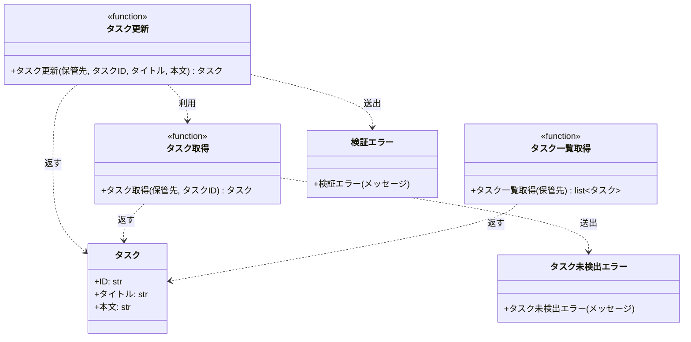

# モジュール構成: バックエンド / タスク

`タスク` ドメイン（バックエンド側）に属する構成要素詳細。

- 対応テストファイル: -

## 一覧

| ユースケース | 役割 | コンテナ | 種別 | 名前 | 概要 | 補足 |
| --- | --- | --- | --- | --- | --- | --- |
| 共通 | ドメインモデル | `src/tasks/models.py` | データモデル | [`Task`](#タスク) | タスク 1 件 | - |
| 共通 | 例外 | `src/tasks/errors.py` | クラス | [`TaskNotFoundError`](#タスク未検出エラー) | 指定 ID のタスクが存在しない | - |
| 共通 | 例外 | `src/tasks/errors.py` | クラス | [`ValidationError`](#検証エラー) | 入力値が制約を満たさない | - |
| 共通 | 定数 | `src/tasks/service.py` | 定数 | `TITLE_MIN_LENGTH` | タイトルの下限文字数 | 値は 1 |
| 共通 | 定数 | `src/tasks/service.py` | 定数 | `TITLE_MAX_LENGTH` | タイトルの上限文字数 | 値は 100 |
| 共通 | 定数 | `src/tasks/service.py` | 定数 | `CONTENT_MAX_LENGTH` | 本文の上限文字数 | 値は 1000 |
| タスク更新 | サービス | `src/tasks/service.py` | 関数 | [`update_task`](#タスク更新) | タイトルと本文を更新する | - |
| タスク更新 | クエリ | `src/tasks/service.py` | 関数 | [`get_task`](#タスク取得) | ID でタスクを 1 件取得する | - |
| タスク編集から一覧反映 | クエリ | `src/tasks/service.py` | 関数 | [`list_tasks`](#タスク一覧取得) | 保管先のタスクを ID 順で並べる | - |

## ディレクトリ構成

```
src/tasks/
├── models.py      # Task
├── errors.py      # TaskNotFoundError / ValidationError
└── service.py     # get_task / update_task / list_tasks
```

## 構成図



## タスク
> 物理名: `Task`<br>
> 種別: データモデル<br>
> コンテナ: `src/tasks/models.py`

タスク 1 件を表す不変のデータモデル。

### プロパティ

| 論理名 | プロパティ名 | 型 | 可視性 | デフォルト | 説明 | 例 | 補足 |
| --- | --- | --- | --- | --- | --- | --- | --- |
| ID | `id` | `str` | 公開 | - | タスクを一意に識別する ID | `"t1"` | 保管先のキーと同じ値 |
| タイトル | `title` | `str` | 公開 | - | タスクの見出し | `"新タイトル"` | - |
| 本文 | `content` | `str` | 公開 | `""` | タスクの詳細 | `"新本文"` | - |

### メソッド

なし

### 単体テスト

なし

### 補足

- 凍結・スロット付き・キーワード専用の dataclass として定義する（更新は新しいインスタンスの差し替えで行う）

## タスク未検出エラー
> 物理名: `TaskNotFoundError`<br>
> 種別: クラス<br>
> コンテナ: `src/tasks/errors.py`

指定した ID のタスクが保管先に存在しないことを表す例外。

### プロパティ

なし

### メソッド

なし

### 単体テスト

なし

## 検証エラー
> 物理名: `ValidationError`<br>
> 種別: クラス<br>
> コンテナ: `src/tasks/errors.py`

入力値が長さ制約を満たさないことを表す例外。

### プロパティ

なし

### メソッド

なし

### 単体テスト

なし

## `src/tasks/service.py`
> 種別: ファイル

タスクの取得・更新・一覧をまとめた関数ファイル。
保管先は呼び出し元から `dict[str, Task]` で受け取り、このファイル内では永続化先を持たない。

---

### タスク取得
> 物理名: `get_task`<br>
> 種別: 関数

保管先からタスクを 1 件取得する。

#### 引数

| 論理名 | 引数名 | 型 | 必須 | デフォルト | 説明 | 補足 |
| --- | --- | --- | --- | --- | --- | --- |
| 保管先 | `store` | [`dict[str, Task]`](#タスク) | ✅ | - | タスクの保管先 | キーはタスク ID |
| タスク ID | `task_id` | `str` | ✅ | - | 取得対象のタスク ID | - |

引数例:

```python
get_task(store, "t1")
```

#### 戻り値

| 型 | 説明 | 補足 |
| --- | --- | --- |
| [`Task`](#タスク) | 取得したタスク | - |

戻り値例:

```python
Task(id="t1", title="旧タイトル", content="旧本文")
```

#### 処理

1. 保管先に対象の ID があるかを確かめる
   - 無い場合、`TaskNotFoundError` を送出する
2. 該当するタスクを返す

#### 例外

| 例外名 | 発生条件 | メッセージ | 補足 |
| --- | --- | --- | --- |
| `TaskNotFoundError` | 対象の ID が保管先に無い | `"task not found: {task_id}"` | - |

#### 単体テスト

| テスト名 | 正常/異常 | 概要 | 条件 | Mock | 期待値 | 補足 |
| --- | --- | --- | --- | --- | --- | --- |
| `test_get_task` | 正常 | 登録済みの ID でタスクを取得する | `t1` を登録済みの保管先 | なし | 登録済みの `Task` を返す | - |
| `test_get_task_when_task_missing` | 異常 | 未登録の ID を渡す | 保管先に無い ID | なし | `TaskNotFoundError` を送出する | 例外表「対象の ID が保管先に無い」に対応 |

---

### タスク更新
> 物理名: `update_task`<br>
> 種別: 関数

登録済みタスクのタイトルと本文を書き換えて返す。

#### 引数

| 論理名 | 引数名 | 型 | 必須 | デフォルト | 説明 | 補足 |
| --- | --- | --- | --- | --- | --- | --- |
| 保管先 | `store` | [`dict[str, Task]`](#タスク) | ✅ | - | タスクの保管先 | 更新結果をこの場で書き戻す |
| タスク ID | `task_id` | `str` | ✅ | - | 更新対象のタスク ID | - |
| タイトル | `title` | `str` | ✅ | - | 更新後のタイトル | 1 文字以上 100 文字以内 |
| 本文 | `content` | `str` | - | `""` | 更新後の本文 | 1000 文字以内 |

引数例:

```python
update_task(store, "t1", "新タイトル", "新本文")
```

#### 戻り値

| 型 | 説明 | 補足 |
| --- | --- | --- |
| [`Task`](#タスク) | 更新後のタスク | 保管先に書き戻したものと同じインスタンス |

戻り値例:

```python
Task(id="t1", title="新タイトル", content="新本文")
```

#### 処理

1. タイトルの長さが下限以上かつ上限以内かを確かめる
   - 外れる場合、`ValidationError` を送出する
2. 本文の長さが上限以内かを確かめる
   - 超える場合、`ValidationError` を送出する
3. 更新対象のタスクを取得する（[タスク取得](#タスク取得)）
4. 元の ID と新しいタイトル・本文で新しいタスクを組み立てる
5. 組み立てたタスクを保管先へ書き戻して返す

#### 例外

| 例外名 | 発生条件 | メッセージ | 補足 |
| --- | --- | --- | --- |
| `ValidationError` | タイトルが下限未満または上限超過 | `"title は {下限} 文字以上 {上限} 文字以内"` | - |
| `ValidationError` | 本文が上限超過 | `"content は {上限} 文字以内"` | 同じ例外の別発生箇所 |
| `TaskNotFoundError` | 対象の ID が保管先に無い | `"task not found: {task_id}"` | [タスク取得](#タスク取得)から伝播する |

#### 単体テスト

| テスト名 | 正常/異常 | 概要 | 条件 | Mock | 期待値 | 補足 |
| --- | --- | --- | --- | --- | --- | --- |
| `test_update_task` | 正常 | タイトルと本文を更新する | `t1` を登録済みの保管先 | なし | 更新後の `Task` を返し、保管先も置き換わる | - |
| `test_update_task_when_content_omitted` | 正常 | 本文を省略する | `content` を渡さない | なし | 本文が空文字になる | - |
| `test_update_task_when_title_empty` | 異常 | タイトルが空 | `title` に空文字 | なし | `ValidationError` を送出する | 例外表「タイトルが下限未満または上限超過」に対応 |
| `test_update_task_when_title_too_long` | 異常 | タイトルが 101 文字 | `title` に 101 文字 | なし | `ValidationError` を送出する | 例外表「タイトルが下限未満または上限超過」に対応 |
| `test_update_task_when_content_too_long` | 異常 | 本文が 1001 文字 | `content` に 1001 文字 | なし | `ValidationError` を送出する | 例外表「本文が上限超過」に対応 |
| `test_update_task_when_task_missing` | 異常 | 未登録の ID を渡す | 保管先に無い ID | なし | `TaskNotFoundError` を送出し、保管先は変わらない | 例外表「対象の ID が保管先に無い」に対応 |

---

### タスク一覧取得
> 物理名: `list_tasks`<br>
> 種別: 関数

保管先のタスクを ID 順に並べて返す。

#### 引数

| 論理名 | 引数名 | 型 | 必須 | デフォルト | 説明 | 補足 |
| --- | --- | --- | --- | --- | --- | --- |
| 保管先 | `store` | [`dict[str, Task]`](#タスク) | ✅ | - | タスクの保管先 | - |

引数例:

```python
list_tasks(store)
```

#### 戻り値

| 型 | 説明 | 補足 |
| --- | --- | --- |
| [`list[Task]`](#タスク) | ID の昇順に並べたタスク | 保管先が空ならば空のリスト |

戻り値例:

```python
[Task(id="t1", title="新タイトル", content="新本文")]
```

#### 処理

1. 保管先のキーを昇順に並べる
2. 並べた順にタスクを取り出してリストで返す

#### 例外

なし

#### 単体テスト

| テスト名 | 正常/異常 | 概要 | 条件 | Mock | 期待値 | 補足 |
| --- | --- | --- | --- | --- | --- | --- |
| `test_list_tasks` | 正常 | ID の昇順に並べて返す | 登録順が ID の昇順でない保管先 | なし | ID の昇順に並んだリストを返す | - |
| `test_list_tasks_when_store_empty` | 正常 | 保管先が空 | 空の保管先 | なし | 空のリストを返す | - |

### 補足

- 保管先を引数で受け取るため、このファイルは永続化の実体を知らない（呼び出し元が dict を組み立てて渡す）
