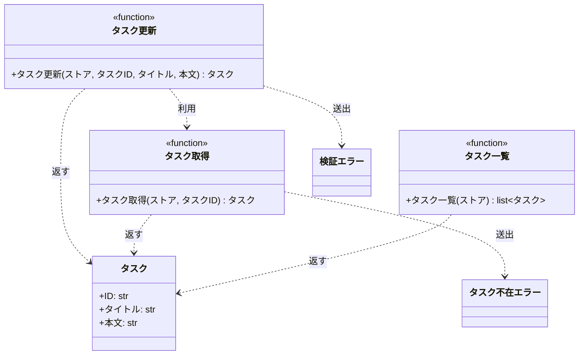

# モジュール構成: バックエンド / タスク

`タスク` ドメイン（バックエンド側）に属する構成要素詳細。

- 対応テストファイル: 未記入（テストレビュー完了時に記入）

## 一覧

| ユースケース | 役割 | コンテナ | 種別 | 名前 | 概要 | 補足 |
| --- | --- | --- | --- | --- | --- | --- |
| 共通 | ドメインモデル | `src/tasks/models.py` | データモデル | [`Task`](#タスク) | タスク 1 件 | - |
| 共通 | 例外 | `src/tasks/errors.py` | クラス | [`TaskNotFoundError`](#タスク不在エラー) | 指定 ID のタスクが存在しない | - |
| 共通 | 例外 | `src/tasks/errors.py` | クラス | [`ValidationError`](#検証エラー) | 入力値が制約を満たさない | - |
| 共通 | 定数 | `src/tasks/service.py` | 定数 | `TITLE_MIN_LENGTH` | タイトルの最小文字数（`1`） | 単純即値 |
| 共通 | 定数 | `src/tasks/service.py` | 定数 | `TITLE_MAX_LENGTH` | タイトルの最大文字数（`100`） | 単純即値 |
| 共通 | 定数 | `src/tasks/service.py` | 定数 | `CONTENT_MAX_LENGTH` | 本文の最大文字数（`1000`） | 単純即値 |
| 共通 | サービス | `src/tasks/service.py` | 関数 | [`get_task`](#タスク取得) | ストアからタスクを 1 件取得する | - |
| 共通 | サービス | `src/tasks/service.py` | 関数 | [`list_tasks`](#タスク一覧) | ストアのタスクを ID 順で一覧にする | - |
| タスク更新 | サービス | `src/tasks/service.py` | 関数 | [`update_task`](#タスク更新) | タイトルと本文を更新する | - |

## ディレクトリ構成

```
src/tasks/
├── models.py     # Task
├── errors.py     # TaskNotFoundError / ValidationError
└── service.py    # get_task / list_tasks / update_task
```

## 構成図



## タスク
> 物理名: `Task`<br>
> 種別: データモデル<br>
> コンテナ: `src/tasks/models.py`

タスク 1 件を表す不変のデータモデル。

### プロパティ

| 論理名 | プロパティ名 | 型 | 可視性 | デフォルト | 説明 | 例 | 補足 |
| --- | --- | --- | --- | --- | --- | --- | --- |
| ID | `id` | `str` | 公開 | - | タスクを一意に識別する ID | `"t1"` | ストアのキーと一致する |
| タイトル | `title` | `str` | 公開 | - | タスクのタイトル | `"新タイトル"` | 1 文字以上 100 文字以内 |
| 本文 | `content` | `str` | 公開 | `""` | タスクの本文 | `"新本文"` | 1000 文字以内 |

### メソッド

なし

### 単体テスト

なし

### 補足

- `frozen=True` の dataclass のため、更新は新しいインスタンスへの差し替えで行う

## タスク不在エラー
> 物理名: `TaskNotFoundError`<br>
> 種別: クラス<br>
> コンテナ: `src/tasks/errors.py`

指定 ID のタスクがストアに存在しないことを表す例外。
`Exception` を継承する。

### プロパティ

なし

### メソッド

なし

### 単体テスト

なし

## 検証エラー
> 物理名: `ValidationError`<br>
> 種別: クラス<br>
> コンテナ: `src/tasks/errors.py`

入力値が制約を満たさないことを表す例外。
`Exception` を継承する。

### プロパティ

なし

### メソッド

なし

### 単体テスト

なし

## `src/tasks/service.py`
> 種別: ファイル

タスクの取得・一覧・更新を提供する関数ファイル。
ストアは呼び出し側から引数で受け取り、モジュール内に状態を持たない。

---

### タスク取得
> 物理名: `get_task`<br>
> 種別: 関数

ストアからタスクを 1 件取得する。

#### 引数

| 論理名 | 引数名 | 型 | 必須 | デフォルト | 説明 | 補足 |
| --- | --- | --- | --- | --- | --- | --- |
| ストア | `store` | [`dict[str, Task]`](#タスク) | ✅ | - | タスクを保持するインメモリストア | キーはタスク ID |
| タスク ID | `task_id` | `str` | ✅ | - | 取得対象のタスク ID | - |

引数例:

```python
get_task(store, "t1")
```

#### 戻り値

| 型 | 説明 | 補足 |
| --- | --- | --- |
| [`Task`](#タスク) | 取得したタスク | ストアが保持しているインスタンスをそのまま返す |

戻り値例:

```python
Task(id="t1", title="旧タイトル", content="旧本文")
```

#### 処理

1. タスク ID がストアのキーに存在するか確認する
   - 存在しない場合、`TaskNotFoundError` を送出する
2. ストアから取り出したタスクを返す

#### 例外

| 例外名 | 発生条件 | メッセージ | 補足 |
| --- | --- | --- | --- |
| `TaskNotFoundError` | タスク ID がストアのキーに存在しない | `"task not found: {task_id}"` | - |

#### 単体テスト

| テスト名 | 正常/異常 | 概要 | 条件 | Mock | 期待値 | 補足 |
| --- | --- | --- | --- | --- | --- | --- |
| `test_get_task` | 正常 | 登録済み ID でタスクを取得する | ストアに `t1` を登録済み | なし | 登録した `Task` を返す | - |
| `test_get_task_when_task_missing` | 異常 | 未登録 ID で取得する | ストアに該当 ID が無い | なし | `TaskNotFoundError` を送出する | 例外表「タスク ID がストアのキーに存在しない」に対応 |

---

### タスク一覧
> 物理名: `list_tasks`<br>
> 種別: 関数

ストアのタスクを ID の昇順で一覧にする。

#### 引数

| 論理名 | 引数名 | 型 | 必須 | デフォルト | 説明 | 補足 |
| --- | --- | --- | --- | --- | --- | --- |
| ストア | `store` | [`dict[str, Task]`](#タスク) | ✅ | - | タスクを保持するインメモリストア | キーはタスク ID |

引数例:

```python
list_tasks(store)
```

#### 戻り値

| 型 | 説明 | 補足 |
| --- | --- | --- |
| [`list[Task]`](#タスク) | ID の昇順に並べたタスクのリスト | ストアが空なら空リスト |

戻り値例:

```python
[Task(id="t1", title="タイトル1", content=""), Task(id="t2", title="タイトル2", content="")]
```

#### 処理

1. ストアのキーを昇順に並べ、対応するタスクを並べたリストを返す

#### 例外

なし

#### 単体テスト

| テスト名 | 正常/異常 | 概要 | 条件 | Mock | 期待値 | 補足 |
| --- | --- | --- | --- | --- | --- | --- |
| `test_list_tasks` | 正常 | ID の昇順で一覧化する | ストアに `t2` / `t1` の順で登録済み | なし | `t1` / `t2` の順のリストを返す | - |
| `test_list_tasks_when_store_empty` | 正常 | 空のストアを一覧化する | ストアが空 | なし | 空リストを返す | - |

---

### タスク更新
> 物理名: `update_task`<br>
> 種別: 関数

登録済みタスクのタイトルと本文を更新する。

#### 引数

| 論理名 | 引数名 | 型 | 必須 | デフォルト | 説明 | 補足 |
| --- | --- | --- | --- | --- | --- | --- |
| ストア | `store` | [`dict[str, Task]`](#タスク) | ✅ | - | タスクを保持するインメモリストア | キーはタスク ID |
| タスク ID | `task_id` | `str` | ✅ | - | 更新対象のタスク ID | - |
| タイトル | `title` | `str` | ✅ | - | 更新後のタイトル | 1 文字以上 100 文字以内 |
| 本文 | `content` | `str` | - | `""` | 更新後の本文 | 省略すると空文字で上書きする |

引数例:

```python
update_task(store, "t1", "新タイトル", "新本文")
```

#### 戻り値

| 型 | 説明 | 補足 |
| --- | --- | --- |
| [`Task`](#タスク) | 更新後のタスク | 同じ値が `store[task_id]` にも書き戻される |

戻り値例:

```python
Task(id="t1", title="新タイトル", content="新本文")
```

#### 処理

1. タイトルの文字数が `TITLE_MIN_LENGTH` 以上 `TITLE_MAX_LENGTH` 以下か検証する
   - 範囲外の場合、`ValidationError` を送出する
2. 本文の文字数が `CONTENT_MAX_LENGTH` 以下か検証する
   - 超過する場合、`ValidationError` を送出する
3. 更新対象のタスクを取得する（[タスク取得](#タスク取得)）
4. タイトルと本文を差し替えたタスクを組み立ててストアへ書き戻し、そのタスクを返す

#### 例外

| 例外名 | 発生条件 | メッセージ | 補足 |
| --- | --- | --- | --- |
| `ValidationError` | タイトルの文字数が 1 未満 or 100 超過 | `"title は 1 文字以上 100 文字以内"` | - |
| `ValidationError` | 本文の文字数が 1000 超過 | `"content は 1000 文字以内"` | - |
| `TaskNotFoundError` | タスク ID がストアのキーに存在しない | `"task not found: {task_id}"` | [タスク取得](#タスク取得) から伝播する |

#### 単体テスト

セットアップ:

| セットアップ | 説明 | 補足 |
| --- | --- | --- |
| ストア | `t1`（タイトル `旧タイトル` / 本文 `旧本文`）を 1 件だけ持つ dict を組み立てる | `_store()` |

| テスト名 | 正常/異常 | 概要 | 条件 | Mock | 期待値 | 補足 |
| --- | --- | --- | --- | --- | --- | --- |
| `test_update_task` | 正常 | タイトルと本文を更新する | タイトルと本文の両方を渡す | なし | 更新後の `Task` を返し、ストアも同じ値に置き換わる | - |
| `test_update_task_when_content_omitted` | 正常 | 本文を省略する | 本文を渡さない | なし | 戻り値の本文が空文字になる | デフォルト値の分岐 |
| `test_update_task_when_title_empty` | 異常 | タイトルが空 | タイトルに空文字を渡す | なし | `ValidationError` を送出する | 例外表「タイトルの文字数が 1 未満」に対応 |
| `test_update_task_when_title_too_long` | 異常 | タイトルが 101 文字 | タイトルに 101 文字を渡す | なし | `ValidationError` を送出する | 例外表「タイトルの文字数が 100 超過」に対応 |
| `test_update_task_when_content_too_long` | 異常 | 本文が 1001 文字 | 本文に 1001 文字を渡す | なし | `ValidationError` を送出する | 例外表「本文の文字数が 1000 超過」に対応 |
| `test_update_task_when_task_missing` | 異常 | 未登録のタスク ID | ストアに無い ID を渡す | なし | `TaskNotFoundError` を送出し、ストアは変更されない | 伝播する例外だが、ストアを変更しないことを確認する |
