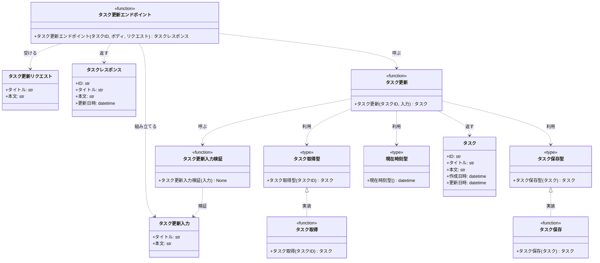

# モジュール構成: バックエンド / タスク

`タスク` ドメイン（バックエンド側）に属する構成要素詳細。

- 対応テストファイル: 未記入（テストレビュー時に記入）

## 一覧

| ユースケース | 役割 | コンテナ | 種別 | 名前 | 概要 | 補足 |
| --- | --- | --- | --- | --- | --- | --- |
| 共通 | ドメインモデル | `app/features/tasks/types.py` | データモデル | [`Task`](#タスク) | タスク 1 件の内容 | - |
| 共通 | 定数 | `app/features/tasks/types.py` | 定数 | `TASK_TITLE_MAX_LENGTH` | タイトルの最大文字数（100） | - |
| 共通 | 時刻取得型（DI） | `app/features/tasks/types.py` | 関数型 | [`NowFn`](#現在時刻型) | 現在時刻を返す関数のシグネチャ | テストで固定時刻に差し替える |
| タスク更新 | 入力 DTO | `app/features/tasks/types.py` | データモデル | [`UpdateTaskInput`](#タスク更新入力) | 更新する値の組 | - |
| タスク更新 | 取得型（DI） | `app/features/tasks/types.py` | 関数型 | [`FindTask`](#タスク取得型) | タスク取得のシグネチャ | - |
| タスク更新 | 保存型（DI） | `app/features/tasks/types.py` | 関数型 | [`SaveTask`](#タスク保存型) | タスク保存のシグネチャ | - |
| タスク更新 | リクエスト DTO | `app/features/tasks/schemas.py` | データモデル | [`UpdateTaskRequest`](#タスク更新リクエスト) | 更新リクエストのボディ | - |
| タスク更新 | レスポンス DTO | `app/features/tasks/schemas.py` | データモデル | [`TaskResponse`](#タスクレスポンス) | 更新後のタスクの応答 | - |
| タスク更新 | バリデータ | `app/features/tasks/service.py` | 関数 | [`validate_update_task_input`](#タスク更新入力検証) | 更新値の業務検証 | 失敗時 `ValidationError` |
| タスク更新 | サービス | `app/features/tasks/service.py` | 関数 | [`update_task`](#タスク更新) | 検証 → 取得 → 保存 | - |
| タスク更新 | 永続化 | `app/features/tasks/db.py` | 関数 | [`find_task`](#タスク取得) | ID でタスクを 1 件取得 | - |
| タスク更新 | 永続化 | `app/features/tasks/db.py` | 関数 | [`save_task`](#タスク保存) | タスクを上書き保存 | - |
| タスク更新 | ハンドラ | `app/features/tasks/route.py` | 関数 | [`update_task_route`](#タスク更新エンドポイント) | PUT /tasks/{task_id} | - |

## ディレクトリ構成

```
src/app/features/tasks/
├── __init__.py     # 公開シンボル（update_task / router）
├── types.py        # Task / UpdateTaskInput / 関数型 / 定数
├── schemas.py      # UpdateTaskRequest / TaskResponse
├── service.py      # 検証と更新のドメインロジック
├── db.py           # tasks テーブルへの読み書き
└── route.py        # FastAPI ルーター
```

## 構成図



## タスク
> 物理名: `Task`<br>
> 種別: データモデル<br>
> コンテナ: `app/features/tasks/types.py`

タスク 1 件の内容。
`tasks` テーブルの 1 行に対応する。

### プロパティ

| 論理名 | プロパティ名 | 型 | 可視性 | デフォルト | 説明 | 例 | 補足 |
| --- | --- | --- | --- | --- | --- | --- | --- |
| ID | `id` | `str` | 公開 | - | タスク ID | `018f8a3c-7b21-...` | UUID の文字列表現 |
| タイトル | `title` | `str` | 公開 | - | タスクのタイトル | `週次レポート作成` | 1〜100 文字 |
| 本文 | `body` | `str \| None` | 公開 | - | タスクの本文 | `第 3 四半期分をまとめる` | 本文なしは `None` |
| 作成日時 | `created_at` | `datetime` | 公開 | - | 作成日時 (UTC) | `2026-08-01T05:00:00Z` | 更新では変更しない |
| 更新日時 | `updated_at` | `datetime` | 公開 | - | 更新日時 (UTC) | `2026-08-01T06:30:00Z` | 更新のたびに差し替える |

### メソッド

なし

### 単体テスト

なし

### 補足

- `@dataclass(frozen=True, slots=True, kw_only=True)` で定義する。
  更新は既存インスタンスの書き換えではなく `dataclasses.replace` による新インスタンス生成で行う

## タスク更新入力
> 物理名: `UpdateTaskInput`<br>
> 種別: データモデル<br>
> コンテナ: `app/features/tasks/types.py`

更新で差し替える値の組。
HTTP の形（[タスク更新リクエスト](#タスク更新リクエスト)）から切り離し、サービス層が受け取る形にする。

### プロパティ

| 論理名 | プロパティ名 | 型 | 可視性 | デフォルト | 説明 | 例 | 補足 |
| --- | --- | --- | --- | --- | --- | --- | --- |
| タイトル | `title` | `str` | 公開 | - | 更新後のタイトル | `週次レポート作成` | 未検証の生値（検証は[タスク更新入力検証](#タスク更新入力検証)） |
| 本文 | `body` | `str \| None` | 公開 | - | 更新後の本文 | `第 3 四半期分をまとめる` | 本文を消す場合は `None` |

### メソッド

なし

### 単体テスト

なし

## タスク更新リクエスト
> 物理名: `UpdateTaskRequest`<br>
> 種別: データモデル<br>
> コンテナ: `app/features/tasks/schemas.py`

更新リクエストのボディ。

### プロパティ

| 論理名 | プロパティ名 | 型 | 可視性 | デフォルト | 説明 | 例 | 補足 |
| --- | --- | --- | --- | --- | --- | --- | --- |
| タイトル | `title` | `str` | 公開 | - | 更新後のタイトル | `週次レポート作成` | 長さ・空文字の検証はサービス層で行う |
| 本文 | `body` | `str \| None` | 公開 | `None` | 更新後の本文 | `第 3 四半期分をまとめる` | 省略時は本文を消す |

### メソッド

なし

### 単体テスト

なし

### 補足

- `pydantic.BaseModel` で定義する（HTTP 境界の DTO のため）
- Pydantic 側では型の一致だけを見る。
  長さ・空文字の業務制約を持たせると、応答が FastAPI 標準の 422 になりフィールド単位のエラー形式を返せなくなる

## タスクレスポンス
> 物理名: `TaskResponse`<br>
> 種別: データモデル<br>
> コンテナ: `app/features/tasks/schemas.py`

更新後のタスクの応答。

### プロパティ

| 論理名 | プロパティ名 | 型 | 可視性 | デフォルト | 説明 | 例 | 補足 |
| --- | --- | --- | --- | --- | --- | --- | --- |
| ID | `id` | `str` | 公開 | - | タスク ID | `018f8a3c-7b21-...` | - |
| タイトル | `title` | `str` | 公開 | - | 更新後のタイトル | `週次レポート作成` | - |
| 本文 | `body` | `str \| None` | 公開 | - | 更新後の本文 | `第 3 四半期分をまとめる` | - |
| 更新日時 | `updated_at` | `datetime` | 公開 | - | 更新日時 (UTC) | `2026-08-01T06:30:00Z` | ISO 8601 文字列として直列化される |

### メソッド

なし

### 単体テスト

なし

### 補足

- `pydantic.BaseModel` で定義し、[タスク](#タスク)からの変換は `from_domain` クラスメソッドで行う
- 作成日時は画面が使わないため含めない

## `app/features/tasks/types.py`
> 種別: ファイル

タスクドメインのデータモデル・関数型・定数を置くファイル。

---

### タスク取得型
> 物理名: `FindTask`<br>
> 種別: 関数型

ID でタスクを 1 件取得する関数のシグネチャ。
DI / Mock 差し替え用。

#### 引数

| 論理名 | 引数名 | 型 | 必須 | デフォルト | 説明 | 補足 |
| --- | --- | --- | --- | --- | --- | --- |
| タスク ID | `task_id` | `str` | ✅ | - | 取得対象のタスク ID | - |

#### 戻り値

| 型 | 説明 | 補足 |
| --- | --- | --- |
| [`Task \| None`](#タスク) | 該当タスク。無ければ `None` | 存在しないことは異常ではないため例外にしない |

#### 実装

| 実装 | 補足 |
| --- | --- |
| [タスク取得](#タスク取得) | 本番の実装（PostgreSQL） |

---

### タスク保存型
> 物理名: `SaveTask`<br>
> 種別: 関数型

タスクを上書き保存する関数のシグネチャ。
DI / Mock 差し替え用。

#### 引数

| 論理名 | 引数名 | 型 | 必須 | デフォルト | 説明 | 補足 |
| --- | --- | --- | --- | --- | --- | --- |
| タスク | `task` | [`Task`](#タスク) | ✅ | - | 保存するタスク | ID で既存行を特定する |

#### 戻り値

| 型 | 説明 | 補足 |
| --- | --- | --- |
| [`Task`](#タスク) | 保存後のタスク | - |

#### 実装

| 実装 | 補足 |
| --- | --- |
| [タスク保存](#タスク保存) | 本番の実装（PostgreSQL） |

---

### 現在時刻型
> 物理名: `NowFn`<br>
> 種別: 関数型

現在時刻 (UTC) を返す関数のシグネチャ。
更新日時を決定的にテストするための差し替え口。

#### 引数

なし

#### 戻り値

| 型 | 説明 | 補足 |
| --- | --- | --- |
| `datetime` | 現在時刻 (UTC) | tz 付き |

#### 実装

| 実装 | 補足 |
| --- | --- |
| `datetime.now` | 本番では `partial(datetime.now, UTC)` を注入する |

## `app/features/tasks/service.py`
> 種別: ファイル

タスク更新の業務ロジックを束ねる関数ファイル。

---

### タスク更新入力検証
> 物理名: `validate_update_task_input`<br>
> 種別: 関数

更新値が業務制約を満たすかを検証する。

#### 引数

| 論理名 | 引数名 | 型 | 必須 | デフォルト | 説明 | 補足 |
| --- | --- | --- | --- | --- | --- | --- |
| 入力 | `input` | [`UpdateTaskInput`](#タスク更新入力) | ✅ | - | 検証対象の更新値 | - |

引数例:

```python
validate_update_task_input(UpdateTaskInput(title="週次レポート作成", body=None))
```

#### 戻り値

| 型 | 説明 | 補足 |
| --- | --- | --- |
| `None` | なし | 不合格は例外で表す |

#### 処理

1. フィールドエラーの入れ物を用意する
2. タイトルの前後の空白を除いた文字列が空なら「タスク名を入力してください」を積む
3. タイトルの文字数が `TASK_TITLE_MAX_LENGTH` を超えるなら「タスク名は 100 文字以内で入力してください」を積む
4. フィールドエラーが 1 件以上なら `ValidationError` を投げる
   - `[WARNING]` タスク更新の入力検証に失敗した（`エラー対象のフィールド名`）

#### 例外

| 例外名 | 発生条件 | メッセージ | 補足 |
| --- | --- | --- | --- |
| `ValidationError` | フィールドエラーが 1 件以上 | `"入力内容を確認してください"` | `fields` に内訳を載せる |

#### 単体テスト

| テスト名 | 正常/異常 | 概要 | 条件 | Mock | 期待値 | 補足 |
| --- | --- | --- | --- | --- | --- | --- |
| `test_validate_update_task_input` | 正常 | 制約を満たす入力を通す | タイトル 1 文字以上 100 文字以内 | なし | 例外を投げない | - |
| `test_validate_update_task_input_when_title_empty` | 異常 | 空文字のタイトル | タイトルが `""` | なし | `ValidationError` を throw / `fields` が `title` 1 件 | 例外表「フィールドエラーが 1 件以上」に対応 |
| `test_validate_update_task_input_when_title_blank` | 異常 | 空白のみのタイトル | タイトルが `"   "` | なし | `ValidationError` を throw / `fields` が `title` 1 件 | 前後の空白除去の分岐 |
| `test_validate_update_task_input_when_title_too_long` | 異常 | 上限超過のタイトル | タイトルが 101 文字 | なし | `ValidationError` を throw / `fields` が `title` 1 件 | 例外表「フィールドエラーが 1 件以上」に対応 |
| `test_validate_update_task_input_when_title_max_length` | 正常 | 上限ちょうどのタイトル | タイトルが 100 文字 | なし | 例外を投げない | 境界値 |

---

### タスク更新
> 物理名: `update_task`<br>
> 種別: 関数

タスクのタイトル・本文を検証したうえで更新する。

#### 引数

| 論理名 | 引数名 | 型 | 必須 | デフォルト | 説明 | 補足 |
| --- | --- | --- | --- | --- | --- | --- |
| タスク ID | `task_id` | `str` | ✅ | - | 更新対象のタスク ID | - |
| 入力 | `input` | [`UpdateTaskInput`](#タスク更新入力) | ✅ | - | 更新する値の組 | - |
| タスク取得 | `find` | [`FindTask`](#タスク取得型) | ✅ | - | 対象タスクの取得関数 | キーワード引数 |
| タスク保存 | `save` | [`SaveTask`](#タスク保存型) | ✅ | - | 保存関数 | キーワード引数 |
| 現在時刻 | `now` | [`NowFn`](#現在時刻型) | ✅ | - | 更新日時の取得関数 | キーワード引数 |

引数例:

```python
update_task("018f8a3c-...", UpdateTaskInput(title="週次レポート作成", body=None), find=find_task, save=save_task, now=now_utc)
```

#### 戻り値

| 型 | 説明 | 補足 |
| --- | --- | --- |
| [`Task`](#タスク) | 更新後のタスク | - |

戻り値例:

```python
Task(id="018f8a3c-...", title="週次レポート作成", body=None, created_at=..., updated_at=...)
```

#### 処理

1. 入力値を検証する（[タスク更新入力検証](#タスク更新入力検証)）
2. `task_id` でタスクを取得する（`find`）
3. 取得結果で処理の続行を決める
   - 見つからない場合、`NotFoundError` を投げる
     - `[WARNING]` 存在しないタスクの更新を拒否した（`task_id`）
4. タイトル・本文・更新日時を差し替えたタスクを作る（更新日時は `now` の戻り値）
5. 保存して返す（`save`）
   - `[INFO]` タスクを更新した（`task_id`）

#### 例外

| 例外名 | 発生条件 | メッセージ | 補足 |
| --- | --- | --- | --- |
| `NotFoundError` | `task_id` に該当するタスクが無い | `"タスクが見つかりません"` | - |

#### 単体テスト

| テスト名 | 正常/異常 | 概要 | 条件 | Mock | 期待値 | 補足 |
| --- | --- | --- | --- | --- | --- | --- |
| `test_update_task` | 正常 | 既存タスクを更新する | 該当タスクあり | タスク取得 + タスク保存 + 現在時刻 | 更新後の `Task` を返す / 保存に渡ったタスクのタイトル・本文が入力値 / 更新日時が `now` の値 | 作成日時は変わらない |
| `test_update_task_when_title_empty` | 異常 | 検証で弾く | タイトルが `""` | タスク取得 + タスク保存 + 現在時刻 | `ValidationError` を throw / 取得も保存も呼ばれない | 検証が取得より前にある分岐 |
| `test_update_task_when_task_missing` | 異常 | 対象タスクが無い | 取得が `None` を返す | タスク取得 + タスク保存 + 現在時刻 | `NotFoundError` を throw / 保存が呼ばれない | 例外表「該当するタスクが無い」に対応 |

## `app/features/tasks/db.py`
> 種別: ファイル

`tasks` テーブルへの読み書きを行う関数ファイル。
DB ドライバの例外はこのファイルの中で業務例外へ変換し、上位へ漏らさない。

---

### タスク取得
> 物理名: `find_task`<br>
> 種別: 関数<br>
> 継承元: [`FindTask`](#タスク取得型)

ID でタスクを 1 件取得する。

#### 引数

| 論理名 | 引数名 | 型 | 必須 | デフォルト | 説明 | 補足 |
| --- | --- | --- | --- | --- | --- | --- |
| タスク ID | `task_id` | `str` | ✅ | - | 取得対象のタスク ID | - |
| コネクション | `conn` | `Connection` | ✅ | - | DB コネクション | キーワード引数 |

引数例:

```python
find_task("018f8a3c-...", conn=conn)
```

#### 戻り値

| 型 | 説明 | 補足 |
| --- | --- | --- |
| [`Task \| None`](#タスク) | 該当タスク。無ければ `None` | - |

戻り値例:

```python
Task(id="018f8a3c-...", title="古いタイトル", body="古い本文", created_at=..., updated_at=...)
```

#### 処理

1. `id` 一致で `tasks` を 1 行取得する
2. 取得結果を戻り値に変換する
   - 行が無い場合、`None` を返す
   - 行がある場合、[タスク](#タスク)へ詰め替えて返す

#### 例外

| 例外名 | 発生条件 | メッセージ | 補足 |
| --- | --- | --- | --- |
| `AppError` | DB ドライバが例外を送出 | `"タスクの取得に失敗しました"` | ドライバ例外を `raise from` で連鎖 |

#### 単体テスト

セットアップ:

| セットアップ | 説明 | 補足 |
| --- | --- | --- |
| DB | テスト用スキーマに `tasks` を作成したコネクション | fixture 名 `conn` |

| テスト名 | 正常/異常 | 概要 | 条件 | Mock | 期待値 | 補足 |
| --- | --- | --- | --- | --- | --- | --- |
| `test_find_task` | 正常 | 該当行を取得する | `tasks` に対象行あり | なし（テスト用スキーマに実接続） | 各カラムが入った `Task` を返す | - |
| `test_find_task_when_row_missing` | 正常 | 該当行が無い | `tasks` に対象行なし | なし（テスト用スキーマに実接続） | `None` を返す | 行の有無の分岐 |
| `test_find_task_when_db_error` | 異常 | DB エラー | コネクションが例外を送出する stub | DB コネクション | `AppError` を throw | 例外表「DB ドライバが例外を送出」に対応 |

---

### タスク保存
> 物理名: `save_task`<br>
> 種別: 関数<br>
> 継承元: [`SaveTask`](#タスク保存型)

タスクを上書き保存する。

#### 引数

| 論理名 | 引数名 | 型 | 必須 | デフォルト | 説明 | 補足 |
| --- | --- | --- | --- | --- | --- | --- |
| タスク | `task` | [`Task`](#タスク) | ✅ | - | 保存するタスク | - |
| コネクション | `conn` | `Connection` | ✅ | - | DB コネクション | キーワード引数 |

引数例:

```python
save_task(task, conn=conn)
```

#### 戻り値

| 型 | 説明 | 補足 |
| --- | --- | --- |
| [`Task`](#タスク) | 保存後のタスク | 引数のタスクをそのまま返す |

戻り値例:

```python
Task(id="018f8a3c-...", title="週次レポート作成", body=None, created_at=..., updated_at=...)
```

#### 処理

1. `id` 一致の行のタイトル・本文・更新日時を更新する
2. 変更をコミットして引数のタスクを返す

#### 例外

| 例外名 | 発生条件 | メッセージ | 補足 |
| --- | --- | --- | --- |
| `AppError` | DB ドライバが例外を送出 | `"タスクの保存に失敗しました"` | ドライバ例外を `raise from` で連鎖 |

#### 単体テスト

セットアップ:

| セットアップ | 説明 | 補足 |
| --- | --- | --- |
| DB | テスト用スキーマに `tasks` を作成したコネクション | fixture 名 `conn` |

| テスト名 | 正常/異常 | 概要 | 条件 | Mock | 期待値 | 補足 |
| --- | --- | --- | --- | --- | --- | --- |
| `test_save_task` | 正常 | 既存行を上書きする | `tasks` に対象行あり | なし（テスト用スキーマに実接続） | 行のタイトル・本文・更新日時が引数の値になる | - |
| `test_save_task_when_db_error` | 異常 | DB エラー | コネクションが例外を送出する stub | DB コネクション | `AppError` を throw | 例外表「DB ドライバが例外を送出」に対応 |

## `app/features/tasks/route.py`
> 種別: ファイル

タスクドメインの FastAPI ルーター。
業務例外はそのまま送出し、HTTP への変換は[例外ハンドラ登録](./共通.py.md#例外ハンドラ登録)が登録したハンドラに任せる。

---

### タスク更新エンドポイント
> 物理名: `update_task_route`<br>
> 種別: 関数

PUT /tasks/{task_id} を処理する。

#### 引数

| 論理名 | 引数名 | 型 | 必須 | デフォルト | 説明 | 補足 |
| --- | --- | --- | --- | --- | --- | --- |
| タスク ID | `task_id` | `str` | ✅ | - | 更新対象のタスク ID | パスパラメータ |
| ボディ | `body` | [`UpdateTaskRequest`](#タスク更新リクエスト) | ✅ | - | リクエストボディ | - |
| リクエスト | `request` | `Request` | ✅ | - | 配線済み関数を取り出す入口 | `request.app.state.handlers` を参照 |

引数例:

```python
await update_task_route("018f8a3c-...", UpdateTaskRequest(title="週次レポート作成"), request)
```

#### 戻り値

| 型 | 説明 | 補足 |
| --- | --- | --- |
| [`TaskResponse`](#タスクレスポンス) | 更新後のタスク | `200` で返る |

戻り値例:

```python
TaskResponse(id="018f8a3c-...", title="週次レポート作成", body=None, updated_at=...)
```

#### 処理

1. 配線済みの[タスク更新](#タスク更新)を `request.app.state.handlers` から取り出す
2. ボディを[タスク更新入力](#タスク更新入力)へ詰め替える
3. タスクを更新する（[タスク更新](#タスク更新)）
4. 結果を[タスクレスポンス](#タスクレスポンス)へ変換して返す

#### 例外

なし

#### 単体テスト

| テスト名 | 正常/異常 | 概要 | 条件 | Mock | 期待値 | 補足 |
| --- | --- | --- | --- | --- | --- | --- |
| `test_update_task_route` | 正常 | 更新後のタスクを応答に変換する | 更新が `Task` を返す | タスク更新 | `TaskResponse` を返す / 更新に渡った入力がボディの値 | - |

### 補足

- 例外を握らないため、検証エラー・未検出エラーはそのまま伝播して 400 / 404 になる（この関数に分岐が無いので異常系のテスト行を置かない）
