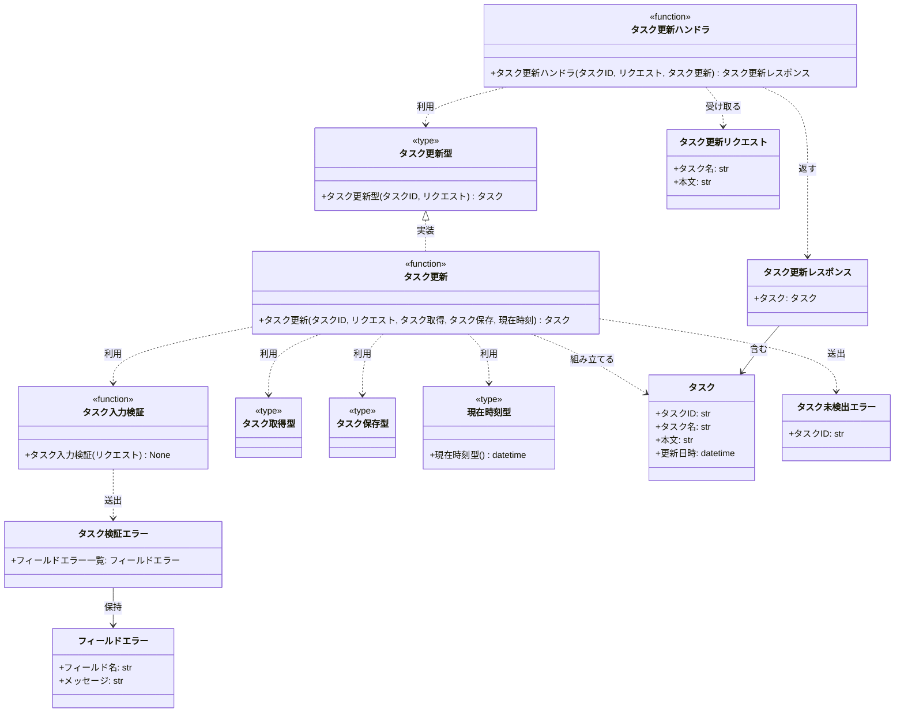
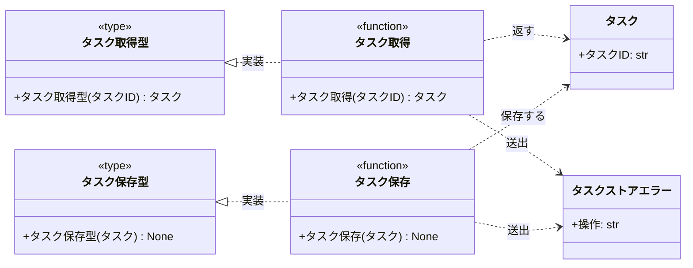

# モジュール構成: バックエンド / タスク

`タスク` ドメイン（バックエンド側）に属する構成要素詳細。

- 対応テストファイル: 未記入

## 一覧

| ユースケース | 役割 | コンテナ | 種別 | 名前 | 概要 | 補足 |
| --- | --- | --- | --- | --- | --- | --- |
| 共通 | ドメインモデル | `tasks/models.py` | データモデル | [`Task`](#タスク) | タスクのドメインモデル | - |
| 共通 | 例外 | `tasks/errors.py` | クラス | [`TaskValidationError`](#タスク検証エラー) | フィールド単位の検証エラー | - |
| 共通 | 例外 | `tasks/errors.py` | クラス | [`TaskNotFoundError`](#タスク未検出エラー) | 対象タスクが存在しない | - |
| 共通 | 例外 | `tasks/errors.py` | クラス | [`TaskStoreError`](#タスクストアエラー) | タスクストアの読み書き失敗 | - |
| 共通 | リポジトリ型（DI） | `tasks/types.py` | 関数型 | [`FindTask`](#タスク取得型) | タスク 1 件取得のシグネチャ | - |
| 共通 | リポジトリ型（DI） | `tasks/types.py` | 関数型 | [`SaveTask`](#タスク保存型) | タスク保存のシグネチャ | - |
| 共通 | 時刻採番型（DI） | `tasks/types.py` | 関数型 | [`NowFn`](#現在時刻型) | 現在時刻取得のシグネチャ | 複数分類で使うようになったら共通分類へ引き上げる |
| 共通 | リポジトリ | `tasks/db.py` | 関数 | [`find_task`](#タスク取得) | ID でタスクを 1 件取得 | - |
| 共通 | リポジトリ | `tasks/db.py` | 関数 | [`save_task`](#タスク保存) | タスクを上書き保存 | - |
| タスク更新 | DTO | `tasks/schemas.py` | データモデル | [`UpdateTaskRequest`](#タスク更新リクエスト) | 更新リクエストのボディ | - |
| タスク更新 | DTO | `tasks/schemas.py` | データモデル | [`UpdateTaskResponse`](#タスク更新レスポンス) | 更新レスポンスのボディ | - |
| タスク更新 | DTO | `tasks/schemas.py` | データモデル | [`FieldError`](#フィールドエラー) | フィールド単位のエラー内容 | - |
| タスク更新 | バリデータ | `tasks/validators.py` | 関数 | [`validate_update_task`](#タスク入力検証) | 更新入力の検証 | 失敗時 `TaskValidationError` |
| タスク更新 | サービス型（DI） | `tasks/types.py` | 関数型 | [`UpdateTask`](#タスク更新型) | タスク更新のシグネチャ | 配線済み関数の型 |
| タスク更新 | サービス | `tasks/service.py` | 関数 | [`update_task`](#タスク更新) | タスクを更新して返す | - |
| タスク更新 | ハンドラ | `tasks/route.py` | 関数 | [`put_task`](#タスク更新ハンドラ) | PUT /tasks/:taskId のハンドラ | - |

## ディレクトリ構成

```
src/app/tasks/
├── models.py        # Task
├── errors.py        # タスクドメインの例外
├── schemas.py       # 更新リクエスト / レスポンスの DTO
├── types.py         # 関数型エイリアス
├── validators.py    # 入力検証
├── db.py            # タスクストアの読み書き
├── service.py       # タスク更新のドメインロジック
└── route.py         # HTTP ハンドラ
```

## 構成図

### タスク更新の流れ



### タスク永続化



## タスク
> 物理名: `Task`<br>
> 種別: データモデル<br>
> コンテナ: `tasks/models.py`

タスク 1 件のドメインモデル。

### プロパティ

| 論理名 | プロパティ名 | 型 | 可視性 | デフォルト | 説明 | 例 | 補足 |
| --- | --- | --- | --- | --- | --- | --- | --- |
| タスク ID | `id` | `str` | 公開 | - | タスクの一意 ID | `"3f2b1c88-..."` | UUID |
| タスク名 | `title` | `str` | 公開 | - | タスク名 | `"決算資料の作成"` | - |
| 本文 | `body` | `str` | 公開 | - | タスク本文 | `"四半期の売上をまとめる"` | 空文字を許容 |
| 更新日時 | `updated_at` | `datetime` | 公開 | - | 最終更新日時 | `2026-08-06T04:30:00+00:00` | UTC で保持する |

### メソッド

なし

### 単体テスト

なし

## タスク検証エラー
> 物理名: `TaskValidationError`<br>
> 種別: クラス<br>
> コンテナ: `tasks/errors.py`

入力検証に失敗したフィールドの一覧を持つ例外。

### プロパティ

| 論理名 | プロパティ名 | 型 | 可視性 | デフォルト | 説明 | 例 | 補足 |
| --- | --- | --- | --- | --- | --- | --- | --- |
| フィールドエラー一覧 | `fields` | [`list[FieldError]`](#フィールドエラー) | 公開 | - | 検証に失敗したフィールド | `[FieldError(field="title", ...)]` | 1 件以上が入る |

### メソッド

なし

### 単体テスト

なし

## タスク未検出エラー
> 物理名: `TaskNotFoundError`<br>
> 種別: クラス<br>
> コンテナ: `tasks/errors.py`

指定された ID のタスクが存在しないことを表す例外。

### プロパティ

| 論理名 | プロパティ名 | 型 | 可視性 | デフォルト | 説明 | 例 | 補足 |
| --- | --- | --- | --- | --- | --- | --- | --- |
| タスク ID | `task_id` | `str` | 公開 | - | 見つからなかったタスクの ID | `"3f2b1c88-..."` | - |

### メソッド

なし

### 単体テスト

なし

## タスクストアエラー
> 物理名: `TaskStoreError`<br>
> 種別: クラス<br>
> コンテナ: `tasks/errors.py`

タスクストアの読み書きに失敗したことを表す例外。

### プロパティ

| 論理名 | プロパティ名 | 型 | 可視性 | デフォルト | 説明 | 例 | 補足 |
| --- | --- | --- | --- | --- | --- | --- | --- |
| 操作 | `operation` | `Literal["find", "save"]` | 公開 | - | 失敗した操作の種別 | `"save"` | - |

### メソッド

なし

### 単体テスト

なし

## タスク更新リクエスト
> 物理名: `UpdateTaskRequest`<br>
> 種別: データモデル<br>
> コンテナ: `tasks/schemas.py`

タスク更新のリクエストボディ。

### プロパティ

| 論理名 | プロパティ名 | 型 | 可視性 | デフォルト | 説明 | 例 | 補足 |
| --- | --- | --- | --- | --- | --- | --- | --- |
| タスク名 | `title` | `str` | 公開 | - | 更新後のタスク名 | `"決算資料の作成"` | 値の妥当性は [タスク入力検証](#タスク入力検証) が判定する |
| 本文 | `body` | `str` | 公開 | - | 更新後のタスク本文 | `"四半期の売上をまとめる"` | 空文字を許容 |

### メソッド

なし

### 単体テスト

なし

## タスク更新レスポンス
> 物理名: `UpdateTaskResponse`<br>
> 種別: データモデル<br>
> コンテナ: `tasks/schemas.py`

タスク更新のレスポンスボディ。

### プロパティ

| 論理名 | プロパティ名 | 型 | 可視性 | デフォルト | 説明 | 例 | 補足 |
| --- | --- | --- | --- | --- | --- | --- | --- |
| タスク | `task` | [`Task`](#タスク) | 公開 | - | 更新後のタスク | `Task(id="3f2b1c88-...", ...)` | - |

### メソッド

なし

### 単体テスト

なし

## フィールドエラー
> 物理名: `FieldError`<br>
> 種別: データモデル<br>
> コンテナ: `tasks/schemas.py`

検証に失敗したフィールド 1 件分のエラー内容。

### プロパティ

| 論理名 | プロパティ名 | 型 | 可視性 | デフォルト | 説明 | 例 | 補足 |
| --- | --- | --- | --- | --- | --- | --- | --- |
| フィールド名 | `field` | `str` | 公開 | - | 失敗したフィールド名 | `"title"` | リクエストのパラメータ名と一致させる |
| メッセージ | `message` | `str` | 公開 | - | 表示用のエラー文言 | `"タスク名を入力してください"` | クライアントがそのまま表示する |

### メソッド

なし

### 単体テスト

なし

## `tasks/validators.py`
> 種別: ファイル

タスク更新の入力検証を担う関数ファイル。

### タスク入力検証
> 物理名: `validate_update_task`<br>
> 種別: 関数

タスク更新の入力値を検証する。

#### 引数

| 論理名 | 引数名 | 型 | 必須 | デフォルト | 説明 | 補足 |
| --- | --- | --- | --- | --- | --- | --- |
| リクエスト | `request` | [`UpdateTaskRequest`](#タスク更新リクエスト) | ✅ | - | 検証対象の入力 | - |

引数例:

```python
validate_update_task(UpdateTaskRequest(title="決算資料の作成", body="四半期の売上をまとめる"))
```

#### 戻り値

| 型 | 説明 | 補足 |
| --- | --- | --- |
| `None` | 戻り値なし | 検証に失敗した場合は例外を送出する |

#### 処理

1. 検証に失敗したフィールドを溜める空のリストを用意する
2. タスク名から前後の空白を除いた値が空かを判定する
   - 空の場合、`title` のフィールドエラーをリストに積む
3. タスク名が 100 文字を超えるかを判定する
   - 超える場合、`title` のフィールドエラーをリストに積む
4. リストの件数で終了方法を決める
   - 1 件以上の場合、リストを持つ `TaskValidationError` を送出する
     - `[WARNING]` タスク更新の入力検証に失敗した（`fields`）
   - 0 件の場合、何も返さずに終える

#### 例外

| 例外名 | 発生条件 | メッセージ | 補足 |
| --- | --- | --- | --- |
| `TaskValidationError` | 前後の空白を除いたタスク名が空 | `"タスク更新の入力が不正です"` | フィールド単位の文言は `fields` が持つ |
| `TaskValidationError` | タスク名が 100 文字を超える | `"タスク更新の入力が不正です"` | 同じ例外の別発生箇所 |

#### 単体テスト

| テスト名 | 正常/異常 | 概要 | 条件 | Mock | 期待値 | 補足 |
| --- | --- | --- | --- | --- | --- | --- |
| `test_validate_update_task` | 正常 | 検証を通過する | タスク名が 1 文字以上 100 文字以内 | なし | 例外を送出しない | - |
| `test_validate_update_task_when_title_length_100` | 正常 | 上限ちょうどを通過する | タスク名が 100 文字 | なし | 例外を送出しない | 境界値 |
| `test_validate_update_task_when_title_blank` | 異常 | タスク名が空白のみ | タスク名が半角空白 1 文字 | なし | `TaskValidationError` を送出し `fields` に `title` が 1 件 | 例外表「タスク名が空」に対応 |
| `test_validate_update_task_when_title_too_long` | 異常 | タスク名が上限超過 | タスク名が 101 文字 | なし | `TaskValidationError` を送出し `fields` に `title` が 1 件 | 例外表「100 文字を超える」に対応 |

## `tasks/db.py`
> 種別: ファイル

タスクストアの読み書きを担う関数ファイル。

### タスク取得
> 物理名: `find_task`<br>
> 種別: 関数<br>
> 継承元: [`FindTask`](#タスク取得型)

ID でタスクを 1 件取得する。

#### 引数

| 論理名 | 引数名 | 型 | 必須 | デフォルト | 説明 | 補足 |
| --- | --- | --- | --- | --- | --- | --- |
| タスク ID | `task_id` | `str` | ✅ | - | 取得対象のタスク ID | - |

引数例:

```python
task = find_task("3f2b1c88-...")
```

#### 戻り値

| 型 | 説明 | 補足 |
| --- | --- | --- |
| [`Task \| None`](#タスク) | 該当タスク。存在しなければ `None` | - |

戻り値例:

```python
Task(id="3f2b1c88-...", title="決算資料の作成", body="四半期の売上をまとめる", updated_at=...)
```

#### 処理

1. タスクストアから `task_id` に一致するタスクを取得して返す（ストアが例外を送出した場合は `TaskStoreError`）
   - 一致するタスクが無い場合、`None` を返す

#### 例外

| 例外名 | 発生条件 | メッセージ | 補足 |
| --- | --- | --- | --- |
| `TaskStoreError` | タスクストアの読み取りで例外 | `"タスクの取得に失敗しました: {task_id}"` | `operation` は `find` |

#### 単体テスト

| テスト名 | 正常/異常 | 概要 | 条件 | Mock | 期待値 | 補足 |
| --- | --- | --- | --- | --- | --- | --- |
| `test_find_task` | 正常 | 存在するタスクを取得する | ストアに対象タスクあり | タスクストア | `Task` を返す | - |
| `test_find_task_when_task_missing` | 正常 | 該当なし | ストアに対象タスクなし | タスクストア | `None` を返す | - |
| `test_find_task_when_store_fails` | 異常 | 読み取り失敗 | ストアが例外を送出 | タスクストア | `TaskStoreError` を送出 | 例外表「読み取りで例外」に対応 |

### タスク保存
> 物理名: `save_task`<br>
> 種別: 関数<br>
> 継承元: [`SaveTask`](#タスク保存型)

タスクを上書き保存する。

#### 引数

| 論理名 | 引数名 | 型 | 必須 | デフォルト | 説明 | 補足 |
| --- | --- | --- | --- | --- | --- | --- |
| タスク | `task` | [`Task`](#タスク) | ✅ | - | 保存するタスク | `id` が一致する既存レコードを置き換える |

引数例:

```python
save_task(Task(id="3f2b1c88-...", title="決算資料の作成", body="", updated_at=...))
```

#### 戻り値

| 型 | 説明 | 補足 |
| --- | --- | --- |
| `None` | 戻り値なし | - |

#### 処理

1. タスクストアへ `task` の内容を上書き保存する（ストアが例外を送出した場合は `TaskStoreError`）
   - `[INFO]` タスクを保存した（`task.id`）

#### 例外

| 例外名 | 発生条件 | メッセージ | 補足 |
| --- | --- | --- | --- |
| `TaskStoreError` | タスクストアの書き込みで例外 | `"タスクの保存に失敗しました: {task_id}"` | `operation` は `save` |

#### 単体テスト

| テスト名 | 正常/異常 | 概要 | 条件 | Mock | 期待値 | 補足 |
| --- | --- | --- | --- | --- | --- | --- |
| `test_save_task` | 正常 | タスクを保存する | ストアが正常応答 | タスクストア | 例外を送出せず、ストアに `task` が渡る | - |
| `test_save_task_when_store_fails` | 異常 | 書き込み失敗 | ストアが例外を送出 | タスクストア | `TaskStoreError` を送出 | 例外表「書き込みで例外」に対応 |

## `tasks/types.py`
> 種別: ファイル

タスクドメインの関数型エイリアスを集約するファイル。

### タスク取得型
> 物理名: `FindTask`<br>
> 種別: 関数型

ID でタスクを 1 件取得する関数のシグネチャ。

#### 引数

| 論理名 | 引数名 | 型 | 必須 | デフォルト | 説明 | 補足 |
| --- | --- | --- | --- | --- | --- | --- |
| タスク ID | `task_id` | `str` | ✅ | - | 取得対象のタスク ID | - |

#### 戻り値

| 型 | 説明 | 補足 |
| --- | --- | --- |
| [`Task \| None`](#タスク) | 該当タスク。存在しなければ `None` | - |

#### 実装

| 実装 | 補足 |
| --- | --- |
| [タスク取得](#タスク取得) | 本番の実装 |

### タスク保存型
> 物理名: `SaveTask`<br>
> 種別: 関数型

タスクを保存する関数のシグネチャ。

#### 引数

| 論理名 | 引数名 | 型 | 必須 | デフォルト | 説明 | 補足 |
| --- | --- | --- | --- | --- | --- | --- |
| タスク | `task` | [`Task`](#タスク) | ✅ | - | 保存するタスク | - |

#### 戻り値

| 型 | 説明 | 補足 |
| --- | --- | --- |
| `None` | 戻り値なし | - |

#### 実装

| 実装 | 補足 |
| --- | --- |
| [タスク保存](#タスク保存) | 本番の実装 |

### 現在時刻型
> 物理名: `NowFn`<br>
> 種別: 関数型

現在時刻を返す関数のシグネチャ。
更新日時をテストで固定するために注入する。

#### 引数

なし

#### 戻り値

| 型 | 説明 | 補足 |
| --- | --- | --- |
| `datetime` | 現在時刻 | UTC で返す |

#### 実装

| 実装 | 補足 |
| --- | --- |
| `datetime.now` | 本番の実装（UTC 指定で配線する） |

### タスク更新型
> 物理名: `UpdateTask`<br>
> 種別: 関数型

タスクを更新する関数のシグネチャ。
依存を注入して配線した後の形を表す。

#### 引数

| 論理名 | 引数名 | 型 | 必須 | デフォルト | 説明 | 補足 |
| --- | --- | --- | --- | --- | --- | --- |
| タスク ID | `task_id` | `str` | ✅ | - | 更新対象のタスク ID | - |
| リクエスト | `request` | [`UpdateTaskRequest`](#タスク更新リクエスト) | ✅ | - | 更新内容 | - |

#### 戻り値

| 型 | 説明 | 補足 |
| --- | --- | --- |
| [`Task`](#タスク) | 更新後のタスク | - |

#### 実装

| 実装 | 補足 |
| --- | --- |
| [タスク更新](#タスク更新) | 本番の実装（依存を注入して配線したもの） |

## `tasks/service.py`
> 種別: ファイル

タスク更新のドメインロジックを担う関数ファイル。

### タスク更新
> 物理名: `update_task`<br>
> 種別: 関数<br>
> 継承元: [`UpdateTask`](#タスク更新型)

既存タスクのタイトルと本文を更新する。

#### 引数

| 論理名 | 引数名 | 型 | 必須 | デフォルト | 説明 | 補足 |
| --- | --- | --- | --- | --- | --- | --- |
| タスク ID | `task_id` | `str` | ✅ | - | 更新対象のタスク ID | - |
| リクエスト | `request` | [`UpdateTaskRequest`](#タスク更新リクエスト) | ✅ | - | 更新内容 | - |
| タスク取得 | `find` | [`FindTask`](#タスク取得型) | ✅ | - | タスク取得の実装 | キーワード引数で注入する |
| タスク保存 | `save` | [`SaveTask`](#タスク保存型) | ✅ | - | タスク保存の実装 | キーワード引数で注入する |
| 現在時刻 | `now` | [`NowFn`](#現在時刻型) | ✅ | - | 更新日時の採番 | キーワード引数で注入する |

引数例:

```python
update_task("3f2b1c88-...", request, find=find_task, save=save_task, now=now_utc)
```

#### 戻り値

| 型 | 説明 | 補足 |
| --- | --- | --- |
| [`Task`](#タスク) | 更新後のタスク | - |

戻り値例:

```python
Task(id="3f2b1c88-...", title="決算資料の作成", body="四半期の売上をまとめる", updated_at=...)
```

#### 処理

1. 入力値を検証する（[タスク入力検証](#タスク入力検証)）
2. `task_id` でタスクを取得する（[タスク取得型](#タスク取得型)）
3. 取得結果で続行可否を決める
   - `None` の場合、`TaskNotFoundError` を送出する
     - `[WARNING]` 更新対象のタスクが見つからなかった（`task_id`）
4. 取得したタスクのタイトル・本文・更新日時を差し替えた新しいタスクを組み立てる
5. 組み立てたタスクを保存する（[タスク保存型](#タスク保存型)）
   - `[INFO]` タスクを更新した（`task_id`）
6. 更新後のタスクを返す

#### 例外

| 例外名 | 発生条件 | メッセージ | 補足 |
| --- | --- | --- | --- |
| `TaskNotFoundError` | `task_id` に一致するタスクが存在しない | `"タスクが見つかりません: {task_id}"` | - |

#### 単体テスト

| テスト名 | 正常/異常 | 概要 | 条件 | Mock | 期待値 | 補足 |
| --- | --- | --- | --- | --- | --- | --- |
| `test_update_task` | 正常 | タイトルと本文を更新する | 対象タスクが存在する | タスク入力検証 / タスク取得 / タスク保存 / 現在時刻 | 更新後の `Task` を返し、タスク保存に更新後のタスクが渡り、タスク入力検証が呼ばれる | 更新日時が現在時刻の戻り値になる |
| `test_update_task_when_task_missing` | 異常 | 対象タスクが存在しない | タスク取得が `None` を返す | タスク入力検証 / タスク取得 / タスク保存 / 現在時刻 | `TaskNotFoundError` を送出し、タスク保存は呼ばれない | 例外表「タスクが存在しない」に対応 |

## `tasks/route.py`
> 種別: ファイル

タスク更新の HTTP ハンドラを持つファイル。

### タスク更新ハンドラ
> 物理名: `put_task`<br>
> 種別: 関数

PUT /tasks/:taskId を処理する。

#### 引数

| 論理名 | 引数名 | 型 | 必須 | デフォルト | 説明 | 補足 |
| --- | --- | --- | --- | --- | --- | --- |
| タスク ID | `task_id` | `str` | ✅ | - | パスパラメータ | - |
| リクエスト | `request` | [`UpdateTaskRequest`](#タスク更新リクエスト) | ✅ | - | リクエストボディ | - |
| タスク更新 | `update` | [`UpdateTask`](#タスク更新型) | ✅ | - | 配線済みのタスク更新 | - |

引数例:

```python
put_task("3f2b1c88-...", request, update=wired_update_task)
```

#### 戻り値

| 型 | 説明 | 補足 |
| --- | --- | --- |
| [`UpdateTaskResponse`](#タスク更新レスポンス) | 更新後のタスクを含むレスポンス | - |

戻り値例:

```python
UpdateTaskResponse(task=Task(id="3f2b1c88-...", title="決算資料の作成", body="", updated_at=...))
```

#### 処理

1. タスクを更新する（[タスク更新型](#タスク更新型)）
2. 更新後のタスクをレスポンスに詰めて返す

#### 例外

なし

#### 単体テスト

| テスト名 | 正常/異常 | 概要 | 条件 | Mock | 期待値 | 補足 |
| --- | --- | --- | --- | --- | --- | --- |
| `test_put_task` | 正常 | 更新結果をレスポンスに詰める | タスク更新が更新後の `Task` を返す | タスク更新 | `UpdateTaskResponse` を返し、タスク更新に `task_id` と `request` が渡る | - |

### 補足

- 例外から HTTP ステータスコードへの変換は共通の例外ハンドラが担うため、本ファイルでは例外を捕捉しない
- 更新日時の採番を引数で受けるのは、更新日時をテストで固定できるようにするため
