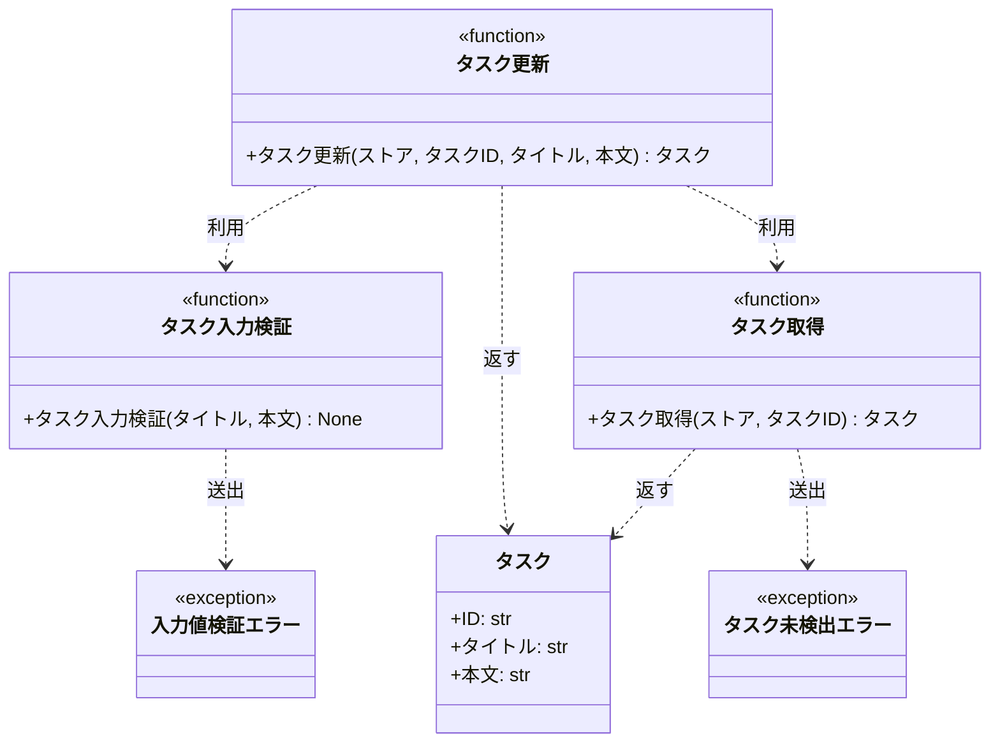

# モジュール構成: バックエンド / タスク

`タスク` ドメイン（バックエンド側）に属する構成要素詳細。
入力値の検証は外部バリデーションライブラリを使わず、本ドメイン内の関数として自前実装する。

## 一覧

| ユースケース | 役割 | コンテナ | 種別 | 名前 | 概要 | 補足 |
| --- | --- | --- | --- | --- | --- | --- |
| 共通 | ドメインモデル | `src/tasks/models.py` | データモデル | [`Task`](#タスク) | タスク 1 件 | 既存 |
| 共通 | 例外 | `src/tasks/errors.py` | クラス | [`TaskNotFoundError`](#タスク未検出エラー) | 指定 ID のタスクが存在しない | 既存 |
| 共通 | 例外 | `src/tasks/errors.py` | クラス | [`ValidationError`](#入力値検証エラー) | 入力値が制約を満たさない | 既存 |
| 共通 | 定数 | `src/tasks/constants.py` | 定数 | `TITLE_MIN_LENGTH` | タイトルの最小文字数 | 新規。値は `1` |
| 共通 | 定数 | `src/tasks/constants.py` | 定数 | `TITLE_MAX_LENGTH` | タイトルの最大文字数 | 新規。値は `100` |
| 共通 | 定数 | `src/tasks/constants.py` | 定数 | `CONTENT_MAX_LENGTH` | 本文の最大文字数 | 新規。値は `1000` |
| 共通 | クエリ | `src/tasks/service.py` | 関数 | [`get_task`](#タスク取得) | ストアからタスクを 1 件取得する | 既存 |
| タスク更新 | バリデータ | `src/tasks/validators.py` | 関数 | [`validate_task_input`](#タスク入力検証) | 更新入力値の制約を検証する | 新規 |
| タスク更新 | サービス | `src/tasks/service.py` | 関数 | [`update_task`](#タスク更新) | タスクのタイトルと本文を更新する | 新規 |

## ディレクトリ構成

```
src/tasks/
├── __init__.py
├── models.py        # Task
├── errors.py        # TaskNotFoundError / ValidationError
├── constants.py     # 検証の閾値（新規）
├── validators.py    # 入力値の自前検証（新規）
└── service.py       # get_task / update_task
```

## 構成図



## タスク
> 物理名: `Task`<br>
> 種別: データモデル<br>
> コンテナ: `src/tasks/models.py`

タスク 1 件を表す不変のデータモデル。

### プロパティ

| 論理名 | プロパティ名 | 型 | 可視性 | デフォルト | 説明 | 例 | 補足 |
| --- | --- | --- | --- | --- | --- | --- | --- |
| ID | `id` | `str` | 公開 | - | タスクの一意な識別子 | `"t1"` | - |
| タイトル | `title` | `str` | 公開 | - | タスク名 | `"買い物"` | 制約は [タスク入力検証](#タスク入力検証) が担保する |
| 本文 | `content` | `str` | 公開 | `""` | タスクの詳細 | `"牛乳を買う"` | 制約は [タスク入力検証](#タスク入力検証) が担保する |

### メソッド

なし

### 単体テスト

なし

### 補足

- `frozen=True` の不変データモデルのため、更新は新しいインスタンスの生成で行う（[タスク更新](#タスク更新)）

---

## タスク未検出エラー
> 物理名: `TaskNotFoundError`<br>
> 種別: クラス<br>
> コンテナ: `src/tasks/errors.py`

指定 ID のタスクがストアに存在しないことを表す例外。

### プロパティ

なし

### メソッド

なし

### 単体テスト

なし

---

## 入力値検証エラー
> 物理名: `ValidationError`<br>
> 種別: クラス<br>
> コンテナ: `src/tasks/errors.py`

入力値が制約を満たさないことを表す例外。

### プロパティ

なし

### メソッド

なし

### 単体テスト

なし

---

## `src/tasks/validators.py`
> 種別: ファイル

タスクの入力値制約を検証する関数ファイル。
外部バリデーションライブラリには依存せず、標準機能だけで検証する。

---

### タスク入力検証
> 物理名: `validate_task_input`<br>
> 種別: 関数

タスクの更新入力値が文字数制約を満たすかを検証する。

#### 引数

| 論理名 | 引数名 | 型 | 必須 | デフォルト | 説明 | 補足 |
| --- | --- | --- | --- | --- | --- | --- |
| タイトル | `title` | `str` | ✅ | - | 検証対象のタスク名 | `TITLE_MIN_LENGTH` 以上 `TITLE_MAX_LENGTH` 以内 |
| 本文 | `content` | `str` | ✅ | - | 検証対象の本文 | `CONTENT_MAX_LENGTH` 以内 |

引数例:

```python
validate_task_input(title="買い物", content="牛乳を買う")
```

#### 戻り値

| 型 | 説明 | 補足 |
| --- | --- | --- |
| `None` | 返り値なし（検証失敗時は例外を送出する） | - |

#### 処理

1. タイトルの文字数が制約範囲内かを確認する
   - `TITLE_MIN_LENGTH` 未満の場合、`ValidationError` を送出する
   - `TITLE_MAX_LENGTH` を超える場合、`ValidationError` を送出する
2. 本文の文字数が制約範囲内かを確認する
   - `CONTENT_MAX_LENGTH` を超える場合、`ValidationError` を送出する

#### 例外

| 例外名 | 発生条件 | メッセージ | 補足 |
| --- | --- | --- | --- |
| `ValidationError` | タイトルの文字数が `TITLE_MIN_LENGTH` 未満 | `"タイトルは 1 文字以上で入力してください"` | 空文字がこの条件に該当する |
| `ValidationError` | タイトルの文字数が `TITLE_MAX_LENGTH` 超過 | `"タイトルは 100 文字以内で入力してください"` | 同じ例外の別発生箇所 |
| `ValidationError` | 本文の文字数が `CONTENT_MAX_LENGTH` 超過 | `"本文は 1000 文字以内で入力してください"` | 同じ例外の別発生箇所 |

#### 単体テスト

| テスト名 | 正常/異常 | 概要 | 条件 | Mock | 期待値 | 補足 |
| --- | --- | --- | --- | --- | --- | --- |
| `test_validate_task_input` | 正常 | 制約を満たす入力を受理する | タイトル 3 文字 / 本文 5 文字 | なし | 例外を送出しない | - |
| `test_validate_task_input_when_title_min_length` | 正常 | タイトル下限の境界値を受理する | タイトル 1 文字 | なし | 例外を送出しない | 境界値 |
| `test_validate_task_input_when_title_max_length` | 正常 | タイトル上限の境界値を受理する | タイトル 100 文字 | なし | 例外を送出しない | 境界値 |
| `test_validate_task_input_when_content_max_length` | 正常 | 本文上限の境界値を受理する | 本文 1000 文字 | なし | 例外を送出しない | 境界値 |
| `test_validate_task_input_when_title_empty` | 異常 | タイトルが空 | タイトル 0 文字 | なし | `ValidationError` を送出する | 例外表「タイトルの文字数が `TITLE_MIN_LENGTH` 未満」に対応 |
| `test_validate_task_input_when_title_too_long` | 異常 | タイトルが上限超過 | タイトル 101 文字 | なし | `ValidationError` を送出する | 例外表「タイトルの文字数が `TITLE_MAX_LENGTH` 超過」に対応 |
| `test_validate_task_input_when_content_too_long` | 異常 | 本文が上限超過 | 本文 1001 文字 | なし | `ValidationError` を送出する | 例外表「本文の文字数が `CONTENT_MAX_LENGTH` 超過」に対応 |

### 補足

- 閾値は `src/tasks/constants.py` の定数を参照し、本ファイルに即値を書かない
- 検証項目の追加は本ファイルへの条件追加で対応する（呼び出し側の [タスク更新](#タスク更新) は変更不要）

---

## `src/tasks/service.py`
> 種別: ファイル

タスクのドメインロジックを束ねる関数ファイル。
ストアはタスク ID をキーにした辞書を引数で受け取る。

---

### タスク取得
> 物理名: `get_task`<br>
> 種別: 関数

ストアからタスクを 1 件取得する。

#### 引数

| 論理名 | 引数名 | 型 | 必須 | デフォルト | 説明 | 補足 |
| --- | --- | --- | --- | --- | --- | --- |
| ストア | `store` | [`dict[str, Task]`](#タスク) | ✅ | - | タスク ID をキーにしたタスクの辞書 | - |
| タスク ID | `task_id` | `str` | ✅ | - | 取得対象のタスク ID | - |

引数例:

```python
get_task(store, "t1")
```

#### 戻り値

| 型 | 説明 | 補足 |
| --- | --- | --- |
| [`Task`](#タスク) | 取得したタスク | - |

戻り値例:

```python
Task(id="t1", title="買い物", content="牛乳を買う")
```

#### 処理

1. タスク ID がストアに存在するかを確認する
   - 存在しない場合、`TaskNotFoundError` を送出する
2. 該当するタスクを返す

#### 例外

| 例外名 | 発生条件 | メッセージ | 補足 |
| --- | --- | --- | --- |
| `TaskNotFoundError` | タスク ID がストアに存在しない | `"task not found: {task_id}"` | - |

#### 単体テスト

| テスト名 | 正常/異常 | 概要 | 条件 | Mock | 期待値 | 補足 |
| --- | --- | --- | --- | --- | --- | --- |
| `test_get_task` | 正常 | 登録済みタスクを取得する | ストアに `t1` を登録済み | なし | `t1` のタスクを返す | - |
| `test_get_task_when_task_missing` | 異常 | 未登録の ID を指定する | ストアが空 | なし | `TaskNotFoundError` を送出する | 例外表「タスク ID がストアに存在しない」に対応 |

---

### タスク更新
> 物理名: `update_task`<br>
> 種別: 関数

登録済みタスクのタイトルと本文を更新する。

#### 引数

| 論理名 | 引数名 | 型 | 必須 | デフォルト | 説明 | 補足 |
| --- | --- | --- | --- | --- | --- | --- |
| ストア | `store` | [`dict[str, Task]`](#タスク) | ✅ | - | タスク ID をキーにしたタスクの辞書 | 更新対象を書き戻す先 |
| タスク ID | `task_id` | `str` | ✅ | - | 更新対象のタスク ID | - |
| タイトル | `title` | `str` | ✅ | - | 更新後のタスク名 | 制約は [タスク入力検証](#タスク入力検証) が担保する |
| 本文 | `content` | `str` | - | `""` | 更新後の本文 | 制約は [タスク入力検証](#タスク入力検証) が担保する |

引数例:

```python
update_task(store, "t1", title="買い物", content="牛乳を買う")
```

#### 戻り値

| 型 | 説明 | 補足 |
| --- | --- | --- |
| [`Task`](#タスク) | 更新後のタスク | - |

戻り値例:

```python
Task(id="t1", title="買い物", content="牛乳を買う")
```

#### 処理

1. 入力値を検証する（[タスク入力検証](#タスク入力検証)）
   - 制約を満たさない場合、`ValidationError` がそのまま伝播する
2. 更新対象のタスクを取得する（[タスク取得](#タスク取得)）
   - 存在しない場合、`TaskNotFoundError` がそのまま伝播する
3. 取得したタスクのタイトルと本文を差し替えた新しいタスクを組み立てる
4. 組み立てたタスクをストアへ書き戻して返す

#### 例外

なし

#### 単体テスト

セットアップ:

| セットアップ | 説明 | 補足 |
| --- | --- | --- |
| ストア | `t1` のタスクを 1 件登録した辞書を用意する | fixture 物理名: `store` |

| テスト名 | 正常/異常 | 概要 | 条件 | Mock | 期待値 | 補足 |
| --- | --- | --- | --- | --- | --- | --- |
| `test_update_task` | 正常 | タイトルと本文を更新する | `t1` に新しいタイトルと本文を指定 | なし | 更新後のタスクを返し、ストアの `t1` も更新後の値になる | - |
| `test_update_task_when_content_omitted` | 正常 | 本文を省略して更新する | `content` を指定しない | なし | 本文が `""` のタスクを返す | デフォルト値の分岐 |
| `test_update_task_when_title_empty` | 異常 | タイトルが空 | `title` に空文字を指定 | なし | `ValidationError` を送出し、ストアが変更されない | 検証を先に行うことの確認 |
| `test_update_task_when_task_missing` | 異常 | 未登録の ID を指定する | 未登録の `task_id` を指定 | なし | `TaskNotFoundError` を送出し、ストアが変更されない | - |

### 補足

- 検証をタスク取得より先に行うため、入力値が不正な場合はストアを一切参照しない
- [タスク](#タスク) は不変データモデルのため、更新は新しいインスタンスの生成とストアへの書き戻しで行う
